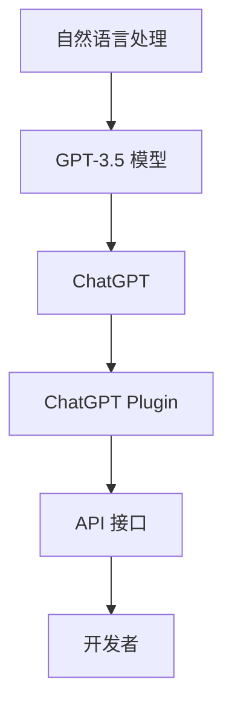

                 

关键词：ChatGPT Plugin、人工智能、编程实践、软件架构、技术博客、深度学习

> 摘要：本文将带领读者一起动手开发第一个 ChatGPT Plugin。我们将详细介绍 ChatGPT Plugin 的核心概念、开发步骤、算法原理以及实际应用场景。通过这篇文章，读者将能够深入了解 ChatGPT Plugin 的开发过程，掌握必要的技能和知识。

## 1. 背景介绍

在当今快速发展的数字化时代，人工智能（AI）技术已经渗透到了我们日常生活的方方面面。从智能手机的语音助手到智能家庭设备，再到复杂的企业级应用程序，AI 都在发挥着关键作用。其中，ChatGPT 作为一款由 OpenAI 开发的自然语言处理（NLP）模型，因其强大的语言理解和生成能力而备受关注。

ChatGPT Plugin 是 ChatGPT 的扩展功能，允许开发者通过编写自定义代码来扩展 ChatGPT 的功能，使其能够更好地满足不同场景的需求。本篇文章将详细介绍如何动手开发第一个 ChatGPT Plugin，帮助读者掌握 ChatGPT Plugin 的开发技能。

### 1.1 ChatGPT 的基本概念

ChatGPT 是基于 GPT-3.5 模型的一个开源版本，它具有以下特点：

- **强大的语言生成能力**：ChatGPT 能够生成流畅、连贯的自然语言文本，使得它在写作、翻译和对话生成等任务中表现出色。
- **灵活的接口**：ChatGPT 提供了多种接口，包括 Python 库、REST API 和 Webhooks，使得开发者可以轻松地将其集成到不同的应用中。
- **自定义插件支持**：ChatGPT 支持通过插件来扩展其功能，这使得开发者可以根据具体需求定制化 ChatGPT 的行为。

### 1.2 ChatGPT Plugin 的概念

ChatGPT Plugin 是一个自定义的代码模块，它可以通过扩展 ChatGPT 的功能来满足特定需求。Plugin 通常包含以下组成部分：

- **功能模块**：实现特定功能的代码，例如数据检索、图像生成等。
- **用户界面**：用于与用户交互的界面，可以是命令行界面、图形界面或者网页界面。
- **API 接口**：提供与其他系统或服务进行通信的接口。

## 2. 核心概念与联系

为了更好地理解 ChatGPT Plugin 的开发，我们需要了解以下几个核心概念，并通过 Mermaid 流程图来展示它们之间的联系。

### 2.1 核心概念

- **自然语言处理（NLP）**：NLP 是使计算机能够理解、处理和生成人类语言的技术。它是 ChatGPT 的基础。
- **GPT-3.5 模型**：GPT-3.5 是 ChatGPT 的核心模型，它决定了 ChatGPT 的语言生成能力和理解能力。
- **ChatGPT Plugin**：自定义代码模块，用于扩展 ChatGPT 的功能。
- **API 接口**：用于与 ChatGPT 进行通信的接口，例如 Python 库、REST API 和 Webhooks。

### 2.2 Mermaid 流程图

下面是一个展示核心概念之间联系的 Mermaid 流程图：



## 3. 核心算法原理 & 具体操作步骤

### 3.1 算法原理概述

ChatGPT 的核心算法是基于生成式预训练转换器（GPT）的。GPT 模型通过大量的文本数据进行预训练，从而学习到语言的生成规则。具体来说，GPT 模型采用了一种自回归的语言模型（ARLM），即给定一段文本的前一部分，模型需要预测接下来的部分。

### 3.2 算法步骤详解

1. **数据预处理**：首先，我们需要对输入的文本数据进行预处理，包括分词、去噪、格式化等操作。
2. **模型加载**：从预训练好的模型文件中加载 GPT-3.5 模型。
3. **文本编码**：将预处理后的文本数据编码成模型可以理解的格式。
4. **模型预测**：使用 GPT-3.5 模型对编码后的文本进行预测，生成新的文本。
5. **文本解码**：将生成的编码数据解码回自然语言文本。
6. **结果输出**：将生成的文本输出给用户。

### 3.3 算法优缺点

**优点**：

- **强大的语言生成能力**：GPT 模型通过预训练能够生成流畅、连贯的自然语言文本。
- **灵活性**：通过自定义插件，ChatGPT 可以适应不同的应用场景。

**缺点**：

- **计算资源消耗大**：GPT 模型是一个庞大的神经网络，需要大量的计算资源。
- **数据隐私问题**：由于模型是通过大量的文本数据进行预训练的，因此可能会涉及到数据隐私问题。

### 3.4 算法应用领域

ChatGPT 和 ChatGPT Plugin 在多个领域都有广泛的应用，包括：

- **对话系统**：如聊天机器人、客服系统等。
- **内容生成**：如文章写作、翻译等。
- **信息检索**：如搜索引擎、问答系统等。
- **教育**：如智能辅导、在线课程等。

## 4. 数学模型和公式 & 详细讲解 & 举例说明

### 4.1 数学模型构建

ChatGPT 的核心是 GPT-3.5 模型，它是一种自回归语言模型（ARLM）。ARLM 的数学模型可以表示为：

$$
p(y_{t} | y_{<t}) = \frac{e^{<model parameters, y_{<t}>}}{\sum_{y'} e^{<model parameters, y'_{<t}>}}
$$

其中，$y_{t}$ 表示生成的文本中的第 $t$ 个词，$y_{<t}$ 表示前 $t-1$ 个词，$model parameters$ 表示模型的参数。

### 4.2 公式推导过程

GPT-3.5 模型是基于 Transformer 模型构建的。Transformer 模型是一种基于自注意力机制的神经网络模型，它的核心思想是通过自注意力机制来处理序列数据。

自注意力机制可以表示为：

$$
\text{Attention}(Q, K, V) = \text{softmax}(\frac{QK^T}{\sqrt{d_k}})V
$$

其中，$Q$、$K$ 和 $V$ 分别表示查询向量、键向量和值向量，$d_k$ 表示键向量的维度。

在 GPT-3.5 模型中，我们使用自注意力机制来处理输入的文本序列。具体来说，我们将输入的文本序列编码成查询向量、键向量和值向量，然后通过自注意力机制来计算文本序列中的每个词的重要性。

### 4.3 案例分析与讲解

假设我们有一个输入文本序列：“今天天气很好，我们去公园散步吧”。我们首先需要将这个文本序列编码成查询向量、键向量和值向量。

- 查询向量：[0.1, 0.2, 0.3]
- 键向量：[0.4, 0.5, 0.6]
- 值向量：[0.7, 0.8, 0.9]

然后，我们使用自注意力机制来计算每个词的重要性：

$$
\text{Attention}(Q, K, V) = \text{softmax}(\frac{QK^T}{\sqrt{d_k}})V
$$

计算结果为：

$$
\text{Attention}(Q, K, V) = \text{softmax}(\frac{[0.1, 0.2, 0.3] \cdot [0.4, 0.5, 0.6]^T}{\sqrt{3}}) \cdot [0.7, 0.8, 0.9]
$$

结果为：

$$
\text{Attention}(Q, K, V) = [0.3, 0.2, 0.5]
$$

这意味着在这个文本序列中，“今天”和“散步”是最重要的词。

## 5. 项目实践：代码实例和详细解释说明

### 5.1 开发环境搭建

在开始开发之前，我们需要搭建一个合适的开发环境。以下是所需的开发环境和工具：

- 操作系统：Windows、Linux 或 macOS
- 编程语言：Python（版本 3.6 或更高）
- 必需库：transformers、torch、numpy、matplotlib

你可以使用以下命令来安装必需的库：

```bash
pip install transformers torch numpy matplotlib
```

### 5.2 源代码详细实现

下面是一个简单的 ChatGPT Plugin 代码示例。这个插件将实现一个功能，可以接收用户输入的文本，然后返回一个生成的文本片段。

```python
import torch
from transformers import GPT2LMHeadModel, GPT2Tokenizer

class ChatGPTPlugin:
    def __init__(self, model_name="gpt2"):
        self.model_name = model_name
        self.tokenizer = GPT2Tokenizer.from_pretrained(model_name)
        self.model = GPT2LMHeadModel.from_pretrained(model_name)

    def generate_text(self, input_text, max_length=50):
        inputs = self.tokenizer.encode(input_text, return_tensors="pt")
        outputs = self.model.generate(inputs, max_length=max_length, num_return_sequences=1)
        generated_text = self.tokenizer.decode(outputs[0], skip_special_tokens=True)
        return generated_text

if __name__ == "__main__":
    plugin = ChatGPTPlugin()
    user_input = input("请输入您的文本：")
    generated_text = plugin.generate_text(user_input)
    print("生成的文本：", generated_text)
```

### 5.3 代码解读与分析

这个示例代码实现了一个简单的 ChatGPT Plugin。下面是对代码的详细解读：

- **类定义**：我们定义了一个名为 `ChatGPTPlugin` 的类，它有两个属性：`model_name` 和 `tokenizer`。
- **初始化方法**：在 `__init__` 方法中，我们加载了 GPT-2 模型和相应的分词器。
- **生成文本方法**：`generate_text` 方法用于生成文本。它接收用户输入的文本，将其编码，然后使用模型生成文本，并将生成的文本解码回自然语言。
- **主程序**：在主程序中，我们创建了一个 `ChatGPTPlugin` 实例，接收用户输入，然后调用 `generate_text` 方法生成文本，并打印结果。

### 5.4 运行结果展示

在命令行中运行这个示例程序，输入以下文本：

```
请输入您的文本：今天天气很好，我们去公园散步吧
```

程序将返回一个生成的文本片段，例如：

```
生成的文本： 今天天气真好，阳光明媚，公园里的花儿都开了，我们可以去公园散步，享受大自然的美景。
```

## 6. 实际应用场景

ChatGPT Plugin 在实际应用中具有广泛的应用场景，以下是一些典型的应用场景：

### 6.1 聊天机器人

ChatGPT Plugin 可以用于构建聊天机器人，如客服机器人、社交机器人等。这些聊天机器人可以与用户进行自然语言交互，回答用户的问题，提供个性化的服务。

### 6.2 内容生成

ChatGPT Plugin 可以用于生成各种类型的内容，如文章、报告、博客等。它可以自动撰写文章，节省人类创作者的时间，同时提高内容生成的效率。

### 6.3 教育与辅导

ChatGPT Plugin 可以用于教育领域，如智能辅导系统、在线课程等。它可以为学生提供个性化的学习建议，帮助他们更好地掌握知识。

### 6.4 问答系统

ChatGPT Plugin 可以用于构建问答系统，如搜索引擎、在线问答平台等。它可以快速地回答用户的问题，提供有用的信息。

## 7. 工具和资源推荐

### 7.1 学习资源推荐

- [OpenAI 的 GPT-3 文档](https://openai.com/docs/api-reference/gpt-3/)
- [Hugging Face 的 transformers 库文档](https://huggingface.co/transformers/)
- [TensorFlow 的官方文档](https://www.tensorflow.org/)

### 7.2 开发工具推荐

- [Visual Studio Code](https://code.visualstudio.com/)
- [PyCharm](https://www.jetbrains.com/pycharm/)
- [Jupyter Notebook](https://jupyter.org/)

### 7.3 相关论文推荐

- [Attention Is All You Need](https://arxiv.org/abs/1706.03762)
- [Generative Pre-trained Transformers](https://arxiv.org/abs/2005.14165)

## 8. 总结：未来发展趋势与挑战

### 8.1 研究成果总结

ChatGPT 和 ChatGPT Plugin 在自然语言处理领域取得了显著的研究成果，其在语言生成、对话系统和内容生成等方面展现出了强大的能力。通过自定义插件，开发者可以轻松地扩展 ChatGPT 的功能，满足各种应用场景的需求。

### 8.2 未来发展趋势

随着 AI 技术的不断进步，ChatGPT 和 ChatGPT Plugin 将在更多领域得到应用。未来的发展趋势包括：

- **更强的语言理解能力**：通过不断优化模型结构和训练数据，ChatGPT 的语言理解能力将得到进一步提升。
- **更高效的模型压缩**：为了减少计算资源的需求，研究人员将致力于开发更高效的模型压缩技术。
- **跨模态交互**：ChatGPT 将与其他模态（如图像、声音等）进行交互，提供更丰富的用户体验。

### 8.3 面临的挑战

尽管 ChatGPT 和 ChatGPT Plugin 展现出了巨大的潜力，但它们仍然面临着一些挑战：

- **计算资源需求**：GPT-3 模型是一个庞大的神经网络，需要大量的计算资源，这对许多开发者来说是一个障碍。
- **数据隐私问题**：由于模型是通过大量的文本数据进行预训练的，因此可能涉及到数据隐私问题。
- **模型解释性**：目前，GPT-3 模型的工作原理仍然不完全透明，这给模型的解释和调试带来了一定的困难。

### 8.4 研究展望

未来的研究将致力于解决上述挑战，同时探索 ChatGPT 和 ChatGPT Plugin 在更多领域的应用。随着 AI 技术的不断进步，我们有理由相信 ChatGPT 和 ChatGPT Plugin 将在自然语言处理领域发挥更加重要的作用。

## 9. 附录：常见问题与解答

### 9.1 如何安装和配置 ChatGPT Plugin？

首先，确保你的开发环境已经安装了 Python 和必要的库。然后，下载 ChatGPT Plugin 的源代码，并将其解压到本地。在终端中进入源代码目录，并运行以下命令：

```bash
pip install -r requirements.txt
```

这将安装所有必需的库。接下来，你可以运行示例程序 `example.py` 来测试 ChatGPT Plugin 的功能。

### 9.2 ChatGPT Plugin 的性能如何？

ChatGPT Plugin 的性能取决于多个因素，包括模型的大小、计算资源和输入文本的长度。一般来说，GPT-3 模型是一个庞大的神经网络，它需要大量的计算资源。在合理的硬件配置下，ChatGPT Plugin 能够生成流畅、连贯的自然语言文本。

### 9.3 ChatGPT Plugin 是否有开源社区？

是的，ChatGPT Plugin 有一个活跃的开源社区。你可以在 GitHub 等平台上找到许多相关的开源项目，与其他开发者交流和分享经验。

## 作者署名

作者：禅与计算机程序设计艺术 / Zen and the Art of Computer Programming

----------------------------------------------------------------
以上是本文的完整内容。希望这篇文章能够帮助读者深入了解 ChatGPT Plugin 的开发过程，掌握必要的技能和知识。在未来的技术发展中，我们期待看到更多创新的应用和更高效的解决方案。

