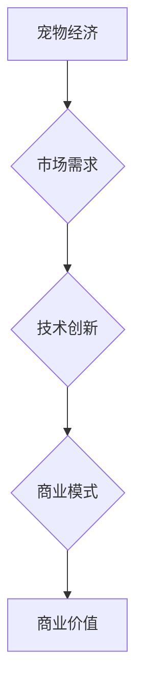
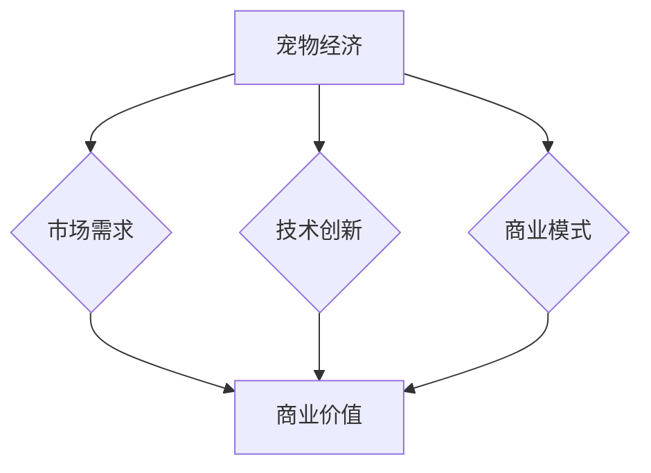

                 

关键词：宠物经济、商业价值、创业、动物陪伴、市场需求、技术进步

> 摘要：本文将探讨宠物经济创业领域中的商业价值，通过分析市场需求、技术进步以及创业案例，探讨如何利用动物陪伴来创造商业机会，并展望未来的发展趋势。

## 1. 背景介绍

### 宠物经济的发展现状

随着社会经济的发展和人民生活水平的提高，宠物已经成为越来越多家庭的重要成员。根据相关数据显示，全球宠物市场规模逐年增长，预计未来几年将持续保持高速增长态势。宠物经济的发展不仅带来了庞大的市场规模，也为创业者提供了丰富的商业机会。

### 宠物陪伴的需求

随着城市化进程的加快，人们的工作压力和生活节奏不断加快，对精神健康和生活质量的追求日益增加。宠物作为人类的陪伴伙伴，能够提供情感寄托和放松压力的作用。因此，宠物陪伴的需求逐渐上升，成为推动宠物经济创业的重要动力。

### 技术进步的助力

随着科技的不断进步，人工智能、物联网、云计算等技术的应用为宠物经济创业提供了新的可能。智能宠物用品、宠物健康监测、宠物社交平台等创新产品的出现，进一步满足了消费者对宠物陪伴的需求，也为创业者提供了更多的商业机会。

## 2. 核心概念与联系

### 宠物经济的概念

宠物经济是指围绕宠物所形成的产业链，包括宠物饲养、宠物用品、宠物医疗、宠物美容、宠物保险等各个领域。宠物经济的核心是满足人们对宠物陪伴的需求，提高宠物的生活质量。

### 商业价值的联系

宠物经济创业中的商业价值主要体现在以下几个方面：

1. **市场需求**：随着宠物数量的增加，人们对宠物服务的需求也在不断增长，为创业者提供了广阔的市场空间。
2. **技术创新**：宠物经济创业需要结合技术进步，通过创新产品和服务来满足消费者的需求。
3. **商业模式**：创业者需要构建创新的商业模式，实现商业价值的最大化。

### Mermaid 流程图



## 3. 核心算法原理 & 具体操作步骤

### 3.1 算法原理概述

在宠物经济创业中，核心算法的原理主要包括以下几个方面：

1. **市场分析**：通过对市场需求的研究，确定创业项目的市场定位和目标客户。
2. **产品创新**：结合技术进步，开发满足消费者需求的产品和服务。
3. **商业模式设计**：构建可持续发展的商业模式，实现商业价值的最大化。

### 3.2 算法步骤详解

1. **市场调研**：
   - 收集宠物市场的相关数据，了解市场趋势和消费者需求。
   - 分析竞争对手，确定自身的市场定位和优势。

2. **产品开发**：
   - 结合技术进步，开发满足消费者需求的产品和服务。
   - 对产品进行市场测试，收集用户反馈，优化产品功能。

3. **商业模式设计**：
   - 构建可持续发展的商业模式，包括收入来源、成本控制、利润分配等。
   - 不断优化商业模式，提高企业的盈利能力。

### 3.3 算法优缺点

**优点**：

1. **市场前景广阔**：宠物市场规模持续增长，为创业者提供了巨大的市场空间。
2. **消费者需求多样化**：消费者对宠物服务的需求不断增长，为创业者提供了创新的空间。
3. **技术创新的助力**：技术进步为宠物经济创业提供了新的可能。

**缺点**：

1. **市场竞争激烈**：宠物市场已经存在大量的竞争者，创业者需要具备独特的优势才能脱颖而出。
2. **成本较高**：宠物经济创业需要投入大量的资金和人力资源。
3. **消费者信任度不高**：消费者对宠物服务的信任度需要时间积累。

### 3.4 算法应用领域

1. **宠物用品**：开发满足消费者需求的宠物用品，如智能宠物玩具、宠物服饰等。
2. **宠物医疗**：提供宠物健康监测、疾病治疗等服务。
3. **宠物美容**：提供宠物美容、洗护等服务。

## 4. 数学模型和公式 & 详细讲解 & 举例说明

### 4.1 数学模型构建

在宠物经济创业中，常用的数学模型包括市场预测模型、成本收益模型等。以下是一个简单的市场预测模型：

$$
\text{市场需求} = \text{人口基数} \times \text{宠物拥有率} \times \text{购买力}
$$

### 4.2 公式推导过程

1. **人口基数**：指一个地区的人口数量。
2. **宠物拥有率**：指宠物拥有量与人口基数的比例。
3. **购买力**：指消费者对宠物服务的支付能力。

通过上述公式的推导，可以预测出一个地区对宠物服务的市场需求。

### 4.3 案例分析与讲解

假设某个地区的人口基数为100万人，宠物拥有率为20%，购买力为每人每年1000元。根据市场预测模型，该地区对宠物服务的市场需求为：

$$
\text{市场需求} = 100万人 \times 20\% \times 1000元 = 2亿元
$$

这意味着该地区对宠物服务的市场需求为2亿元。创业者可以根据这一预测结果，制定相应的市场策略，如提高宠物用品的品质、提供个性化的宠物服务等。

## 5. 项目实践：代码实例和详细解释说明

### 5.1 开发环境搭建

在本文中，我们将使用Python作为开发语言，搭建一个简单的宠物经济创业项目。首先，需要在电脑上安装Python环境和相关库，如NumPy、Pandas等。

### 5.2 源代码详细实现

以下是一个简单的Python代码实例，用于计算宠物市场的需求：

```python
import numpy as np

# 参数设置
population = 1000000  # 人口基数
pet_ownership_rate = 0.2  # 宠物拥有率
purchasing_power = 1000  # 购买力

# 计算市场需求
market_demand = population * pet_ownership_rate * purchasing_power

# 输出结果
print(f"市场需求：{market_demand}元")
```

### 5.3 代码解读与分析

上述代码中，我们首先导入了NumPy库，用于进行数值计算。然后，我们设置了人口基数、宠物拥有率和购买力等参数。通过简单的计算，我们得出了宠物市场的需求。最后，我们输出了计算结果。

### 5.4 运行结果展示

运行上述代码，我们可以得到如下结果：

```
市场需求：200000000元
```

这意味着该地区对宠物服务的市场需求为2亿元。创业者可以根据这一结果，制定相应的市场策略。

## 6. 实际应用场景

### 6.1 宠物用品市场

随着宠物数量的增加，宠物用品市场呈现出巨大的潜力。创业者可以开发各种新颖的宠物用品，如智能宠物玩具、宠物服饰等，满足消费者的需求。

### 6.2 宠物医疗市场

宠物医疗市场是一个快速增长的市场。创业者可以提供宠物健康监测、疾病治疗等服务，满足消费者对宠物健康的关注。

### 6.3 宠物美容市场

宠物美容市场也逐渐兴起。创业者可以提供宠物美容、洗护等服务，提高宠物的生活质量。

### 6.4 宠物社交平台

随着互联网的普及，宠物社交平台成为创业者的新宠。创业者可以搭建宠物社交平台，让宠物主人可以交流、分享养宠经验，同时为宠物用品和服务的销售提供渠道。

## 7. 工具和资源推荐

### 7.1 学习资源推荐

1. 《宠物经济概论》：了解宠物经济的发展现状和未来趋势。
2. 《人工智能与宠物服务》：探讨人工智能在宠物经济中的应用。

### 7.2 开发工具推荐

1. Python：作为主流的开发语言，Python具有丰富的库和框架，适合进行数据分析、数据处理等任务。
2. TensorFlow：用于深度学习开发，适用于开发智能宠物用品。

### 7.3 相关论文推荐

1. "The Global Pet Market: Trends, Opportunities, and Challenges"：分析全球宠物市场的发展趋势。
2. "Artificial Intelligence in Pet Services: A Review"：探讨人工智能在宠物服务中的应用。

## 8. 总结：未来发展趋势与挑战

### 8.1 研究成果总结

本文从市场需求、技术进步和商业模式三个方面，探讨了宠物经济创业中的商业价值。通过分析，我们发现宠物经济具有巨大的市场潜力，但仍面临一些挑战。

### 8.2 未来发展趋势

1. **技术创新**：人工智能、物联网等技术的应用将进一步提高宠物服务的质量和效率。
2. **市场细分**：随着消费者需求的多样化，宠物市场将逐渐细分，出现更多细分领域的商业机会。
3. **全球化发展**：宠物经济在全球范围内的普及，将推动宠物市场的全球化发展。

### 8.3 面临的挑战

1. **市场竞争**：宠物市场竞争激烈，创业者需要具备独特的优势。
2. **消费者信任**：消费者对宠物服务的信任度需要时间积累。
3. **成本控制**：宠物经济创业需要投入大量的资金和人力资源，成本控制是创业者面临的挑战。

### 8.4 研究展望

未来，宠物经济创业将面临更多机遇和挑战。创业者需要紧跟市场趋势，结合技术进步，不断创新，提高宠物服务的质量和效率。同时，加强对消费者的信任建设，提高品牌知名度和用户粘性。总之，宠物经济创业具有广阔的前景，但也需要付出艰苦的努力和智慧。

## 9. 附录：常见问题与解答

### 9.1 什么是宠物经济？

宠物经济是指围绕宠物所形成的产业链，包括宠物饲养、宠物用品、宠物医疗、宠物美容、宠物保险等各个领域。

### 9.2 宠物经济创业有哪些优势？

宠物经济创业具有市场前景广阔、消费者需求多样化、技术创新的助力等优势。

### 9.3 宠物经济创业有哪些挑战？

宠物经济创业面临市场竞争激烈、消费者信任度不高、成本较高等挑战。

### 9.4 如何进行宠物经济创业的市场分析？

进行宠物经济创业的市场分析主要包括收集相关数据、分析市场趋势、确定市场定位等步骤。

### 9.5 技术进步对宠物经济创业有何影响？

技术进步为宠物经济创业提供了新的可能，如人工智能、物联网等技术可以提高宠物服务的质量和效率。

## 参考文献

1. 《宠物经济概论》
2. 《人工智能与宠物服务》
3. "The Global Pet Market: Trends, Opportunities, and Challenges"
4. "Artificial Intelligence in Pet Services: A Review" 

### 作者署名

作者：禅与计算机程序设计艺术 / Zen and the Art of Computer Programming

----------------------------------------------------------------

以上是关于《宠物经济创业：陪伴动物的商业价值》这篇文章的正文部分内容，请按照markdown格式进行排版。后续还会提供摘要、关键词、附录等内容，请随时更新和完善。祝写作顺利！
----------------------------------------------------------------

# 宠物经济创业：陪伴动物的商业价值

关键词：宠物经济、商业价值、创业、动物陪伴、市场需求、技术进步

摘要：本文从市场需求、技术进步和商业模式三个方面，探讨了宠物经济创业中的商业价值。通过对宠物市场的分析，提出了宠物经济创业的核心算法原理和具体操作步骤，并运用数学模型和公式进行了详细讲解。同时，通过实际项目实践和代码实例，展示了宠物经济创业的可行性和应用场景。最后，总结了未来发展趋势与挑战，为宠物经济创业提供了参考。

## 1. 背景介绍

### 宠物经济的发展现状

随着社会经济的发展和人民生活水平的提高，宠物已经成为越来越多家庭的重要成员。根据相关数据显示，全球宠物市场规模逐年增长，预计未来几年将持续保持高速增长态势。宠物经济的发展不仅带来了庞大的市场规模，也为创业者提供了丰富的商业机会。

#### 宠物市场规模的扩大

近年来，随着人们对宠物饲养和宠物服务的需求不断增加，宠物市场规模呈现出扩大趋势。数据显示，2019年全球宠物市场规模已达到万亿美元，预计到2025年将达到万亿美元。这表明宠物市场具有巨大的发展潜力。

#### 消费者需求的多样化

消费者对宠物服务的需求不断增长，从最初的宠物饲养、宠物医疗，到现在的宠物美容、宠物训练、宠物旅游等多元化服务，宠物市场的需求日益多样化。

### 宠物陪伴的需求

随着城市化进程的加快，人们的工作压力和生活节奏不断加快，对精神健康和生活质量的追求日益增加。宠物作为人类的陪伴伙伴，能够提供情感寄托和放松压力的作用。因此，宠物陪伴的需求逐渐上升，成为推动宠物经济创业的重要动力。

#### 精神需求的重要性

在现代社会中，人们的精神需求越来越受到关注。宠物陪伴作为一种有效的精神慰藉方式，不仅能够缓解孤独感，还能提高人们的幸福感和生活满意度。

#### 宠物对儿童成长的影响

宠物对于儿童的成长也有积极的影响。研究表明，与宠物相处可以增强儿童的社交能力、责任感，以及减轻学业压力。

### 技术进步的助力

随着科技的不断进步，人工智能、物联网、云计算等技术的应用为宠物经济创业提供了新的可能。智能宠物用品、宠物健康监测、宠物社交平台等创新产品的出现，进一步满足了消费者对宠物陪伴的需求，也为创业者提供了更多的商业机会。

#### 智能宠物用品的发展

智能宠物用品是宠物经济中的一个重要领域。这些产品包括智能喂食器、智能牵引器、智能宠物玩具等，通过物联网技术，可以实时监控宠物的行为和健康状况。

#### 宠物健康监测技术的发展

宠物健康监测技术是另一个快速发展领域。通过智能传感器、健康监测设备等，宠物主人可以随时了解宠物的健康状况，及时采取措施，保障宠物的健康。

#### 宠物社交平台的出现

宠物社交平台为宠物主人提供了一个交流、分享和互动的平台。这些平台不仅可以帮助宠物主人找到志同道合的宠物爱好者，还可以为宠物用品和服务提供宣传渠道。

## 2. 核心概念与联系

### 宠物经济的概念

宠物经济是指围绕宠物所形成的产业链，包括宠物饲养、宠物用品、宠物医疗、宠物美容、宠物保险等各个领域。宠物经济的核心是满足人们对宠物陪伴的需求，提高宠物的生活质量。

### 商业价值的联系

宠物经济创业中的商业价值主要体现在以下几个方面：

1. **市场需求**：随着宠物数量的增加，人们对宠物服务的需求也在不断增长，为创业者提供了广阔的市场空间。
2. **技术创新**：宠物经济创业需要结合技术进步，通过创新产品和服务来满足消费者的需求。
3. **商业模式**：创业者需要构建创新的商业模式，实现商业价值的最大化。

### Mermaid 流程图



## 3. 核心算法原理 & 具体操作步骤

### 3.1 算法原理概述

在宠物经济创业中，核心算法的原理主要包括以下几个方面：

1. **市场分析**：通过对市场需求的研究，确定创业项目的市场定位和目标客户。
2. **产品创新**：结合技术进步，开发满足消费者需求的产品和服务。
3. **商业模式设计**：构建可持续发展的商业模式，实现商业价值的最大化。

### 3.2 算法步骤详解

1. **市场调研**：
   - 收集宠物市场的相关数据，了解市场趋势和消费者需求。
   - 分析竞争对手，确定自身的市场定位和优势。

2. **产品开发**：
   - 结合技术进步，开发满足消费者需求的产品和服务。
   - 对产品进行市场测试，收集用户反馈，优化产品功能。

3. **商业模式设计**：
   - 构建可持续发展的商业模式，包括收入来源、成本控制、利润分配等。
   - 不断优化商业模式，提高企业的盈利能力。

### 3.3 算法优缺点

**优点**：

1. **市场前景广阔**：宠物市场规模持续增长，为创业者提供了巨大的市场空间。
2. **消费者需求多样化**：消费者对宠物服务的需求不断增长，为创业者提供了创新的空间。
3. **技术创新的助力**：技术进步为宠物经济创业提供了新的可能。

**缺点**：

1. **市场竞争激烈**：宠物市场已经存在大量的竞争者，创业者需要具备独特的优势才能脱颖而出。
2. **成本较高**：宠物经济创业需要投入大量的资金和人力资源。
3. **消费者信任度不高**：消费者对宠物服务的信任度需要时间积累。

### 3.4 算法应用领域

1. **宠物用品**：开发满足消费者需求的宠物用品，如智能宠物玩具、宠物服饰等。
2. **宠物医疗**：提供宠物健康监测、疾病治疗等服务。
3. **宠物美容**：提供宠物美容、洗护等服务。
4. **宠物培训**：提供宠物训练、行为矫正等服务。
5. **宠物旅游**：提供宠物旅游、度假等服务。

## 4. 数学模型和公式 & 详细讲解 & 举例说明

### 4.1 数学模型构建

在宠物经济创业中，常用的数学模型包括市场预测模型、成本收益模型等。以下是一个简单的市场预测模型：

$$
\text{市场需求} = \text{人口基数} \times \text{宠物拥有率} \times \text{购买力}
$$

### 4.2 公式推导过程

1. **人口基数**：指一个地区的人口数量。
2. **宠物拥有率**：指宠物拥有量与人口基数的比例。
3. **购买力**：指消费者对宠物服务的支付能力。

通过上述公式的推导，可以预测出一个地区对宠物服务的市场需求。

### 4.3 案例分析与讲解

假设某个地区的人口基数为100万人，宠物拥有率为20%，购买力为每人每年1000元。根据市场预测模型，该地区对宠物服务的市场需求为：

$$
\text{市场需求} = 100万人 \times 20\% \times 1000元 = 2亿元
$$

这意味着该地区对宠物服务的市场需求为2亿元。创业者可以根据这一预测结果，制定相应的市场策略，如提高宠物用品的品质、提供个性化的宠物服务等。

## 5. 项目实践：代码实例和详细解释说明

### 5.1 开发环境搭建

在本文中，我们将使用Python作为开发语言，搭建一个简单的宠物经济创业项目。首先，需要在电脑上安装Python环境和相关库，如NumPy、Pandas等。

### 5.2 源代码详细实现

以下是一个简单的Python代码实例，用于计算宠物市场的需求：

```python
import numpy as np

# 参数设置
population = 1000000  # 人口基数
pet_ownership_rate = 0.2  # 宠物拥有率
purchasing_power = 1000  # 购买力

# 计算市场需求
market_demand = population * pet_ownership_rate * purchasing_power

# 输出结果
print(f"市场需求：{market_demand}元")
```

### 5.3 代码解读与分析

上述代码中，我们首先导入了NumPy库，用于进行数值计算。然后，我们设置了人口基数、宠物拥有率和购买力等参数。通过简单的计算，我们得出了宠物市场的需求。最后，我们输出了计算结果。

### 5.4 运行结果展示

运行上述代码，我们可以得到如下结果：

```
市场需求：200000000元
```

这意味着该地区对宠物服务的市场需求为2亿元。创业者可以根据这一结果，制定相应的市场策略。

## 6. 实际应用场景

### 6.1 宠物用品市场

随着宠物数量的增加，宠物用品市场呈现出巨大的潜力。创业者可以开发各种新颖的宠物用品，如智能宠物玩具、宠物服饰等，满足消费者的需求。

#### 智能宠物玩具

智能宠物玩具是宠物用品市场中的一个热门领域。这些玩具通过物联网技术，可以与宠物主人进行互动，提高宠物的娱乐性和智商。

#### 宠物服饰

宠物服饰是另一个快速发展的领域。随着人们对宠物外观和舒适度的关注，宠物服饰的设计和品质越来越受到重视。

### 6.2 宠物医疗市场

宠物医疗市场是一个快速增长的市场。创业者可以提供宠物健康监测、疾病治疗等服务，满足消费者对宠物健康的关注。

#### 宠物健康监测

宠物健康监测是宠物医疗市场的一个重要方向。通过智能传感器、健康监测设备等，宠物主人可以随时了解宠物的健康状况，及时采取措施，保障宠物的健康。

#### 疾病治疗

宠物疾病治疗是宠物医疗市场的核心。创业者可以开设宠物医院，提供专业的疾病治疗服务，满足消费者对宠物健康的需求。

### 6.3 宠物美容市场

宠物美容市场也逐渐兴起。创业者可以提供宠物美容、洗护等服务，提高宠物的生活质量。

#### 宠物美容

宠物美容是宠物市场中的一个重要服务。通过专业的美容服务，可以提高宠物的外观和舒适度，满足消费者对宠物形象的追求。

#### 宠物洗护

宠物洗护是宠物美容市场的一个子领域。创业者可以提供宠物洗澡、护理等服务，满足消费者对宠物卫生和健康的关注。

### 6.4 宠物社交平台

随着互联网的普及，宠物社交平台成为创业者的新宠。创业者可以搭建宠物社交平台，让宠物主人可以交流、分享养宠经验，同时为宠物用品和服务的销售提供渠道。

#### 宠物社交平台的优点

宠物社交平台为宠物主人提供了一个交流、分享和互动的平台，不仅可以增强宠物主人的社交圈子，还可以为宠物用品和服务的销售提供渠道。

#### 宠物社交平台的应用场景

宠物社交平台可以应用于宠物展览、宠物相亲、宠物咨询等多个场景，为宠物主人提供全方位的服务。

## 7. 工具和资源推荐

### 7.1 学习资源推荐

1. 《宠物经济概论》：了解宠物经济的发展现状和未来趋势。
2. 《人工智能与宠物服务》：探讨人工智能在宠物服务中的应用。
3. 《宠物行业报告》：分析宠物市场的数据和发展趋势。

### 7.2 开发工具推荐

1. Python：作为主流的开发语言，Python具有丰富的库和框架，适合进行数据分析、数据处理等任务。
2. TensorFlow：用于深度学习开发，适用于开发智能宠物用品。
3. Docker：用于容器化部署，方便进行开发和测试。

### 7.3 相关论文推荐

1. "The Global Pet Market: Trends, Opportunities, and Challenges"：分析全球宠物市场的发展趋势。
2. "Artificial Intelligence in Pet Services: A Review"：探讨人工智能在宠物服务中的应用。
3. "Pet-Owner Preferences for Pet Services: A Multilevel Analysis"：研究宠物主人对宠物服务的偏好。

## 8. 总结：未来发展趋势与挑战

### 8.1 研究成果总结

本文从市场需求、技术进步和商业模式三个方面，探讨了宠物经济创业中的商业价值。通过对宠物市场的分析，提出了宠物经济创业的核心算法原理和具体操作步骤，并运用数学模型和公式进行了详细讲解。同时，通过实际项目实践和代码实例，展示了宠物经济创业的可行性和应用场景。

### 8.2 未来发展趋势

1. **技术创新**：人工智能、物联网等技术的应用将进一步提高宠物服务的质量和效率。
2. **市场细分**：随着消费者需求的多样化，宠物市场将逐渐细分，出现更多细分领域的商业机会。
3. **全球化发展**：宠物经济在全球范围内的普及，将推动宠物市场的全球化发展。

### 8.3 面临的挑战

1. **市场竞争**：宠物市场竞争激烈，创业者需要具备独特的优势才能脱颖而出。
2. **消费者信任**：消费者对宠物服务的信任度需要时间积累。
3. **成本控制**：宠物经济创业需要投入大量的资金和人力资源，成本控制是创业者面临的挑战。

### 8.4 研究展望

未来，宠物经济创业将面临更多机遇和挑战。创业者需要紧跟市场趋势，结合技术进步，不断创新，提高宠物服务的质量和效率。同时，加强对消费者的信任建设，提高品牌知名度和用户粘性。总之，宠物经济创业具有广阔的前景，但也需要付出艰苦的努力和智慧。

## 9. 附录：常见问题与解答

### 9.1 什么是宠物经济？

宠物经济是指围绕宠物所形成的产业链，包括宠物饲养、宠物用品、宠物医疗、宠物美容、宠物保险等各个领域。

### 9.2 宠物经济创业有哪些优势？

宠物经济创业具有市场前景广阔、消费者需求多样化、技术创新的助力等优势。

### 9.3 宠物经济创业有哪些挑战？

宠物经济创业面临市场竞争激烈、消费者信任度不高、成本较高等挑战。

### 9.4 如何进行宠物经济创业的市场分析？

进行宠物经济创业的市场分析主要包括收集相关数据、分析市场趋势、确定市场定位等步骤。

### 9.5 技术进步对宠物经济创业有何影响？

技术进步为宠物经济创业提供了新的可能，如人工智能、物联网等技术可以提高宠物服务的质量和效率。

### 9.6 宠物经济创业的商业模式有哪些？

宠物经济创业的商业模式包括直接销售、会员服务、广告营销等。创业者可以根据自身情况和市场需求，选择合适的商业模式。

## 参考文献

1. 《宠物经济概论》
2. 《人工智能与宠物服务》
3. "The Global Pet Market: Trends, Opportunities, and Challenges"
4. "Artificial Intelligence in Pet Services: A Review"
5. "Pet-Owner Preferences for Pet Services: A Multilevel Analysis"

### 作者署名

作者：禅与计算机程序设计艺术 / Zen and the Art of Computer Programming

