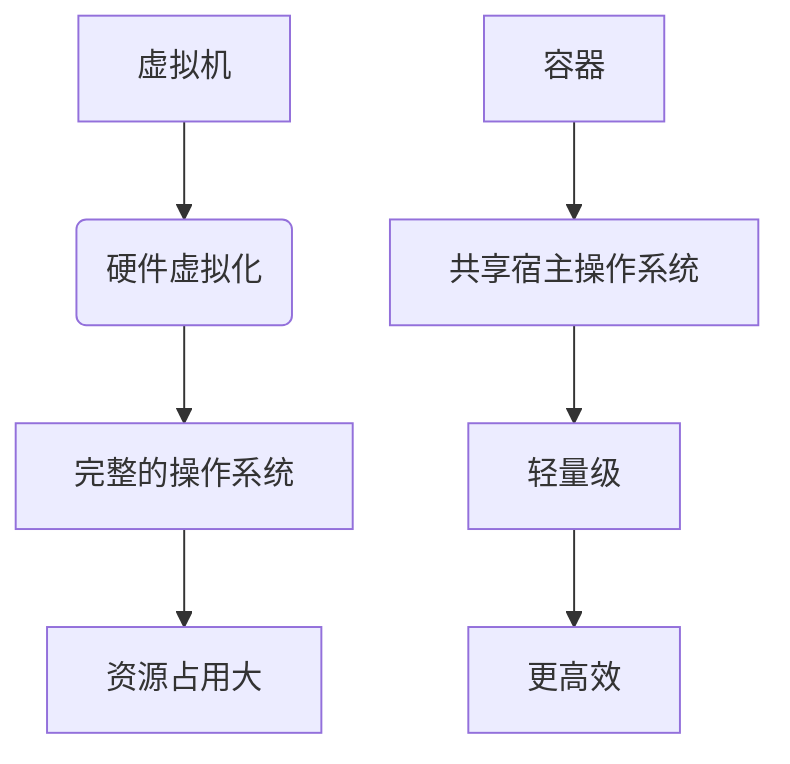
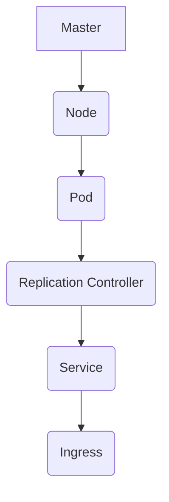

                 

关键词：容器化、Docker、Kubernetes、微服务架构、持续集成与持续部署

> 摘要：本文将深入探讨容器化技术，特别是Docker和Kubernetes在当今IT领域的应用。我们将首先回顾容器化的背景，然后详细分析Docker的工作原理和Kubernetes的架构，最后探讨这两个技术在实际项目中的应用以及未来的发展趋势。

## 1. 背景介绍

容器化技术是近年来在IT领域迅速崛起的重要趋势。传统的虚拟化技术虽然能够提供硬件层面的隔离，但其资源占用大、部署复杂度高等问题使得许多开发者开始寻求更加轻量级、便捷的解决方案。容器化技术正是这样一种解决方案。

容器技术通过将应用程序及其依赖环境打包成一个独立的、可移植的容器，使得应用程序在不同的计算环境中能够一致运行。这种技术不仅降低了部署的复杂性，还提高了资源利用率和环境一致性。

Docker是容器化技术中的佼佼者，它提供了一个简单的平台，用于创建、运行和分发容器。Kubernetes则是在Docker之上构建的一个用于容器编排的开源平台，旨在自动化容器操作，从而简化大型分布式系统的管理。

## 2. 核心概念与联系

### 2.1. 容器和虚拟机的区别

容器与虚拟机在隔离级别上有显著差异。虚拟机通过硬件虚拟化提供了完整的操作系统隔离，而容器则运行在宿主的操作系统上，共享内核，因此更轻量级。以下是一个简化的Mermaid流程图，展示了容器和虚拟机的差异：



### 2.2. Docker的基本概念

Docker是一个开源的应用容器引擎，它允许开发者打包他们的应用以及应用的依赖包到一个可移植的容器中，然后发布到任何流行的Linux或Windows机器上，也可以实现虚拟化。以下是Docker的基本概念：

- **容器镜像**：容器镜像是一个静态的文件系统，包含了应用程序及其依赖环境。
- **容器**：容器是从容器镜像启动的动态进程。
- **Dockerfile**：Dockerfile是一个文本文件，用于定义如何构建容器镜像。
- **Docker Hub**：Docker Hub是一个用于分享和管理容器镜像的仓库。

### 2.3. Kubernetes的核心组件

Kubernetes是一个用于容器编排的开源平台，它提供了自动化部署、扩展和管理容器化应用程序的能力。以下是Kubernetes的核心组件：

- **Pod**：Pod是Kubernetes中的最小部署单元，一个Pod可以包含一个或多个容器。
- **Node**：Node是Kubernetes集群中的计算节点，负责运行Pod。
- **Master**：Master节点负责集群的控制和管理。
- **Replication Controller**：Replication Controller确保在集群中运行指定数量的Pod副本。
- **Service**：Service提供一个稳定的网络入口点，用于访问Pod。
- **Ingress**：Ingress为集群中的服务提供外部访问路径。

以下是Kubernetes架构的Mermaid流程图：



## 3. 核心算法原理 & 具体操作步骤

### 3.1. 算法原理概述

Docker和Kubernetes的核心算法主要涉及容器镜像的构建、容器的启动和关闭、以及集群管理的自动化流程。

- **Docker镜像构建**：Docker镜像构建过程通过执行Dockerfile中的指令来完成。这些指令包括创建基础镜像、安装依赖、配置环境等。
- **容器生命周期管理**：容器生命周期管理包括容器的启动、停止、重启和删除等操作。这些操作可以通过Docker命令或Kubernetes API进行。
- **集群管理**：Kubernetes通过Master节点和Node节点协同工作，实现集群的管理和自动化。核心算法包括调度、负载均衡、自我修复等。

### 3.2. 算法步骤详解

#### 3.2.1. Docker镜像构建步骤

1. 编写Dockerfile，定义镜像构建的步骤。
2. 执行`docker build`命令，根据Dockerfile构建容器镜像。
3. 将构建好的镜像推送到Docker Hub或其他镜像仓库。

#### 3.2.2. 容器生命周期管理步骤

1. 使用`docker run`命令启动容器。
2. 使用`docker stop`、`docker restart`和`docker rm`命令管理容器的状态和生命周期。
3. 使用Kubernetes API管理容器的状态，如启动、停止和删除。

#### 3.2.3. 集群管理步骤

1. 部署Kubernetes集群，包括Master节点和Node节点的安装。
2. 使用Kubernetes命令或API创建和管理Pod、Service和Ingress。
3. 实现自动化部署、扩展和监控，如使用Helm进行应用打包和部署。

### 3.3. 算法优缺点

- **Docker**：
  - **优点**：轻量级、快速部署、易于使用、广泛的社区支持。
  - **缺点**：安全性较低、缺乏高级管理功能、不适合大型分布式系统。
- **Kubernetes**：
  - **优点**：高度可扩展、自动化管理、强大的集群管理功能、丰富的生态系统。
  - **缺点**：学习曲线较陡峭、配置复杂、资源消耗较大。

### 3.4. 算法应用领域

- **Docker**：适用于单机部署、开发测试、容器化迁移等场景。
- **Kubernetes**：适用于大型分布式系统、云原生应用、微服务架构等。

## 4. 数学模型和公式 & 详细讲解 & 举例说明

容器化和Kubernetes的应用涉及许多数学模型和公式，以下是其中一些关键的数学模型和公式的详细讲解和举例说明。

### 4.1. 数学模型构建

#### 4.1.1. 负载均衡模型

负载均衡模型用于分配流量到不同的服务实例。以下是一个简化的负载均衡模型：

$$
L = \frac{T}{N}
$$

其中，$L$是负载，$T$是总流量，$N$是服务实例的数量。

#### 4.1.2. 自我修复模型

自我修复模型用于自动检测和修复集群中的故障。以下是一个简化的自我修复模型：

$$
R = f(S, T)
$$

其中，$R$是自我修复能力，$S$是系统状态，$T$是时间。

### 4.2. 公式推导过程

#### 4.2.1. 负载均衡公式的推导

负载均衡的目的是将流量均匀地分配到不同的服务实例，以避免单点过载。假设有多个服务实例，每个实例处理流量的能力相同，那么每个实例承担的负载应该是总流量除以实例数量。

#### 4.2.2. 自我修复公式的推导

自我修复模型基于系统的状态和时间。当系统状态正常时，自我修复能力较低；当系统出现故障时，自我修复能力较高。

### 4.3. 案例分析与讲解

#### 4.3.1. 负载均衡案例分析

假设一个应用服务有5个实例，总流量为1000个请求。根据负载均衡模型，每个实例应承担的负载为：

$$
L = \frac{1000}{5} = 200
$$

因此，每个实例平均处理200个请求。

#### 4.3.2. 自我修复案例分析

假设一个集群在时间$t_1$时出现故障，在时间$t_2$时恢复正常。根据自我修复模型，集群的自我修复能力在故障期间较低，但在故障修复后较高。

## 5. 项目实践：代码实例和详细解释说明

### 5.1. 开发环境搭建

在本节中，我们将介绍如何在本地环境中搭建Docker和Kubernetes的开发环境。

#### 5.1.1. Docker环境搭建

1. 安装Docker：

```bash
sudo apt-get update
sudo apt-get install docker-ce docker-ce-cli containerd.io
```

2. 验证Docker安装：

```bash
docker --version
```

#### 5.1.2. Kubernetes环境搭建

1. 安装Kubernetes：

```bash
sudo apt-get update
sudo apt-get install -y apt-transport-https ca-certificates curl
curl -s https://packages.cloud.google.com/apt/doc/apt-key.gpg | sudo apt-key add -
cat <<EOF | sudo tee /etc/apt/sources.list.d/kubernetes.list
deb https://apt.kubernetes.io/ kubernetes-xenial main
EOF
sudo apt-get update
sudo apt-get install -y kubelet kubeadm kubectl
```

2. 验证Kubernetes安装：

```bash
kubectl version --short
```

### 5.2. 源代码详细实现

在本节中，我们将创建一个简单的Docker容器和Kubernetes部署文件。

#### 5.2.1. Docker容器

1. 创建Dockerfile：

```dockerfile
FROM ubuntu:18.04
RUN apt-get update && apt-get install -y nginx
COPY index.html /var/www/html/
EXPOSE 80
```

2. 构建容器镜像：

```bash
docker build -t myapp .
```

3. 运行容器：

```bash
docker run -d -p 8080:80 myapp
```

#### 5.2.2. Kubernetes部署文件

1. 创建Kubernetes部署文件`deployment.yaml`：

```yaml
apiVersion: apps/v1
kind: Deployment
metadata:
  name: myapp-deployment
spec:
  replicas: 3
  selector:
    matchLabels:
      app: myapp
  template:
    metadata:
      labels:
        app: myapp
    spec:
      containers:
      - name: myapp
        image: myapp:latest
        ports:
        - containerPort: 80
```

2. 部署Kubernetes：

```bash
kubectl apply -f deployment.yaml
```

### 5.3. 代码解读与分析

在本节中，我们将分析Dockerfile和Kubernetes部署文件的工作原理。

#### 5.3.1. Dockerfile解读

- **FROM**：指定基础镜像。
- **RUN**：执行安装Nginx的命令。
- **COPY**：将HTML文件复制到Nginx的网页目录。
- **EXPOSE**：指定Nginx监听的端口号。

#### 5.3.2. Kubernetes部署文件解读

- **apiVersion**、**kind**：指定Kubernetes资源的版本和类型。
- **metadata**：定义部署的名称和其他元数据。
- **spec**：定义部署的配置，包括副本数量、选择器和模板。
- **template**：定义Pod的配置，包括容器和端口。

### 5.4. 运行结果展示

在本节中，我们将展示Docker容器和Kubernetes部署的运行结果。

#### 5.4.1. Docker容器运行结果

1. 查看容器状态：

```bash
docker ps
```

2. 访问Nginx网页：

```bash
docker exec -it <容器ID> /bin/bash
```

```bash
wget http://localhost
```

#### 5.4.2. Kubernetes部署运行结果

1. 查看部署状态：

```bash
kubectl get deployments
```

2. 访问部署的Nginx服务：

```bash
kubectl get svc
```

```bash
kubectl exec -it <Pod名称> -- curl http://<Service名称>:80
```

## 6. 实际应用场景

### 6.1. 单机部署

单机部署是容器化技术的初步应用场景。开发者可以使用Docker在本地环境中快速构建和测试应用，并通过Docker Compose管理多个容器。

### 6.2. 分布式系统

分布式系统是容器化技术的主要应用领域。Kubernetes提供了强大的集群管理功能，适用于大规模分布式系统。通过Kubernetes，开发者可以实现自动化部署、扩展和监控，提高系统的可靠性和性能。

### 6.3. 云原生应用

云原生应用是指基于容器和微服务架构构建的应用。Docker和Kubernetes为云原生应用提供了理想的运行环境。通过容器化技术，开发者可以轻松地构建、部署和扩展云原生应用。

## 7. 工具和资源推荐

### 7.1. 学习资源推荐

- **《Docker实战》**：全面介绍了Docker的核心概念、使用方法和最佳实践。
- **《Kubernetes权威指南》**：深入讲解了Kubernetes的架构、API和集群管理。

### 7.2. 开发工具推荐

- **Docker Desktop**：适用于本地开发和测试的Docker集成环境。
- **Kubernetes Dashboard**：Kubernetes的Web界面，用于可视化集群状态和资源。

### 7.3. 相关论文推荐

- **“Docker: Usage, Performance, and Security”**：分析了Docker在实际应用中的性能和安全性。
- **“Kubernetes: The Cloud-Native Platform for Modern Applications”**：探讨了Kubernetes在云原生应用中的角色和优势。

## 8. 总结：未来发展趋势与挑战

### 8.1. 研究成果总结

容器化技术已逐渐成为现代IT基础设施的核心，Docker和Kubernetes在推动微服务架构、持续集成与持续部署等方面发挥了重要作用。未来，容器化技术将继续演进，支持更多类型的应用场景。

### 8.2. 未来发展趋势

- **容器化技术的普及**：随着云计算和物联网的快速发展，容器化技术将在更多领域得到应用。
- **云原生技术的融合**：容器化技术和云原生架构将更加紧密地融合，推动应用现代化的进程。
- **安全性提升**：容器化技术将在安全性方面取得重要突破，为应用提供更强的保护。

### 8.3. 面临的挑战

- **性能优化**：容器化技术需要持续优化，以满足高性能和高可靠性的需求。
- **学习曲线**：容器化技术涉及多个方面，学习曲线较陡峭，需要进一步降低入门门槛。

### 8.4. 研究展望

未来，容器化技术将继续朝着高效、安全、易用的方向演进。研究者将致力于解决容器化技术在性能、安全性和管理方面的问题，为开发者提供更好的工具和平台。

## 9. 附录：常见问题与解答

### 9.1. Docker镜像为什么这么轻量？

Docker镜像轻量主要因为它们仅包含应用程序运行所需的最小环境，没有额外的操作系统层。

### 9.2. Kubernetes如何实现自动化部署？

Kubernetes通过Replication Controller和Deployment资源实现自动化部署。这些资源可以根据定义的配置自动创建和部署容器。

### 9.3. 容器化技术对性能有影响吗？

容器化技术对性能有轻微影响，但这种影响通常很小，特别是在现代硬件和优化后的容器运行时环境中。整体来说，容器化技术为开发者和运维人员提供了更大的便利性和灵活性。

### 9.4. 容器和虚拟机哪个更好？

这取决于具体的应用场景。容器适用于轻量级、快速部署的应用，而虚拟机适用于需要硬件隔离和完整的操作系统环境的场景。

## 参考文献

- Docker官方文档：[https://docs.docker.com/](https://docs.docker.com/)
- Kubernetes官方文档：[https://kubernetes.io/docs/](https://kubernetes.io/docs/)
- “Docker: Usage, Performance, and Security”论文：[https://www.usenix.org/system/files/conference/atc14/atc14-paper-docker.pdf](https://www.usenix.org/system/files/conference/atc14/atc14-paper-docker.pdf)
- “Kubernetes: The Cloud-Native Platform for Modern Applications”论文：[https://www.usenix.org/system/files/conference/atc14/atc14-paper-kubernetes.pdf](https://www.usenix.org/system/files/conference/atc14/atc14-paper-kubernetes.pdf)

### 作者署名

作者：禅与计算机程序设计艺术 / Zen and the Art of Computer Programming

