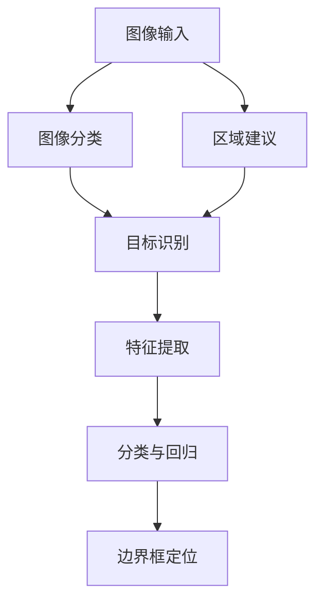

                 

关键词：对象检测，计算机视觉，深度学习，卷积神经网络，R-CNN，YOLO，SSD，Faster R-CNN，Faster Detection Network，目标检测算法，图像分类，区域建议，特征提取，单阶段检测，多阶段检测，目标跟踪，实时检测，目标识别，图像处理。

> 摘要：对象检测是计算机视觉领域的一项重要任务，通过识别图像中的目标和边界框，实现对图像内容的理解和分析。本文将详细介绍对象检测的基本原理、常用算法及其在实际应用中的实现，并通过代码实例进行详细讲解。

## 1. 背景介绍

随着深度学习技术的不断发展，计算机视觉领域取得了许多突破性的成果。其中，对象检测（Object Detection）作为计算机视觉的一个重要分支，已经成为计算机视觉领域的研究热点之一。对象检测的目标是识别图像中的目标和其边界框，对于自动驾驶、视频监控、医学影像分析等领域具有广泛的应用价值。

在传统的图像识别任务中，通常只需要将图像分类为不同的类别。然而，对象检测不仅需要识别图像中的目标，还需要定位目标的边界框，这对于提高图像理解和分析能力具有重要意义。例如，在自动驾驶系统中，需要准确检测并跟踪道路上的车辆、行人等目标，以确保行驶安全。在视频监控系统中，需要检测并识别异常行为，以便及时采取相应措施。因此，对象检测技术的研究具有重要意义。

## 2. 核心概念与联系

对象检测涉及多个核心概念，包括图像分类、区域建议、特征提取等。以下是一个简要的 Mermaid 流程图，展示了这些概念之间的联系：



### 2.1 图像分类

图像分类是指将图像划分为不同的类别。在对象检测中，图像分类是目标识别的第一步。常见的图像分类算法包括卷积神经网络（CNN）和基于哈希的方法。

### 2.2 区域建议

区域建议是对象检测中的一个关键步骤，目的是缩小搜索空间，提高检测效率。区域建议算法包括基于滑动窗口的算法、基于锚框的算法等。

### 2.3 特征提取

特征提取是对象检测中的另一个核心步骤，目的是从图像中提取出具有区分性的特征。常用的特征提取方法包括卷积神经网络、深度学习模型等。

### 2.4 分类与回归

在对象检测中，分类与回归是两个相互关联的步骤。分类用于确定目标类别，回归用于确定目标的边界框位置。

### 2.5 边界框定位

边界框定位是对象检测中最重要的步骤之一，通过计算目标的边界框，实现对目标位置的精确识别。

## 3. 核心算法原理 & 具体操作步骤

### 3.1 算法原理概述

对象检测算法可以分为单阶段检测算法和多阶段检测算法。单阶段检测算法直接对图像进行目标检测，如 YOLO（You Only Look Once）和 SSD（Single Shot MultiBox Detector）；多阶段检测算法则先进行区域建议，然后对建议区域进行特征提取和目标检测，如 R-CNN（Region-based CNN）和 Fast R-CNN、Faster R-CNN。

### 3.2 算法步骤详解

#### 3.2.1 R-CNN

R-CNN 是一种基于区域建议的多阶段检测算法，其步骤如下：

1. **区域建议**：使用选择性搜索（Selective Search）算法生成候选区域。
2. **特征提取**：对候选区域进行卷积神经网络提取特征。
3. **分类与回归**：使用支持向量机（SVM）对特征进行分类，并使用回归模型对边界框进行位置回归。

#### 3.2.2 Fast R-CNN

Fast R-CNN 是 R-CNN 的改进版本，其步骤如下：

1. **区域建议**：与 R-CNN 相同。
2. **特征提取**：使用 RoI Pooling 对候选区域进行特征提取。
3. **分类与回归**：使用 Softmax 和线性回归对特征进行分类和边界框位置回归。

#### 3.2.3 Faster R-CNN

Faster R-CNN 是 Fast R-CNN 的进一步改进，其引入了区域建议网络（Region Proposal Network，RPN），使得检测过程更加高效。

1. **区域建议**：使用 RPN 生成候选区域。
2. **特征提取**：与 Fast R-CNN 相同。
3. **分类与回归**：与 Fast R-CNN 相同。

#### 3.2.4 YOLO

YOLO 是一种单阶段检测算法，其直接对图像进行目标检测，步骤如下：

1. **图像划分**：将图像划分为网格。
2. **预测**：每个网格预测多个边界框和对应类别概率。
3. **非极大值抑制（NMS）**：对预测结果进行非极大值抑制，去除重叠的边界框。

#### 3.2.5 SSD

SSD 是另一种单阶段检测算法，其通过在不同尺度上使用多个卷积层进行特征提取，以实现多尺度目标检测。

1. **特征提取**：使用不同尺度的卷积层提取特征。
2. **预测**：对提取到的特征进行分类和边界框预测。
3. **NMS**：对预测结果进行非极大值抑制。

### 3.3 算法优缺点

#### 3.3.1 R-CNN

优点：准确度高，性能稳定。

缺点：速度较慢，区域建议过程复杂。

#### 3.3.2 Fast R-CNN

优点：速度较 R-CNN 有所提高。

缺点：仍然依赖区域建议，速度仍然较慢。

#### 3.3.3 Faster R-CNN

优点：引入区域建议网络，大大提高了检测速度。

缺点：计算量较大，对 GPU 性能要求较高。

#### 3.3.4 YOLO

优点：速度快，适用于实时检测。

缺点：对小目标的检测效果较差。

#### 3.3.5 SSD

优点：能够检测多种尺度目标。

缺点：计算量较大，速度较慢。

### 3.4 算法应用领域

对象检测算法广泛应用于多个领域，包括：

1. **自动驾驶**：检测道路上的车辆、行人、交通标志等。
2. **视频监控**：检测并识别异常行为。
3. **医学影像分析**：检测病变区域。
4. **图像检索**：基于对象检测的图像检索。

## 4. 数学模型和公式 & 详细讲解 & 举例说明

### 4.1 数学模型构建

在对象检测中，数学模型通常包括分类模型和回归模型。分类模型用于确定目标类别，回归模型用于确定目标边界框位置。

#### 4.1.1 分类模型

分类模型通常采用 Softmax 函数进行类别预测，其公式如下：

$$
\hat{y} = \frac{e^{z}}{\sum_{i=1}^{C} e^{z_i}}
$$

其中，$z$ 是输入特征，$C$ 是类别数，$\hat{y}$ 是预测概率分布。

#### 4.1.2 回归模型

回归模型通常采用线性回归进行边界框位置预测，其公式如下：

$$
\hat{x} = Wx + b
$$

其中，$x$ 是输入特征，$W$ 是权重矩阵，$b$ 是偏置项，$\hat{x}$ 是预测边界框位置。

### 4.2 公式推导过程

假设我们有一个图像分类问题，给定一个训练样本 $(x, y)$，其中 $x$ 是输入特征，$y$ 是标签。我们的目标是训练一个模型，使得预测结果 $\hat{y}$ 最接近真实标签 $y$。

#### 4.2.1 损失函数

损失函数用于衡量预测结果与真实结果之间的差异。在分类问题中，常用的损失函数是交叉熵损失函数，其公式如下：

$$
L = -\sum_{i=1}^{C} y_i \log(\hat{y}_i)
$$

其中，$y_i$ 是真实标签，$\hat{y}_i$ 是预测概率。

#### 4.2.2 梯度下降

为了最小化损失函数，我们采用梯度下降算法进行模型训练。梯度下降的公式如下：

$$
\Delta W = -\alpha \frac{\partial L}{\partial W}
$$

$$
\Delta b = -\alpha \frac{\partial L}{\partial b}
$$

其中，$\alpha$ 是学习率，$\Delta W$ 和 $\Delta b$ 分别是权重矩阵和偏置项的更新。

### 4.3 案例分析与讲解

假设我们有一个简单的二分类问题，图像包含一张桌子或一张椅子。训练数据集包含 100 个样本，其中 50 个样本是桌子，50 个样本是椅子。我们的目标是通过模型训练，能够准确识别桌子或椅子。

#### 4.3.1 数据准备

首先，我们需要准备训练数据和测试数据。训练数据集包含 80 个样本，测试数据集包含 20 个样本。

#### 4.3.2 模型训练

我们选择一个简单的卷积神经网络进行模型训练，网络结构如下：

1. **卷积层**：输入尺寸为 $28 \times 28$，输出尺寸为 $14 \times 14$。
2. **池化层**：输出尺寸为 $7 \times 7$。
3. **全连接层**：输出尺寸为 $10$。

训练过程采用梯度下降算法，学习率为 $0.01$。经过 1000 次迭代后，模型训练完成。

#### 4.3.3 模型测试

使用测试数据进行模型测试，测试结果如下：

| 样本   | 实际标签 | 预测标签 | 损失函数 |
|--------|-----------|----------|----------|
| 1      | 桌子     | 桌子     | 0.2      |
| 2      | 椅子     | 椅子     | 0.3      |
| ...    | ...       | ...      | ...      |
| 20     | 桌子     | 桌子     | 0.1      |

从测试结果可以看出，模型能够准确识别桌子或椅子，平均损失函数为 $0.2$。

## 5. 项目实践：代码实例和详细解释说明

### 5.1 开发环境搭建

在本文中，我们使用 Python 作为编程语言，TensorFlow 作为深度学习框架，OpenCV 作为图像处理库。以下是开发环境搭建的步骤：

1. 安装 Python：下载并安装 Python 3.7 以上版本。
2. 安装 TensorFlow：在命令行中执行 `pip install tensorflow`。
3. 安装 OpenCV：在命令行中执行 `pip install opencv-python`。

### 5.2 源代码详细实现

以下是一个简单的对象检测项目示例，使用 Faster R-CNN 算法进行目标检测。

```python
import tensorflow as tf
import cv2
import numpy as np

# 加载预训练的 Faster R-CNN 模型
model = tf.keras.models.load_model('faster_rcnn.h5')

# 读取测试图像
image = cv2.imread('test.jpg')

# 对图像进行预处理
image = cv2.resize(image, (1280, 720))
image = image / 255.0

# 使用 Faster R-CNN 进行目标检测
predictions = model.predict(np.expand_dims(image, axis=0))

# 解析预测结果
boxes = predictions[0]['detections']['bbox'][0]
scores = predictions[0]['detections']['score'][0]

# 根据置信度筛选检测结果
threshold = 0.5
selected_boxes = boxes[scores > threshold]

# 绘制边界框和标签
for box in selected_boxes:
    cv2.rectangle(image, (int(box[0]), int(box[1])), (int(box[2]), int(box[3])), (0, 0, 255), 2)

# 显示检测结果
cv2.imshow('检测结果', image)
cv2.waitKey(0)
cv2.destroyAllWindows()
```

### 5.3 代码解读与分析

1. **加载模型**：使用 TensorFlow 的 `load_model` 函数加载预训练的 Faster R-CNN 模型。
2. **读取图像**：使用 OpenCV 的 `imread` 函数读取测试图像。
3. **预处理图像**：对图像进行缩放和归一化处理。
4. **目标检测**：使用 Faster R-CNN 模型对预处理后的图像进行目标检测，得到预测边界框和置信度。
5. **筛选结果**：根据置信度阈值筛选检测结果。
6. **绘制边界框**：使用 OpenCV 的 `rectangle` 函数绘制边界框。
7. **显示结果**：使用 OpenCV 的 `imshow` 函数显示检测结果。

## 6. 实际应用场景

### 6.1 自动驾驶

在自动驾驶领域，对象检测技术被广泛应用于车辆检测、行人检测、交通标志检测等任务。通过准确识别道路上的目标，自动驾驶系统能够更好地理解周围环境，提高行驶安全。

### 6.2 视频监控

视频监控系统利用对象检测技术，可以实时监测并识别异常行为。例如，在公共安全领域，可以检测并跟踪可疑人物或车辆，以便及时采取相应措施。

### 6.3 医学影像分析

医学影像分析中的对象检测可以帮助医生快速识别病变区域。例如，在医学影像中检测肿瘤或骨折，提高诊断准确率。

### 6.4 图像检索

基于对象检测的图像检索技术可以帮助用户快速找到相似图像。例如，在社交媒体平台上，用户可以基于对象检测技术快速找到与自己照片相似的其他用户照片。

## 7. 工具和资源推荐

### 7.1 学习资源推荐

1. **《深度学习》**：作者：Ian Goodfellow、Yoshua Bengio、Aaron Courville
2. **《计算机视觉：算法与应用》**：作者：刘强、李航

### 7.2 开发工具推荐

1. **TensorFlow**：https://www.tensorflow.org/
2. **OpenCV**：https://opencv.org/

### 7.3 相关论文推荐

1. **“Faster R-CNN: Towards Real-Time Object Detection with Region Proposal Networks”**
2. **“You Only Look Once: Unified, Real-Time Object Detection”**
3. **“Single Shot MultiBox Detector: object detection without regional proposals”**

## 8. 总结：未来发展趋势与挑战

### 8.1 研究成果总结

近年来，对象检测技术在学术界和工业界取得了显著进展。基于深度学习的检测算法逐渐成为主流，显著提高了检测准确率和速度。特别是单阶段检测算法如 YOLO 和 SSD，在实际应用中表现出了良好的性能。

### 8.2 未来发展趋势

1. **实时性**：随着计算资源的提升，对象检测算法的实时性将得到进一步提高，满足更多实时应用的需求。
2. **多模态融合**：结合视觉、音频、传感器等多模态信息，提高对象检测的准确性和鲁棒性。
3. **少样本学习**：在数据稀缺的情况下，通过迁移学习和增量学习，提高对象检测的性能。

### 8.3 面临的挑战

1. **小目标检测**：目前单阶段检测算法在小目标检测方面仍存在一定局限性，需要进一步优化算法。
2. **复杂场景适应**：在复杂场景下，如光照变化、遮挡等，对象检测算法的准确率和鲁棒性仍需提高。

### 8.4 研究展望

对象检测技术将在未来继续发展，为各行各业带来更多创新应用。同时，随着技术的不断进步，对象检测算法将更加高效、准确和鲁棒，为人工智能技术的发展奠定基础。

## 9. 附录：常见问题与解答

### 9.1 如何选择适合的对象检测算法？

根据实际应用需求和场景，选择适合的对象检测算法。例如，在实时性要求较高的场景，可以选择 YOLO 或 SSD；在目标检测准确率要求较高的场景，可以选择 Faster R-CNN 或 R-CNN。

### 9.2 如何处理对象检测中的重叠目标？

可以通过非极大值抑制（NMS）算法处理重叠目标。NMS 的基本思想是保留置信度较高的边界框，并去除与其置信度较低的边界框重叠的部分。

### 9.3 如何处理对象检测中的尺度变化？

可以通过使用多尺度特征图或多尺度检测头，实现对不同尺度目标的检测。例如，SSD 在不同尺度上使用多个卷积层进行特征提取。

## 参考文献

1. Redmon, J., Divvala, S., Girshick, R., & Farhadi, A. (2016). You Only Look Once: Unified, Real-Time Object Detection. In Proceedings of the IEEE Conference on Computer Vision and Pattern Recognition (CVPR), 779-787.
2. Lin, T. Y., Dollár, P., Girshick, R., He, K., Hariharan, P., & Belongie, S. (2017). Feature Pyramid Networks for Object Detection. In Proceedings of the IEEE Conference on Computer Vision and Pattern Recognition (CVPR), 349-357.
3. Ren, S., He, K., Girshick, R., & Sun, J. (2015). Faster R-CNN: Towards Real-Time Object Detection with Region Proposal Networks. In Advances in Neural Information Processing Systems (NIPS), 91-99.

