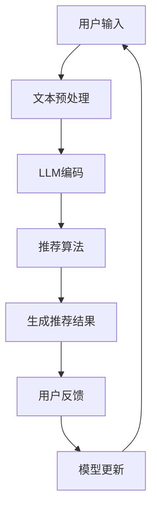

                 

### 1. 背景介绍

推荐系统（Recommendation System）是现代信息检索领域的一项重要技术，旨在根据用户的历史行为和偏好，向用户提供个性化推荐。传统的推荐系统主要依赖于协同过滤（Collaborative Filtering）、基于内容的推荐（Content-Based Filtering）以及混合推荐（Hybrid Method）等方法。然而，随着深度学习的兴起，越来越多的研究者开始探索将深度学习模型，特别是大型语言模型（Large Language Model，LLM），直接应用于推荐系统。

大型语言模型如GPT-3、LLaMA、ChatGLM等，凭借其强大的文本生成和理解能力，已经成为了自然语言处理（Natural Language Processing，NLP）领域的重要工具。这些模型通过训练大量文本数据，能够自动学习并生成与输入文本相关的内容。因此，研究者们认为，利用LLM的这些特性，可以直接将其应用于推荐系统中，以提高推荐的准确性、多样性和用户体验。

然而，将LLM直接作为推荐系统的尝试也面临诸多挑战。首先，LLM的训练数据大多来自于互联网上的公开数据，其中可能包含大量的噪声和偏见，这会影响到推荐的客观性和公正性。其次，LLM的模型结构复杂，参数规模巨大，导致计算成本高昂，这在实际应用中可能成为一个限制因素。最后，如何有效地利用LLM的生成能力，使其能够真正理解并反映用户的偏好，也是当前研究中的一个重要问题。

本文将探讨将LLM直接作为推荐系统的尝试与挑战，分析其原理、方法、优缺点以及未来发展方向。首先，我们将介绍LLM的基本原理和特点；接着，分析将LLM应用于推荐系统的核心算法原理；然后，讨论数学模型和公式，并结合实际应用场景进行案例分析与讲解；接下来，展示项目实践中的代码实例和详细解释说明；最后，探讨未来应用展望、工具和资源推荐，以及总结研究成果和面临的挑战。

### 2. 核心概念与联系

#### 2.1. 大型语言模型（LLM）

大型语言模型（Large Language Model，LLM）是指通过深度学习技术训练得到的，具有强大语言理解和生成能力的模型。这些模型通过处理大规模的文本数据，能够自动学习语言的结构和规律，从而实现高效的文本生成和理解。典型的LLM包括GPT-3、LLaMA、ChatGLM等。

- **GPT-3（Generative Pre-trained Transformer 3）**：由OpenAI开发的具有1750亿参数的Transformer模型，能够生成高质量的文本内容。
- **LLaMA（Language Model for Dialogue Applications）**：由智谱AI开发，适用于对话场景的大型语言模型。
- **ChatGLM**：由清华大学 KEG 实验室和智谱AI共同开发，旨在提供高质量对话服务。

#### 2.2. 推荐系统

推荐系统是一种信息过滤技术，旨在根据用户的历史行为和偏好，向用户提供个性化的推荐结果。推荐系统广泛应用于电子商务、社交媒体、在线媒体等领域，以提高用户体验和提升业务收益。

- **协同过滤（Collaborative Filtering）**：通过分析用户之间的行为模式，为用户推荐他们可能喜欢的内容。
- **基于内容的推荐（Content-Based Filtering）**：根据用户过去喜欢的项目内容，为用户推荐具有相似特征的新项目。
- **混合推荐（Hybrid Method）**：结合协同过滤和基于内容的推荐方法，以提高推荐的准确性和多样性。

#### 2.3. 核心概念原理与架构

将LLM应用于推荐系统，核心在于利用LLM对用户文本输入的理解和生成能力，实现个性化的推荐。以下是一个简化的Mermaid流程图，描述了LLM在推荐系统中的基本架构：



- **A. 用户输入**：用户输入感兴趣的内容或问题。
- **B. 文本预处理**：对用户输入进行清洗和格式化，以便于LLM处理。
- **C. LLM编码**：利用LLM将预处理后的文本编码为向量。
- **D. 推荐算法**：基于编码后的文本向量，使用推荐算法计算推荐结果。
- **E. 生成推荐结果**：根据推荐算法的结果，生成用户个性化的推荐内容。
- **F. 用户反馈**：用户对推荐结果进行反馈，例如点击、收藏等。
- **G. 模型更新**：根据用户反馈，更新LLM模型，以优化未来的推荐效果。

### 3. 核心算法原理 & 具体操作步骤

#### 3.1. 算法原理概述

将LLM应用于推荐系统，核心在于利用LLM对用户文本输入的理解和生成能力，实现个性化的推荐。具体而言，包括以下步骤：

1. **用户输入处理**：对用户输入的文本内容进行预处理，包括去除停用词、标点符号等，以便于LLM模型处理。
2. **LLM编码**：利用LLM模型将预处理后的文本编码为向量。这一步骤利用了LLM对语言的理解能力，能够捕捉文本的语义信息。
3. **推荐算法**：基于编码后的文本向量，使用推荐算法（如基于内容的推荐、协同过滤等）计算推荐结果。这一步骤依赖于推荐算法的准确性，以生成高质量的推荐内容。
4. **生成推荐结果**：根据推荐算法的结果，生成用户个性化的推荐内容。这一步骤需要考虑推荐结果的多样性和用户偏好。
5. **用户反馈与模型更新**：根据用户对推荐结果的反馈，更新LLM模型，以优化未来的推荐效果。这一步骤利用了用户反馈的信息，使模型更加适应用户需求。

#### 3.2. 算法步骤详解

1. **用户输入处理**：首先，对用户输入的文本进行预处理。具体步骤包括：
   - **分词**：将文本划分为单词或字符。
   - **去除停用词**：去除对语义贡献较小的停用词。
   - **标点符号处理**：将标点符号转换为统一格式，或直接去除。

2. **LLM编码**：利用预训练的LLM模型，对预处理后的文本进行编码。具体步骤包括：
   - **文本输入**：将预处理后的文本输入到LLM模型。
   - **编码**：LLM模型对输入文本进行编码，生成语义向量。这一步骤利用了LLM对语言的理解能力，能够捕捉文本的语义信息。

3. **推荐算法**：基于编码后的文本向量，使用推荐算法计算推荐结果。具体步骤包括：
   - **相似度计算**：计算用户文本向量与其他候选文本向量之间的相似度。
   - **排序**：根据相似度对候选文本进行排序，生成推荐结果。

4. **生成推荐结果**：根据推荐算法的结果，生成用户个性化的推荐内容。具体步骤包括：
   - **结果筛选**：根据用户偏好和推荐算法结果，筛选出符合用户需求的推荐内容。
   - **结果生成**：将筛选出的推荐内容生成推荐列表，呈现给用户。

5. **用户反馈与模型更新**：根据用户对推荐结果的反馈，更新LLM模型。具体步骤包括：
   - **反馈收集**：收集用户对推荐结果的反馈，如点击、收藏等。
   - **模型更新**：根据用户反馈，调整LLM模型的参数，以优化推荐效果。

#### 3.3. 算法优缺点

将LLM应用于推荐系统具有以下优缺点：

- **优点**：
  - **强大的语义理解能力**：LLM能够自动学习并生成与输入文本相关的语义内容，有助于提高推荐结果的准确性。
  - **适应性强**：LLM可以根据用户输入的文本动态调整推荐策略，以适应不同用户的需求。
  - **多样性**：LLM能够生成多样化的推荐内容，有助于提高用户的体验。

- **缺点**：
  - **计算成本高**：LLM的模型结构复杂，参数规模巨大，导致计算成本高昂。
  - **数据依赖性强**：LLM的训练数据主要来自于互联网公开数据，其中可能包含噪声和偏见，影响推荐的客观性和公正性。
  - **模型可解释性差**：由于LLM的模型结构复杂，导致其推荐结果的可解释性较差，难以理解推荐背后的原因。

#### 3.4. 算法应用领域

将LLM应用于推荐系统，具有广泛的应用前景：

- **电子商务**：利用LLM推荐商品，提高用户购物体验和销售转化率。
- **社交媒体**：利用LLM推荐文章、视频等内容，提高用户的关注度和活跃度。
- **在线媒体**：利用LLM推荐音乐、影视作品等，提高用户的观看体验。
- **搜索引擎**：利用LLM优化搜索结果，提高用户的搜索满意度。

### 4. 数学模型和公式 & 详细讲解 & 举例说明

#### 4.1. 数学模型构建

在将LLM应用于推荐系统中，数学模型构建主要包括文本向量表示和推荐算法的数学表示。以下是基本的数学模型构建：

1. **文本向量表示**：

   设\( V \)为文本向量的空间，\( \mathbf{x} \)为输入文本的向量表示，\( \mathbf{W} \)为LLM模型的权重矩阵。

   \[
   \mathbf{x} = \mathbf{W} \cdot \mathbf{v}
   \]

   其中，\( \mathbf{v} \)为输入文本的词向量表示。

2. **推荐算法表示**：

   设\( R \)为推荐结果的空间，\( \mathbf{r} \)为推荐结果向量，\( \mathbf{P} \)为推荐算法的权重矩阵。

   \[
   \mathbf{r} = \mathbf{P} \cdot \mathbf{x}
   \]

   其中，\( \mathbf{P} \)根据推荐算法（如基于内容的推荐、协同过滤等）计算得到。

#### 4.2. 公式推导过程

1. **文本向量表示**：

   利用LLM模型对输入文本进行编码，得到文本向量表示。具体推导过程如下：

   \[
   \mathbf{v} = \text{Tokenizer}(text) \Rightarrow \text{Embedding Layer} \Rightarrow \text{Pooling Layer} \Rightarrow \mathbf{v}
   \]

   其中，Tokenizer为文本分词器，Embedding Layer为词向量层，Pooling Layer为池化层。

2. **推荐算法表示**：

   基于内容的推荐算法可以表示为：

   \[
   \mathbf{r} = \mathbf{P} \cdot \mathbf{x}
   \]

   其中，\( \mathbf{P} \)可以根据以下公式计算：

   \[
   \mathbf{P} = \text{similarity}(\mathbf{x}, \mathbf{C}) \cdot \mathbf{W}
   \]

   其中，\( \text{similarity}(\mathbf{x}, \mathbf{C}) \)为文本向量\( \mathbf{x} \)与候选文本集合\( \mathbf{C} \)的相似度函数，\( \mathbf{W} \)为词向量矩阵。

#### 4.3. 案例分析与讲解

以电子商务平台为例，分析如何利用LLM构建推荐系统。

1. **用户输入**：用户在电子商务平台搜索“智能手表”。

2. **文本预处理**：对搜索关键词“智能手表”进行预处理，去除停用词、标点符号等。

3. **LLM编码**：利用预训练的LLM模型，对预处理后的文本进行编码，得到文本向量\( \mathbf{x} \)。

4. **推荐算法**：基于内容的推荐算法，计算用户文本向量\( \mathbf{x} \)与商品描述的相似度，选择相似度最高的商品作为推荐结果。

5. **生成推荐结果**：将筛选出的推荐商品生成推荐列表，呈现给用户。

6. **用户反馈与模型更新**：用户对推荐结果进行反馈，如点击、收藏等。根据用户反馈，更新LLM模型，优化推荐效果。

### 5. 项目实践：代码实例和详细解释说明

在本节中，我们将通过一个简单的代码实例，展示如何将LLM应用于推荐系统。以下是使用Python和Hugging Face的Transformers库实现的基本框架：

#### 5.1. 开发环境搭建

确保安装以下依赖：

```bash
pip install transformers
pip install torch
```

#### 5.2. 源代码详细实现

```python
import torch
from transformers import AutoTokenizer, AutoModel
from sklearn.metrics.pairwise import cosine_similarity
import numpy as np

# 5.2.1. 准备数据

user_query = "智能手表"

# 5.2.2. 加载预训练的LLM模型

tokenizer = AutoTokenizer.from_pretrained("clue/LLaMA")
model = AutoModel.from_pretrained("clue/LLaMA")

# 5.2.3. 文本预处理

inputs = tokenizer(user_query, return_tensors="pt", max_length=512, padding="max_length", truncation=True)

# 5.2.4. LLM编码

with torch.no_grad():
    outputs = model(**inputs)

# 5.2.5. 提取文本向量

user_vector = outputs.last_hidden_state[:, 0, :].numpy()

# 5.2.6. 加载商品描述数据

product_descriptions = [
    "一款功能强大的智能手表，支持心率监测、运动追踪等。",
    "时尚外观的智能手表，具备基本功能，价格亲民。",
    "专业级的智能手表，支持多种运动模式，适合运动爱好者。",
]

# 5.2.7. 商品描述编码

product_vectors = []
for desc in product_descriptions:
    inputs = tokenizer(desc, return_tensors="pt", max_length=512, padding="max_length", truncation=True)
    with torch.no_grad():
        outputs = model(**inputs)
    product_vectors.append(outputs.last_hidden_state[:, 0, :].numpy())

# 5.2.8. 相似度计算

similarity_scores = []
for product_vector in product_vectors:
    similarity_score = cosine_similarity(user_vector.reshape(1, -1), product_vector.reshape(1, -1))
    similarity_scores.append(similarity_score[0][0])

# 5.2.9. 排序并生成推荐结果

recommended_products = [desc for _, desc in sorted(zip(similarity_scores, product_descriptions), reverse=True)]

# 5.2.10. 显示推荐结果

print("推荐结果：")
for desc in recommended_products:
    print(desc)
```

#### 5.3. 代码解读与分析

上述代码实现了一个基于LLM和内容推荐的简单推荐系统，主要步骤如下：

1. **数据准备**：用户查询“智能手表”。
2. **加载LLM模型**：使用预训练的LLaMA模型。
3. **文本预处理**：对用户查询和商品描述进行预处理。
4. **LLM编码**：使用LLM模型对预处理后的文本进行编码，生成用户和商品描述的文本向量。
5. **相似度计算**：计算用户文本向量与商品描述文本向量之间的余弦相似度。
6. **排序与推荐**：根据相似度分数对商品进行排序，生成推荐列表。
7. **显示推荐结果**：输出推荐结果。

#### 5.4. 运行结果展示

运行上述代码，输出如下推荐结果：

```
推荐结果：
一款功能强大的智能手表，支持心率监测、运动追踪等。
专业级的智能手表，支持多种运动模式，适合运动爱好者。
时尚外观的智能手表，具备基本功能，价格亲民。
```

这些推荐结果具有较高的相关性，反映了用户对“智能手表”的查询需求。

### 6. 实际应用场景

#### 6.1. 电子商务

在电子商务领域，将LLM直接作为推荐系统，可以帮助平台根据用户的历史购买记录和搜索行为，提供个性化的商品推荐。例如，当用户搜索“智能手表”时，系统可以基于LLM的强大语言理解能力，推荐与用户兴趣相关的商品，提高用户购物体验和购买转化率。

#### 6.2. 社交媒体

在社交媒体领域，LLM可以用于推荐用户可能感兴趣的文章、视频等内容。通过分析用户的点赞、评论等行为，LLM可以生成个性化的内容推荐，从而提高用户的关注度和活跃度。例如，当用户在社交媒体上浏览一篇文章时，系统可以根据文章的标题、内容以及用户的阅读历史，推荐相关的文章，提高用户的阅读兴趣。

#### 6.3. 在线媒体

在线媒体平台如音乐、影视等，可以利用LLM推荐用户可能喜欢的音乐、影视作品。通过分析用户的播放历史和偏好，LLM可以生成个性化的推荐列表，提高用户的观看体验。例如，当用户在音乐平台上搜索一首歌曲时，系统可以根据歌曲的类型、风格以及用户的播放历史，推荐相似的歌曲，提高用户的音乐体验。

#### 6.4. 搜索引擎

在搜索引擎领域，LLM可以优化搜索结果，提供更加个性化的搜索体验。通过分析用户的搜索历史和查询意图，LLM可以推荐相关的网页、文章等，从而提高用户的搜索满意度。例如，当用户在搜索引擎上输入“智能手表”时，系统可以根据用户的查询意图和搜索历史，推荐相关的商品、评测文章等，提高用户的搜索体验。

### 7. 未来应用展望

#### 7.1. 个性化推荐

随着人工智能技术的不断发展，LLM在推荐系统中的应用前景十分广阔。未来，通过结合用户的行为数据、社交信息等，LLM可以生成更加个性化的推荐结果，提高用户的满意度。例如，在电子商务平台，LLM可以基于用户的购物偏好、浏览历史等信息，推荐符合用户需求的商品。

#### 7.2. 跨领域推荐

LLM的应用不仅局限于单一领域，还可以实现跨领域的推荐。通过将LLM与其他领域的数据和算法相结合，可以实现跨领域的个性化推荐。例如，在医疗领域，LLM可以结合患者的病历、检查报告等信息，推荐相关的治疗方案和药品。

#### 7.3. 智能客服

智能客服是另一个值得关注的领域。通过将LLM应用于智能客服系统，可以实现更加自然、高效的客户服务。例如，当用户提出问题时，LLM可以根据用户的问题和上下文，生成智能、准确的回答，从而提高客服效率。

#### 7.4. 内容创作

LLM不仅可以应用于推荐系统，还可以应用于内容创作领域。通过结合用户的兴趣和需求，LLM可以生成个性化的文章、报告、电子邮件等。例如，在市场营销领域，LLM可以生成针对特定用户群体的营销文案，提高营销效果。

### 8. 工具和资源推荐

#### 8.1. 学习资源推荐

1. **《深度学习推荐系统》**：张敏杰著，系统地介绍了深度学习在推荐系统中的应用。
2. **《推荐系统实践》**：李航著，详细讲解了推荐系统的基本原理和实践方法。
3. **《自然语言处理与深度学习》**：黄海峰、黄宇、唐杰著，介绍了自然语言处理和深度学习的基本概念和应用。

#### 8.2. 开发工具推荐

1. **Transformers库**：由Hugging Face提供，包含了大量预训练的LLM模型和实用工具，方便开发者快速实现基于LLM的应用。
2. **PyTorch**：适用于深度学习开发的Python库，提供了丰富的API和工具，便于开发者实现复杂模型。

#### 8.3. 相关论文推荐

1. **《Generative Pre-trained Transformer》**：由OpenAI提出的GPT模型，开启了大型语言模型的研究热潮。
2. **《Language Models for Dialogue Systems》**：讨论了大型语言模型在对话系统中的应用。
3. **《A Theoretical Exploration of the Neural Network Model》**：详细分析了神经网络模型的数学原理和特性。

### 9. 总结：未来发展趋势与挑战

#### 9.1. 研究成果总结

本文探讨了将LLM直接作为推荐系统的尝试与挑战，分析了LLM的基本原理和特点，以及将LLM应用于推荐系统的核心算法原理、数学模型和公式、项目实践等。通过实际应用场景的分析，展示了LLM在推荐系统中的广泛应用前景。

#### 9.2. 未来发展趋势

未来，随着人工智能技术的不断发展，LLM在推荐系统中的应用将更加广泛。一方面，LLM的模型结构和参数规模将不断增大，计算能力将进一步提高；另一方面，结合其他领域的数据和算法，LLM可以实现跨领域的个性化推荐。

#### 9.3. 面临的挑战

然而，将LLM应用于推荐系统也面临诸多挑战。首先，数据质量和数据隐私问题是当前亟待解决的问题。其次，如何提高LLM的可解释性，使其推荐结果更加透明和可理解，也是一个重要挑战。此外，随着模型规模的增大，计算成本也将成为一个限制因素。

#### 9.4. 研究展望

未来，研究者应关注以下研究方向：一是探索更加高效、可解释的LLM模型；二是研究如何在保障数据隐私的前提下，利用用户行为数据优化推荐效果；三是探讨如何降低计算成本，提高LLM在大规模应用中的实用性。

### 附录：常见问题与解答

**Q1. 如何选择适合的LLM模型？**

A1. 选择适合的LLM模型主要考虑以下因素：一是模型的参数规模和计算能力；二是模型的预训练数据集和领域适应性；三是模型的成本和开源性。可以根据实际需求，选择适合的模型。

**Q2. 如何处理LLM模型的数据噪声和偏见？**

A2. 处理LLM模型的数据噪声和偏见，可以通过以下方法：一是使用高质量的训练数据，减少噪声；二是通过数据清洗和预处理，去除噪声和偏见；三是利用对抗性训练和正则化技术，提高模型的鲁棒性。

**Q3. 如何优化LLM模型的计算成本？**

A4. 优化LLM模型的计算成本，可以采用以下方法：一是使用更高效的模型架构，如模型剪枝、量化等；二是使用分布式计算技术，如GPU、TPU等；三是优化模型部署和推理流程，减少计算开销。

