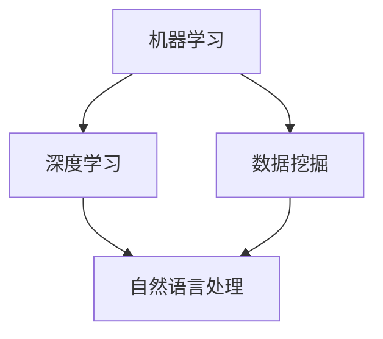

                 

在这个快速发展的技术时代，算法工程师无疑是科技领域的核心人物。小米作为全球知名的高科技企业，其对算法工程师的招聘要求自然也相当严格。本文将针对小米2025届社招算法工程师的面试真题进行详细解析，帮助各位求职者更好地应对面试挑战。

## 关键词

* 小米
* 算法工程师
* 面试真题
* 解析
* 求职准备

## 摘要

本文旨在为有意向加入小米的算法工程师提供面试真题的深度解析，包括核心概念、算法原理、数学模型、项目实践以及实际应用场景等。通过本文，读者将能够更全面地了解小米对算法工程师的专业要求，并掌握面试所需的实战技能。

## 1. 背景介绍

随着人工智能和大数据技术的蓬勃发展，算法工程师在各个行业的应用越来越广泛。小米作为全球领先的智能硬件和电子产品制造商，其对算法工程师的需求也日益增加。小米的算法工程师主要涉及机器学习、数据挖掘、自然语言处理等领域，负责研发创新的技术解决方案，提升产品的智能化水平和用户体验。

### 1.1 小米的招聘要求

小米对算法工程师的招聘要求通常包括以下几个方面：

- **学历背景**：硕士及以上学历，计算机科学、人工智能、统计学等相关专业。
- **技能要求**：熟悉机器学习、深度学习、数据挖掘等相关算法，具备扎实的编程基础和数学知识。
- **工作经验**：有相关项目经验者优先，尤其是在互联网、人工智能领域有实际应用经验者。
- **沟通能力**：具备良好的团队合作能力和跨部门沟通能力。

### 1.2 面试流程

小米的面试流程通常包括在线测评、技术面试和HR面试三个环节：

- **在线测评**：通过在线测评平台进行基本编程能力和逻辑思维测试。
- **技术面试**：与面试官进行面对面的技术讨论，主要考察算法设计和解决问题的能力。
- **HR面试**：了解求职者的职业规划、团队协作能力以及个人综合素质。

## 2. 核心概念与联系

为了更好地理解面试真题，我们首先需要明确一些核心概念和其相互之间的关系。以下是相关概念及Mermaid流程图：



### 2.1 机器学习与深度学习

机器学习（Machine Learning，ML）是一种人工智能（AI）的分支，通过数据驱动的方法，使计算机能够自动学习和改进性能。深度学习（Deep Learning，DL）是机器学习的一个重要分支，它使用多层神经网络进行数据建模。

### 2.2 数据挖掘与自然语言处理

数据挖掘（Data Mining，DM）是一种从大量数据中提取有用信息和知识的技术。自然语言处理（Natural Language Processing，NLP）是计算机科学和语言学的交叉领域，旨在使计算机能够理解、生成和处理人类语言。

## 3. 核心算法原理 & 具体操作步骤

在面试中，算法原理和具体操作步骤是考察的重点。以下将详细介绍一些常见算法及其原理：

### 3.1 算法原理概述

- **线性回归**：通过最小化损失函数来预测连续值。
- **决策树**：基于特征划分数据，构建树状结构进行分类或回归。
- **随机森林**：结合多棵决策树进行集成学习，提高模型性能。
- **支持向量机（SVM）**：通过寻找最佳决策边界进行分类。
- **神经网络**：通过多层非线性变换进行复杂函数逼近。

### 3.2 算法步骤详解

以线性回归为例，其基本步骤如下：

1. **数据准备**：收集并处理数据，确保特征和标签具有相关性。
2. **特征选择**：选择对模型性能有显著影响的特征。
3. **模型训练**：使用梯度下降等优化算法，最小化损失函数。
4. **模型评估**：通过交叉验证等手段评估模型性能。
5. **模型优化**：调整超参数，提升模型效果。

### 3.3 算法优缺点

每种算法都有其独特的优点和局限性：

- **线性回归**：简单易用，但对异常值敏感。
- **决策树**：解释性强，但容易过拟合。
- **随机森林**：平衡了决策树的缺点，但计算成本较高。
- **SVM**：在边界划分上效果显著，但对大规模数据集处理能力有限。
- **神经网络**：强大的非线性建模能力，但对数据量和计算资源要求较高。

### 3.4 算法应用领域

不同算法在不同领域有广泛应用：

- **线性回归**：金融风控、市场预测等。
- **决策树**：医疗诊断、客户细分等。
- **随机森林**：信用评分、风险评估等。
- **SVM**：图像识别、文本分类等。
- **神经网络**：语音识别、自动驾驶等。

## 4. 数学模型和公式 & 详细讲解 & 举例说明

### 4.1 数学模型构建

在机器学习中，数学模型是核心。以下是一个简单的线性回归模型：

$$
y = \beta_0 + \beta_1 \cdot x
$$

其中，\(y\) 是预测值，\(x\) 是特征值，\(\beta_0\) 和 \(\beta_1\) 是模型参数。

### 4.2 公式推导过程

为了找到最佳模型参数，我们通常使用最小二乘法：

$$
\beta_1 = \frac{\sum_{i=1}^{n} (x_i - \bar{x})(y_i - \bar{y})}{\sum_{i=1}^{n} (x_i - \bar{x})^2}
$$

$$
\beta_0 = \bar{y} - \beta_1 \cdot \bar{x}
$$

其中，\(n\) 是样本数量，\(\bar{x}\) 和 \(\bar{y}\) 分别是特征值和预测值的均值。

### 4.3 案例分析与讲解

假设我们有一组数据：

| x   | y   |
|-----|-----|
| 1   | 2   |
| 2   | 4   |
| 3   | 6   |
| 4   | 8   |

根据以上模型，我们可以计算出：

$$
\beta_1 = \frac{(1-2.5)(2-5.0) + (2-2.5)(4-5.0) + (3-2.5)(6-5.0) + (4-2.5)(8-5.0)}{(1-2.5)^2 + (2-2.5)^2 + (3-2.5)^2 + (4-2.5)^2}
$$

$$
\beta_1 = \frac{-2.5}{2.5} = -1
$$

$$
\beta_0 = 5.0 - (-1) \cdot 2.5 = 7.5
$$

因此，线性回归模型为：

$$
y = 7.5 - x
$$

## 5. 项目实践：代码实例和详细解释说明

### 5.1 开发环境搭建

在开始项目实践前，我们需要搭建合适的开发环境。以Python为例，我们首先需要安装Python环境和相关库：

```bash
pip install numpy scipy matplotlib
```

### 5.2 源代码详细实现

以下是一个简单的线性回归项目实现：

```python
import numpy as np
import matplotlib.pyplot as plt

# 数据准备
x = np.array([1, 2, 3, 4])
y = np.array([2, 4, 6, 8])

# 特征处理
x_mean = np.mean(x)
y_mean = np.mean(y)
x_diff = x - x_mean
y_diff = y - y_mean

# 模型参数计算
beta_1 = np.sum(x_diff * y_diff) / np.sum(x_diff ** 2)
beta_0 = y_mean - beta_1 * x_mean

# 模型评估
y_pred = beta_0 + beta_1 * x

# 结果展示
plt.scatter(x, y, label='实际数据')
plt.plot(x, y_pred, color='red', label='回归线')
plt.xlabel('x')
plt.ylabel('y')
plt.legend()
plt.show()
```

### 5.3 代码解读与分析

- **数据准备**：我们首先导入所需库，并准备数据集。
- **特征处理**：计算特征值和目标值的均值，并计算差值。
- **模型参数计算**：使用最小二乘法计算模型参数。
- **模型评估**：根据计算出的模型参数生成预测值。
- **结果展示**：使用matplotlib库绘制散点和回归线，展示模型效果。

## 6. 实际应用场景

线性回归模型在多个领域有广泛应用，以下是一些实际应用场景：

- **金融领域**：用于股票价格预测、信用评分等。
- **医疗领域**：用于疾病预测、药物剂量优化等。
- **工业领域**：用于设备故障预测、生产效率优化等。

## 7. 未来应用展望

随着人工智能技术的不断发展，线性回归模型的应用前景将更加广阔。以下是一些未来应用展望：

- **深度学习与线性回归结合**：通过深度学习模型提取更多特征，提高预测准确性。
- **大数据分析**：在大数据环境下，线性回归模型将更加高效地处理海量数据。
- **实时预测**：通过实时数据流处理，实现实时预测和决策。

## 8. 总结：未来发展趋势与挑战

### 8.1 研究成果总结

近年来，线性回归模型在各个领域取得了显著成果。特别是在金融、医疗和工业领域，线性回归模型已成为重要的预测工具。

### 8.2 未来发展趋势

- **模型复杂度增加**：随着深度学习技术的发展，线性回归模型将逐渐与深度学习相结合，提高预测性能。
- **实时预测**：在大数据和云计算环境下，线性回归模型将实现实时预测和决策。
- **跨领域应用**：线性回归模型将在更多领域得到应用，推动相关技术的发展。

### 8.3 面临的挑战

- **数据质量和可靠性**：数据质量和可靠性是线性回归模型应用的关键，需要加强对数据清洗和数据质量控制的研究。
- **计算资源需求**：随着模型复杂度的增加，线性回归模型对计算资源的需求也将大幅提升，需要开发更高效的算法和优化方法。

### 8.4 研究展望

线性回归模型在未来的发展中仍有许多值得探索的方向，包括：

- **模型优化**：通过改进算法和优化方法，提高模型性能。
- **跨领域应用**：探索线性回归模型在更多领域的应用，推动相关技术的交叉融合。
- **实时预测**：研究线性回归模型在实时数据流处理中的高效实现，为实时决策提供技术支持。

## 9. 附录：常见问题与解答

### 9.1 什么是线性回归？

线性回归是一种通过线性关系拟合数据的方法，用于预测连续值。

### 9.2 线性回归有哪些应用？

线性回归在金融、医疗、工业等领域有广泛应用，如股票价格预测、疾病预测、生产效率优化等。

### 9.3 线性回归如何处理异常值？

线性回归对异常值较为敏感，可以通过数据清洗和数据变换等方法减少异常值的影响。

### 9.4 线性回归与深度学习有何区别？

线性回归是一种线性模型，而深度学习是一种非线性模型，通过多层神经网络进行数据建模。

## 作者署名

作者：禅与计算机程序设计艺术 / Zen and the Art of Computer Programming

----------------------------------------------------------------

以上便是本文的完整内容。希望本文能够为正在准备小米算法工程师面试的读者提供有益的指导。祝您面试成功，加入小米这个充满活力的科技创新企业！
----------------------------------------------------------------


