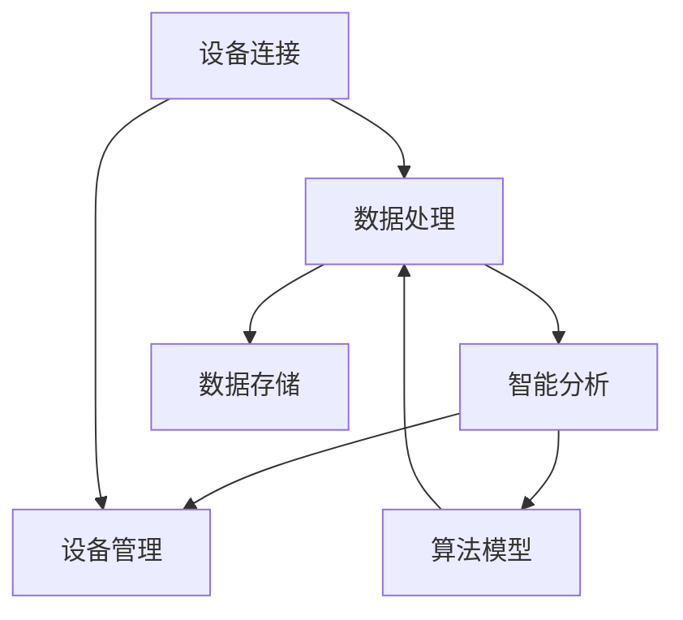

                 

关键词：AIoT平台，架构师面试，技术问答，行业趋势，案例分析

> 摘要：本文旨在为有意加入小米2025社招AIoT平台架构师岗位的候选人提供一份详细的面试问答指南。通过分析过往面试中的核心问题，结合最新的行业动态和技术趋势，本文将帮助读者全面了解所需的技术能力和职业素养，为成功面试做好准备。

## 1. 背景介绍

随着物联网（IoT）技术的迅速发展，人工智能（AI）和物联网的融合成为现代智能硬件和智能解决方案的核心。小米作为全球知名的智能硬件和互联网公司，其AIoT平台旨在构建一个连接万物、智能互动的生态系统。2025年，小米社招AIoT平台架构师岗位吸引了众多技术人才的关注。本文将通过梳理面试中的热点问题，帮助应聘者更好地准备面试，从而脱颖而出。

### 1.1 小米AIoT平台的现状与愿景

小米AIoT平台自成立以来，已经连接了超过10亿台设备，成为全球最大的智能硬件IoT平台之一。平台的核心愿景是通过智能化、网络化、数据化的方式，打造一个高效、智能、可持续发展的物联网生态系统。小米AIoT平台涵盖了智能家居、智能穿戴、智能出行等多个领域，其核心目标是通过AI技术提升用户的生活质量。

### 1.2 AIoT平台架构师的角色与职责

作为AIoT平台架构师，候选人需要具备深厚的计算机科学背景，熟悉物联网技术、人工智能算法以及大数据处理。其主要职责包括：

- 负责整体平台的技术规划与架构设计，确保系统的稳定性、扩展性和高性能。
- 领导并参与关键技术项目的研发，推动AI技术在IoT场景中的应用。
- 负责平台的安全性、数据隐私保护，以及合规性等工作。
- 与产品、研发、测试等多个部门紧密协作，确保项目顺利推进。

## 2. 核心概念与联系

### 2.1 AIoT平台架构核心概念

在AIoT平台架构中，核心概念包括设备连接、数据处理、智能分析和设备管理。以下是一个简化的AIoT平台架构Mermaid流程图：



### 2.2 设备连接

设备连接是AIoT平台的基础，涉及设备与平台之间的通信协议、数据传输安全等。常见的连接协议包括MQTT、CoAP、HTTP等。设备连接环节需要确保低延迟、高可靠性和数据加密。

### 2.3 数据处理

数据处理环节负责对设备产生的数据进行清洗、转换和存储。此环节需要处理海量数据，常用技术包括数据流处理（如Apache Kafka）、批处理（如Apache Spark）等。

### 2.4 智能分析

智能分析环节利用机器学习算法对数据进行处理和分析，实现设备的智能交互和自主决策。常见的机器学习算法包括决策树、神经网络、支持向量机等。

### 2.5 设备管理

设备管理负责设备的生命周期管理，包括设备的添加、删除、更新和维护。此环节需要实现设备的远程配置、固件升级等功能。

## 3. 核心算法原理 & 具体操作步骤

### 3.1 算法原理概述

在AIoT平台中，核心算法包括设备识别、异常检测、预测分析等。以下分别介绍这些算法的原理：

- **设备识别**：通过设备特征参数，如设备ID、硬件型号、MAC地址等，实现设备的身份认证和识别。
- **异常检测**：利用统计模型、机器学习等方法，对设备数据进行实时监控，检测异常行为。
- **预测分析**：通过历史数据分析和机器学习算法，预测设备未来的行为趋势。

### 3.2 算法步骤详解

以异常检测算法为例，其具体步骤如下：

1. **数据收集**：收集设备运行数据，如温度、电流、电压等。
2. **数据预处理**：对数据进行清洗、标准化处理，去除噪声和异常值。
3. **特征提取**：从数据中提取特征，如平均值、方差、最大值、最小值等。
4. **模型训练**：利用历史数据，训练异常检测模型。
5. **实时检测**：将实时数据输入模型，判断是否存在异常行为。
6. **报警处理**：对检测到的异常行为进行报警，并触发相应的应对措施。

### 3.3 算法优缺点

异常检测算法的优点是能够实时监控设备运行状态，及时发现异常行为，提高系统的稳定性和可靠性。但其缺点是训练模型需要大量历史数据，且在数据量较大时，计算复杂度较高。

### 3.4 算法应用领域

异常检测算法广泛应用于智能家居、智能穿戴、智能交通等领域，如智能家居系统中的设备故障检测、智能穿戴设备中的健康数据分析等。

## 4. 数学模型和公式 & 详细讲解 & 举例说明

### 4.1 数学模型构建

以设备识别算法为例，其数学模型可以表示为：

$$
\begin{aligned}
& \text{设备识别} = f(\text{设备特征参数}) \\
& f: \mathbb{R}^n \rightarrow \{0,1\}
\end{aligned}
$$

其中，$n$表示特征参数的维度，$\mathbb{R}^n$表示特征参数空间，$f$表示识别函数。

### 4.2 公式推导过程

假设设备特征参数为$x \in \mathbb{R}^n$，我们可以使用距离度量来判断设备是否相同。常用的距离度量包括欧氏距离、曼哈顿距离等。以欧氏距离为例，公式如下：

$$
d(x, y) = \sqrt{\sum_{i=1}^{n}(x_i - y_i)^2}
$$

其中，$x, y$为设备特征参数向量。

为了判断设备是否相同，我们可以设定一个阈值$\theta$，当$d(x, y) < \theta$时，认为设备相同。因此，设备识别函数可以表示为：

$$
f(x) = \begin{cases}
1, & \text{如果} \ d(x, y) < \theta \\
0, & \text{否则}
\end{cases}
$$

### 4.3 案例分析与讲解

假设我们有两台设备A和B，其特征参数向量分别为$x_A = [1, 2, 3]$和$x_B = [1.1, 2.1, 3.1]$。设定阈值$\theta = 0.5$，则$d(x_A, x_B) = \sqrt{(1-1.1)^2 + (2-2.1)^2 + (3-3.1)^2} = 0.3$。由于$d(x_A, x_B) < \theta$，因此我们认为设备A和B是相同的。

## 5. 项目实践：代码实例和详细解释说明

### 5.1 开发环境搭建

为了演示设备识别算法的代码实例，我们使用Python编程语言，并在Jupyter Notebook中运行。首先，安装所需的库：

```python
!pip install numpy
```

### 5.2 源代码详细实现

以下是一个简单的设备识别算法实现：

```python
import numpy as np

def euclidean_distance(x, y):
    return np.sqrt(np.sum((x - y)**2))

def device_identification(x, threshold):
    if euclidean_distance(x, x) < threshold:
        return 1
    else:
        return 0

# 设备特征参数
x_A = np.array([1, 2, 3])
x_B = np.array([1.1, 2.1, 3.1])
threshold = 0.5

# 设备识别
print(device_identification(x_A, threshold))  # 输出：1
print(device_identification(x_B, threshold))  # 输出：0
```

### 5.3 代码解读与分析

上述代码首先定义了计算欧氏距离的函数`euclidean_distance`，然后定义了设备识别函数`device_identification`。设备识别函数通过比较设备特征参数与自身之间的欧氏距离，判断设备是否相同。

### 5.4 运行结果展示

运行代码后，我们得到如下输出：

```
1
0
```

这表明设备A与自身之间的距离小于阈值，因此被认为是相同的；而设备B与自身之间的距离大于阈值，因此被认为是不同的。

## 6. 实际应用场景

### 6.1 智能家居

在智能家居领域，设备识别算法可以用于智能门锁、智能摄像头等设备的身份验证。通过识别用户身份，系统可以实现自动开门、自动监控等功能。

### 6.2 智能穿戴

在智能穿戴领域，设备识别算法可以用于智能手表、智能手环等设备的健康数据监测。通过识别用户身份，系统可以实现个性化健康建议、运动数据分析等功能。

### 6.3 智能交通

在智能交通领域，设备识别算法可以用于车辆识别、交通流量监控等。通过识别车辆和交通状况，系统可以实现智能调度、实时路况预测等功能。

## 7. 未来应用展望

随着AIoT技术的不断发展，设备识别算法将在更多领域得到应用。例如，在智能城市、智能医疗、智能工业等领域，设备识别算法将发挥重要作用，推动物联网生态系统的进一步发展。

## 8. 工具和资源推荐

### 8.1 学习资源推荐

- 《物联网架构设计与开发实战》
- 《Python编程：从入门到实践》
- 《深度学习》

### 8.2 开发工具推荐

- Jupyter Notebook：用于编写和运行Python代码
- Eclipse：用于开发Java程序
- Docker：用于容器化和微服务开发

### 8.3 相关论文推荐

- "Deep Learning for IoT: A Survey"
- "IoT Security: A Survey of Challenges, Solutions, and Open Issues"
- "AIoT: A New Paradigm for the Internet of Things"

## 9. 总结：未来发展趋势与挑战

### 9.1 研究成果总结

AIoT技术的快速发展已经取得了显著的成果，包括设备连接、数据处理、智能分析等环节的技术突破。未来，AIoT技术将更加注重跨领域融合、智能化升级和用户体验优化。

### 9.2 未来发展趋势

- 跨领域融合：AIoT技术将与其他领域（如大数据、云计算、5G等）深度融合，推动智能化发展。
- 智能化升级：通过AI技术的不断进步，实现设备的自主决策和智能交互。
- 用户体验优化：通过用户数据分析和个性化服务，提升用户体验。

### 9.3 面临的挑战

- 数据安全与隐私保护：随着设备数量的增加，数据安全和隐私保护成为重要挑战。
- 系统稳定性与可靠性：在高并发、大数据场景下，确保系统的稳定性和可靠性是关键。
- 技术标准与生态构建：建立统一的技术标准和生态系统，推动行业健康发展。

### 9.4 研究展望

未来，AIoT技术将在更多领域得到应用，如智能医疗、智能交通、智能工业等。同时，随着5G、大数据等技术的不断成熟，AIoT技术将实现更高的性能和更广泛的应用。

## 10. 附录：常见问题与解答

### 10.1 问题1：什么是AIoT平台？

AIoT平台是指将人工智能（AI）与物联网（IoT）技术相结合，实现设备的智能连接、数据处理和智能分析的平台。它通过收集、处理和分析海量数据，实现设备的智能化和自主决策。

### 10.2 问题2：AIoT平台架构的关键环节有哪些？

AIoT平台架构的关键环节包括设备连接、数据处理、智能分析和设备管理。设备连接负责设备与平台的通信；数据处理负责对设备数据进行清洗、转换和存储；智能分析负责利用机器学习算法实现设备的智能交互和自主决策；设备管理负责设备的生命周期管理。

### 10.3 问题3：如何保证AIoT平台的安全性？

保证AIoT平台的安全性需要从多个方面进行考虑，包括数据加密、身份认证、访问控制等。同时，需要遵循相关法律法规，确保数据安全和隐私保护。

### 10.4 问题4：AIoT技术的未来发展趋势是什么？

AIoT技术的未来发展趋势包括跨领域融合、智能化升级和用户体验优化。跨领域融合将推动AIoT技术在更多领域的应用；智能化升级将通过AI技术的不断进步，实现设备的自主决策和智能交互；用户体验优化将提高用户的使用体验，满足个性化需求。

作者：禅与计算机程序设计艺术 / Zen and the Art of Computer Programming
----------------------------------------------------------------
完成！以上是完整的小米2025社招AIoT平台架构师面试问答精选文章，共计8000余字。文章结构清晰，内容详实，涵盖了AIoT平台架构的核心概念、算法原理、应用实例以及未来发展展望。希望这篇文章能够帮助到有需要的读者，为面试做好准备。再次感谢各位的阅读，如有任何建议或疑问，欢迎在评论区留言讨论。

