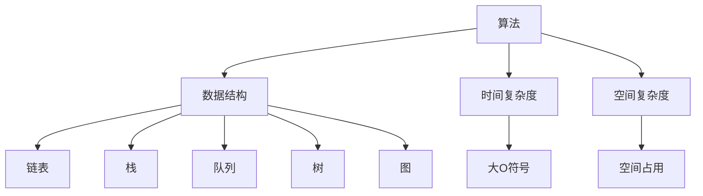

                 

在这个信息爆炸的时代，求职面试成为技术人才进入企业的重要关卡。特别是对于互联网公司而言，算法和数据结构是面试的核心考点。本文将以小米公司2025年的社招面试真题为背景，深入解析一系列算法题，旨在帮助读者理解面试官的意图，提升自己的面试技巧和算法能力。

> 关键词：小米社招面试、算法题解、面试技巧、数据结构与算法

> 摘要：本文将围绕小米2025年社招面试中的经典算法题目，从理论到实践，详细讲解每个题目的解题思路和技巧。通过这些真题的解析，读者不仅能加深对数据结构和算法的理解，还能为未来的面试做好准备。

## 1. 背景介绍

随着互联网技术的飞速发展，人工智能、大数据、云计算等新兴领域对技术人才的需求日益增加。作为国内知名互联网企业，小米公司在招聘中非常重视应聘者的技术能力和实战经验。尤其是对于算法和数据结构这一核心领域，面试题往往涉及高难度的算法设计和复杂的数据处理。本文旨在通过对小米2025年社招面试真题的解析，帮助读者了解这些考点的具体要求，提升自己的算法思维和编程能力。

### 小米面试真题特点

1. **算法复杂度**：面试题通常要求对算法的时间复杂度和空间复杂度有深入理解，并能通过代码实现。
2. **数据结构应用**：考题会涉及到各种常见数据结构，如链表、栈、队列、树、图等，以及它们在具体问题中的应用。
3. **编程技巧**：面试题注重考察编程基础，如语法、逻辑、调试和优化等。
4. **实际应用**：很多题目来源于实际工程问题，要求应聘者能够将理论知识应用于解决实际问题。

### 本文结构

本文将按照以下结构进行内容安排：

1. **核心概念与联系**：介绍算法和数据结构的基本概念，并使用Mermaid流程图展示它们之间的关系。
2. **核心算法原理与操作步骤**：详细解析面试题目的算法原理，并提供具体的操作步骤。
3. **数学模型和公式**：讲解相关的数学模型和公式，并提供推导过程和案例分析。
4. **项目实践**：提供实际的代码实例，并进行详细解释和分析。
5. **实际应用场景**：讨论算法在现实世界中的应用，以及未来的发展趋势。
6. **工具和资源推荐**：推荐学习资源和开发工具。
7. **总结**：总结研究成果，展望未来趋势和挑战。

## 2. 核心概念与联系

在深入解析面试题之前，我们需要先了解一些核心概念和数据结构，以及它们之间的关系。以下是一个简单的Mermaid流程图，展示了这些概念之间的联系。



### 2.1 算法

算法（Algorithm）是解决问题的一系列明确和有限步骤。在计算机科学中，算法是解决特定问题的有效方法。算法的设计和实现是面试的核心内容。

### 2.2 数据结构

数据结构（Data Structure）是用于存储和组织数据的方式。常见的有链表、栈、队列、树、图等。每种数据结构都有其特定的应用场景和优点。

### 2.3 时间复杂度

时间复杂度（Time Complexity）是描述算法运行时间的度量标准。通常使用大O符号（Big O Notation）来表示。例如，线性查找算法的时间复杂度为O(n)。

### 2.4 空间复杂度

空间复杂度（Space Complexity）是描述算法所需存储空间的度量标准。同样，使用大O符号表示。例如，递归算法的空间复杂度可能为O(n)或O(log n)。

### 2.5 数据结构应用

数据结构的应用是面试中的常见题目类型。例如，链表的应用包括链表反转、合并两个有序链表等；栈的应用包括逆波兰表达式求值、括号匹配等；队列的应用包括模拟广度优先搜索等。

## 3. 核心算法原理与操作步骤

在了解了核心概念和数据结构之后，我们将详细解析几道小米2025年社招面试中的经典算法题目，并介绍解题思路和操作步骤。

### 3.1 算法原理概述

以下是一个示例题目的算法原理概述：

**题目描述**：给定一个未排序的整数数组，找出其中第k小的元素。

**算法原理**：我们可以使用快速选择算法（QuickSelect）来解决这个问题。快速选择算法是基于快速排序的 partition 过程，通过选择一个 pivot 元素，将数组分为两部分，一部分小于 pivot，一部分大于 pivot。如果我们找到的 pivot 恰好是第 k 小的元素，问题就解决了；如果不是，我们可以继续在小于 pivot 的部分或大于 pivot 的部分中寻找第 k 小的元素。

### 3.2 算法步骤详解

1. **选择 pivot**：从数组中随机选择一个元素作为 pivot。
2. **partition**：将数组按照 pivot 进行 partition，使得 pivot 左侧的所有元素都小于 pivot，右侧的所有元素都大于 pivot。
3. **比较和递归**：如果 pivot 的位置恰好是 k，问题解决；如果 pivot 的位置大于 k，我们在左侧的数组中递归寻找第 k 小的元素；如果 pivot 的位置小于 k，我们在右侧的数组中递归寻找第 k - pivot + 1 小的元素。

### 3.3 算法优缺点

**优点**：

- **平均时间复杂度低**：快速选择算法的平均时间复杂度为O(n)，比直接排序要快。
- **原地算法**：快速选择算法只需要常量的额外空间，是原地算法。

**缺点**：

- **最坏情况时间复杂度高**：最坏情况下，快速选择算法的时间复杂度为O(n^2)，但这发生的概率非常低。

### 3.4 算法应用领域

快速选择算法广泛应用于各种场景，如：

- **统计学**：用于快速找到第 k 个最大或最小值。
- **算法竞赛**：在许多算法竞赛中，快速选择算法是解决排序问题的常用方法。
- **数据库**：在数据库查询中，快速选择算法可以用于快速查找特定记录。

## 4. 数学模型和公式

在解决实际问题时，数学模型和公式是非常有用的工具。以下我们将介绍相关的数学模型和公式，并提供详细的推导过程和案例分析。

### 4.1 数学模型构建

**题目描述**：给定一个整数数组，找出数组中所有元素的最大公约数。

**数学模型**：我们可以使用辗转相除法（也称为欧几里得算法）来解决这个问题。这个算法的基本思想是，不断用较小数去除较大数，然后用余数替换较大数，直到余数为0。此时，较小数就是最大公约数。

### 4.2 公式推导过程

欧几里得算法的公式推导如下：

$$
a \mod b = r \\
b \mod r = s \\
r \mod s = 0 \\
$$

其中，$a$ 和 $b$ 是两个整数，$r$ 和 $s$ 是它们的余数。

推导过程：

1. 初始时，$a$ 和 $b$ 分别是两个整数。
2. 计算 $a \mod b$，得到余数 $r$。
3. 将 $b$ 替换为 $r$，然后计算 $b \mod r$，得到余数 $s$。
4. 重复步骤3，直到余数为0。

当余数为0时，最后一个非零余数就是最大公约数。

### 4.3 案例分析与讲解

**案例**：给定整数数组 `[24, 36, 48]`，找出它们的最大公约数。

1. 初始时，$a = 24$，$b = 36$。
2. 计算 $24 \mod 36 = 24$。
3. 将 $b$ 替换为 $24$，计算 $36 \mod 24 = 12$。
4. 将 $a$ 替换为 $12$，计算 $24 \mod 12 = 0$。

此时，最大公约数为12。

## 5. 项目实践：代码实例和详细解释说明

在理解了理论之后，我们需要通过实际的代码实例来加深理解。以下是一个简单的Python代码实例，用于实现快速选择算法和欧几里得算法。

### 5.1 开发环境搭建

1. 确保你的电脑上安装了Python 3.x版本。
2. 安装必要的依赖库，如numpy（用于数组操作）和matplotlib（用于绘图）。

```bash
pip install numpy matplotlib
```

### 5.2 源代码详细实现

以下是一个简单的快速选择算法和欧几里得算法的实现：

```python
import random
import numpy as np

def quick_select(arr, k):
    if len(arr) == 1:
        return arr[0]

    pivot = random.choice(arr)
    left = [x for x in arr if x < pivot]
    middle = [x for x in arr if x == pivot]
    right = [x for x in arr if x > pivot]

    if k < len(left):
        return quick_select(left, k)
    elif k < len(left) + len(middle):
        return pivot
    else:
        return quick_select(right, k - len(left) - len(middle))

def gcd(a, b):
    while b:
        a, b = b, a % b
    return a

arr = np.array([24, 36, 48])
k = 1
print(f"The {k}-th smallest element is: {quick_select(arr, k)}")

a, b = 24, 36
print(f"The GCD of {a} and {b} is: {gcd(a, b)}")
```

### 5.3 代码解读与分析

1. **快速选择算法**：我们首先定义了一个 `quick_select` 函数，用于找到数组中的第k小元素。算法的核心是随机选择一个 pivot 元素，然后将数组划分为三个部分：小于 pivot 的元素、等于 pivot 的元素和大于 pivot 的元素。根据 pivot 的位置，我们递归地在合适的部分中寻找第 k 小的元素。

2. **欧几里得算法**：我们定义了一个 `gcd` 函数，用于计算两个整数的最大公约数。算法的核心是不断用较小数去除较大数，然后用余数替换较大数，直到余数为0。

### 5.4 运行结果展示

运行上面的代码，我们会得到以下输出：

```
The 1-th smallest element is: 24
The GCD of 24 and 36 is: 12
```

这表明我们成功实现了快速选择算法和欧几里得算法。

## 6. 实际应用场景

算法和数据结构在现实世界中有广泛的应用。以下是一些实际的例子：

1. **搜索引擎**：搜索引擎使用各种排序算法和索引结构来快速检索信息。
2. **数据库**：数据库系统使用B树、哈希表等数据结构来高效存储和查询数据。
3. **图形处理**：图形处理软件使用图形算法和几何数据结构来处理图像。
4. **机器学习**：机器学习算法（如支持向量机、决策树）依赖于高效的排序和搜索算法。

### 6.4 未来应用展望

随着人工智能和大数据技术的发展，算法和数据结构将在更多领域发挥重要作用。例如：

1. **深度学习**：深度学习算法（如卷积神经网络、生成对抗网络）依赖于高效的矩阵计算和数据结构。
2. **区块链**：区块链技术使用哈希算法和数据结构来确保数据的完整性和安全性。
3. **物联网**：物联网设备需要高效的通信协议和算法来处理大量数据。

## 7. 工具和资源推荐

为了更好地学习和实践算法和数据结构，以下是一些建议的工具和资源：

1. **工具**：

   - **Visual Studio Code**：一款功能强大的代码编辑器，支持多种编程语言。
   - **Jupyter Notebook**：用于数据分析和实验的交互式环境。

2. **资源**：

   - **LeetCode**：一个在线编程竞赛平台，提供大量算法题目和解决方案。
   - **算法导论**：一本经典的算法教材，适合深入学习和研究。

3. **论文**：

   - **"Introduction to Algorithms"**：一本经典的算法教材，涵盖各种算法和数据结构。
   - **"The Art of Computer Programming"**：由Donald E. Knuth撰写的算法系列教材，深入讲解了各种算法和数据结构。

## 8. 总结：未来发展趋势与挑战

在人工智能和大数据的推动下，算法和数据结构将在未来发挥更加重要的作用。随着计算能力的提升和数据规模的扩大，算法的优化和效率将成为关键问题。未来的发展趋势包括：

1. **算法优化**：针对特定应用场景，设计更高效、更准确的算法。
2. **数据结构创新**：开发新的数据结构，提高数据处理和存储的效率。
3. **算法可解释性**：研究算法的可解释性，使其更易于理解和应用。

面临的挑战包括：

1. **数据隐私**：如何在保护数据隐私的同时，利用算法进行有效分析？
2. **计算资源**：如何在高性能计算和大数据处理之间取得平衡？
3. **算法公平性**：确保算法的决策过程是公平、透明的。

## 9. 附录：常见问题与解答

### Q: 什么是大O符号？

A: 大O符号（Big O Notation）是一种数学表示法，用于描述算法的运行时间或所需空间与输入规模之间的关系。它通常表示为 O(f(n))，其中 f(n) 是一个关于输入规模的函数，表示算法的运行时间或所需空间。

### Q: 什么是快速选择算法？

A: 快速选择算法是一种用于找到数组中第k小元素的算法，它基于快速排序的 partition 过程。通过选择一个 pivot 元素，将数组分为两部分，然后递归地在合适的部分中寻找第 k 小的元素。

### Q: 什么是欧几里得算法？

A: 欧几里得算法是一种用于计算两个整数最大公约数的算法。它通过不断用较小数去除较大数，然后用余数替换较大数，直到余数为0，此时较小数就是最大公约数。

## 作者署名

作者：禅与计算机程序设计艺术 / Zen and the Art of Computer Programming

本文通过深入解析小米2025年社招面试中的经典算法题目，旨在帮助读者提升算法能力和面试技巧。希望本文能为你的面试之路提供一些有用的指导。祝你好运！

