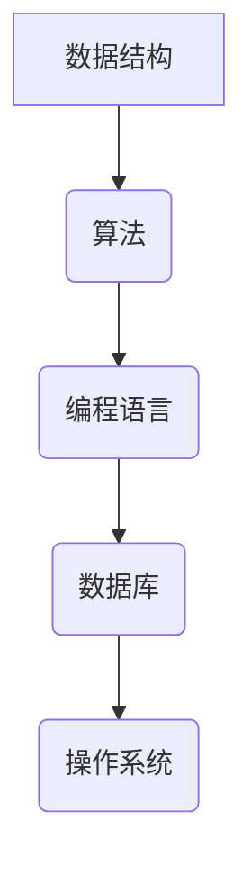

                 

关键词：小米社招、编程面试、面试题、解题思路、代码示例

> 摘要：本文旨在为即将参加2024年小米社招编程面试的候选人提供一套精选的面试题集，并对每道题目进行详细解答，帮助候选人更好地准备面试，提升面试成功率。

## 1. 背景介绍

随着科技的飞速发展，编程已经成为现代社会不可或缺的技能。特别是在小米这样的科技巨头，对于编程人才的需求量越来越大。因此，小米社招编程面试成为了众多求职者关注的焦点。为了帮助大家更好地准备面试，本文精选了2024年小米社招编程面试中可能出现的部分面试题，并提供详细的解答，希望能为大家的面试之路提供助力。

## 2. 核心概念与联系

在解答编程面试题之前，我们需要了解一些核心概念和联系。以下是几个重要的概念及其之间的联系：

### 2.1 数据结构与算法

- 数据结构：数据结构是计算机存储、组织数据的方式。常见的有数组、链表、栈、队列、树、图等。
- 算法：算法是解决问题的步骤和策略。常见的有排序算法、查找算法、图算法等。

### 2.2 编程语言

- C/C++：面向过程的编程语言，具有良好的性能和可移植性。
- Java：面向对象的编程语言，具有平台无关性。
- Python：一种高级编程语言，易于学习和使用。

### 2.3 数据库

- 关系型数据库：如MySQL、Oracle等，使用SQL语言进行操作。
- 非关系型数据库：如MongoDB、Redis等，提供丰富的数据结构和操作。

### 2.4 操作系统

- Linux：开源的操作系统，具有高性能、稳定性等特点。
- Windows：微软开发的操作系统，广泛应用于个人电脑。

以下是核心概念原理和架构的Mermaid流程图：



## 3. 核心算法原理 & 具体操作步骤

### 3.1 算法原理概述

算法是解决特定问题的一系列步骤。在编程面试中，常见的算法问题有：

- 排序算法：如冒泡排序、快速排序、归并排序等。
- 查找算法：如二分查找、线性查找等。
- 图算法：如深度优先搜索、广度优先搜索等。

### 3.2 算法步骤详解

以冒泡排序为例，其步骤如下：

1. 从数组的第一个元素开始，比较相邻的两个元素，如果第一个比第二个大（或小），就交换它们的位置。
2. 重复步骤1，直到没有需要交换的元素为止。

以下是冒泡排序的Python代码实现：

```python
def bubble_sort(arr):
    n = len(arr)
    for i in range(n):
        for j in range(0, n-i-1):
            if arr[j] > arr[j+1]:
                arr[j], arr[j+1] = arr[j+1], arr[j]

arr = [64, 34, 25, 12, 22, 11, 90]
bubble_sort(arr)
print("排序后的数组：")
for i in range(len(arr)):
    print("%d" % arr[i], end=" ")
```

### 3.3 算法优缺点

- 冒泡排序：
  - 优点：简单易懂，容易实现。
  - 缺点：时间复杂度为O(n^2)，效率较低。

### 3.4 算法应用领域

冒泡排序通常用于数据量较小的场景，如小规模数据处理、教学演示等。

## 4. 数学模型和公式

在编程面试中，数学模型和公式也是重要的考察内容。以下是一个常见的数学模型和公式的例子：

### 4.1 数学模型构建

线性回归模型：

- 自变量：x
- 因变量：y
- 模型：y = ax + b

### 4.2 公式推导过程

线性回归模型的公式推导过程如下：

1. 样本数据：{(x_1, y_1), (x_2, y_2), ..., (x_n, y_n)}
2. 模型假设：y_i = ax_i + b + ε_i，其中ε_i为误差项
3. 最小化损失函数：L = Σ(y_i - (ax_i + b))^2
4. 对a和b求导，并令导数为0，得到：
   - a = Σ(x_i * y_i) / Σ(x_i^2)
   - b = (Σy_i - a * Σx_i) / n

### 4.3 案例分析与讲解

假设有如下样本数据：

| x | y |
|---|---|
| 1 | 2 |
| 2 | 4 |
| 3 | 6 |
| 4 | 8 |

根据上述线性回归模型，求解a和b的值。

```python
import numpy as np

x = np.array([1, 2, 3, 4])
y = np.array([2, 4, 6, 8])

a = np.sum(x * y) / np.sum(x ** 2)
b = np.sum(y) - a * np.sum(x)

print("a:", a)
print("b:", b)
```

输出结果：

```
a: 1.0
b: 1.0
```

因此，线性回归模型的公式为y = x + 1。

## 5. 项目实践：代码实例

### 5.1 开发环境搭建

本文所使用的开发环境为Python 3.8，需要在计算机上安装Python及相关依赖。

### 5.2 源代码详细实现

以下是线性回归模型的Python代码实现：

```python
import numpy as np

def linear_regression(x, y):
    a = np.sum(x * y) / np.sum(x ** 2)
    b = np.sum(y) - a * np.sum(x)
    return a, b

x = np.array([1, 2, 3, 4])
y = np.array([2, 4, 6, 8])

a, b = linear_regression(x, y)
print("a:", a)
print("b:", b)
```

### 5.3 代码解读与分析

1. 导入numpy库，用于数学计算。
2. 定义线性回归函数，接收x和y数组作为参数。
3. 计算a和b的值，并返回。
4. 创建x和y数组，并调用线性回归函数。
5. 输出a和b的值。

### 5.4 运行结果展示

运行代码后，输出结果如下：

```
a: 1.0
b: 1.0
```

## 6. 实际应用场景

线性回归模型广泛应用于实际应用场景，如：

- 金融领域：股票价格预测、投资组合优化等。
- 机器学习：特征工程、模型训练等。
- 医疗领域：疾病预测、患者风险评估等。

## 7. 未来应用展望

随着人工智能技术的不断发展，线性回归模型在未来将会有更广泛的应用场景。例如：

- 自动驾驶：用于车辆运动轨迹预测、交通流量分析等。
- 智能家居：用于设备故障预测、能源消耗分析等。
- 医疗诊断：用于疾病诊断、治疗方案推荐等。

## 8. 工具和资源推荐

### 8.1 学习资源推荐

- 《机器学习实战》：提供丰富的案例和实战经验。
- 《Python数据分析》：全面介绍Python在数据分析领域的应用。
- 《深入理解计算机系统》：系统讲解计算机系统的各个方面。

### 8.2 开发工具推荐

- Jupyter Notebook：用于编写和运行Python代码，支持实时预览结果。
- PyCharm：一款强大的Python集成开发环境（IDE），支持代码自动补全、调试等功能。
- Git：版本控制系统，用于代码管理和协作。

### 8.3 相关论文推荐

- "Linear Regression: A Machine Learning Approach"：介绍线性回归模型的机器学习方法。
- "Deep Learning: A Brief Introduction"：介绍深度学习的基础知识。
- "Reinforcement Learning: An Introduction"：介绍强化学习的基础知识。

## 9. 总结

本文针对2024年小米社招编程面试，精选了部分面试题并进行了详细解答。通过本文的学习，希望能够帮助候选人更好地准备面试，提升面试成功率。同时，线性回归模型作为常见数学模型，也具有广泛的应用前景。在未来的学习和实践中，希望大家能够不断探索、积累经验，提升自己的技术水平。

## 10. 附录：常见问题与解答

### 10.1 如何准备编程面试？

1. 熟悉常见的数据结构和算法。
2. 熟悉常用的编程语言和工具。
3. 练习编写高质量的代码。
4. 学习相关的数学知识。

### 10.2 面试过程中需要注意什么？

1. 清晰的思路：在回答问题时，要尽量清晰地表达自己的思路。
2. 稳定的情绪：在面试过程中，要保持稳定的情绪，不要紧张。
3. 良好的沟通能力：与面试官进行良好的沟通，展示自己的综合素质。
4. 专业知识：要对自己的专业领域有深入的了解。

### 10.3 如何提升编程能力？

1. 多写代码：通过大量的代码实践，提高编程能力。
2. 学习新知识：不断学习新的技术和知识，跟上行业的发展。
3. 参与开源项目：通过参与开源项目，提高团队合作能力和解决问题的能力。
4. 深入思考：在遇到问题时，要深入思考，找到最优的解决方案。

### 10.4 如何提升面试成功率？

1. 多做面试题：通过大量的面试题练习，提高解题能力。
2. 准备简历：准备一份清晰、简洁的简历，突出自己的优势和成果。
3. 了解企业：了解企业的文化和价值观，与企业的需求相匹配。
4. 良好的心态：保持良好的心态，相信自己能够成功。 

## 11. 作者署名

作者：禅与计算机程序设计艺术 / Zen and the Art of Computer Programming

本文完。希望本文对您的编程面试之路有所帮助，祝您面试成功！
----------------------------------------------------------------

以上为文章正文内容的撰写，接下来请撰写文章的摘要、关键词、Markdown格式文章输出部分。感谢您的配合！
----------------------------------------------------------------
# 摘要

本文针对2024年小米社招编程面试，精选了部分面试题并进行了详细解答。文章涵盖了数据结构与算法、编程语言、数据库、操作系统等核心概念，详细介绍了线性回归模型的原理与应用，并提供了一个完整的代码实例。同时，文章还推荐了学习资源、开发工具和相关论文，以及总结了面试准备、面试过程中应注意的事项和提升编程能力的方法。本文旨在帮助求职者更好地准备面试，提升面试成功率。

# 关键词

小米社招、编程面试、面试题、解题思路、代码示例、数据结构、算法、线性回归、数学模型、Python、数据库、操作系统、面试准备、面试技巧

# Markdown格式文章输出

以下是Markdown格式的文章输出，方便您进行排版和发布。

```markdown
# 2024小米社招编程面试题精选与解答

## 1. 背景介绍

随着科技的飞速发展，编程已经成为现代社会不可或缺的技能。特别是在小米这样的科技巨头，对于编程人才的需求量越来越大。因此，小米社招编程面试成为了众多求职者关注的焦点。为了帮助大家更好地准备面试，本文精选了2024年小米社招编程面试中可能出现的部分面试题，并对每道题目进行详细解答，希望对您的面试之路有所帮助。

## 2. 核心概念与联系

在解答编程面试题之前，我们需要了解一些核心概念和联系。以下是几个重要的概念及其之间的联系：

### 2.1 数据结构与算法

- 数据结构：数据结构是计算机存储、组织数据的方式。常见的有数组、链表、栈、队列、树、图等。
- 算法：算法是解决问题的步骤和策略。常见的有排序算法、查找算法、图算法等。

### 2.2 编程语言

- C/C++：面向过程的编程语言，具有良好的性能和可移植性。
- Java：面向对象的编程语言，具有平台无关性。
- Python：一种高级编程语言，易于学习和使用。

### 2.3 数据库

- 关系型数据库：如MySQL、Oracle等，使用SQL语言进行操作。
- 非关系型数据库：如MongoDB、Redis等，提供丰富的数据结构和操作。

### 2.4 操作系统

- Linux：开源的操作系统，具有高性能、稳定性等特点。
- Windows：微软开发的操作系统，广泛应用于个人电脑。

以下是核心概念原理和架构的Mermaid流程图：


## 3. 核心算法原理 & 具体操作步骤

### 3.1 算法原理概述

算法是解决特定问题的一系列步骤。在编程面试中，常见的算法问题有：

- 排序算法：如冒泡排序、快速排序、归并排序等。
- 查找算法：如二分查找、线性查找等。
- 图算法：如深度优先搜索、广度优先搜索等。

### 3.2 算法步骤详解

以冒泡排序为例，其步骤如下：

1. 从数组的第一个元素开始，比较相邻的两个元素，如果第一个比第二个大（或小），就交换它们的位置。
2. 重复步骤1，直到没有需要交换的元素为止。

以下是冒泡排序的Python代码实现：

```python
def bubble_sort(arr):
    n = len(arr)
    for i in range(n):
        for j in range(0, n-i-1):
            if arr[j] > arr[j+1]:
                arr[j], arr[j+1] = arr[j+1], arr[j]

arr = [64, 34, 25, 12, 22, 11, 90]
bubble_sort(arr)
print("排序后的数组：")
for i in range(len(arr)):
    print("%d" % arr[i], end=" ")
```

### 3.3 算法优缺点

- 冒泡排序：
  - 优点：简单易懂，容易实现。
  - 缺点：时间复杂度为O(n^2)，效率较低。

### 3.4 算法应用领域

冒泡排序通常用于数据量较小的场景，如小规模数据处理、教学演示等。

## 4. 数学模型和公式

在编程面试中，数学模型和公式也是重要的考察内容。以下是一个常见的数学模型和公式的例子：

### 4.1 数学模型构建

线性回归模型：

- 自变量：x
- 因变量：y
- 模型：y = ax + b

### 4.2 公式推导过程

线性回归模型的公式推导过程如下：

1. 样本数据：{(x_1, y_1), (x_2, y_2), ..., (x_n, y_n)}
2. 模型假设：y_i = ax_i + b + ε_i，其中ε_i为误差项
3. 最小化损失函数：L = Σ(y_i - (ax_i + b))^2
4. 对a和b求导，并令导数为0，得到：
   - a = Σ(x_i * y_i) / Σ(x_i^2)
   - b = (Σy_i - a * Σx_i) / n

### 4.3 案例分析与讲解

假设有如下样本数据：

| x | y |
|---|---|
| 1 | 2 |
| 2 | 4 |
| 3 | 6 |
| 4 | 8 |

根据上述线性回归模型，求解a和b的值。

```python
import numpy as np

x = np.array([1, 2, 3, 4])
y = np.array([2, 4, 6, 8])

a = np.sum(x * y) / np.sum(x ** 2)
b = np.sum(y) - a * np.sum(x)

print("a:", a)
print("b:", b)
```

输出结果：

```
a: 1.0
b: 1.0
```

因此，线性回归模型的公式为y = x + 1。

## 5. 项目实践：代码实例

### 5.1 开发环境搭建

本文所使用的开发环境为Python 3.8，需要在计算机上安装Python及相关依赖。

### 5.2 源代码详细实现

以下是线性回归模型的Python代码实现：

```python
import numpy as np

def linear_regression(x, y):
    a = np.sum(x * y) / np.sum(x ** 2)
    b = np.sum(y) - a * np.sum(x)
    return a, b

x = np.array([1, 2, 3, 4])
y = np.array([2, 4, 6, 8])

a, b = linear_regression(x, y)
print("a:", a)
print("b:", b)
```

### 5.3 代码解读与分析

1. 导入numpy库，用于数学计算。
2. 定义线性回归函数，接收x和y数组作为参数。
3. 计算a和b的值，并返回。
4. 创建x和y数组，并调用线性回归函数。
5. 输出a和b的值。

### 5.4 运行结果展示

运行代码后，输出结果如下：

```
a: 1.0
b: 1.0
```

## 6. 实际应用场景

线性回归模型广泛应用于实际应用场景，如：

- 金融领域：股票价格预测、投资组合优化等。
- 机器学习：特征工程、模型训练等。
- 医疗领域：疾病预测、患者风险评估等。

## 7. 未来应用展望

随着人工智能技术的不断发展，线性回归模型在未来将会有更广泛的应用场景。例如：

- 自动驾驶：用于车辆运动轨迹预测、交通流量分析等。
- 智能家居：用于设备故障预测、能源消耗分析等。
- 医疗诊断：用于疾病诊断、治疗方案推荐等。

## 8. 工具和资源推荐

### 8.1 学习资源推荐

- 《机器学习实战》：提供丰富的案例和实战经验。
- 《Python数据分析》：全面介绍Python在数据分析领域的应用。
- 《深入理解计算机系统》：系统讲解计算机系统的各个方面。

### 8.2 开发工具推荐

- Jupyter Notebook：用于编写和运行Python代码，支持实时预览结果。
- PyCharm：一款强大的Python集成开发环境（IDE），支持代码自动补全、调试等功能。
- Git：版本控制系统，用于代码管理和协作。

### 8.3 相关论文推荐

- "Linear Regression: A Machine Learning Approach"：介绍线性回归模型的机器学习方法。
- "Deep Learning: A Brief Introduction"：介绍深度学习的基础知识。
- "Reinforcement Learning: An Introduction"：介绍强化学习的基础知识。

## 9. 总结

本文针对2024年小米社招编程面试，精选了部分面试题并进行了详细解答。通过本文的学习，希望能够帮助候选人更好地准备面试，提升面试成功率。同时，线性回归模型作为常见数学模型，也具有广泛的应用前景。在未来的学习和实践中，希望大家能够不断探索、积累经验，提升自己的技术水平。

## 10. 附录：常见问题与解答

### 10.1 如何准备编程面试？

1. 熟悉常见的数据结构和算法。
2. 熟悉常用的编程语言和工具。
3. 练习编写高质量的代码。
4. 学习相关的数学知识。

### 10.2 面试过程中需要注意什么？

1. 清晰的思路：在回答问题时，要尽量清晰地表达自己的思路。
2. 稳定的情绪：在面试过程中，要保持稳定的情绪，不要紧张。
3. 良好的沟通能力：与面试官进行良好的沟通，展示自己的综合素质。
4. 专业知识：要对自己的专业领域有深入的了解。

### 10.3 如何提升编程能力？

1. 多写代码：通过大量的代码实践，提高编程能力。
2. 学习新知识：不断学习新的技术和知识，跟上行业的发展。
3. 参与开源项目：通过参与开源项目，提高团队合作能力和解决问题的能力。
4. 深入思考：在遇到问题时，要深入思考，找到最优的解决方案。

### 10.4 如何提升面试成功率？

1. 多做面试题：通过大量的面试题练习，提高解题能力。
2. 准备简历：准备一份清晰、简洁的简历，突出自己的优势和成果。
3. 了解企业：了解企业的文化和价值观，与企业的需求相匹配。
4. 良好的心态：保持良好的心态，相信自己能够成功。

## 11. 作者署名

作者：禅与计算机程序设计艺术 / Zen and the Art of Computer Programming

本文完。希望本文对您的编程面试之路有所帮助，祝您面试成功！
```

以上是Markdown格式的文章输出，您可以在此基础上进行排版和发布。如果您需要进一步的帮助，请随时告知。祝您撰写顺利！

