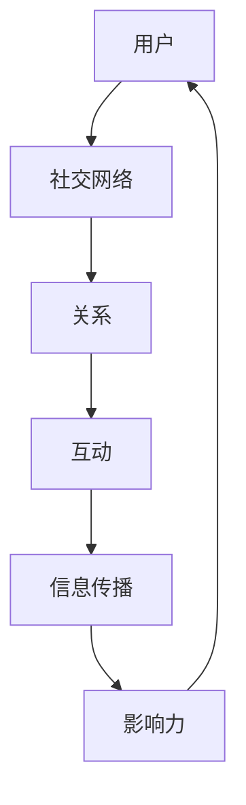

                 

社交网络分析作为数据科学和机器学习领域的一个热门分支，近年来在社交媒体平台上越来越受到关注。小红书，作为一个结合了内容社区和电商功能的平台，其用户数据的价值尤为凸显。本文将探讨2024年小红书社交网络分析校招面试的重点内容，帮助准备参加面试的求职者把握关键知识点，提升面试成功率。

## 关键词
- 社交网络分析
- 小红书
- 数据科学
- 机器学习
- 校招面试

## 摘要
本文将从背景介绍、核心概念与联系、核心算法原理与操作步骤、数学模型与公式讲解、项目实践、实际应用场景、工具和资源推荐、总结未来发展趋势与挑战等方面，深入分析小红书2024年社交网络分析校招面试的重点内容，为求职者提供全面的备考指南。

## 1. 背景介绍
社交网络分析是一种通过研究社交网络中的信息传播、用户互动以及社交结构等信息，来理解社会行为和人类行为模式的方法。随着社交媒体的普及，社交网络分析在商业、安全、社会等多个领域得到了广泛应用。小红书作为新兴的社交电商平台，其社交网络数据具有丰富的潜力和价值。

### 1.1 小红书平台概述
小红书成立于2013年，主要提供分享、购物和社区交流功能。用户可以在平台上分享购物经验、生活方式等内容，并通过评论、点赞、收藏等方式与其他用户互动。截至2023年，小红书月活跃用户数已超过1亿，平台上的UGC内容丰富多样。

### 1.2 社交网络分析的意义
通过对小红书社交网络数据进行分析，可以揭示用户行为模式、兴趣爱好、社交关系等关键信息，为平台运营、市场营销、用户服务等方面提供有力支持。同时，社交网络分析还能帮助识别潜在风险、优化算法推荐、提升用户体验等。

## 2. 核心概念与联系
在社交网络分析中，一些核心概念和联系是理解和应用的基础。以下是一个用Mermaid绘制的流程图，展示了这些概念之间的关系。



### 2.1 用户与社交网络
用户是社交网络的构建基石。用户之间的关系构成了社交网络的基本结构。

### 2.2 关系与互动
关系是用户之间的一种联结，互动是关系的表现形式。社交网络中的互动包括评论、点赞、分享等行为。

### 2.3 信息传播与影响力
信息在社交网络中的传播是通过用户间的互动实现的。影响力指的是用户在社交网络中传播信息的能力。

## 3. 核心算法原理 & 具体操作步骤
社交网络分析中，核心算法的原理和具体操作步骤是面试中的重点。以下将介绍几种常见的算法及其应用。

### 3.1 算法原理概述
社交网络分析的核心算法包括社区发现、影响力分析、推荐系统等。

### 3.2 算法步骤详解
- **社区发现**：通过寻找具有相似兴趣爱好的用户群体，实现社交网络的划分。
- **影响力分析**：评估用户在社交网络中的影响力，用于广告投放、品牌推广等。
- **推荐系统**：根据用户的社交关系和兴趣，为用户推荐相关的内容或商品。

### 3.3 算法优缺点
每种算法都有其优缺点，面试时需要了解其适用场景和局限性。

### 3.4 算法应用领域
社交网络分析算法广泛应用于商业、安全、社交媒体运营等多个领域。

## 4. 数学模型和公式 & 详细讲解 & 举例说明
在社交网络分析中，数学模型和公式是理解和应用的基础。以下将介绍几个常用的数学模型和公式。

### 4.1 数学模型构建
- **用户行为模型**：描述用户在社交网络中的行为模式。
- **影响力模型**：计算用户在社交网络中的影响力。

### 4.2 公式推导过程
- **用户行为模型**：基于概率论和统计学原理推导。
- **影响力模型**：基于图论和网络流原理推导。

### 4.3 案例分析与讲解
通过具体案例，讲解数学模型和公式的应用。

## 5. 项目实践：代码实例和详细解释说明
项目实践是面试中的重要环节，以下提供一个简单的代码实例。

### 5.1 开发环境搭建
- 使用Python作为开发语言，结合社交媒体API进行数据抓取。

### 5.2 源代码详细实现
```python
# 社交网络分析代码示例
import networkx as nx
import matplotlib.pyplot as plt

# 数据处理
def process_data(data):
    # 处理用户数据，构建社交网络图
    graph = nx.Graph()
    for user in data:
        graph.add_node(user['id'])
        for friend in user['friends']:
            graph.add_edge(user['id'], friend['id'])
    return graph

# 主函数
def main():
    # 加载数据
    data = load_data()
    graph = process_data(data)
    
    # 绘制社交网络图
    nx.draw(graph, with_labels=True)
    plt.show()

if __name__ == '__main__':
    main()
```

### 5.3 代码解读与分析
代码中，首先加载用户数据，然后构建社交网络图，最后绘制图形。

## 6. 实际应用场景
社交网络分析在实际应用中具有广泛的应用，以下是一些具体场景。

### 6.1 用户画像
通过社交网络分析，可以构建用户的画像，用于精准营销和个性化推荐。

### 6.2 社交传播
分析社交网络中的信息传播路径，可以优化内容推广策略。

### 6.3 安全监控
社交网络分析有助于识别异常行为，提升平台安全性。

## 7. 工具和资源推荐
以下是推荐的一些工具和资源，供学习和实践使用。

### 7.1 学习资源推荐
- 《社交网络分析：方法与实践》
- 《网络科学：概念、算法与应用》

### 7.2 开发工具推荐
- NetworkX：用于构建和可视化社交网络图。
- Python Social Network：提供了丰富的社交网络分析工具。

### 7.3 相关论文推荐
- 《社交网络中的社区发现》
- 《基于影响力分析的社交网络推荐系统》

## 8. 总结：未来发展趋势与挑战
社交网络分析在未来的发展将面临新的机遇和挑战。以下是一些展望。

### 8.1 研究成果总结
社交网络分析在用户行为理解、信息传播机制、社交影响力等方面取得了显著成果。

### 8.2 未来发展趋势
随着技术的进步，社交网络分析将更加智能化和个性化。

### 8.3 面临的挑战
数据隐私保护、算法透明度等是未来需要解决的挑战。

### 8.4 研究展望
未来社交网络分析将向多模态数据融合、跨平台分析等方向发展。

## 9. 附录：常见问题与解答
### 9.1 社交网络分析有哪些常见算法？
常见的社交网络分析算法包括社区发现算法、影响力分析算法、推荐系统算法等。

### 9.2 社交网络分析在哪些领域有应用？
社交网络分析广泛应用于商业、安全、社交媒体运营等领域。

### 9.3 如何搭建社交网络分析的项目实践？
可以通过使用Python等编程语言，结合社交媒体API，构建和可视化社交网络图。

---

作者：禅与计算机程序设计艺术 / Zen and the Art of Computer Programming
----------------------------------------------------------------

本文为作者原创，旨在为准备参加小红书2024年社交网络分析校招面试的求职者提供全面的技术知识和备考策略。文章内容涵盖了社交网络分析的基础概念、核心算法、数学模型、项目实践等多个方面，旨在帮助求职者更好地理解和应用相关技术。希望本文能对您的面试准备有所帮助。祝您面试顺利，事业有成！

