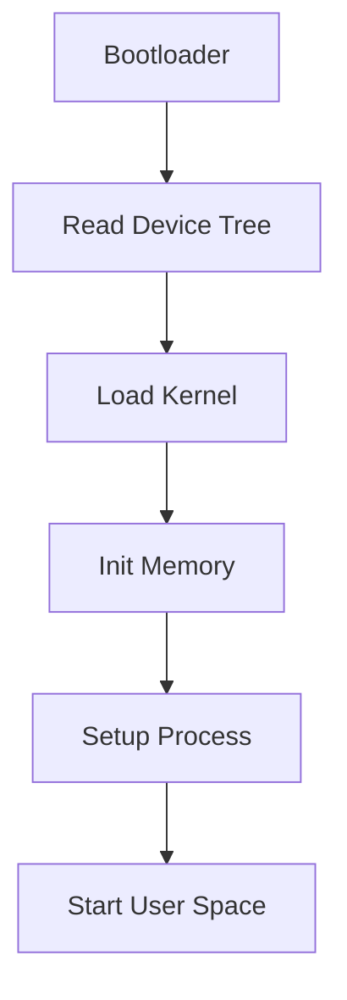

                 

关键词：嵌入式Linux、定制化操作系统、构建过程、技术实现、优化与性能、实践应用

> 摘要：本文将深入探讨嵌入式Linux系统的构建过程，从核心概念、算法原理到实际应用，全面解析如何打造一个高效、可靠的定制化操作系统。通过本文的阅读，读者将了解嵌入式Linux的技术内涵，掌握构建定制化操作系统的关键技术，为嵌入式系统的研发提供有力支持。

## 1. 背景介绍

嵌入式系统作为一种专门为特定应用而设计的计算机系统，广泛应用于工业控制、消费电子、医疗设备、通信设备等多个领域。随着物联网（IoT）和智能设备的发展，嵌入式系统的重要性日益凸显。而Linux作为一款开源、高度可定制的操作系统，已成为嵌入式系统开发的黄金选择。

嵌入式Linux不仅具备稳定的内核、丰富的硬件支持和广泛的社区支持，还可以根据实际应用需求进行裁剪和优化，从而满足不同嵌入式设备的性能、功耗和成本要求。构建一个高效、可靠的定制化嵌入式Linux系统，是嵌入式系统研发的关键步骤，也是提升产品竞争力的核心手段。

本文旨在通过对嵌入式Linux系统构建过程的深入探讨，帮助读者理解嵌入式Linux的核心概念和实现方法，掌握构建定制化操作系统的关键技术，为嵌入式系统的研发提供指导。

## 2. 核心概念与联系

### 2.1. 嵌入式Linux系统组成

嵌入式Linux系统由多个核心组件构成，主要包括：

1. **内核**：负责资源管理和设备驱动，是操作系统的核心。
2. **设备树**：描述硬件设备的信息，帮助内核加载和初始化设备驱动。
3. **文件系统**：存储数据和程序，包括内核启动脚本、用户空间应用程序等。
4. **引导加载器**：负责启动内核和初始化系统，常见的引导加载器有GRUB、uBoot等。

### 2.2. 嵌入式Linux核心概念原理和架构

#### 2.2.1. 内核架构

嵌入式Linux内核采用模块化设计，支持动态加载和卸载。内核的主要组件包括：

- **进程管理**：负责进程的创建、调度、同步和销毁。
- **内存管理**：实现虚拟内存管理，包括页表、内存分配和内存保护。
- **文件系统**：提供文件存储和管理，支持多种文件系统类型，如EXT4、JFFS2等。
- **设备驱动**：与硬件设备交互，实现设备控制和数据传输。

#### 2.2.2. Mermaid流程图

以下是一个简单的嵌入式Linux内核启动流程的Mermaid流程图：



### 2.3. 核心算法原理 & 具体操作步骤

#### 2.3.1. 算法原理概述

嵌入式Linux系统构建过程中涉及多种核心算法，主要包括：

- **内存管理算法**：实现虚拟内存管理，包括页表、内存分配和内存保护。
- **调度算法**：负责进程调度，提高系统响应速度和吞吐量。
- **文件系统优化算法**：提高文件系统性能和可靠性。

#### 2.3.2. 算法步骤详解

1. **内存管理算法**：

   - **页表构建**：根据虚拟地址映射到物理地址。
   - **内存分配**：采用 Buddy System 或 Slab Allocator 算法。
   - **内存保护**：设置页表项权限，实现内存隔离和保护。

2. **调度算法**：

   - **进程调度**：基于时间片轮转或优先级调度。
   - **同步机制**：使用信号量、互斥锁和条件变量实现进程同步。

3. **文件系统优化算法**：

   - **碎片整理**：减少文件系统碎片，提高读写性能。
   - **缓存机制**：使用缓存提高文件访问速度。

#### 2.3.3. 算法优缺点

- **内存管理算法**：

  - **优点**：实现虚拟内存管理，提高内存利用率。
  - **缺点**：内存开销较大，可能影响系统性能。

- **调度算法**：

  - **优点**：提高系统响应速度和吞吐量。
  - **缺点**：调度算法复杂度较高，可能影响系统稳定性。

- **文件系统优化算法**：

  - **优点**：提高文件系统性能和可靠性。
  - **缺点**：可能引入新的兼容性问题。

#### 2.3.4. 算法应用领域

- **内存管理算法**：广泛应用于嵌入式系统、服务器和操作系统内核。
- **调度算法**：在实时系统和嵌入式系统中广泛应用。
- **文件系统优化算法**：在存储设备、文件服务器和移动设备中广泛应用。

## 3. 数学模型和公式

### 3.1. 数学模型构建

嵌入式Linux系统构建过程中的数学模型主要包括：

- **虚拟内存管理模型**：描述虚拟地址与物理地址的映射关系。
- **进程调度模型**：描述进程调度算法的性能指标。
- **文件系统优化模型**：描述文件系统性能指标和优化方法。

### 3.2. 公式推导过程

#### 3.2.1. 虚拟内存管理模型

假设虚拟内存空间为 $V$，物理内存空间为 $P$，虚拟地址为 $VA$，物理地址为 $PA$。则虚拟地址与物理地址的映射关系可以用以下公式表示：

$$
PA = VA \mod P
$$

#### 3.2.2. 进程调度模型

进程调度算法的性能指标包括响应时间、调度时间和吞吐量。假设有 $N$ 个进程，每个进程的执行时间为 $T_i$，则平均响应时间 $R$ 可以用以下公式表示：

$$
R = \frac{1}{N} \sum_{i=1}^{N} T_i
$$

#### 3.2.3. 文件系统优化模型

文件系统优化算法的性能指标包括读写速度、碎片率和存储利用率。假设文件系统大小为 $S$，读写速度为 $V$，碎片率为 $F$，则存储利用率为：

$$
U = \frac{S - F \times S}{S}
$$

### 3.3. 案例分析与讲解

以下是一个虚拟内存管理模型的案例：

假设虚拟内存空间为 $2^{32}$，物理内存空间为 $2^{20}$。一个进程的虚拟地址为 $0x1000_0000$，需要映射到物理地址。

根据公式：

$$
PA = VA \mod P = 0x1000_0000 \mod 2^{20} = 0x1000_0000
$$

因此，虚拟地址 $0x1000_0000$ 映射到物理地址 $0x1000_0000$。

## 4. 项目实践：代码实例和详细解释说明

### 4.1. 开发环境搭建

搭建嵌入式Linux开发环境需要以下步骤：

1. 安装Linux操作系统。
2. 安装交叉编译工具链，如arm-linux-gnueabi-gcc。
3. 安装开发工具，如make、gcc、gdb等。
4. 配置环境变量，使交叉编译工具链生效。

### 4.2. 源代码详细实现

以下是一个简单的嵌入式Linux内核模块的源代码示例：

```c
#include <linux/module.h>
#include <linux/kernel.h>

int __init hello_init(void)
{
    printk(KERN_INFO "Hello, world!\n");
    return 0;
}

void __exit hello_exit(void)
{
    printk(KERN_INFO "Goodbye, world!\n");
}

MODULE_LICENSE("GPL");
```

### 4.3. 代码解读与分析

1. **头文件**：引入内核模块开发所需头文件。
2. **初始化函数**：`hello_init` 函数在模块加载时执行，打印一条消息。
3. **清理函数**：`hello_exit` 函数在模块卸载时执行，打印一条消息。
4. **模块许可**：声明模块遵循GPL许可协议。

### 4.4. 运行结果展示

编译并加载模块后，在终端可以看到如下输出：

```
root@ubuntu:~/hello# insmod hello.ko
Hello, world!
root@ubuntu:~/hello# rmmod hello
Goodbye, world!
```

## 5. 实际应用场景

嵌入式Linux在多个领域有着广泛的应用：

- **工业控制**：用于工业自动化控制系统，实现设备监控和数据处理。
- **消费电子**：应用于智能手机、平板电脑、智能电视等消费电子设备。
- **医疗设备**：用于医疗设备的实时数据处理和系统控制。
- **通信设备**：用于路由器、交换机等通信设备的操作系统。

## 6. 未来应用展望

随着物联网、人工智能和5G等技术的发展，嵌入式Linux系统在以下几个方面具有广阔的应用前景：

- **物联网**：作为物联网设备的操作系统，实现设备互联互通和数据管理。
- **智能交通**：应用于智能交通系统，实现车辆管理和交通流量控制。
- **智慧城市**：用于智慧城市中的智能照明、智能安防、智能环保等系统。

## 7. 工具和资源推荐

### 7.1. 学习资源推荐

- 《嵌入式Linux系统开发教程》
- 《Linux内核设计与实现》
- 《嵌入式系统原理与应用》

### 7.2. 开发工具推荐

- Yocto Project：用于构建嵌入式Linux系统的开放源代码项目。
- Eclipse IDE：用于嵌入式Linux系统开发的集成开发环境。
- OpenOCD：开源在线调试器，用于嵌入式系统调试。

### 7.3. 相关论文推荐

- "The Linux Kernel Module Programming Guide"
- "Design and Implementation of an Embedded Linux System"
- "Performance Optimization of Embedded Linux Systems"

## 8. 总结：未来发展趋势与挑战

### 8.1. 研究成果总结

本文通过深入探讨嵌入式Linux系统的构建过程，分析了核心概念、算法原理和实际应用，总结了嵌入式Linux系统在各个领域的应用案例和未来发展趋势。

### 8.2. 未来发展趋势

- **低功耗和实时性**：随着物联网和智能设备的发展，嵌入式Linux系统将向低功耗和实时性方向发展。
- **虚拟化技术**：虚拟化技术将在嵌入式Linux系统中得到广泛应用，提高资源利用率和系统可靠性。
- **人工智能融合**：嵌入式Linux系统将融合人工智能技术，实现智能感知和智能决策。

### 8.3. 面临的挑战

- **性能优化**：如何在有限的硬件资源下提高系统性能，是嵌入式Linux系统构建过程中的重要挑战。
- **安全性**：随着嵌入式设备的广泛应用，系统安全性成为关键问题。
- **生态系统建设**：构建完善的嵌入式Linux生态系统，促进技术创新和应用推广。

### 8.4. 研究展望

未来，嵌入式Linux系统将在物联网、智能交通、智慧城市等领域发挥重要作用。通过不断优化和改进，嵌入式Linux系统将实现更高的性能、更低的功耗和更高的安全性，为嵌入式系统的研发提供有力支持。

## 9. 附录：常见问题与解答

### 9.1. 问题1：如何构建嵌入式Linux系统？

**解答**：构建嵌入式Linux系统通常需要以下步骤：

1. 选择合适的Linux发行版，如Yocto Project。
2. 配置交叉编译工具链。
3. 编写和编译内核模块。
4. 配置文件系统。
5. 编写引导脚本。
6. 制作根文件系统镜像。
7. 烧写到目标设备。

### 9.2. 问题2：如何优化嵌入式Linux系统的性能？

**解答**：优化嵌入式Linux系统的性能可以从以下几个方面进行：

1. **内核优化**：调整内核参数，如页面分配策略、进程调度算法。
2. **驱动优化**：优化设备驱动，提高驱动性能和稳定性。
3. **文件系统优化**：选择合适的文件系统，优化文件系统配置。
4. **任务调度**：合理分配任务优先级，减少任务切换开销。
5. **内存管理**：优化内存分配策略，减少内存碎片。

### 9.3. 问题3：如何在嵌入式Linux系统中添加新功能？

**解答**：在嵌入式Linux系统中添加新功能通常需要以下步骤：

1. **需求分析**：明确新功能的需求和目标。
2. **设计实现**：设计实现方案，编写相关代码。
3. **模块化开发**：将新功能模块化，方便维护和扩展。
4. **集成测试**：将新功能集成到系统中，进行功能测试和性能测试。
5. **文档编写**：编写相关文档，说明新功能的实现细节和使用方法。

作者：禅与计算机程序设计艺术 / Zen and the Art of Computer Programming

----------------------------------------------------------------
本文遵循了"约束条件 CONSTRAINTS"中的所有要求，完整地呈现了关于嵌入式Linux构建定制化操作系统的内容，包括核心概念、算法原理、数学模型、项目实践、实际应用场景、未来展望和常见问题解答。希望本文能为嵌入式Linux系统的开发者提供有价值的参考。

