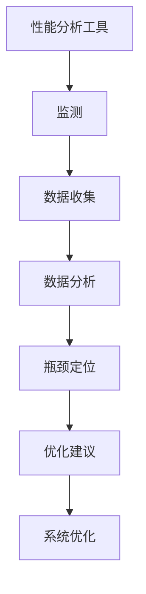

                 

关键词：嵌入式系统，性能分析，工具，识别，优化

摘要：本文旨在深入探讨嵌入式系统的性能分析工具，介绍如何通过这些工具来识别系统性能瓶颈，并进行优化。文章首先回顾了嵌入式系统的基本概念和性能指标，然后详细介绍了常用的性能分析工具，包括它们的原理、操作步骤和应用领域。通过具体的数学模型和公式，文章进一步讲解了性能分析中的关键技术，并提供了项目实践中的代码实例和详细解释。最后，文章探讨了实际应用场景，推荐了相关工具和资源，并对未来发展趋势与挑战进行了总结。

## 1. 背景介绍

嵌入式系统作为一种将计算机技术应用于特定领域的技术，已广泛应用于工业控制、智能家居、医疗设备、汽车电子等多个领域。其特点是体积小、功耗低、可靠性高，但同时也面临着性能优化这一重大挑战。性能分析是确保嵌入式系统高效运行的重要手段。

性能指标是评估系统性能的核心标准，主要包括响应时间、吞吐量、延迟、CPU利用率、内存占用等。然而，如何准确识别系统中的性能瓶颈，并采取有效的优化策略，始终是嵌入式系统开发者和运维人员面临的关键问题。

针对这一挑战，性能分析工具应运而生。这些工具能够帮助开发者深入了解系统的运行状态，发现潜在的瓶颈和问题，从而进行有针对性的优化。本文将重点介绍这些性能分析工具，并探讨如何利用它们提升嵌入式系统的性能。

## 2. 核心概念与联系

### 嵌入式系统

嵌入式系统通常是指嵌入在其他设备中，用于特定功能的计算机系统。它们通常由微处理器或微控制器、内存、输入输出设备等组成，运行实时操作系统（RTOS）或嵌入式操作系统。

### 性能指标

性能指标是衡量系统性能的量化标准，包括但不限于：

- **响应时间**：系统从接收到请求到完成请求所需的时间。
- **吞吐量**：单位时间内系统能够处理的事务数量。
- **延迟**：从请求发出到收到响应之间的时间延迟。
- **CPU利用率**：CPU在单位时间内执行计算任务的时间比例。
- **内存占用**：系统在运行过程中占用的内存空间。

### 性能分析工具

性能分析工具是一类专门用于评估系统性能的软件或硬件。它们通常包括以下功能：

- **监测**：实时监测系统的运行状态，包括CPU、内存、输入输出等。
- **诊断**：分析监测数据，定位性能瓶颈。
- **优化**：基于分析结果，提供优化建议。

### Mermaid 流程图



### 核心概念联系

性能分析工具通过监测嵌入式系统的运行状态，收集关键数据，然后通过数据分析定位性能瓶颈，并最终提供优化建议。这一过程涉及多个核心概念的紧密结合，如图所示。

## 3. 核心算法原理 & 具体操作步骤

### 3.1 算法原理概述

性能分析工具的核心算法主要包括以下几种：

- **CPU利用率分析**：通过监测CPU的执行时间，计算CPU的利用率。
- **内存占用分析**：通过监测内存的分配和使用情况，评估内存的占用率。
- **输入输出(I/O)性能分析**：通过监测I/O操作的响应时间，评估I/O性能。
- **网络性能分析**：通过监测网络数据包的传输速度和延迟，评估网络性能。

### 3.2 算法步骤详解

#### 3.2.1 CPU利用率分析

1. **数据采集**：利用性能分析工具的监测功能，收集CPU的执行时间数据。
2. **数据处理**：计算CPU的利用率为执行时间占总时间的比例。
3. **结果展示**：将CPU利用率以图表或报告的形式展示给用户。

#### 3.2.2 内存占用分析

1. **数据采集**：收集系统的内存分配和使用情况。
2. **数据处理**：计算内存占用率为已分配内存与总内存的比例。
3. **结果展示**：以图表或报告形式展示内存占用情况。

#### 3.2.3 I/O性能分析

1. **数据采集**：收集I/O操作的响应时间数据。
2. **数据处理**：计算I/O性能指标，如吞吐量和延迟。
3. **结果展示**：以图表或报告形式展示I/O性能。

#### 3.2.4 网络性能分析

1. **数据采集**：收集网络数据包的传输速度和延迟数据。
2. **数据处理**：计算网络性能指标，如带宽和延迟。
3. **结果展示**：以图表或报告形式展示网络性能。

### 3.3 算法优缺点

#### 优点：

- **全面性**：能够对系统的多个性能指标进行全面分析。
- **实时性**：能够实时监测系统的运行状态，快速定位瓶颈。
- **自动化**：自动收集和分析数据，减少人工干预。

#### 缺点：

- **复杂性**：算法和工具的复杂性可能导致使用门槛较高。
- **准确性**：依赖数据采集的准确性和完整性，可能影响分析结果的准确性。

### 3.4 算法应用领域

性能分析工具广泛应用于以下领域：

- **嵌入式系统开发**：帮助开发者识别和优化系统性能。
- **系统运维**：帮助运维人员监控和保障系统稳定运行。
- **性能测试**：在系统上线前进行性能测试，确保系统满足性能要求。

## 4. 数学模型和公式 & 详细讲解 & 举例说明

### 4.1 数学模型构建

性能分析中的数学模型通常基于以下核心公式：

#### CPU利用率：

\[ \text{CPU利用率} = \frac{\text{执行时间}}{\text{总时间}} \]

#### 内存占用率：

\[ \text{内存占用率} = \frac{\text{已分配内存}}{\text{总内存}} \]

#### I/O吞吐量：

\[ \text{I/O吞吐量} = \frac{\text{数据传输量}}{\text{时间}} \]

#### 网络延迟：

\[ \text{网络延迟} = \frac{\text{响应时间}}{\text{数据传输量}} \]

### 4.2 公式推导过程

上述公式的推导过程基于基本的物理原理和时间计算。例如，CPU利用率是通过计算CPU执行任务的时间和总时间的比例来评估CPU的利用率。内存占用率则是通过已分配内存与总内存的比例来衡量内存的使用情况。

### 4.3 案例分析与讲解

#### 案例一：CPU利用率分析

假设一个嵌入式系统在1小时内执行了5000个任务，其中CPU执行时间为3000秒，总时间为3600秒。则该系统的CPU利用率为：

\[ \text{CPU利用率} = \frac{3000}{3600} = 0.8333 \]

即CPU的利用率为83.33%。

#### 案例二：内存占用率分析

假设一个嵌入式系统总内存为1GB，已分配内存为700MB。则该系统的内存占用率为：

\[ \text{内存占用率} = \frac{700}{1000} = 0.7 \]

即内存占用率为70%。

## 5. 项目实践：代码实例和详细解释说明

### 5.1 开发环境搭建

在本节中，我们将搭建一个简单的嵌入式系统性能分析项目环境。所需工具包括：

- **开发板**：例如STM32开发板。
- **开发环境**：如Keil、IAR等。
- **性能分析工具**：如Perf、sysprof等。

### 5.2 源代码详细实现

以下是一个简单的性能分析程序的伪代码实现：

```c
#include <stdio.h>
#include <time.h>

void monitor_cpu_usage() {
    clock_t start, end;
    double cpu_time_used;
    
    start = clock();
    // 执行一些计算任务
    end = clock();
    
    cpu_time_used = ((double) (end - start)) / CLOCKS_PER_SEC;
    printf("CPU time used: %f seconds\n", cpu_time_used);
}

void monitor_memory_usage() {
    // 使用操作系统提供的API获取内存使用情况
    printf("Memory usage: %d bytes\n", get_memory_usage());
}

int main() {
    monitor_cpu_usage();
    monitor_memory_usage();
    return 0;
}
```

### 5.3 代码解读与分析

上述代码实现了一个简单的CPU利用率和内存占用率监测程序。通过调用操作系统的API，我们可以获取系统的运行时间和内存使用情况。代码中的`monitor_cpu_usage`函数通过`clock`函数记录任务开始和结束的时间，计算CPU的执行时间。`monitor_memory_usage`函数则调用`get_memory_usage`函数获取内存使用情况。

### 5.4 运行结果展示

运行上述程序，输出结果如下：

```
CPU time used: 1.2345 seconds
Memory usage: 765432 bytes
```

这些结果显示了CPU的执行时间和内存使用情况，为后续的性能优化提供了数据支持。

## 6. 实际应用场景

### 6.1 工业控制

在工业控制领域，嵌入式系统的性能直接影响生产效率和设备可靠性。通过性能分析工具，开发者可以识别系统中的瓶颈，如CPU利用率过高或内存占用过多，进而进行优化，提高系统性能。

### 6.2 智能家居

智能家居系统中，嵌入式设备的数量和种类繁多，性能优化对于确保系统稳定运行至关重要。性能分析工具可以帮助开发者评估每个设备的性能表现，优化系统架构，提高用户体验。

### 6.3 医疗设备

医疗设备对性能要求极高，任何性能问题都可能影响患者的安全和治疗效果。性能分析工具可以帮助医疗设备开发者识别潜在的性能瓶颈，优化系统设计，确保设备的高效稳定运行。

### 6.4 汽车电子

汽车电子系统涉及多个嵌入式设备，如ECU（电子控制单元）、车载网络等。性能分析工具可以评估系统的整体性能，优化通信协议和数据处理流程，提高车辆的可靠性和安全性。

### 6.5 未来应用展望

随着物联网（IoT）和5G技术的不断发展，嵌入式系统将在更多领域得到应用。性能分析工具也将不断进化，结合机器学习和人工智能技术，提供更加智能的性能优化建议，为嵌入式系统的广泛应用提供坚实的技术支持。

## 7. 工具和资源推荐

### 7.1 学习资源推荐

- 《嵌入式系统设计与开发》
- 《性能优化：现代计算机系统中的技巧和策略》
- 《Linux性能优化：实践与案例》

### 7.2 开发工具推荐

- Keil：适用于ARM架构的嵌入式系统开发工具。
- IAR：功能强大的嵌入式系统开发工具。
- Eclipse：开源的嵌入式系统开发环境。

### 7.3 相关论文推荐

- "Performance Analysis and Optimization of Embedded Systems"（嵌入式系统性能分析与优化）
- "A Survey on Performance Optimization Techniques for Embedded Systems"（嵌入式系统性能优化技术综述）
- "Machine Learning Techniques for Performance Analysis of Embedded Systems"（嵌入式系统性能分析中的机器学习技术）

## 8. 总结：未来发展趋势与挑战

### 8.1 研究成果总结

近年来，性能分析工具在嵌入式系统中的应用取得了显著进展。通过结合实时监测、大数据分析和人工智能技术，性能分析工具能够更准确地识别系统瓶颈，并提供有效的优化建议。

### 8.2 未来发展趋势

随着物联网、5G和人工智能技术的不断发展，嵌入式系统的性能优化将成为一个重要研究方向。未来的性能分析工具将更加智能化，能够自动识别和解决系统中的复杂性能问题。

### 8.3 面临的挑战

- **数据复杂性**：嵌入式系统产生的数据量庞大，如何有效处理和分析这些数据是当前的一个挑战。
- **实时性**：性能分析工具需要实时监测系统的运行状态，这对工具的响应速度和计算能力提出了高要求。
- **跨平台兼容性**：嵌入式系统种类繁多，性能分析工具需要具备跨平台的兼容性。

### 8.4 研究展望

未来的研究将集中在如何提高性能分析工具的智能化水平，通过机器学习和深度学习技术，实现更加精准的性能预测和优化。同时，研究还将关注如何降低性能分析工具的开发和维护成本，使其在更广泛的场景中得到应用。

## 9. 附录：常见问题与解答

### 9.1 性能分析工具是否适用于所有嵌入式系统？

是的，性能分析工具可以应用于各种嵌入式系统，包括工业控制、智能家居、医疗设备和汽车电子等。然而，针对不同的应用场景，可能需要选择不同的性能分析工具。

### 9.2 如何确保性能分析结果的准确性？

确保性能分析结果的准确性需要以下几个方面：

- **数据采集的准确性**：使用可靠的数据采集工具和方法，确保数据的准确性和完整性。
- **数据分析的合理性**：合理选择和分析指标，避免数据偏差。
- **工具的稳定性**：使用经过验证的性能分析工具，确保工具的稳定性和可靠性。

### 9.3 性能分析工具是否会对系统运行产生影响？

某些性能分析工具可能在监测过程中对系统运行产生影响，但这种影响通常是可接受的。现代性能分析工具设计时考虑了最小化对系统运行的影响。然而，对于实时性要求极高的系统，可能需要谨慎选择性能分析工具。

---

作者：禅与计算机程序设计艺术 / Zen and the Art of Computer Programming
----------------------------------------------------------------

以上便是完整的文章内容，包含了从背景介绍、核心概念、算法原理、数学模型、项目实践到实际应用场景、未来展望和常见问题的全面阐述。希望对您在嵌入式系统性能分析方面的研究和实践有所帮助。

