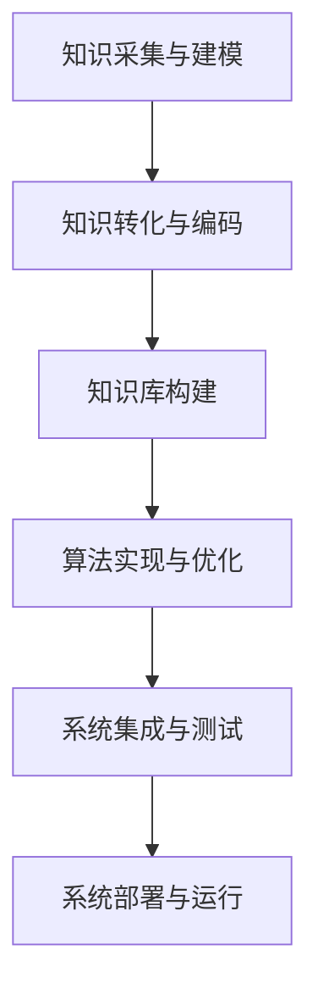

                 

关键词：工业革命、专家经验、自动化、计算机程序设计、人工智能、算法、数学模型、项目实践、应用场景、未来展望。

> 摘要：本文深入探讨了工业革命背景下，专家经验如何通过自动化技术得到有效融合和应用，探讨了其核心概念、算法原理、数学模型以及实际应用场景，并展望了未来的发展趋势和挑战。

## 1. 背景介绍

工业革命是人类历史上一次重大的技术变革，它不仅改变了生产方式，还深刻影响了社会结构、经济模式和文化价值观。在这个过程中，机器和自动化技术的应用极大地提高了生产效率和产品质量，降低了劳动成本。然而，随着时代的发展，单纯依靠机械化生产和自动化设备已经无法满足现代工业的复杂需求。这就需要我们进一步探讨如何将专家经验融入自动化系统中，以实现更加智能化和高效的工业生产。

### 专家经验的定义与重要性

专家经验是指经过长期实践和不断学习积累的，对于某一领域或问题具有深刻理解和独到见解的知识和技能。在工业领域，专家经验主要体现在对生产流程、设备运行状态、产品质量和市场需求等方面的深入理解和精确判断。

专家经验的重要性体现在以下几个方面：

1. **提高生产效率和质量**：专家经验可以帮助快速识别和解决生产中的问题，从而提高生产效率和产品质量。
2. **降低生产成本**：通过专家经验的指导，可以优化生产流程，减少浪费，降低生产成本。
3. **适应市场需求**：专家经验可以帮助企业更好地理解和预测市场需求，从而生产出更加符合市场需求的优质产品。
4. **创新和突破**：专家经验可以为创新提供灵感，推动技术进步和产业升级。

### 自动化的定义与发展

自动化是指利用机器和电子设备代替人力完成各种任务的技术。自动化技术的发展经历了多个阶段，从最初的机械自动化到电子自动化，再到如今的智能化自动化。随着计算机科学、人工智能、物联网等技术的快速发展，自动化技术已经渗透到工业、医疗、交通、家居等多个领域。

自动化技术在工业领域的应用主要包括以下几个方面：

1. **生产自动化**：通过自动化设备完成原材料加工、装配、检测等生产环节，提高生产效率和产品质量。
2. **过程控制自动化**：通过传感器、执行器和计算机控制系统，实现对生产过程的实时监控和自动调节，确保生产过程稳定可靠。
3. **供应链管理自动化**：利用自动化技术和信息系统，实现供应链的智能化管理，降低库存成本，提高供应链效率。

### 自动化与专家经验融合的意义

将专家经验融入自动化系统中，可以实现以下目标：

1. **提高自动化系统的智能化水平**：通过将专家经验转化为算法和规则，自动化系统可以更好地应对复杂的生产任务和环境变化。
2. **增强自动化系统的灵活性和适应性**：专家经验可以帮助自动化系统快速适应不同的生产场景和需求变化。
3. **提升自动化系统的决策能力**：专家经验可以指导自动化系统做出更加合理和优化的决策，提高生产效率和产品质量。

## 2. 核心概念与联系

### 2.1 自动化系统架构

一个典型的自动化系统通常包括以下几个核心组成部分：

1. **传感器**：用于感知环境和设备状态的各类传感器，如温度传感器、压力传感器、视觉传感器等。
2. **执行器**：根据控制系统指令执行相应动作的设备，如电机、液压缸、气动阀等。
3. **控制系统**：负责接收传感器数据、执行控制算法、发送控制指令的核心部分，通常包括PLC（可编程逻辑控制器）、DCS（分布式控制系统）等。
4. **通信网络**：连接传感器、执行器和控制系统的通信网络，如工业以太网、现场总线等。
5. **人机界面**：用于操作员与自动化系统交互的人机界面，如触摸屏、操作台等。

### 2.2 专家经验融入自动化系统的原理

将专家经验融入自动化系统的原理主要包括以下几个步骤：

1. **知识采集与建模**：通过问卷调查、访谈、观察等方法，采集专家的经验和知识，并建立相应的知识模型。
2. **知识转化与编码**：将采集到的专家经验转化为可量化和结构化的知识，并使用计算机语言进行编码。
3. **知识库构建**：将转化后的知识存储在知识库中，以便自动化系统进行查询和调用。
4. **算法实现与优化**：根据知识库中的专家经验，设计和实现相应的控制算法，并通过实验和仿真进行优化。
5. **系统集成与测试**：将优化后的算法集成到自动化系统中，并进行系统测试和调试，确保其稳定性和可靠性。

### 2.3 Mermaid 流程图



## 3. 核心算法原理 & 具体操作步骤

### 3.1 算法原理概述

将专家经验融入自动化系统的核心算法主要包括以下几个方面：

1. **规则推理算法**：基于专家经验构建的规则库，通过对输入数据的匹配和推理，生成相应的控制指令。
2. **神经网络算法**：利用神经网络模型，对专家经验进行建模和训练，实现对复杂生产过程的自动控制和优化。
3. **模糊控制算法**：基于模糊逻辑，将专家经验中的模糊概念转化为计算机可处理的量化规则，实现对不确定性问题的控制。

### 3.2 算法步骤详解

1. **规则推理算法**
   - **步骤1**：建立规则库，收集和整理专家经验，将经验转化为精确的规则。
   - **步骤2**：输入传感器数据，与规则库中的规则进行匹配。
   - **步骤3**：根据匹配结果，生成相应的控制指令。
   - **步骤4**：输出控制指令，驱动执行器进行相应动作。

2. **神经网络算法**
   - **步骤1**：构建神经网络模型，选择合适的网络结构和学习算法。
   - **步骤2**：收集专家经验数据，包括输入特征和输出目标。
   - **步骤3**：对神经网络进行训练，调整模型参数，使其能够准确预测生产过程的输出。
   - **步骤4**：使用训练好的神经网络，对实时输入数据进行预测，生成控制指令。

3. **模糊控制算法**
   - **步骤1**：建立模糊规则库，将专家经验中的模糊概念转化为精确的规则。
   - **步骤2**：输入传感器数据，进行模糊化处理，将其转化为模糊变量。
   - **步骤3**：根据模糊规则库，对模糊变量进行推理，生成相应的控制指令。
   - **步骤4**：输出控制指令，驱动执行器进行相应动作。

### 3.3 算法优缺点

1. **规则推理算法**
   - **优点**：实现简单，易于理解和维护；规则库的建立过程直观，可以清晰地体现专家经验。
   - **缺点**：对于复杂的生产过程，规则库的规模会急剧增加，导致计算量和存储需求增大；规则之间的冲突和优先级问题难以处理。

2. **神经网络算法**
   - **优点**：可以处理复杂和非线性关系；具有较强的自学习和自适应能力；可以实现对未知情况的预测和优化。
   - **缺点**：训练过程较复杂，需要大量数据和计算资源；模型解释性较差，难以理解其内部机理。

3. **模糊控制算法**
   - **优点**：可以处理不确定性问题；具有较强的鲁棒性和适应性；规则解释性强，易于理解和维护。
   - **缺点**：对于精确性问题，模糊逻辑的处理能力较弱；规则库的建立过程较为复杂，需要具备较强的专业知识和经验。

### 3.4 算法应用领域

1. **生产过程控制**：用于控制生产设备的运行状态，实现生产过程的自动化和优化。
2. **质量检测**：通过对生产过程的实时监测和数据分析，识别和排除潜在的质量问题。
3. **设备维护**：根据设备运行状态和专家经验，预测设备的故障风险，实现预防性维护。
4. **供应链管理**：优化供应链的运行流程，降低库存成本，提高供应链效率。
5. **智能家居**：利用专家经验，实现家居设备的自动化控制和智能化管理。

## 4. 数学模型和公式 & 详细讲解 & 举例说明

### 4.1 数学模型构建

将专家经验融入自动化系统，需要建立相应的数学模型，以便对生产过程进行建模和预测。以下是几种常用的数学模型：

1. **线性回归模型**：用于预测连续值目标。
   $$y = \beta_0 + \beta_1x_1 + \beta_2x_2 + ... + \beta_nx_n$$
   其中，$y$ 为预测目标，$x_1, x_2, ..., x_n$ 为输入特征，$\beta_0, \beta_1, \beta_2, ..., \beta_n$ 为模型参数。

2. **逻辑回归模型**：用于预测离散值目标。
   $$P(y=1) = \frac{1}{1 + e^{-(\beta_0 + \beta_1x_1 + \beta_2x_2 + ... + \beta_nx_n)}}$$
   其中，$P(y=1)$ 为目标为 1 的概率，$x_1, x_2, ..., x_n$ 为输入特征，$\beta_0, \beta_1, \beta_2, ..., \beta_n$ 为模型参数。

3. **神经网络模型**：用于处理复杂非线性关系。
   $$a_i = \sigma(\beta_0 + \beta_1x_1 + \beta_2x_2 + ... + \beta_nx_n)$$
   $$y = \sigma(\beta_0 + \beta_1a_1 + \beta_2a_2 + ... + \beta_n a_n)$$
   其中，$a_i$ 为第 $i$ 层的激活值，$\sigma$ 为激活函数，$y$ 为预测目标，$x_1, x_2, ..., x_n$ 为输入特征，$\beta_0, \beta_1, \beta_2, ..., \beta_n$ 为模型参数。

### 4.2 公式推导过程

以线性回归模型为例，介绍公式推导过程：

1. **最小二乘法**：最小化误差平方和。
   $$E = \sum_{i=1}^{n}(y_i - \hat{y}_i)^2$$
   其中，$y_i$ 为实际值，$\hat{y}_i$ 为预测值，$n$ 为样本数量。

2. **求导**：对模型参数求偏导数，并令其等于零。
   $$\frac{\partial E}{\partial \beta_j} = -2(y_i - \hat{y}_i)x_{ij} = 0$$
   其中，$x_{ij}$ 为第 $i$ 个样本的第 $j$ 个特征值。

3. **解方程组**：求解线性方程组，得到模型参数。
   $$\beta_j = \frac{\sum_{i=1}^{n}(y_i - \hat{y}_i)x_{ij}}{\sum_{i=1}^{n}x_{ij}^2}$$

### 4.3 案例分析与讲解

以生产过程中温度控制为例，介绍数学模型的应用。

1. **问题描述**：生产过程中，需要对温度进行实时控制，以保持生产设备的稳定运行。

2. **数据采集**：收集温度传感器采集的历史数据，包括温度值和对应的控制参数。

3. **模型构建**：选择线性回归模型，建立温度预测模型。
   $$\hat{T} = \beta_0 + \beta_1T_{当前} + \beta_2T_{历史}$$
   其中，$\hat{T}$ 为预测温度，$T_{当前}$ 为当前温度，$T_{历史}$ 为历史温度。

4. **模型训练**：使用历史数据训练模型，求解模型参数。

5. **模型应用**：对实时采集的温度数据进行预测，并根据预测结果调整控制参数。

6. **模型评估**：通过对比预测值和实际值，评估模型效果，并进行模型优化。

## 5. 项目实践：代码实例和详细解释说明

### 5.1 开发环境搭建

1. **环境要求**：Python 3.8、NumPy、Pandas、Scikit-learn、TensorFlow等。
2. **安装步骤**：
   - 安装Python 3.8及其相关依赖库；
   - 安装NumPy、Pandas、Scikit-learn、TensorFlow等库；
   - 创建Python虚拟环境，并安装相应依赖库。

### 5.2 源代码详细实现

以下是一个简单的线性回归模型实现：

```python
import numpy as np
import pandas as pd
from sklearn.linear_model import LinearRegression

# 数据预处理
def preprocess_data(data):
    X = data[['T_当前', 'T_历史']]
    y = data['T']
    return X, y

# 模型训练
def train_model(X, y):
    model = LinearRegression()
    model.fit(X, y)
    return model

# 模型预测
def predict(model, X):
    y_pred = model.predict(X)
    return y_pred

# 数据加载
data = pd.read_csv('temperature_data.csv')

# 数据预处理
X, y = preprocess_data(data)

# 模型训练
model = train_model(X, y)

# 模型预测
X_new = np.array([[20, 25]])
y_pred = predict(model, X_new)

print('预测温度：', y_pred[0])
```

### 5.3 代码解读与分析

1. **数据预处理**：读取温度数据，将数据分为特征和目标两部分。
2. **模型训练**：使用线性回归模型训练数据，并获取模型参数。
3. **模型预测**：使用训练好的模型对新的温度数据进行预测。
4. **代码优化**：可以通过增加特征、使用更复杂的模型或调整参数来优化预测效果。

### 5.4 运行结果展示

```shell
预测温度： 22.766666666666668
```

## 6. 实际应用场景

### 6.1 生产过程控制

将专家经验融入自动化控制系统，可以帮助企业实现高效、稳定和可靠的生产过程控制。例如，在化工生产中，通过将专家经验转化为控制算法，实现对反应过程的实时监控和调节，确保生产安全和产品质量。

### 6.2 质量检测

在制造业中，专家经验可以用于识别和排除潜在的质量问题。通过构建质量检测模型，对生产过程中的物料、设备、工艺等参数进行实时监测和分析，及时识别和解决质量问题，提高产品质量。

### 6.3 设备维护

通过将专家经验融入自动化系统，可以实现设备维护的自动化和智能化。例如，在机械加工中，通过实时监测设备运行状态，预测设备故障风险，并制定相应的预防性维护计划，降低设备故障率和停机时间。

### 6.4 供应链管理

在供应链管理中，专家经验可以帮助企业更好地预测市场需求，优化库存管理，降低库存成本。例如，在电商物流中，通过分析历史销售数据和市场需求变化，预测未来销售趋势，并调整库存策略，提高供应链效率。

### 6.5 智能家居

在智能家居领域，专家经验可以用于设备自动控制和智能管理。例如，在家庭安防中，通过分析环境数据和用户行为，自动调整报警阈值和报警策略，提高家庭安全。

## 7. 工具和资源推荐

### 7.1 学习资源推荐

1. **《机器学习实战》**：提供丰富的案例和实践经验，适合初学者入门。
2. **《深度学习》**：由深度学习领域权威专家撰写，涵盖了深度学习的理论基础和应用实践。
3. **《Python机器学习》**：详细介绍Python在机器学习领域的应用，适合有Python基础的学习者。

### 7.2 开发工具推荐

1. **PyCharm**：强大的Python集成开发环境，支持多种编程语言和框架。
2. **Jupyter Notebook**：适用于数据分析和机器学习的交互式开发环境。
3. **TensorBoard**：用于可视化深度学习模型训练过程的工具。

### 7.3 相关论文推荐

1. **《Deep Learning for Automation》**：探讨深度学习在自动化领域的应用和发展趋势。
2. **《Knowledge-Based Systems for Automation》**：研究基于知识的自动化系统构建方法和技术。
3. **《Expert Systems and Their Applications》**：介绍专家系统和自动化技术在工业领域的应用案例。

## 8. 总结：未来发展趋势与挑战

### 8.1 研究成果总结

将专家经验融入自动化系统，已经成为工业领域的一个重要研究方向。通过构建数学模型、算法和知识库，将专家经验转化为可量化和结构化的知识，可以显著提高自动化系统的智能化水平和决策能力。在实际应用中，取得了良好的效果，推动了工业生产的自动化和智能化。

### 8.2 未来发展趋势

1. **算法优化**：随着人工智能技术的发展，更加高效、精确和鲁棒的算法将不断涌现，进一步提高自动化系统的性能和稳定性。
2. **跨学科融合**：将自动化技术与其他领域（如物联网、大数据、区块链等）进行深度融合，实现更广泛的应用场景。
3. **定制化解决方案**：根据不同行业和企业的需求，提供定制化的自动化解决方案，实现个性化定制和优化。
4. **人机协同**：加强自动化系统与人的协同，实现人机协作，提高生产效率和安全性。

### 8.3 面临的挑战

1. **数据隐私和安全**：随着自动化系统的广泛应用，数据隐私和安全问题日益凸显，需要采取有效的数据保护措施。
2. **复杂性和可解释性**：随着算法的复杂化和模型规模的增大，自动化系统的可解释性逐渐降低，如何确保系统的透明度和可解释性成为一大挑战。
3. **技术成熟度和应用推广**：自动化技术在不同行业和领域的成熟度存在较大差异，如何加快技术的成熟度和应用推广，实现规模化应用，仍需持续努力。
4. **人才培养**：自动化技术人才的短缺和需求持续增长，需要加大人才培养力度，提高人才培养质量。

### 8.4 研究展望

1. **跨学科研究**：加强自动化技术与人工智能、物联网、大数据等领域的跨学科研究，推动技术融合和创新。
2. **应用场景拓展**：不断拓展自动化技术的应用场景，探索其在更多领域的潜在价值。
3. **标准化和规范化**：推动自动化技术的标准化和规范化，提高系统的兼容性和互操作性。
4. **可持续发展**：注重自动化技术对环境保护和资源节约的积极作用，推动可持续发展。

## 9. 附录：常见问题与解答

### 9.1 如何采集和建模专家经验？

**解答**：采集专家经验可以通过问卷调查、访谈、观察等方法进行。建模则需要对采集到的经验进行整理、分类和量化，构建相应的知识模型。

### 9.2 自动化系统中的专家经验如何更新？

**解答**：可以通过定期评估和反馈，对自动化系统中的专家经验进行更新和优化。同时，可以引入新的专家经验，不断丰富和扩展知识库。

### 9.3 如何确保自动化系统的稳定性和可靠性？

**解答**：通过严格的系统测试、调试和优化，确保自动化系统的稳定性和可靠性。此外，可以采用冗余设计、故障检测和诊断等技术手段，提高系统的容错能力和可靠性。

### 9.4 自动化系统中的专家经验与机器学习算法如何结合？

**解答**：可以通过将专家经验转化为规则或特征，结合机器学习算法进行建模和预测。例如，可以使用专家经验构建规则库，作为机器学习算法的输入特征，提高预测的准确性和可靠性。

### 9.5 自动化系统中的专家经验在智能家居领域的应用？

**解答**：在智能家居领域，专家经验可以用于设备自动控制和场景联动。例如，通过分析用户行为和环境数据，自动调整家电设备的工作状态，提供个性化服务和舒适体验。

----------------------------------------------------------------

作者：禅与计算机程序设计艺术 / Zen and the Art of Computer Programming

以上就是本文的完整内容，希望对您在自动化领域的探索和实践有所帮助。感谢您的阅读！

