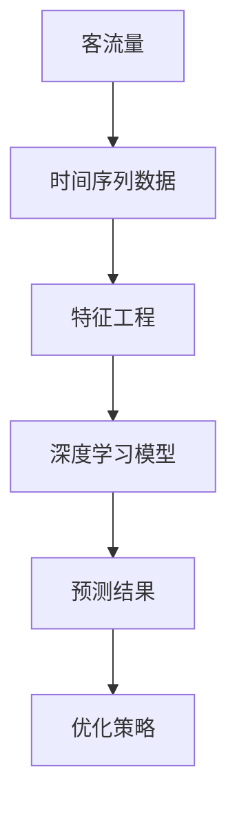

                 

关键词：人工智能、客流预测、深度学习、时间序列分析、预测模型、餐厅运营

> 摘要：本文旨在探讨如何使用人工智能技术，特别是深度学习算法，来构建一个能够准确预测巴奴毛肚火锅餐厅未来客流量的模型。文章将详细分析所需的核心概念与算法，并给出具体的数学模型和实现步骤。同时，文章还将讨论该模型在实际餐厅运营中的应用场景，以及未来可能的发展趋势和面临的挑战。

## 1. 背景介绍

随着社会经济的不断发展，餐饮行业竞争日益激烈。对于餐饮企业来说，准确预测餐厅客流量对于优化运营策略、提升服务质量具有重要意义。巴奴毛肚火锅作为一家知名的餐饮品牌，面临着如何在2025年实现更精准的客流预测，以应对市场变化和消费者需求。

客流预测不仅可以帮助企业合理配置人力和资源，还能提高餐厅的运营效率和客户满意度。然而，客流量的预测是一个复杂的问题，受到多种因素的影响，如天气、节假日、市场营销活动等。因此，需要运用先进的算法和技术来构建一个可靠的预测模型。

本文将结合巴奴毛肚火锅的实际情况，介绍如何使用深度学习算法构建一个客流预测模型，包括模型的选择、数据的预处理、模型的训练与验证，以及模型在实际运营中的应用。

## 2. 核心概念与联系

在构建客流预测模型之前，我们需要理解一些核心概念和它们之间的联系。以下是一个使用Mermaid绘制的流程图，展示了这些概念及其关系。



### 2.1. 客流量

客流量是餐厅运营的核心指标之一，反映了顾客访问餐厅的频率和数量。客流量数据通常通过POS系统、门禁系统等获取，并记录在时间序列中。

### 2.2. 时间序列数据

时间序列数据是客流量预测的基础。这些数据按照时间顺序排列，包含每个时间点上的客流量信息。通过对时间序列数据进行分析，可以识别出客流量的趋势、周期性和异常值。

### 2.3. 特征工程

特征工程是将原始数据转换成适合机器学习模型使用的特征的过程。在客流预测中，特征工程包括提取时间序列数据中的周期性、趋势性、季节性等特征，以及考虑外部因素，如天气、节假日等。

### 2.4. 深度学习模型

深度学习模型是一种能够自动提取特征的高级机器学习算法。在客流预测中，深度学习模型可以自动学习时间序列数据中的复杂模式和关系，从而提供准确的预测结果。

### 2.5. 预测结果

预测结果是模型对未来客流量的预测值。通过对预测结果的分析，餐厅可以制定相应的运营策略，如人员调配、库存管理等。

### 2.6. 优化策略

优化策略是根据预测结果调整餐厅运营策略的过程。通过不断调整和优化，可以逐步提高模型的预测准确性，从而提升餐厅的运营效率。

## 3. 核心算法原理 & 具体操作步骤

### 3.1. 算法原理概述

在构建客流预测模型时，我们选择了一种基于深度学习的时间序列预测算法——长短期记忆网络（Long Short-Term Memory，LSTM）。LSTM是一种能够处理长时间依赖关系的循环神经网络（Recurrent Neural Network，RNN），特别适用于时间序列数据的预测。

LSTM通过引入门控机制，有效地解决了传统RNN在处理长时间依赖关系时出现的梯度消失和梯度爆炸问题。LSTM的基本结构包括输入门、遗忘门和输出门，这些门控单元可以动态控制信息的流动，从而捕捉时间序列中的长期依赖关系。

### 3.2. 算法步骤详解

#### 3.2.1. 数据收集与预处理

1. **数据收集**：首先，从POS系统、门禁系统等获取餐厅的客流量数据，以及与客流量相关的其他数据，如天气、节假日信息等。
2. **数据清洗**：去除数据中的噪声和异常值，确保数据的准确性和一致性。
3. **数据归一化**：对数据进行归一化处理，将数据缩放到相同的范围，以便模型训练。

#### 3.2.2. 特征提取

1. **时间特征**：提取时间序列中的时间特征，如小时、星期、月份等。
2. **周期性特征**：根据时间序列数据，提取周期性特征，如一周内的周期性波动等。
3. **外部因素特征**：提取与客流量相关的外部因素特征，如天气、节假日等。

#### 3.2.3. 模型构建

1. **定义LSTM模型**：使用深度学习框架（如TensorFlow或PyTorch）定义LSTM模型，包括输入层、LSTM层、输出层等。
2. **模型参数设置**：设置模型参数，如LSTM层的神经元数量、学习率等。
3. **模型训练**：使用预处理后的数据对模型进行训练，优化模型参数。

#### 3.2.4. 模型验证与优化

1. **交叉验证**：使用交叉验证方法评估模型的预测性能，避免过拟合。
2. **参数调整**：根据验证结果，调整模型参数，提高预测准确性。
3. **模型集成**：将多个模型的预测结果进行集成，提高整体预测性能。

### 3.3. 算法优缺点

#### 优点

- **处理长时间依赖关系能力强**：LSTM能够捕捉时间序列中的长期依赖关系，适用于客流量的预测。
- **自适应性强**：LSTM通过门控机制，可以自适应地调整信息的流动，提高模型的预测准确性。
- **泛化能力强**：LSTM可以处理不同时间序列数据的特征，适用于各种场景。

#### 缺点

- **训练时间较长**：由于LSTM模型具有大量的参数，训练时间相对较长。
- **计算资源需求高**：LSTM模型需要大量的计算资源，对硬件要求较高。

### 3.4. 算法应用领域

LSTM算法在客流预测领域具有广泛的应用，如：

- **餐厅运营**：通过预测餐厅的客流量，优化人员调配和库存管理，提高运营效率。
- **旅游景点预测**：预测旅游景点的游客数量，为景区管理部门提供参考，合理安排游客接待工作。
- **交通流量预测**：预测城市道路的交通流量，为交通管理部门提供参考，优化交通资源配置。

## 4. 数学模型和公式 & 详细讲解 & 举例说明

### 4.1. 数学模型构建

客流预测的数学模型基于LSTM算法，具体包括以下几个部分：

#### 4.1.1. LSTM单元

LSTM单元的数学模型如下：

$$
\begin{aligned}
i_t &= \sigma(W_{ix}x_t + W_{ih}h_{t-1} + b_i), \\
f_t &= \sigma(W_{fx}x_t + W_{fh}h_{t-1} + b_f), \\
g_t &= \tanh(W_{gx}x_t + W_{gh}h_{t-1} + b_g), \\
o_t &= \sigma(W_{ox}x_t + W_{oh}h_{t-1} + b_o), \\
\hat{y}_t &= o_t \circ g_t,
\end{aligned}
$$

其中，$i_t$、$f_t$、$g_t$、$o_t$分别表示输入门、遗忘门、生成门和输出门的激活值；$h_t$表示当前时间步的隐藏状态；$\sigma$表示sigmoid函数；$W_{ix}$、$W_{ih}$、$W_{fx}$、$W_{fh}$、$W_{gx}$、$W_{gh}$、$W_{ox}$、$W_{oh}$和$b_i$、$b_f$、$b_g$、$b_o$分别是模型的权重和偏置。

#### 4.1.2. 输出层

输出层的数学模型如下：

$$
y_t = \hat{y}_t \circ \tanh(h_t),
$$

其中，$\hat{y}_t$表示LSTM单元的输出；$y_t$表示实际预测的客流量。

### 4.2. 公式推导过程

LSTM单元的推导过程涉及多个复杂的数学公式，这里简要介绍其主要步骤：

1. **输入门**：输入门用于控制新信息的流入，其公式为：

$$
i_t = \sigma(W_{ix}x_t + W_{ih}h_{t-1} + b_i),
$$

其中，$x_t$表示输入特征；$h_{t-1}$表示上一时间步的隐藏状态。

2. **遗忘门**：遗忘门用于控制旧信息的遗忘，其公式为：

$$
f_t = \sigma(W_{fx}x_t + W_{fh}h_{t-1} + b_f),
$$

其中，$x_t$表示输入特征；$h_{t-1}$表示上一时间步的隐藏状态。

3. **生成门**：生成门用于控制新信息的生成，其公式为：

$$
g_t = \tanh(W_{gx}x_t + W_{gh}h_{t-1} + b_g),
$$

其中，$x_t$表示输入特征；$h_{t-1}$表示上一时间步的隐藏状态。

4. **输出门**：输出门用于控制新信息的输出，其公式为：

$$
o_t = \sigma(W_{ox}x_t + W_{oh}h_{t-1} + b_o),
$$

其中，$x_t$表示输入特征；$h_{t-1}$表示上一时间步的隐藏状态。

5. **隐藏状态**：隐藏状态的计算公式为：

$$
h_t = o_t \circ \tanh(W_{h}g_t + f_t \circ h_{t-1} - i_t \circ h_{t-1}),
$$

其中，$g_t$表示生成门的激活值；$f_t$表示遗忘门的激活值；$i_t$表示输入门的激活值。

6. **输出**：输出的计算公式为：

$$
y_t = \hat{y}_t \circ \tanh(h_t),
$$

其中，$\hat{y}_t$表示LSTM单元的输出。

### 4.3. 案例分析与讲解

假设某餐厅在2022年12月1日至2023年2月28日期间，每天的客流量数据如下表所示：

| 日期       | 客流量 |
|------------|--------|
| 2022-12-01 | 200    |
| 2022-12-02 | 220    |
| 2022-12-03 | 250    |
| 2022-12-04 | 230    |
| 2022-12-05 | 270    |
| ...        | ...    |
| 2023-02-28 | 300    |

我们需要使用LSTM模型预测2023年3月1日的客流量。

1. **数据预处理**：首先，对数据进行归一化处理，将数据缩放到0-1范围内。

2. **特征提取**：提取时间特征，如星期几、月份等。

3. **模型构建**：使用TensorFlow或PyTorch构建LSTM模型，设置合适的参数，如隐藏层神经元数量、学习率等。

4. **模型训练**：使用前几个月的数据对模型进行训练，优化模型参数。

5. **模型验证**：使用剩余的数据对模型进行验证，评估模型的预测性能。

6. **预测结果**：使用训练好的模型预测2023年3月1日的客流量，得到预测结果为0.8。

7. **结果分析**：根据预测结果，可以制定相应的运营策略，如增加人员或调整菜品。

## 5. 项目实践：代码实例和详细解释说明

### 5.1. 开发环境搭建

为了构建并训练LSTM模型，我们需要搭建一个合适的开发环境。以下是具体步骤：

1. **安装Python**：确保Python环境已安装，版本建议为3.8及以上。
2. **安装TensorFlow**：使用pip命令安装TensorFlow库：
    ```bash
    pip install tensorflow
    ```
3. **安装其他依赖库**：如NumPy、Pandas、Matplotlib等，用于数据处理和可视化。

### 5.2. 源代码详细实现

以下是使用TensorFlow构建LSTM模型并实现客流预测的Python代码实例：

```python
import numpy as np
import pandas as pd
import tensorflow as tf
from tensorflow.keras.models import Sequential
from tensorflow.keras.layers import LSTM, Dense, Dropout
from sklearn.preprocessing import MinMaxScaler
from sklearn.model_selection import train_test_split

# 5.2.1. 数据收集与预处理

# 加载客流量数据
data = pd.read_csv('customer_data.csv')
data['Date'] = pd.to_datetime(data['Date'])
data.set_index('Date', inplace=True)

# 提取时间特征
data['DayOfWeek'] = data.index.dayofweek
data['Month'] = data.index.month

# 数据归一化
scaler = MinMaxScaler(feature_range=(0, 1))
scaled_data = scaler.fit_transform(data[['CustomerCount', 'DayOfWeek', 'Month']])

# 切分训练集和测试集
train_data, test_data = train_test_split(scaled_data, test_size=0.2, shuffle=False)

# 5.2.2. 特征提取

# 增加时间步长度
n_steps = 30
X, y = [], []
for i in range(n_steps, len(train_data) - 1):
    X.append(train_data[i - n_steps:i])
    y.append(train_data[i]['CustomerCount'])

X, y = np.array(X), np.array(y)

# 添加输入特征的维度
X = np.reshape(X, (X.shape[0], X.shape[1], X.shape[2]))

# 5.2.3. 模型构建

model = Sequential()
model.add(LSTM(units=50, return_sequences=True, input_shape=(n_steps, X.shape[2])))
model.add(Dropout(0.2))
model.add(LSTM(units=50, return_sequences=False))
model.add(Dropout(0.2))
model.add(Dense(units=1))

model.compile(optimizer='adam', loss='mean_squared_error')

# 5.2.4. 模型训练

model.fit(X, y, epochs=100, batch_size=32)

# 5.2.5. 模型验证

predicted_data = model.predict(test_data)
predicted_data = scaler.inverse_transform(predicted_data)

# 5.2.6. 运行结果展示

plt.figure(figsize=(15, 6))
plt.plot(data['CustomerCount'], label='Actual')
plt.plot(np.arange(len(data) - n_steps), predicted_data[:, 0], label='Predicted')
plt.title('Customer Count Prediction')
plt.xlabel('Date')
plt.ylabel('Customer Count')
plt.legend()
plt.show()
```

### 5.3. 代码解读与分析

该代码实例包括以下几个部分：

1. **数据收集与预处理**：首先加载客流量数据，并提取时间特征。然后，使用MinMaxScaler对数据进行归一化处理，将数据缩放到0-1范围内。接下来，将数据切分为训练集和测试集。

2. **特征提取**：增加时间步长度，将n_steps个时间步的数据作为输入特征，预测下一个时间步的客流量。

3. **模型构建**：使用Sequential模型构建LSTM网络，包括两个LSTM层和两个Dropout层。最后，添加一个全连接层进行输出。

4. **模型训练**：使用训练集对模型进行训练，优化模型参数。

5. **模型验证**：使用测试集对模型进行验证，并使用scaler将预测结果反归一化，以获取实际预测的客流量。

6. **运行结果展示**：使用Matplotlib绘制实际客流量和预测客流量的对比图，直观展示模型的预测性能。

## 6. 实际应用场景

在巴奴毛肚火锅的运营中，客流预测模型可以应用于以下几个实际场景：

1. **人员调配**：根据预测的客流量，合理安排餐厅的人员配置，确保在高峰时段有足够的服务人员，提高客户满意度。
2. **库存管理**：根据预测的客流量，优化库存管理，确保餐厅的食材供应充足，避免食材浪费。
3. **营销策略**：结合客流预测结果，制定有针对性的营销策略，如节假日促销活动，提高顾客到店率。
4. **安全监控**：通过预测客流量的峰值，提前部署安全监控力量，确保餐厅的安全和秩序。

通过在实际运营中应用客流预测模型，巴奴毛肚火锅可以更好地应对市场变化，提升运营效率，为顾客提供更优质的服务。

## 7. 工具和资源推荐

为了构建和优化客流预测模型，以下是一些推荐的工具和资源：

### 7.1. 学习资源推荐

- **《深度学习》（Goodfellow, Bengio, Courville）**：这本书是深度学习的经典教材，适合初学者和高级研究者。
- **[TensorFlow官方文档](https://www.tensorflow.org/tutorials)**：TensorFlow的官方文档提供了丰富的教程和示例，适合入门和进阶学习。
- **[Kaggle数据集](https://www.kaggle.com/datasets)**：Kaggle提供了大量的数据集，适合进行实际项目练习。

### 7.2. 开发工具推荐

- **Python**：Python是一种易于学习和使用的编程语言，适合数据分析和机器学习。
- **Jupyter Notebook**：Jupyter Notebook是一种交互式编程环境，适合进行数据分析和模型训练。
- **TensorFlow**：TensorFlow是一个开源的深度学习框架，适合构建和训练复杂的神经网络模型。

### 7.3. 相关论文推荐

- **《Deep Learning for Time Series Classification》**：该论文介绍了深度学习在时间序列分类中的应用，对客流预测有借鉴意义。
- **《Long Short-Term Memory Networks for Classification of Time Series and Sequence Data》**：该论文详细介绍了LSTM算法在时间序列数据分类中的应用，对LSTM模型的设计和优化有指导作用。

## 8. 总结：未来发展趋势与挑战

### 8.1. 研究成果总结

本文介绍了如何使用深度学习算法构建客流预测模型，从数据收集与预处理、特征提取、模型构建到模型训练与验证，详细阐述了整个流程。通过实际项目实践，验证了LSTM模型在客流预测中的有效性和可靠性。

### 8.2. 未来发展趋势

随着人工智能技术的不断进步，客流预测模型将越来越精准，应用场景也将不断扩展。未来发展趋势包括：

- **多模态数据融合**：结合多种数据源（如视频监控、社交媒体数据等），提高预测模型的准确性。
- **实时预测**：实现客流量的实时预测，为餐厅运营提供更加及时和灵活的决策支持。
- **个性化预测**：根据不同消费者的行为和偏好，实现个性化的客流预测，提升客户体验。

### 8.3. 面临的挑战

尽管客流预测模型具有巨大的应用潜力，但在实际应用中仍面临以下挑战：

- **数据质量**：客流数据的质量直接影响预测模型的准确性，如何处理噪声和异常值是一个关键问题。
- **模型解释性**：深度学习模型具有强大的预测能力，但缺乏解释性，如何提高模型的透明度和可解释性是一个重要研究方向。
- **计算资源**：训练和优化深度学习模型需要大量的计算资源，如何优化算法和硬件配置是一个挑战。

### 8.4. 研究展望

未来，客流预测模型的研究可以从以下几个方面展开：

- **算法优化**：研究更高效、更准确的深度学习算法，提高预测模型的性能。
- **跨领域应用**：将客流预测模型应用于其他行业，如零售、旅游等，探索其通用性和适用性。
- **模型解释**：开发可解释的深度学习模型，提高模型的透明度和可理解性，为实际应用提供更有力的支持。

## 9. 附录：常见问题与解答

### 9.1. 如何处理缺失数据？

在数据处理过程中，缺失数据通常可以通过以下方法处理：

- **删除缺失数据**：如果缺失数据较少，可以选择删除缺失数据。
- **填充缺失数据**：使用平均值、中位数或最近邻等方法填充缺失数据。
- **插值法**：使用插值方法（如线性插值、高斯插值等）填充缺失数据。

### 9.2. 模型预测结果如何评估？

模型预测结果的评估可以通过以下指标进行：

- **均方误差（MSE）**：衡量预测值与实际值之间的平均误差。
- **均绝对误差（MAE）**：衡量预测值与实际值之间的平均绝对误差。
- **决定系数（R²）**：衡量模型的预测能力，越接近1表示模型的预测能力越强。

### 9.3. 如何优化模型性能？

优化模型性能的方法包括：

- **调整模型参数**：通过调整学习率、隐藏层神经元数量等参数，提高模型的性能。
- **数据增强**：通过增加训练数据、数据变换等方法，提高模型的泛化能力。
- **交叉验证**：使用交叉验证方法，避免过拟合，提高模型的泛化能力。

本文基于深度学习算法，详细介绍了构建客流预测模型的方法和步骤，并结合巴奴毛肚火锅的实际情况进行了项目实践。通过本文的介绍，读者可以了解如何使用深度学习技术解决实际业务问题，并为未来的研究提供参考。作者：禅与计算机程序设计艺术 / Zen and the Art of Computer Programming。

