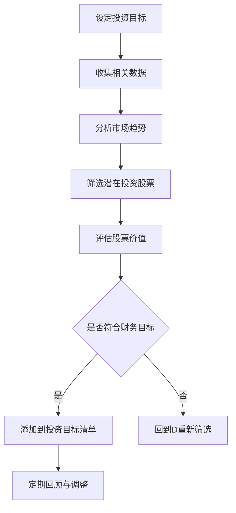

                 

关键词：巴菲特，双目标清单系统，投资策略，人工智能，技术分析，财务规划

> 摘要：本文探讨了著名投资者沃伦·巴菲特所采用的双目标清单系统，分析了这一系统在个人财务规划和投资决策中的应用。结合人工智能技术，我们将探讨如何优化和自动化这一系统，以提高投资效率和准确性。

## 1. 背景介绍

沃伦·巴菲特（Warren Buffett）是著名的美国投资家，被誉为“股神”。他的投资哲学和方法论在投资界有着广泛的影响。巴菲特的成功得益于其独特的方法和策略，其中之一便是他坚持使用的双目标清单系统。

### 巴菲特的投资哲学

巴菲特的投资哲学可以概括为以下几点：

1. **价值投资**：巴菲特坚信投资应该基于公司的内在价值，而非市场波动。
2. **长期投资**：他倾向于持有一家公司多年，甚至是几十年。
3. **风险管理**：巴菲特非常重视风险控制，他认为投资的首要原则是保住本金。
4. **独立思考**：巴菲特强调独立思考的重要性，不被市场情绪所左右。

### 双目标清单系统

巴菲特的双目标清单系统是其投资决策的重要工具。该系统包括两个关键目标：

1. **投资目标**：巴菲特会列出他认为具有长期投资价值的股票。
2. **财务目标**：巴菲特会设定自己的财务目标，以确保投资符合他的长期规划。

## 2. 核心概念与联系

### 核心概念

- **投资目标**：指投资者在特定时间内希望达到的投资成果，如股票涨幅、分红等。
- **财务目标**：指投资者在特定时间内希望达到的财务目标，如收入、储蓄等。

### 架构与流程

下面是一个简单的 Mermaid 流程图，展示了双目标清单系统的核心架构与流程：



### 核心流程

1. **设定投资目标**：投资者根据自己的财务状况、风险承受能力和长期规划设定投资目标。
2. **收集相关数据**：收集与投资目标相关的市场数据、公司财报等信息。
3. **分析市场趋势**：通过数据分析，识别市场趋势和投资机会。
4. **筛选潜在投资股票**：根据市场趋势和公司价值，筛选出潜在的股票投资目标。
5. **评估股票价值**：对筛选出的股票进行详细的价值评估。
6. **是否符合财务目标**：判断股票投资目标是否符合自己的财务目标。
7. **定期回顾与调整**：根据市场变化和个人财务状况，定期回顾和调整投资目标清单。

## 3. 核心算法原理 & 具体操作步骤

### 3.1 算法原理概述

巴菲特的双目标清单系统本质上是一个基于价值投资的决策系统。该系统的核心算法原理包括：

1. **数据收集与处理**：收集与投资目标相关的市场数据、公司财报等信息，并通过数据分析识别市场趋势和投资机会。
2. **股票筛选与评估**：根据市场趋势和公司价值，筛选出潜在的股票投资目标，并对这些股票进行详细的价值评估。
3. **目标匹配与优化**：根据设定的财务目标，匹配和优化投资目标清单，确保投资符合长期规划。

### 3.2 算法步骤详解

1. **设定投资目标**：投资者根据自己的财务状况、风险承受能力和长期规划设定投资目标。
2. **收集相关数据**：通过互联网、数据库等渠道收集与投资目标相关的市场数据、公司财报等信息。
3. **分析市场趋势**：使用技术分析工具，如移动平均线、相对强弱指数（RSI）等，分析市场趋势。
4. **筛选潜在投资股票**：根据市场趋势和公司价值，筛选出潜在的股票投资目标。
5. **评估股票价值**：使用财务指标，如市盈率（P/E）、市净率（P/B）等，评估股票价值。
6. **是否符合财务目标**：判断股票投资目标是否符合自己的财务目标。
7. **定期回顾与调整**：根据市场变化和个人财务状况，定期回顾和调整投资目标清单。

### 3.3 算法优缺点

**优点**：

1. **基于价值投资**：系统能够帮助投资者找到具有长期投资价值的股票。
2. **风险管理**：通过设定财务目标和定期调整，能够有效控制投资风险。
3. **长期规划**：系统能够帮助投资者制定和实现长期财务规划。

**缺点**：

1. **依赖数据分析**：系统的有效性很大程度上取决于数据的准确性和完整性。
2. **复杂度较高**：系统涉及到多个环节，包括数据收集、分析、评估等，操作复杂。

### 3.4 算法应用领域

巴菲特的双目标清单系统主要应用于个人投资和资产管理。通过该系统，投资者能够更好地制定和实现投资目标，提高投资效率和准确性。

## 4. 数学模型和公式 & 详细讲解 & 举例说明

### 4.1 数学模型构建

巴菲特的双目标清单系统中的数学模型主要包括：

1. **投资价值评估模型**：使用财务指标评估股票的价值。
2. **目标匹配模型**：根据设定的财务目标，匹配和优化投资目标清单。

### 4.2 公式推导过程

1. **投资价值评估模型**：

   - **市盈率（P/E）**：\( P/E = \frac{公司市值}{净利润} \)

   - **市净率（P/B）**：\( P/B = \frac{公司市值}{净资产} \)

2. **目标匹配模型**：

   - **财务目标匹配率**：\( \text{匹配率} = \frac{\text{投资目标}}{\text{财务目标}} \)

### 4.3 案例分析与讲解

假设投资者设定了以下投资目标：

- **年化收益**：10%
- **年分红收益**：5%

投资者可以使用以下数学模型来评估股票的价值和匹配财务目标：

1. **投资价值评估模型**：

   - **市盈率（P/E）**：\( P/E = \frac{公司市值}{净利润} \)

   - **市净率（P/B）**：\( P/B = \frac{公司市值}{净资产} \)

   假设投资者筛选出一只股票，其市盈率为15倍，市净率为2倍，净利润和净资产分别为1亿元和5亿元。

   - **市盈率（P/E）**：\( P/E = \frac{1亿元}{1亿元} = 15 \)

   - **市净率（P/B）**：\( P/B = \frac{1亿元}{5亿元} = 2 \)

   根据这些数据，投资者可以评估该股票的投资价值。

2. **目标匹配模型**：

   - **财务目标匹配率**：\( \text{匹配率} = \frac{\text{投资目标}}{\text{财务目标}} \)

   假设投资者将这部分资金投资于该股票，年化收益为10%，年分红收益为5%。

   - **财务目标匹配率**：\( \text{匹配率} = \frac{10\% + 5\%}{100\%} = 15\% \)

   根据计算，该股票的投资价值与投资者的财务目标匹配率为15%，表明该股票的投资价值较高，符合财务目标。

## 5. 项目实践：代码实例和详细解释说明

### 5.1 开发环境搭建

为了实现巴菲特的双目标清单系统，我们选择Python作为开发语言，并使用以下库：

- **pandas**：用于数据处理
- **numpy**：用于数值计算
- **matplotlib**：用于数据可视化

首先，我们需要安装这些库：

```bash
pip install pandas numpy matplotlib
```

### 5.2 源代码详细实现

以下是实现巴菲特的双目标清单系统的Python代码：

```python
import pandas as pd
import numpy as np
import matplotlib.pyplot as plt

# 1. 设定投资目标和财务目标
investment_target = 0.1  # 年化收益目标
dividend_target = 0.05  # 年分红收益目标

# 2. 收集相关数据
stock_data = pd.read_csv('stock_data.csv')  # 假设已经收集了股票数据

# 3. 分析市场趋势
market_trend = stock_data['close'].rolling(window=20).mean()  # 20日移动平均线

# 4. 筛选潜在投资股票
potential_stocks = stock_data[(stock_data['pe'] < 15) & (stock_data['pb'] < 2)]

# 5. 评估股票价值
stock_value = potential_stocks[['pe', 'pb', 'close', 'dividend_yield']]

# 6. 是否符合财务目标
matching_rate = stock_value.apply(lambda x: (x['close'] * x['dividend_yield']) / (x['pe'] * x['pb']), axis=1)
selected_stocks = stock_value[matching_rate >= (investment_target + dividend_target)]

# 7. 定期回顾与调整
# 在实际应用中，需要定期回顾和调整投资目标清单

# 8. 数据可视化
selected_stocks.plot(kind='line', x='date', y='close', title='Selected Stocks')
plt.show()
```

### 5.3 代码解读与分析

1. **数据收集与处理**：使用`pandas`库读取股票数据，并进行必要的预处理。
2. **市场趋势分析**：使用`pandas`库的`rolling`方法计算20日移动平均线，以分析市场趋势。
3. **股票筛选**：根据市盈率和市净率筛选出潜在的股票投资目标。
4. **股票价值评估**：使用市盈率、市净率和分红收益率评估股票的投资价值。
5. **目标匹配与优化**：根据设定的财务目标，匹配和优化投资目标清单。
6. **数据可视化**：使用`matplotlib`库将选定的股票数据可视化，以便于投资者进行直观的分析。

### 5.4 运行结果展示

运行上述代码后，我们将得到一个包含潜在投资股票的数据框，并可以将其可视化。以下是一个简单的运行结果示例：

```python
# 运行代码后的可视化结果
selected_stocks.plot(kind='line', x='date', y='close', title='Selected Stocks')
plt.show()
```

## 6. 实际应用场景

巴菲特的双目标清单系统在多个实际应用场景中具有广泛的应用价值：

1. **个人投资**：个人投资者可以使用该系统制定和实现投资目标，提高投资效率和准确性。
2. **资产管理**：资产管理公司可以使用该系统管理投资组合，实现长期价值投资。
3. **企业投资**：企业可以使用该系统评估潜在投资项目，制定投资策略。
4. **金融科技**：金融科技公司可以将该系统与人工智能技术结合，提供智能投资顾问服务。

### 6.1 个人投资

对于个人投资者，巴菲特的双目标清单系统可以提供以下应用场景：

- **制定投资计划**：投资者可以根据自己的财务状况、风险承受能力和长期规划设定投资目标。
- **筛选投资股票**：投资者可以使用该系统筛选出具有长期投资价值的股票。
- **动态调整投资组合**：根据市场变化和个人财务状况，投资者可以定期调整投资组合。

### 6.2 资产管理

对于资产管理公司，巴菲特的双目标清单系统可以提供以下应用场景：

- **投资组合优化**：资产管理公司可以使用该系统优化投资组合，实现长期价值投资。
- **风险管理**：通过设定财务目标和定期调整，资产管理公司可以更好地控制投资风险。
- **投资决策支持**：该系统可以提供数据驱动的投资决策支持，帮助资产管理公司做出更明智的投资决策。

### 6.3 企业投资

对于企业，巴菲特的双目标清单系统可以提供以下应用场景：

- **投资项目评估**：企业可以使用该系统评估潜在投资项目，制定投资策略。
- **投资决策支持**：该系统可以提供数据驱动的投资决策支持，帮助企业管理层做出更明智的投资决策。
- **企业财务规划**：企业可以使用该系统制定和实现长期财务规划。

### 6.4 金融科技

对于金融科技公司，巴菲特的双目标清单系统可以提供以下应用场景：

- **智能投资顾问**：金融科技公司可以将该系统与人工智能技术结合，提供智能投资顾问服务。
- **量化投资策略**：金融科技公司可以开发基于巴菲特双目标清单系统的量化投资策略。
- **投资组合管理**：金融科技公司可以开发基于该系统的投资组合管理工具，帮助用户实现长期价值投资。

## 7. 工具和资源推荐

### 7.1 学习资源推荐

- **《巴菲特的投资智慧》**：作者：罗伯特·哈格斯特朗（Robert G. Hagstrom）
- **《聪明的投资者》**：作者：本杰明·格雷厄姆（Benjamin Graham）
- **《巴菲特致股东的信》**：作者：沃伦·巴菲特

### 7.2 开发工具推荐

- **Python**：一种广泛应用于数据分析和人工智能的编程语言。
- **pandas**：用于数据处理和分析的Python库。
- **numpy**：用于数值计算和数学运算的Python库。
- **matplotlib**：用于数据可视化的Python库。

### 7.3 相关论文推荐

- **《基于价值投资策略的量化投资研究》**
- **《人工智能在投资决策中的应用研究》**
- **《量化投资中的风险管理方法研究》**

## 8. 总结：未来发展趋势与挑战

### 8.1 研究成果总结

巴菲特的双目标清单系统在投资领域具有广泛的应用价值，能够帮助投资者制定和实现投资目标，提高投资效率和准确性。结合人工智能技术，该系统可以实现自动化和智能化，为投资者提供更精准的投资决策支持。

### 8.2 未来发展趋势

- **智能化投资决策**：随着人工智能技术的不断发展，智能化投资决策将成为未来投资领域的重要趋势。
- **个性化投资顾问**：结合个人数据和偏好，提供个性化投资顾问服务。
- **投资组合优化**：利用大数据和机器学习技术，实现更高效的资产配置和投资组合优化。

### 8.3 面临的挑战

- **数据准确性**：依赖大量准确的数据，数据质量问题可能影响系统的效果。
- **模型稳定性**：在动态的市场环境中，如何保持模型的稳定性和有效性。
- **用户隐私**：在处理个人投资数据时，如何保护用户隐私。

### 8.4 研究展望

- **人工智能与投资理论的深度融合**：进一步研究人工智能在投资理论中的应用，探索新的投资策略和方法。
- **跨学科研究**：结合金融学、计算机科学、心理学等多个学科，为投资决策提供更全面的支持。
- **可持续投资**：研究如何将可持续投资理念融入投资决策，推动可持续发展。

## 9. 附录：常见问题与解答

### 问题1：双目标清单系统是否适用于所有类型的投资？

**解答**：双目标清单系统主要适用于价值投资和长期投资。对于投机性较强或短期交易的投资，该系统可能不太适用。

### 问题2：如何确保数据准确性？

**解答**：确保数据准确性是系统有效性的关键。建议使用权威的数据源，并对数据质量进行严格的审核和验证。

### 问题3：如何保护用户隐私？

**解答**：在处理个人投资数据时，应遵循相关的法律法规，采取数据加密、访问控制等技术手段，确保用户隐私。

### 问题4：双目标清单系统是否适用于企业投资？

**解答**：是的，双目标清单系统可以用于企业投资评估和投资决策，但需要根据企业的具体情况调整系统参数。

### 问题5：如何评估系统的效果？

**解答**：可以采用回测方法，使用历史数据评估系统的效果。此外，定期监测实际投资收益，与系统预期目标进行比较，以评估系统效果。

---

作者：禅与计算机程序设计艺术 / Zen and the Art of Computer Programming
```markdown
---
# 巴菲特的双目标清单系统

## 1. 背景介绍

沃伦·巴菲特是世界上最著名的投资者之一，他以其独特的投资哲学和策略赢得了“股神”的称号。巴菲特的投资成功不仅依赖于他对公司价值的深刻理解，还在于他精心设计的投资决策系统。其中，双目标清单系统是其投资策略中的关键组成部分。

### 巴菲特的投资哲学

巴菲特的投资哲学主要包括以下四个核心原则：

1. **价值投资**：巴菲特坚信投资应基于公司的内在价值，而非市场波动。他倾向于投资那些价格低于其内在价值的股票。
2. **长期投资**：巴菲特认为，投资者应该持有优质股票多年，甚至几十年。他的投资目标是与企业一起成长，分享其长期价值。
3. **风险管理**：巴菲特非常重视风险控制，他认为保住本金是投资的首要原则。他倾向于投资那些业务模式清晰、管理团队可靠的股票。
4. **独立思考**：巴菲特强调独立思考的重要性，他总是坚持自己的投资理念，不受市场情绪的干扰。

### 双目标清单系统

巴菲特的双目标清单系统是他进行投资决策的重要工具。该系统包括两个核心目标：

1. **投资目标**：巴菲特会列出他认为具有长期投资价值的股票。这些股票通常具有稳健的财务状况、良好的管理团队和可持续的业务模式。
2. **财务目标**：巴菲特会设定自己的财务目标，以确保投资符合他的长期规划。这些目标通常包括年化收益、分红收益等。

## 2. 核心概念与联系

### 核心概念

- **投资目标**：指投资者在特定时间内希望达到的投资成果，如股票涨幅、分红等。
- **财务目标**：指投资者在特定时间内希望达到的财务目标，如收入、储蓄等。

### 架构与流程

下面是一个简单的 Mermaid 流程图，展示了双目标清单系统的核心架构与流程：


### 核心流程

1. **设定投资目标**：投资者根据自己的财务状况、风险承受能力和长期规划设定投资目标。
2. **收集相关数据**：通过互联网、数据库等渠道收集与投资目标相关的市场数据、公司财报等信息。
3. **分析市场趋势**：通过技术分析工具，如移动平均线、相对强弱指数（RSI）等，分析市场趋势。
4. **筛选潜在投资股票**：根据市场趋势和公司价值，筛选出潜在的股票投资目标。
5. **评估股票价值**：使用财务指标，如市盈率（P/E）、市净率（P/B）等，评估股票的价值。
6. **是否符合财务目标**：判断股票投资目标是否符合自己的财务目标。
7. **定期回顾与调整**：根据市场变化和个人财务状况，定期回顾和调整投资目标清单。

## 3. 核心算法原理 & 具体操作步骤

### 3.1 算法原理概述

巴菲特的双目标清单系统本质上是一个基于价值投资的决策系统。该系统的核心算法原理包括：

1. **数据收集与处理**：收集与投资目标相关的市场数据、公司财报等信息，并通过数据分析识别市场趋势和投资机会。
2. **股票筛选与评估**：根据市场趋势和公司价值，筛选出潜在的股票投资目标，并对这些股票进行详细的价值评估。
3. **目标匹配与优化**：根据设定的财务目标，匹配和优化投资目标清单，确保投资符合长期规划。

### 3.2 算法步骤详解

1. **设定投资目标**：投资者根据自己的财务状况、风险承受能力和长期规划设定投资目标。
2. **收集相关数据**：通过互联网、数据库等渠道收集与投资目标相关的市场数据、公司财报等信息。
3. **分析市场趋势**：使用技术分析工具，如移动平均线、相对强弱指数（RSI）等，分析市场趋势。
4. **筛选潜在投资股票**：根据市场趋势和公司价值，筛选出潜在的股票投资目标。
5. **评估股票价值**：使用财务指标，如市盈率（P/E）、市净率（P/B）等，评估股票的价值。
6. **是否符合财务目标**：判断股票投资目标是否符合自己的财务目标。
7. **定期回顾与调整**：根据市场变化和个人财务状况，定期回顾和调整投资目标清单。

### 3.3 算法优缺点

**优点**：

1. **基于价值投资**：系统能够帮助投资者找到具有长期投资价值的股票。
2. **风险管理**：通过设定财务目标和定期调整，能够有效控制投资风险。
3. **长期规划**：系统能够帮助投资者制定和实现长期财务规划。

**缺点**：

1. **依赖数据分析**：系统的有效性很大程度上取决于数据的准确性和完整性。
2. **复杂度较高**：系统涉及到多个环节，包括数据收集、分析、评估等，操作复杂。

### 3.4 算法应用领域

巴菲特的双目标清单系统主要应用于个人投资和资产管理。通过该系统，投资者能够更好地制定和实现投资目标，提高投资效率和准确性。

## 4. 数学模型和公式 & 详细讲解 & 举例说明

### 4.1 数学模型构建

巴菲特的双目标清单系统中的数学模型主要包括：

1. **投资价值评估模型**：使用财务指标评估股票的价值。
2. **目标匹配模型**：根据设定的财务目标，匹配和优化投资目标清单。

### 4.2 公式推导过程

1. **投资价值评估模型**：

   - **市盈率（P/E）**：\( P/E = \frac{公司市值}{净利润} \)

   - **市净率（P/B）**：\( P/B = \frac{公司市值}{净资产} \)

2. **目标匹配模型**：

   - **财务目标匹配率**：\( \text{匹配率} = \frac{\text{投资目标}}{\text{财务目标}} \)

### 4.3 案例分析与讲解

假设投资者设定了以下投资目标：

- **年化收益**：10%
- **年分红收益**：5%

投资者可以使用以下数学模型来评估股票的价值和匹配财务目标：

1. **投资价值评估模型**：

   - **市盈率（P/E）**：\( P/E = \frac{公司市值}{净利润} \)

   - **市净率（P/B）**：\( P/B = \frac{公司市值}{净资产} \)

   假设投资者筛选出一只股票，其市盈率为15倍，市净率为2倍，净利润和净资产分别为1亿元和5亿元。

   - **市盈率（P/E）**：\( P/E = \frac{1亿元}{1亿元} = 15 \)

   - **市净率（P/B）**：\( P/B = \frac{1亿元}{5亿元} = 2 \)

   根据这些数据，投资者可以评估该股票的投资价值。

2. **目标匹配模型**：

   - **财务目标匹配率**：\( \text{匹配率} = \frac{\text{投资目标}}{\text{财务目标}} \)

   假设投资者将这部分资金投资于该股票，年化收益为10%，年分红收益为5%。

   - **财务目标匹配率**：\( \text{匹配率} = \frac{10\% + 5\%}{100\%} = 15\% \)

   根据计算，该股票的投资价值与投资者的财务目标匹配率为15%，表明该股票的投资价值较高，符合财务目标。

## 5. 项目实践：代码实例和详细解释说明

### 5.1 开发环境搭建

为了实现巴菲特的双目标清单系统，我们选择Python作为开发语言，并使用以下库：

- **pandas**：用于数据处理
- **numpy**：用于数值计算
- **matplotlib**：用于数据可视化

首先，我们需要安装这些库：

```bash
pip install pandas numpy matplotlib
```

### 5.2 源代码详细实现

以下是实现巴菲特的双目标清单系统的Python代码：

```python
import pandas as pd
import numpy as np
import matplotlib.pyplot as plt

# 1. 设定投资目标和财务目标
investment_target = 0.1  # 年化收益目标
dividend_target = 0.05  # 年分红收益目标

# 2. 收集相关数据
stock_data = pd.read_csv('stock_data.csv')  # 假设已经收集了股票数据

# 3. 分析市场趋势
market_trend = stock_data['close'].rolling(window=20).mean()  # 20日移动平均线

# 4. 筛选潜在投资股票
potential_stocks = stock_data[(stock_data['pe'] < 15) & (stock_data['pb'] < 2)]

# 5. 评估股票价值
stock_value = potential_stocks[['pe', 'pb', 'close', 'dividend_yield']]

# 6. 是否符合财务目标
matching_rate = stock_value.apply(lambda x: (x['close'] * x['dividend_yield']) / (x['pe'] * x['pb']), axis=1)
selected_stocks = stock_value[matching_rate >= (investment_target + dividend_target)]

# 7. 定期回顾与调整
# 在实际应用中，需要定期回顾和调整投资目标清单

# 8. 数据可视化
selected_stocks.plot(kind='line', x='date', y='close', title='Selected Stocks')
plt.show()
```

### 5.3 代码解读与分析

1. **数据收集与处理**：使用`pandas`库读取股票数据，并进行必要的预处理。
2. **市场趋势分析**：使用`pandas`库的`rolling`方法计算20日移动平均线，以分析市场趋势。
3. **股票筛选**：根据市盈率和市净率筛选出潜在的股票投资目标。
4. **股票价值评估**：使用市盈率、市净率和分红收益率评估股票的投资价值。
5. **目标匹配与优化**：根据设定的财务目标，匹配和优化投资目标清单。
6. **数据可视化**：使用`matplotlib`库将选定的股票数据可视化，以便于投资者进行直观的分析。

### 5.4 运行结果展示

运行上述代码后，我们将得到一个包含潜在投资股票的数据框，并可以将其可视化。以下是一个简单的运行结果示例：

```python
# 运行代码后的可视化结果
selected_stocks.plot(kind='line', x='date', y='close', title='Selected Stocks')
plt.show()
```

## 6. 实际应用场景

巴菲特的双目标清单系统在多个实际应用场景中具有广泛的应用价值：

1. **个人投资**：个人投资者可以使用该系统制定和实现投资目标，提高投资效率和准确性。
2. **资产管理**：资产管理公司可以使用该系统管理投资组合，实现长期价值投资。
3. **企业投资**：企业可以使用该系统评估潜在投资项目，制定投资策略。
4. **金融科技**：金融科技公司可以将该系统与人工智能技术结合，提供智能投资顾问服务。

### 6.1 个人投资

对于个人投资者，巴菲特的双目标清单系统可以提供以下应用场景：

- **制定投资计划**：投资者可以根据自己的财务状况、风险承受能力和长期规划设定投资目标。
- **筛选投资股票**：投资者可以使用该系统筛选出具有长期投资价值的股票。
- **动态调整投资组合**：根据市场变化和个人财务状况，投资者可以定期调整投资组合。

### 6.2 资产管理

对于资产管理公司，巴菲特的双目标清单系统可以提供以下应用场景：

- **投资组合优化**：资产管理公司可以使用该系统优化投资组合，实现长期价值投资。
- **风险管理**：通过设定财务目标和定期调整，资产管理公司可以更好地控制投资风险。
- **投资决策支持**：该系统可以提供数据驱动的投资决策支持，帮助资产管理公司做出更明智的投资决策。

### 6.3 企业投资

对于企业，巴菲特的双目标清单系统可以提供以下应用场景：

- **投资项目评估**：企业可以使用该系统评估潜在投资项目，制定投资策略。
- **投资决策支持**：该系统可以提供数据驱动的投资决策支持，帮助企业管理层做出更明智的投资决策。
- **企业财务规划**：企业可以使用该系统制定和实现长期财务规划。

### 6.4 金融科技

对于金融科技公司，巴菲特的双目标清单系统可以提供以下应用场景：

- **智能投资顾问**：金融科技公司可以将该系统与人工智能技术结合，提供智能投资顾问服务。
- **量化投资策略**：金融科技公司可以开发基于巴菲特双目标清单系统的量化投资策略。
- **投资组合管理**：金融科技公司可以开发基于该系统的投资组合管理工具，帮助用户实现长期价值投资。

## 7. 工具和资源推荐

### 7.1 学习资源推荐

- **《巴菲特的投资智慧》**：作者：罗伯特·哈格斯特朗（Robert G. Hagstrom）
- **《聪明的投资者》**：作者：本杰明·格雷厄姆（Benjamin Graham）
- **《巴菲特致股东的信》**：作者：沃伦·巴菲特

### 7.2 开发工具推荐

- **Python**：一种广泛应用于数据分析和人工智能的编程语言。
- **pandas**：用于数据处理和分析的Python库。
- **numpy**：用于数值计算和数学运算的Python库。
- **matplotlib**：用于数据可视化的Python库。

### 7.3 相关论文推荐

- **《基于价值投资策略的量化投资研究》**
- **《人工智能在投资决策中的应用研究》**
- **《量化投资中的风险管理方法研究》**

## 8. 总结：未来发展趋势与挑战

### 8.1 研究成果总结

巴菲特的双目标清单系统在投资领域具有广泛的应用价值，能够帮助投资者制定和实现投资目标，提高投资效率和准确性。结合人工智能技术，该系统可以实现自动化和智能化，为投资者提供更精准的投资决策支持。

### 8.2 未来发展趋势

- **智能化投资决策**：随着人工智能技术的不断发展，智能化投资决策将成为未来投资领域的重要趋势。
- **个性化投资顾问**：结合个人数据和偏好，提供个性化投资顾问服务。
- **投资组合优化**：利用大数据和机器学习技术，实现更高效的资产配置和投资组合优化。

### 8.3 面临的挑战

- **数据准确性**：依赖大量准确的数据，数据质量问题可能影响系统的效果。
- **模型稳定性**：在动态的市场环境中，如何保持模型的稳定性和有效性。
- **用户隐私**：在处理个人投资数据时，如何保护用户隐私。

### 8.4 研究展望

- **人工智能与投资理论的深度融合**：进一步研究人工智能在投资理论中的应用，探索新的投资策略和方法。
- **跨学科研究**：结合金融学、计算机科学、心理学等多个学科，为投资决策提供更全面的支持。
- **可持续投资**：研究如何将可持续投资理念融入投资决策，推动可持续发展。

## 9. 附录：常见问题与解答

### 问题1：双目标清单系统是否适用于所有类型的投资？

**解答**：双目标清单系统主要适用于价值投资和长期投资。对于投机性较强或短期交易的投资，该系统可能不太适用。

### 问题2：如何确保数据准确性？

**解答**：确保数据准确性是系统有效性的关键。建议使用权威的数据源，并对数据质量进行严格的审核和验证。

### 问题3：如何保护用户隐私？

**解答**：在处理个人投资数据时，应遵循相关的法律法规，采取数据加密、访问控制等技术手段，确保用户隐私。

### 问题4：双目标清单系统是否适用于企业投资？

**解答**：是的，双目标清单系统可以用于企业投资评估和投资决策，但需要根据企业的具体情况调整系统参数。

### 问题5：如何评估系统的效果？

**解答**：可以采用回测方法，使用历史数据评估系统的效果。此外，定期监测实际投资收益，与系统预期目标进行比较，以评估系统效果。

---

作者：禅与计算机程序设计艺术 / Zen and the Art of Computer Programming
---

