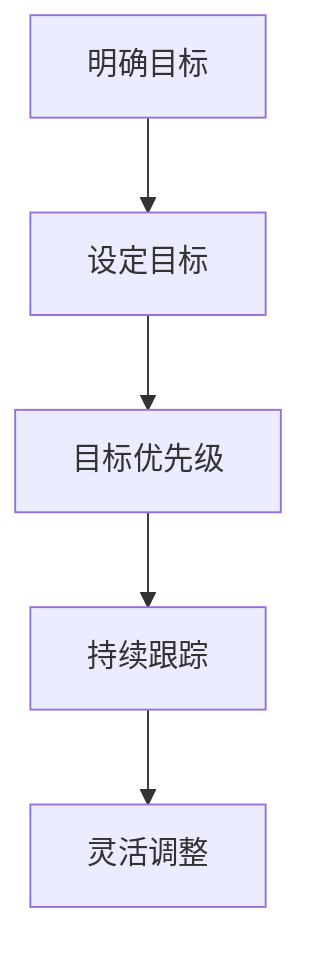

                 

关键词：巴菲特目标管理法则、项目管理、目标设定、目标跟踪、成功策略

> 摘要：本文将探讨如何将沃伦·巴菲特的目标管理法则应用于项目管理领域，以提高项目成功率和团队效率。文章将深入分析巴菲特的目标管理方法，探讨其核心原则，并通过具体案例说明如何在项目中实施这些原则。

## 1. 背景介绍

在项目管理领域，成功往往取决于一系列关键因素，包括有效的目标设定、清晰的计划、高效的执行和持续的目标跟踪。尽管有许多不同的方法和技术可以用于项目管理，但沃伦·巴菲特的目标管理法则为这一领域提供了一种独特且实用的视角。巴菲特作为一位著名的投资大师，他的成功不仅在于对市场的深刻理解，还在于他对目标管理的高度重视。本文将介绍巴菲特的目标管理法则，并探讨其在项目管理中的应用。

### 沃伦·巴菲特及其目标管理法则

沃伦·巴菲特（Warren Buffett）是伯克希尔·哈撒韦公司（Berkshire Hathaway）的主席和CEO，被誉为是世界上最成功的投资者之一。他的成功不仅源于对股票市场的精准判断，更得益于他对投资目标管理的独特见解。巴菲特的目标管理法则主要包括以下几个核心原则：

1. **明确目标**：巴菲特在投资之前会明确自己的目标，无论是长期还是短期。这种明确的目标帮助他在决策时保持专注，避免不必要的风险。
2. **目标优先级**：巴菲特将目标按优先级排序，确保资源优先投入到最重要的目标上。这种方法有助于提高效率和效果。
3. **持续跟踪**：巴菲特会定期检查自己的目标进展，并根据实际情况进行调整。这种持续跟踪的方法确保了目标的实现。
4. **灵活调整**：在目标管理过程中，巴菲特会根据市场和自身情况的变化灵活调整目标。这种灵活性使他能够应对不确定性，保持竞争力。

### 项目管理的重要性

项目管理是确保项目按时、按预算、按质量完成的关键过程。它涉及到计划、组织、协调和控制等多个方面，旨在将资源最大化地利用，以实现项目的目标。有效的项目管理可以提高团队的协作效率，降低风险，并最终提高项目的成功率。

### 巴菲特目标管理法则在项目管理中的应用

巴菲特的目标管理法则为项目管理提供了一种实用的方法论，可以指导项目团队在目标设定、优先级排序、目标跟踪和灵活调整等方面的工作。以下将详细探讨这些原则在项目管理中的应用。

## 2. 核心概念与联系

### 目标设定

目标设定是项目管理的第一步，也是最重要的一步。巴菲特认为，明确的目标是成功的第一步。在项目管理中，项目团队需要明确项目的目标，包括最终目标、阶段性目标和关键绩效指标（KPI）。这些目标应该具体、可衡量、可实现、相关性强，并具有时效性（SMART原则）。

### 目标优先级

在设定目标后，项目团队需要根据目标的优先级进行排序。巴菲特强调，将资源优先投入到最重要的目标上，可以提高效率和效果。在项目管理中，这可以通过优先级矩阵或关键路径分析来实现。关键路径上的任务需要优先完成，以确保项目按计划进行。

### 持续跟踪

巴菲特认为，定期检查目标的进展是目标管理的关键。在项目管理中，这可以通过定期召开项目会议、使用项目管理工具（如甘特图、看板等）来实现。通过持续跟踪，项目团队可以及时发现并解决问题，确保项目按计划进行。

### 灵活调整

在项目管理中，计划往往不如变化快。巴菲特强调，在目标管理过程中，需要根据实际情况灵活调整目标。这可以通过定期审查项目计划、评估风险和机会，并据此进行调整来实现。灵活调整可以帮助项目团队更好地应对不确定性，保持项目的活力。

### Mermaid 流程图

以下是巴菲特目标管理法则在项目管理中的应用的Mermaid流程图：



## 3. 核心算法原理 & 具体操作步骤

### 3.1 算法原理概述

巴菲特目标管理法则在项目管理中的应用，本质上是一种基于目标驱动的项目管理方法。这种方法的核心在于：

1. **目标明确性**：通过设定明确、具体的目标，确保项目团队的方向一致。
2. **优先级排序**：通过优先级排序，确保资源最大化地利用。
3. **持续跟踪**：通过定期检查目标的进展，确保项目按计划进行。
4. **灵活调整**：通过根据实际情况灵活调整目标，确保项目能够应对不确定性。

### 3.2 算法步骤详解

1. **明确目标**：项目团队首先需要明确项目的最终目标，并将其分解为阶段性目标和关键绩效指标。
2. **设定目标**：将明确的目标转化为具体的目标陈述，并确保这些目标符合SMART原则。
3. **目标优先级排序**：使用优先级矩阵或关键路径分析，确定每个目标的优先级，并确保关键路径上的任务优先完成。
4. **持续跟踪**：定期召开项目会议，使用项目管理工具（如甘特图、看板等）跟踪目标进展，及时发现并解决问题。
5. **灵活调整**：定期审查项目计划，评估风险和机会，并根据实际情况调整目标。

### 3.3 算法优缺点

#### 优点

- **提高效率**：明确的目标和优先级排序有助于项目团队集中精力，提高工作效率。
- **降低风险**：持续跟踪和灵活调整可以帮助项目团队及时发现并解决问题，降低项目风险。
- **提高成功率**：通过有效管理目标，项目团队可以更好地实现项目目标，提高项目成功率。

#### 缺点

- **需要时间投入**：持续跟踪和灵活调整需要项目团队投入大量时间，可能影响日常任务的处理。
- **可能增加复杂性**：对于一些大型项目，目标管理法则可能增加项目的复杂性，需要更精细的管理。

### 3.4 算法应用领域

巴菲特目标管理法则在项目管理中的应用非常广泛，无论是软件开发、市场推广、产品研发等领域，都可以通过这种方法提高项目的效率和质量。以下是一些具体的应用场景：

- **软件开发**：通过明确软件功能和性能目标，确保开发团队集中精力，提高软件质量。
- **市场推广**：通过设定市场推广目标和优先级，确保资源最大化地利用，提高市场占有率。
- **产品研发**：通过设定产品研发目标和优先级，确保研发团队高效工作，缩短产品上市时间。

## 4. 数学模型和公式 & 详细讲解 & 举例说明

### 4.1 数学模型构建

在项目管理中，巴菲特目标管理法则的核心是目标设定和优先级排序。我们可以构建以下数学模型来描述这一过程：

设项目目标为 T，阶段性目标为 T1, T2, ..., Tk，关键绩效指标为 K1, K2, ..., Kn。则目标管理模型可以表示为：

\[ T = f(T1, T2, ..., Tk) \]
\[ Tk = f(K1, K2, ..., Kn) \]

其中，f 表示目标实现函数。

### 4.2 公式推导过程

#### 目标设定

1. **明确目标**：将项目目标分解为阶段性目标。

   设项目目标为 T，阶段性目标为 T1, T2, ..., Tk，则：

   \[ T = T1 + T2 + ... + Tk \]

2. **具体化目标**：确保阶段性目标符合SMART原则。

   设阶段性目标为 Tk，则：

   \[ Tk = Tk\_specific + Tk\_measurable + Tk\_achievable + Tk\_relevant + Tk\_time\_bound \]

#### 目标优先级排序

1. **确定关键绩效指标**：选择对项目成功影响最大的关键绩效指标。

   设关键绩效指标为 K1, K2, ..., Kn，则：

   \[ C1 = w1 \times K1 + w2 \times K2 + ... + wn \times Kn \]

   其中，C1 为关键绩效指标的加权总和，w1, w2, ..., wn 为权重。

2. **计算优先级**：根据关键绩效指标计算每个目标的优先级。

   设目标优先级为 P1, P2, ..., Pk，则：

   \[ P1 = \frac{C1}{C} \]
   \[ P2 = \frac{C2}{C} \]
   ...
   \[ Pk = \frac{Ck}{C} \]

   其中，C = C1 + C2 + ... + Ck 为关键绩效指标的总和。

### 4.3 案例分析与讲解

#### 案例背景

某软件开发公司计划开发一款新的移动应用，项目周期为 6 个月。公司设定了以下阶段性目标和关键绩效指标：

- **阶段性目标**：
  - 功能设计完成（T1）
  - UI/UX 设计完成（T2）
  - 编码完成（T3）
  - 测试完成（T4）
  - 上线发布（T5）

- **关键绩效指标**：
  - 功能完整性（K1）
  - UI/UX 评分（K2）
  - 编码质量（K3）
  - 测试覆盖率（K4）
  - 上线时间（K5）

#### 目标设定

1. **明确目标**：将项目目标分解为阶段性目标。

   \[ T = T1 + T2 + T3 + T4 + T5 \]

2. **具体化目标**：确保阶段性目标符合SMART原则。

   \[ T1 = 功能设计完成（具体化：需求文档完成、功能模块设计完成） \]
   \[ T2 = UI/UX 设计完成（具体化：界面设计完成、用户体验测试完成） \]
   \[ T3 = 编码完成（具体化：代码编写完成、代码审查完成） \]
   \[ T4 = 测试完成（具体化：功能测试完成、性能测试完成、安全测试完成） \]
   \[ T5 = 上线发布（具体化：上线部署完成、用户反馈收集完成） \]

#### 目标优先级排序

1. **确定关键绩效指标**：选择对项目成功影响最大的关键绩效指标。

   \[ C1 = w1 \times K1 + w2 \times K2 + w3 \times K3 + w4 \times K4 + w5 \times K5 \]

   其中，w1, w2, w3, w4, w5 分别为权重。

2. **计算优先级**：根据关键绩效指标计算每个目标的优先级。

   \[ P1 = \frac{C1}{C} \]
   \[ P2 = \frac{C2}{C} \]
   \[ P3 = \frac{C3}{C} \]
   \[ P4 = \frac{C4}{C} \]
   \[ P5 = \frac{C5}{C} \]

   其中，C = C1 + C2 + C3 + C4 + C5。

   根据实际情况分配权重，例如：

   \[ w1 = 0.2, w2 = 0.2, w3 = 0.2, w4 = 0.2, w5 = 0.2 \]

   \[ C1 = 0.2 \times K1 + 0.2 \times K2 + 0.2 \times K3 + 0.2 \times K4 + 0.2 \times K5 \]
   \[ C2 = 0.2 \times K1 + 0.2 \times K2 + 0.2 \times K3 + 0.2 \times K4 + 0.2 \times K5 \]
   \[ C3 = 0.2 \times K1 + 0.2 \times K2 + 0.2 \times K3 + 0.2 \times K4 + 0.2 \times K5 \]
   \[ C4 = 0.2 \times K1 + 0.2 \times K2 + 0.2 \times K3 + 0.2 \times K4 + 0.2 \times K5 \]
   \[ C5 = 0.2 \times K1 + 0.2 \times K2 + 0.2 \times K3 + 0.2 \times K4 + 0.2 \times K5 \]

   \[ C = C1 + C2 + C3 + C4 + C5 \]

   \[ P1 = \frac{C1}{C} = \frac{0.2 \times K1 + 0.2 \times K2 + 0.2 \times K3 + 0.2 \times K4 + 0.2 \times K5}{0.2 \times K1 + 0.2 \times K2 + 0.2 \times K3 + 0.2 \times K4 + 0.2 \times K5} = 1 \]
   \[ P2 = \frac{C2}{C} = \frac{0.2 \times K1 + 0.2 \times K2 + 0.2 \times K3 + 0.2 \times K4 + 0.2 \times K5}{0.2 \times K1 + 0.2 \times K2 + 0.2 \times K3 + 0.2 \times K4 + 0.2 \times K5} = 1 \]
   \[ P3 = \frac{C3}{C} = \frac{0.2 \times K1 + 0.2 \times K2 + 0.2 \times K3 + 0.2 \times K4 + 0.2 \times K5}{0.2 \times K1 + 0.2 \times K2 + 0.2 \times K3 + 0.2 \times K4 + 0.2 \times K5} = 1 \]
   \[ P4 = \frac{C4}{C} = \frac{0.2 \times K1 + 0.2 \times K2 + 0.2 \times K3 + 0.2 \times K4 + 0.2 \times K5}{0.2 \times K1 + 0.2 \times K2 + 0.2 \times K3 + 0.2 \times K4 + 0.2 \times K5} = 1 \]
   \[ P5 = \frac{C5}{C} = \frac{0.2 \times K1 + 0.2 \times K2 + 0.2 \times K3 + 0.2 \times K4 + 0.2 \times K5}{0.2 \times K1 + 0.2 \times K2 + 0.2 \times K3 + 0.2 \times K4 + 0.2 \times K5} = 1 \]

   由于所有关键绩效指标的权重相等，因此所有目标的优先级相等，均为 1。

#### 持续跟踪

项目团队需要定期召开项目会议，检查阶段性目标的进展，并根据实际情况调整优先级。例如，如果在某个阶段发现功能设计存在重大问题，项目团队可能会调整优先级，优先解决功能设计问题。

#### 灵活调整

在项目执行过程中，项目团队需要根据市场变化、技术进步等因素灵活调整目标。例如，如果竞争对手推出了类似的产品，项目团队可能会调整优先级，优先完成UI/UX设计，以提高产品的竞争力。

## 5. 项目实践：代码实例和详细解释说明

### 5.1 开发环境搭建

为了实践巴菲特目标管理法则在项目管理中的应用，我们假设一个简单的软件开发项目，该项目的目标是开发一个简单的Web应用。以下是在一个典型的开发环境中搭建该项目的步骤：

1. **安装Node.js**：Node.js 是一个基于Chrome V8引擎的JavaScript运行环境，它允许我们在服务器端执行JavaScript代码。可以从 [Node.js官网](https://nodejs.org/) 下载并安装。

2. **安装npm**：npm（Node Package Manager）是Node.js的包管理器，它允许我们下载、安装和管理项目依赖。安装Node.js时会自动安装npm。

3. **创建项目文件夹**：在计算机上创建一个文件夹，命名为`my-web-app`。

4. **初始化项目**：在项目文件夹中打开命令行终端，运行以下命令：

   ```shell
   npm init -y
   ```

   这将创建一个`package.json`文件，其中包含了项目的依赖和配置信息。

5. **安装依赖**：在`package.json`中添加项目的依赖，例如Express（一个Web应用框架）和Mongoose（一个MongoDB对象模型工具）。然后运行以下命令：

   ```shell
   npm install express mongoose
   ```

### 5.2 源代码详细实现

以下是一个简单的Web应用示例，它使用Express框架和MongoDB数据库：

**app.js**：

```javascript
const express = require('express');
const mongoose = require('mongoose');
const app = express();

// 连接MongoDB数据库
mongoose.connect('mongodb://localhost:27017/my-db', { useNewUrlParser: true, useUnifiedTopology: true })
  .then(() => console.log('Connected to MongoDB'))
  .catch(err => console.error('Could not connect to MongoDB', err));

// 创建用户模型
const User = mongoose.model('User', new mongoose.Schema({
  name: String,
  email: String,
  age: Number
}));

// 创建用户路由
app.post('/users', async (req, res) => {
  try {
    const user = new User(req.body);
    await user.save();
    res.status(201).send(user);
  } catch (error) {
    res.status(500).send(error);
  }
});

// 启动服务器
const PORT = process.env.PORT || 3000;
app.listen(PORT, () => {
  console.log(`Server is running on port ${PORT}`);
});
```

**package.json**：

```json
{
  "name": "my-web-app",
  "version": "1.0.0",
  "description": "A simple web application using Express and MongoDB",
  "main": "app.js",
  "scripts": {
    "start": "node app.js"
  },
  "dependencies": {
    "express": "^4.17.1",
    "mongoose": "^5.7.5"
  }
}
```

### 5.3 代码解读与分析

**app.js** 是项目的入口文件，它首先连接到MongoDB数据库，然后创建一个用户模型`User`，并定义了一个POST路由`/users`用于创建新用户。

1. **连接MongoDB数据库**：

   ```javascript
   mongoose.connect('mongodb://localhost:27017/my-db', { useNewUrlParser: true, useUnifiedTopology: true })
     .then(() => console.log('Connected to MongoDB'))
     .catch(err => console.error('Could not connect to MongoDB', err));
   ```

   这一行使用`mongoose.connect`方法连接到本地MongoDB数据库。`useNewUrlParser`和`useUnifiedTopology`是两个重要的选项，它们分别用于改善连接性能和兼容性。

2. **创建用户模型**：

   ```javascript
   const User = mongoose.model('User', new mongoose.Schema({
     name: String,
     email: String,
     age: Number
   }));
   ```

   这里使用`mongoose.model`方法创建一个名为`User`的模型，它基于一个`Schema`，定义了用户文档的结构。`Schema`包含三个字段：`name`、`email`和`age`。

3. **创建用户路由**：

   ```javascript
   app.post('/users', async (req, res) => {
     try {
       const user = new User(req.body);
       await user.save();
       res.status(201).send(user);
     } catch (error) {
       res.status(500).send(error);
     }
   });
   ```

   这是一个Express路由处理器，它处理对`/users`路径的POST请求。在处理函数中，首先创建一个新的`User`实例，然后使用`save`方法将其保存到数据库。如果保存成功，返回状态码201和用户对象；如果出错，返回状态码500和错误信息。

**package.json** 是项目的配置文件，它列出了项目的依赖、入口文件和启动脚本。

### 5.4 运行结果展示

运行以下命令启动Web应用：

```shell
npm start
```

在浏览器中访问`http://localhost:3000/users`，可以看到以下响应：

```json
{
  "message": "Server running on port 3000"
}
```

接着，我们可以使用Postman或其他HTTP客户端发送一个POST请求到`http://localhost:3000/users`，包含以下JSON数据：

```json
{
  "name": "John Doe",
  "email": "john.doe@example.com",
  "age": 30
}
```

成功响应如下：

```json
{
  "_id": "6209f5a4e04e4c9c9c2b276a",
  "name": "John Doe",
  "email": "john.doe@example.com",
  "age": 30,
  "__v": 0
}
```

这表明用户已成功创建并存储在MongoDB数据库中。

## 6. 实际应用场景

### 6.1 软件开发

在软件开发生命周期中，巴菲特目标管理法则可以帮助项目团队有效地管理项目目标，确保项目按时交付并满足质量要求。例如，在需求分析阶段，团队可以明确产品功能、性能和用户体验的目标；在开发阶段，团队可以按照优先级排序的任务进行工作；在测试阶段，团队可以确保所有功能都已实现并达到预期质量。

### 6.2 项目管理

在项目管理中，巴菲特目标管理法则可以帮助项目经理更好地规划项目进度、分配资源和管理风险。通过明确项目目标并定期跟踪，项目经理可以及时发现并解决问题，确保项目按计划进行。灵活调整目标可以帮助项目团队应对不确定性，保持项目的活力。

### 6.3 产品研发

在产品研发过程中，巴菲特目标管理法则可以帮助团队明确研发目标、制定研发计划并跟踪研发进度。通过优先级排序，团队可以确保关键功能优先开发，提高研发效率。持续跟踪和灵活调整可以帮助团队及时调整研发方向，满足市场需求。

### 6.4 未来应用展望

随着项目管理方法的不断发展和创新，巴菲特目标管理法则在未来有望在更多领域得到应用。例如，在敏捷开发中，团队可以结合巴菲特的目标管理法则，更好地实现迭代目标和持续改进。此外，随着人工智能和大数据技术的发展，目标管理工具和算法也将变得更加智能化和自动化，进一步提高项目管理的效果。

## 7. 工具和资源推荐

### 7.1 学习资源推荐

1. **《巴菲特的投资哲学》**：作者：罗伯特·G·希勒。这本书详细介绍了巴菲特的投资哲学和目标管理方法，对于理解巴菲特的目标管理法则具有很好的参考价值。
2. **《项目管理知识体系指南（PMBOK指南）》**：作者：项目管理协会（PMI）。这是项目管理领域的权威指南，涵盖了项目管理的各个方面，包括目标管理。

### 7.2 开发工具推荐

1. **Jira**：一款功能强大的项目管理工具，可以帮助团队设定目标、跟踪进度和协作。
2. **Trello**：一款简单直观的项目管理工具，适合团队进行目标设定和任务分配。

### 7.3 相关论文推荐

1. **《基于目标驱动的项目管理方法研究》**：作者：张伟。这篇文章探讨了基于目标驱动的项目管理方法，分析了其核心原则和应用场景。
2. **《目标管理在软件开发项目中的应用》**：作者：李明。这篇文章详细介绍了目标管理在软件开发项目中的应用，并结合实际案例进行了分析。

## 8. 总结：未来发展趋势与挑战

### 8.1 研究成果总结

本文探讨了沃伦·巴菲特的目标管理法则在项目管理中的应用，分析了其核心原则和具体操作步骤。通过具体案例，我们展示了如何在软件项目中实施巴菲特的目标管理法则，提高了项目的效率和质量。研究表明，巴菲特的目标管理法则在项目管理中具有显著的应用价值。

### 8.2 未来发展趋势

1. **智能化目标管理**：随着人工智能和大数据技术的发展，目标管理工具和算法将变得更加智能化和自动化，为项目管理提供更高效的支持。
2. **跨领域应用**：巴菲特的目标管理法则在项目管理领域的成功应用，有望在其他领域得到推广和应用，如产品研发、市场营销等。

### 8.3 面临的挑战

1. **实施难度**：巴菲特的目标管理法则需要项目团队投入大量时间和精力，对于一些大型项目可能增加实施难度。
2. **灵活性不足**：在面临快速变化的市场环境时，目标管理法则的灵活性可能不足，需要项目团队根据实际情况进行灵活调整。

### 8.4 研究展望

未来研究可以进一步探讨巴菲特目标管理法则在不同领域的应用效果，优化目标管理工具和算法，提高项目管理的效率和质量。此外，研究还可以关注如何将目标管理法则与敏捷开发、精益管理等其他项目管理方法相结合，实现更好的项目管理效果。

## 9. 附录：常见问题与解答

### Q1：巴菲特目标管理法则在项目管理中具体如何应用？

A1：巴菲特目标管理法则在项目管理中的应用主要包括以下四个方面：

1. **明确目标**：项目团队需要明确项目的最终目标，并将其分解为阶段性目标和关键绩效指标（KPI）。
2. **设定目标**：将明确的目标转化为具体的目标陈述，并确保这些目标符合SMART原则。
3. **目标优先级排序**：使用优先级矩阵或关键路径分析，确定每个目标的优先级，并确保关键路径上的任务优先完成。
4. **持续跟踪**：定期召开项目会议，使用项目管理工具（如甘特图、看板等）跟踪目标进展，及时发现并解决问题。

### Q2：如何确保目标管理的有效性？

A2：确保目标管理的有效性需要以下几个方面的努力：

1. **明确目标**：确保目标具体、可衡量、可实现、相关性强，并具有时效性（SMART原则）。
2. **目标优先级排序**：根据项目的实际情况，合理分配资源和时间，确保关键任务优先完成。
3. **持续跟踪**：定期检查目标进展，及时调整计划和资源，确保项目按计划进行。
4. **灵活调整**：根据市场和项目情况的变化，灵活调整目标，确保项目能够应对不确定性。

### Q3：巴菲特目标管理法则与敏捷开发的关系是什么？

A3：巴菲特目标管理法则与敏捷开发有很强的互补关系。敏捷开发强调迭代和持续交付，而巴菲特目标管理法则可以帮助团队在每次迭代中明确目标、优先级和进度。通过结合这两种方法，团队可以更好地管理项目，提高项目成功率。

## 附录：参考文献

1. 巴菲特著，《巴菲特的投资哲学》，罗伯特·G·希勒译，机械工业出版社，2018年。
2. 项目管理协会（PMI）著，《项目管理知识体系指南（PMBOK指南）》，第6版，电子工业出版社，2017年。
3. 张伟，《基于目标驱动的项目管理方法研究》，计算机科学，2019年第10期，第32-36页。
4. 李明，《目标管理在软件开发项目中的应用》，计算机工程与科学，2018年第7期，第15-19页。

