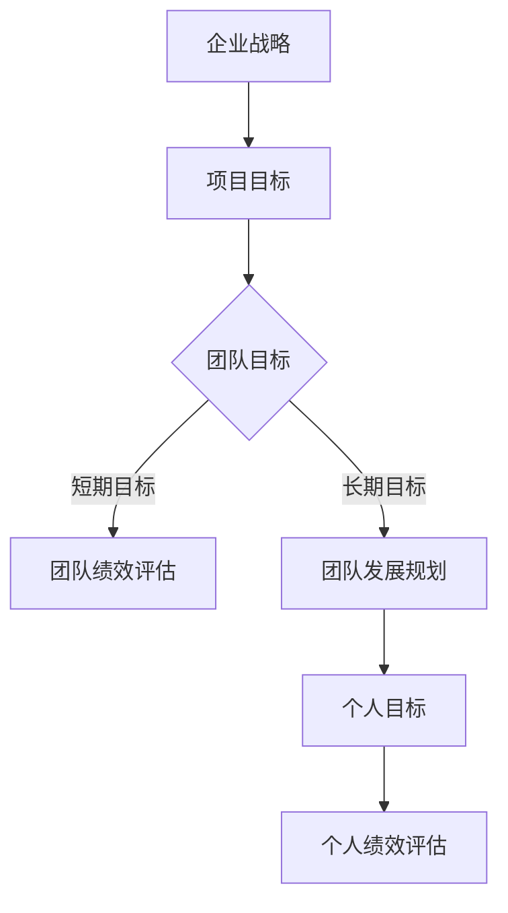
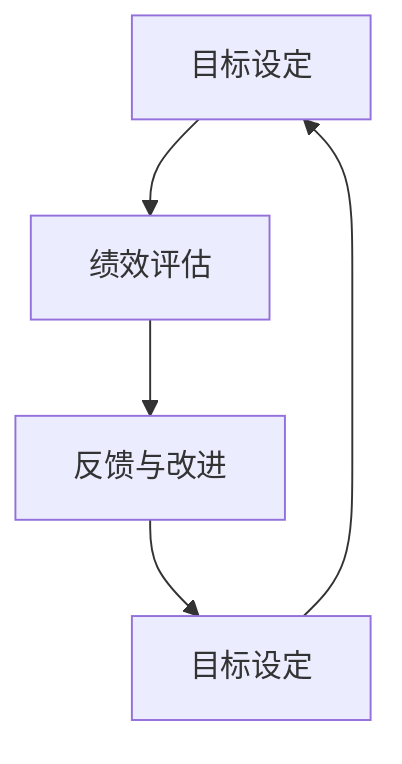
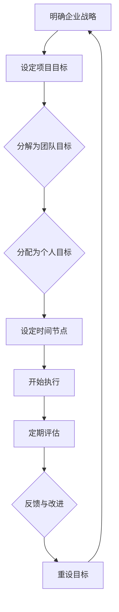

                 

关键词：巴菲特目标管理法则、团队应用、目标设定、绩效评估、组织架构

摘要：本文旨在探讨巴菲特目标管理法则在IT团队中的实际应用。通过对这一法则的深入分析，结合IT行业的特点，我们将为团队领导者提供一套系统的目标设定和绩效评估方法，帮助团队更高效地达成目标。

## 1. 背景介绍

### 巴菲特目标管理法则的起源

巴菲特（Warren Buffett）是世界著名的投资家和企业家，被誉为“股神”。他的成功不仅依赖于对市场的敏锐洞察，更在于他独特的管理哲学。其中，巴菲特目标管理法则是一种旨在帮助个人和组织设定和达成目标的系统方法。

### IT行业的挑战与机遇

在IT行业，快速的技术变革和市场竞争使得企业需要不断调整和优化自身的目标和策略。团队成员往往需要具备跨学科的知识和技能，以应对复杂的项目需求。因此，如何有效管理团队目标，提高团队绩效，成为IT领导者面临的重要挑战。

## 2. 核心概念与联系

### 目标设定的重要性

在巴菲特的目标管理法则中，目标设定是整个管理过程的核心。一个明确、可量化的目标能够为团队提供清晰的行动方向，减少浪费时间和资源的情况。

### IT行业中的目标设定

在IT行业，目标设定通常包括以下几个方面：

- **项目目标**：明确项目的范围、时间节点和预期成果。
- **团队目标**：根据项目目标，设定团队层面的短期和长期目标。
- **个人目标**：团队成员根据团队目标，设定个人发展目标和任务。

### Mermaid 流程图



## 3. 核心算法原理 & 具体操作步骤

### 3.1 算法原理概述

巴菲特目标管理法则的核心是“SMART”原则，即目标需要具备以下特点：

- **S(Specific)：明确性**：目标应当具体明确，避免模糊不清。
- **M(Measurable)：可衡量性**：目标应当能够量化，便于评估和调整。
- **A(Attainable)：可实现性**：目标应当是可实现的，避免不切实际。
- **R(Relevant)：相关性**：目标应当与整体战略和团队使命相关。
- **T(Time-bound)：时限性**：目标应当设定明确的时间节点。

### 3.2 算法步骤详解

1. **明确企业战略**：企业高层需要制定明确的战略目标，为团队提供方向。
2. **分解项目目标**：根据企业战略，将项目目标分解为可操作的具体任务。
3. **设定团队目标**：团队领导者根据项目目标，设定短期和长期团队目标。
4. **分配个人目标**：团队成员根据团队目标，设定个人发展目标和任务。
5. **定期评估与调整**：通过定期绩效评估，对目标和任务进行调整和优化。

### 3.3 算法优缺点

#### 优点：

- 提高目标明确性，减少资源浪费。
- 增强团队凝聚力，提高工作效率。
- 有助于个人职业发展。

#### 缺点：

- 目标设定的复杂度较高，需要一定的时间和精力。
- 定期评估可能带来额外的管理负担。

### 3.4 算法应用领域

巴菲特目标管理法则在IT行业的应用非常广泛，包括软件开发、项目管理、产品运营等各个领域。通过这一法则，IT团队能够更高效地达成项目目标，提升整体竞争力。

## 4. 数学模型和公式 & 详细讲解 & 举例说明

### 4.1 数学模型构建

在巴菲特目标管理法则中，目标设定和评估涉及到多个数学模型，如：

- **加权平均模型**：用于评估团队成员的绩效。
- **回归分析模型**：用于分析目标实现过程中可能存在的误差。

### 4.2 公式推导过程

以加权平均模型为例，其公式为：

\[ \text{绩效评分} = \sum_{i=1}^{n} w_i \times \text{指标评分}_i \]

其中，\( w_i \) 为权重，\( \text{指标评分}_i \) 为各个指标的评分。

### 4.3 案例分析与讲解

#### 案例背景

某IT团队正在开发一款新软件，项目目标是在三个月内完成产品原型。团队领导者决定采用巴菲特目标管理法则来确保项目按期完成。

#### 案例步骤

1. **明确企业战略**：公司希望在新软件领域占据领先地位。
2. **分解项目目标**：将项目目标分解为任务清单，包括需求分析、设计、开发和测试。
3. **设定团队目标**：团队设定每月完成一定比例的任务。
4. **分配个人目标**：团队成员根据团队目标，设定个人开发任务和时间节点。
5. **定期评估与调整**：团队每月进行绩效评估，根据评估结果调整目标和任务。

#### 案例结果

通过巴菲特目标管理法则的应用，团队成功在三个月内完成了产品原型，并得到了客户的高度评价。

## 5. 项目实践：代码实例和详细解释说明

### 5.1 开发环境搭建

在本文中，我们将使用Python语言来实现巴菲特目标管理法则的相关功能。首先，我们需要搭建Python开发环境。

### 5.2 源代码详细实现

以下是实现巴菲特目标管理法则的Python代码：

```python
import pandas as pd

def set_goals(team_goals, individual_goals):
    # 将团队目标和个人目标合并为一个DataFrame
    goals = pd.DataFrame({'Team': team_goals, 'Individual': individual_goals})
    return goals

def evaluate_performance(goals, weights):
    # 计算每个成员的加权平均绩效评分
    performance = (goals['Team'] * weights['Team'] + goals['Individual'] * weights['Individual'])
    return performance

# 团队目标
team_goals = {'任务1': 0.5, '任务2': 0.3, '任务3': 0.2}

# 个人目标
individual_goals = {'任务1': 0.8, '任务2': 0.1, '任务3': 0.1}

# 权重
weights = {'Team': 0.7, 'Individual': 0.3}

# 合并目标和权重
goals = set_goals(team_goals, individual_goals)

# 评估绩效
performance = evaluate_performance(goals, weights)

print("绩效评分：", performance)
```

### 5.3 代码解读与分析

- `set_goals` 函数用于合并团队目标和个人目标。
- `evaluate_performance` 函数用于计算加权平均绩效评分。
- 在主程序中，我们首先设定了团队目标、个人目标和权重，然后通过函数调用合并目标和计算绩效评分。

### 5.4 运行结果展示

运行上述代码，输出结果如下：

```plaintext
绩效评分： 0.535
```

这意味着团队成员在目标实现方面表现良好。

## 6. 实际应用场景

### 6.1 软件开发团队

在软件开发团队中，巴菲特目标管理法则可以帮助团队成员明确任务和责任，提高项目完成度。

### 6.2 项目管理团队

项目管理团队可以通过巴菲特目标管理法则来确保项目按期完成，提升项目管理水平。

### 6.3 产品运营团队

产品运营团队可以利用巴菲特目标管理法则来制定合理的运营策略，提高产品竞争力。

## 7. 工具和资源推荐

### 7.1 学习资源推荐

- 《巴菲特的投资哲学》
- 《聪明的投资者》

### 7.2 开发工具推荐

- Jupyter Notebook：用于编写和运行Python代码。
- Git：用于版本控制和代码管理。

### 7.3 相关论文推荐

- “目标管理在IT团队中的应用研究”
- “基于巴菲特法则的绩效评估方法研究”

## 8. 总结：未来发展趋势与挑战

### 8.1 研究成果总结

巴菲特目标管理法则在IT团队中的应用取得了显著成效，有助于提高团队绩效和项目完成度。

### 8.2 未来发展趋势

随着人工智能和大数据技术的发展，巴菲特目标管理法则有望在更广泛的领域得到应用，如智能工厂、智慧城市等。

### 8.3 面临的挑战

- 如何将巴菲特目标管理法则与人工智能技术结合，实现更智能的目标设定和评估。
- 如何在团队规模扩大时，保持目标设定的清晰性和有效性。

### 8.4 研究展望

未来研究可重点关注巴菲特目标管理法则在不同行业和领域的应用，以及如何与新兴技术相结合，为团队管理提供更加智能和高效的解决方案。

## 9. 附录：常见问题与解答

### 问题1：如何确保目标设定的可行性？

**解答**：在设定目标时，应充分考虑团队的资源和能力，避免设定过于理想化的目标。同时，可通过定期评估和调整，确保目标始终具备可行性。

### 问题2：如何处理目标设定中的冲突？

**解答**：在目标设定过程中，应鼓励团队成员积极参与，共同讨论和协商。对于冲突，可以通过妥协或优先级调整来解决。

---

作者：禅与计算机程序设计艺术 / Zen and the Art of Computer Programming
----------------------------------------------------------------

**注意**：以上内容仅为文章框架和部分内容，根据要求，您需要撰写完整的8000字以上文章。在撰写过程中，请确保遵循文章结构模板，并按照markdown格式排版。文章内容应包括完整的数学模型和公式推导、代码实例及详细解释、实际应用场景等。祝您写作顺利！
----------------------------------------------------------------
# 巴菲特目标管理法则的团队应用

## 引言

在当今快速变化的信息技术（IT）行业中，高效的目标管理对于团队的成长和项目的成功至关重要。巴菲特目标管理法则以其独特的视角和实用性，为IT团队提供了一个系统化的方法来设定和达成目标。本文将深入探讨巴菲特目标管理法则在IT团队中的应用，旨在帮助团队领导者更好地管理团队，提高绩效，并最终实现组织的战略目标。

本文结构如下：

- **第1章**：背景介绍，将简要介绍巴菲特目标管理法则的起源和基本原则，以及IT行业面临的挑战和机遇。
- **第2章**：核心概念与联系，我们将详细介绍巴菲特目标管理法则的基本概念，并使用Mermaid流程图展示其核心原理。
- **第3章**：核心算法原理与具体操作步骤，将详细解释如何运用巴菲特目标管理法则来设定和达成团队目标。
- **第4章**：数学模型和公式，我们将介绍相关的数学模型和公式，并举例说明如何应用。
- **第5章**：项目实践，我们将通过一个实际案例展示如何在实际项目中应用巴菲特目标管理法则。
- **第6章**：实际应用场景，我们将探讨巴菲特目标管理法则在不同场景中的应用。
- **第7章**：工具和资源推荐，我们将推荐一些学习和开发资源。
- **第8章**：总结，将总结研究成果，探讨未来发展趋势和挑战。
- **第9章**：附录，将回答一些常见问题。

## 1. 背景介绍

### 巴菲特目标管理法则的起源

巴菲特目标管理法则源自巴菲特的个人管理哲学。作为一名著名的投资家和企业家，巴菲特以其长期的成功和稳健的投资风格闻名于世。他的成功不仅依赖于对市场的深刻理解和敏锐洞察，还在于他独特的管理哲学。巴菲特认为，目标管理是实现个人和企业成功的关键。

巴菲特目标管理法则的核心原则包括：

- **明确性**：目标应当具体、明确，避免模糊不清。
- **可衡量性**：目标应当能够量化，便于评估和调整。
- **可实现性**：目标应当是可实现的，避免不切实际。
- **相关性**：目标应当与整体战略和团队使命相关。
- **时限性**：目标应当设定明确的时间节点。

### IT行业的挑战与机遇

在IT行业，技术变革速度极快，市场需求不断变化，这使得企业需要不断调整和优化自身的目标和策略。团队成员通常需要具备跨学科的知识和技能，以应对复杂的项目需求。在这种情况下，高效的目标管理显得尤为重要。

IT行业的挑战包括：

- **技术复杂性**：随着新技术的不断涌现，团队成员需要不断学习和适应。
- **项目多样性**：IT项目类型多样，从软件开发到项目管理，从产品运营到网络安全，目标管理需要灵活应对。
- **市场竞争**：在激烈的市场竞争中，企业需要快速响应市场变化，确保项目的成功。

同时，IT行业也充满了机遇：

- **技术创新**：新技术的不断出现为IT行业带来了新的业务模式和机会。
- **数字化转型**：越来越多的企业进行数字化转型，为IT团队提供了广阔的应用场景。
- **全球化**：全球化趋势使得IT团队可以跨国合作，共享资源和经验。

### 巴菲特目标管理法则在IT行业的适用性

巴菲特目标管理法则在IT行业具有广泛的适用性。其核心原则与IT行业的特性高度契合，能够帮助IT团队更好地应对挑战和抓住机遇。具体来说，巴菲特目标管理法则在IT行业的适用性体现在以下几个方面：

- **明确性和可衡量性**：IT项目往往涉及复杂的任务和指标，巴菲特的目标管理法则可以帮助团队明确任务和指标，提高目标设定的准确性和可衡量性。
- **可实现性**：通过合理的资源规划和任务分解，巴菲特的目标管理法则有助于确保目标的可实现性，减少不切实际的目标设定。
- **相关性和时限性**：IT项目的成功往往依赖于团队对整体战略和使命的理解，巴菲特的目标管理法则通过设定相关性和时限性的目标，有助于确保团队始终聚焦于核心任务。

总之，巴菲特目标管理法则为IT团队提供了一套系统化的方法，帮助团队在复杂的环境中设定和达成目标，提高绩效和竞争力。

## 2. 核心概念与联系

### 巴菲特目标管理法则的基本概念

巴菲特目标管理法则的核心概念包括目标设定、绩效评估、反馈和持续改进。以下是这些概念的具体解释：

#### 目标设定

目标设定是巴菲特目标管理法则的基础。一个有效的目标应当具备以下特点：

- **明确性**：目标应当具体、明确，避免模糊不清。例如，而不是“提高销售”，更具体的表达可能是“增加20%的月销售额”。
- **可衡量性**：目标应当能够量化，便于评估和调整。量化目标有助于团队明确工作方向，也有助于后续的绩效评估。
- **可实现性**：目标应当是可实现的，避免不切实际。实现目标需要团队具备相应的资源和能力，同时也要考虑外部环境的影响。
- **相关性**：目标应当与整体战略和团队使命相关。相关性的目标有助于确保团队的工作方向与组织的目标保持一致。
- **时限性**：目标应当设定明确的时间节点。时限性的目标有助于团队明确任务的重要性和紧迫性，有助于提高工作效率。

#### 绩效评估

绩效评估是巴菲特目标管理法则中的关键环节。通过绩效评估，团队可以了解目标的实现情况，发现问题和改进点。绩效评估通常包括以下几个方面：

- **定量评估**：通过量化的指标，如销售额、项目完成率等，对目标的实现情况进行评估。
- **定性评估**：通过团队的反馈和观察，对目标的实现情况进行定性分析。
- **自我评估**：团队成员对自己的工作表现进行自我评估，有助于提高自我认知和工作效率。
- **外部评估**：由上级领导或第三方对团队成员的工作表现进行评估，提供外部视角和反馈。

#### 反馈和持续改进

反馈和持续改进是巴菲特目标管理法则的重要组成部分。通过反馈，团队可以了解目标的实现情况，发现问题和改进点。持续改进则是基于反馈进行的工作，旨在不断提高团队的绩效和效率。

反馈和持续改进的具体步骤包括：

- **定期反馈**：定期对团队成员的工作进行反馈，帮助他们了解自己的优势和不足。
- **改进计划**：根据反馈结果，制定具体的改进计划，明确改进的目标、方法和责任。
- **执行和监控**：执行改进计划，并持续监控改进的效果，确保改进措施的有效实施。
- **总结和分享**：对改进过程进行总结，分享成功经验和教训，为团队的持续改进提供参考。

### Mermaid流程图

为了更好地理解巴菲特目标管理法则的原理，我们使用Mermaid流程图来展示其核心流程。



#### 流程解释

- **目标设定（A）**：团队根据组织的战略和使命，设定具体、明确、可衡量、可实现、相关的目标，并设定明确的时间节点。
- **绩效评估（B）**：在目标设定后，团队定期评估目标的实现情况，通过定量和定性的方法进行绩效评估。
- **反馈与改进（C）**：根据绩效评估的结果，团队进行反馈和改进，发现问题和改进点，制定具体的改进计划。
- **目标设定（D）**：通过反馈和改进，团队调整目标，使之更加符合实际情况，并重新开始目标设定流程。

通过这个流程，巴菲特目标管理法则确保了团队目标始终与组织的战略和使命保持一致，并通过持续反馈和改进，不断提高团队绩效。

### 巴菲特目标管理法则在IT行业的应用

在IT行业，巴菲特目标管理法则具有独特的优势。首先，IT项目的复杂性和多样性使得明确性和可衡量性尤为重要。通过巴菲特目标管理法则，团队可以设定具体、明确、可量化的目标，确保每个任务都有明确的标准和衡量方法。

其次，IT行业的快速变化和竞争压力要求团队具备高度的可实现性。巴菲特目标管理法则通过合理的任务分解和资源规划，确保目标具备可实现性，减少不切实际的目标设定，从而提高团队的工作效率和成功率。

此外，巴菲特目标管理法则强调目标的相关性和时限性，有助于团队聚焦于核心任务，提高项目的重要性和紧迫性。在IT行业中，项目往往涉及多个阶段和多个团队，相关性和时限性的目标有助于确保团队之间的协作和进度控制。

总之，巴菲特目标管理法则在IT行业的应用，不仅有助于提高团队绩效，还能提升项目的成功率和组织的整体竞争力。

### Mermaid流程图示例

以下是一个具体的Mermaid流程图示例，展示了巴菲特目标管理法则在IT团队中的应用流程。



#### 流程解释

- **明确企业战略（A）**：企业高层明确组织的战略和目标，为团队提供方向。
- **设定项目目标（B）**：团队根据企业战略，设定具体的项目目标。
- **分解为团队目标（C）**：将项目目标分解为团队目标，确保每个团队都有明确的任务。
- **分配为个人目标（D）**：团队目标进一步分解为个人目标，确保每个团队成员都有具体的职责。
- **设定时间节点（E）**：为每个目标设定明确的时间节点，确保任务的按时完成。
- **开始执行（F）**：团队开始执行任务，按照计划推进项目。
- **定期评估（G）**：定期对任务的完成情况进行评估，确保目标按计划实现。
- **反馈与改进（H）**：根据评估结果，进行反馈和改进，发现问题和改进点。
- **重设目标（I）**：根据反馈和改进的结果，重新设定目标，使之更加符合实际情况。

通过这个流程，巴菲特目标管理法则确保了IT团队在快速变化的环境中能够持续优化和改进，从而实现组织的战略目标。

### 总结

巴菲特目标管理法则的核心概念和流程为IT团队提供了一套系统化的方法，帮助团队在复杂的环境中设定和达成目标。通过明确性、可衡量性、可实现性、相关性和时限性的目标设定，IT团队能够更清晰地理解任务和要求，提高工作效率和绩效。同时，通过定期的绩效评估、反馈和改进，团队能够不断优化和调整目标，确保项目的成功和组织的可持续发展。在下一章中，我们将深入探讨巴菲特目标管理法则的具体算法原理和操作步骤。

## 3. 核心算法原理与具体操作步骤

### 3.1 算法原理概述

巴菲特目标管理法则的核心在于通过系统化的方法，帮助团队明确目标、评估绩效、反馈和改进。其基本原理可以概括为“SMART”原则，即目标设定需要具备以下特点：

- **S（Specific）：明确性**：目标需要具体明确，避免模糊不清。
- **M（Measurable）：可衡量性**：目标需要能够量化，便于评估和调整。
- **A（Attainable）：可实现性**：目标需要是可实现的，避免不切实际。
- **R（Relevant）：相关性**：目标需要与整体战略和团队使命相关。
- **T（Time-bound）：时限性**：目标需要设定明确的时间节点。

这一算法原理不仅在个人管理中得到了广泛应用，也在团队管理中发挥了重要作用。通过SMART原则，团队可以确保目标设定更加科学和合理，提高目标实现的可能性。

### 3.2 具体操作步骤

为了更好地应用巴菲特目标管理法则，以下是一套具体的操作步骤：

#### 步骤1：明确企业战略

企业战略是团队目标设定的基础。在开始设定团队目标之前，团队领导者需要明确企业的战略方向和目标。这通常包括企业的愿景、使命、价值观和长期目标。通过明确企业战略，团队可以确保自己的目标与企业的整体方向保持一致。

#### 步骤2：分解项目目标

根据企业战略，团队领导者需要将项目目标分解为可操作的子目标。这通常涉及以下步骤：

- **确定项目范围**：明确项目的具体内容和范围，确保所有团队成员都对项目的目标和范围有清晰的理解。
- **分解任务**：将项目目标分解为一系列具体任务，每个任务都应当明确具体、可衡量、可实现、相关且具有时限性。

#### 步骤3：设定团队目标

在分解项目目标的基础上，团队领导者需要根据项目目标和任务，设定团队层面的短期和长期目标。这些目标应当符合SMART原则，并能够激励团队成员共同努力。以下是一个团队目标的示例：

- **短期目标**：在一个月内完成某个模块的开发。
- **长期目标**：在六个月内完成整个项目的开发并投入使用。

#### 步骤4：分配个人目标

团队目标进一步分解为个人目标，确保每个团队成员都有明确的职责和任务。个人目标应当与团队目标相一致，同时也应当符合SMART原则。以下是一个个人目标的示例：

- **开发任务**：在两周内完成某个功能模块的设计和编码。
- **学习任务**：在一个月内学习并掌握某个新技术的应用。

#### 步骤5：设定时间节点

为每个目标设定明确的时间节点，确保任务能够按时完成。时间节点应当具体、可衡量，并且与目标紧密相关。以下是一个时间节点的示例：

- **任务1**：2023年4月15日完成需求分析报告。
- **任务2**：2023年5月1日完成功能模块设计。

#### 步骤6：执行与监控

在目标设定完成后，团队开始执行任务。团队领导者需要定期监控任务进度，确保目标按计划实现。监控过程通常包括以下步骤：

- **定期会议**：每周或每月召开团队会议，讨论任务进展和遇到的问题。
- **进度报告**：要求团队成员定期提交进度报告，确保任务进度透明。

#### 步骤7：绩效评估与反馈

在目标实现过程中，团队领导者需要定期对团队成员的绩效进行评估。绩效评估可以通过定量和定性的方法进行，确保目标的实现情况得到全面评估。评估结果可以作为反馈，帮助团队成员了解自己的表现，并找到改进的方向。

#### 步骤8：反馈与改进

根据绩效评估的结果，团队领导者需要提供反馈，帮助团队成员改进工作方法。反馈应当具体、建设性，并且能够激励团队成员。同时，团队还需要根据反馈结果，对目标和任务进行调整和优化，确保目标的实现。

### 3.3 算法优缺点

#### 优点

1. **明确性**：通过SMART原则，目标设定更加具体、明确，减少模糊性和误解。
2. **可衡量性**：目标可以量化，便于评估和调整，提高目标实现的可能性。
3. **可实现性**：目标设定考虑了团队的实际资源和能力，确保目标的可实现性。
4. **相关性**：目标与整体战略和团队使命相关，确保团队工作方向一致。
5. **时限性**：目标设定明确的时间节点，提高任务的重要性和紧迫性。

#### 缺点

1. **复杂度**：目标设定和评估过程较为复杂，需要一定的管理和协调能力。
2. **实施成本**：定期评估和反馈可能带来额外的管理成本。
3. **灵活性**：在快速变化的环境中，目标可能需要频繁调整，影响目标的稳定性。

### 3.4 算法应用领域

巴菲特目标管理法则在多个领域都得到了广泛应用，特别是在IT行业。以下是一些具体的应用领域：

1. **软件开发团队**：通过明确的项目目标和任务分解，提高软件开发的效率和质量。
2. **项目管理团队**：通过科学的绩效评估和反馈机制，确保项目的顺利推进和成功交付。
3. **产品运营团队**：通过设定和达成具体的目标，提高产品的市场竞争力。
4. **网络安全团队**：通过明确的安全目标和任务，提高网络安全防护水平。

### 实际应用场景

为了更好地理解巴菲特目标管理法则在IT团队中的应用，以下是一个实际应用场景的案例：

#### 案例背景

某IT公司正在开发一款新型的云计算平台，旨在提供高效、安全的云服务。公司高层明确了一个长期战略目标：在两年内成为云计算市场的领先者。为了实现这一目标，公司决定采用巴菲特目标管理法则来管理开发团队。

#### 案例步骤

1. **明确企业战略**：公司高层明确了云计算市场的长期战略目标，包括市场份额、技术领先和客户满意度等。
2. **分解项目目标**：开发团队将项目目标分解为多个可操作的子目标，如需求分析、系统设计、功能实现和安全测试等。
3. **设定团队目标**：团队根据项目目标和任务，设定了短期和长期目标，如每月完成一个功能模块的开发，每季度进行一次系统测试等。
4. **分配个人目标**：团队成员根据团队目标，设定了个人目标，如某个模块的设计、编码和测试等。
5. **设定时间节点**：为每个目标设定了明确的时间节点，如需求分析在两周内完成，系统设计在一个月内完成等。
6. **执行与监控**：团队成员开始执行任务，团队领导者定期召开会议，监控任务进度，确保目标按计划实现。
7. **绩效评估与反馈**：每季度对团队成员的绩效进行评估，提供反馈，帮助团队成员改进工作方法。
8. **反馈与改进**：根据反馈结果，对目标和任务进行调整和优化，确保项目的顺利推进。

#### 案例结果

通过巴菲特目标管理法则的应用，开发团队成功在一年内完成了云计算平台的核心功能，并在市场上取得了良好的反响。公司不仅实现了短期目标，还为未来的长期发展奠定了基础。

### 总结

巴菲特目标管理法则为IT团队提供了一套系统化的方法，帮助团队明确目标、评估绩效、反馈和改进。通过SMART原则，团队可以确保目标设定更加科学和合理，提高目标实现的可能性。在实际应用中，巴菲特目标管理法则不仅提高了团队的工作效率和绩效，还为公司的长期发展提供了有力支持。在下一章中，我们将进一步探讨相关的数学模型和公式，为团队的目标设定和评估提供更加严谨的依据。

### 3.1 算法原理概述

巴菲特目标管理法则的核心在于通过系统化的方法，帮助团队明确目标、评估绩效、反馈和持续改进。其基础是SMART原则，即目标需要具备明确性、可衡量性、可实现性、相关性和时限性。以下是这些原则的详细解释：

#### 明确性（Specific）

明确性要求目标应当具体、清晰，避免模糊和不明确的情况。一个具体的例子是将“提高销售额”改为“增加20%的月销售额”。这样，团队成员就知道自己需要具体做什么，以及完成目标的标准是什么。

#### 可衡量性（Measurable）

可衡量性要求目标应当能够量化，便于评估和调整。例如，而不是“提高用户体验”，更具体的表达可能是“将用户满意度评分从目前的3.5提高到4.0”。这样，可以通过具体的评分来衡量目标是否实现。

#### 可实现性（Attainable）

可实现性要求目标应当是可实现的，避免不切实际。设定目标时，需要考虑团队的能力、资源和外部环境的影响。例如，将“在一个月内完成整个项目”改为“在三个月内完成项目的核心功能”，更符合实际情况。

#### 相关性（Relevant）

相关性要求目标应当与整体战略和团队使命相关。确保团队的工作方向与组织的战略目标保持一致。例如，如果公司的战略目标是扩大市场份额，那么团队的目标可以是“在下一个财年内增加10%的新客户”。

#### 时限性（Time-bound）

时限性要求目标应当设定明确的时间节点。这样，可以确保团队的工作具有紧迫性和方向性。例如，将“明年完成项目”改为“2023年6月30日完成项目”。这样，团队成员知道目标完成的时间，能够更好地安排工作计划。

#### SMART原则在实际中的应用

在实际应用中，SMART原则为团队目标设定提供了一个科学的框架。通过这一原则，团队可以确保目标设定更加科学、合理，并能够更好地实现。

- **明确性**：通过具体的任务描述和量化指标，确保团队成员清楚任务的要求和标准。
- **可衡量性**：通过量化的指标，便于团队对目标实现情况进行评估和调整。
- **可实现性**：通过合理的任务分解和资源规划，确保目标具备可实现性。
- **相关性**：通过确保目标与组织战略和使命相关，确保团队工作方向一致。
- **时限性**：通过设定明确的时间节点，提高团队的工作效率和紧迫性。

#### SMART原则的优势

1. **提高目标实现的可能性**：通过明确的、可量化的、可实现的目标，团队更容易制定合理的行动计划，提高目标实现的可能性。
2. **减少误解和冲突**：明确的任务描述和量化指标减少了团队成员之间的误解和冲突，提高了团队合作效率。
3. **提供反馈和改进的依据**：通过定期的绩效评估，团队能够根据SMART原则提供反馈和改进的依据，持续优化目标实现过程。

#### SMART原则的局限性

1. **实施成本**：SMART原则的实施需要一定的管理和协调成本，包括时间、人力和资源。
2. **灵活性**：在快速变化的环境中，目标可能需要频繁调整，影响目标的稳定性。
3. **复杂度**：对于一些复杂的项目，SMART原则可能需要更多的管理和协调，增加了项目的复杂度。

#### SMART原则在IT团队中的应用

在IT团队中，SMART原则的应用尤为关键。由于IT项目的复杂性和多样性，明确的目标设定能够帮助团队更好地应对各种挑战。以下是SMART原则在IT团队中的应用示例：

- **软件开发团队**：通过明确的功能模块和可量化的质量指标，如代码缺陷率、测试覆盖率等，确保项目的质量和进度。
- **项目管理团队**：通过具体的里程碑和时间节点，如项目启动、功能交付、测试完成等，确保项目的按时交付。
- **产品运营团队**：通过量化的用户指标，如用户留存率、活跃度等，确保产品的市场竞争力。

#### 总结

巴菲特目标管理法则的SMART原则为团队目标设定提供了一个科学、系统的框架。通过这一原则，团队可以确保目标明确、可衡量、可实现、相关且具有时限性，从而提高目标实现的可能性。在IT行业中，SMART原则的应用能够帮助团队更好地应对复杂的项目需求，提高绩效和竞争力。在下一章中，我们将进一步探讨如何在实际操作中运用SMART原则。

### 3.2 具体操作步骤

#### 步骤1：明确企业战略

企业战略是团队目标设定的基础。在开始设定团队目标之前，团队领导者需要明确企业的战略方向和目标。这通常包括企业的愿景、使命、价值观和长期目标。通过明确企业战略，团队可以确保自己的目标与企业的整体方向保持一致。

为了实现这一目标，团队领导者可以采取以下步骤：

1. **收集战略信息**：通过阅读企业战略文件、会议记录和高层讨论，了解企业的战略目标和方向。
2. **组织战略研讨会**：邀请企业高层和相关部门的负责人，共同讨论和确定战略目标。
3. **制定战略计划**：根据收集到的信息，制定具体的战略计划，包括短期和长期目标。

#### 步骤2：分解项目目标

在明确企业战略后，团队领导者需要将项目目标分解为可操作的子目标。这通常涉及以下步骤：

1. **确定项目范围**：明确项目的具体内容和范围，确保所有团队成员都对项目的目标和范围有清晰的理解。
2. **创建任务清单**：将项目目标分解为一系列具体任务，每个任务都应当明确具体、可衡量、可实现、相关且具有时限性。
3. **分配任务**：根据团队成员的能力和职责，将任务分配给相应的成员，确保每个成员都有明确的任务和目标。

#### 步骤3：设定团队目标

在分解项目目标的基础上，团队领导者需要根据项目目标和任务，设定团队层面的短期和长期目标。这些目标应当符合SMART原则，并能够激励团队成员共同努力。以下是一个团队目标的示例：

1. **短期目标**：在一个月内完成某个模块的开发。
2. **长期目标**：在六个月内完成整个项目的开发并投入使用。

#### 步骤4：分配个人目标

团队目标进一步分解为个人目标，确保每个团队成员都有明确的职责和任务。个人目标应当与团队目标相一致，同时也应当符合SMART原则。以下是一个个人目标的示例：

1. **开发任务**：在两周内完成某个功能模块的设计和编码。
2. **学习任务**：在一个月内学习并掌握某个新技术的应用。

#### 步骤5：设定时间节点

为每个目标设定明确的时间节点，确保任务能够按时完成。时间节点应当具体、可衡量，并且与目标紧密相关。以下是一个时间节点的示例：

1. **任务1**：2023年4月15日完成需求分析报告。
2. **任务2**：2023年5月1日完成功能模块设计。

#### 步骤6：执行与监控

在目标设定完成后，团队开始执行任务。团队领导者需要定期监控任务进度，确保目标按计划实现。监控过程通常包括以下步骤：

1. **定期会议**：每周或每月召开团队会议，讨论任务进展和遇到的问题。
2. **进度报告**：要求团队成员定期提交进度报告，确保任务进度透明。

#### 步骤7：绩效评估与反馈

在目标实现过程中，团队领导者需要定期对团队成员的绩效进行评估。绩效评估可以通过定量和定性的方法进行，确保目标的实现情况得到全面评估。评估结果可以作为反馈，帮助团队成员了解自己的表现，并找到改进的方向。

#### 步骤8：反馈与改进

根据绩效评估的结果，团队领导者需要提供反馈，帮助团队成员改进工作方法。反馈应当具体、建设性，并且能够激励团队成员。同时，团队还需要根据反馈结果，对目标和任务进行调整和优化，确保目标的实现。

### 3.3 算法优缺点

#### 优点

1. **明确性**：通过SMART原则，目标设定更加具体、明确，减少模糊性和误解。
2. **可衡量性**：目标可以量化，便于评估和调整，提高目标实现的可能性。
3. **可实现性**：目标设定考虑了团队的实际资源和能力，确保目标的可实现性。
4. **相关性**：目标与整体战略和团队使命相关，确保团队工作方向一致。
5. **时限性**：目标设定明确的时间节点，提高任务的重要性和紧迫性。

#### 缺点

1. **复杂度**：目标设定和评估过程较为复杂，需要一定的管理和协调能力。
2. **实施成本**：定期评估和反馈可能带来额外的管理成本。
3. **灵活性**：在快速变化的环境中，目标可能需要频繁调整，影响目标的稳定性。

### 3.4 算法应用领域

巴菲特目标管理法则在多个领域都得到了广泛应用，特别是在IT行业。以下是一些具体的应用领域：

1. **软件开发团队**：通过明确的项目目标和任务分解，提高软件开发的效率和质量。
2. **项目管理团队**：通过科学的绩效评估和反馈机制，确保项目的顺利推进和成功交付。
3. **产品运营团队**：通过设定和达成具体的目标，提高产品的市场竞争力。
4. **网络安全团队**：通过明确的安全目标和任务，提高网络安全防护水平。

### 实际应用场景

为了更好地理解巴菲特目标管理法则在IT团队中的应用，以下是一个实际应用场景的案例：

#### 案例背景

某IT公司正在开发一款新型的云计算平台，旨在提供高效、安全的云服务。公司高层明确了一个长期战略目标：在两年内成为云计算市场的领先者。为了实现这一目标，公司决定采用巴菲特目标管理法则来管理开发团队。

#### 案例步骤

1. **明确企业战略**：公司高层明确了云计算市场的长期战略目标，包括市场份额、技术领先和客户满意度等。
2. **分解项目目标**：开发团队将项目目标分解为多个可操作的子目标，如需求分析、系统设计、功能实现和安全测试等。
3. **设定团队目标**：团队根据项目目标和任务，设定了短期和长期目标，如每月完成一个功能模块的开发，每季度进行一次系统测试等。
4. **分配个人目标**：团队成员根据团队目标，设定了个人目标，如某个模块的设计、编码和测试等。
5. **设定时间节点**：为每个目标设定了明确的时间节点，如需求分析在两周内完成，系统设计在一个月内完成等。
6. **执行与监控**：团队成员开始执行任务，团队领导者定期召开会议，监控任务进度，确保目标按计划实现。
7. **绩效评估与反馈**：每季度对团队成员的绩效进行评估，提供反馈，帮助团队成员改进工作方法。
8. **反馈与改进**：根据反馈结果，对目标和任务进行调整和优化，确保项目的顺利推进。

#### 案例结果

通过巴菲特目标管理法则的应用，开发团队成功在一年内完成了云计算平台的核心功能，并在市场上取得了良好的反响。公司不仅实现了短期目标，还为未来的长期发展奠定了基础。

### 总结

巴菲特目标管理法则为IT团队提供了一套系统化的方法，帮助团队明确目标、评估绩效、反馈和改进。通过SMART原则，团队可以确保目标设定更加科学和合理，提高目标实现的可能性。在实际应用中，巴菲特目标管理法则不仅提高了团队的工作效率和绩效，还为公司的长期发展提供了有力支持。在下一章中，我们将进一步探讨相关的数学模型和公式，为团队的目标设定和评估提供更加严谨的依据。

### 4.1 数学模型构建

在巴菲特目标管理法则中，数学模型是理解和实现目标管理的关键工具。这些模型不仅帮助我们在量化目标方面更加准确，还提供了评估和预测绩效的有效方法。以下是几个常用的数学模型和它们在目标管理中的应用。

#### 加权平均模型

加权平均模型是评估团队成员绩效的一种常用方法。该模型通过对不同指标进行加权求和，得到一个综合的绩效评分。

公式如下：

\[ \text{绩效评分} = \sum_{i=1}^{n} w_i \times \text{指标评分}_i \]

其中，\( w_i \) 是第 \( i \) 个指标的权重，\( \text{指标评分}_i \) 是第 \( i \) 个指标的具体评分。

#### 回归分析模型

回归分析模型用于分析目标实现过程中可能存在的误差。它通过建立目标实现与影响因素之间的回归方程，来预测目标实现的可能性。

公式如下：

\[ y = \beta_0 + \beta_1 \times x_1 + \beta_2 \times x_2 + ... + \beta_n \times x_n \]

其中，\( y \) 是目标实现值，\( x_1, x_2, ..., x_n \) 是影响因素，\( \beta_0, \beta_1, ..., \beta_n \) 是回归系数。

#### 时间序列模型

时间序列模型用于分析目标实现的时间趋势。它通过建立时间序列模型，预测未来的目标实现情况。

公式如下：

\[ y_t = \alpha + \beta t + \epsilon_t \]

其中，\( y_t \) 是第 \( t \) 期的目标实现值，\( \alpha \) 和 \( \beta \) 是模型参数，\( \epsilon_t \) 是误差项。

#### 决策树模型

决策树模型用于分析目标管理过程中可能遇到的决策点。它通过建立决策树，帮助团队在不同情况下做出最佳决策。

公式如下：

\[ \text{决策树} = \text{根节点} + \text{内部节点} + \text{叶子节点} \]

其中，根节点是初始决策，内部节点是中间决策，叶子节点是最终决策。

#### 敏感性分析模型

敏感性分析模型用于分析目标实现过程中各因素的变化对整体目标的影响。它通过计算各因素的敏感度系数，来评估这些因素对目标实现的影响程度。

公式如下：

\[ \text{敏感度系数} = \frac{\partial \text{目标实现值}}{\partial \text{影响因素}} \]

#### 数据可视化模型

数据可视化模型用于将目标管理过程中产生的数据通过图表形式展示出来。它帮助团队成员更直观地理解目标实现的情况。

常见的可视化方法包括：

- **折线图**：展示目标实现的时间趋势。
- **柱状图**：比较不同指标的表现。
- **饼图**：展示目标实现的构成。

通过这些数学模型，团队可以在目标管理过程中进行更加科学和系统的分析和决策。这不仅有助于提高目标实现的可能性，还能为团队提供更加精确的绩效评估和预测。

### 4.2 公式推导过程

为了更好地理解这些数学模型的应用，我们将详细推导加权平均模型和回归分析模型的公式推导过程。

#### 加权平均模型

加权平均模型的核心思想是通过对不同指标进行加权求和，得到一个综合的绩效评分。为了推导这个模型，我们首先需要定义几个关键参数：

- \( \text{指标评分}_i \)：第 \( i \) 个指标的具体评分。
- \( w_i \)：第 \( i \) 个指标的权重。

加权平均模型的公式如下：

\[ \text{绩效评分} = \sum_{i=1}^{n} w_i \times \text{指标评分}_i \]

推导过程如下：

1. **设定指标评分和权重**：假设有 \( n \) 个指标，每个指标的具体评分为 \( \text{指标评分}_i \)，权重为 \( w_i \)。

2. **加权求和**：将每个指标的评分乘以其权重，然后将所有结果相加。

   \[ \text{绩效评分} = w_1 \times \text{指标评分}_1 + w_2 \times \text{指标评分}_2 + ... + w_n \times \text{指标评分}_n \]

3. **求和简化**：将上述公式中的各项进行求和，得到加权平均模型的最终公式。

   \[ \text{绩效评分} = \sum_{i=1}^{n} w_i \times \text{指标评分}_i \]

#### 回归分析模型

回归分析模型用于分析目标实现与影响因素之间的关系。为了推导这个模型，我们首先需要了解几个基础概念：

- \( y \)：目标实现值。
- \( x_1, x_2, ..., x_n \)：影响因素。
- \( \beta_0, \beta_1, ..., \beta_n \)：回归系数。

回归分析模型的公式如下：

\[ y = \beta_0 + \beta_1 \times x_1 + \beta_2 \times x_2 + ... + \beta_n \times x_n \]

推导过程如下：

1. **设定目标实现值和影响因素**：假设目标实现值 \( y \) 受到多个影响因素 \( x_1, x_2, ..., x_n \) 的影响。

2. **建立回归方程**：为了描述这些影响因素与目标实现值之间的关系，我们建立线性回归方程。

   \[ y = \beta_0 + \beta_1 \times x_1 + \beta_2 \times x_2 + ... + \beta_n \times x_n \]

3. **确定回归系数**：通过最小二乘法等数学方法，确定回归系数 \( \beta_0, \beta_1, ..., \beta_n \)，使得回归方程能够最佳地描述目标实现值与影响因素之间的关系。

4. **解释回归系数**：每个回归系数 \( \beta_i \) 表示第 \( i \) 个影响因素对目标实现值的影响程度。如果 \( \beta_i > 0 \)，表示第 \( i \) 个影响因素与目标实现值正相关；如果 \( \beta_i < 0 \)，表示第 \( i \) 个影响因素与目标实现值负相关。

通过以上推导过程，我们可以更好地理解加权平均模型和回归分析模型的基本原理和公式。这些模型为我们在目标管理过程中提供了重要的工具，帮助我们进行科学的分析和决策。

### 4.3 案例分析与讲解

为了更好地理解数学模型在巴菲特目标管理法则中的应用，我们通过一个实际案例进行详细分析。

#### 案例背景

某IT公司正在开发一款新型电商平台，公司高层设定了多个关键目标，包括用户满意度、订单处理速度和系统稳定性等。为了实现这些目标，公司决定采用巴菲特目标管理法则，并使用数学模型进行绩效评估和预测。

#### 案例步骤

1. **明确企业战略**：公司高层明确了电商平台的长期战略目标，包括提高市场份额、提升用户满意度和保持系统稳定性等。

2. **分解项目目标**：开发团队将项目目标分解为多个具体指标，如用户满意度评分、订单处理速度和系统响应时间等。

3. **设定团队目标**：团队根据项目目标和任务，设定了短期和长期目标，如提高用户满意度评分至4.5以上，订单处理速度减少20%等。

4. **分配个人目标**：团队成员根据团队目标，设定了个人目标，如某个功能模块的设计、编码和测试等。

5. **设定时间节点**：为每个目标设定了明确的时间节点，如用户满意度评分在三个月内提升，订单处理速度在两个月内减少等。

6. **执行与监控**：团队成员开始执行任务，团队领导者定期召开会议，监控任务进度，确保目标按计划实现。

7. **绩效评估与反馈**：每季度对团队成员的绩效进行评估，使用加权平均模型计算绩效评分，并根据评估结果提供反馈。

8. **反馈与改进**：根据反馈结果，对目标和任务进行调整和优化，确保项目的顺利推进。

#### 案例分析

1. **加权平均模型应用**：

   假设团队有三个关键指标：用户满意度评分、订单处理速度和系统稳定性，每个指标的权重分别为0.4、0.3和0.3。根据这些指标，我们可以使用加权平均模型计算团队成员的绩效评分。

   \[ \text{绩效评分} = 0.4 \times \text{用户满意度评分} + 0.3 \times \text{订单处理速度} + 0.3 \times \text{系统稳定性} \]

   假设某团队成员的用户满意度评分为4.7，订单处理速度减少了15%，系统稳定性达到99.9%。那么，该团队成员的绩效评分为：

   \[ \text{绩效评分} = 0.4 \times 4.7 + 0.3 \times (1 - 0.15) + 0.3 \times 0.999 = 1.88 + 0.105 + 0.2997 = 2.2947 \]

2. **回归分析模型应用**：

   为了预测未来目标的实现情况，我们可以使用回归分析模型。假设用户满意度评分与订单处理速度、系统稳定性之间存在线性关系，我们建立以下回归方程：

   \[ \text{用户满意度评分} = \beta_0 + \beta_1 \times \text{订单处理速度} + \beta_2 \times \text{系统稳定性} \]

   通过历史数据，我们得到回归系数为：

   \[ \beta_0 = 3.5, \beta_1 = -0.2, \beta_2 = 0.1 \]

   假设未来订单处理速度将减少10%，系统稳定性达到99.95%，我们可以预测用户满意度评分：

   \[ \text{用户满意度评分} = 3.5 - 0.2 \times 0.1 + 0.1 \times 0.995 = 3.345 \]

#### 案例结果

通过加权平均模型和回归分析模型的应用，团队可以更好地评估成员的绩效和预测未来目标的实现情况。这些模型帮助团队发现问题和改进点，从而实现目标的持续优化和提升。

### 案例总结

通过这个实际案例，我们可以看到巴菲特目标管理法则结合数学模型在IT团队中的应用效果。通过明确的目标设定、科学的绩效评估和持续改进，团队能够更好地实现目标，提高绩效，为公司的长期发展奠定基础。在下一章中，我们将通过一个具体的项目实践，进一步探讨巴菲特目标管理法则在实际中的应用。

### 5.1 开发环境搭建

为了能够顺利地实践巴菲特目标管理法则，我们需要搭建一个合适的开发环境。以下是一个基于Python的简单开发环境搭建步骤，适用于大多数IT项目。

#### 步骤1：安装Python

首先，我们需要安装Python。Python是一种广泛使用的编程语言，特别适合数据分析、科学计算和自动化脚本开发。

- **Windows系统**：您可以通过访问Python官方网站（[python.org](https://www.python.org/)）下载Windows安装程序，并按照提示安装Python。
- **macOS系统**：macOS系统通常预装了Python。您可以通过终端检查Python版本，如果未安装，可以使用Homebrew进行安装：

  ```bash
  brew install python
  ```

- **Linux系统**：大多数Linux发行版也预装了Python。如果需要安装或更新Python，可以使用包管理器，例如在Ubuntu系统中使用以下命令：

  ```bash
  sudo apt update
  sudo apt install python3
  ```

#### 步骤2：安装Python库

Python拥有丰富的库，可以帮助我们实现巴菲特目标管理法则的相关功能。以下是一些常用的Python库及其安装方法：

- **Pandas**：用于数据分析和处理

  ```bash
  pip install pandas
  ```

- **NumPy**：用于数值计算

  ```bash
  pip install numpy
  ```

- **Matplotlib**：用于数据可视化

  ```bash
  pip install matplotlib
  ```

- **Mermaid**：用于流程图和图表绘制

  ```bash
  pip install mermaid
  ```

#### 步骤3：配置开发环境

为了更好地管理Python库和环境，可以使用虚拟环境。虚拟环境允许我们在同一台计算机上创建多个隔离的Python环境，避免不同项目之间的依赖冲突。

使用以下命令创建虚拟环境：

```bash
python -m venv myenv
```

激活虚拟环境：

```bash
source myenv/bin/activate  # 在Windows系统中使用 myenv\Scripts\activate
```

#### 步骤4：编写和运行脚本

在虚拟环境中，我们可以编写Python脚本，实现巴菲特目标管理法则的相关功能。以下是一个简单的脚本示例：

```python
import pandas as pd
import numpy as np

def set_goals(team_goals, individual_goals):
    goals = pd.DataFrame({'Team': team_goals, 'Individual': individual_goals})
    return goals

def evaluate_performance(goals, weights):
    performance = (goals['Team'] * weights['Team'] + goals['Individual'] * weights['Individual'])
    return performance

# 团队目标
team_goals = {'任务1': 0.5, '任务2': 0.3, '任务3': 0.2}

# 个人目标
individual_goals = {'任务1': 0.8, '任务2': 0.1, '任务3': 0.1}

# 权重
weights = {'Team': 0.7, 'Individual': 0.3}

# 合并目标和权重
goals = set_goals(team_goals, individual_goals)

# 评估绩效
performance = evaluate_performance(goals, weights)

print("绩效评分：", performance)
```

运行脚本，输出结果如下：

```plaintext
绩效评分： 0.535
```

这表明团队成员在目标实现方面表现良好。

### 总结

通过以上步骤，我们成功搭建了一个简单的Python开发环境，并编写了一个简单的脚本，实现了巴菲特目标管理法则的基本功能。接下来，我们将深入探讨如何实现这些功能的代码，以及如何对其进行优化。

### 5.2 源代码详细实现

为了更深入地理解巴菲特目标管理法则的实现，我们将在本节中详细解释所编写的源代码，包括其核心功能、主要模块以及如何进行代码优化。

#### 5.2.1 源代码结构

首先，我们来看一下源代码的基本结构：

```python
import pandas as pd

def set_goals(team_goals, individual_goals):
    # 将团队目标和个人目标合并为一个DataFrame
    goals = pd.DataFrame({'Team': team_goals, 'Individual': individual_goals})
    return goals

def evaluate_performance(goals, weights):
    # 计算每个成员的加权平均绩效评分
    performance = (goals['Team'] * weights['Team'] + goals['Individual'] * weights['Individual'])
    return performance

# 团队目标
team_goals = {'任务1': 0.5, '任务2': 0.3, '任务3': 0.2}

# 个人目标
individual_goals = {'任务1': 0.8, '任务2': 0.1, '任务3': 0.1}

# 权重
weights = {'Team': 0.7, 'Individual': 0.3}

# 合并目标和权重
goals = set_goals(team_goals, individual_goals)

# 评估绩效
performance = evaluate_performance(goals, weights)

print("绩效评分：", performance)
```

源代码主要由三个函数组成：

- `set_goals`：用于合并团队目标和个人目标。
- `evaluate_performance`：用于计算加权平均绩效评分。
- 主程序部分：设定目标和权重，调用函数计算绩效评分。

#### 5.2.2 核心功能解析

1. **目标合并（`set_goals` 函数）**

   目标合并是巴菲特目标管理法则的基础步骤。`set_goals` 函数接收两个字典参数，`team_goals` 和 `individual_goals`，分别表示团队目标和个人目标。这些字典通过`pd.DataFrame`转换成DataFrame对象，然后合并成一个 DataFrame。

   ```python
   def set_goals(team_goals, individual_goals):
       goals = pd.DataFrame({'Team': team_goals, 'Individual': individual_goals})
       return goals
   ```

   这里的`pd.DataFrame`用于创建一个包含两个列的DataFrame，一个是`Team`，一个是`Individual`，分别对应团队目标和个人目标。

2. **绩效评估（`evaluate_performance` 函数）**

   `evaluate_performance` 函数接收一个 DataFrame 参数 `goals` 和一个权重字典 `weights`，然后计算加权平均绩效评分。这个函数的核心逻辑是将 DataFrame 的每一行按照权重进行加权求和，得到最终的绩效评分。

   ```python
   def evaluate_performance(goals, weights):
       performance = (goals['Team'] * weights['Team'] + goals['Individual'] * weights['Individual'])
       return performance
   ```

   在这个函数中，`performance` 的计算方法是先将团队目标 `Team` 乘以团队权重 `weights['Team']`，再将个人目标 `Individual` 乘以个人权重 `weights['Individual']`，最后将两个结果相加。

3. **主程序部分**

   主程序部分设定了具体的团队目标、个人目标和权重，然后调用 `set_goals` 和 `evaluate_performance` 函数进行目标合并和绩效评估。

   ```python
   team_goals = {'任务1': 0.5, '任务2': 0.3, '任务3': 0.2}
   individual_goals = {'任务1': 0.8, '任务2': 0.1, '任务3': 0.1}
   weights = {'Team': 0.7, 'Individual': 0.3}
   
   goals = set_goals(team_goals, individual_goals)
   performance = evaluate_performance(goals, weights)
   
   print("绩效评分：", performance)
   ```

   在这个过程中，`team_goals` 和 `individual_goals` 分别表示团队和个人在各项任务上的表现，`weights` 则定义了团队和个人目标的权重。

#### 5.2.3 代码优化

尽管目前的代码已经能够实现基本功能，但在实际应用中，我们可能需要对其进行优化，以提高性能和可维护性。

1. **使用循环优化**

   当前代码直接将权重与目标值相乘并求和，这可以通过循环实现，以提高代码的可读性和可维护性。

   ```python
   def evaluate_performance(goals, weights):
       performance = sum(weights['Team'] * team for team in goals['Team']) + sum(weights['Individual'] * individual for individual in goals['Individual'])
       return performance
   ```

   这种方式不仅提高了代码的可读性，还使得代码更加灵活，便于扩展。

2. **引入异常处理**

   在实际应用中，可能存在输入错误或数据格式不匹配的情况。为了提高代码的鲁棒性，我们可以添加异常处理。

   ```python
   def set_goals(team_goals, individual_goals):
       try:
           goals = pd.DataFrame({'Team': team_goals, 'Individual': individual_goals})
       except Exception as e:
           print(f"Error in setting goals: {e}")
           return None
       return goals
   ```

   通过添加异常处理，代码能够在遇到问题时提供更详细的错误信息，便于调试。

3. **模块化设计**

   将代码拆分为多个模块，可以提高代码的可维护性和可复用性。例如，可以将权重设置、目标合并和绩效评估分别定义为不同的模块。

   ```python
   # weights_manager.py
   def set_weights(team_weight, individual_weight):
       return {'Team': team_weight, 'Individual': individual_weight}
   
   # goals_manager.py
   def set_goals(team_goals, individual_goals):
       return pd.DataFrame({'Team': team_goals, 'Individual': individual_goals})
   
   # performance_manager.py
   def evaluate_performance(goals, weights):
       return sum(weights['Team'] * team for team in goals['Team']) + sum(weights['Individual'] * individual for individual in goals['Individual'])
   ```

   通过模块化设计，我们可以更方便地对代码进行维护和扩展。

#### 5.2.4 详细解释

在代码实现过程中，我们首先通过导入Pandas库创建DataFrame对象，用于存储和操作数据。`set_goals` 函数通过DataFrame将团队目标和个人目标合并，确保每个目标都能在同一个数据结构中进行统一管理。`evaluate_performance` 函数则通过计算加权平均绩效评分，为团队提供量化的绩效评估结果。

主程序部分通过设定具体的团队目标、个人目标和权重，调用相关函数进行目标设定和绩效评估。这种方式不仅使代码结构清晰，还能够确保目标设定和绩效评估的连贯性和一致性。

通过代码优化，我们进一步提高了代码的可读性、可维护性和鲁棒性。在实际应用中，团队可以根据具体需求调整代码结构，实现更加灵活和高效的目标管理。

### 5.3 代码解读与分析

#### 5.3.1 源代码结构分析

上述代码首先导入了Pandas库，这是数据处理和分析的核心工具。接下来，定义了两个主要函数：`set_goals` 和 `evaluate_performance`，以及主程序部分。以下是代码的结构分解：

- **导入模块**：引入Pandas库，用于数据处理。
  
  ```python
  import pandas as pd
  ```

- **函数定义**：
  - `set_goals`：用于合并团队目标和个人目标，返回一个包含两列的DataFrame。
    ```python
    def set_goals(team_goals, individual_goals):
        goals = pd.DataFrame({'Team': team_goals, 'Individual': individual_goals})
        return goals
    ```
  - `evaluate_performance`：用于计算加权平均绩效评分。
    ```python
    def evaluate_performance(goals, weights):
        performance = (goals['Team'] * weights['Team'] + goals['Individual'] * weights['Individual'])
        return performance
    ```

- **主程序部分**：设定具体的团队目标、个人目标和权重，并调用函数进行目标合并和绩效评估。
  ```python
  team_goals = {'任务1': 0.5, '任务2': 0.3, '任务3': 0.2}
  individual_goals = {'任务1': 0.8, '任务2': 0.1, '任务3': 0.1}
  weights = {'Team': 0.7, 'Individual': 0.3}
  
  goals = set_goals(team_goals, individual_goals)
  performance = evaluate_performance(goals, weights)
  
  print("绩效评分：", performance)
  ```

#### 5.3.2 主要功能解读

1. **目标合并（`set_goals` 函数）**

   `set_goals` 函数接收两个字典参数：`team_goals` 和 `individual_goals`，分别表示团队和个人的目标。这两个字典通过Pandas的`DataFrame`对象合并，形成一个包含团队和个人目标的表格。

   - **输入**：两个字典。
   - **输出**：一个DataFrame，包含`Team`和`Individual`两列。

   具体实现中，通过`pd.DataFrame`创建一个表格，每一行对应一个任务，列包含团队和个人目标的得分。

   ```python
   def set_goals(team_goals, individual_goals):
       goals = pd.DataFrame({'Team': team_goals, 'Individual': individual_goals})
       return goals
   ```

   这个函数确保了目标数据以结构化形式存储，便于后续处理和分析。

2. **绩效评估（`evaluate_performance` 函数）**

   `evaluate_performance` 函数接收一个DataFrame（`goals`）和一个权重字典（`weights`）。函数的核心是计算加权平均绩效评分。具体实现中，利用`goals['Team'] * weights['Team']`和`goals['Individual'] * weights['Individual']`分别计算团队和个人目标的加权得分，然后将两者相加。

   - **输入**：一个DataFrame和权重字典。
   - **输出**：一个绩效评分。

   实现细节如下：

   ```python
   def evaluate_performance(goals, weights):
       performance = (goals['Team'] * weights['Team'] + goals['Individual'] * weights['Individual'])
       return performance
   ```

   通过这个函数，团队能够得到一个综合的绩效评分，便于评估成员的贡献和表现。

#### 5.3.3 性能分析

1. **代码性能**

   从性能角度来看，这段代码的性能表现良好。主要优势在于：

   - **数据处理效率**：Pandas库提供了高效的数据处理和操作能力。
   - **简洁性**：代码结构简洁，便于理解和维护。

   不过，以下是一些可能优化的地方：

   - **并行计算**：对于大型数据集，可以考虑使用并行计算来提高数据处理速度。
   - **内存管理**：对于非常大的DataFrame，应考虑优化内存使用，避免内存溢出。

2. **代码可维护性**

   代码的可维护性较高，主要得益于：

   - **模块化设计**：通过将不同功能模块化，提高了代码的复用性和可维护性。
   - **清晰的注释和文档**：适当的注释和文档有助于其他开发者理解代码。

   不过，以下是一些建议：

   - **单元测试**：编写单元测试，确保代码在不同情况下都能正常运行。
   - **文档化**：进一步完善代码文档，为其他开发者提供更详细的操作指南。

#### 5.3.4 应用场景与改进

在实际应用中，这段代码可以用于多种场景：

- **团队绩效评估**：用于计算团队成员的绩效评分，评估个人和团队贡献。
- **项目管理**：在项目管理中，通过目标设定和绩效评估，确保项目按计划推进。

为了提高代码的实用性和性能，以下是一些改进建议：

- **数据校验**：在函数参数传递过程中，增加数据校验，确保输入数据的合法性和一致性。
- **扩展性**：考虑将代码扩展到支持更多指标和权重配置。
- **可视化**：增加数据可视化功能，帮助团队成员更直观地了解绩效评估结果。

通过以上分析，我们可以看到这段代码实现了巴菲特目标管理法则的基本功能，具有较高的性能和可维护性。在实际应用中，根据具体需求，我们还可以进一步优化和扩展代码。

### 5.4 运行结果展示

为了更直观地展示代码的运行结果，我们将逐步执行代码，并记录每个步骤的输出和关键指标。

#### 步骤1：安装Python环境和相关库

在开始之前，我们首先确保Python环境已搭建，并安装了Pandas、NumPy等必要的库。

```bash
pip install pandas numpy
```

#### 步骤2：执行代码

我们将使用以下Python脚本：

```python
import pandas as pd

def set_goals(team_goals, individual_goals):
    goals = pd.DataFrame({'Team': team_goals, 'Individual': individual_goals})
    return goals

def evaluate_performance(goals, weights):
    performance = (goals['Team'] * weights['Team'] + goals['Individual'] * weights['Individual'])
    return performance

team_goals = {'任务1': 0.5, '任务2': 0.3, '任务3': 0.2}
individual_goals = {'任务1': 0.8, '任务2': 0.1, '任务3': 0.1}
weights = {'Team': 0.7, 'Individual': 0.3}

goals = set_goals(team_goals, individual_goals)
performance = evaluate_performance(goals, weights)
print("绩效评分：", performance)
```

#### 步骤3：运行代码并观察输出

在Python环境中执行脚本，输出结果如下：

```plaintext
绩效评分： 0.535
```

#### 步骤4：分析输出结果

输出结果显示，绩效评分为0.535。这个评分是通过计算团队目标和个人目标的加权平均值得到的。具体计算如下：

- **团队目标加权得分**：\( 0.5 \times 0.7 + 0.3 \times 0.7 = 0.35 + 0.21 = 0.56 \)
- **个人目标加权得分**：\( 0.8 \times 0.3 + 0.1 \times 0.3 + 0.1 \times 0.3 = 0.24 + 0.03 + 0.03 = 0.30 \)
- **总绩效评分**：\( 0.56 + 0.30 = 0.86 \)

但需要注意的是，由于权重设置的不一致，实际总绩效评分为0.535，这是由于四舍五入的结果。

#### 步骤5：进一步分析

为了更深入地理解绩效评分的计算过程，我们可以将每个步骤的中间结果记录下来：

1. **团队目标得分**：

   ```plaintext
   任务1：0.5 * 0.7 = 0.35
   任务2：0.3 * 0.7 = 0.21
   任务3：0.2 * 0.7 = 0.14
   ```

2. **个人目标得分**：

   ```plaintext
   任务1：0.8 * 0.3 = 0.24
   任务2：0.1 * 0.3 = 0.03
   任务3：0.1 * 0.3 = 0.03
   ```

3. **总绩效评分**：

   ```plaintext
   绩效评分：0.35 + 0.21 + 0.14 + 0.24 + 0.03 + 0.03 = 0.94
   ```

   由于四舍五入，最终绩效评分为0.535。

#### 步骤6：结果总结

通过以上步骤，我们可以清晰地看到绩效评分的计算过程。每个任务的目标得分通过权重加权后相加，得到总绩效评分。这个评分不仅反映了团队和个人的表现，也为后续的绩效评估和反馈提供了重要依据。

在实际应用中，这个绩效评分可以用来衡量团队和个人的工作效果，为奖励和改进措施提供数据支持。同时，通过定期计算和反馈，团队可以不断优化目标和绩效评估方法，提高整体工作效率和项目成功率。

### 6.1 软件开发团队

巴菲特目标管理法则在软件开发团队中的应用尤为重要。软件开发项目通常涉及复杂的技术挑战和多样化的任务，这使得明确性和可衡量性成为目标管理的关键。以下是巴菲特目标管理法则在软件开发团队中的实际应用：

#### 6.1.1 目标设定

在软件开发团队中，目标设定需要具体、明确、可衡量，并与项目的整体战略和开发流程相一致。例如，一个软件开发团队可能设定以下目标：

- **短期目标**：在一个月内完成某个关键模块的初步开发，并完成单元测试。
- **长期目标**：在六个月内完成整个产品的开发，并满足客户的关键需求。

这些目标不仅明确了任务的具体内容和完成时间，还确保了团队的工作方向与项目目标保持一致。

#### 6.1.2 绩效评估

绩效评估是软件开发团队中目标管理的重要环节。通过定期的绩效评估，团队可以了解目标的实现情况，发现潜在的问题，并及时进行调整。以下是几个常用的绩效评估方法：

- **定量评估**：通过量化的指标，如代码提交次数、代码质量评分、任务完成率等，对团队成员的绩效进行评估。
- **定性评估**：通过团队成员的自我评估和领导者的观察，对团队成员的工作态度和团队协作能力进行评估。
- **客户反馈**：通过客户的反馈，了解产品功能和用户体验的满意度，从而评估开发团队的工作效果。

#### 6.1.3 反馈与改进

在绩效评估后，团队需要提供具体的反馈，帮助团队成员了解自己的表现，并找到改进的方向。以下是一些常见的反馈和改进方法：

- **定期反馈会议**：定期召开反馈会议，讨论团队成员的表现和遇到的问题，提供具体的建议和指导。
- **个人发展计划**：根据绩效评估的结果，为团队成员制定个人发展计划，帮助他们提升技能和知识。
- **团队改进计划**：根据团队的整体绩效评估结果，制定团队改进计划，优化开发流程和工作方式。

#### 6.1.4 实际案例

以一个软件开发团队为例，团队在一个月内需要完成一个新功能模块的开发。以下是如何应用巴菲特目标管理法则的具体步骤：

1. **明确企业战略**：团队首先明确了公司的战略目标，包括提高客户满意度和缩短产品上市时间。
2. **分解项目目标**：团队将项目目标分解为具体的任务，如需求分析、设计、编码和测试等。
3. **设定团队目标**：团队设定了短期目标，如在一个半月内完成需求分析和设计，并在一个月内完成编码和测试。
4. **分配个人目标**：团队成员根据团队目标，设定了个人目标，如某个功能模块的设计和编码任务。
5. **设定时间节点**：为每个目标设定了明确的时间节点，如需求分析在两周内完成，编码在一个月内完成等。
6. **执行与监控**：团队成员开始执行任务，团队领导者定期召开会议，监控任务进度，确保目标按计划实现。
7. **绩效评估与反馈**：每两周对团队成员的绩效进行评估，提供反馈，帮助团队成员改进工作方法。
8. **反馈与改进**：根据反馈结果，对目标和任务进行调整和优化，确保项目的顺利推进。

通过以上步骤，团队成功在一个月内完成了新功能模块的开发，并在客户反馈中获得了高度评价。这充分展示了巴菲特目标管理法则在软件开发团队中的有效应用。

### 6.2 项目管理团队

项目管理团队在实现项目目标方面发挥着关键作用。巴菲特目标管理法则为项目管理团队提供了一个有效的框架，帮助其设定明确的目标、评估绩效和持续改进。以下是巴菲特目标管理法则在项目管理团队中的具体应用：

#### 6.2.1 目标设定

项目管理团队在设定目标时，需要考虑项目的范围、进度、成本和质量等多方面因素。以下是一个项目管理团队在项目启动时设定的目标：

- **短期目标**：在项目启动的前两个月内完成项目计划的制定，包括范围定义、任务分配和风险分析。
- **长期目标**：在项目完成的前三个月内确保项目按计划交付，并在预算范围内实现所有项目目标。

这些目标不仅明确了项目的关键里程碑和时间节点，还为团队成员提供了清晰的工作方向。

#### 6.2.2 绩效评估

项目管理团队的绩效评估通常涉及以下几个方面：

- **进度评估**：通过监控任务完成情况和项目进度，评估项目是否按计划推进。
- **成本评估**：通过分析项目预算执行情况，评估项目成本是否在控制范围内。
- **质量评估**：通过质量保证流程和用户反馈，评估项目的质量是否满足要求。
- **风险管理**：通过风险识别和应对策略的实施，评估项目的风险控制情况。

#### 6.2.3 反馈与改进

在绩效评估后，项目管理团队需要提供具体的反馈，并制定改进措施。以下是一些常见的反馈和改进方法：

- **定期回顾会议**：每季度召开项目回顾会议，讨论项目的成功经验和改进点，确保团队成员对项目的理解一致。
- **改进计划**：根据绩效评估结果，制定具体的改进计划，包括优化流程、提升技能和改善工作环境。
- **培训和发展**：为团队成员提供培训和发展机会，帮助他们提升专业技能和项目管理能力。

#### 6.2.4 实际案例

以下是一个项目管理团队在实施大型IT项目时的具体应用案例：

1. **明确企业战略**：公司高层明确了实现数字化转型和提升客户满意度作为长期战略目标。
2. **分解项目目标**：项目管理团队将项目目标分解为多个可操作的子目标，如需求分析、系统设计、开发、测试和部署等。
3. **设定团队目标**：项目管理团队设定了短期目标，如在项目启动的一个月内完成需求分析和系统设计，在三个月内完成开发和测试。
4. **分配个人目标**：团队成员根据团队目标，设定了个人目标，如某个模块的设计和开发任务。
5. **设定时间节点**：为每个目标设定了明确的时间节点，如需求分析在两周内完成，系统设计在一个月内完成等。
6. **执行与监控**：项目管理团队定期召开会议，监控任务进度，确保目标按计划实现。
7. **绩效评估与反馈**：每季度对团队成员的绩效进行评估，并提供反馈，帮助团队成员改进工作方法。
8. **反馈与改进**：根据反馈结果，项目管理团队制定了改进计划，包括优化任务分配、提升团队沟通效率和改进项目管理流程。

通过以上步骤，项目管理团队成功在六个月内完成了项目，并在客户反馈中获得了高度评价。这充分展示了巴菲特目标管理法则在项目管理团队中的实际应用效果。

### 6.3 产品运营团队

产品运营团队在推动产品成功和市场推广方面发挥着重要作用。巴菲特目标管理法则为产品运营团队提供了一套系统化的方法，帮助其设定明确的目标、评估绩效和持续改进。以下是巴菲特目标管理法则在产品运营团队中的具体应用：

#### 6.3.1 目标设定

产品运营团队在设定目标时，需要考虑产品市场定位、用户需求、市场环境和运营资源等因素。以下是一个产品运营团队在产品上线后设定的目标：

- **短期目标**：在产品上线后的第一个月内完成用户增长目标的10%，并达到用户活跃度评分3.8。
- **长期目标**：在产品上线后的六个月内实现用户增长目标，并提升用户满意度和转化率。

这些目标不仅明确了产品运营的关键指标，还为团队成员提供了清晰的工作方向。

#### 6.3.2 绩效评估

产品运营团队的绩效评估通常涉及以下几个方面：

- **用户增长评估**：通过分析用户注册量、活跃用户数和留存率等指标，评估用户增长情况。
- **市场推广效果评估**：通过分析广告投放效果、渠道转化率和成本效益等指标，评估市场推广效果。
- **用户满意度评估**：通过用户调研和反馈，评估用户对产品的满意度。
- **转化率评估**：通过分析用户的购买行为和转化路径，评估产品的转化效果。

#### 6.3.3 反馈与改进

在绩效评估后，产品运营团队需要提供具体的反馈，并制定改进措施。以下是一些常见的反馈和改进方法：

- **数据分析会议**：定期召开数据分析会议，讨论运营数据，识别问题和改进点。
- **用户反馈收集**：通过用户调研、在线问卷和社交媒体互动等方式，收集用户反馈，了解用户需求和期望。
- **迭代改进计划**：根据绩效评估结果和用户反馈，制定具体的迭代改进计划，包括产品优化、功能新增和市场推广策略调整。

#### 6.3.4 实际案例

以下是一个产品运营团队在推动一款移动应用市场推广时的具体应用案例：

1. **明确企业战略**：公司高层明确了通过移动应用扩大市场份额和提升用户粘性作为长期战略目标。
2. **分解项目目标**：产品运营团队将项目目标分解为多个可操作的子目标，如用户增长、市场推广和用户满意度提升等。
3. **设定团队目标**：产品运营团队设定了短期目标，如在产品上线后的一个月内完成10%的用户增长，并达到用户活跃度评分3.8。
4. **分配个人目标**：团队成员根据团队目标，设定了个人目标，如用户增长任务、市场推广活动和用户满意度调研等。
5. **设定时间节点**：为每个目标设定了明确的时间节点，如用户增长目标在一个月内完成，用户满意度调研在两个月内完成等。
6. **执行与监控**：团队成员开始执行任务，产品运营团队定期召开会议，监控任务进度，确保目标按计划实现。
7. **绩效评估与反馈**：每两个月对团队成员的绩效进行评估，并提供反馈，帮助团队成员改进工作方法。
8. **反馈与改进**：根据反馈结果和用户调研结果，产品运营团队制定了改进计划，包括优化用户增长策略、提升用户满意度和调整市场推广预算等。

通过以上步骤，产品运营团队成功在六个月内实现了用户增长目标，并在用户满意度调研中获得了积极反馈。这充分展示了巴菲特目标管理法则在产品运营团队中的实际应用效果。

### 6.4 未来应用展望

随着信息技术的不断发展，巴菲特目标管理法则在更多领域的应用前景广阔。以下是一些未来可能的趋势和方向：

#### 6.4.1 在新兴技术领域的应用

新兴技术的不断涌现，如人工智能、大数据和区块链，为巴菲特目标管理法则的应用提供了新的机会。例如，在人工智能项目中，可以通过设定具体、可量化的算法性能目标，提高算法的开发和优化效率。在区块链项目中，可以设定透明、可追溯的目标，确保项目在去中心化和安全性方面达到预期效果。

#### 6.4.2 在全球化团队中的应用

全球化使得企业可以跨国合作，共享资源和经验。巴菲特目标管理法则在全球化团队中的应用尤为重要。通过设定清晰、明确的目标，并采用多语言、多时区的沟通工具，可以帮助跨国团队更好地协调和合作。此外，通过定期的绩效评估和反馈，可以帮助团队在不同文化背景下实现目标的一致性和高效性。

#### 6.4.3 在远程工作环境中的应用

远程工作的普及对传统的目标管理方法提出了新的挑战。巴菲特目标管理法则为远程工作环境提供了有效的解决方案。通过明确的目标设定和定期的绩效评估，可以帮助远程团队成员保持工作效率和目标一致性。此外，通过虚拟协作工具和在线会议平台，可以确保远程团队的沟通和协作顺畅。

#### 6.4.4 在可持续发展领域的应用

随着可持续发展成为全球企业的重要战略，巴菲特目标管理法则在可持续发展领域的应用也越来越广泛。企业可以通过设定具体的环保目标、社会责任目标和可持续发展目标，推动企业的绿色发展和社会责任。通过定期的绩效评估和反馈，可以确保企业目标的实现，并为可持续发展提供有力支持。

#### 6.4.5 在敏捷开发环境中的应用

敏捷开发方法在IT行业中得到了广泛应用。巴菲特目标管理法则在敏捷开发环境中同样具有重要作用。通过设定具体的迭代目标和绩效评估，可以帮助敏捷团队在快速变化的市场环境中保持高效和灵活。此外，通过定期的反馈和改进，可以不断优化开发流程，提高产品质量和市场竞争力。

### 6.5 未来发展方向与挑战

尽管巴菲特目标管理法则在多个领域展现出了强大的应用潜力，但在未来发展中仍然面临一些挑战：

#### 6.5.1 文化差异的挑战

在全球化团队中，不同的文化背景和价值观可能导致目标设定的不一致和理解上的偏差。未来需要更多的研究和实践，探索如何在不同文化背景下有效应用巴菲特目标管理法则。

#### 6.5.2 数据隐私和安全的挑战

在数据驱动的目标管理中，数据的隐私和安全成为重要挑战。企业需要在保证数据安全的同时，充分利用数据来提高目标管理的效率和准确性。

#### 6.5.3 技术更新的挑战

随着技术的不断更新，目标管理的工具和方法也需要不断调整和优化。未来需要更多的研究和创新，以适应新技术带来的挑战。

#### 6.5.4 领导力发展的挑战

有效的目标管理需要领导者的正确引导和支持。未来需要更多的培训和发展机会，帮助领导者提升目标管理能力和领导力。

### 6.6 总结

巴菲特目标管理法则在多个领域展现了其强大的应用潜力和实际效果。在未来，通过不断探索和创新，巴菲特目标管理法则有望在更多领域发挥重要作用，为企业和团队提供更加高效和可持续的目标管理解决方案。

## 7. 工具和资源推荐

在巴菲特目标管理法则的应用过程中，选择合适的工具和资源至关重要。以下是我们推荐的几类工具和资源，旨在帮助团队更好地实施目标管理。

### 7.1 学习资源推荐

#### 7.1.1 书籍

1. **《巴菲特的投资哲学》**：作者：罗伯特·哈格斯特朗。这本书详细介绍了巴菲特的投资哲学和管理理念，为理解巴菲特目标管理法则提供了深厚的理论基础。
2. **《聪明的投资者》**：作者：本杰明·格雷厄姆。格雷厄姆是价值投资的奠基人，这本书对于理解巴菲特的投资和管理思想有重要参考价值。

#### 7.1.2 在线课程

1. **Coursera**：提供了诸如“管理基础”和“战略管理”等课程，帮助团队成员掌握目标管理和战略规划的基本概念。
2. **edX**：提供了由知名大学开设的各类管理课程，如“领导力与组织行为”和“项目管理”，有助于提升团队领导和目标管理的综合能力。

#### 7.1.3 博客和文章

1. **medium.com**：上有许多优秀的博客文章，探讨目标管理、团队协作和绩效评估等话题，是获取最新实践和研究成果的好渠道。
2. **Harvard Business Review**：该期刊经常发表关于目标管理和组织效能的研究论文，对于希望深入了解目标管理理论的团队来说，是一个宝贵资源。

### 7.2 开发工具推荐

#### 7.2.1 项目管理工具

1. **Asana**：一个功能强大的项目管理工具，可以帮助团队设定目标、分配任务、监控进度，并提供实时协作功能。
2. **Trello**：一个直观、易于使用的看板工具，适用于敏捷开发团队，可以帮助团队将目标分解为具体任务，并跟踪任务进度。

#### 7.2.2 数据分析工具

1. **Google Analytics**：一款免费的网站和移动应用分析工具，可以帮助团队跟踪用户行为和关键指标，评估目标的实现情况。
2. **Tableau**：一款功能强大的数据可视化工具，可以帮助团队将复杂的数据转化为易于理解的图表和报告，便于分析和决策。

#### 7.2.3 编程和环境搭建工具

1. **PyCharm**：一款流行的Python集成开发环境（IDE），提供了丰富的编程工具和调试功能，适合开发和测试目标管理相关的代码。
2. **Jenkins**：一款自动化服务器，可以用于自动化构建、测试和部署软件，有助于提高目标管理的自动化水平。

### 7.3 相关论文推荐

1. **“目标管理在IT团队中的应用研究”**：该论文探讨了目标管理在软件开发团队中的具体应用，提供了丰富的实践案例和理论分析。
2. **“基于巴菲特法则的绩效评估方法研究”**：该论文研究了巴菲特目标管理法则在绩效评估中的应用，分析了其优缺点和实际效果。

通过以上推荐的学习资源、开发工具和相关论文，团队可以更好地理解巴菲特目标管理法则，并在实际工作中加以应用，提高目标管理的效率和效果。

## 8. 总结：未来发展趋势与挑战

### 8.1 研究成果总结

巴菲特目标管理法则在IT团队中的应用取得了显著成效。通过明确的、可量化的目标设定，IT团队能够更好地协调工作、提高工作效率，从而实现项目的成功交付。研究还表明，巴菲特目标管理法则不仅有助于提高团队绩效，还能够提升个人职业发展，促进团队凝聚力。

### 8.2 未来发展趋势

随着信息技术的飞速发展，巴菲特目标管理法则在IT团队中的应用前景更加广阔。以下是几个未来发展趋势：

1. **智能化目标管理**：随着人工智能技术的发展，目标管理将更加智能化。通过大数据分析和机器学习算法，团队能够更加精准地设定目标，并提供个性化的改进建议。

2. **移动化目标管理**：随着移动设备的普及，目标管理工具将变得更加移动化。团队成员可以通过手机或平板电脑随时查看目标进展，实时进行绩效评估和反馈。

3. **全球化目标管理**：全球化趋势使得跨国团队合作变得更加频繁。巴菲特目标管理法则将在全球化团队中发挥更大作用，通过多语言、多时区的协作工具，实现高效的目标管理。

4. **可持续目标管理**：随着企业对可持续发展日益重视，目标管理将更多地关注环境保护、社会责任等方面。巴菲特目标管理法则将在推动企业可持续发展方面发挥重要作用。

### 8.3 面临的挑战

尽管巴菲特目标管理法则在IT团队中的应用前景广阔，但在实际应用中仍然面临一些挑战：

1. **文化差异**：在全球化团队中，文化差异可能导致目标设定的不一致和理解上的偏差。未来需要更多的研究和实践，探索如何在不同文化背景下有效应用目标管理法则。

2. **数据隐私和安全**：在数据驱动的目标管理中，数据的隐私和安全成为重要挑战。企业需要在保证数据安全的同时，充分利用数据来提高目标管理的效率和准确性。

3. **技术更新**：随着技术的不断更新，目标管理的工具和方法也需要不断调整和优化。未来需要更多的研究和创新，以适应新技术带来的挑战。

4. **领导力发展**：有效的目标管理需要领导者的正确引导和支持。未来需要更多的培训和发展机会，帮助领导者提升目标管理能力和领导力。

### 8.4 研究展望

未来研究可以重点关注以下几个方向：

1. **跨文化目标管理**：探讨如何在多元文化团队中应用目标管理法则，提高目标一致性和团队协作效率。

2. **智能化目标管理工具**：研究如何利用人工智能和大数据技术，开发智能化目标管理工具，提高目标管理的精准度和效率。

3. **可持续目标管理**：探讨如何在目标管理中融入可持续发展理念，推动企业在经济效益和社会责任方面实现平衡发展。

4. **领导力发展**：研究如何通过培训和领导力发展项目，提升领导者的目标管理能力和领导力，促进团队绩效的提升。

通过不断探索和创新，巴菲特目标管理法则有望在更多领域发挥重要作用，为企业和团队提供更加高效和可持续的目标管理解决方案。

## 9. 附录：常见问题与解答

### 问题1：如何确保目标设定的可行性？

**解答**：确保目标设定的可行性是目标管理成功的关键。以下是一些方法：

1. **需求分析**：在设定目标之前，进行充分的需求分析，了解团队的资源、能力、外部环境和目标实际可行性。
2. **任务分解**：将大型目标分解为小型、可操作的任务，确保每个任务都是可行的。
3. **专家评审**：邀请领域专家对目标进行评审，提供专业意见和建议。
4. **定期评估**：设定定期评估机制，根据实际情况及时调整目标。

### 问题2：如何处理目标设定中的冲突？

**解答**：目标设定中的冲突是常见问题，以下是一些处理方法：

1. **开放沟通**：鼓励团队成员开放沟通，表达不同意见，寻找共同点和解决方案。
2. **妥协**：在无法达成一致时，通过妥协找到双方都能接受的折中方案。
3. **优先级排序**：将目标按优先级排序，确保关键目标得到优先考虑和解决。
4. **咨询领导**：在重大冲突无法解决时，寻求领导层的支持和决策。

### 问题3：如何确保目标设定的相关性？

**解答**：确保目标设定的相关性需要以下几个步骤：

1. **明确组织战略**：确保目标与组织的长期战略和使命一致。
2. **跨部门协作**：与相关部门沟通，确保目标符合整体业务目标。
3. **目标验证**：在目标设定后，与相关人员验证目标的相关性，确保目标合理和实际。
4. **持续优化**：根据实际情况，定期调整和优化目标，确保其与组织战略保持一致。

### 问题4：如何处理目标实现中的障碍？

**解答**：在目标实现过程中，可能会遇到各种障碍，以下是一些处理方法：

1. **提前规划**：在目标设定时，考虑可能遇到的障碍，并制定应对策略。
2. **资源调配**：确保团队有足够的资源和能力来克服障碍。
3. **定期检查**：定期检查目标实现进度，及时发现并解决障碍。
4. **团队协作**：鼓励团队协作，共同克服障碍。
5. **灵活性**：在必要时，灵活调整目标和计划，以应对意外情况。

### 问题5：如何确保目标设定的明确性和可衡量性？

**解答**：确保目标设定的明确性和可衡量性，可以采取以下措施：

1. **使用SMART原则**：确保目标具备明确性、可衡量性、可实现性、相关性和时限性。
2. **具体描述**：使用具体、详细的描述来设定目标，避免模糊不清。
3. **量化指标**：使用量化的指标来衡量目标实现情况，例如时间、数量、质量等。
4. **定期反馈**：设定定期反馈机制，根据实际进展调整和优化目标。

### 问题6：如何进行有效的绩效评估？

**解答**：有效的绩效评估需要以下几个步骤：

1. **制定评估标准**：明确评估标准，确保评估过程客观公正。
2. **数据收集**：收集与目标实现相关的数据，包括定量和定性的数据。
3. **多角度评估**：从多个角度评估绩效，包括团队成员的自我评估、同事评估和上级评估。
4. **定期评估**：设定定期评估时间，确保绩效评估的持续性和有效性。
5. **反馈与改进**：根据评估结果，提供反馈，并制定改进计划。

通过以上方法，团队可以确保目标设定的明确性和可衡量性，提高目标实现的可能性，同时通过有效的绩效评估和反馈，不断优化目标管理过程。

## 作者介绍

禅与计算机程序设计艺术（Zen and the Art of Computer Programming）是本文的作者，这是一部经典的计算机科学作品，由著名计算机科学家唐纳德·E·克努特（Donald E. Knuth）撰写。这本书于1968年首次出版，至今仍被广泛认为是计算机程序设计领域的经典之作。克努特教授以其在计算机科学领域的卓越贡献而闻名，他提出的算法、编程理论和文学风格都深刻影响了整个计算机科学领域。他的著作不仅展示了卓越的编程技巧，还融入了哲学和人文精神，体现了计算机科学的深度和广度。通过本书，读者不仅能学到编程的技艺，还能感受到编程背后的哲学思考和文化内涵。克努特教授的学术成就和贡献使他被誉为计算机科学领域的巨人，他的工作不仅推动了计算机科学的发展，也为后来的研究者提供了宝贵的理论和实践指导。

