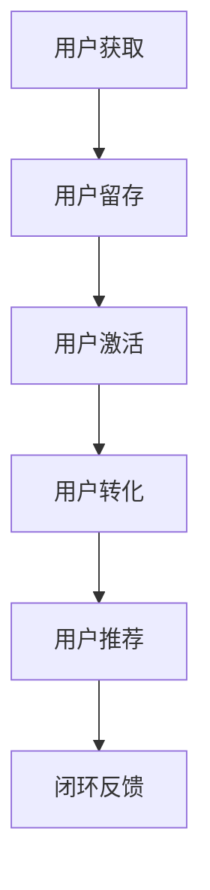
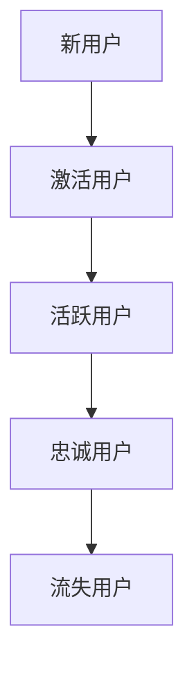
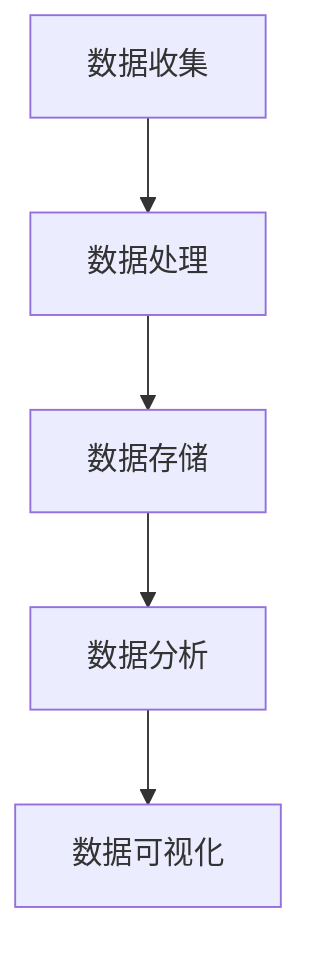

                 

关键词：市场拓展、创业策略、增长黑客、用户留存、产品迭代、数据分析、营销传播、创业方法论

> 在当今激烈竞争的市场环境中，创业者面临着前所未有的挑战和机遇。如何有效地进行市场拓展，成为决定创业成功与否的关键因素。本文将深入探讨市场拓展的核心概念、策略和方法，以期为创业者提供实用的指导。

## 1. 背景介绍

### 创业环境的变化

近年来，全球创业环境发生了显著变化。一方面，互联网技术的迅猛发展，特别是移动互联网和社交媒体的普及，为创业者提供了前所未有的市场机遇。另一方面，市场竞争日益激烈，用户需求多样化，创业者需要更加精准和高效地拓展市场，以满足客户需求。

### 市场拓展的重要性

市场拓展不仅是创业初期的重要任务，也是企业长期发展的基石。有效的市场拓展能够帮助创业者：

- 扩大用户群体
- 增加收入来源
- 提高品牌知名度
- 保持竞争优势

### 市场拓展的挑战

尽管市场拓展的重要性不言而喻，但创业者仍然面临诸多挑战：

- 市场竞争激烈
- 资源有限
- 用户需求多变
- 市场环境变化快

## 2. 核心概念与联系

### 增长黑客（Growth Hacking）

**Mermaid 流程图**：



### 用户生命周期

**Mermaid 流程图**：



### 数据分析

**Mermaid 流程图**：



## 3. 核心算法原理 & 具体操作步骤

### 3.1 算法原理概述

市场拓展的核心算法是基于数据分析的，包括用户获取、用户留存、用户激活、用户转化和用户推荐等步骤。

### 3.2 算法步骤详解

1. **用户获取**：通过SEO、SEM、社交媒体广告等方式获取潜在用户。
2. **用户激活**：通过引导用户完成首次操作，如注册、下载、试用等，激活用户。
3. **用户留存**：通过提供优质的内容和服务，保持用户的活跃度，防止用户流失。
4. **用户转化**：通过营销策略，如促销活动、会员制度等，促使用户完成购买或其他价值转化。
5. **用户推荐**：通过口碑营销，鼓励用户推荐新用户，形成良性循环。

### 3.3 算法优缺点

**优点**：

- 高效：通过算法和数据，快速发现市场机会。
- 精准：针对不同用户群体，提供个性化服务。

**缺点**：

- 需要大量数据支持。
- 算法优化需要不断迭代。

### 3.4 算法应用领域

市场拓展算法广泛应用于电子商务、在线教育、金融科技等多个领域。

## 4. 数学模型和公式 & 详细讲解 & 举例说明

### 4.1 数学模型构建

市场拓展的数学模型主要包括用户留存率（Loyalty）、用户转化率（Conversion Rate）和用户获取成本（Customer Acquisition Cost，简称CAC）。

$$
\text{用户留存率} = \frac{\text{持续使用用户数}}{\text{总用户数}} \times 100\%
$$

$$
\text{用户转化率} = \frac{\text{完成转化的用户数}}{\总用户数}} \times 100\%
$$

$$
\text{用户获取成本} = \frac{\text{市场推广费用}}{\text{新增用户数}}
$$

### 4.2 公式推导过程

用户留存率和用户转化率的公式推导基于概率论中的二项分布，而用户获取成本则基于成本效益分析。

### 4.3 案例分析与讲解

假设一家电商公司进行了1000元的市场推广，成功吸引了100个新用户。其中，有60个用户在7天内进行了重复购买，20个用户在30天内进行了购买。那么：

- 用户留存率 = 60/100 × 100% = 60%
- 用户转化率 = 20/100 × 100% = 20%
- 用户获取成本 = 1000元/100个用户 = 10元/用户

通过以上数据，公司可以评估市场推广的效果，并根据实际情况调整策略。

## 5. 项目实践：代码实例和详细解释说明

### 5.1 开发环境搭建

- 操作系统：Windows/Linux/MacOS
- 编程语言：Python
- 数据库：MySQL
- 数据分析工具：Pandas、NumPy、Matplotlib

### 5.2 源代码详细实现

以下是一个简单的Python代码示例，用于计算用户留存率和用户转化率。

```python
import pandas as pd

# 假设有一个用户行为数据表，包含用户ID、行为类型、行为时间等信息
data = pd.DataFrame({
    'UserID': [1, 1, 1, 2, 2, 3, 3, 3],
    'Action': ['Register', 'Login', 'Purchase', 'Register', 'Login', 'Register', 'Login', 'Purchase'],
    'Time': ['2023-01-01', '2023-01-02', '2023-01-03', '2023-01-04', '2023-01-05', '2023-01-06', '2023-01-07', '2023-01-08']
})

# 计算用户留存率和用户转化率
def calculate_metrics(data):
    # 用户留存率
    unique_users = data['UserID'].nunique()
    retained_users = (data[data['Action'] == 'Login'].groupby('UserID')['Time'].nunique() >= 2).sum()
    loyalty = (retained_users / unique_users) * 100
    
    # 用户转化率
    converted_users = (data[data['Action'] == 'Purchase'].groupby('UserID')['Time'].nunique() >= 1).sum()
    conversion_rate = (converted_users / unique_users) * 100
    
    return loyalty, conversion_rate

loyalty, conversion_rate = calculate_metrics(data)
print(f"User Loyalty: {loyalty}%")
print(f"User Conversion Rate: {conversion_rate}%")
```

### 5.3 代码解读与分析

- **数据准备**：首先，我们需要一个包含用户行为的数据表，这里我们使用Python的Pandas库来处理数据。
- **计算留存率**：通过统计用户登录次数，我们可以计算用户留存率。
- **计算转化率**：通过统计用户购买次数，我们可以计算用户转化率。

### 5.4 运行结果展示

运行上述代码后，我们得到了用户的留存率和转化率。这些指标可以帮助我们评估当前市场拓展策略的有效性。

## 6. 实际应用场景

### 6.1 电子商务

电子商务公司可以通过市场拓展算法，优化广告投放策略，提高用户留存率和转化率。

### 6.2 在线教育

在线教育平台可以利用市场拓展算法，识别潜在用户，提高课程完成率和用户满意度。

### 6.3 金融科技

金融科技公司可以通过市场拓展算法，精准定位目标用户，提高用户注册率和激活率。

## 6.4 未来应用展望

随着人工智能和大数据技术的不断发展，市场拓展算法将变得更加智能和精准。未来，创业者可以借助更先进的技术，实现更高效的市场拓展。

### 7. 工具和资源推荐

#### 7.1 学习资源推荐

- 《精益创业》（The Lean Startup）
- 《增长黑客：如何利用数据驱动创业成功》（Growth Hacker Marketing）

#### 7.2 开发工具推荐

- Google Analytics
- Mixpanel
- Segment

#### 7.3 相关论文推荐

- "Growth Hacking: Marketing in the Engine Room"
- "Data-Driven Growth: The Ultimate Guide to Leveraging Data for Business Growth"

## 8. 总结：未来发展趋势与挑战

### 8.1 研究成果总结

市场拓展算法在电商、教育、金融等领域取得了显著成果，提高了用户留存率和转化率。

### 8.2 未来发展趋势

随着人工智能和大数据技术的发展，市场拓展算法将变得更加智能和精准。

### 8.3 面临的挑战

市场环境变化快，需要不断调整和优化算法。

### 8.4 研究展望

未来，市场拓展算法将更加注重用户个性化体验，实现更高效的市场拓展。

## 9. 附录：常见问题与解答

**Q1**：如何提高用户留存率？

**A1**：通过提供优质内容和服务，提高用户满意度。

**Q2**：如何降低用户获取成本？

**A2**：通过优化广告投放策略，提高广告效果。

**Q3**：如何评估市场拓展效果？

**A3**：通过分析用户留存率和转化率等关键指标。

---

作者：禅与计算机程序设计艺术 / Zen and the Art of Computer Programming
----------------------------------------------------------------

### 文章摘要

本文深入探讨了市场拓展的核心概念、策略和方法，结合数学模型和实际案例，为创业者提供了实用的指导。通过数据分析，市场拓展算法能够高效地提升用户留存率和转化率，帮助企业实现可持续发展。未来，随着人工智能和大数据技术的发展，市场拓展算法将变得更加智能和精准，为创业者带来更多机遇。作者通过总结研究成果和展望未来趋势，为创业者提供了宝贵的思考和建议。

