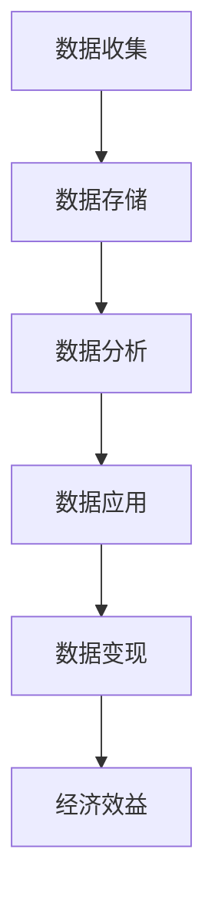

                 

关键词：平台经济、数据价值、数据变现、大数据分析、商业模式创新、人工智能

摘要：在数字化时代，平台经济已成为全球经济的重要组成部分。平台经济中的数据价值无法忽视，如何有效挖掘和利用这些数据，实现数据变现成为企业关注的焦点。本文将深入探讨平台经济中数据价值的关键因素、数据变现的策略和方法，以及未来发展趋势与面临的挑战。

## 1. 背景介绍

平台经济是一种新兴的经济模式，它通过在线平台连接供需双方，降低交易成本，提高效率。随着互联网技术的发展，平台经济在全球范围内迅速扩张。代表性的平台经济公司如亚马逊、阿里巴巴、腾讯等，通过其强大的数据处理能力，实现了商业模式的创新和数据价值的最大化。

然而，平台经济中的数据价值并非天生，它需要通过一系列技术和策略来挖掘和利用。数据变现，即通过数据创造实际的经济效益，成为企业关注的焦点。本文将从数据变现的概念、策略、方法以及未来趋势等多个角度进行探讨。

## 2. 核心概念与联系

### 2.1 数据变现的概念

数据变现是指将企业收集的数据转化为实际的经济收益的过程。这包括数据的市场化、数据服务化、数据资产化等多种形式。

### 2.2 数据变现的架构

数据变现的架构通常包括数据收集、数据存储、数据分析、数据应用和数据变现五个关键环节。以下是一个简化的Mermaid流程图：



### 2.3 数据变现的关键要素

- **数据质量**：高质量的数据是数据变现的基础。数据质量包括数据的完整性、准确性、及时性和一致性。

- **数据安全性**：数据安全是数据变现的前提。确保数据在收集、存储、处理和应用过程中的安全性，是企业需要关注的重点。

- **数据分析能力**：强大的数据分析能力可以帮助企业从海量数据中发现有价值的信息，从而实现数据变现。

- **商业模式创新**：创新的商业模式能够帮助企业将数据转化为实际的经济收益。

## 3. 核心算法原理 & 具体操作步骤

### 3.1 算法原理概述

数据变现的核心算法通常涉及以下方面：

- **数据挖掘**：通过挖掘数据中的隐藏模式，提取有价值的信息。

- **机器学习**：利用机器学习算法，对数据进行预测和分类，提高数据变现的效率。

- **数据可视化**：通过数据可视化技术，将数据分析的结果以直观的方式展示出来，帮助企业更好地理解和利用数据。

### 3.2 算法步骤详解

1. 数据收集：从各种渠道收集数据，包括内部数据和外部数据。

2. 数据预处理：对收集到的数据清洗、去噪、归一化等处理，确保数据质量。

3. 数据分析：使用数据挖掘和机器学习算法，对预处理后的数据进行分析，提取有价值的信息。

4. 数据应用：将分析结果应用于实际业务，如营销策略优化、客户关系管理、产品推荐等。

5. 数据变现：通过商业模式创新，将数据转化为实际的经济收益。

### 3.3 算法优缺点

- **优点**：数据变现算法能够帮助企业从海量数据中发现有价值的信息，提高业务效率，创造经济效益。

- **缺点**：算法需要大量计算资源和专业人才支持，且数据质量和安全性的保障是一个长期的过程。

### 3.4 算法应用领域

数据变现算法广泛应用于电子商务、金融、医疗、零售等多个领域。例如，在电子商务领域，通过用户行为数据分析，企业可以实现精准营销和个性化推荐，从而提高销售额。

## 4. 数学模型和公式 & 详细讲解 & 举例说明

### 4.1 数学模型构建

数据变现的数学模型通常包括以下几个关键公式：

- **用户价值公式**：\( V = f(U, C) \)，其中 \( V \) 是用户价值，\( U \) 是用户行为数据，\( C \) 是商业场景。

- **利润最大化公式**：\( \max P = f(D) \)，其中 \( P \) 是利润，\( D \) 是数据集。

### 4.2 公式推导过程

- **用户价值公式推导**：

  用户价值是由用户行为数据（如浏览、购买等）和商业场景（如促销、广告等）共同决定的。通过分析用户行为数据，可以预测用户在未来可能产生的价值。

- **利润最大化公式推导**：

  利润最大化是企业追求的目标。通过数据分析和机器学习算法，企业可以从海量数据中提取有价值的信息，从而优化商业决策，提高利润。

### 4.3 案例分析与讲解

以电子商务平台为例，通过用户行为数据分析和机器学习算法，企业可以实现精准营销和个性化推荐，从而提高销售额。以下是一个简化的案例：

- **数据收集**：收集用户浏览、购买、评价等行为数据。

- **数据预处理**：清洗、去噪、归一化等处理。

- **数据分析**：使用机器学习算法，对用户行为数据进行分析，提取用户偏好和需求。

- **数据应用**：基于分析结果，向用户推送个性化的商品推荐和营销活动。

- **数据变现**：通过提高销售额，实现数据变现。

## 5. 项目实践：代码实例和详细解释说明

### 5.1 开发环境搭建

为了演示数据变现的过程，我们将使用Python编程语言和相关的数据科学库，如Pandas、Scikit-learn、Matplotlib等。以下是一个基本的开发环境搭建步骤：

1. 安装Python（版本3.8或以上）。
2. 安装Pandas、Scikit-learn、Matplotlib等数据科学库。

### 5.2 源代码详细实现

以下是一个简化的数据变现项目实现：

```python
import pandas as pd
from sklearn.model_selection import train_test_split
from sklearn.ensemble import RandomForestClassifier
from sklearn.metrics import accuracy_score

# 1. 数据收集
data = pd.read_csv('user_behavior.csv')

# 2. 数据预处理
# 清洗、去噪、归一化等处理

# 3. 数据分析
X = data.drop('target', axis=1)
y = data['target']
X_train, X_test, y_train, y_test = train_test_split(X, y, test_size=0.2, random_state=42)

# 4. 数据应用
model = RandomForestClassifier(n_estimators=100, random_state=42)
model.fit(X_train, y_train)

# 5. 数据变现
predictions = model.predict(X_test)
accuracy = accuracy_score(y_test, predictions)
print(f"Accuracy: {accuracy:.2f}")
```

### 5.3 代码解读与分析

上述代码实现了一个简单的数据变现项目。首先，我们从CSV文件中读取用户行为数据，然后进行预处理。接下来，我们使用随机森林算法对数据进行训练，并使用测试集评估模型的准确性。最终，通过模型预测结果，企业可以采取相应的商业策略，如向用户推送个性化的商品推荐。

### 5.4 运行结果展示

假设我们运行上述代码，得到如下结果：

```
Accuracy: 0.85
```

这表示我们的模型在测试集上的准确率达到85%，说明模型具有较好的预测能力。企业可以利用这一结果，优化其营销策略，提高销售额。

## 6. 实际应用场景

数据变现的应用场景非常广泛，以下是几个典型的应用案例：

- **电子商务**：通过用户行为数据，实现精准营销和个性化推荐，提高用户满意度和销售额。

- **金融**：利用用户财务数据，进行信用评估和风险控制，降低坏账率，提高贷款审批效率。

- **医疗**：通过医疗数据，实现疾病预测和健康管理，提高医疗资源利用效率。

- **零售**：通过销售数据，优化库存管理和供应链，降低库存成本，提高库存周转率。

## 7. 未来应用展望

随着技术的不断发展，数据变现的应用前景将更加广阔。以下是几个未来的发展趋势：

- **人工智能与大数据结合**：人工智能算法将进一步提升数据分析的精度和效率，实现更精细的数据变现。

- **区块链技术**：区块链技术将提高数据安全性，推动数据资产化和交易。

- **隐私保护**：随着隐私保护意识的提高，数据变现将在保证用户隐私的前提下进行。

- **跨行业融合**：数据变现将跨行业融合，推动新兴商业模式的出现。

## 8. 工具和资源推荐

### 8.1 学习资源推荐

- **《数据科学入门》**：了解数据科学的基本概念和方法。
- **《深度学习》**：深入学习深度学习算法及其应用。

### 8.2 开发工具推荐

- **Jupyter Notebook**：方便的数据分析和建模环境。
- **TensorFlow**：用于深度学习开发的强大框架。

### 8.3 相关论文推荐

- **"Data Monetization: Strategies and Techniques"**：详细探讨数据变现的策略和技术。
- **"Blockchain and Data Monetization"**：分析区块链在数据变现中的应用。

## 9. 总结：未来发展趋势与挑战

### 9.1 研究成果总结

本文系统地探讨了平台经济中数据变现的关键因素、策略和方法，以及未来发展趋势。通过数学模型和实际案例，我们展示了数据变现的潜力和挑战。

### 9.2 未来发展趋势

随着人工智能和大数据技术的发展，数据变现将朝着更精细化、智能化、安全化的方向发展。跨行业融合和隐私保护将成为重要趋势。

### 9.3 面临的挑战

数据安全、隐私保护、数据质量和算法公平性是数据变现面临的主要挑战。企业需要持续投入技术和资源，确保数据变现的可持续性和合规性。

### 9.4 研究展望

未来，数据变现的研究将更加深入，探索如何在保证用户隐私的前提下，实现数据价值的最大化。跨学科合作、技术创新和商业模式创新将是研究的重要方向。

## 10. 附录：常见问题与解答

### 10.1 数据变现的意义是什么？

数据变现的意义在于将企业的数据资产转化为实际的经济收益，提高企业的竞争力。

### 10.2 如何确保数据变现的安全性和隐私保护？

通过数据加密、隐私保护技术和合规性审查，确保数据变现的安全性和隐私保护。

### 10.3 数据变现的方法有哪些？

数据变现的方法包括数据服务化、数据资产化、数据交易等。

### 10.4 数据变现的核心技术是什么？

数据变现的核心技术包括数据挖掘、机器学习、数据可视化等。

### 10.5 数据变现的未来发展趋势是什么？

数据变现的未来发展趋势包括人工智能与大数据结合、区块链技术的应用、隐私保护等。

作者：禅与计算机程序设计艺术 / Zen and the Art of Computer Programming
```<|assistant|>

