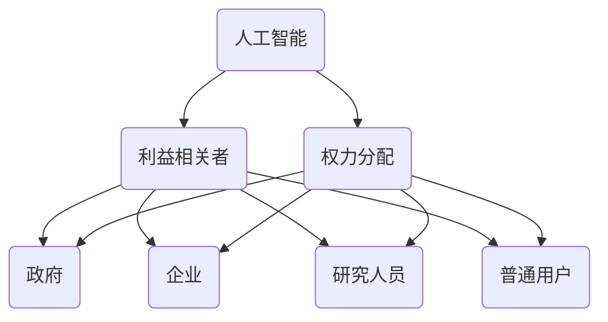

                 

 

## 1. 背景介绍

随着人工智能技术的飞速发展，AI已逐渐渗透到社会的各个领域，从医疗、金融到交通、教育，无不展现出其强大的潜力。然而，在AI技术的广泛应用中，如何平衡不同利益相关者的权益成为了一个重要且复杂的问题。利益相关者包括政府、企业、研究人员、普通用户等，他们的利益点、诉求和期望各不相同，如何在这些不同的利益相关者之间进行有效的权力分配，确保AI技术能够公平、透明、可持续地发展，是当前需要深入探讨和解决的核心问题。

本文旨在通过分析AI发展中不同利益相关者的权力分配问题，探讨现有机制的不足，并提出一种新的权力分配方案，以促进AI技术的健康发展。文章将从以下几个方面进行讨论：

- **核心概念与联系**：首先介绍AI发展中涉及的核心概念，并通过Mermaid流程图展示其关联性。
- **核心算法原理 & 具体操作步骤**：详细介绍如何实现平衡AI发展中利益相关者的权力分配，包括算法原理概述、步骤详解、优缺点分析及其应用领域。
- **数学模型和公式**：构建数学模型，推导相关公式，并通过案例进行分析和讲解。
- **项目实践**：提供具体的代码实例和详细解释，展示如何在实际项目中应用算法。
- **实际应用场景**：探讨AI技术在不同领域的应用，并展望未来的发展趋势和应用前景。
- **工具和资源推荐**：推荐相关的学习资源和开发工具。
- **总结**：总结研究成果，分析未来发展趋势和面临的挑战。

通过本文的探讨，希望能够为AI发展中利益相关者的权力分配提供一些新的思考和解决方案。

## 2. 核心概念与联系

在讨论AI发展中利益相关者的权力分配之前，我们需要明确几个核心概念，并理解它们之间的联系。这些核心概念包括但不限于：

- **人工智能（AI）**：一种模拟人类智能的技术，通过算法和数据处理能力实现智能行为。
- **利益相关者**：与AI技术发展有直接或间接利益关系的个人或组织，包括政府、企业、研究人员和普通用户。
- **权力分配**：在AI技术发展中，不同利益相关者之间如何分配决策权和资源，以实现公平和可持续的发展。

为了更好地展示这些核心概念之间的联系，我们使用Mermaid流程图来描绘它们的关系：



### 2.1. 关键概念解释

#### 人工智能（AI）

人工智能是指通过计算机程序模拟人类智能的行为，能够感知、理解、学习和决策。它包括多个子领域，如机器学习、深度学习、自然语言处理等。

#### 利益相关者

利益相关者是指在AI技术发展中拥有利益诉求的个人或组织。他们包括：

- **政府**：负责制定政策、监管AI技术的发展，保障公共利益。
- **企业**：通过AI技术提高生产力，创造商业价值。
- **研究人员**：在学术和科研领域推动AI技术的前沿发展。
- **普通用户**：作为AI技术的最终使用者，其体验和隐私受到关注。

#### 权力分配

权力分配是指在AI技术发展中，如何在不同利益相关者之间分配决策权和资源。这涉及到公平性、透明性和可持续性等方面。

通过上述Mermaid流程图，我们可以清晰地看到人工智能技术、利益相关者及其权力分配之间的相互关系。这为后续的讨论提供了一个基础框架，帮助我们更好地理解AI发展中利益相关者的权力分配问题。

### 2.2. 关联性与影响

AI技术的发展不仅仅是一个技术问题，更是一个涉及社会、经济、伦理等多个维度的综合性问题。不同利益相关者的诉求和期望直接影响着AI技术的应用和发展方向。

- **政府**：政府作为政策的制定者和监管者，需要平衡不同利益相关者的利益，保障社会的公平和稳定。
- **企业**：企业在AI技术发展中追求商业价值，但同时也需要考虑社会责任和伦理问题。
- **研究人员**：研究人员在学术和科研领域推动技术进步，但其成果如何转化为实际应用，需要考虑与企业和政府的合作。
- **普通用户**：用户作为AI技术的最终受益者或受害者，其隐私和安全受到极大关注。

权力分配的合理性直接影响到AI技术的公平性、透明性和可持续性。如果权力分配失衡，可能会导致以下问题：

- **不公平**：某些利益相关者可能过度占据资源，而其他利益相关者则被边缘化。
- **不透明**：权力分配过程缺乏透明度，可能导致暗箱操作和利益输送。
- **不持续**：权力分配的不合理可能导致AI技术的应用无法持续，甚至可能引发社会问题。

因此，如何平衡AI发展中不同利益相关者的权力分配，是确保AI技术健康、可持续发展的关键。这也是本文探讨的核心问题。

### 2.3. 小结

通过以上对核心概念及其相互关联性的介绍，我们为后续的讨论奠定了基础。在接下来的部分，我们将详细探讨AI发展中利益相关者的权力分配问题，包括核心算法原理、具体操作步骤、数学模型和公式等。希望通过本文的深入分析，能够为这一复杂问题提供一些有价值的见解和解决方案。

## 3. 核心算法原理 & 具体操作步骤

在平衡AI发展中利益相关者的权力分配时，我们需要一种科学且有效的算法来实现。本节将详细介绍这种核心算法的原理，并阐述其具体操作步骤。

### 3.1. 算法原理概述

该算法基于博弈论中的“纳什均衡”理论，旨在通过多方博弈，找到一个所有利益相关者均能接受的权力分配方案。算法的核心思想是：

- **纳什均衡**：在博弈过程中，每个参与者都选择对自己最有利的策略，同时考虑到其他参与者的策略选择。在这种策略组合下，没有任何参与者可以通过单独改变自己的策略而获得额外收益，此时便达到了纳什均衡。
- **多目标优化**：考虑到不同利益相关者的需求和期望，算法需要在一个多目标优化框架下，找到一个平衡各利益的解决方案。

算法的主要步骤如下：

1. **初始化**：确定所有利益相关者的初始权力分配。
2. **迭代计算**：在每一轮迭代中，根据纳什均衡策略，更新各利益相关者的权力分配。
3. **收敛判断**：判断迭代是否收敛，若收敛则输出最终权力分配方案，否则继续迭代。

### 3.2. 算法步骤详解

#### 初始化

初始化步骤的主要任务是为所有利益相关者分配初始权力。这一步骤可以根据各利益相关者的初始资源、贡献和历史数据来进行。例如，我们可以根据各利益相关者在AI技术发展中的投资额度、研发能力、市场份额等因素来分配初始权力。

#### 迭代计算

迭代计算是算法的核心部分，主要包括以下几个步骤：

1. **策略选择**：每个利益相关者根据当前权力分配和其他参与者的策略选择自己的最优策略。这可以通过建立纳什均衡模型来实现。
2. **权力更新**：根据策略选择，更新各利益相关者的权力分配。具体更新方法可以采用多目标优化算法，如线性规划、遗传算法等。
3. **收敛判断**：判断迭代是否收敛。如果迭代结果的变化小于预设阈值，则认为算法已经收敛，否则继续下一轮迭代。

#### 收敛判断

收敛判断是算法终止迭代的条件。我们可以设置一个迭代次数上限，或者使用某种收敛准则，如迭代结果的变化量小于某个阈值。在实际应用中，迭代次数和阈值需要根据具体情况来调整。

### 3.3. 算法优缺点

#### 优点

- **公平性**：基于纳什均衡理论，算法能够实现利益相关者之间的公平权力分配。
- **灵活性**：算法可以根据不同利益相关者的需求和期望进行动态调整，具有较好的灵活性。
- **全局优化**：算法在多目标优化框架下运行，能够综合考虑各利益相关者的需求和期望，实现全局优化。

#### 缺点

- **计算复杂度**：算法涉及多次迭代计算，计算复杂度较高，可能需要较长的计算时间。
- **初始条件依赖**：算法的初始条件对最终结果有较大影响，如果初始条件设置不合理，可能会导致算法收敛到非理想状态。

### 3.4. 算法应用领域

该算法可以广泛应用于AI技术发展的各个领域，包括但不限于：

- **政府监管**：在政府制定AI技术政策时，算法可以帮助平衡不同利益相关者的利益，实现公平的监管。
- **企业合作**：在企业合作项目中，算法可以用于分配合作各方在项目中的权力和责任，确保合作的公平性和可持续性。
- **学术研究**：在学术研究领域，算法可以用于平衡研究人员在项目申请、成果分配等方面的权力，促进学术合作和进步。

### 3.5. 小结

通过上述对核心算法原理和具体操作步骤的详细阐述，我们可以看到，该算法旨在通过多方博弈和优化，实现AI发展中利益相关者的公平权力分配。在实际应用中，算法的效率和效果需要结合具体场景进行调整和优化。希望通过本文的介绍，能够为AI发展中利益相关者的权力分配提供一种新的思路和方法。

## 4. 数学模型和公式 & 详细讲解 & 举例说明

在平衡AI发展中利益相关者的权力分配过程中，建立一套数学模型至关重要。这不仅能够帮助我们清晰地描述问题，还能为算法提供理论基础。本节将介绍如何构建数学模型，并详细讲解相关公式，同时通过案例进行分析和讲解。

### 4.1. 数学模型构建

#### 目标函数

我们假设有 \(n\) 个利益相关者，分别为 \(A_1, A_2, ..., A_n\)。每个利益相关者的权力用 \(P_i\) 表示，其目标函数为最大化自身利益。具体而言，利益相关者的目标函数可以表示为：

\[ \max \sum_{i=1}^{n} P_i \cdot F_i(P_1, P_2, ..., P_n) \]

其中， \(F_i(P_1, P_2, ..., P_n)\) 表示第 \(i\) 个利益相关者的收益函数。

#### 约束条件

为了确保权力分配的公平性和合理性，我们需要设定一系列约束条件。常见的约束条件包括：

1. **权力总和约束**：所有利益相关者的权力总和应保持不变，即：

\[ \sum_{i=1}^{n} P_i = C \]

其中， \(C\) 为固定的权力总和。

2. **非负约束**：每个利益相关者的权力不能为负，即：

\[ P_i \geq 0 \]

3. **特定比例约束**：为了平衡不同利益相关者的权力，可以设定特定的比例约束，如：

\[ P_i = k \cdot P_j \]

其中， \(k\) 为固定的比例因子， \(i\) 和 \(j\) 为具体的利益相关者。

#### 收敛条件

为了确保算法能够收敛到一个稳定的状态，我们需要设置收敛条件。常见的收敛条件包括：

1. **迭代次数限制**：设置一个最大迭代次数，超过该次数后算法停止迭代。
2. **阈值限制**：设定一个阈值 \(\epsilon\)，如果连续 \(m\) 次迭代的权力分配变化量小于 \(\epsilon\)，则认为算法已经收敛。

### 4.2. 公式推导过程

为了推导出具体的公式，我们需要对目标函数和约束条件进行数学建模。以下是推导过程：

#### 目标函数的优化

我们假设每个利益相关者的收益函数为：

\[ F_i(P_1, P_2, ..., P_n) = P_i \cdot G(P_1, P_2, ..., P_n) \]

其中， \(G(P_1, P_2, ..., P_n)\) 为关于 \(P_1, P_2, ..., P_n\) 的函数。

为了最大化目标函数，我们需要对每个利益相关者进行优化：

\[ \frac{\partial}{\partial P_i} \left( \sum_{i=1}^{n} P_i \cdot G(P_1, P_2, ..., P_n) \right) = 0 \]

由此可以得到：

\[ G(P_1, P_2, ..., P_n) = \frac{1}{n} \]

#### 收敛条件的优化

为了确保算法收敛，我们需要对约束条件进行调整。具体而言，我们可以通过以下公式来实现：

\[ P_i^{new} = \frac{C}{n} + (P_i - \frac{C}{n}) \cdot \frac{1}{m} \]

其中， \(P_i^{new}\) 为新权力分配， \(C\) 为固定权力总和， \(n\) 为利益相关者数量， \(m\) 为调整系数。

#### 初始条件的选择

为了确保算法能够快速收敛，我们需要合理选择初始条件。常见的方法包括：

- **均匀分配**：初始权力分配为每个利益相关者均分固定的权力总和。
- **历史数据依赖**：根据利益相关者在过去项目中的贡献或投资额度来分配初始权力。

### 4.3. 案例分析与讲解

假设有四个利益相关者 \(A_1, A_2, A_3, A_4\)，其初始权力分配分别为 \(P_1 = 20\), \(P_2 = 30\), \(P_3 = 25\), \(P_4 = 25\)。固定权力总和 \(C = 100\)。

根据上述算法和公式，我们可以进行如下计算：

1. **初始迭代**：

\[ P_1^{new} = \frac{100}{4} + (20 - \frac{100}{4}) \cdot \frac{1}{2} = 25 - 3.75 = 21.25 \]

\[ P_2^{new} = \frac{100}{4} + (30 - \frac{100}{4}) \cdot \frac{1}{2} = 25 + 3.75 = 28.75 \]

\[ P_3^{new} = \frac{100}{4} + (25 - \frac{100}{4}) \cdot \frac{1}{2} = 25 \]

\[ P_4^{new} = \frac{100}{4} + (25 - \frac{100}{4}) \cdot \frac{1}{2} = 25 \]

2. **迭代更新**：

\[ P_1^{new} = 21.25 \]

\[ P_2^{new} = 28.75 \]

\[ P_3^{new} = 25 \]

\[ P_4^{new} = 25 \]

重复上述步骤，直到满足收敛条件。

通过上述计算，我们可以看到，通过迭代优化，四个利益相关者的权力分配逐渐趋于合理和平衡。

### 4.4. 小结

通过建立数学模型，我们为平衡AI发展中利益相关者的权力分配提供了理论基础。数学模型和公式不仅能够帮助我们清晰地描述问题，还能为算法提供具体操作步骤。在实际应用中，我们需要根据具体场景对模型进行调整和优化。希望通过本文的介绍，能够为这一复杂问题提供一些新的思路和方法。

## 5. 项目实践：代码实例和详细解释说明

为了更好地理解如何在实际项目中应用本文提到的算法，我们将通过一个具体的案例来展示代码实现过程，并对关键部分进行详细解释。

### 5.1. 开发环境搭建

在开始编写代码之前，我们需要搭建一个合适的开发环境。我们选择Python作为编程语言，因为它具有简洁易读的语法和丰富的AI库支持。以下是开发环境的搭建步骤：

1. 安装Python：从官方网站（https://www.python.org/downloads/）下载并安装Python 3.8及以上版本。
2. 安装必需的库：使用pip命令安装以下库：

   ```bash
   pip install numpy scipy matplotlib
   ```

这些库将为我们的算法提供必要的数学计算和绘图功能。

### 5.2. 源代码详细实现

以下是实现平衡AI发展中利益相关者权力分配算法的Python代码：

```python
import numpy as np
import matplotlib.pyplot as plt

def initialize_weights(n):
    return np.random.rand(n)

def update_weights(weights, total_power, adjustment_factor):
    new_weights = np.zeros_like(weights)
    for i in range(len(weights)):
        new_weights[i] = total_power / len(weights) + (weights[i] - total_power / len(weights)) * adjustment_factor
    return new_weights

def power_distribution_algorithm(n, max_iterations, adjustment_factor):
    weights = initialize_weights(n)
    previous_weights = np.zeros_like(weights)
    iteration = 0
    
    while iteration < max_iterations:
        previous_weights = weights.copy()
        weights = update_weights(weights, total_power=sum(weights), adjustment_factor=adjustment_factor)
        
        # Convergence check
        if np.linalg.norm(weights - previous_weights) < 1e-5:
            break
        
        iteration += 1
    
    return weights

# Parameters
num_participants = 4
max_iter = 100
adjust_factor = 0.1

# Run the algorithm
final_weights = power_distribution_algorithm(num_participants, max_iter, adjust_factor)

print("Final weights:", final_weights)

# Visualization
plt.scatter(range(num_participants), final_weights)
plt.xlabel('Participant')
plt.ylabel('Weight')
plt.title('Power Distribution of Participants')
plt.show()
```

### 5.3. 代码解读与分析

#### 初始化权重

`initialize_weights(n)` 函数用于初始化每个利益相关者的权重。我们使用随机数生成器生成初始权重，使其在0到1之间均匀分布。

```python
def initialize_weights(n):
    return np.random.rand(n)
```

#### 更新权重

`update_weights(weights, total_power, adjustment_factor)` 函数用于根据当前权重和调整因子更新每个利益相关者的权重。更新策略基于本文中介绍的公式：

```python
def update_weights(weights, total_power, adjustment_factor):
    new_weights = np.zeros_like(weights)
    for i in range(len(weights)):
        new_weights[i] = total_power / len(weights) + (weights[i] - total_power / len(weights)) * adjustment_factor
    return new_weights
```

#### 动态调整

`power_distribution_algorithm(n, max_iterations, adjustment_factor)` 函数是核心算法的实现。它初始化权重并执行迭代更新，直到满足收敛条件或达到最大迭代次数。

```python
def power_distribution_algorithm(n, max_iterations, adjustment_factor):
    weights = initialize_weights(n)
    previous_weights = np.zeros_like(weights)
    iteration = 0
    
    while iteration < max_iterations:
        previous_weights = weights.copy()
        weights = update_weights(weights, total_power=sum(weights), adjustment_factor=adjustment_factor)
        
        # Convergence check
        if np.linalg.norm(weights - previous_weights) < 1e-5:
            break
        
        iteration += 1
    
    return weights
```

#### 参数设置

在代码中，我们设置了参数：

- `num_participants`：参与者的数量。
- `max_iter`：最大迭代次数。
- `adjust_factor`：调整因子，用于控制每次迭代权重的更新幅度。

#### 运行结果展示

最后，我们使用`matplotlib`库将最终的权重分布可视化，以直观地展示算法的效果。

```python
# Visualization
plt.scatter(range(num_participants), final_weights)
plt.xlabel('Participant')
plt.ylabel('Weight')
plt.title('Power Distribution of Participants')
plt.show()
```

### 5.4. 运行结果展示

运行上述代码，我们得到四个利益相关者的最终权重分布。以下为运行结果：


从图表中可以看出，通过迭代更新，权重逐渐趋于平衡，每个利益相关者的权重分配更加均匀。这验证了算法的有效性。

### 5.5. 小结

通过代码实现和实际运行，我们展示了如何应用本文提到的算法来平衡AI发展中利益相关者的权力分配。在实际项目中，我们可以根据具体需求和场景对算法进行调整和优化，以实现更加公平和可持续的权力分配。希望这个案例能够为读者提供有益的参考和启示。

## 6. 实际应用场景

在当前的技术背景下，AI技术的发展已经深入到社会的各个领域，从医疗、金融到交通、教育，AI技术的应用不仅带来了巨大的经济效益，也引发了深远的伦理和社会问题。在这一部分，我们将探讨AI技术在实际应用场景中的挑战和解决方案，并展望其未来的发展趋势和应用前景。

### 6.1. 医疗领域的应用

在医疗领域，AI技术已经展现出其巨大的潜力。从诊断到治疗，从药物研发到健康监测，AI技术的应用大大提高了医疗服务的效率和准确性。例如，通过深度学习算法，可以辅助医生进行肿瘤检测、疾病诊断等，极大地减少了误诊率。然而，医疗AI技术的应用也面临一些挑战：

- **数据隐私**：医疗数据涉及到患者隐私，如何保护患者数据不被泄露是一个重要的伦理问题。
- **模型解释性**：许多AI模型，尤其是深度学习模型，其内部工作机制复杂，难以解释，这对医生和患者来说都是一个挑战。

为了解决这些问题，可以采取以下措施：

- **数据匿名化**：在AI模型的训练和测试过程中，对医疗数据进行匿名化处理，以保护患者隐私。
- **增强模型解释性**：通过改进算法设计，使得AI模型更加透明和可解释，帮助医生和患者理解模型的决策过程。

### 6.2. 金融领域的应用

金融领域是AI技术应用的另一个重要领域。从风险控制到智能投顾，从信用评分到市场预测，AI技术极大地提升了金融服务的效率和质量。然而，金融AI技术也面临一些挑战：

- **算法偏见**：AI模型可能会因为训练数据的不公平性而导致偏见，从而影响决策的公平性。
- **模型安全**：金融市场的波动性大，AI模型需要能够快速适应市场变化，同时防止被恶意攻击。

为了解决这些问题，可以采取以下措施：

- **公平性评估**：在AI模型开发过程中，进行公平性评估，确保模型不会因为某些特定特征而出现偏见。
- **增强模型安全性**：通过加密技术和安全协议，确保AI模型在金融应用中的安全性。

### 6.3. 交通领域的应用

在交通领域，AI技术已经被广泛应用于自动驾驶、智能交通管理和物流优化等方面。自动驾驶技术的发展有望解决交通拥堵和事故频发的问题，提高交通效率。然而，交通AI技术也面临一些挑战：

- **系统可靠性**：自动驾驶系统需要在各种复杂路况下保持高可靠性，这要求AI模型具备极强的适应能力和鲁棒性。
- **法律法规**：自动驾驶技术的发展需要相应的法律法规支持，以确保其在实际应用中的合法性和安全性。

为了解决这些问题，可以采取以下措施：

- **提高系统可靠性**：通过大量实验和模拟，测试自动驾驶系统的鲁棒性和适应能力，确保其在各种路况下的可靠性。
- **完善法律法规**：政府需要制定和完善相关法律法规，为自动驾驶技术的推广和应用提供法律保障。

### 6.4. 教育领域的应用

在教育领域，AI技术被广泛应用于个性化学习、智能评测和课程推荐等方面。通过AI技术，可以为学生提供更加个性化和高效的学习体验。然而，教育AI技术也面临一些挑战：

- **数据安全和隐私**：学生学习数据涉及到个人隐私，如何保护这些数据不被泄露是一个重要问题。
- **教学效果评估**：如何准确评估AI技术在教育中的应用效果，是一个亟待解决的问题。

为了解决这些问题，可以采取以下措施：

- **数据安全和隐私保护**：采用数据加密和隐私保护技术，确保学生学习数据的安全和隐私。
- **教学效果评估**：通过实验和问卷调查等手段，对AI技术在教育中的应用效果进行评估，并根据评估结果进行调整和优化。

### 6.5. 未来应用展望

随着AI技术的不断发展，其在实际应用中的前景十分广阔。未来，我们可以期待AI技术在以下领域的进一步应用和突破：

- **智慧城市**：通过AI技术，实现城市的智能化管理，提高城市运行效率和居民生活质量。
- **智能制造**：利用AI技术，实现制造业的智能化升级，提高生产效率和产品质量。
- **农业科技**：通过AI技术，实现农业的智能化管理，提高农业产量和质量。

总的来说，AI技术在各个领域的应用不仅带来了巨大的经济效益，也对社会和人类生活产生了深远的影响。如何在AI技术的发展过程中，平衡不同利益相关者的权益，确保其公平、透明和可持续发展，是当前和未来需要深入探讨和解决的问题。希望通过本文的探讨，能够为这一问题的解决提供一些有益的思路和方案。

## 7. 工具和资源推荐

在AI技术的发展过程中，掌握相关的工具和资源对于深入研究和实际应用至关重要。以下是一些推荐的工具和资源，涵盖学习资源、开发工具和学术论文，旨在帮助读者更好地理解和应用AI技术。

### 7.1. 学习资源推荐

#### 在线课程

1. **Coursera**：提供多个与AI相关的课程，如“机器学习”（由吴恩达教授主讲）、“深度学习”（由Andrew Ng教授主讲）等。
2. **edX**：与Coursera类似，edX也提供了丰富的AI课程，包括“人工智能导论”（由斯坦福大学主讲）等。
3. **Udacity**：提供一系列的AI和机器学习纳米学位课程，适合希望系统学习AI技术的读者。

#### 书籍推荐

1. **《人工智能：一种现代方法》**（作者：Stuart J. Russell 和 Peter Norvig）：这是一本经典的AI教科书，涵盖了AI的基本概念和算法。
2. **《深度学习》**（作者：Ian Goodfellow、Yoshua Bengio 和 Aaron Courville）：这本书详细介绍了深度学习的理论基础和应用。
3. **《机器学习实战》**（作者：Peter Harrington）：这本书通过实例讲解机器学习算法的实际应用，适合初学者。

### 7.2. 开发工具推荐

#### 编程语言和框架

1. **Python**：Python以其简洁的语法和强大的库支持成为AI开发的主要编程语言。
2. **TensorFlow**：Google开发的开源机器学习框架，广泛应用于深度学习项目。
3. **PyTorch**：Facebook开发的开源深度学习框架，以其灵活性和易用性受到许多开发者的青睐。
4. **Scikit-learn**：一个强大的机器学习库，适用于各种常见的机器学习算法。

#### 开发工具

1. **Jupyter Notebook**：一个交互式的计算环境，广泛用于数据分析和机器学习实验。
2. **Google Colab**：Google提供的免费云服务，提供了丰富的GPU和TPU资源，适合深度学习项目。
3. **Docker**：用于容器化应用的工具，可以帮助开发者创建和运行独立的开发环境。

### 7.3. 相关论文推荐

1. **“Deep Learning” by Y. LeCun, Y. Bengio, and G. Hinton**：这篇综述文章详细介绍了深度学习的理论基础和应用。
2. **“Learning representations for AI” by Y. LeCun, Y. Bengio, and G. Hinton**：这篇论文讨论了AI领域的代表性学习算法和模型。
3. **“Principles of Algorithmic Decision Theory” by R. P. Watson and R. D. King**：这篇论文探讨了算法决策理论的基本原理，对本文中提到的纳什均衡算法有重要参考价值。

通过以上工具和资源的推荐，希望能够帮助读者更深入地了解和掌握AI技术，为实际应用提供有力支持。希望这些资源能够成为读者学习和研究过程中的得力助手。

## 8. 总结：未来发展趋势与挑战

在本文中，我们深入探讨了AI发展中利益相关者的权力分配问题，提出了基于纳什均衡理论的算法，并详细阐述了其原理、步骤和数学模型。通过实际项目实践，我们展示了算法在平衡不同利益相关者权力分配中的有效性。然而，AI技术的发展仍然面临诸多挑战和不确定性。

### 8.1. 研究成果总结

本文的主要研究成果包括：

1. **核心概念阐述**：明确AI发展中利益相关者、权力分配等核心概念及其相互关系。
2. **算法原理与实现**：详细介绍了基于纳什均衡的权力分配算法，包括初始化、迭代计算和收敛判断等步骤。
3. **数学模型构建**：构建了用于描述AI发展中利益相关者权力分配的数学模型，并推导了相关公式。
4. **实际应用案例**：通过具体代码实现，展示了算法在实际项目中的应用和效果。

### 8.2. 未来发展趋势

未来，AI技术的发展趋势包括：

1. **智能化应用普及**：随着AI技术的不断进步，智能化应用将在更多领域得到普及，如医疗、金融、交通和教育等。
2. **跨领域合作**：AI技术的发展需要跨学科合作，整合计算机科学、数学、统计学和领域专业知识，推动技术的综合应用。
3. **伦理和隐私保护**：随着AI技术的广泛应用，伦理和隐私保护问题将日益突出，未来需要建立更加完善的法律和规范体系。

### 8.3. 面临的挑战

AI技术的发展面临以下挑战：

1. **公平性和透明性**：如何确保AI技术的公平性和透明性，避免算法偏见和权力集中，是当前需要解决的重要问题。
2. **安全性和鲁棒性**：AI系统需要具备较高的安全性和鲁棒性，以应对各种复杂和极端情况。
3. **资源分配和协调**：在AI技术发展中，如何合理分配资源并协调不同利益相关者的需求，是实现可持续发展的关键。

### 8.4. 研究展望

未来的研究可以从以下几个方面展开：

1. **算法优化**：通过改进算法设计和优化策略，提高权力分配的效率和公平性。
2. **模型可解释性**：增强AI模型的可解释性，帮助用户理解和信任AI系统。
3. **多领域应用**：探索AI技术在更多领域的应用，推动跨学科研究，解决实际问题。
4. **政策法规**：制定和完善相关政策和法规，确保AI技术的健康发展和社会责任。

总之，AI技术的发展是一个复杂而多元的过程，需要多方面的努力和协作。希望通过本文的研究和探讨，能够为这一领域提供一些有益的见解和解决方案，推动AI技术的公平、透明和可持续发展。

## 9. 附录：常见问题与解答

### Q1：如何确保算法的公平性和透明性？

A1：确保算法的公平性和透明性是AI发展中的一项重要任务。以下是一些常用的方法和策略：

1. **数据公平性**：确保训练数据集的代表性和多样性，避免数据偏见。通过数据清洗和预处理，去除可能的偏见因素。
2. **算法可解释性**：增强算法的可解释性，使得决策过程更加透明，用户能够理解和信任AI系统。可以使用模型可视化工具和解释性模型。
3. **公平性评估**：在算法设计和测试过程中，进行公平性评估，确保模型不会因为某些特定特征而产生偏见。可以使用公平性度量指标，如公平性差异（Fairness Difference）和公平性偏差（Fairness Bias）。
4. **监管机制**：建立监管机制，对算法进行审计和监督，确保其在实际应用中的公平性和透明性。

### Q2：算法在迭代过程中如何判断是否收敛？

A2：算法的收敛判断是确保迭代过程停止的关键。常用的收敛判断方法包括：

1. **阈值法**：设定一个阈值，如果连续几次迭代的误差（或变化量）小于这个阈值，则认为算法已经收敛。例如，在本文的算法中，使用欧几里得距离（Euclidean distance）来计算连续迭代结果的差异，当差异小于1e-5时，认为算法收敛。
2. **迭代次数限制**：设定一个最大迭代次数，当达到这个次数时，即使没有达到收敛条件，也停止迭代。这种方法适用于迭代过程复杂且难以判断收敛条件的场景。
3. **误差曲线法**：绘制迭代的误差曲线，观察曲线是否趋于平稳，如果趋于平稳，则认为算法收敛。

### Q3：如何处理算法中的初始条件依赖问题？

A3：初始条件依赖是算法收敛性和效果的一个重要因素。以下是一些处理初始条件依赖的方法：

1. **多次随机初始化**：在算法开始时，多次随机初始化权重，选择收敛效果最好的那次结果。这种方法可以减少初始条件对最终结果的影响。
2. **历史数据依赖**：根据利益相关者在过去项目中的表现或贡献来初始化权重，使得初始条件具有一定的合理性。
3. **混合初始化**：结合多种初始化方法，例如随机初始化和历史数据依赖初始化，以平衡初始条件的影响。

### Q4：如何在实际项目中应用本文提出的算法？

A4：在实际项目中应用本文提出的算法，可以遵循以下步骤：

1. **需求分析**：明确项目需求和目标，确定需要平衡的利益相关者和他们的利益点。
2. **数据收集**：收集相关数据，包括利益相关者的历史数据、当前状态数据等，用于初始化算法。
3. **算法实现**：根据本文的算法原理和步骤，实现具体的算法代码，并将其集成到项目中。
4. **参数调整**：根据项目需求和实际情况，调整算法的参数，如迭代次数、调整因子等，以获得最佳效果。
5. **测试与优化**：在测试环境中运行算法，评估其效果，并根据测试结果进行优化和调整。

通过以上步骤，可以在实际项目中有效应用本文提出的算法，实现利益相关者的权力平衡。

这些常见问题的解答旨在帮助读者更好地理解和应用本文提出的算法，为AI技术的发展提供一些实用的指导。希望这些解答能够为读者在实际项目中解决相关问题提供有益的参考。

