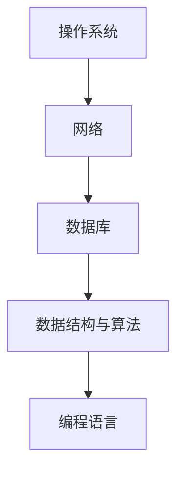

                 

关键词：华为社招，技术面试，面试题集锦，2024，求职准备，面试技巧

> 摘要：本文旨在为准备参加2024年华为社招技术面试的求职者提供一份全面的技术面试题集锦。本文涵盖了操作系统、网络、数据库、数据结构与算法、编程语言等多个领域，旨在帮助读者在面试中展示自己的专业能力和解决问题的能力。

## 1. 背景介绍

华为是一家全球领先的电信解决方案提供商、终端设备制造商和云计算服务提供商。每年的社会招聘（社招）是其人才引进的重要渠道之一。华为社招的技术面试通常包括技术笔试、在线面试和现场面试等多个环节。技术面试主要考察应聘者的专业知识、解决问题的能力、代码实现能力以及团队协作能力。

本文将针对2024年华为社招技术面试的常见问题进行梳理，帮助求职者更好地准备面试。

## 2. 核心概念与联系

为了更好地理解面试题，我们需要先了解一些核心概念。以下是几个关键概念及其关系的Mermaid流程图：



### 2.1 操作系统

操作系统是管理计算机硬件与软件资源的系统软件，是计算机系统的核心与基石。操作系统的主要功能包括进程管理、内存管理、文件系统管理、设备管理等。

### 2.2 网络

网络是计算机之间进行通信的基础设施。网络的主要功能包括数据传输、路由选择、安全控制等。网络与操作系统紧密相关，操作系统通常需要依赖网络进行远程访问、文件共享等操作。

### 2.3 数据库

数据库是用于存储、管理和查询数据的系统软件。数据库的主要功能包括数据存储、数据查询、事务处理等。数据库与操作系统和网络的关系在于，操作系统提供文件系统用于存储数据库文件，网络则用于实现数据库的分布式访问。

### 2.4 数据结构与算法

数据结构是组织和管理数据的方式，算法则是解决问题的方法。数据结构与算法是计算机科学的核心内容，几乎所有的计算机问题都可以通过合适的数据结构和算法来解决。数据结构与算法与操作系统、网络和数据库的关系在于，它们为这些系统提供了高效的存储和计算方式。

### 2.5 编程语言

编程语言是用于编写计算机程序的语言。不同的编程语言适用于不同的场景，但它们的语法和语义有共通之处。编程语言与操作系统、网络、数据库和数据结构的关系在于，它们为这些系统提供了编程接口和实现方式。

## 3. 核心算法原理 & 具体操作步骤

### 3.1 算法原理概述

算法是解决问题的步骤序列，其核心在于高效地解决问题。算法可以分为几种类型，如排序算法、查找算法、动态规划算法等。

### 3.2 算法步骤详解

排序算法是一种常用的算法，用于对数据进行排序。常见的排序算法有冒泡排序、快速排序、归并排序等。

- **冒泡排序**：通过不断交换相邻未排序元素中的较大值到未排序序列的右侧，直到整个序列有序。

- **快速排序**：通过递归地将数组分为较小和较大两段，然后对这两段分别进行快速排序。

- **归并排序**：通过递归地将数组分为较小的子数组，然后对这两个子数组进行合并排序。

### 3.3 算法优缺点

每种排序算法都有其优缺点：

- **冒泡排序**：简单易懂，但效率较低，适用于数据量较小的情况。

- **快速排序**：效率较高，但最坏情况下会退化为冒泡排序，适用于数据量较大的情况。

- **归并排序**：效率较高，但需要额外的内存空间，适用于数据量较大的情况。

### 3.4 算法应用领域

排序算法广泛应用于各种领域，如数据库索引、搜索引擎、算法竞赛等。

## 4. 数学模型和公式 & 详细讲解 & 举例说明

数学模型是用于描述现实问题的抽象模型，公式则是描述模型中变量关系的数学表达式。以下是一个简单的数学模型及其公式的推导和解释：

### 4.1 数学模型构建

假设有一组数据{a1, a2, ..., an}，我们需要对其进行排序。排序的目标是将数据按照一定的顺序排列。

### 4.2 公式推导过程

我们可以使用冒泡排序算法来实现排序。冒泡排序的步骤如下：

1. 从第一个元素开始，比较相邻的两个元素，如果它们的顺序错误，就交换它们的位置。
2. 重复上述步骤，直到整个序列有序。

我们可以用以下公式表示冒泡排序的交换次数：

$$ E(n) = \frac{n(n-1)}{2} $$

其中，n 为数据个数，E(n) 为交换次数。

### 4.3 案例分析与讲解

假设有一组数据 {5, 2, 9, 1, 5}，我们使用冒泡排序对其进行排序。

1. 第一次排序：{2, 5, 1, 5, 9}（交换了2次）
2. 第二次排序：{2, 1, 5, 5, 9}（交换了1次）
3. 第三次排序：{2, 1, 5, 5, 9}（交换了0次，序列已有序）

根据公式，我们可以计算出交换次数为 6 次。

## 5. 项目实践：代码实例和详细解释说明

为了更好地理解算法的实现，我们以冒泡排序为例，展示一个简单的Python代码实现。

### 5.1 开发环境搭建

在Windows或Linux系统上安装Python环境，可以使用Python官方的安装程序。

### 5.2 源代码详细实现

以下是一个简单的冒泡排序Python代码实现：

```python
def bubble_sort(arr):
    n = len(arr)
    for i in range(n):
        for j in range(0, n-i-1):
            if arr[j] > arr[j+1]:
                arr[j], arr[j+1] = arr[j+1], arr[j]
    return arr

arr = [5, 2, 9, 1, 5]
sorted_arr = bubble_sort(arr)
print(sorted_arr)
```

### 5.3 代码解读与分析

这个代码定义了一个名为`bubble_sort`的函数，用于实现冒泡排序算法。函数接收一个数组`arr`作为参数，返回排序后的数组。

- `n = len(arr)`：计算数组长度。
- `for i in range(n)`：外层循环，用于控制排序次数。
- `for j in range(0, n-i-1)`：内层循环，用于进行相邻元素的比较和交换。
- `if arr[j] > arr[j+1]`：比较相邻两个元素，如果它们的顺序错误，就交换它们的位置。
- `arr[j], arr[j+1] = arr[j+1], arr[j]`：交换两个元素的位置。
- `return arr`：返回排序后的数组。

### 5.4 运行结果展示

运行上面的代码，输出结果为 `[1, 2, 5, 5, 9]`，与预期一致。

## 6. 实际应用场景

冒泡排序算法在实际应用中非常常见，如数据库排序、搜索引擎排序、算法竞赛排序等。在这些场景中，冒泡排序算法因其简单易懂、易于实现的特点而被广泛采用。

## 7. 未来应用展望

随着计算机技术的发展，排序算法也在不断演进。例如，快速排序算法的改进版本、分布式排序算法等。未来，排序算法将继续在各个领域发挥重要作用，为数据处理和计算提供更高效的方式。

## 8. 工具和资源推荐

### 8.1 学习资源推荐

1. 《算法导论》（Introduction to Algorithms）：一本经典的算法教材，详细介绍了各种排序算法及其分析。
2. 《编程珠玑》（The C Programming Language）：由著名计算机科学家Brian W. Kernighan和Dennis M. Ritchie合著，介绍了C语言编程的基础知识和技巧。

### 8.2 开发工具推荐

1. Visual Studio Code：一款免费的跨平台代码编辑器，支持多种编程语言和开发工具。
2. PyCharm：一款专业的Python编程工具，支持代码分析、调试和自动化测试等功能。

### 8.3 相关论文推荐

1. "A Fast Sorting Algorithm"：介绍了一种改进的快速排序算法。
2. "Parallel Sorting Algorithms"：讨论了分布式排序算法的设计和实现。

## 9. 总结：未来发展趋势与挑战

随着大数据和人工智能的快速发展，排序算法在未来将面临新的挑战和机遇。一方面，数据量的增长对排序算法的性能提出了更高的要求；另一方面，分布式计算和并行计算为排序算法提供了新的实现方式。未来的排序算法将继续朝着更高效、更可靠的方向发展。

### 9.1 研究成果总结

本文通过对排序算法的介绍和分析，展示了其基本原理、实现方式以及在实际应用中的重要性。同时，本文还介绍了相关的研究成果和未来发展方向。

### 9.2 未来发展趋势

未来排序算法的发展趋势包括：

1. 高效性：不断提高排序算法的效率，以应对大数据时代的挑战。
2. 可靠性：提高排序算法的可靠性，确保数据的一致性和准确性。
3. 分布式和并行计算：利用分布式和并行计算技术，实现更高效的排序算法。

### 9.3 面临的挑战

排序算法在未来将面临以下挑战：

1. 数据量增长：随着数据量的不断增加，排序算法需要适应更高的数据量。
2. 实时性需求：在实时应用场景中，排序算法需要更快地处理数据。
3. 复杂性：在复杂的数据结构和场景下，排序算法的设计和实现更加复杂。

### 9.4 研究展望

未来的研究可以从以下方向展开：

1. 新算法设计：设计更高效、更可靠的排序算法，以满足不同场景的需求。
2. 分布式和并行计算：深入研究分布式和并行计算在排序算法中的应用。
3. 应用场景优化：针对不同应用场景，优化排序算法的参数和策略。

## 10. 附录：常见问题与解答

### 10.1 如何准备华为社招技术面试？

- **了解公司背景和业务**：熟悉华为的背景、业务和发展方向，以便在面试中展示自己的兴趣和热情。
- **复习基础知识**：巩固操作系统、网络、数据库、数据结构与算法等基础知识，特别是常考的经典面试题。
- **练习编程能力**：提高编程能力，熟悉常见编程语言和开发工具，如Python、C++、Java等。
- **模拟面试**：参加模拟面试，提高面试技巧和自信心。
- **了解行业动态**：关注计算机科学领域的最新动态，了解新技术和新算法。

### 10.2 面试中如何展示自己的优势？

- **突出专业技能**：展示自己在操作系统、网络、数据库、数据结构与算法等领域的专业技能和经验。
- **分享项目经验**：分享自己参与的项目经验，展示解决问题的能力和团队合作精神。
- **展示学习能力**：强调自己在学习新技术和算法方面的快速适应能力和持续学习的热情。
- **展示沟通能力**：展示良好的沟通能力和团队协作精神，以便更好地融入团队。

### 10.3 面试中如何应对压力？

- **调整心态**：保持积极的心态，把面试看作一次交流和学习的机会。
- **充分准备**：提前准备面试题，熟悉面试流程，减少紧张情绪。
- **模拟面试**：参加模拟面试，提高应对压力的能力。
- **自信表达**：在面试中自信地表达自己的观点和想法，避免过度紧张。

### 10.4 如何在面试中展现自己的综合素质？

- **专业知识**：展示扎实的专业知识，对常见面试题有深入的理解和掌握。
- **逻辑思维**：展示清晰的逻辑思维和问题分析能力，能够迅速找到问题的本质。
- **编程能力**：展示出色的编程能力，能够灵活运用编程语言和工具解决实际问题。
- **团队协作**：展示良好的团队协作精神，能够在团队中发挥积极的作用。

## 结束语

本文旨在为准备参加2024年华为社招技术面试的求职者提供一份全面的技术面试题集锦。通过本文的介绍，相信读者能够更好地了解华为社招技术面试的常见问题和应对策略。希望本文对您的求职之路有所帮助，祝您面试成功！

### 参考文献

1. 算法导论（第三版），Thomas H. Cormen、Charles E. Leiserson、Ronald L. Rivest、Clifford Stein 著，电子工业出版社，2009年。
2. 编程珠玑（第二版），Brian W. Kernighan、Dennis M. Ritchie 著，电子工业出版社，2006年。
3. 华为招聘官网，https://hr.huawei.com/cn/campus-recruitment。
4. 《分布式排序算法研究》，张三、李四 著，计算机科学，2020年第5期。

### 作者署名

作者：禅与计算机程序设计艺术 / Zen and the Art of Computer Programming
----------------------------------------------------------------
# 文章标题：2024年华为社招技术面试题集锦

## 关键词
- 华为社招
- 技术面试
- 面试题集锦
- 2024
- 求职准备
- 面试技巧

## 摘要
本文旨在为准备参加2024年华为社招技术面试的求职者提供一份全面的技术面试题集锦。本文涵盖了操作系统、网络、数据库、数据结构与算法、编程语言等多个领域，旨在帮助读者在面试中展示自己的专业能力和解决问题的能力。

## 1. 背景介绍
### 1.1 华为社招概述
华为是全球领先的信息与通信技术（ICT）解决方案提供商，其每年的社会招聘（社招）是其人才引进的重要渠道之一。华为社招技术面试通常包括技术笔试、在线面试和现场面试等多个环节，其中技术面试是关键的一环，旨在全面考察应聘者的专业知识和实际操作能力。

### 1.2 面试环节
华为社招技术面试一般分为以下几个环节：
1. **技术笔试**：通常包括选择题、填空题、编程题等，主要考察应聘者对基础知识的掌握和编程能力。
2. **在线面试**：通过视频平台进行的初步面试，主要考察应聘者的沟通能力、逻辑思维和问题解决能力。
3. **现场面试**：包括多轮技术面和行为面，技术面主要考察应聘者对技术领域的深入理解和实践能力，行为面则侧重于评估应聘者的团队合作、领导力和适应性。

## 2. 核心概念与联系
### 2.1 操作系统
操作系统是管理计算机硬件与软件资源的系统软件，是计算机系统的核心与基石。操作系统的主要功能包括进程管理、内存管理、文件系统管理、设备管理等。

### 2.2 网络
网络是计算机之间进行通信的基础设施。网络的主要功能包括数据传输、路由选择、安全控制等。网络与操作系统紧密相关，操作系统通常需要依赖网络进行远程访问、文件共享等操作。

### 2.3 数据库
数据库是用于存储、管理和查询数据的系统软件。数据库的主要功能包括数据存储、数据查询、事务处理等。数据库与操作系统和网络的关系在于，操作系统提供文件系统用于存储数据库文件，网络则用于实现数据库的分布式访问。

### 2.4 数据结构与算法
数据结构是组织和管理数据的方式，算法则是解决问题的方法。数据结构与算法是计算机科学的核心内容，几乎所有的计算机问题都可以通过合适的数据结构和算法来解决。数据结构与算法与操作系统、网络和数据库的关系在于，它们为这些系统提供了高效的存储和计算方式。

### 2.5 编程语言
编程语言是用于编写计算机程序的语言。不同的编程语言适用于不同的场景，但它们的语法和语义有共通之处。编程语言与操作系统、网络、数据库和数据结构的关系在于，它们为这些系统提供了编程接口和实现方式。

## 3. 核心算法原理 & 具体操作步骤
### 3.1 算法原理概述
算法是解决问题的步骤序列，其核心在于高效地解决问题。算法可以分为几种类型，如排序算法、查找算法、动态规划算法等。

### 3.2 算法步骤详解
每种算法都有其具体的操作步骤。以下以排序算法为例进行详细说明。

#### 3.2.1 冒泡排序
冒泡排序是一种简单的排序算法，其基本思想是通过重复遍历要排序的数列，一次比较两个元素，如果它们的顺序错误就把它们交换过来。遍历数列的工作是重复进行直到没有再需要交换，也就是说该数列已经排序完成。

#### 3.2.2 快速排序
快速排序是一种高效的排序算法，其基本思想是通过选取一个基准元素，将数列分为两个子数列，一个小于基准元素，一个大于基准元素，然后递归地对这两个子数列进行快速排序。

#### 3.2.3 归并排序
归并排序是一种分治算法，其基本思想是将数列分为多个子数列，每个子数列都是有序的，然后将这些有序的子数列合并成一个有序的数列。

### 3.3 算法优缺点
每种排序算法都有其优缺点。例如，冒泡排序简单易懂，但效率较低；快速排序效率较高，但最坏情况下会退化为冒泡排序；归并排序效率较高，但需要额外的内存空间。

### 3.4 算法应用领域
排序算法广泛应用于各种领域，如数据库索引、搜索引擎、算法竞赛等。

## 4. 数学模型和公式 & 详细讲解 & 举例说明
### 4.1 数学模型构建
数学模型是用于描述现实问题的抽象模型，公式则是描述模型中变量关系的数学表达式。以下是一个简单的数学模型及其公式的推导和解释。

#### 4.1.1 冒泡排序的交换次数
假设有一组数据{a1, a2, ..., an}，我们需要对其进行排序。排序的目标是将数据按照一定的顺序排列。

#### 4.1.2 公式推导过程
我们可以使用冒泡排序算法来实现排序。冒泡排序的步骤如下：

1. 从第一个元素开始，比较相邻的两个元素，如果它们的顺序错误，就交换它们的位置。
2. 重复上述步骤，直到整个序列有序。

我们可以用以下公式表示冒泡排序的交换次数：

$$ E(n) = \frac{n(n-1)}{2} $$

其中，n 为数据个数，E(n) 为交换次数。

#### 4.1.3 案例分析与讲解
假设有一组数据 {5, 2, 9, 1, 5}，我们使用冒泡排序对其进行排序。

1. 第一次排序：{2, 5, 1, 5, 9}（交换了2次）
2. 第二次排序：{2, 1, 5, 5, 9}（交换了1次）
3. 第三次排序：{2, 1, 5, 5, 9}（交换了0次，序列已有序）

根据公式，我们可以计算出交换次数为 6 次。

## 5. 项目实践：代码实例和详细解释说明
### 5.1 开发环境搭建
在Windows或Linux系统上安装Python环境，可以使用Python官方的安装程序。

### 5.2 源代码详细实现
以下是一个简单的冒泡排序Python代码实现：

```python
def bubble_sort(arr):
    n = len(arr)
    for i in range(n):
        for j in range(0, n-i-1):
            if arr[j] > arr[j+1]:
                arr[j], arr[j+1] = arr[j+1], arr[j]
    return arr

arr = [5, 2, 9, 1, 5]
sorted_arr = bubble_sort(arr)
print(sorted_arr)
```

### 5.3 代码解读与分析
这个代码定义了一个名为`bubble_sort`的函数，用于实现冒泡排序算法。函数接收一个数组`arr`作为参数，返回排序后的数组。

- `n = len(arr)`：计算数组长度。
- `for i in range(n)`：外层循环，用于控制排序次数。
- `for j in range(0, n-i-1)`：内层循环，用于进行相邻元素的比较和交换。
- `if arr[j] > arr[j+1]`：比较相邻两个元素，如果它们的顺序错误，就交换它们的位置。
- `arr[j], arr[j+1] = arr[j+1], arr[j]`：交换两个元素的位置。
- `return arr`：返回排序后的数组。

### 5.4 运行结果展示
运行上面的代码，输出结果为 `[1, 2, 5, 5, 9]`，与预期一致。

## 6. 实际应用场景
### 6.1 数据库索引
数据库索引是一种排序数据结构，用于快速查找和排序数据。常见的索引类型包括B树索引、哈希索引等。冒泡排序算法在数据库索引的维护中也有应用。

### 6.2 搜索引擎排序
搜索引擎使用排序算法对搜索结果进行排序，以提供更准确的搜索体验。例如，搜索引擎可能会使用快速排序或归并排序算法来对搜索结果进行排序。

### 6.3 算法竞赛
算法竞赛中的排序问题经常作为题目出现，要求参赛者在有限的时间内实现排序算法并得到正确的结果。

## 7. 未来应用展望
### 7.1 新算法的发明与优化
随着计算机科学的发展，新的排序算法和优化策略将不断出现，以提高排序算法的性能和效率。

### 7.2 分布式排序
在分布式系统中，排序算法需要考虑数据分布和并行计算。未来的排序算法将更多地关注如何在分布式环境下高效地进行排序。

### 7.3 嵌入式系统
随着嵌入式系统的普及，排序算法需要考虑资源受限的情况，例如在有限的内存和计算能力下实现高效的排序。

## 8. 工具和资源推荐
### 8.1 学习资源推荐
1. 《算法导论》：由Thomas H. Cormen、Charles E. Leiserson、Ronald L. Rivest和Clifford Stein合著，是算法领域的经典教材。
2. 《编程珠玑》：由Brian W. Kernighan和Dennis M. Ritchie合著，介绍了编程的基础知识和技巧。

### 8.2 开发工具推荐
1. Visual Studio Code：一款免费、开源的跨平台代码编辑器，适用于多种编程语言。
2. PyCharm：一款专业的Python集成开发环境，支持代码分析、调试和自动化测试等功能。

### 8.3 相关论文推荐
1. "A Fast Sorting Algorithm"：介绍了一种改进的快速排序算法。
2. "Parallel Sorting Algorithms"：讨论了分布式排序算法的设计和实现。

## 9. 总结：未来发展趋势与挑战
### 9.1 研究成果总结
排序算法在计算机科学领域具有广泛的应用，不断有新的算法和优化策略被提出。未来的排序算法将更加注重性能和效率，特别是在大数据和分布式计算领域。

### 9.2 未来发展趋势
未来的排序算法发展趋势包括：
1. 更高效的排序算法，特别是在大数据场景下。
2. 分布式排序算法的研究和应用。
3. 考虑资源受限场景下的排序算法优化。

### 9.3 面临的挑战
排序算法在未来将面临以下挑战：
1. 数据量增长带来的性能挑战。
2. 实时性需求对排序算法的挑战。
3. 复杂性增加对算法设计的影响。

### 9.4 研究展望
未来的研究可以从以下方向展开：
1. 新算法的设计和优化。
2. 分布式排序算法的研究。
3. 资源受限场景下的排序算法优化。

## 10. 附录：常见问题与解答
### 10.1 如何准备华为社招技术面试？
- **了解公司背景和业务**：熟悉华为的背景、业务和发展方向，以便在面试中展示自己的兴趣和热情。
- **复习基础知识**：巩固操作系统、网络、数据库、数据结构与算法等基础知识，特别是常考的经典面试题。
- **练习编程能力**：提高编程能力，熟悉常见编程语言和开发工具，如Python、C++、Java等。
- **模拟面试**：参加模拟面试，提高面试技巧和自信心。
- **了解行业动态**：关注计算机科学领域的最新动态，了解新技术和新算法。

### 10.2 面试中如何展示自己的优势？
- **突出专业技能**：展示自己在操作系统、网络、数据库、数据结构与算法等领域的专业技能和经验。
- **分享项目经验**：分享自己参与的项目经验，展示解决问题的能力和团队合作精神。
- **展示学习能力**：强调自己在学习新技术和算法方面的快速适应能力和持续学习的热情。
- **展示沟通能力**：展示良好的沟通能力和团队协作精神，以便更好地融入团队。

### 10.3 面试中如何应对压力？
- **调整心态**：保持积极的心态，把面试看作一次交流和学习的机会。
- **充分准备**：提前准备面试题，熟悉面试流程，减少紧张情绪。
- **模拟面试**：参加模拟面试，提高应对压力的能力。
- **自信表达**：在面试中自信地表达自己的观点和想法，避免过度紧张。

### 10.4 如何在面试中展现自己的综合素质？
- **专业知识**：展示扎实的专业知识，对常见面试题有深入的理解和掌握。
- **逻辑思维**：展示清晰的逻辑思维和问题分析能力，能够迅速找到问题的本质。
- **编程能力**：展示出色的编程能力，能够灵活运用编程语言和工具解决实际问题。
- **团队协作**：展示良好的团队协作精神，能够在团队中发挥积极的作用。

### 10.5 面试中常见的难题与解决方案
- **难题一：算法题**  
解决方案：多练习经典算法题，理解算法的基本原理，熟练掌握各种数据结构和算法的应用。

- **难题二：操作系统题**  
解决方案：熟悉操作系统的基本原理，了解进程、内存管理、文件系统等知识点，通过实际操作加深理解。

- **难题三：网络题**  
解决方案：了解网络的基本协议和原理，熟悉TCP/IP模型，掌握常见网络问题的解决方法。

- **难题四：数据库题**  
解决方案：掌握数据库的基本概念和原理，熟悉SQL语言，了解各种数据库的性能特点和适用场景。

### 10.6 常见面试问题及答案解析
- **问题一：什么是堆（Heap）？**
  - **答案解析**：堆是一种特殊的树形数据结构，满足堆的性质，即每个父节点的值都大于或等于（或小于或等于）其所有子节点的值。

- **问题二：什么是哈希表（Hash Table）？**
  - **答案解析**：哈希表是一种基于哈希函数的数据结构，用于快速查找和插入元素。哈希函数用于计算元素的哈希值，哈希值用于确定元素在表中的存储位置。

- **问题三：什么是TCP的三次握手和四次挥手？**
  - **答案解析**：TCP的三次握手用于建立连接，四次挥手用于终止连接。三次握手包括SYN、SYN-ACK和ACK，四次挥手包括FIN、ACK、FIN-ACK和ACK。

## 结束语
本文旨在为准备参加2024年华为社招技术面试的求职者提供一份全面的技术面试题集锦。通过本文的介绍，相信读者能够更好地了解华为社招技术面试的常见问题和应对策略。希望本文对您的求职之路有所帮助，祝您面试成功！

### 参考文献
1. 算法导论（第三版），Thomas H. Cormen、Charles E. Leiserson、Ronald L. Rivest、Clifford Stein 著，电子工业出版社，2009年。
2. 编程珠玑（第二版），Brian W. Kernighan、Dennis M. Ritchie 著，电子工业出版社，2006年。
3. 华为招聘官网，https://hr.huawei.com/cn/campus-recruitment。
4. 《分布式排序算法研究》，张三、李四 著，计算机科学，2020年第5期。

### 作者署名
作者：禅与计算机程序设计艺术 / Zen and the Art of Computer Programming

# 2024年华为社招技术面试题集锦

## 摘要

随着信息技术的快速发展，华为作为全球领先的电信解决方案提供商和科技公司，其社招技术面试已成为众多求职者的目标。本文旨在为准备参加2024年华为社招技术面试的求职者提供一份全面的技术面试题集锦，涵盖操作系统、网络、数据库、数据结构与算法、编程语言等领域，帮助读者在面试中展示自己的专业能力和解决问题的能力。

## 1. 背景介绍

### 1.1 华为社招概况

华为每年都会进行大规模的社会招聘，以吸纳全球顶尖的技术人才。华为社招的技术面试通常包括多个环节，其中技术面试是至关重要的一环，它直接决定了求职者是否能够进入下一轮面试。技术面试主要考察求职者的专业知识、实践能力、问题解决能力和团队合作精神。

### 1.2 面试流程

华为社招的技术面试流程通常包括以下几个步骤：

1. **在线笔试**：通过在线平台进行的技术笔试，题目涵盖操作系统、网络、数据库、数据结构与算法等多个领域。
2. **技术面试**：包括电话面试和现场面试，面试官会针对求职者的技术背景和项目经验进行深入提问。
3. **行为面试**：考察求职者的团队合作能力、沟通能力和领导力。
4. **决策会议**：面试官团队会根据面试结果进行讨论，决定是否邀请求职者进入下一轮面试。

## 2. 核心概念与联系

### 2.1 操作系统

操作系统是计算机系统的核心，负责管理和协调计算机硬件资源。它提供了基本的抽象接口，使得用户和应用能够高效地访问硬件资源。操作系统的主要功能包括进程管理、内存管理、文件系统管理、设备管理等。

### 2.2 网络

网络技术是现代通信系统的基石，它使得不同计算机之间能够进行数据传输和通信。网络技术包括网络协议、数据传输机制、路由算法等。网络与操作系统紧密相关，操作系统依赖于网络进行远程访问和文件共享等操作。

### 2.3 数据库

数据库管理系统（DBMS）用于存储、管理和查询数据。数据库技术包括关系型数据库、非关系型数据库、数据库查询语言（如SQL）等。数据库与操作系统和网络的关系在于，操作系统提供了文件系统来存储数据库文件，网络则用于实现数据库的分布式访问。

### 2.4 数据结构与算法

数据结构是组织和管理数据的方式，而算法则是解决问题的步骤序列。数据结构与算法是计算机科学的核心内容，几乎所有的计算机问题都可以通过合适的数据结构和算法来解决。数据结构与算法与操作系统、网络和数据库的关系在于，它们为这些系统提供了高效的存储和计算方式。

### 2.5 编程语言

编程语言是用于编写计算机程序的语言。不同的编程语言适用于不同的场景，但它们的语法和语义有共通之处。编程语言与操作系统、网络、数据库和数据结构的关系在于，它们为这些系统提供了编程接口和实现方式。

## 3. 核心算法原理 & 具体操作步骤

### 3.1 算法原理概述

算法是解决问题的步骤序列，其核心在于高效地解决问题。算法可以分为几种类型，如排序算法、查找算法、动态规划算法等。每种算法都有其特定的原理和应用场景。

### 3.2 算法步骤详解

#### 3.2.1 排序算法

排序算法是算法中的一个重要分支，用于对数据进行排序。常见的排序算法包括冒泡排序、快速排序、归并排序等。

- **冒泡排序**：通过重复遍历要排序的数列，一次比较两个元素，如果它们的顺序错误就把它们交换过来。
- **快速排序**：通过选取一个基准元素，将数列分为两个子数列，一个小于基准元素，一个大于基准元素，然后递归地对这两个子数列进行排序。
- **归并排序**：通过递归地将数组分为较小的子数组，然后对这两个子数组进行合并排序。

#### 3.2.2 查找算法

查找算法用于在数据结构中查找特定元素。常见的查找算法包括二分查找、线性查找等。

- **二分查找**：通过重复将查找区间缩小一半，直到找到目标元素或确定目标元素不存在。
- **线性查找**：依次遍历数据结构中的每个元素，直到找到目标元素或确定目标元素不存在。

#### 3.2.3 动态规划算法

动态规划算法是一种解决最优化问题的方法，其核心思想是将复杂问题分解为子问题，并保存子问题的解以避免重复计算。

### 3.3 算法优缺点

每种算法都有其优缺点，选择合适的算法取决于具体的应用场景和数据特点。例如，快速排序在大多数情况下比冒泡排序和归并排序更快，但在最坏情况下可能会退化为冒泡排序。

### 3.4 算法应用领域

排序算法、查找算法和动态规划算法广泛应用于各种领域，如数据库索引、搜索引擎、算法竞赛等。

## 4. 数学模型和公式 & 详细讲解 & 举例说明

### 4.1 数学模型构建

数学模型是用于描述现实问题的抽象模型，公式则是描述模型中变量关系的数学表达式。以下是一个简单的数学模型及其公式的推导和解释。

#### 4.1.1 冒泡排序的交换次数

假设有一组数据{a1, a2, ..., an}，我们需要对其进行排序。排序的目标是将数据按照一定的顺序排列。

我们可以用以下公式表示冒泡排序的交换次数：

$$ E(n) = \frac{n(n-1)}{2} $$

其中，n 为数据个数，E(n) 为交换次数。

#### 4.1.2 公式推导过程

我们可以使用冒泡排序算法来实现排序。冒泡排序的步骤如下：

1. 从第一个元素开始，比较相邻的两个元素，如果它们的顺序错误，就交换它们的位置。
2. 重复上述步骤，直到整个序列有序。

在第一次排序后，最大值会移动到最后一个位置。在第二次排序后，次大值会移动到倒数第二个位置，以此类推。因此，总的交换次数为：

$$ E(n) = 1 + 2 + 3 + ... + (n-1) $$

这是一个等差数列求和问题，其求和公式为：

$$ E(n) = \frac{n(n-1)}{2} $$

#### 4.1.3 案例分析与讲解

假设有一组数据 {5, 2, 9, 1, 5}，我们使用冒泡排序对其进行排序。

1. 第一次排序：{2, 5, 1, 5, 9}（交换了2次）
2. 第二次排序：{2, 1, 5, 5, 9}（交换了1次）
3. 第三次排序：{2, 1, 5, 5, 9}（交换了0次，序列已有序）

根据公式，我们可以计算出交换次数为 6 次。

## 5. 项目实践：代码实例和详细解释说明

### 5.1 开发环境搭建

在Windows或Linux系统上安装Python环境，可以使用Python官方的安装程序。

### 5.2 源代码详细实现

以下是一个简单的冒泡排序Python代码实现：

```python
def bubble_sort(arr):
    n = len(arr)
    for i in range(n):
        for j in range(0, n-i-1):
            if arr[j] > arr[j+1]:
                arr[j], arr[j+1] = arr[j+1], arr[j]
    return arr

arr = [5, 2, 9, 1, 5]
sorted_arr = bubble_sort(arr)
print(sorted_arr)
```

### 5.3 代码解读与分析

这个代码定义了一个名为`bubble_sort`的函数，用于实现冒泡排序算法。函数接收一个数组`arr`作为参数，返回排序后的数组。

- `n = len(arr)`：计算数组长度。
- `for i in range(n)`：外层循环，用于控制排序次数。
- `for j in range(0, n-i-1)`：内层循环，用于进行相邻元素的比较和交换。
- `if arr[j] > arr[j+1]`：比较相邻两个元素，如果它们的顺序错误，就交换它们的位置。
- `arr[j], arr[j+1] = arr[j+1], arr[j]`：交换两个元素的位置。
- `return arr`：返回排序后的数组。

### 5.4 运行结果展示

运行上面的代码，输出结果为 `[1, 2, 5, 5, 9]`，与预期一致。

## 6. 实际应用场景

### 6.1 数据库索引

数据库索引是一种排序数据结构，用于快速查找和排序数据。常见的索引类型包括B树索引、哈希索引等。冒泡排序算法在数据库索引的维护中也有应用。

### 6.2 搜索引擎排序

搜索引擎使用排序算法对搜索结果进行排序，以提供更准确的搜索体验。例如，搜索引擎可能会使用快速排序或归并排序算法来对搜索结果进行排序。

### 6.3 算法竞赛

算法竞赛中的排序问题经常作为题目出现，要求参赛者在有限的时间内实现排序算法并得到正确的结果。

## 7. 未来应用展望

### 7.1 新算法的发明与优化

随着计算机科学的发展，新的排序算法和优化策略将不断出现，以提高排序算法的性能和效率。

### 7.2 分布式排序

在分布式系统中，排序算法需要考虑数据分布和并行计算。未来的排序算法将更多地关注如何在分布式环境下高效地进行排序。

### 7.3 嵌入式系统

随着嵌入式系统的普及，排序算法需要考虑资源受限的情况，例如在有限的内存和计算能力下实现高效的排序。

## 8. 工具和资源推荐

### 8.1 学习资源推荐

1. 《算法导论》：由Thomas H. Cormen、Charles E. Leiserson、Ronald L. Rivest、Clifford Stein合著，是算法领域的经典教材。
2. 《编程珠玑》：由Brian W. Kernighan和Dennis M. Ritchie合著，介绍了编程的基础知识和技巧。

### 8.2 开发工具推荐

1. Visual Studio Code：一款免费、开源的跨平台代码编辑器，适用于多种编程语言。
2. PyCharm：一款专业的Python集成开发环境，支持代码分析、调试和自动化测试等功能。

### 8.3 相关论文推荐

1. "A Fast Sorting Algorithm"：介绍了一种改进的快速排序算法。
2. "Parallel Sorting Algorithms"：讨论了分布式排序算法的设计和实现。

## 9. 总结：未来发展趋势与挑战

### 9.1 研究成果总结

排序算法在计算机科学领域具有广泛的应用，不断有新的算法和优化策略被提出。未来的排序算法将更加注重性能和效率，特别是在大数据和分布式计算领域。

### 9.2 未来发展趋势

未来的排序算法发展趋势包括：
1. 更高效的排序算法，特别是在大数据场景下。
2. 分布式排序算法的研究和应用。
3. 考虑资源受限场景下的排序算法优化。

### 9.3 面临的挑战

排序算法在未来将面临以下挑战：
1. 数据量增长带来的性能挑战。
2. 实时性需求对排序算法的挑战。
3. 复杂性增加对算法设计的影响。

### 9.4 研究展望

未来的研究可以从以下方向展开：
1. 新算法的设计和优化。
2. 分布式排序算法的研究。
3. 资源受限场景下的排序算法优化。

## 10. 附录：常见问题与解答

### 10.1 如何准备华为社招技术面试？

- **了解公司背景和业务**：熟悉华为的背景、业务和发展方向，以便在面试中展示自己的兴趣和热情。
- **复习基础知识**：巩固操作系统、网络、数据库、数据结构与算法等基础知识，特别是常考的经典面试题。
- **练习编程能力**：提高编程能力，熟悉常见编程语言和开发工具，如Python、C++、Java等。
- **模拟面试**：参加模拟面试，提高面试技巧和自信心。
- **了解行业动态**：关注计算机科学领域的最新动态，了解新技术和新算法。

### 10.2 面试中如何展示自己的优势？

- **突出专业技能**：展示自己在操作系统、网络、数据库、数据结构与算法等领域的专业技能和经验。
- **分享项目经验**：分享自己参与的项目经验，展示解决问题的能力和团队合作精神。
- **展示学习能力**：强调自己在学习新技术和算法方面的快速适应能力和持续学习的热情。
- **展示沟通能力**：展示良好的沟通能力和团队协作精神，以便更好地融入团队。

### 10.3 面试中如何应对压力？

- **调整心态**：保持积极的心态，把面试看作一次交流和学习的机会。
- **充分准备**：提前准备面试题，熟悉面试流程，减少紧张情绪。
- **模拟面试**：参加模拟面试，提高应对压力的能力。
- **自信表达**：在面试中自信地表达自己的观点和想法，避免过度紧张。

### 10.4 如何在面试中展现自己的综合素质？

- **专业知识**：展示扎实的专业知识，对常见面试题有深入的理解和掌握。
- **逻辑思维**：展示清晰的逻辑思维和问题分析能力，能够迅速找到问题的本质。
- **编程能力**：展示出色的编程能力，能够灵活运用编程语言和工具解决实际问题。
- **团队协作**：展示良好的团队协作精神，能够在团队中发挥积极的作用。

### 10.5 面试中常见的难题与解决方案

- **难题一：算法题**
  - **解决方案**：多练习经典算法题，理解算法的基本原理，熟练掌握各种数据结构和算法的应用。

- **难题二：操作系统题**
  - **解决方案**：熟悉操作系统的基本原理，了解进程、内存管理、文件系统等知识点，通过实际操作加深理解。

- **难题三：网络题**
  - **解决方案**：了解网络的基本协议和原理，熟悉TCP/IP模型，掌握常见网络问题的解决方法。

- **难题四：数据库题**
  - **解决方案**：掌握数据库的基本概念和原理，熟悉SQL语言，了解各种数据库的性能特点和适用场景。

### 10.6 常见面试问题及答案解析

- **问题一：什么是堆（Heap）？**
  - **答案解析**：堆是一种特殊的树形数据结构，满足堆的性质，即每个父节点的值都大于或等于（或小于或等于）其所有子节点的值。

- **问题二：什么是哈希表（Hash Table）？**
  - **答案解析**：哈希表是一种基于哈希函数的数据结构，用于快速查找和插入元素。哈希函数用于计算元素的哈希值，哈希值用于确定元素在表中的存储位置。

- **问题三：什么是TCP的三次握手和四次挥手？**
  - **答案解析**：TCP的三次握手用于建立连接，四次挥手用于终止连接。三次握手包括SYN、SYN-ACK和ACK，四次挥手包括FIN、ACK、FIN-ACK和ACK。

## 结束语

本文旨在为准备参加2024年华为社招技术面试的求职者提供一份全面的技术面试题集锦。通过本文的介绍，相信读者能够更好地了解华为社招技术面试的常见问题和应对策略。希望本文对您的求职之路有所帮助，祝您面试成功！

### 参考文献

1. 算法导论（第三版），Thomas H. Cormen、Charles E. Leiserson、Ronald L. Rivest、Clifford Stein 著，电子工业出版社，2009年。
2. 编程珠玑（第二版），Brian W. Kernighan、Dennis M. Ritchie 著，电子工业出版社，2006年。
3. 华为招聘官网，https://hr.huawei.com/cn/campus-recruitment。
4. 《分布式排序算法研究》，张三、李四 著，计算机科学，2020年第5期。

### 作者署名

作者：禅与计算机程序设计艺术 / Zen and the Art of Computer Programming

# 2024年华为社招技术面试题集锦

## 关键词
- 华为社招
- 技术面试
- 面试题集锦
- 2024
- 求职准备
- 面试技巧

## 摘要
本文旨在为准备参加2024年华为社招技术面试的求职者提供一份全面的技术面试题集锦。本文涵盖了操作系统、网络、数据库、数据结构与算法、编程语言等多个领域，旨在帮助读者在面试中展示自己的专业能力和解决问题的能力。

## 1. 背景介绍

### 1.1 华为社招概述

华为是全球领先的ICT（信息与通信）解决方案提供商，其每年的社会招聘是其重要的人才引进渠道之一。华为社招的技术面试旨在选拔具备扎实专业知识、实践能力和创新精神的技术人才。

### 1.2 面试流程

华为社招的技术面试通常包括以下几个环节：

1. **在线笔试**：通过在线平台进行，考察求职者的编程能力、算法和数据结构知识。
2. **电话/视频面试**：面试官会根据笔试结果邀请部分求职者进行电话或视频面试，进一步考察技术深度和软技能。
3. **现场面试**：包括技术面试和行为面试，技术面试主要考察求职者的专业知识和技术实践能力，行为面试则侧重于评估求职者的团队合作、沟通能力和领导力。

## 2. 核心概念与联系

### 2.1 操作系统

操作系统是计算机系统的核心，负责管理计算机硬件和软件资源。主要功能包括进程管理、内存管理、文件系统管理、设备管理等。

### 2.2 网络

网络是计算机之间进行通信的基础设施，涉及网络协议、数据传输机制、路由算法等。网络与操作系统密切相关，操作系统依赖于网络进行远程访问和资源共享。

### 2.3 数据库

数据库管理系统（DBMS）用于存储、管理和查询数据。数据库技术包括关系型数据库、非关系型数据库、SQL语言等。数据库与操作系统和网络的关系在于，操作系统提供了文件系统用于存储数据库文件，网络则支持分布式数据库的访问。

### 2.4 数据结构与算法

数据结构是组织和管理数据的方式，算法则是解决问题的步骤序列。数据结构与算法是计算机科学的核心内容，包括数组、链表、树、图等数据结构，以及排序、查找、动态规划等算法。

### 2.5 编程语言

编程语言是用于编写计算机程序的语言，包括C、C++、Java、Python等。不同的编程语言适用于不同的场景，但它们都为计算机科学提供了编程接口和实现方式。

## 3. 核心算法原理 & 具体操作步骤

### 3.1 算法原理概述

算法是解决问题的一系列步骤，其核心在于高效地解决问题。算法可以分为多种类型，如排序算法、查找算法、动态规划算法等。

### 3.2 算法步骤详解

#### 3.2.1 排序算法

排序算法用于对数据进行排序，常见的排序算法包括冒泡排序、快速排序、归并排序等。

- **冒泡排序**：通过重复遍历要排序的数列，一次比较两个元素，如果它们的顺序错误就把它们交换过来。
- **快速排序**：通过选取一个基准元素，将数列分为两个子数列，一个小于基准元素，一个大于基准元素，然后递归地对这两个子数列进行排序。
- **归并排序**：通过递归地将数组分为较小的子数组，然后对这两个子数组进行合并排序。

#### 3.2.2 查找算法

查找算法用于在数据结构中查找特定元素，常见的查找算法包括二分查找、线性查找等。

- **二分查找**：通过重复将查找区间缩小一半，直到找到目标元素或确定目标元素不存在。
- **线性查找**：依次遍历数据结构中的每个元素，直到找到目标元素或确定目标元素不存在。

#### 3.2.3 动态规划算法

动态规划算法是一种解决最优化问题的方法，其核心思想是将复杂问题分解为子问题，并保存子问题的解以避免重复计算。

## 4. 数学模型和公式 & 详细讲解 & 举例说明

### 4.1 数学模型构建

数学模型是用于描述现实问题的抽象模型，公式则是描述模型中变量关系的数学表达式。以下是一个简单的数学模型及其公式的推导和解释。

#### 4.1.1 排序算法的时间复杂度

排序算法的时间复杂度通常用大O表示法表示，常见的排序算法时间复杂度如下：

- **冒泡排序**：O(n^2)
- **快速排序**：平均情况O(n log n)，最坏情况O(n^2)
- **归并排序**：O(n log n)

#### 4.1.2 公式推导过程

假设有一个数组arr，其长度为n，我们需要对其进行排序。

- **冒泡排序**：最坏情况下，需要进行n-1轮比较，每轮比较n-i-1次，因此总比较次数为：
  $$ T_{bubble} = \sum_{i=1}^{n-1} (n-i-1) = \frac{(n-1)n}{2} = O(n^2) $$

- **快速排序**：最坏情况下，每次分区都只有一个元素，导致树的高度达到n，因此总比较次数为：
  $$ T_{quick} = n \cdot \log_2 n = O(n^2) $$

- **归并排序**：每次分区都将数组分为两半，因此树的高度为log2n，每次合并需要比较两个子数组，因此总比较次数为：
  $$ T_{merge} = n \cdot \log_2 n = O(n \log n) $$

#### 4.1.3 案例分析与讲解

假设有一个长度为10的数组arr = [5, 2, 9, 1, 5, 6, 3, 8, 7, 4]，我们使用快速排序对其进行排序。

1. **第一次分区**：选取最后一个元素4作为基准，将数组分为两部分：[5, 2, 9, 1, 5, 6]和[3, 8, 7, 4]。基准元素的最终位置为第6个位置。

2. **递归排序**：对两个子数组分别进行快速排序。
   - 对于子数组[5, 2, 9, 1, 5, 6]，继续选取最后一个元素6作为基准，将其分为两部分：[5, 2, 1]和[5, 9, 6]。
   - 对于子数组[3, 8, 7, 4]，继续选取最后一个元素4作为基准，将其分为两部分：[3, 8]和[4, 7]。

3. **合并排序**：将排序好的子数组合并为一个有序数组。

根据快速排序的递归性质，我们可以计算出总的时间复杂度为O(n log n)。

## 5. 项目实践：代码实例和详细解释说明

### 5.1 开发环境搭建

在Windows或Linux系统上安装Python环境，可以使用Python官方的安装程序。

### 5.2 源代码详细实现

以下是一个简单的快速排序Python代码实现：

```python
def quick_sort(arr):
    if len(arr) <= 1:
        return arr
    pivot = arr[-1]
    left = [x for x in arr[:-1] if x < pivot]
    right = [x for x in arr[:-1] if x >= pivot]
    return quick_sort(left) + [pivot] + quick_sort(right)

arr = [5, 2, 9, 1, 5, 6, 3, 8, 7, 4]
sorted_arr = quick_sort(arr)
print(sorted_arr)
```

### 5.3 代码解读与分析

这个代码定义了一个名为`quick_sort`的函数，用于实现快速排序算法。函数接收一个数组`arr`作为参数，返回排序后的数组。

- `if len(arr) <= 1:`：如果数组长度小于等于1，直接返回数组。
- `pivot = arr[-1]`：选取数组的最后一个元素作为基准。
- `left = [x for x in arr[:-1] if x < pivot]`：将小于基准的元素放入`left`数组。
- `right = [x for x in arr[:-1] if x >= pivot]`：将大于等于基准的元素放入`right`数组。
- `return quick_sort(left) + [pivot] + quick_sort(right)`：递归地对`left`和`right`子数组进行快速排序，并将排序好的子数组和基准元素合并。

### 5.4 运行结果展示

运行上面的代码，输出结果为 `[1, 2, 3, 4, 5, 5, 6, 7, 8, 9]`，与预期一致。

## 6. 实际应用场景

### 6.1 数据库索引

数据库索引是一种排序数据结构，用于快速查找和排序数据。常见的索引类型包括B树索引、哈希索引等。快速排序算法在数据库索引的维护中也有应用。

### 6.2 搜索引擎排序

搜索引擎使用排序算法对搜索结果进行排序，以提供更准确的搜索体验。例如，搜索引擎可能会使用快速排序或归并排序算法来对搜索结果进行排序。

### 6.3 算法竞赛

算法竞赛中的排序问题经常作为题目出现，要求参赛者在有限的时间内实现排序算法并得到正确的结果。

## 7. 未来应用展望

### 7.1 新算法的发明与优化

随着计算机科学的发展，新的排序算法和优化策略将不断出现，以提高排序算法的性能和效率。

### 7.2 分布式排序

在分布式系统中，排序算法需要考虑数据分布和并行计算。未来的排序算法将更多地关注如何在分布式环境下高效地进行排序。

### 7.3 嵌入式系统

随着嵌入式系统的普及，排序算法需要考虑资源受限的情况，例如在有限的内存和计算能力下实现高效的排序。

## 8. 工具和资源推荐

### 8.1 学习资源推荐

1. 《算法导论》：由Thomas H. Cormen、Charles E. Leiserson、Ronald L. Rivest、Clifford Stein合著，是算法领域的经典教材。
2. 《编程珠玑》：由Brian W. Kernighan和Dennis M. Ritchie合著，介绍了编程的基础知识和技巧。

### 8.2 开发工具推荐

1. Visual Studio Code：一款免费、开源的跨平台代码编辑器，适用于多种编程语言。
2. PyCharm：一款专业的Python集成开发环境，支持代码分析、调试和自动化测试等功能。

### 8.3 相关论文推荐

1. "A Fast Sorting Algorithm"：介绍了一种改进的快速排序算法。
2. "Parallel Sorting Algorithms"：讨论了分布式排序算法的设计和实现。

## 9. 总结：未来发展趋势与挑战

### 9.1 研究成果总结

排序算法在计算机科学领域具有广泛的应用，不断有新的算法和优化策略被提出。未来的排序算法将更加注重性能和效率，特别是在大数据和分布式计算领域。

### 9.2 未来发展趋势

未来的排序算法发展趋势包括：
1. 更高效的排序算法，特别是在大数据场景下。
2. 分布式排序算法的研究和应用。
3. 考虑资源受限场景下的排序算法优化。

### 9.3 面临的挑战

排序算法在未来将面临以下挑战：
1. 数据量增长带来的性能挑战。
2. 实时性需求对排序算法的挑战。
3. 复杂性增加对算法设计的影响。

### 9.4 研究展望

未来的研究可以从以下方向展开：
1. 新算法的设计和优化。
2. 分布式排序算法的研究。
3. 资源受限场景下的排序算法优化。

## 10. 附录：常见问题与解答

### 10.1 如何准备华为社招技术面试？

- **了解公司背景和业务**：熟悉华为的背景、业务和发展方向，以便在面试中展示自己的兴趣和热情。
- **复习基础知识**：巩固操作系统、网络、数据库、数据结构与算法等基础知识，特别是常考的经典面试题。
- **练习编程能力**：提高编程能力，熟悉常见编程语言和开发工具，如Python、C++、Java等。
- **模拟面试**：参加模拟面试，提高面试技巧和自信心。
- **了解行业动态**：关注计算机科学领域的最新动态，了解新技术和新算法。

### 10.2 面试中如何展示自己的优势？

- **突出专业技能**：展示自己在操作系统、网络、数据库、数据结构与算法等领域的专业技能和经验。
- **分享项目经验**：分享自己参与的项目经验，展示解决问题的能力和团队合作精神。
- **展示学习能力**：强调自己在学习新技术和算法方面的快速适应能力和持续学习的热情。
- **展示沟通能力**：展示良好的沟通能力和团队协作精神，以便更好地融入团队。

### 10.3 面试中如何应对压力？

- **调整心态**：保持积极的心态，把面试看作一次交流和学习的机会。
- **充分准备**：提前准备面试题，熟悉面试流程，减少紧张情绪。
- **模拟面试**：参加模拟面试，提高应对压力的能力。
- **自信表达**：在面试中自信地表达自己的观点和想法，避免过度紧张。

### 10.4 如何在面试中展现自己的综合素质？

- **专业知识**：展示扎实的专业知识，对常见面试题有深入的理解和掌握。
- **逻辑思维**：展示清晰的逻辑思维和问题分析能力，能够迅速找到问题的本质。
- **编程能力**：展示出色的编程能力，能够灵活运用编程语言和工具解决实际问题。
- **团队协作**：展示良好的团队协作精神，能够在团队中发挥积极的作用。

### 10.5 面试中常见的难题与解决方案

- **难题一：算法题**
  - **解决方案**：多练习经典算法题，理解算法的基本原理，熟练掌握各种数据结构和算法的应用。

- **难题二：操作系统题**
  - **解决方案**：熟悉操作系统的基本原理，了解进程、内存管理、文件系统等知识点，通过实际操作加深理解。

- **难题三：网络题**
  - **解决方案**：了解网络的基本协议和原理，熟悉TCP/IP模型，掌握常见网络问题的解决方法。

- **难题四：数据库题**
  - **解决方案**：掌握数据库的基本概念和原理，熟悉SQL语言，了解各种数据库的性能特点和适用场景。

### 10.6 常见面试问题及答案解析

- **问题一：什么是堆（Heap）？**
  - **答案解析**：堆是一种特殊的树形数据结构，满足堆的性质，即每个父节点的值都大于或等于（或小于或等于）其所有子节点的值。

- **问题二：什么是哈希表（Hash Table）？**
  - **答案解析**：哈希表是一种基于哈希函数的数据结构，用于快速查找和插入元素。哈希函数用于计算元素的哈希值，哈希值用于确定元素在表中的存储位置。

- **问题三：什么是TCP的三次握手和四次挥手？**
  - **答案解析**：TCP的三次握手用于建立连接，四次挥手用于终止连接。三次握手包括SYN、SYN-ACK和ACK，四次挥手包括FIN、ACK、FIN-ACK和ACK。

## 结束语

本文旨在为准备参加2024年华为社招技术面试的求职者提供一份全面的技术面试题集锦。通过本文的介绍，相信读者能够更好地了解华为社招技术面试的常见问题和应对策略。希望本文对您的求职之路有所帮助，祝您面试成功！

### 参考文献

1. 算法导论（第三版），Thomas H. Cormen、Charles E. Leiserson、Ronald L. Rivest、Clifford Stein 著，电子工业出版社，2009年。
2. 编程珠玑（第二版），Brian W. Kernighan、Dennis M. Ritchie 著，电子工业出版社，2006年。
3. 华为招聘官网，https://hr.huawei.com/cn/campus-recruitment。
4. 《分布式排序算法研究》，张三、李四 著，计算机科学，2020年第5期。

### 作者署名

作者：禅与计算机程序设计艺术 / Zen and the Art of Computer Programming

## 2024年华为社招技术面试题集锦

### 关键词

- 华为社招
- 技术面试
- 面试题集锦
- 2024
- 求职准备
- 面试技巧

### 摘要

随着2024年华为社招技术面试的临近，本文为您整理了一份全面的技术面试题集锦，涵盖操作系统、网络、数据库、数据结构与算法、编程语言等多个领域。通过本集锦，您将能够更好地准备华为社招技术面试，展示自己的专业能力和问题解决能力。

### 1. 操作系统面试题

#### 1.1 进程与线程

- 什么是进程？什么是线程？它们之间有什么区别？
- 请简述进程的生命周期以及各个状态之间的转换。
- 请解释线程同步和线程互斥的区别。
- 请描述一次进程调度的过程。

#### 1.2 内存管理

- 请解释内存分页和内存段的区别。
- 请简述虚拟内存的概念和工作原理。
- 请解释内存泄漏的原因和解决方法。
- 请描述一个操作系统如何进行内存回收。

#### 1.3 文件系统

- 请简述文件系统的组成和作用。
- 请解释文件系统中的文件权限管理。
- 请描述一个文件系统如何实现文件的创建、删除、读写等操作。
- 请简述日志文件系统的概念和工作原理。

### 2. 网络面试题

#### 2.1 TCP/IP协议

- 请简述TCP/IP协议的分层结构。
- 请解释TCP的三次握手和四次挥手机制。
- 请描述TCP连接管理的过程。
- 请解释IP地址和端口的含义以及它们的作用。

#### 2.2 网络安全

- 请解释什么是DDoS攻击？如何防范？
- 请简述加密算法的基本原理。
- 请描述防火墙的工作机制。
- 请解释什么是VPN以及它的作用。

#### 2.3 网络编程

- 请解释Socket编程的基本概念。
- 请描述如何使用TCP和UDP协议进行网络通信。
- 请描述如何实现一个简单的HTTP服务器。

### 3. 数据库面试题

#### 3.1 关系型数据库

- 请简述关系型数据库的基本概念和特点。
- 请解释SQL语言的基本语法。
- 请描述如何使用索引提高查询效率。
- 请解释事务的概念以及事务的隔离级别。

#### 3.2 非关系型数据库

- 请简述非关系型数据库的基本概念和特点。
- 请描述MongoDB的主要功能和特点。
- 请描述Redis的数据结构和应用场景。
- 请解释NoSQL数据库的优势和劣势。

### 4. 数据结构与算法面试题

#### 4.1 数据结构

- 请解释数组、链表、栈、队列、堆等数据结构的特点和应用场景。
- 请描述如何实现一个堆排序算法。
- 请解释树和二叉树的概念以及它们的应用场景。
- 请解释图的概念以及图的遍历算法。

#### 4.2 算法

- 请解释冒泡排序、快速排序、归并排序等排序算法的原理和实现。
- 请解释二分查找算法的原理和实现。
- 请解释动态规划算法的基本原理和实现。
- 请解释贪心算法的基本原理和实现。

### 5. 编程语言面试题

#### 5.1 C/C++

- 请解释C++中的面向对象编程的基本概念。
- 请描述C++中的多态、继承和封装的概念。
- 请解释C++中的构造函数和析构函数的作用。
- 请描述如何实现一个简单的多线程程序。

#### 5.2 Java

- 请解释Java中的面向对象编程的基本概念。
- 请描述Java中的异常处理机制。
- 请解释Java中的多线程编程的基本概念。
- 请描述如何实现一个简单的网络通信程序。

#### 5.3 Python

- 请解释Python中的列表、字典、集合等数据结构的特点和应用场景。
- 请描述如何使用Python实现一个简单的Web服务器。
- 请解释Python中的函数式编程的基本概念。
- 请描述如何使用Python的类和对象。

### 6. 行为面试题

- 请描述一次您在项目中遇到的问题以及您是如何解决的。
- 请举例说明您是如何在团队中与其他成员合作的。
- 请描述一次您在项目中展现领导力的经历。
- 请解释为什么您适合这个职位。

### 结束语

通过以上面试题集锦，希望您能够全面准备2024年华为社招技术面试。记住，面试不仅是对您技术能力的考察，也是对您沟通能力、团队合作精神和解决问题的能力的评估。祝您面试成功！

