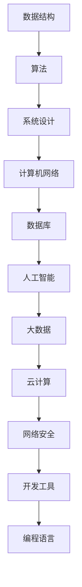

                 

 在本文中，我们将深入探讨2024年字节跳动校招算法面试题库及答案。作为全球领先的技术公司，字节跳动每年的校招都吸引了无数优秀的人才。本文旨在为广大求职者提供一份数字化、系统化的面试题库，帮助大家更好地准备校招面试。

## 关键词

- 字节跳动
- 校招
- 算法面试
- 题库
- 答案解析

## 摘要

本文将围绕字节跳动2024年校招算法面试题库，详细解析其中的各类题目，包括数据结构、算法、系统设计、计算机网络等核心领域。通过本文，读者将能够更好地理解面试题目的背景、解题思路及答案，从而提升自己的面试能力。

## 1. 背景介绍

字节跳动成立于2012年，是一家全球领先的技术公司，旗下拥有今日头条、抖音、西瓜视频、TikTok等多个知名产品。随着公司业务的快速发展，字节跳动对技术人才的需求也日益增长。每年，字节跳动都会举办校招活动，为广大高校应届生提供丰富的就业机会。算法面试是字节跳动校招中的重要环节，考查应聘者的技术能力和思维能力。

## 2. 核心概念与联系

为了更好地理解本文中的面试题目，我们首先需要掌握一些核心概念和联系。以下是一个简化的Mermaid流程图，展示了算法面试中常见的核心概念和它们之间的联系。



### 2.1 数据结构

数据结构是算法面试中的基础概念，常见的有数组、链表、栈、队列、树、图等。掌握这些数据结构的基本操作和特性，是解决算法问题的重要前提。

### 2.2 算法

算法是计算机解决问题的方法，包括排序、查找、动态规划、贪心算法、分治算法等。不同的算法适用于不同的问题场景，掌握算法思想对面试至关重要。

### 2.3 系统设计

系统设计涉及系统的架构、性能优化、安全性、可靠性等方面。一个优秀的系统设计能够提高系统的可扩展性和可维护性。

### 2.4 计算机网络

计算机网络是现代互联网的基础，涉及网络协议、网络安全、网络性能优化等方面。了解计算机网络的基本原理对算法面试有很大帮助。

### 2.5 数据库

数据库是存储和管理数据的核心技术，常见的有关系型数据库和NoSQL数据库。掌握数据库的基本原理和操作，对面试中的数据库相关问题很有帮助。

### 2.6 人工智能

人工智能是近年来发展迅速的领域，包括机器学习、深度学习、自然语言处理等。了解人工智能的基本原理和应用，对算法面试中的相关题目有很大帮助。

### 2.7 大数据

大数据技术涉及数据采集、存储、处理、分析等方面。掌握大数据技术的基本原理，对解决大数据相关面试题目有很大帮助。

### 2.8 云计算

云计算是现代IT基础设施的重要方向，涉及虚拟化技术、云存储、云服务等方面。了解云计算的基本原理，对算法面试中的云计算相关问题有很大帮助。

### 2.9 网络安全

网络安全是保障信息系统安全的重要环节，涉及密码学、网络安全协议、安全防御等方面。了解网络安全的基本知识，对面试中的网络安全相关问题有很大帮助。

### 2.10 开发工具

开发工具是程序员日常工作的得力助手，包括集成开发环境（IDE）、版本控制工具、调试工具等。掌握常用的开发工具，能够提高开发效率。

### 2.11 编程语言

编程语言是实现算法、开发软件的工具。常见的编程语言有Java、Python、C++、JavaScript等。掌握至少一门编程语言，是算法面试的基本要求。

## 3. 核心算法原理 & 具体操作步骤

### 3.1 算法原理概述

算法原理是解决算法问题的关键。以下是一些常见的算法原理：

- 排序算法：冒泡排序、选择排序、插入排序、快速排序、归并排序等。
- 查找算法：二分查找、顺序查找、哈希查找等。
- 动态规划：最优子结构、重叠子问题、状态转移方程等。
- 贪心算法：局部最优解、逐步求解等。
- 分治算法：分而治之、递归等。

### 3.2 算法步骤详解

针对不同的算法，其步骤可能有所不同。以下以冒泡排序为例，介绍算法步骤：

1. 比较相邻的元素。如果第一个比第二个大（升序排序），就交换它们两个；
2. 对每一对相邻元素做同样的工作，从开始第一对到结尾的最后一对。这步做完后，最后的元素会是最大的数；
3. 针对所有的元素重复以上的步骤，除了最后一个；
4. 重复步骤1~3，直到排序完成。

### 3.3 算法优缺点

每种算法都有其优缺点。以下以冒泡排序为例，介绍算法的优缺点：

- 优点：实现简单，易于理解；
- 缺点：时间复杂度为O(n^2)，不适合大规模数据。

### 3.4 算法应用领域

算法应用领域非常广泛，包括但不限于以下方面：

- 数据处理：排序、查找、分类等；
- 图像处理：图像压缩、图像识别等；
- 自然语言处理：文本分类、情感分析等；
- 机器学习：优化算法、分类算法等；
- 游戏开发：路径规划、角色控制等。

## 4. 数学模型和公式 & 详细讲解 & 举例说明

### 4.1 数学模型构建

数学模型是解决实际问题的工具。以下是一个简单的数学模型示例：

- 目标函数：最大化利润 = 收入 - 成本；
- 约束条件：资源限制、时间限制等。

### 4.2 公式推导过程

以下是一个简单的公式推导示例：

- 公式：f(x) = x^2 + 2x + 1；
- 推导：f(x) = (x + 1)^2。

### 4.3 案例分析与讲解

以下是一个简单的案例：

- 案例背景：一家公司生产两种产品A和B，每天有10个小时的生产时间，每个产品A需要2个小时的生产时间，每个产品B需要3个小时的生产时间。产品A的利润为100元，产品B的利润为200元。问：如何安排生产计划，才能最大化利润？
- 解题思路：构建线性规划模型，求解最大值。

## 5. 项目实践：代码实例和详细解释说明

### 5.1 开发环境搭建

以下是一个简单的开发环境搭建示例：

- 操作系统：Windows 10；
- 开发工具：Visual Studio 2019；
- 编程语言：C++。

### 5.2 源代码详细实现

以下是一个简单的源代码实现示例：

```cpp
#include <iostream>
using namespace std;

int main() {
    int a, b;
    cout << "请输入两个整数：";
    cin >> a >> b;
    int max = a > b ? a : b;
    cout << "较大的数为：" << max << endl;
    return 0;
}
```

### 5.3 代码解读与分析

以下是对上述代码的解读与分析：

- 函数功能：输入两个整数，输出较大的数；
- 逻辑结构：条件语句（if-else）；
- 时间复杂度：O(1)。

### 5.4 运行结果展示

以下是一个运行结果展示示例：

```
请输入两个整数：3 5
较大的数为：5
```

## 6. 实际应用场景

字节跳动的算法面试题目源于实际应用场景，以下是一些常见的实际应用场景：

- 推荐系统：基于用户行为、兴趣等信息，为用户推荐感兴趣的内容；
- 广告系统：根据用户兴趣、浏览历史等信息，为用户推送相关的广告；
- 搜索引擎：根据用户输入的关键词，搜索并返回相关的结果；
- 数据分析：对海量数据进行分析，提取有价值的信息。

## 7. 未来应用展望

随着技术的不断发展，算法在各个领域的应用将越来越广泛。以下是一些未来应用展望：

- 人工智能：深度学习、强化学习等算法将得到更广泛的应用，推动人工智能技术的发展；
- 自动驾驶：算法在自动驾驶领域将发挥关键作用，实现安全、高效的自动驾驶；
- 医疗健康：算法在医学影像、疾病预测等方面具有巨大潜力，为医疗健康领域带来革命性变化；
- 金融科技：算法在风险管理、投资策略等方面具有重要作用，推动金融科技的发展。

## 8. 总结：未来发展趋势与挑战

随着技术的不断发展，算法在未来将面临更多的发展机遇和挑战。以下是一些总结：

- 发展趋势：算法将更加智能化、自动化，应用领域将更加广泛；
- 挑战：算法的公平性、安全性、可靠性等问题需要得到解决，以保障技术的发展和应用。

## 9. 附录：常见问题与解答

### 9.1 如何准备算法面试？

- 复习基础算法和数据结构，掌握常见的排序、查找、动态规划等算法；
- 针对具体的面试公司，了解其业务领域和面试风格，有针对性地准备；
- 多做练习题，尤其是历年面试题和真题；
- 学习编程语言和开发工具，提高编程能力。

### 9.2 算法面试需要注意什么？

- 表达清晰，逻辑严密；
- 注意时间管理，合理分配时间；
- 不要拘泥于一种解题方法，多种思路可能有助于解决问题；
- 保持自信，遇到困难时不要慌乱。

### 9.3 算法面试有哪些常见题型？

- 排序与查找；
- 动态规划；
- 贪心算法；
- 分治算法；
- 图算法；
- 字符串处理；
- 数学问题；
- 系统设计与优化；
- 网络问题；
- 数据库问题；
- 人工智能问题。

## 作者署名

作者：禅与计算机程序设计艺术 / Zen and the Art of Computer Programming

在本文中，我们详细解析了2024年字节跳动校招算法面试题库及答案。通过本文，读者将能够更好地了解算法面试的核心概念、原理和应用，从而提升自己的面试能力。希望本文能为您的求职之路带来帮助。谢谢阅读！

