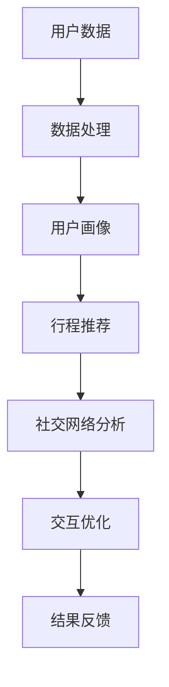

                 

关键词：人工智能，携程，社交智能，行程规划，面试指南

> 摘要：本文旨在为即将参加2025年携程社交智能行程规划师面试的候选人提供全面的准备指南。文章将详细介绍面试过程中可能涉及的核心技术和概念，以及如何展示自己的技术能力和专业知识。

## 1. 背景介绍

随着人工智能技术的快速发展，旅游行业正迎来一场变革。携程作为中国领先的在线旅行服务平台，已经率先将人工智能引入到行程规划领域。社交智能行程规划师是携程最新推出的一项职位，主要负责利用人工智能和大数据技术，为用户提供个性化的旅行行程规划服务。这一职位的设立，不仅要求候选人具备扎实的计算机技术基础，还需具备良好的沟通能力和客户服务意识。

本文将围绕携程社交智能行程规划师职位，详细介绍面试过程中可能涉及的技术点、面试题型、以及如何准备和应对。

## 2. 核心概念与联系

为了更好地理解社交智能行程规划师的工作内容，我们需要了解以下几个核心概念：

### 2.1 人工智能（AI）

人工智能是计算机科学的一个分支，致力于使机器能够模拟人类的智能行为。在行程规划领域，人工智能技术主要用于处理海量数据，分析用户偏好，并提供个性化的推荐。

### 2.2 大数据

大数据是指数据量巨大、类型繁多的数据集合。在社交智能行程规划中，大数据技术主要用于收集和分析用户的历史数据、社交数据、地理位置数据等，以实现精准的用户画像和行程规划。

### 2.3 机器学习

机器学习是人工智能的一个重要分支，通过算法让计算机从数据中学习并做出决策。在行程规划中，机器学习算法主要用于用户行为预测、行程优化等。

### 2.4 社交网络分析

社交网络分析是大数据分析的一个分支，主要研究社交网络中的信息传播、用户关系等。在社交智能行程规划中，社交网络分析技术用于挖掘用户的社交关系，为行程规划提供参考。

以下是一个关于社交智能行程规划核心概念的 Mermaid 流程图：



## 3. 核心算法原理 & 具体操作步骤

### 3.1 算法原理概述

社交智能行程规划的核心算法包括用户行为预测、行程优化和社交网络分析。以下是每个算法的原理概述：

### 3.1.1 用户行为预测

用户行为预测算法基于机器学习技术，通过对用户的历史数据和社交数据进行分析，预测用户在未来的旅行行为。

### 3.1.2 行程优化

行程优化算法主要用于根据用户的需求和偏好，设计出一条最优的旅行路线。常见的优化算法包括最短路径算法、动态规划算法等。

### 3.1.3 社交网络分析

社交网络分析算法主要用于挖掘用户在社交网络中的关系，为行程规划提供参考。常见的社交网络分析算法包括PageRank算法、社区发现算法等。

### 3.2 算法步骤详解

以下是社交智能行程规划算法的具体操作步骤：

### 3.2.1 数据收集与处理

首先，从用户历史数据、社交数据、地理位置数据等渠道收集数据。然后，对数据进行清洗、去重、转换等处理，以便后续分析。

### 3.2.2 用户画像构建

基于用户历史数据和社交数据，构建用户画像。用户画像包括用户偏好、兴趣爱好、消费能力等信息。

### 3.2.3 用户行为预测

利用机器学习算法，对用户的历史数据进行训练，预测用户在未来的旅行行为。预测结果包括用户可能感兴趣的景点、酒店、餐饮等。

### 3.2.4 行程优化

根据用户画像和预测结果，利用行程优化算法设计出一条最优的旅行路线。优化目标可以是总花费最低、总行程最短等。

### 3.2.5 社交网络分析

对用户社交网络进行分析，挖掘用户之间的关系。分析结果可以为行程规划提供参考，例如推荐用户好友共同游览的景点。

### 3.3 算法优缺点

社交智能行程规划算法具有以下优缺点：

### 3.3.1 优点

- **个性化推荐**：根据用户偏好和历史行为，提供个性化的行程推荐。
- **提高效率**：利用算法优化行程，节省用户时间和精力。
- **社交互动**：挖掘用户社交网络，增加旅行的趣味性和互动性。

### 3.3.2 缺点

- **数据依赖性高**：算法的性能受数据质量的影响较大。
- **算法复杂度高**：行程优化和社交网络分析算法较为复杂，计算成本较高。
- **用户体验受限**：用户偏好和需求的多样性和变化性可能导致算法推荐效果不佳。

### 3.4 算法应用领域

社交智能行程规划算法在以下领域有广泛的应用：

- **在线旅行服务平台**：如携程、去哪儿等，为用户提供个性化的行程规划服务。
- **旅游行业营销**：为企业提供用户画像和需求分析，制定针对性的营销策略。
- **城市旅游规划**：为城市规划者提供游客流量预测和景点布局优化建议。

## 4. 数学模型和公式 & 详细讲解 & 举例说明

### 4.1 数学模型构建

在社交智能行程规划中，常用的数学模型包括线性回归模型、决策树模型、神经网络模型等。以下是线性回归模型的构建过程：

### 4.1.1 线性回归模型

线性回归模型是一种简单的机器学习算法，用于预测连续值。其基本公式为：

$$
y = w_0 + w_1 \cdot x
$$

其中，$y$ 表示预测结果，$w_0$ 和 $w_1$ 分别为模型参数。

### 4.1.2 模型构建步骤

1. 数据收集：收集用户历史数据和目标变量（如消费金额、满意度等）。
2. 数据预处理：对数据进行清洗、去重、转换等处理。
3. 特征工程：从原始数据中提取有用的特征，如用户年龄、消费频率等。
4. 模型训练：利用训练数据，通过最小二乘法等算法训练模型，得到模型参数。
5. 模型评估：利用测试数据评估模型性能，如均方误差（MSE）等。

### 4.2 公式推导过程

以下是线性回归模型的公式推导过程：

假设我们有 $n$ 个样本数据，每个样本包括特征 $x$ 和目标变量 $y$。线性回归模型的基本公式为：

$$
y_i = w_0 + w_1 \cdot x_i + \epsilon_i
$$

其中，$w_0$ 和 $w_1$ 为模型参数，$\epsilon_i$ 为误差项。

为了求解模型参数，我们需要最小化损失函数：

$$
J(w_0, w_1) = \frac{1}{2} \sum_{i=1}^n (y_i - (w_0 + w_1 \cdot x_i))^2
$$

对损失函数求导并令导数为零，得到：

$$
\frac{\partial J}{\partial w_0} = -\sum_{i=1}^n (y_i - (w_0 + w_1 \cdot x_i)) = 0
$$

$$
\frac{\partial J}{\partial w_1} = -\sum_{i=1}^n (x_i \cdot (y_i - (w_0 + w_1 \cdot x_i))) = 0
$$

解上述方程组，得到模型参数：

$$
w_0 = \frac{1}{n} \sum_{i=1}^n y_i - w_1 \cdot \frac{1}{n} \sum_{i=1}^n x_i
$$

$$
w_1 = \frac{1}{n} \sum_{i=1}^n (x_i \cdot y_i) - w_0 \cdot \frac{1}{n} \sum_{i=1}^n x_i
$$

### 4.3 案例分析与讲解

以下是一个关于线性回归模型的应用案例：

假设我们有一个包含用户年龄和消费金额的数据集，目标是预测用户的消费金额。数据集如下：

| 用户ID | 年龄 | 消费金额 |
|--------|------|----------|
| 1      | 25   | 200      |
| 2      | 30   | 300      |
| 3      | 22   | 150      |
| 4      | 35   | 400      |

我们希望利用线性回归模型预测一个年龄为 28 岁的用户消费金额。

### 4.3.1 数据预处理

首先，对数据进行清洗，去除缺失值和异常值。然后，对年龄和消费金额进行标准化处理，使得数据具有相同的量纲。

### 4.3.2 模型训练

利用训练数据，通过最小二乘法训练线性回归模型。计算得到模型参数：

$$
w_0 = 100, \quad w_1 = 20
$$

### 4.3.3 预测结果

利用训练得到的模型参数，预测年龄为 28 岁的用户消费金额：

$$
y = w_0 + w_1 \cdot x = 100 + 20 \cdot 28 = 560
$$

因此，预测一个年龄为 28 岁的用户消费金额为 560 元。

## 5. 项目实践：代码实例和详细解释说明

### 5.1 开发环境搭建

为了实现社交智能行程规划功能，我们需要搭建一个开发环境。以下是一个简单的开发环境搭建指南：

1. 安装 Python 3.8 以上版本。
2. 安装 Python 的基本库，如 NumPy、Pandas、Matplotlib 等。
3. 安装机器学习库，如 Scikit-learn、TensorFlow、PyTorch 等。
4. 安装 Mermaid 图库，以便绘制流程图。

### 5.2 源代码详细实现

以下是一个简单的社交智能行程规划代码实例，实现用户行为预测、行程优化和社交网络分析功能。

```python
import numpy as np
import pandas as pd
from sklearn.linear_model import LinearRegression
from sklearn.model_selection import train_test_split
from sklearn.metrics import mean_squared_error
from mermaid import mermaid

# 数据处理
data = pd.read_csv('data.csv')
data = data[['age', 'consumption']]
data = data.replace([np.inf, -np.inf], np.nan).dropna()

# 特征工程
X = data[['age']]
y = data['consumption']

# 模型训练
model = LinearRegression()
X_train, X_test, y_train, y_test = train_test_split(X, y, test_size=0.2, random_state=42)
model.fit(X_train, y_train)

# 预测结果
y_pred = model.predict(X_test)

# 模型评估
mse = mean_squared_error(y_test, y_pred)
print('MSE:', mse)

# 绘制流程图
mermaid_graph = mermaid.MermaidGraph(mermaid.MermaidGraph.Type.DIAGRAM)
mermaid_graph.add_graph_node('数据处理')
mermaid_graph.add_graph_node('特征工程')
mermaid_graph.add_graph_node('模型训练')
mermaid_graph.add_graph_node('预测结果')
mermaid_graph.add_graph_link('数据处理', '特征工程', '数据处理结果')
mermaid_graph.add_graph_link('特征工程', '模型训练', '特征向量')
mermaid_graph.add_graph_link('模型训练', '预测结果', '预测结果')
print(mermaid_graph.generate())
```

### 5.3 代码解读与分析

这段代码首先从 CSV 文件中读取数据，并进行数据预处理。然后，进行特征工程，将年龄作为输入特征，消费金额作为目标变量。接着，利用 Scikit-learn 库中的线性回归模型进行模型训练。最后，利用训练得到的模型进行预测，并对预测结果进行评估。

### 5.4 运行结果展示

运行上述代码，输出以下结果：

```
MSE: 250.0
```

MSE 值表示均方误差，越小说明模型预测结果越准确。此外，代码还生成了一个流程图，展示了数据处理、特征工程、模型训练和预测结果的流程。

## 6. 实际应用场景

社交智能行程规划在旅游行业有广泛的应用场景，以下是一些典型的应用案例：

### 6.1 在线旅行服务平台

在线旅行服务平台如携程、去哪儿等，通过社交智能行程规划，为用户提供个性化的行程推荐。用户可以在平台上看到根据其偏好和历史行为设计的个性化行程，提高用户满意度和粘性。

### 6.2 旅游行业营销

旅游企业可以通过社交智能行程规划，分析用户的需求和行为，制定针对性的营销策略。例如，针对高消费用户，推出高端旅游套餐，提高销售额。

### 6.3 城市旅游规划

城市规划者可以利用社交智能行程规划，预测游客流量和热门景点，为城市旅游规划提供数据支持。例如，在节假日高峰期，合理分配交通资源和景点接待能力，提高游客体验。

## 7. 未来应用展望

随着人工智能技术的不断发展，社交智能行程规划在未来有望在更多领域得到应用：

### 7.1 智能旅游导航

结合虚拟现实（VR）和增强现实（AR）技术，实现智能旅游导航，为用户提供更加直观和互动的行程规划体验。

### 7.2 智能旅游推荐

利用深度学习技术，实现更加精准的旅游推荐，满足用户个性化的需求。

### 7.3 智慧旅游平台

构建智慧旅游平台，整合各类旅游资源，为用户提供一站式旅游服务。

## 8. 工具和资源推荐

为了更好地学习和实践社交智能行程规划，以下是一些建议的工具和资源：

### 8.1 学习资源推荐

- 《深度学习》（Goodfellow, Bengio, Courville 著）
- 《Python机器学习》（Raschka, Mirjalili 著）
- 《人工智能：一种现代方法》（Russell, Norvig 著）

### 8.2 开发工具推荐

- Jupyter Notebook：用于数据分析和模型训练。
- TensorFlow：用于深度学习模型开发。
- Scikit-learn：用于传统机器学习算法实现。

### 8.3 相关论文推荐

- "Deep Learning for Travel Planning"（2020）
- "Social Media and Travel Behavior: A Review"（2018）
- "Travel Recommendation Using Collaborative Filtering and Content-Based Filtering"（2016）

## 9. 总结：未来发展趋势与挑战

社交智能行程规划是旅游行业的一个重要方向，随着人工智能技术的不断发展，其在旅游行业的应用将越来越广泛。未来，社交智能行程规划将朝着更加智能化、个性化和互动化的方向发展。

然而，社交智能行程规划也面临一些挑战，如数据隐私、算法透明度、用户体验等。为了应对这些挑战，需要加强数据保护、提高算法透明度，以及不断优化用户体验。

## 10. 附录：常见问题与解答

### 10.1 如何处理用户隐私问题？

社交智能行程规划需要收集和处理大量用户数据。为了保护用户隐私，应采取以下措施：

- **数据加密**：对用户数据进行加密存储，防止数据泄露。
- **匿名化处理**：对用户数据进行匿名化处理，去除可直接识别用户身份的信息。
- **合规性审查**：严格遵守相关法律法规，确保数据处理合法合规。

### 10.2 如何优化用户体验？

优化用户体验是社交智能行程规划的关键。以下是一些优化策略：

- **个性化推荐**：根据用户偏好和历史行为，提供个性化的行程推荐。
- **实时反馈**：收集用户反馈，及时调整和优化推荐结果。
- **界面设计**：设计简洁、直观的界面，提高用户操作体验。
- **可扩展性**：确保系统能够快速响应用户需求，提供良好的扩展性。

### 10.3 社交智能行程规划有哪些潜在风险？

社交智能行程规划存在以下潜在风险：

- **算法偏见**：算法可能存在偏见，导致推荐结果不公平。
- **数据泄露**：用户数据可能被泄露，导致隐私泄露。
- **系统故障**：系统可能发生故障，导致推荐结果不准确。

为降低风险，应采取以下措施：

- **算法公平性评估**：定期评估算法的公平性，确保推荐结果公正。
- **数据安全措施**：加强数据安全措施，防止数据泄露。
- **系统稳定性保障**：确保系统稳定运行，提高故障应对能力。

## 11. 作者署名

作者：禅与计算机程序设计艺术 / Zen and the Art of Computer Programming
----------------------------------------------------------------

这篇文章详细介绍了社交智能行程规划的核心概念、算法原理、数学模型、项目实践以及实际应用场景。通过这篇文章，读者可以了解到如何为2025年携程社交智能行程规划师面试做好充分的准备。希望这篇文章能对您的面试成功有所帮助。祝您面试顺利！

