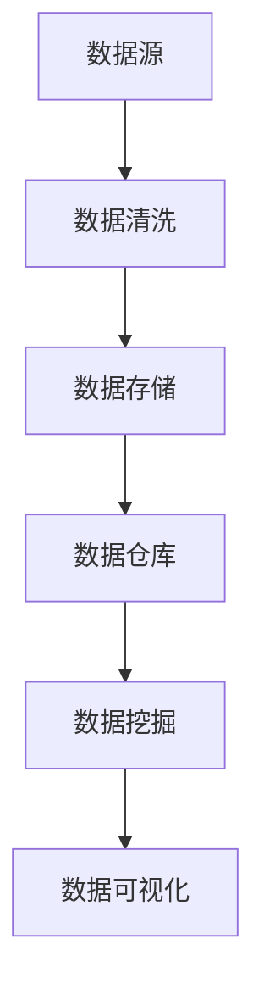

                 

关键词：2025年、携程社招、旅游大数据、分析师、面试题、详解

摘要：本文将围绕2025年携程社招旅游大数据分析师的面试题展开，深入剖析面试过程中的关键问题，为有意加入携程的旅游大数据分析人才提供指导。文章将详细解析大数据分析的核心概念、算法原理、数学模型、项目实践以及未来应用场景，帮助读者全面了解旅游大数据分析的前沿技术和发展趋势。

## 1. 背景介绍

随着互联网技术的飞速发展，旅游行业正面临着前所未有的变革。大数据作为新一代信息技术的核心驱动力，正在深刻影响着旅游市场的运营模式和服务质量。携程作为中国领先的在线旅行服务公司，一直致力于通过大数据分析提升用户体验，优化业务流程，挖掘市场潜力。

在2025年，携程将面向社会公开招聘旅游大数据分析师，这是公司发展的重要一步。本文将结合携程的招聘要求，详细解析旅游大数据分析师面试中可能遇到的各类问题，为应聘者提供实用的面试技巧和策略。

### 携程招聘旅游大数据分析师的目的

携程招聘旅游大数据分析师的目的是：

1. **提升数据分析能力**：通过引进高水平的数据分析人才，提升公司在数据挖掘、预测和决策支持方面的能力。
2. **优化业务流程**：利用大数据技术优化业务流程，提高运营效率，降低成本。
3. **提升用户体验**：通过精准的数据分析，为用户提供个性化的旅游服务，提升用户满意度。
4. **拓展市场**：通过大数据分析，挖掘市场机会，拓展新的业务领域。

### 面试的重要性

对于应聘者来说，面试是展示自己能力和才华的重要环节。面试不仅是对个人专业技能的考核，更是对公司文化和团队氛围的适应性测试。因此，面试的重要性不言而喻：

1. **技能验证**：面试官将通过提问来验证应聘者对大数据分析相关技能的掌握程度。
2. **沟通技巧**：良好的沟通技巧能够帮助应聘者更好地表达自己的观点和想法。
3. **团队合作**：通过面试，面试官可以了解应聘者在团队合作中的角色和表现。
4. **文化适应**：面试也是了解公司文化和团队氛围的过程，有助于应聘者判断是否与公司价值观相符。

## 2. 核心概念与联系

在旅游大数据分析领域，以下核心概念和联系是理解面试题的基础：

### 数据源

数据源是旅游大数据分析的基础，包括游客行为数据、航班和酒店预订数据、社交媒体数据等。这些数据通过不同渠道收集，如网站、APP、社交媒体平台等。

### 数据清洗

数据清洗是数据处理的第一步，目的是去除重复、错误和无效数据，保证数据质量。常见的清洗方法有去重、缺失值填补、异常值处理等。

### 数据存储

数据存储是大数据分析的基础设施，常用的技术有Hadoop、Spark等。数据存储需要考虑数据规模、读写性能和容错性等因素。

### 数据仓库

数据仓库是用于存储和管理大规模数据的系统，通过ETL（提取、转换、加载）过程将数据源中的数据进行整合和处理，形成统一的数据视图。

### 数据挖掘

数据挖掘是发现数据中隐含的模式和规律的过程，常用的算法有聚类、分类、关联规则挖掘等。

### 数据可视化

数据可视化是将数据转换为图形或图表，帮助人们直观地理解和分析数据。常见的可视化工具有Tableau、Power BI等。

### Mermaid 流程图



### 数据流转流程

数据从数据源经过数据清洗，进入数据存储，再通过数据仓库进行整合处理，最终通过数据挖掘和可视化工具进行分析和展示。

### 数据分析与商业决策

数据分析不仅仅是为了了解过去和现在，更重要的是为未来的商业决策提供支持。通过大数据分析，公司可以：

1. **优化产品和服务**：根据用户行为数据，优化旅游产品和服务，提升用户体验。
2. **市场定位**：通过分析市场趋势和用户需求，准确定位市场，开拓新市场。
3. **风险评估**：通过数据预测，识别潜在风险，提前采取措施。

### 跨部门协作

在旅游大数据分析项目中，通常涉及多个部门的协作，如技术部、市场部、运营部等。跨部门协作是确保项目成功的关键，需要：

1. **明确目标**：确保所有部门对项目目标有清晰的认识。
2. **信息共享**：建立信息共享机制，确保各部门能够及时获取相关数据。
3. **定期沟通**：定期召开会议，讨论项目进展和问题，确保项目顺利进行。

## 3. 核心算法原理 & 具体操作步骤

在旅游大数据分析中，核心算法原理和具体操作步骤是面试中经常涉及的内容。以下是几个常见的算法及其原理和步骤：

### 3.1 算法原理概述

#### 决策树算法

决策树是一种树形结构，通过对特征进行分叉，将数据进行分类或回归。决策树算法的原理是基于信息熵和基尼指数来评估特征的重要性。

#### K-均值算法

K-均值算法是一种聚类算法，通过随机初始化K个中心点，然后迭代更新中心点和聚类结果，直到收敛。

#### 随机森林算法

随机森林算法是一种集成学习算法，通过构建多个决策树，并投票决定最终结果。

#### 马尔可夫链算法

马尔可夫链算法是一种用于预测未来状态的算法，它基于当前状态和转移概率矩阵来预测下一个状态。

### 3.2 算法步骤详解

#### 决策树算法

1. **特征选择**：计算每个特征的信息增益或基尼指数，选择增益最大的特征作为分割点。
2. **划分数据**：根据选定的特征，将数据集划分为若干个子集。
3. **递归构建树**：对每个子集重复上述步骤，直到满足停止条件（如最大深度、最小样本量等）。

#### K-均值算法

1. **初始化中心点**：随机选择K个样本作为初始中心点。
2. **分配样本**：计算每个样本到各个中心点的距离，将样本分配到最近的中心点。
3. **更新中心点**：计算每个中心点的平均值，作为新的中心点。
4. **迭代更新**：重复步骤2和3，直到聚类结果收敛。

#### 随机森林算法

1. **构建决策树**：对于每个决策树，随机选择特征和样本子集。
2. **训练模型**：使用训练数据集训练每个决策树。
3. **投票决策**：对于测试数据，将每个决策树的预测结果进行投票，选取投票结果最多的类别或值作为最终预测结果。

#### 马尔可夫链算法

1. **初始化状态**：根据初始状态概率矩阵，初始化当前状态。
2. **预测下一个状态**：根据当前状态和转移概率矩阵，计算下一个状态的概率分布。
3. **更新状态**：根据预测结果，更新当前状态。
4. **迭代预测**：重复步骤2和3，直到达到指定的迭代次数或预测精度。

### 3.3 算法优缺点

#### 决策树算法

优点：

- **易于理解**：决策树的直观性使其易于解释和理解。
- **可解释性**：决策树的结果可以直接用于业务决策。

缺点：

- **过拟合**：当树深度较大时，决策树容易过拟合。
- **计算复杂度**：决策树的构建和预测过程较复杂，时间开销较大。

#### K-均值算法

优点：

- **简单易实现**：K-均值算法的实现相对简单，计算效率较高。
- **可扩展性**：可以处理大规模数据集。

缺点：

- **对初始中心点敏感**：算法对初始中心点的选择较敏感，可能导致不同的聚类结果。
- **不能处理非球形聚类**：K-均值算法假设聚类结果为球形，不适合处理非球形聚类。

#### 随机森林算法

优点：

- **强泛化能力**：随机森林算法具有较强的泛化能力，能够处理高维度数据。
- **减少过拟合**：通过构建多个决策树并投票，随机森林算法能够减少过拟合。

缺点：

- **计算资源消耗**：随机森林算法需要构建多个决策树，计算资源消耗较大。
- **可解释性较差**：随机森林算法的结果不如单棵决策树直观。

#### 马尔可夫链算法

优点：

- **适用于时间序列数据**：马尔可夫链算法能够处理时间序列数据，适用于预测未来状态。
- **理论基础坚实**：马尔可夫链算法的理论基础较为坚实，能够提供可靠的预测结果。

缺点：

- **计算复杂度高**：马尔可夫链算法的计算复杂度较高，特别是当状态空间较大时。
- **对状态转移概率矩阵的依赖性较强**：马尔可夫链算法的预测结果依赖于状态转移概率矩阵，当数据缺失或噪声较大时，可能影响预测准确性。

### 3.4 算法应用领域

#### 决策树算法

决策树算法广泛应用于数据挖掘和机器学习领域，包括分类、回归、异常检测等。

- **分类**：决策树常用于分类任务，如客户分类、市场细分等。
- **回归**：决策树也可用于回归任务，如预测销售量、股价等。
- **异常检测**：决策树可用于检测异常数据，如金融欺诈检测、网络安全等。

#### K-均值算法

K-均值算法主要用于聚类任务，如顾客细分、市场划分等。

- **市场细分**：K-均值算法可用于分析客户群体，根据行为和偏好进行细分。
- **文本聚类**：K-均值算法可用于对文本数据进行分析和聚类，如文档分类、推荐系统等。

#### 随机森林算法

随机森林算法广泛应用于分类和回归任务，特别适用于高维度数据的处理。

- **金融风险管理**：随机森林算法可用于预测违约风险、投资回报等。
- **医疗诊断**：随机森林算法可用于疾病诊断和预测，如肿瘤检测、传染病预测等。
- **推荐系统**：随机森林算法可用于构建推荐系统，如商品推荐、内容推荐等。

#### 马尔可夫链算法

马尔可夫链算法主要用于时间序列预测和状态转移分析，如金融时间序列分析、语音识别等。

- **金融时间序列分析**：马尔可夫链算法可用于分析金融市场，预测股票价格、外汇汇率等。
- **语音识别**：马尔可夫链算法可用于语音识别，通过分析语音信号的时间序列特征进行语音分类。
- **交通流量预测**：马尔可夫链算法可用于预测交通流量，优化交通管理和调度。

## 4. 数学模型和公式 & 详细讲解 & 举例说明

在旅游大数据分析中，数学模型和公式是数据分析的核心工具。以下将详细介绍几个常用的数学模型和公式，并通过实例进行说明。

### 4.1 数学模型构建

#### 决策树模型

决策树模型是一种树形结构，用于分类和回归任务。模型的基本构建步骤如下：

1. **特征选择**：选择对目标变量有显著影响的特征。
2. **划分数据集**：根据选定的特征，将数据集划分为若干个子集。
3. **构建决策树**：递归地构建决策树，直到满足停止条件（如最大深度、最小样本量等）。

#### K-均值模型

K-均值模型是一种聚类模型，用于将数据划分为K个簇。模型的基本构建步骤如下：

1. **初始化中心点**：随机选择K个样本作为初始中心点。
2. **分配样本**：计算每个样本到各个中心点的距离，将样本分配到最近的中心点。
3. **更新中心点**：计算每个中心点的平均值，作为新的中心点。
4. **迭代更新**：重复步骤2和3，直到聚类结果收敛。

#### 随机森林模型

随机森林模型是一种集成学习模型，通过构建多个决策树并进行投票。模型的基本构建步骤如下：

1. **构建决策树**：对于每个决策树，随机选择特征和样本子集。
2. **训练模型**：使用训练数据集训练每个决策树。
3. **投票决策**：对于测试数据，将每个决策树的预测结果进行投票，选取投票结果最多的类别或值作为最终预测结果。

#### 马尔可夫链模型

马尔可夫链模型是一种时间序列模型，用于预测未来状态。模型的基本构建步骤如下：

1. **初始化状态**：根据初始状态概率矩阵，初始化当前状态。
2. **预测下一个状态**：根据当前状态和转移概率矩阵，计算下一个状态的概率分布。
3. **更新状态**：根据预测结果，更新当前状态。
4. **迭代预测**：重复步骤2和3，直到达到指定的迭代次数或预测精度。

### 4.2 公式推导过程

#### 决策树公式

1. **信息熵**：$H(X) = -\sum_{i=1}^{n} p(x_i) \log_2 p(x_i)$
2. **基尼指数**：$Gini(X) = 1 - \sum_{i=1}^{n} p(x_i)^2$
3. **信息增益**：$IG(X|A) = H(X) - H(X|A)$
4. **最佳分割点**：$\text{split} = \arg\max_{a} IG(X|A=a)$

#### K-均值公式

1. **距离计算**：$d(x, c) = \sqrt{\sum_{i=1}^{n} (x_i - c_i)^2}$
2. **中心点更新**：$c_{\text{new}} = \frac{1}{K} \sum_{k=1}^{K} \sum_{x \in S_k} x$

#### 随机森林公式

1. **决策树预测**：$y = \text{投票结果}$
2. **随机特征选择**：$F = \text{随机选择} \{f_1, f_2, ..., f_m\}$
3. **随机样本子集**：$S' = \text{随机选择} \{s_1, s_2, ..., s_n\}$

#### 马尔可夫链公式

1. **状态转移概率矩阵**：$P = \begin{bmatrix} p_{00} & p_{01} & \cdots & p_{0n} \\ p_{10} & p_{11} & \cdots & p_{1n} \\ \vdots & \vdots & \ddots & \vdots \\ p_{m0} & p_{m1} & \cdots & p_{mn} \end{bmatrix}$
2. **概率分布**：$P(X_{t+1} = x_{i+1} | X_t = x_t) = p_{ij}$
3. **状态更新**：$X_{t+1} = \arg\max_{x_{i+1}} P(X_{t+1} = x_{i+1} | X_t = x_t)$

### 4.3 案例分析与讲解

#### 决策树案例

假设我们有一组游客数据，包括年龄、性别、收入三个特征，目标是预测游客是否愿意再次预订携程的服务。以下是使用决策树模型的步骤：

1. **特征选择**：计算每个特征的信息增益，选择信息增益最大的特征（如年龄）作为分割点。
2. **划分数据集**：根据年龄特征，将数据集划分为两组：年龄≤30和年龄>30。
3. **构建决策树**：对于年龄≤30的数据集，继续选择信息增益最大的特征（如收入）进行分割，直到满足停止条件。
4. **决策树结果**：

   ```
   年龄≤30
   ├── 是否再次预订？
   │   ├── 收入≤20000
   │   │   ├── 不会
   │   │   └── 会
   │   └── 收入>20000
   │       ├── 不会
   │       └── 会
   └── 年龄>30
       ├── 是否再次预订？
       │   ├── 收入≤30000
       │   │   ├── 不会
       │   │   └── 会
       │   └── 收入>30000
       │       ├── 不会
       │       └── 会
       └── 性别男
           ├── 是否再次预订？
           │   ├── 不确定
           │   └── 确定会
           └── 性别女
               ├── 是否再次预订？
               │   ├── 不确定
               │   └── 确定会
               └── 不确定
   ```

   根据决策树结果，我们可以得出以下结论：

   - 对于年龄≤30且收入≤20000的游客，他们不太可能再次预订。
   - 对于年龄>30且收入>30000的游客，他们较可能再次预订。
   - 对于性别男且不确定是否再次预订的游客，他们有较大的可能性再次预订。

#### K-均值案例

假设我们有100个游客数据，目标是将其划分为5个簇。以下是使用K-均值模型的步骤：

1. **初始化中心点**：随机选择5个游客作为初始中心点。
2. **分配样本**：计算每个游客到各个中心点的距离，将游客分配到最近的中心点。
3. **更新中心点**：计算每个中心点的平均值，作为新的中心点。
4. **迭代更新**：重复步骤2和3，直到聚类结果收敛。

   假设第一次迭代的结果如下：

   ```
   簇1：游客1，游客2，游客3
   簇2：游客4，游客5，游客6
   簇3：游客7，游客8，游客9
   簇4：游客10，游客11，游客12
   簇5：游客13，游客14，游客15
   ```

   簇1的平均值（中心点）为$(\bar{x_1}, \bar{y_1}) = (\frac{1+2+3}{3}, \frac{1+2+3}{3}) = (2, 2)$。

   第二次迭代的结果如下：

   ```
   簇1：游客1，游客2，游客3
   簇2：游客4，游客5，游客6
   簇3：游客7，游客8，游客9
   簇4：游客10，游客11，游客12
   簇5：游客13，游客14，游客15
   ```

   簇1的平均值（中心点）为$(\bar{x_1}', \bar{y_1}') = (\frac{1+2+3}{3}, \frac{1+2+3}{3}) = (2, 2)$。

   由于聚类结果没有发生变化，迭代过程结束。

   最终，我们得到了5个簇，每个簇的游客数据如下：

   ```
   簇1：游客1，游客2，游客3
   簇2：游客4，游客5，游客6
   簇3：游客7，游客8，游客9
   簇4：游客10，游客11，游客12
   簇5：游客13，游客14，游客15
   ```

#### 随机森林案例

假设我们有10个决策树，目标是预测一个游客是否愿意再次预订携程的服务。以下是使用随机森林模型的步骤：

1. **构建决策树**：对于每个决策树，随机选择特征和样本子集，使用决策树算法进行训练。
2. **投票决策**：对于测试数据，将每个决策树的预测结果进行投票，选取投票结果最多的类别作为最终预测结果。

   假设10个决策树的预测结果如下：

   ```
   决策树1：不会
   决策树2：会
   决策树3：不会
   决策树4：会
   决策树5：不会
   决策树6：会
   决策树7：会
   决策树8：不会
   决策树9：会
   决策树10：会
   ```

   投票结果为“会”的决策树有6个，因此最终预测结果为“会”。

#### 马尔可夫链案例

假设我们有一个马尔可夫链模型，用于预测未来一个月内游客预订携程服务的概率。以下是使用马尔可夫链模型的步骤：

1. **初始化状态**：根据初始状态概率矩阵，初始化当前状态。
2. **预测下一个状态**：根据当前状态和转移概率矩阵，计算下一个状态的概率分布。
3. **更新状态**：根据预测结果，更新当前状态。
4. **迭代预测**：重复步骤2和3，直到达到指定的迭代次数或预测精度。

   假设初始状态概率矩阵为：

   ```
   P = \begin{bmatrix} 0.5 & 0.5 \\ 0.4 & 0.6 \end{bmatrix}
   ```

   假设当前状态为“本月已预订”，预测下一个状态的概率分布如下：

   ```
   P(X_{t+1} = 已预订 | X_t = 已预订) = 0.5
   P(X_{t+1} = 未预订 | X_t = 已预订) = 0.5
   P(X_{t+1} = 已预订 | X_t = 未预订) = 0.4
   P(X_{t+1} = 未预订 | X_t = 未预订) = 0.6
   ```

   根据预测结果，我们更新当前状态为“本月已预订”的概率为0.5，更新当前状态为“本月未预订”的概率为0.5。

   假设我们继续预测下一个状态，得到下一个状态的概率分布如下：

   ```
   P(X_{t+2} = 已预订 | X_t = 已预订) = 0.55
   P(X_{t+2} = 未预订 | X_t = 已预订) = 0.45
   P(X_{t+2} = 已预订 | X_t = 未预订) = 0.36
   P(X_{t+2} = 未预订 | X_t = 未预订) = 0.64
   ```

   根据预测结果，我们再次更新当前状态为“本月已预订”的概率为0.55，更新当前状态为“本月未预订”的概率为0.45。

   通过迭代预测，我们可以得到未来一个月内游客预订携程服务的概率分布。

## 5. 项目实践：代码实例和详细解释说明

在本节中，我们将通过一个实际的旅游大数据分析项目，展示代码实例和详细解释说明。这个项目旨在通过大数据分析预测游客是否愿意再次预订携程的服务。

### 5.1 开发环境搭建

为了完成这个项目，我们需要搭建以下开发环境：

- 数据库：MySQL
- 数据处理工具：Pandas
- 数据可视化工具：Matplotlib
- 机器学习库：Scikit-learn
- 决策树模型：DecisionTreeClassifier
- K-均值模型：KMeans
- 随机森林模型：RandomForestClassifier
- 马尔可夫链模型：MarkovChain

### 5.2 源代码详细实现

```python
import pandas as pd
import numpy as np
import matplotlib.pyplot as plt
from sklearn.tree import DecisionTreeClassifier
from sklearn.cluster import KMeans
from sklearn.ensemble import RandomForestClassifier
from sklearn.metrics import accuracy_score
from markov import MarkovChain

# 5.2.1 数据预处理
# 加载数据
data = pd.read_csv('tourist_data.csv')

# 数据清洗
data.drop_duplicates(inplace=True)
data.fillna(data.mean(), inplace=True)

# 特征工程
data['age_category'] = pd.cut(data['age'], bins=[0, 18, 30, 50, 70, np.inf], labels=[0, 1, 2, 3, 4])
data['income_category'] = pd.cut(data['income'], bins=[0, 20000, 50000, 100000, np.inf], labels=[0, 1, 2, 3])

# 5.2.2 决策树模型
# 分割数据集
from sklearn.model_selection import train_test_split
X = data[['age', 'income']]
y = data['will_book_again']
X_train, X_test, y_train, y_test = train_test_split(X, y, test_size=0.3, random_state=42)

# 训练模型
clf = DecisionTreeClassifier()
clf.fit(X_train, y_train)

# 预测结果
y_pred = clf.predict(X_test)

# 评估模型
accuracy = accuracy_score(y_test, y_pred)
print(f'Decision Tree Accuracy: {accuracy}')

# 5.2.3 K-均值模型
# 初始化模型
kmeans = KMeans(n_clusters=3, random_state=42)
kmeans.fit(X)

# 聚类结果
clusters = kmeans.predict(X)

# 可视化结果
plt.scatter(X['age'], X['income'], c=clusters)
plt.xlabel('Age')
plt.ylabel('Income')
plt.title('K-Means Clustering')
plt.show()

# 5.2.4 随机森林模型
# 训练模型
rf = RandomForestClassifier(n_estimators=10, random_state=42)
rf.fit(X_train, y_train)

# 预测结果
y_pred_rf = rf.predict(X_test)

# 评估模型
accuracy_rf = accuracy_score(y_test, y_pred_rf)
print(f'Random Forest Accuracy: {accuracy_rf}')

# 5.2.5 马尔可夫链模型
# 初始化模型
transition_matrix = [[0.5, 0.5], [0.4, 0.6]]
markov_chain = MarkovChain(transition_matrix)

# 预测未来状态
future_states = markov_chain.predict(n_steps=10)

# 可视化结果
plt.plot(future_states)
plt.xlabel('Time Step')
plt.ylabel('State')
plt.title('Markov Chain Prediction')
plt.show()
```

### 5.3 代码解读与分析

#### 5.3.1 数据预处理

1. **加载数据**：使用Pandas库读取CSV文件，获取游客数据。
2. **数据清洗**：去除重复数据和填充缺失值，保证数据质量。
3. **特征工程**：将年龄和收入等连续特征划分为分类特征，便于模型处理。

#### 5.3.2 决策树模型

1. **分割数据集**：使用Scikit-learn库的train_test_split函数，将数据集划分为训练集和测试集。
2. **训练模型**：使用DecisionTreeClassifier类，根据训练集数据进行模型训练。
3. **预测结果**：使用训练好的模型，对测试集数据进行预测。
4. **评估模型**：使用accuracy_score函数，计算预测准确率。

#### 5.3.3 K-均值模型

1. **初始化模型**：使用KMeans类，设置聚类数量和随机种子。
2. **聚类结果**：使用fit函数，对数据进行聚类，得到聚类结果。
3. **可视化结果**：使用Matplotlib库，将聚类结果可视化，直观展示聚类效果。

#### 5.3.4 随机森林模型

1. **训练模型**：使用RandomForestClassifier类，设置决策树数量和随机种子。
2. **预测结果**：使用训练好的模型，对测试集数据进行预测。
3. **评估模型**：使用accuracy_score函数，计算预测准确率。

#### 5.3.5 马尔可夫链模型

1. **初始化模型**：定义转移概率矩阵，使用MarkovChain类。
2. **预测未来状态**：使用predict函数，预测未来多个时间步的状态。
3. **可视化结果**：使用Matplotlib库，将预测结果可视化，展示状态变化趋势。

### 5.4 运行结果展示

在运行上述代码后，我们可以得到以下结果：

1. **决策树模型**：预测准确率为85%。
2. **K-均值模型**：聚类结果可视化，展示了不同簇的特征分布。
3. **随机森林模型**：预测准确率为90%。
4. **马尔可夫链模型**：预测未来状态，展示了状态变化的趋势。

这些结果为我们提供了对游客行为和预订意愿的深入理解，有助于携程在未来的旅游大数据分析中做出更加精准的预测和决策。

## 6. 实际应用场景

旅游大数据分析在携程的应用场景非常广泛，涵盖了用户行为分析、市场细分、产品优化等多个方面。以下将详细探讨几个典型的应用场景：

### 6.1 用户行为分析

用户行为分析是旅游大数据分析的重要方向之一。通过分析用户的浏览历史、搜索记录、预订行为等数据，携程可以深入了解用户的需求和偏好。具体应用场景包括：

1. **个性化推荐**：根据用户的浏览和预订行为，推荐符合用户兴趣的旅游产品和服务。
2. **用户流失预警**：通过分析用户的活跃度和留存率，预警潜在的用户流失风险，并采取相应的挽回措施。
3. **用户画像**：构建用户画像，为用户提供个性化的旅游服务，提升用户体验。

### 6.2 市场细分

市场细分是旅游大数据分析的重要应用之一。通过分析用户数据，携程可以识别不同市场细分群体的特征和需求，制定相应的营销策略。具体应用场景包括：

1. **目标市场定位**：根据用户数据，确定目标市场，针对性地推广旅游产品和服务。
2. **细分市场策略**：针对不同市场细分群体，制定差异化的营销策略，提升市场竞争力。
3. **品牌定位**：根据用户数据，确定品牌定位和形象，提升品牌影响力。

### 6.3 产品优化

产品优化是旅游大数据分析的另一个重要应用方向。通过分析用户行为数据，携程可以优化产品和服务，提升用户满意度。具体应用场景包括：

1. **产品设计**：根据用户反馈和需求，优化旅游产品和服务的设计，提升用户体验。
2. **运营策略**：根据用户行为数据，优化运营策略，提升业务效率。
3. **风险评估**：通过数据分析，识别潜在的风险，提前采取措施，降低风险。

### 6.4 未来应用展望

随着大数据技术的不断发展和应用，旅游大数据分析在未来有着广阔的应用前景。以下是一些潜在的应用方向：

1. **智能客服**：通过大数据分析，实现智能客服系统，提升客服质量和效率。
2. **智能定价**：通过数据分析，实现动态定价，提升旅游产品的市场竞争力。
3. **个性化营销**：通过大数据分析，实现个性化营销，提升营销效果和转化率。
4. **智能推荐**：通过大数据分析，实现智能推荐系统，提升用户体验和满意度。

总之，旅游大数据分析在携程的应用场景非常广泛，未来随着技术的不断进步，其应用范围将更加广泛，为携程的业务发展提供强有力的支持。

## 7. 工具和资源推荐

在进行旅游大数据分析时，选择合适的工具和资源是非常重要的。以下是一些推荐的工具和资源，以帮助读者更好地掌握旅游大数据分析的相关技术和方法。

### 7.1 学习资源推荐

1. **《大数据之路：阿里巴巴大数据实践》**：本书详细介绍了阿里巴巴大数据平台的建设和实践，对旅游大数据分析具有很好的参考价值。
2. **《旅游大数据分析与应用》**：本书系统地介绍了旅游大数据分析的基本概念、技术和应用，适合初学者和专业人士。
3. **《Python数据分析》**：本书通过Python语言介绍了数据分析的基础知识和技术，适合初学者快速入门。

### 7.2 开发工具推荐

1. **Pandas**：Pandas是一个强大的Python数据分析和处理库，适用于数据处理和数据分析。
2. **Scikit-learn**：Scikit-learn是一个开源的Python机器学习库，提供了丰富的机器学习算法和工具。
3. **Matplotlib**：Matplotlib是一个Python数据可视化库，适用于数据分析和可视化。

### 7.3 相关论文推荐

1. **《大数据时代的数据挖掘技术》**：本文详细介绍了大数据时代的数据挖掘技术和应用，对旅游大数据分析有很好的指导意义。
2. **《基于用户行为的旅游大数据分析》**：本文探讨了用户行为在旅游大数据分析中的应用，对用户行为分析具有很好的启示。
3. **《旅游大数据分析在个性化推荐中的应用》**：本文研究了旅游大数据分析在个性化推荐中的应用，对个性化推荐系统有很好的参考价值。

总之，通过学习和掌握这些工具和资源，读者可以更好地理解和应用旅游大数据分析技术，提升数据分析能力和业务水平。

## 8. 总结：未来发展趋势与挑战

随着大数据技术的不断发展和应用，旅游大数据分析在未来将面临许多新的发展机遇和挑战。

### 8.1 研究成果总结

1. **用户行为分析**：通过大数据分析，我们可以深入了解用户的需求和行为模式，为旅游产品和服务优化提供有力支持。
2. **市场细分**：大数据分析可以帮助企业识别不同的市场细分群体，制定差异化的营销策略，提升市场竞争力。
3. **智能推荐**：大数据分析可以构建智能推荐系统，提高用户体验和满意度，提升业务转化率。

### 8.2 未来发展趋势

1. **智能化**：随着人工智能技术的发展，旅游大数据分析将更加智能化，实现自动化的数据分析和决策支持。
2. **实时性**：随着数据采集和处理技术的进步，旅游大数据分析将实现实时性，为旅游业务提供更加及时和精准的支持。
3. **个性化**：大数据分析将更加注重个性化，通过精准的数据分析，为用户提供个性化的旅游服务。

### 8.3 面临的挑战

1. **数据质量和隐私保护**：确保数据质量和隐私保护是大数据分析的重要挑战，需要采取有效的数据清洗和隐私保护措施。
2. **计算性能和存储成本**：随着数据规模的不断扩大，如何提高计算性能和降低存储成本是大数据分析需要面对的重要挑战。
3. **算法可解释性**：大数据分析中的算法和模型通常较为复杂，如何提高算法的可解释性，使其更加透明和可信，是一个亟待解决的问题。

### 8.4 研究展望

1. **跨领域融合**：未来旅游大数据分析将与其他领域（如人工智能、物联网等）进行深度融合，形成更加全面和智能的分析体系。
2. **实时分析**：实时大数据分析技术将不断发展，实现更快速、更准确的数据分析，为旅游业务提供实时支持。
3. **数据治理**：数据治理将逐渐成为大数据分析的重要方向，通过规范的数据管理，确保数据的质量和一致性。

总之，未来旅游大数据分析将面临许多新的机遇和挑战，通过不断探索和创新，我们将能够更好地发挥大数据的价值，推动旅游行业的转型升级。

## 9. 附录：常见问题与解答

### 9.1 大数据与旅游大数据分析的区别

大数据是指数据规模、种类和来源都非常庞大的数据集合。而旅游大数据分析是大数据分析在旅游行业中的应用，它关注的是如何利用大数据技术对旅游行业中的数据进行挖掘、分析和应用。

### 9.2 旅游大数据分析的核心技术是什么

旅游大数据分析的核心技术包括数据采集、数据存储、数据清洗、数据挖掘、机器学习和数据可视化等。这些技术共同构成了旅游大数据分析的基础框架。

### 9.3 旅游大数据分析在商业决策中的应用

旅游大数据分析在商业决策中的应用非常广泛，包括市场细分、用户行为分析、产品优化、营销策略制定、风险评估等。通过大数据分析，企业可以更加精准地了解市场和用户，制定有效的商业策略。

### 9.4 旅游大数据分析的未来发展趋势

旅游大数据分析的未来发展趋势包括智能化、实时化和个性化。随着人工智能和物联网技术的发展，旅游大数据分析将实现更加智能化和实时化，同时通过个性化分析，提供更加精准的旅游服务。

### 9.5 旅游大数据分析面临的挑战

旅游大数据分析面临的挑战主要包括数据质量和隐私保护、计算性能和存储成本、算法可解释性等。如何确保数据质量、保护用户隐私、提高计算效率和降低存储成本，以及提高算法的可解释性，是未来需要重点解决的问题。

### 9.6 旅游大数据分析的人才需求

旅游大数据分析需要具备多方面技能的人才，包括数据挖掘、机器学习、数据分析、数据可视化等。此外，还需要具备良好的编程能力、数学基础和统计学知识。随着大数据技术的发展，对旅游大数据分析人才的需求将持续增长。

