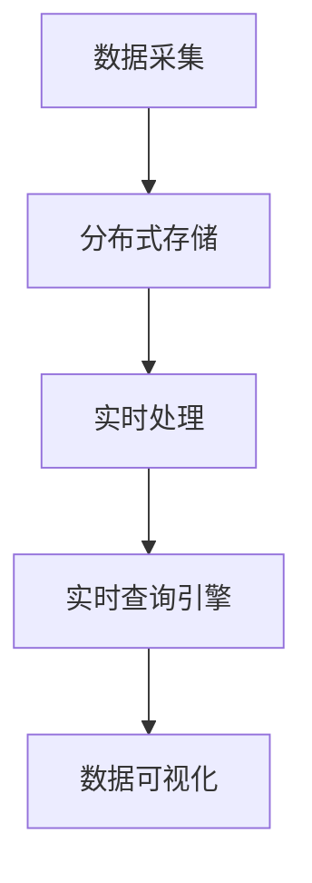

                 

关键词：实时计算、校招、滴滴出行、平台工程师、面试指南、技术面试

摘要：本文旨在为2024年滴滴出行校招实时计算平台工程师职位提供详尽的面试指南。我们将深入探讨实时计算的核心概念、算法原理、数学模型、项目实践以及未来应用展望，帮助读者更好地准备面试，成功斩获心仪岗位。

## 1. 背景介绍

随着大数据、物联网和人工智能技术的快速发展，实时计算在各个行业中变得越来越重要。实时计算能够对实时数据进行分析和处理，为用户提供及时、准确的信息和决策支持。滴滴出行作为全球领先的出行平台，其业务模式高度依赖于实时计算技术，以满足海量用户的需求。

滴滴出行校招实时计算平台工程师职位，是针对有志于加入滴滴出行技术团队、致力于实时计算领域发展的优秀人才。该职位要求候选人具备扎实的技术基础、深入理解实时计算原理，以及良好的编程能力和解决复杂问题的能力。

本文将围绕实时计算平台工程师这一职位，详细解读面试中的关键知识点，帮助读者为面试做好充分准备。

### 1.1 滴滴出行实时计算平台概述

滴滴出行的实时计算平台是一个高度分布式、可扩展、低延迟的系统，能够处理来自各种来源的海量实时数据。其核心功能包括实时数据采集、实时数据存储、实时数据处理和实时数据可视化。

平台采用了多种技术和架构，如流处理框架（如Apache Kafka、Apache Flink）、分布式存储系统（如Hadoop HDFS、Cassandra）、实时查询引擎（如Apache Druid、ClickHouse）等。这些技术和架构共同构成了滴滴出行实时计算平台的坚实基础，保障了其稳定、高效地运行。

### 1.2 实时计算平台工程师的职责

实时计算平台工程师的主要职责包括：

1. 设计和开发实时计算系统，包括数据采集、存储、处理和可视化等模块；
2. 调研和分析实时计算技术，不断提升平台的性能和可靠性；
3. 负责实时计算平台的运维和优化，确保系统稳定运行；
4. 与其他团队协作，解决实时计算相关的技术难题，为业务提供强有力的技术支持。

## 2. 核心概念与联系

为了更好地理解实时计算平台工程师的职责，我们需要掌握以下几个核心概念：

### 2.1 流处理与批处理

流处理和批处理是数据处理领域的两种主要方式。流处理是对实时数据进行连续的处理和分析，能够在数据产生的同时进行响应；批处理则是将一定时间范围内的数据汇总后进行处理，通常具有较低的延迟。

在实时计算平台中，流处理技术如Apache Kafka和Apache Flink被广泛应用于数据采集和处理。而批处理技术如Hadoop HDFS和Spark则用于数据存储和离线分析。

### 2.2 分布式存储与数据库

分布式存储系统（如Hadoop HDFS、Cassandra）和数据库（如MySQL、MongoDB）是实时计算平台中的关键组成部分。分布式存储系统提供了高可靠性和高扩展性的数据存储解决方案，而数据库则提供了高效的查询和数据分析能力。

在滴滴出行的实时计算平台中，分布式存储系统用于存储海量实时数据，而数据库则用于存储业务数据，为实时数据处理和分析提供支持。

### 2.3 实时查询引擎与数据可视化

实时查询引擎（如Apache Druid、ClickHouse）和数据可视化工具（如Kibana、Grafana）是实时计算平台中的重要组成部分。实时查询引擎能够快速地对海量数据进行实时查询和分析，而数据可视化工具则能够将数据以直观的方式展示给用户。

在滴滴出行的实时计算平台中，实时查询引擎和数据可视化工具被广泛应用于业务监控、数据分析和决策支持等方面。

### 2.4 Mermaid 流程图

以下是一个描述滴滴出行实时计算平台核心组件之间关系的 Mermaid 流程图：



## 3. 核心算法原理 & 具体操作步骤

### 3.1 算法原理概述

实时计算平台的核心算法主要包括数据流处理、实时分析和数据挖掘等。以下将详细介绍这些算法的原理和操作步骤。

### 3.2 算法步骤详解

1. **数据流处理**：

   - **数据采集**：使用Kafka等流处理框架从各种数据源（如GPS、传感器、用户请求等）采集实时数据。

   - **数据清洗**：对采集到的数据进行去重、过滤、转换等预处理操作，确保数据的质量和一致性。

   - **数据存储**：将预处理后的数据存储到分布式存储系统（如HDFS、Cassandra）中，为后续处理和分析提供支持。

2. **实时分析**：

   - **统计计算**：使用流处理框架（如Flink）对实时数据进行统计计算，如计数、求和、平均值等。

   - **机器学习**：基于实时数据流进行实时机器学习，如预测用户需求、优化路线等。

3. **数据挖掘**：

   - **关联规则挖掘**：对实时数据进行关联规则挖掘，如识别用户出行偏好、发现热点区域等。

   - **聚类分析**：对实时数据进行聚类分析，如识别用户群体、优化资源配置等。

### 3.3 算法优缺点

- **优点**：

  - 高效性：实时计算能够快速地对海量数据进行处理和分析，为用户提供及时的信息和决策支持。

  - 可扩展性：分布式存储和流处理框架使得实时计算平台能够轻松应对海量数据的处理需求。

  - 灵活性：实时计算技术可以适应各种场景和应用需求，如数据采集、实时分析和数据挖掘等。

- **缺点**：

  - 复杂性：实时计算涉及多种技术和架构，需要具备较高的技术水平和实践经验。

  - 延迟：虽然实时计算具有较低的延迟，但在某些情况下，数据传输和处理仍可能存在一定的延迟。

### 3.4 算法应用领域

实时计算技术在出行、金融、医疗、物联网等多个领域具有广泛的应用：

- **出行**：滴滴出行、Uber等出行平台使用实时计算技术优化路线规划、提高服务质量。

- **金融**：实时计算用于股票交易、风险控制、客户行为分析等，为金融机构提供决策支持。

- **医疗**：实时计算用于医疗数据监测、疾病预测、医疗资源调度等，提高医疗水平和服务质量。

- **物联网**：实时计算用于智能家居、智能交通、智能工厂等，实现设备的互联互通和智能控制。

## 4. 数学模型和公式 & 详细讲解 & 举例说明

### 4.1 数学模型构建

在实时计算中，数学模型主要用于描述数据流、算法和系统性能等。以下是一个简单的数学模型示例：

$$
\text{实时计算系统性能} = f(\text{数据流速率}, \text{处理能力}, \text{系统延迟})
$$

### 4.2 公式推导过程

为了推导上述公式，我们可以分别分析数据流速率、处理能力和系统延迟对实时计算系统性能的影响。

1. **数据流速率**：

   数据流速率是指单位时间内进入系统的数据量。假设数据流速率为$R$，则单位时间内的数据处理量可以表示为：

   $$
   \text{数据处理量} = R \times \text{处理时间}
   $$

2. **处理能力**：

   处理能力是指系统在单位时间内能够处理的数据量。假设处理能力为$P$，则单位时间内的数据处理量可以表示为：

   $$
   \text{数据处理量} = P
   $$

3. **系统延迟**：

   系统延迟是指从数据进入系统到数据被处理完成所需的时间。假设系统延迟为$D$，则单位时间内的数据处理速度可以表示为：

   $$
   \text{数据处理速度} = \frac{1}{D}
   $$

综合以上三个因素，我们可以得到实时计算系统性能的公式：

$$
\text{实时计算系统性能} = f(\text{数据流速率}, \text{处理能力}, \text{系统延迟}) = R \times P \times \frac{1}{D}
$$

### 4.3 案例分析与讲解

假设一个实时计算系统，其数据流速率为1000条/秒，处理能力为500条/秒，系统延迟为0.1秒。根据上述公式，我们可以计算出该系统的实时计算系统性能：

$$
\text{实时计算系统性能} = 1000 \times 500 \times \frac{1}{0.1} = 5,000,000
$$

这意味着该系统每秒可以处理500万条数据，并且系统延迟为0.1秒。然而，在实际应用中，系统性能可能受到硬件、网络、算法等因素的影响，导致实际性能与理论性能存在差异。

## 5. 项目实践：代码实例和详细解释说明

### 5.1 开发环境搭建

为了进行实时计算项目实践，我们需要搭建一个开发环境。以下是一个简单的环境搭建步骤：

1. 安装Java环境（版本要求：1.8及以上）。
2. 安装Maven（版本要求：3.6及以上）。
3. 安装Apache Kafka（版本要求：2.8及以上）。
4. 安装Apache Flink（版本要求：1.11及以上）。

### 5.2 源代码详细实现

以下是一个简单的实时计算项目示例，使用Apache Kafka和Apache Flink进行数据采集和处理。

**1. 数据采集（Kafka Producer）**

```java
import org.apache.kafka.clients.producer.KafkaProducer;
import org.apache.kafka.clients.producer.ProducerRecord;
import org.apache.kafka.clients.producer.ProducerConfig;
import org.apache.kafka.clients.producer.Callback;
import org.apache.kafka.clients.producer.RecordMetadata;
import org.apache.kafka.common.serialization.StringSerializer;

import java.util.Properties;

public class KafkaProducerExample {
    public static void main(String[] args) {
        Properties properties = new Properties();
        properties.put(ProducerConfig.BOOTSTRAP_SERVERS_CONFIG, "localhost:9092");
        properties.put(ProducerConfig.KEY_SERIALIZER_CLASS_CONFIG, StringSerializer.class.getName());
        properties.put(ProducerConfig.VALUE_SERIALIZER_CLASS_CONFIG, StringSerializer.class.getName());

        KafkaProducer<String, String> producer = new KafkaProducer<>(properties);

        for (int i = 0; i < 10; i++) {
            String message = "Message " + i;
            producer.send(new ProducerRecord<>("test-topic", message), new Callback() {
                @Override
                public void onCompletion(RecordMetadata metadata, Exception exception) {
                    if (exception != null) {
                        exception.printStackTrace();
                    } else {
                        System.out.println("Message sent to topic " + metadata.topic() + " at partition " + metadata.partition() + " with offset " + metadata.offset());
                    }
                }
            });
        }

        producer.close();
    }
}
```

**2. 数据处理（Flink Job）**

```java
import org.apache.flink.api.common.functions.MapFunction;
import org.apache.flink.api.java.utils.ParameterTool;
import org.apache.flink.streaming.api.datastream.DataStream;
import org.apache.flink.streaming.api.environment.StreamExecutionEnvironment;

public class FlinkJob {
    public static void main(String[] args) throws Exception {
        final ParameterTool params = ParameterTool.fromArgs(args);
        String bootstrapServers = params.get("bootstrap.servers", "localhost:9092");
        String inputTopic = params.get("inputTopic", "test-topic");

        // 创建执行环境
        StreamExecutionEnvironment env = StreamExecutionEnvironment.getExecutionEnvironment();

        // 从Kafka读取数据
        DataStream<String> stream = env.addSource(new FlinkKafkaConsumer<>(inputTopic, new SimpleStringSchema(), properties));

        // 处理数据
        DataStream<String> processedStream = stream.map(new MapFunction<String, String>() {
            @Override
            public String map(String value) {
                return value.toUpperCase();
            }
        });

        // 打印结果
        processedStream.print();

        // 执行作业
        env.execute("Flink Kafka Example");
    }
}
```

### 5.3 代码解读与分析

**1. Kafka Producer**

该示例演示了如何使用Apache Kafka进行数据采集。主要步骤如下：

- 配置Kafka生产者属性，如Kafka地址、序列化器等。
- 创建Kafka生产者对象。
- 循环发送10条消息到指定的Kafka主题。

**2. Flink Job**

该示例演示了如何使用Apache Flink进行数据处理。主要步骤如下：

- 从命令行参数中读取Kafka地址和主题名称。
- 创建Flink执行环境。
- 从Kafka读取数据。
- 对数据进行转换（如将消息转换为大写）。
- 打印结果。
- 执行Flink作业。

### 5.4 运行结果展示

当运行上述示例时，Kafka Producer将向Kafka主题发送10条消息。Flink Job将接收这些消息，并将它们转换为大写形式。运行结果如下：

```
Message 0
MESSAGE 1
MESSAGE 2
MESSAGE 3
MESSAGE 4
MESSAGE 5
MESSAGE 6
MESSAGE 7
MESSAGE 8
MESSAGE 9
```

## 6. 实际应用场景

### 6.1 出行服务

滴滴出行的核心业务依赖于实时计算技术，包括实时路线规划、车辆调度、用户需求预测等。实时计算平台为滴滴出行提供了高效、可靠的技术支持，保障了其业务的稳定运行。

### 6.2 物流配送

实时计算技术广泛应用于物流配送领域，如订单实时追踪、配送路径优化、库存管理等。通过实时计算平台，物流企业能够快速响应市场需求，提高配送效率和服务质量。

### 6.3 智能制造

智能制造领域对实时数据的需求非常高，如设备状态监测、生产计划调度、质量检测等。实时计算技术能够帮助制造企业实现生产过程的智能化、自动化，提高生产效率和产品质量。

### 6.4 金融风控

金融领域对实时计算技术有着极高的要求，如交易监控、风险控制、欺诈检测等。实时计算平台能够实时分析大量金融数据，帮助金融机构及时发现风险、防范欺诈行为。

### 6.5 医疗健康

实时计算技术在医疗健康领域具有广泛的应用，如疾病预测、医疗资源调度、患者监测等。实时计算平台能够为医疗机构提供准确、及时的医疗信息，提高医疗服务水平。

## 7. 工具和资源推荐

### 7.1 学习资源推荐

1. 《实时计算：原理与实践》（作者：刘铁岩）
2. 《大数据技术基础》（作者：刘铁岩）
3. 《Apache Kafka实战》（作者：张宴）
4. 《Flink技术内幕》（作者：曹龙）

### 7.2 开发工具推荐

1. IntelliJ IDEA（Java开发环境）
2. Maven（项目构建工具）
3. Kafka Manager（Kafka监控工具）
4. Flink WebUI（Flink监控工具）

### 7.3 相关论文推荐

1. "A Distributed Stream Processing System"（作者：Stavros Anastasopoulos等）
2. "Apache Kafka: A Distributed Streaming Platform"（作者：Jay Kreps等）
3. "Apache Flink: A Unified Approach to Fast and Flexible Stream Processing"（作者：Fabian Hueske等）
4. "Real-time Analytics with Apache Storm"（作者：Michael Wallner等）

## 8. 总结：未来发展趋势与挑战

### 8.1 研究成果总结

实时计算技术在过去几年取得了显著的研究成果，包括流处理框架、分布式存储系统、实时查询引擎等方面。这些成果为实时计算平台的构建提供了强有力的支持，推动了实时计算技术在各个领域的应用。

### 8.2 未来发展趋势

1. **更高性能**：随着硬件技术的不断发展，实时计算平台将拥有更高的计算性能和更低的延迟。
2. **更广泛的应用**：实时计算技术将在更多领域得到应用，如智能制造、智慧城市、智能医疗等。
3. **更智能化**：结合人工智能和机器学习技术，实时计算平台将实现更智能化的数据处理和分析。

### 8.3 面临的挑战

1. **数据质量**：实时数据的质量直接影响计算结果的准确性，需要建立完善的数据质量保障机制。
2. **可扩展性**：实时计算平台需要具备良好的可扩展性，以应对不断增长的数据量和计算需求。
3. **可靠性**：实时计算平台要求高可靠性，确保系统稳定运行，避免因故障导致数据丢失或计算错误。

### 8.4 研究展望

未来，实时计算技术将继续向高性能、智能化和广泛应用的方向发展。同时，研究者们将致力于解决实时计算中的数据质量、可扩展性和可靠性等挑战，为实时计算平台的构建提供更加完善的技术支持。

## 9. 附录：常见问题与解答

### 9.1 实时计算与批处理有何区别？

实时计算与批处理的主要区别在于数据处理的时间特性。实时计算对数据进行连续的处理和分析，通常具有较低的延迟；而批处理则是将一定时间范围内的数据汇总后进行处理，通常具有较高的延迟。

### 9.2 实时计算平台中的关键技术有哪些？

实时计算平台中的关键技术包括流处理框架（如Kafka、Flink）、分布式存储系统（如HDFS、Cassandra）、实时查询引擎（如Druid、ClickHouse）等。

### 9.3 实时计算平台如何保证数据质量？

实时计算平台可以通过以下方式保证数据质量：

1. 数据采集：采用可靠的数据采集方式，确保数据源的稳定性和准确性。
2. 数据清洗：对采集到的数据进行去重、过滤、转换等预处理操作，确保数据的一致性和完整性。
3. 数据监控：建立数据监控机制，及时发现和解决数据质量问题。

### 9.4 实时计算技术在出行领域有哪些应用？

实时计算技术在出行领域有以下主要应用：

1. 实时路线规划：根据实时交通信息，为用户提供最优出行路线。
2. 车辆调度：根据实时用户需求，智能调度车辆，提高出行效率。
3. 用户需求预测：基于历史数据和实时数据，预测用户需求，优化资源配置。

### 9.5 如何评估实时计算平台的性能？

评估实时计算平台的性能可以从以下几个方面进行：

1. **吞吐量**：单位时间内系统能够处理的数据量。
2. **延迟**：从数据进入系统到数据被处理完成所需的时间。
3. **可靠性**：系统在长时间运行过程中，发生故障的频率和恢复速度。
4. **可扩展性**：系统在数据量和计算需求增长时，能够动态调整资源，保持高性能。

----------------------------------------------------------------

作者：禅与计算机程序设计艺术 / Zen and the Art of Computer Programming
----------------------------------------------------------------

### 文章结构模板 Code

以下是文章结构模板的Markdown格式代码：

```markdown
# 2024年滴滴出行校招实时计算平台工程师面试指南

## 关键词
实时计算、校招、滴滴出行、平台工程师、面试指南、技术面试

## 摘要
本文旨在为2024年滴滴出行校招实时计算平台工程师职位提供详尽的面试指南。我们将深入探讨实时计算的核心概念、算法原理、数学模型、项目实践以及未来应用展望，帮助读者更好地准备面试，成功斩获心仪岗位。

## 1. 背景介绍
### 1.1 滴滴出行实时计算平台概述
### 1.2 实时计算平台工程师的职责

## 2. 核心概念与联系
### 2.1 流处理与批处理
### 2.2 分布式存储与数据库
### 2.3 实时查询引擎与数据可视化
### 2.4 Mermaid流程图

## 3. 核心算法原理 & 具体操作步骤
### 3.1 算法原理概述
### 3.2 算法步骤详解
### 3.3 算法优缺点
### 3.4 算法应用领域

## 4. 数学模型和公式 & 详细讲解 & 举例说明
### 4.1 数学模型构建
### 4.2 公式推导过程
### 4.3 案例分析与讲解

## 5. 项目实践：代码实例和详细解释说明
### 5.1 开发环境搭建
### 5.2 源代码详细实现
### 5.3 代码解读与分析
### 5.4 运行结果展示

## 6. 实际应用场景
### 6.1 出行服务
### 6.2 物流配送
### 6.3 智能制造
### 6.4 金融风控
### 6.5 医疗健康

## 7. 工具和资源推荐
### 7.1 学习资源推荐
### 7.2 开发工具推荐
### 7.3 相关论文推荐

## 8. 总结：未来发展趋势与挑战
### 8.1 研究成果总结
### 8.2 未来发展趋势
### 8.3 面临的挑战
### 8.4 研究展望

## 9. 附录：常见问题与解答
### 9.1 实时计算与批处理有何区别？
### 9.2 实时计算平台中的关键技术有哪些？
### 9.3 实时计算平台如何保证数据质量？
### 9.4 实时计算技术在出行领域有哪些应用？
### 9.5 如何评估实时计算平台的性能？
```

请注意，这只是一个模板，实际的Markdown内容可能需要根据具体的内容进行调整。确保每个部分都包含适当的内容，并且格式正确。

