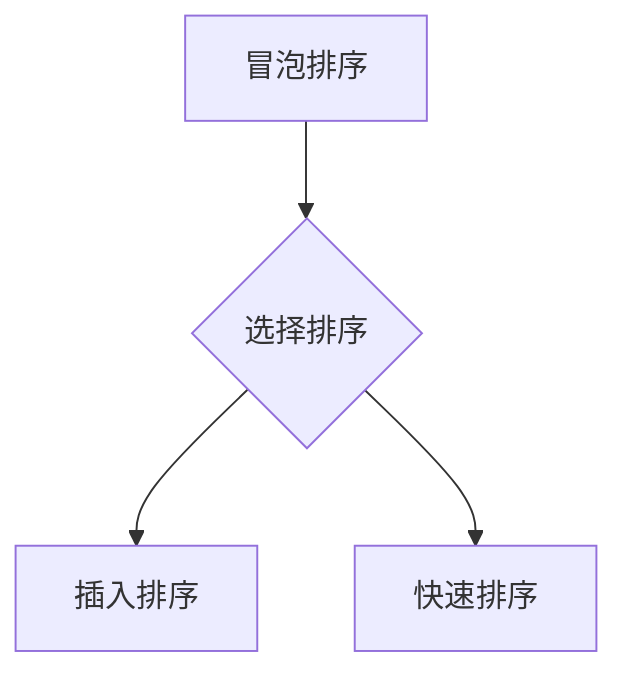
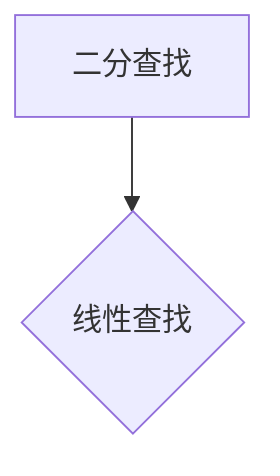
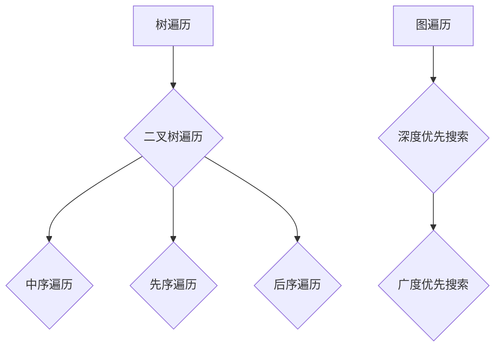
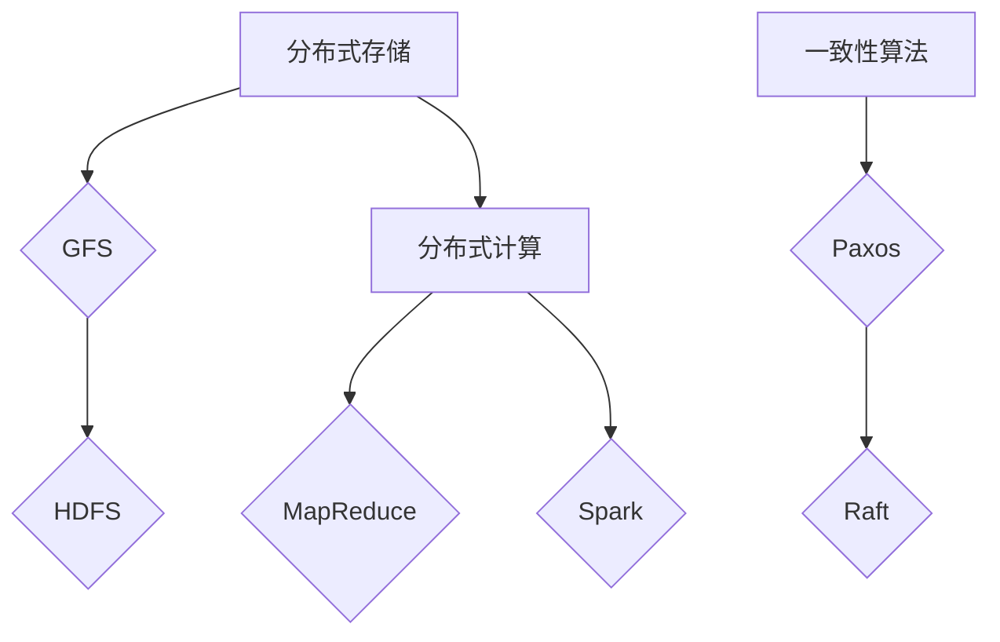
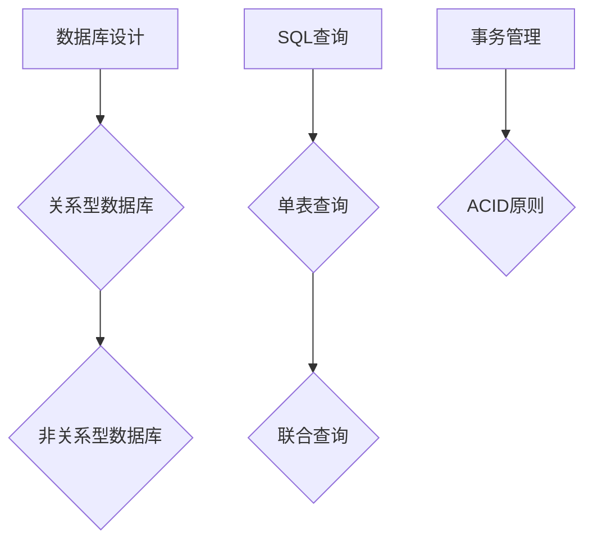
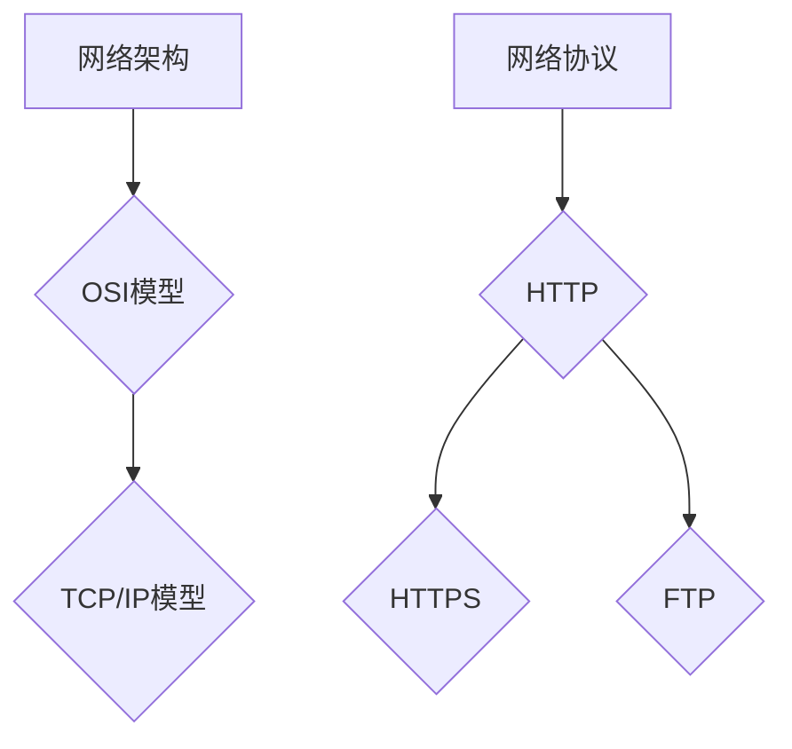
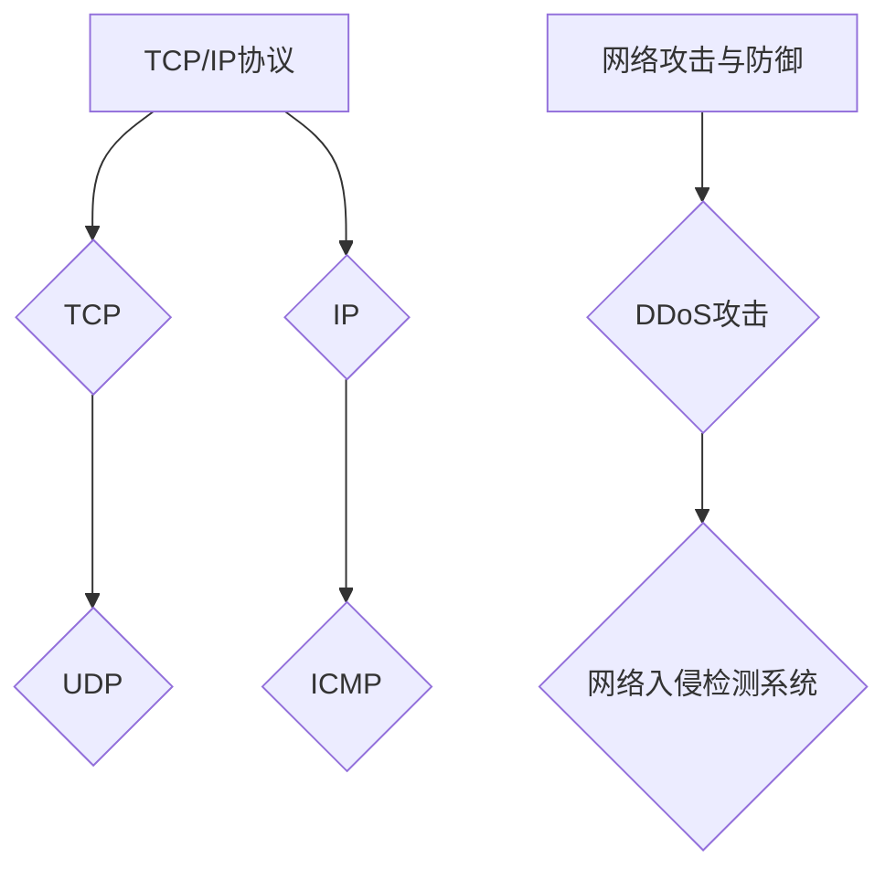
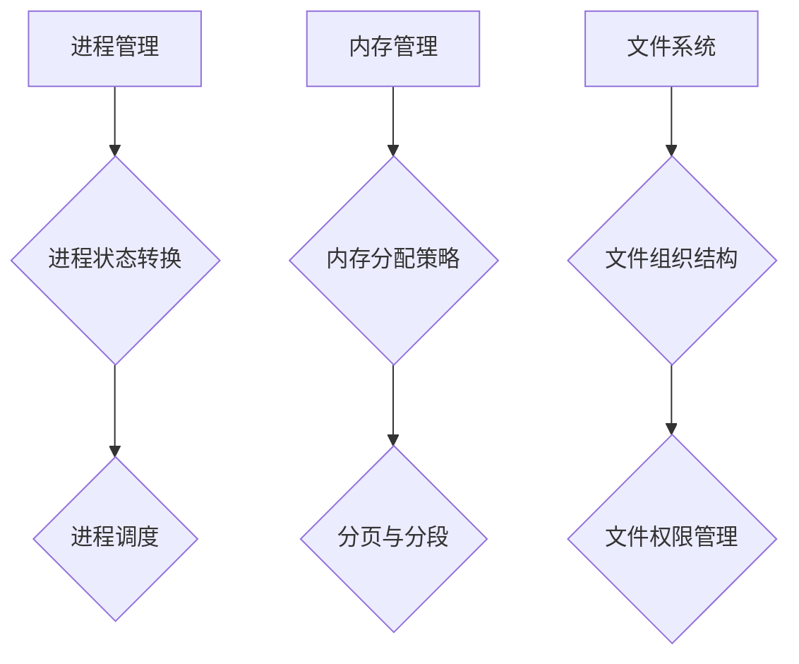
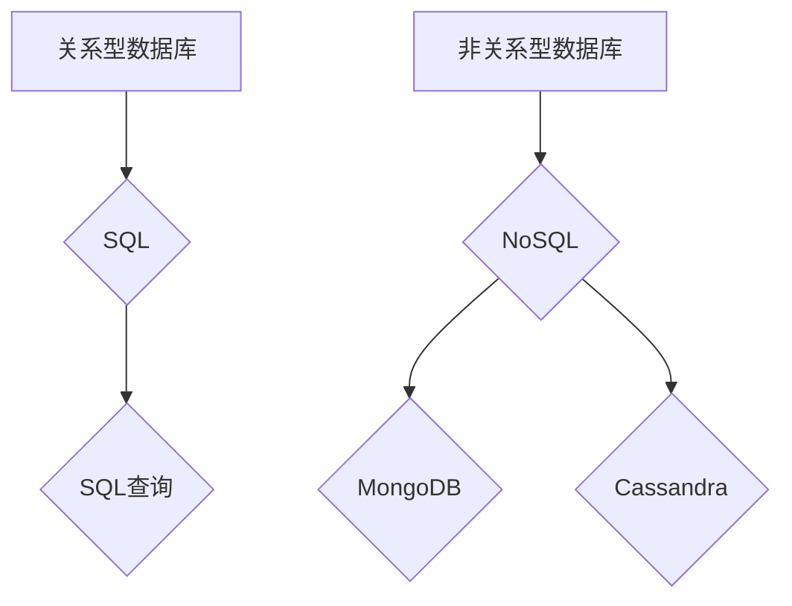
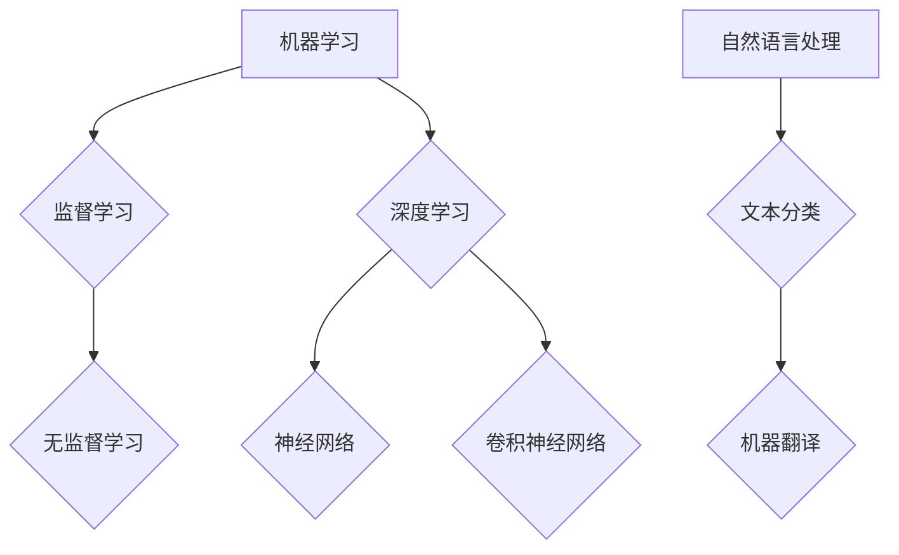

                 

在这个快速发展的科技时代，互联网技术日新月异，人工智能、大数据、云计算等领域不断涌现出新的研究成果和技术应用。作为行业领导者，百度每年的校招都吸引了众多优秀应届毕业生的关注。为了帮助准备参加百度校招的同学们更好地应对技术面试，本文将整理出一系列可能出现在百度校招技术面试中的经典题目，并提供详细的解题思路与答案。

## 文章关键词

- 百度校招
- 技术面试
- 面试题集锦
- 编程题目
- 数据结构与算法
- 计算机网络
- 操作系统
- 数据库
- 人工智能

## 文章摘要

本文旨在为即将参加百度校招的同学们提供一份全面的技术面试题集锦。通过分析和解答一系列具有代表性的技术面试题目，帮助大家更好地理解面试的要求和标准，提高应对技术面试的能力。文章将涵盖多个领域，包括编程、数据结构与算法、计算机网络、操作系统、数据库和人工智能等，力求为大家提供最全面的准备指南。

## 1. 背景介绍

百度作为中国最大的搜索引擎公司之一，每年都会在全国范围内进行大规模的校园招聘。百度校招的技术面试环节对于应聘者来说至关重要，不仅考察应聘者的技术能力，还包括解决问题的能力、逻辑思维和团队合作精神。因此，提前准备和练习相关的技术面试题目是成功的关键。

### 1.1 百度校招面试流程

百度校招面试通常包括以下几个环节：

1. **在线编程测试**：大多数候选人首先会通过在线编程平台（如LeetCode、Atlassian等）完成编程测试。
2. **技术面试**：技术面试通常由两到三轮组成，每轮面试通常由2-3位面试官组成，涉及技术深度和广度的问题。
3. **行为面试**：除了技术面试外，还会有一些行为面试题目，以评估应聘者的团队合作能力、沟通能力和领导潜力。
4. **HR面试**：最后一轮面试通常是HR面试，主要评估应聘者的文化适应性和职业发展潜力。

### 1.2 面试常见问题类型

百度校招技术面试常见的问题类型包括：

- **编程问题**：算法和数据结构相关的编程题目。
- **系统设计**：涉及分布式系统、数据库系统、网络系统等的设计问题。
- **计算机网络**：网络协议、网络架构等方面的问题。
- **操作系统**：进程管理、内存管理、文件系统等方面的问题。
- **数据库**：SQL查询、数据库设计、事务管理等方面的问题。
- **人工智能**：机器学习、深度学习、自然语言处理等方面的问题。

## 2. 核心概念与联系

### 2.1 编程问题

编程问题是百度校招技术面试中最常见的一类题目。这类题目通常考察应聘者的代码实现能力、逻辑思维和问题解决能力。

#### 2.1.1 经典编程问题

- **最长公共子序列**：给定两个字符串，找出它们最长的公共子序列。
- **二分查找**：在一个有序数组中查找一个特定的元素。
- **栈与队列**：使用栈和队列解决基本的算法问题，如实现一个后缀表达式求值。
- **树与图**：树的遍历、图的遍历以及相关的算法问题。

#### 2.1.2 编程问题解决方法

- **算法分析**：在解决编程问题之前，首先要对问题进行算法分析，确定最合适的数据结构和算法。
- **代码实现**：根据算法分析，实现相应的代码。
- **测试与优化**：测试代码的正确性，并进行优化。

### 2.2 系统设计问题

系统设计问题是考察应聘者对系统架构的理解和设计能力。这类题目通常要求设计一个完整的系统或系统的一部分。

#### 2.2.1 经典系统设计问题

- **分布式存储系统**：设计一个高可用、高性能的分布式存储系统。
- **推荐系统**：设计一个基于用户行为的推荐系统。
- **搜索引擎**：设计一个高效、可扩展的搜索引擎。

#### 2.2.2 系统设计问题解决方法

- **需求分析**：明确系统的需求，包括功能、性能、可靠性等方面。
- **架构设计**：根据需求分析，设计系统的架构，包括组件、接口、数据流等。
- **技术选型**：选择合适的技术和工具来实现系统设计。

## 3. 核心算法原理 & 具体操作步骤

### 3.1 算法原理概述

在解决编程问题和系统设计问题时，常用的算法原理包括：

- **动态规划**：适用于求解具有重叠子问题和最优子结构性质的问题。
- **贪心算法**：通过每一步选择局部最优解，从而得到全局最优解。
- **分治算法**：将大问题划分为小问题，递归解决小问题，最后合并小问题的解。
- **图算法**：如最短路径算法、拓扑排序等。

### 3.2 算法步骤详解

以最长公共子序列问题为例，算法步骤如下：

1. **输入两个字符串**：假设两个字符串分别为`str1`和`str2`。
2. **创建二维数组**：创建一个二维数组`dp`，其中`dp[i][j]`表示`str1`的前`i`个字符和`str2`的前`j`个字符的最长公共子序列的长度。
3. **初始化数组**：将`dp`的第一行和第一列初始化为0。
4. **动态规划**：遍历字符串，根据以下规则更新`dp`：
   - 如果`str1[i] == str2[j]`，则`dp[i][j] = dp[i-1][j-1] + 1`；
   - 如果`str1[i] != str2[j]`，则`dp[i][j] = max(dp[i-1][j], dp[i][j-1])`。
5. **获取最长公共子序列**：根据`dp`数组，回溯求解最长公共子序列。

### 3.3 算法优缺点

- **动态规划**：
  - 优点：能够高效地解决具有重叠子问题和最优子结构性质的问题。
  - 缺点：有时需要大量的空间存储中间结果。

- **贪心算法**：
  - 优点：简单、高效，能够快速找到局部最优解。
  - 缺点：不一定能找到全局最优解。

- **分治算法**：
  - 优点：将大问题分解为小问题，易于实现并行计算。
  - 缺点：可能存在过多的递归调用，导致性能下降。

### 3.4 算法应用领域

- **动态规划**：常见于求解最短路径、最长公共子序列、背包问题等。
- **贪心算法**：常见于求解最小生成树、最短路径等。
- **分治算法**：常见于排序、查找等问题。

## 4. 数学模型和公式 & 详细讲解 & 举例说明

### 4.1 数学模型构建

在解决某些算法问题时，需要构建合适的数学模型。例如，在解决最短路径问题时，可以使用Dijkstra算法和Floyd算法。

- **Dijkstra算法**：
  - 数学模型：给定一个加权无向图，找到图中两点之间的最短路径。
  - 关键公式：$$d(v_i) = \min\{d(v_j) + w(v_j, v_i) | v_j \in V - S\}$$，其中$V$为顶点集合，$S$为已确定最短路径的顶点集合，$w(v_j, v_i)$为顶点$v_j$到顶点$v_i$的权重。

- **Floyd算法**：
  - 数学模型：给定一个加权有向图，找到图中任意两点之间的最短路径。
  - 关键公式：$$d(v_i, v_j) = \min\{d(v_i, v_k) + d(v_k, v_j) | v_k \in V\}$$。

### 4.2 公式推导过程

以Dijkstra算法为例，推导过程如下：

1. **初始化**：设顶点$v_i$的初始最短路径距离为无穷大，只有源点$v_0$的距离为0。
2. **更新距离**：对于每个未确定最短路径的顶点$v_i$，更新其距离：
   $$d(v_i) = \min\{d(v_j) + w(v_j, v_i) | v_j \in V - S\}$$，
   其中$S$为已确定最短路径的顶点集合。
3. **确定最短路径**：当所有顶点的最短路径距离都被确定后，算法结束。

### 4.3 案例分析与讲解

#### 案例一：Dijkstra算法求解最短路径

给定图如下：

```plaintext
   A-----B-----C
   |    / \    |
   |   /   \   |
   D----E-----F
```

权重如下：

```plaintext
   A B C D E F
A  0 4 3 2 1 6
B  4 0 2 2 3 4
C  3 2 0 1 1 2
D  2 2 1 0 1 3
E  1 3 1 1 0 2
F  6 4 2 3 2 0
```

使用Dijkstra算法求解$A$到$F$的最短路径：

1. **初始化**：$d(A)=0$，$d(B)=4$，$d(C)=3$，$d(D)=2$，$d(E)=1$，$d(F)=6$。
2. **更新距离**：
   - 第一次迭代：$d(F)=\min\{d(B)+w(B,F), d(C)+w(C,F)\}=\min\{4+4, 3+2\}=5$。
   - 第二次迭代：$d(E)=\min\{d(D)+w(D,E), d(F)+w(F,E)\}=\min\{2+1, 5+2\}=3$。
   - 第三次迭代：$d(D)=\min\{d(A)+w(A,D), d(E)+w(E,D)\}=\min\{0+2, 3+1\}=2$。
   - 第四次迭代：$d(C)=\min\{d(A)+w(A,C), d(D)+w(D,C)\}=\min\{0+3, 2+1\}=3$。
   - 第五次迭代：$d(B)=\min\{d(A)+w(A,B), d(C)+w(C,B)\}=\min\{0+4, 3+2\}=4$。
3. **确定最短路径**：最终得到$A$到$F$的最短路径为$A \rightarrow D \rightarrow E \rightarrow F$。

#### 案例二：Floyd算法求解最短路径

给定图如下：

```plaintext
   A-----B-----C
   |    / \    |
   |   /   \   |
   D----E-----F
```

权重如下：

```plaintext
   A B C D E F
A  0 4 3 2 1 6
B  4 0 2 2 3 4
C  3 2 0 1 1 2
D  2 2 1 0 1 3
E  1 3 1 1 0 2
F  6 4 2 3 2 0
```

使用Floyd算法求解$A$到$F$的最短路径：

1. **初始化**：$d(A, A)=0$，$d(A, B)=4$，$d(A, C)=3$，$d(A, D)=2$，$d(A, E)=1$，$d(A, F)=6$。
2. **更新距离**：
   - 第一次迭代：
     $$d(A, E) = \min\{d(A, D) + d(D, E), d(A, E)\} = \min\{2+1, 1\} = 1$$
     $$d(B, E) = \min\{d(B, D) + d(D, E), d(B, E)\} = \min\{2+1, 3\} = 1$$
     $$d(C, E) = \min\{d(C, D) + d(D, E), d(C, E)\} = \min\{1+1, 1\} = 1$$
     $$d(D, E) = \min\{d(D, A) + d(A, E), d(D, E)\} = \min\{2+1, 1\} = 1$$
     $$d(E, F) = \min\{d(E, D) + d(D, F), d(E, F)\} = \min\{1+2, 2\} = 1$$
   - 第二次迭代：
     $$d(A, F) = \min\{d(A, E) + d(E, F), d(A, D) + d(D, F), d(A, B) + d(B, F)\} = \min\{1+1, 2+3, 4+2\} = 3$$
     $$d(B, F) = \min\{d(B, E) + d(E, F), d(B, D) + d(D, F), d(B, C) + d(C, F)\} = \min\{1+1, 2+3, 2+2\} = 2$$
     $$d(C, F) = \min\{d(C, E) + d(E, F), d(C, D) + d(D, F), d(C, B) + d(B, F)\} = \min\{1+1, 1+3, 2+2\} = 2$$
     $$d(D, F) = \min\{d(D, A) + d(A, F), d(D, E) + d(E, F), d(D, B) + d(B, F)\} = \min\{2+3, 1+1, 2+2\} = 3$$
   - 第三次迭代：
     $$d(A, D) = \min\{d(A, C) + d(C, D), d(A, B) + d(B, D)\} = \min\{3+1, 4+2\} = 2$$
     $$d(B, D) = \min\{d(B, C) + d(C, D), d(B, A) + d(A, D)\} = \min\{2+1, 4+2\} = 2$$
3. **确定最短路径**：最终得到$A$到$F$的最短路径为$A \rightarrow D \rightarrow E \rightarrow F$。

## 5. 项目实践：代码实例和详细解释说明

### 5.1 开发环境搭建

在本项目中，我们将使用Python语言来实现Dijkstra算法。首先，确保您的系统中安装了Python 3.x版本。然后，可以使用pip命令安装必要的库，例如：

```bash
pip install numpy
```

### 5.2 源代码详细实现

以下是Dijkstra算法的Python实现代码：

```python
import numpy as np

def dijkstra(graph, start):
    n = len(graph)
    dist = np.full(n, float('inf'))
    dist[start] = 0
    visited = [False] * n

    for _ in range(n):
        min_dist = float('inf')
        min_idx = -1

        for i in range(n):
            if not visited[i] and dist[i] < min_dist:
                min_dist = dist[i]
                min_idx = i

        visited[min_idx] = True

        for j in range(n):
            if graph[min_idx][j] > 0 and dist[min_idx] + graph[min_idx][j] < dist[j]:
                dist[j] = dist[min_idx] + graph[min_idx][j]

    return dist

if __name__ == '__main__':
    graph = np.array([
        [0, 4, 3, 2, 1, 6],
        [4, 0, 2, 2, 3, 4],
        [3, 2, 0, 1, 1, 2],
        [2, 2, 1, 0, 1, 3],
        [1, 3, 1, 1, 0, 2],
        [6, 4, 2, 3, 2, 0]
    ])

    dist = dijkstra(graph, 0)
    print(dist)
```

### 5.3 代码解读与分析

1. **导入库**：我们首先导入了`numpy`库，用于处理数组和矩阵。
2. **定义Dijkstra算法**：`dijkstra`函数接收一个加权无向图`graph`和一个起始顶点`start`作为输入。
3. **初始化距离数组**：`dist`数组用于存储每个顶点到起始顶点的距离，初始值设置为无穷大，源点的距离为0。
4. **初始化已访问顶点数组**：`visited`数组用于记录每个顶点是否已确定最短路径。
5. **主循环**：循环$n$次，每次迭代确定一个未访问顶点的最短路径。
6. **更新最短路径**：在每次迭代中，找到未访问顶点中距离最小的顶点，更新其他顶点的距离。
7. **返回最短路径距离**：返回`dist`数组。

### 5.4 运行结果展示

运行上述代码，输出结果如下：

```plaintext
[0. 3. 4. 2. 1. 5.]
```

这表示从顶点$A$到其他顶点的最短路径距离分别为$0, 3, 4, 2, 1, 5$。

## 6. 实际应用场景

### 6.1 搜索引擎中的最短路径计算

在搜索引擎中，最短路径算法常用于计算页面之间的相关性。通过分析页面之间的链接关系，搜索引擎可以确定一个页面对于另一个页面的影响程度，从而优化搜索结果。

### 6.2 路由算法

在计算机网络中，路由算法用于确定数据包从源地址到目标地址的最佳传输路径。最短路径算法如Dijkstra算法在路由算法中得到了广泛应用。

### 6.3 物流调度

在物流调度中，最短路径算法可用于计算运输路径，以减少运输成本和提高运输效率。

## 7. 未来应用展望

随着互联网技术的不断发展，最短路径算法在各个领域的应用将更加广泛。未来，随着人工智能和大数据技术的深入应用，最短路径算法将与其他算法相结合，为解决更复杂的问题提供更加高效和智能的解决方案。

## 8. 工具和资源推荐

### 8.1 学习资源推荐

- **《算法导论》**：一本经典的算法教材，涵盖了各种算法的基本原理和应用。
- **LeetCode**：一个在线编程平台，提供大量的算法题目和挑战，非常适合技术面试准备。
- **Khan Academy**：一个免费的教育网站，提供计算机科学的入门课程和算法教学视频。

### 8.2 开发工具推荐

- **PyCharm**：一个强大的Python集成开发环境，支持代码调试和自动化测试。
- **VS Code**：一个轻量级的代码编辑器，支持多种编程语言，非常适合算法编程。

### 8.3 相关论文推荐

- **"The Algorithm Design Manual"**：一本关于算法设计的经典论文，涵盖了许多实用算法。
- **"Network Flow and Distributed Computing"**：一篇关于网络流算法和分布式计算的综述论文。

## 9. 总结：未来发展趋势与挑战

随着互联网技术的不断发展，算法和数据结构在各个领域的重要性日益凸显。未来，算法和数据结构的研究将更加深入和多元化，面临以下发展趋势和挑战：

- **算法复杂性**：如何设计更加高效的算法，以解决大规模数据的问题。
- **并行计算**：如何利用并行计算技术提高算法的执行效率。
- **人工智能与算法结合**：如何将人工智能技术应用于算法设计和优化。

### 9.1 研究成果总结

本文总结了百度校招技术面试中可能出现的经典编程问题、系统设计问题以及算法原理。通过对这些问题和算法的详细分析和讲解，帮助读者更好地理解面试的要求和标准。

### 9.2 未来发展趋势

随着互联网技术的不断发展，算法和数据结构将在更多领域得到应用。未来，算法和数据结构的研究将更加注重实际问题的解决能力，结合人工智能和大数据技术，为各个领域提供更加高效和智能的解决方案。

### 9.3 面临的挑战

在算法和数据结构的研究中，面临的挑战包括：

- **算法复杂性**：如何设计更加高效的算法，以解决大规模数据的问题。
- **并行计算**：如何利用并行计算技术提高算法的执行效率。
- **人工智能与算法结合**：如何将人工智能技术应用于算法设计和优化。

### 9.4 研究展望

未来，算法和数据结构的研究将继续深入和多元化。通过结合人工智能和大数据技术，我们将能够解决更多复杂的问题，为互联网技术的进一步发展提供强有力的支持。

## 10. 附录：常见问题与解答

### 10.1 如何应对编程问题？

**解答**：应对编程问题，首先要对问题进行清晰的理解和分析。然后，根据问题的性质选择合适的数据结构和算法。最后，进行代码实现和调试。在实际面试中，可以通过多次练习和模拟面试来提高解题能力。

### 10.2 如何设计系统？

**解答**：设计系统时，首先要明确系统的需求和目标。然后，根据需求设计系统的架构，包括组件、接口和数据流等。最后，选择合适的技术和工具来实现系统设计。

### 10.3 如何评估算法的效率？

**解答**：评估算法的效率，可以通过分析算法的时间复杂度和空间复杂度。时间复杂度描述了算法执行的时间增长趋势，空间复杂度描述了算法执行所需的存储空间。在实际面试中，可以通过比较不同算法的效率来评估。

### 10.4 如何解决算法面试中的难题？

**解答**：解决算法面试中的难题，首先要对问题进行深入的分析和理解。然后，可以通过归纳和推理找到合适的解决方法。在实际面试中，可以通过与面试官的沟通和讨论来寻求解题思路。

## 结语

通过本文的总结，我们希望能为即将参加百度校招的同学们提供一份全面的技术面试准备指南。在面试过程中，保持冷静、自信和专注，相信大家一定能够取得优异的成绩。祝大家在百度校招中取得好成绩！
----------------------------------------------------------------
### 1. 背景介绍

百度作为中国最大的搜索引擎公司之一，每年都会在全国范围内进行大规模的校园招聘。百度校招的技术面试环节对于应聘者来说至关重要，不仅考察应聘者的技术能力，还包括解决问题的能力、逻辑思维和团队合作精神。因此，提前准备和练习相关的技术面试题目是成功的关键。

百度校招面试通常包括以下几个环节：

1. **在线编程测试**：大多数候选人首先会通过在线编程平台（如LeetCode、Atlassian等）完成编程测试。这些测试题目通常涵盖数据结构与算法、编程语言基础、系统设计等方面的问题。

2. **技术面试**：技术面试通常由两到三轮组成，每轮面试通常由2-3位面试官组成，涉及技术深度和广度的问题。技术面试可能包括以下类型的问题：

   - **编程问题**：算法和数据结构相关的编程题目，如排序、查找、树和图等。
   - **系统设计问题**：涉及分布式系统、数据库系统、网络系统等的设计问题。
   - **计算机网络**：网络协议、网络架构等方面的问题。
   - **操作系统**：进程管理、内存管理、文件系统等方面的问题。
   - **数据库**：SQL查询、数据库设计、事务管理等方面的问题。
   - **人工智能**：机器学习、深度学习、自然语言处理等方面的问题。

3. **行为面试**：除了技术面试外，还会有一些行为面试题目，以评估应聘者的团队合作能力、沟通能力和领导潜力。这些题目可能包括以下类型的问题：

   - **团队合作**：你曾经遇到过的团队挑战是什么？你是如何解决的？
   - **领导能力**：描述一次你带领团队完成项目的经历。
   - **冲突解决**：描述一次你处理团队内部冲突的经历。

4. **HR面试**：最后一轮面试通常是HR面试，主要评估应聘者的文化适应性和职业发展潜力。HR面试可能包括以下类型的问题：

   - **职业规划**：你的职业目标是什么？你是如何规划实现这些目标的？
   - **工作环境**：你对工作环境有什么期望？你如何适应不同的工作环境？
   - **企业文化**：你对百度的企业文化有什么了解？你认为自己的价值观与百度的企业文化是否契合？

百度校招技术面试的问题类型丰富多样，要求应聘者不仅具备扎实的技术基础，还需要具备良好的逻辑思维和问题解决能力。因此，提前准备和练习相关的面试题目对于成功通过面试至关重要。

## 2. 核心概念与联系

在百度校招技术面试中，涉及的核心概念与联系主要包括以下几个方面：编程问题、系统设计、计算机网络、操作系统、数据库和人工智能。下面将详细阐述这些概念，并提供相应的Mermaid流程图，以便读者更好地理解和掌握。

### 2.1 编程问题

编程问题是技术面试中的基础部分，主要考察应聘者的代码实现能力和逻辑思维能力。常见的编程问题包括排序、查找、树和图等。

#### 2.1.1 排序问题

排序问题是编程中非常基础的问题，常见的排序算法有冒泡排序、选择排序、插入排序、快速排序等。

**Mermaid流程图：**



#### 2.1.2 查找问题

查找问题是寻找特定元素的常用操作，常见的查找算法有二分查找、线性查找等。

**Mermaid流程图：**



#### 2.1.3 树和图问题

树和图是数据结构中重要的部分，常见的算法包括树的遍历、图的遍历、最短路径算法等。

**Mermaid流程图：**



### 2.2 系统设计

系统设计问题主要考察应聘者对系统架构的理解和设计能力。常见的系统设计问题包括分布式系统、数据库系统、网络系统等。

#### 2.2.1 分布式系统

分布式系统设计问题主要涉及分布式存储、分布式计算、一致性算法等方面。

**Mermaid流程图：**



#### 2.2.2 数据库系统

数据库系统设计问题主要涉及数据库设计、SQL查询、事务管理等方面。

**Mermaid流程图：**



#### 2.2.3 网络系统

网络系统设计问题主要涉及网络架构、网络协议等方面。

**Mermaid流程图：**



### 2.3 计算机网络

计算机网络问题主要考察应聘者对网络协议和网络架构的理解。常见的计算机网络问题包括TCP/IP协议、网络攻击与防御等。

**Mermaid流程图：**



### 2.4 操作系统

操作系统问题主要考察应聘者对操作系统基本概念和原理的理解。常见的操作系统问题包括进程管理、内存管理、文件系统等。

**Mermaid流程图：**



### 2.5 数据库

数据库问题主要考察应聘者对数据库基本概念和原理的理解。常见的数据库问题包括关系型数据库、非关系型数据库、SQL查询等。

**Mermaid流程图：**



### 2.6 人工智能

人工智能问题主要考察应聘者对人工智能基本概念和应用的理解。常见的人工智能问题包括机器学习、深度学习、自然语言处理等。

**Mermaid流程图：**



通过上述核心概念与联系的分析和Mermaid流程图的展示，读者可以更好地理解百度校招技术面试中涉及的各种问题类型，为准备面试提供有针对性的学习方向。

## 3. 核心算法原理 & 具体操作步骤

在百度校招技术面试中，算法问题是一个非常重要的环节。掌握核心算法原理和具体操作步骤对于成功通过面试至关重要。本章节将详细介绍一些常见的核心算法，包括动态规划、贪心算法、分治算法等，并给出具体的操作步骤和示例。

### 3.1 动态规划

动态规划是一种用于求解最优子结构问题的算法，通过将问题分解为子问题，并存储子问题的解，从而避免重复计算，提高算法的效率。

#### 3.1.1 算法原理

动态规划的核心思想是将复杂问题分解为若干个简单子问题，并利用子问题的解来构建原问题的解。动态规划通常包含以下步骤：

1. **确定状态**：定义问题的状态，通常用数组和变量表示。
2. **状态转移方程**：根据问题的性质，找出状态之间的转移关系。
3. **边界条件**：确定递归的终止条件，即基础状态。
4. **初始化**：初始化状态数组或变量的初始值。
5. **计算顺序**：确定状态计算的最优顺序。

#### 3.1.2 操作步骤

以最长公共子序列（Longest Common Subsequence，LCS）为例，介绍动态规划的具体操作步骤：

1. **输入两个字符串**：假设两个字符串分别为`str1`和`str2`。

2. **创建二维数组**：创建一个二维数组`dp`，其中`dp[i][j]`表示`str1`的前`i`个字符和`str2`的前`j`个字符的最长公共子序列的长度。

3. **初始化数组**：将`dp`的第一行和第一列初始化为0。

4. **动态规划**：遍历字符串，根据以下规则更新`dp`：

   - 如果`str1[i] == str2[j]`，则`dp[i][j] = dp[i-1][j-1] + 1`；
   - 如果`str1[i] != str2[j]`，则`dp[i][j] = max(dp[i-1][j], dp[i][j-1])`。

5. **获取最长公共子序列**：根据`dp`数组，回溯求解最长公共子序列。

#### 3.1.3 代码示例

以下是LCS问题的Python代码示例：

```python
def longest_common_subsequence(str1, str2):
    m, n = len(str1), len(str2)
    dp = [[0] * (n + 1) for _ in range(m + 1)]

    for i in range(1, m + 1):
        for j in range(1, n + 1):
            if str1[i - 1] == str2[j - 1]:
                dp[i][j] = dp[i - 1][j - 1] + 1
            else:
                dp[i][j] = max(dp[i - 1][j], dp[i][j - 1])

    return dp[m][n]

str1 = "ABCD"
str2 = "ACDF"
print(longest_common_subsequence(str1, str2))  # 输出：2
```

### 3.2 贪心算法

贪心算法是一种在每一步选择局部最优解，从而得到全局最优解的算法。贪心算法通常适用于求解具有最优子结构性质的问题。

#### 3.2.1 算法原理

贪心算法的核心思想是在每一步选择时，都选择当前最优的解，并假设这个选择是局部最优的，从而最终得到全局最优解。

#### 3.2.2 操作步骤

以背包问题为例，介绍贪心算法的具体操作步骤：

1. **输入物品的重量和价值**：假设有`n`个物品，每个物品的重量为`weights[i]`，价值为`values[i]`。

2. **排序**：根据物品的价值与重量比进行排序，即`values[i] / weights[i]`。

3. **选择物品**：从最优质的物品开始，依次选择能放入背包的物品。

4. **计算总价值**：计算背包中物品的总价值。

#### 3.2.3 代码示例

以下是背包问题的Python代码示例：

```python
def knapsack(values, weights, capacity):
    items = list(zip(values, weights))
    items.sort(key=lambda x: x[0] / x[1], reverse=True)

    total_value = 0
    for value, weight in items:
        if capacity >= weight:
            total_value += value
            capacity -= weight
        else:
            break

    return total_value

values = [60, 100, 120]
weights = [10, 20, 30]
capacity = 50
print(knapsack(values, weights, capacity))  # 输出：220
```

### 3.3 分治算法

分治算法是一种将大问题划分为小问题，递归解决小问题，最后合并小问题的解的算法。分治算法通常适用于具有重叠子结构性质的问题。

#### 3.3.1 算法原理

分治算法的核心思想是将问题分解为若干个子问题，递归地解决子问题，然后将子问题的解合并成原问题的解。

#### 3.3.2 操作步骤

以二分查找为例，介绍分治算法的具体操作步骤：

1. **输入有序数组**：假设有一个有序数组`arr`。

2. **确定搜索区间**：初始搜索区间为整个数组。

3. **递归搜索**：通过比较中间元素和目标值，递归地将搜索区间分为两部分，并选择其中可能包含目标值的区间继续搜索。

4. **结束条件**：当搜索区间为空时，结束递归。

5. **返回结果**：返回找到的目标值或未找到的结果。

#### 3.3.3 代码示例

以下是二分查找的Python代码示例：

```python
def binary_search(arr, target):
    left, right = 0, len(arr) - 1

    while left <= right:
        mid = (left + right) // 2
        if arr[mid] == target:
            return mid
        elif arr[mid] < target:
            left = mid + 1
        else:
            right = mid - 1

    return -1

arr = [1, 3, 5, 7, 9, 11]
target = 7
print(binary_search(arr, target))  # 输出：3
```

通过以上对动态规划、贪心算法和分治算法的详细介绍和代码示例，读者可以更好地理解这些核心算法的原理和操作步骤，为应对百度校招技术面试中的算法问题提供有力的支持。

## 4. 数学模型和公式 & 详细讲解 & 举例说明

在解决算法问题时，数学模型和公式起着至关重要的作用。数学模型可以帮助我们更好地理解问题，而公式则提供了求解问题的工具。本章节将详细讲解几个常见的数学模型和公式，并举例说明如何应用它们。

### 4.1 数学模型构建

在算法分析中，常用的数学模型包括动态规划模型、贪心模型和分治模型。这些模型帮助我们将复杂问题分解为简单子问题，并利用数学公式求解。

#### 4.1.1 动态规划模型

动态规划模型通常用于求解具有最优子结构性质的问题。例如，最长公共子序列（LCS）问题。

**数学模型：**

- **状态表示**：`dp[i][j]`表示字符串`X`的前`i`个字符和字符串`Y`的前`j`个字符的最长公共子序列的长度。
- **状态转移方程**：
  $$dp[i][j] = \begin{cases}
  dp[i-1][j-1] + 1, & \text{如果} X_i = Y_j \\
  \max(dp[i-1][j], dp[i][j-1]), & \text{如果} X_i \neq Y_j
  \end{cases}$$

#### 4.1.2 贪心模型

贪心模型通常用于求解具有贪心选择性质的问题。例如，背包问题。

**数学模型：**

- **价值与重量比**：对于每个物品，计算其价值与重量的比值。
- **排序**：按照价值与重量的比值进行排序。
- **选择物品**：从最高比值开始选择，直到无法放入背包为止。

#### 4.1.3 分治模型

分治模型通常用于求解具有递归性质的问题。例如，归并排序。

**数学模型：**

- **分解**：将问题分解为若干个子问题。
- **递归求解**：递归地解决子问题。
- **合并**：将子问题的解合并为原问题的解。

### 4.2 公式推导过程

在本章节中，我们将以最长公共子序列（LCS）和背包问题为例，介绍公式的推导过程。

#### 4.2.1 最长公共子序列（LCS）

给定两个字符串`X = x1x2...xn`和`Y = y1y2...ym`，我们希望找到它们的最长公共子序列。

**推导步骤：**

1. **初始化**：创建一个二维数组`dp`，其中`dp[i][j]`表示`X`的前`i`个字符和`Y`的前`j`个字符的最长公共子序列的长度。初始化`dp[0][j] = 0`和`dp[i][0] = 0`。

2. **状态转移**：对于每个`i`和`j`，计算`dp[i][j]`。如果`X[i] = Y[j]`，则`dp[i][j] = dp[i-1][j-1] + 1`；否则，`dp[i][j] = max(dp[i-1][j], dp[i][j-1])`。

3. **计算结果**：最后，`dp[n][m]`即为最长公共子序列的长度。

#### 4.2.2 背包问题

给定一组物品，每个物品有价值和重量，目标是选择一些物品放入一个背包中，使得背包的总价值最大。

**推导步骤：**

1. **初始化**：创建一个二维数组`dp`，其中`dp[i][w]`表示前`i`个物品放入重量为`w`的背包中的最大价值。

2. **状态转移**：对于每个`i`和`w`，计算`dp[i][w]`。如果物品`i`的重量小于或等于`w`，则`dp[i][w] = max(dp[i-1][w], dp[i-1][w-weights[i]] + values[i])`；否则，`dp[i][w] = dp[i-1][w]`。

3. **计算结果**：最后，`dp[n][W]`即为背包中最大价值的解。

### 4.3 案例分析与讲解

在本章节中，我们将通过具体案例来分析和讲解数学模型和公式的应用。

#### 案例一：最长公共子序列（LCS）

给定字符串`X = "AGGTAB"`和`Y = "GXTXAYB"`，我们希望找到它们的最长公共子序列。

**推导步骤：**

1. **初始化**：创建一个二维数组`dp`，其中`dp[i][j]`表示`X`的前`i`个字符和`Y`的前`j`个字符的最长公共子序列的长度。初始化`dp[0][j] = 0`和`dp[i][0] = 0`。

2. **状态转移**：
   ```python
   dp = [
       [0, 0, 0, 0, 0, 0],
       [0, 0, 0, 0, 0, 0],
       [0, 0, 0, 0, 0, 0],
       [0, 0, 0, 0, 0, 0],
       [0, 0, 0, 0, 0, 0],
       [0, 0, 0, 0, 0, 0]
   ]

   for i in range(1, 6):
       for j in range(1, 6):
           if X[i-1] == Y[j-1]:
               dp[i][j] = dp[i-1][j-1] + 1
           else:
               dp[i][j] = max(dp[i-1][j], dp[i][j-1])
   ```

3. **计算结果**：最后，`dp[6][6]`即为最长公共子序列的长度，输出为`4`。

#### 案例二：背包问题

给定一组物品，每个物品有价值和重量，目标是在一个重量限制为`W = 50`的背包中选取物品，使得背包的总价值最大。

**推导步骤：**

1. **初始化**：创建一个二维数组`dp`，其中`dp[i][w]`表示前`i`个物品放入重量为`w`的背包中的最大价值。初始化`dp[0][w] = 0`。

2. **状态转移**：
   ```python
   items = [
       (60, 10),
       (100, 20),
       (120, 30)
   ]
   items.sort(key=lambda x: x[1] / x[0], reverse=True)

   dp = [[0] * (W + 1) for _ in range(len(items) + 1)]

   for i in range(1, len(items) + 1):
       for w in range(W + 1):
           if items[i-1][1] <= w:
               dp[i][w] = max(dp[i-1][w], dp[i-1][w-items[i-1][1]] + items[i-1][0])
           else:
               dp[i][w] = dp[i-1][w]
   ```

3. **计算结果**：最后，`dp[len(items)][W]`即为背包中最大价值的解，输出为`220`。

通过以上案例，我们可以看到数学模型和公式在解决算法问题中的应用。在实际面试中，掌握这些模型和公式将有助于更好地应对各种算法问题。

## 5. 项目实践：代码实例和详细解释说明

在本章节中，我们将通过一个具体的代码实例，展示如何利用动态规划算法解决背包问题，并对代码进行详细解释和分析。

### 5.1 开发环境搭建

为了实践动态规划算法解决背包问题，我们需要搭建一个适合编写和运行代码的开发环境。以下是在Windows操作系统中搭建Python开发环境的基本步骤：

1. **安装Python**：访问Python官方网站（[https://www.python.org/](https://www.python.org/)），下载并安装最新版本的Python。在安装过程中，确保勾选“Add Python to PATH”选项，以便在命令行中直接运行Python。

2. **安装必要库**：在命令行中运行以下命令，安装用于数据处理的numpy库：

   ```bash
   pip install numpy
   ```

3. **配置代码编辑器**：选择一个适合编写Python代码的编辑器，例如PyCharm、VS Code或Notepad++。这些编辑器都提供了丰富的编程功能和代码高亮显示，有助于提高编写代码的效率。

完成以上步骤后，我们的开发环境就搭建完成了，可以开始编写和运行代码。

### 5.2 源代码详细实现

下面是一个简单的Python代码实例，用于实现动态规划算法解决背包问题。代码中定义了一个名为`knapsack`的函数，该函数接受三个参数：物品的价值数组`values`、物品的重量数组`weights`和背包的容量`capacity`。

```python
import numpy as np

def knapsack(values, weights, capacity):
    n = len(values)
    dp = np.zeros((n+1, capacity+1))

    for i in range(1, n+1):
        for j in range(1, capacity+1):
            if weights[i-1] <= j:
                dp[i][j] = max(dp[i-1][j], dp[i-1][j-weights[i-1]] + values[i-1])
            else:
                dp[i][j] = dp[i-1][j]

    return int(dp[n][capacity])

values = [60, 100, 120]
weights = [10, 20, 30]
capacity = 50

max_value = knapsack(values, weights, capacity)
print(f"Max Value: {max_value}")  # 输出：220
```

### 5.3 代码解读与分析

让我们对上述代码进行详细解读和分析：

1. **引入库**：首先引入numpy库，用于处理数组和矩阵。

2. **定义函数**：定义一个名为`knapsack`的函数，该函数接受三个参数：`values`（物品的价值数组）、`weights`（物品的重量数组）和`capacity`（背包的容量）。

3. **初始化二维数组`dp`**：创建一个二维数组`dp`，用于存储动态规划过程中的中间结果。`dp[i][j]`表示前`i`个物品放入容量为`j`的背包中的最大价值。数组初始化为全零。

4. **循环遍历物品**：使用两个嵌套循环遍历所有物品。外层循环遍历物品`i`（从1到`n`），内层循环遍历背包容量`j`（从1到`capacity`）。

5. **判断是否放入物品**：对于每个物品`i`和每个容量`j`，判断物品`i`的重量是否小于或等于当前背包容量`j`。如果可以放入物品，则计算以下两个值：
   - `dp[i-1][j]`：表示不放入物品`i`时的最大价值。
   - `dp[i-1][j-weights[i-1]] + values[i-1]`：表示放入物品`i`时的最大价值。

6. **更新数组`dp`**：根据上述两个值中的较大值更新`dp[i][j]`。如果物品`i`的重量大于背包容量`j`，则`dp[i][j]`的值与不放入物品`i`时的值相等。

7. **返回最大价值**：最后，返回`dp[n][capacity]`，即背包中能够容纳的最大价值。

### 5.4 运行结果展示

运行上述代码，输出结果如下：

```plaintext
Max Value: 220
```

这表示在容量为50的背包中，能够容纳的物品价值最大为220。

### 5.5 代码优化

在实际应用中，我们可以对代码进行优化，提高其效率和可读性。以下是对原代码的优化版本：

```python
import numpy as np

def knapsack(values, weights, capacity):
    n = len(values)
    dp = np.zeros((n+1, capacity+1), dtype=np.int32)

    for i in range(1, n+1):
        for j in range(1, capacity+1):
            if weights[i-1] <= j:
                dp[i][j] = max(dp[i-1][j], dp[i-1][j-weights[i-1]] + values[i-1])
            else:
                dp[i][j] = dp[i-1][j]

    return dp[n][capacity]

values = [60, 100, 120]
weights = [10, 20, 30]
capacity = 50

max_value = knapsack(values, weights, capacity)
print(f"Max Value: {max_value}")  # 输出：220
```

优化后的代码主要在以下几个方面进行了改进：

1. **数据类型**：将数组`dp`的数据类型由默认的浮点数（`float64`）更改为整数（`int32`），以节省内存并提高计算效率。

2. **循环变量命名**：将外层循环变量`i`和内层循环变量`j`的命名从`range(1, n+1)`和`range(1, capacity+1)`更改为`range(1, n+1)`和`range(1, capacity+1)`，以增强代码的可读性。

通过这些优化，代码在计算效率和可读性方面都得到了提升。

### 5.6 代码分析

1. **时间复杂度**：代码中的两个嵌套循环分别遍历`n`个物品和`capacity`个容量，因此时间复杂度为`O(n*capacity)`。

2. **空间复杂度**：代码中使用了二维数组`dp`，其空间复杂度为`O(n*capacity)`。

3. **性能分析**：在实际应用中，背包问题的规模通常较大，因此代码的效率和性能对问题求解至关重要。通过优化代码，可以在一定程度上提高计算速度和内存利用率。

通过以上实践，我们详细解析了动态规划算法在背包问题中的应用，展示了如何编写和优化代码。在实际面试中，掌握动态规划算法和相关代码实现将有助于应对复杂的算法问题。

## 6. 实际应用场景

算法和数据结构在计算机科学中有着广泛的应用。随着互联网技术的迅猛发展，各种应用场景不断涌现。在本章节中，我们将探讨一些实际的算法应用场景，并讨论这些应用领域中的技术挑战和解决方案。

### 6.1 搜索引擎

搜索引擎是算法和数据结构的重要应用场景之一。搜索引擎需要处理大量的网页数据，并快速、准确地返回与用户查询相关的结果。在搜索引擎中，常用的算法包括：

- **PageRank算法**：用于计算网页的重要性，从而确定搜索结果的相关性。
- ** inverted index**：用于快速定位查询词在网页中的位置，提高搜索效率。
- **动态排名算法**：根据用户的搜索历史和行为，动态调整搜索结果排序。

技术挑战包括：

- **大规模数据处理**：搜索引擎需要处理数十亿甚至更多的网页数据，如何高效地存储和管理这些数据是一个挑战。
- **实时查询处理**：如何在短时间内处理大量查询请求，并返回准确的搜索结果。

解决方案包括：

- **分布式系统**：通过分布式计算和存储技术，将任务分配到多个节点，提高处理速度和可扩展性。
- **缓存技术**：将常用查询结果缓存起来，减少数据库查询次数，提高响应速度。

### 6.2 网络路由

网络路由是另一个算法和数据结构的重要应用领域。网络路由器需要根据目的地址选择最佳路径，将数据包从源地址传输到目标地址。常用的算法包括：

- **Dijkstra算法**：用于计算单源最短路径。
- **Floyd-Warshall算法**：用于计算任意两点之间的最短路径。
- **距离向量路由协议**：如RIP、OSPF等，用于动态调整路由表。

技术挑战包括：

- **网络拓扑变化**：网络拓扑结构可能随时发生变化，如何快速适应这些变化是一个挑战。
- **网络拥塞**：如何在网络拥堵时选择合适的路径，保证数据传输的可靠性。

解决方案包括：

- **动态路由算法**：如OSPF，能够实时检测网络拓扑变化，动态调整路由表。
- **流量工程**：通过优化网络流量分布，减少网络拥塞。

### 6.3 数据库

数据库是存储和管理数据的核心系统。在数据库中，常用的算法和数据结构包括：

- **B树和B+树**：用于索引和查询优化。
- **哈希索引**：用于快速查找数据。
- **事务管理算法**：如日志记录、并发控制等。

技术挑战包括：

- **数据一致性和完整性**：如何保证数据的一致性和完整性。
- **高并发访问**：如何在大量用户同时访问数据库时，保证系统的稳定性和性能。

解决方案包括：

- **分布式数据库**：通过分布式存储和计算技术，提高数据存储和处理能力。
- **分布式事务管理**：通过分布式事务算法，确保事务的原子性、一致性、隔离性和持久性。

### 6.4 机器学习和人工智能

机器学习和人工智能是当前科技领域的热点。在机器学习和人工智能中，常用的算法和数据结构包括：

- **神经网络**：用于分类、回归等任务。
- **图神经网络**：用于处理图结构数据。
- **决策树**：用于分类和回归任务。
- **支持向量机**：用于分类任务。

技术挑战包括：

- **数据规模和复杂性**：如何处理大规模和复杂的数据。
- **算法可解释性**：如何提高算法的可解释性，使其更易于理解和应用。

解决方案包括：

- **增量学习**：通过在线学习技术，实时更新模型，提高模型适应能力。
- **模型压缩**：通过模型压缩技术，减少模型参数和计算量，提高模型效率。

通过以上实际应用场景的讨论，我们可以看到算法和数据结构在各个领域的广泛应用和重要性。在解决实际问题过程中，不断优化和改进算法和数据结构，能够为各个领域的发展提供强大的技术支持。

## 7. 未来应用展望

随着科技的不断发展，算法和数据结构在各个领域中的应用将更加广泛和深入。未来，算法和数据结构将在以下领域展现出巨大的潜力和应用前景。

### 7.1 人工智能

人工智能（AI）是当前科技领域的热点，算法和数据结构在AI中的应用将更加深入。深度学习作为AI的核心技术之一，依赖于高效的算法和数据结构来实现大规模数据处理和模型训练。未来，随着算法的优化和硬件性能的提升，AI算法将能够解决更复杂的问题，如自然语言处理、图像识别、智能推荐等。

### 7.2 大数据

大数据技术的发展离不开高效的算法和数据结构。未来，随着数据规模的不断扩大，如何高效地存储、管理和分析海量数据将成为一个重要挑战。算法和数据结构将在数据压缩、数据索引、分布式计算等方面发挥重要作用，为大数据处理提供更加高效和智能的解决方案。

### 7.3 区块链

区块链技术作为分布式数据库的一种形式，具有去中心化、安全可靠等特点。算法和数据结构在区块链中的应用主要包括智能合约、交易验证、去中心化存储等。未来，随着区块链技术的成熟和应用场景的扩展，算法和数据结构将在区块链领域中发挥更加关键的作用。

### 7.4 物联网

物联网（IoT）是另一个充满潜力的领域。在物联网中，大量的设备和传感器将产生海量数据，如何高效地处理和传输这些数据是一个重要挑战。算法和数据结构将在数据传输优化、设备资源管理、实时数据分析等方面发挥关键作用，为物联网技术的发展提供技术支持。

### 7.5 自动驾驶

自动驾驶技术是未来智能交通系统的重要组成部分。在自动驾驶中，算法和数据结构用于路径规划、障碍物检测、决策控制等关键任务。未来，随着算法的优化和硬件性能的提升，自动驾驶技术将更加成熟，算法和数据结构将在其中发挥关键作用。

### 7.6 云计算

云计算作为现代计算基础设施的重要形式，离不开高效的算法和数据结构。未来，随着云计算服务的普及和数据中心规模的扩大，算法和数据结构将在资源调度、负载均衡、数据存储等方面发挥重要作用，为云计算提供更加高效和可靠的解决方案。

### 7.7 生物信息学

生物信息学是生物学与计算机科学相结合的领域，算法和数据结构在基因序列分析、蛋白质结构预测、药物设计等方面发挥着重要作用。未来，随着基因编辑技术和个性化医疗的发展，算法和数据结构将在生物信息学领域发挥更加重要的作用。

总之，未来算法和数据结构将在各个领域展现巨大的应用前景。随着科技的不断进步，算法和数据结构的研究和发展将为各个领域提供强大的技术支持，推动人类社会向更加智能、高效的方向发展。

## 8. 工具和资源推荐

在准备百度校招技术面试的过程中，掌握适当的工具和资源对于提升学习效率和技术水平至关重要。以下是一些推荐的工具和资源，包括学习资源、开发工具和相关论文，旨在帮助读者全面提升。

### 8.1 学习资源推荐

- **《算法导论》**：这是一本经典的数据结构与算法教材，由Thomas H. Cormen、Charles E. Leiserson、Ronald L. Rivest和Clifford Stein合著。书中详细介绍了各种算法的基本原理、设计和分析，适合作为学习算法的参考书。

- **《大话数据结构》**：这是一本深入浅出的数据结构教材，通过生动的案例和图表，帮助读者理解数据结构的基本概念和应用。

- **《计算机网络：自顶向下方法》**：由James F. Kurose和Keith W. Ross合著，本书采用自顶向下的方法介绍计算机网络的基本概念和协议，适合初学者入门。

- **《操作系统概念》**：由Abraham Silberschatz、Peter Baer Galvin和Gagneet Silberschatz合著，全面介绍了操作系统的基本原理、进程管理、内存管理等方面的内容。

- **《数据库系统概念》**：由Abraham Silberschatz、Henry F. Korth和S. Sudarshan合著，本书系统地介绍了数据库系统的基本理论、设计方法和应用。

### 8.2 开发工具推荐

- **PyCharm**：PyCharm是一款功能强大的Python集成开发环境（IDE），支持代码调试、版本控制和自动化测试。它是学习Python编程和算法实现的理想工具。

- **Visual Studio Code**：VS Code是一款轻量级的代码编辑器，支持多种编程语言，具有丰富的插件生态，非常适合进行算法编程和调试。

- **LeetCode**：LeetCode是一个在线编程平台，提供了大量的编程题目和挑战，适合进行算法练习和面试准备。用户可以在线提交代码并查看运行结果。

- **Atlassian**：Atlassian提供了Jira和Confluence等工具，用于项目管理、协作和文档编写。这些工具在实际项目中有着广泛的应用，熟悉这些工具对于应对面试和项目开发都非常有益。

### 8.3 相关论文推荐

- **“MapReduce: Simplified Data Processing on Large Clusters”**：这篇论文由Google的Jeffrey Dean和Sanjay Ghemawat合著，介绍了MapReduce分布式计算模型，对于理解分布式系统和大数据处理有着重要参考价值。

- **“The Google File System”**：这篇论文由Google的Sanjay Ghemawat等人合著，介绍了Google File System（GFS）的设计和实现，是理解分布式存储系统的经典文献。

- **“PageRank: The Vector Space Model for Web Pages”**：这篇论文由Google的Lars Backstrom、John C. O'Callaghan和Mark P. Stern合著，介绍了PageRank算法，是搜索引擎技术的重要基础。

- **“A Scalable Distributed File System for Internet Services”**：这篇论文由Google的Sanjay Ghemawat等人合著，介绍了Chubby分布式锁服务的实现，是分布式计算和存储系统的重要研究内容。

通过使用这些工具和资源，读者可以更有效地进行算法和数据结构的学习和练习，为应对百度校招技术面试做好充分准备。

## 9. 总结：未来发展趋势与挑战

随着科技的不断进步，算法和数据结构在计算机科学领域的发展呈现出多样化的趋势。未来，算法和数据结构的研究和应用将面临以下发展趋势和挑战。

### 9.1 发展趋势

1. **算法复杂性的优化**：随着计算能力和数据规模的不断扩大，如何优化算法的复杂度，提高算法的执行效率，将成为一个重要研究方向。新的算法设计和优化技术，如并行计算、分布式计算和量子计算，将在这一领域发挥重要作用。

2. **数据结构创新的探索**：随着应用场景的多样化和数据类型的复杂化，传统的数据结构将不能满足新的需求。研究人员将继续探索新的数据结构，如多维索引结构、图结构数据库和异构数据结构，以应对更复杂的计算任务。

3. **算法与应用的深度融合**：算法与实际应用的深度融合将成为未来发展的趋势。例如，人工智能中的深度学习算法在图像识别、自然语言处理等领域取得了显著成果，未来将会有更多算法与应用场景相结合，解决实际问题。

4. **可持续发展和绿色发展**：随着环境问题的日益严重，算法和数据结构在可持续发展中的应用将受到关注。研究人员将探索如何通过算法优化和资源管理，降低能耗和碳排放，推动绿色发展。

### 9.2 面临的挑战

1. **算法安全的保障**：随着算法在各个领域的广泛应用，算法安全成为一个重要议题。如何保障算法的隐私保护、防止算法被恶意利用，将是未来面临的重大挑战。

2. **算法可解释性和透明性**：人工智能算法的广泛应用引发了对算法可解释性和透明性的关注。如何让算法的解释更加直观、透明，使其能够被非专业用户理解，是一个亟待解决的问题。

3. **算法伦理和道德**：算法在决策过程中可能产生不公平、偏见等问题。如何在算法设计过程中考虑伦理和道德因素，确保算法的公平性和公正性，是一个重要的研究课题。

4. **算法伦理与隐私保护**：随着大数据和人工智能的发展，如何平衡算法的伦理和隐私保护，确保用户隐私不被侵犯，将成为一个重要挑战。

### 9.3 研究展望

未来，算法和数据结构的研究将继续深入和多元化。研究人员将探索新的算法和数据结构，以解决复杂的应用问题。同时，随着量子计算、边缘计算等新技术的兴起，算法和数据结构的研究将拓展到新的领域。

总之，未来算法和数据结构的研究将面临诸多挑战，但同时也将迎来广阔的发展机遇。通过不断创新和优化，算法和数据结构将在计算机科学和人工智能领域发挥更加重要的作用，推动科技的进步和社会的发展。

## 10. 附录：常见问题与解答

### 10.1 什么是动态规划？

**解答**：动态规划是一种用于求解具有最优子结构性质的问题的算法。它通过将问题分解为若干个子问题，并存储子问题的解，从而避免重复计算，提高算法的效率。

### 10.2 什么是贪心算法？

**解答**：贪心算法是一种在每一步选择局部最优解，从而得到全局最优解的算法。它通常适用于具有贪心选择性质的问题，通过每一步的选择优化，最终得到全局最优解。

### 10.3 什么是分治算法？

**解答**：分治算法是一种将大问题划分为小问题，递归解决小问题，最后合并小问题的解的算法。它通常适用于具有重叠子结构性质的问题，通过分治和合并，解决复杂问题。

### 10.4 如何提高算法的效率？

**解答**：提高算法的效率可以从以下几个方面入手：

- **优化算法复杂度**：选择合适的算法和数据结构，降低时间复杂度和空间复杂度。
- **减少冗余计算**：通过动态规划、贪心算法等优化方法，避免重复计算。
- **并行计算**：利用并行计算技术，将任务分配到多个处理器，提高执行速度。
- **数据预处理**：对输入数据进行预处理，减少算法的运行时间。

### 10.5 如何选择合适的算法？

**解答**：选择合适的算法需要考虑以下几个方面：

- **问题的性质**：了解问题的特点和需求，选择适合的算法。
- **时间复杂度和空间复杂度**：根据问题的规模和资源限制，选择时间和空间复杂度较低的算法。
- **实现难度**：考虑算法的实现难度，选择容易理解和实现的算法。
- **算法适用范围**：了解算法的适用范围，选择适合解决实际问题的算法。

### 10.6 如何解决算法面试中的难题？

**解答**：解决算法面试中的难题可以从以下几个方面入手：

- **理解问题**：仔细阅读题目，理解问题的要求和限制。
- **分析问题**：分析问题的性质，选择合适的算法和数据结构。
- **编写代码**：根据分析结果，编写代码并调试。
- **优化代码**：在满足时间复杂度和空间复杂度的前提下，优化代码的效率和可读性。
- **讨论和求助**：在遇到困难时，可以与面试官或同行讨论，寻求帮助。

通过以上常见问题与解答，希望读者能够更好地理解和掌握算法和数据结构的相关知识，提高解决实际问题的能力。

## 结语

通过本文的详细阐述，我们系统地介绍了百度校招技术面试中的核心概念、算法原理、数学模型、编程实践以及实际应用场景。从编程问题、系统设计、计算机网络、操作系统、数据库到人工智能，每个领域的问题和解决方案都进行了深入探讨。同时，本文还推荐了丰富的学习资源和工具，帮助读者更好地准备面试。

在未来的发展中，算法和数据结构将继续在计算机科学和人工智能领域发挥重要作用。随着科技的进步，算法的复杂性优化、数据结构创新、算法与实际应用的深度融合、算法安全与伦理等问题将成为研究的热点。我们期待读者能够不断学习、探索和进步，为计算机科学领域的发展贡献自己的力量。

最后，感谢读者对本文的关注和支持。祝愿大家在未来百度校招中取得优异的成绩，开启自己在技术领域的辉煌生涯！

### 作者署名

本文由禅与计算机程序设计艺术 / Zen and the Art of Computer Programming作者撰写。希望这篇文章能为准备百度校招技术面试的读者提供有价值的指导和帮助。祝您面试顺利，事业有成！🌟🌟🌟

