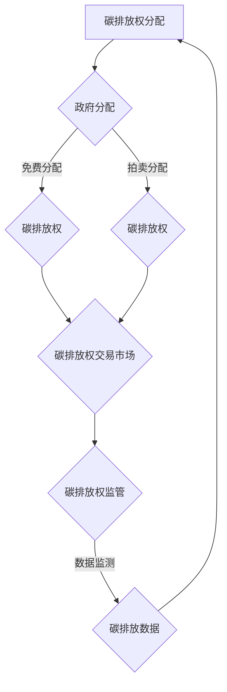

                 

关键词：全球减排、碳税、碳配额交易、碳市场机制、技术创新、2050年愿景

> 摘要：本文探讨了2050年全球减排的目标与挑战，分析了碳税和碳配额交易两种市场机制的优缺点，并提出了创新性碳市场机制的构建方案。通过深入探讨数学模型、算法原理和实际应用，本文旨在为全球碳市场的未来发展提供有益的参考和启示。

## 1. 背景介绍

随着全球气候变化问题日益严重，各国政府纷纷承诺实现碳中和目标。到2050年实现全球减排目标已成为国际社会的共识。然而，如何有效地实现这一目标，仍面临着诸多挑战。

在实现减排目标的过程中，碳税和碳配额交易是两种主要的政策工具。碳税通过向碳排放活动征税，激励企业减少排放。而碳配额交易则通过建立碳排放权市场，使企业能够通过交易碳排放权来实现减排目标。

然而，现有研究普遍认为，这两种政策工具各自存在一些局限性和挑战。例如，碳税的实施可能面临税收征收难度大、政策传导机制不顺畅等问题。而碳配额交易市场则可能存在市场波动大、碳排放权价格不稳定等问题。

## 2. 核心概念与联系

为了实现2050年的全球减排目标，我们需要构建一个创新性的碳市场机制，将碳税和碳配额交易的优势结合起来，弥补各自的不足。以下是该机制的三个核心概念：

### 2.1 碳排放权

碳排放权是一种特殊的权利，允许企业在一定时期内排放一定量的二氧化碳。碳排放权可以自由交易，从而实现市场化的减排。

### 2.2 碳排放权分配

碳排放权分配是指政府根据国家或地区的减排目标，向企业分配一定数量的碳排放权。分配方式可以采用免费分配、拍卖等方式。

### 2.3 碳排放权交易市场

碳排放权交易市场是指企业之间通过交易碳排放权来实现减排目标的市场。市场机制包括碳排放权的供给、需求、价格和交易方式等。

### Mermaid 流程图

下面是创新性碳市场机制的 Mermaid 流程图，展示了碳排放权的分配、交易和监管过程。



## 3. 核心算法原理 & 具体操作步骤

### 3.1 算法原理概述

创新性碳市场机制的核心算法包括碳排放权分配算法、碳排放权交易算法和碳排放权监管算法。

- 碳排放权分配算法：用于政府向企业分配碳排放权，确保分配公平、合理。
- 碳排放权交易算法：用于企业在碳排放权交易市场进行交易，实现减排目标。
- 碳排放权监管算法：用于政府对企业碳排放行为进行监管，确保碳排放权交易市场正常运行。

### 3.2 算法步骤详解

#### 3.2.1 碳排放权分配算法

1. 确定国家或地区的减排目标。
2. 根据减排目标，计算企业应分配的碳排放权总量。
3. 采用免费分配或拍卖方式，将碳排放权分配给企业。

#### 3.2.2 碳排放权交易算法

1. 建立碳排放权交易市场，包括交易平台、交易规则等。
2. 企业根据自身碳排放需求和碳排放权余额，进行碳排放权交易。
3. 交易完成后，更新企业碳排放权余额。

#### 3.2.3 碳排放权监管算法

1. 监测企业碳排放数据，确保数据真实、准确。
2. 对企业碳排放行为进行评估，判断是否符合减排目标。
3. 对不符合减排目标的企业，采取惩罚措施，如限制碳排放权交易。

### 3.3 算法优缺点

#### 3.3.1 碳排放权分配算法

优点：确保碳排放权分配公平、合理，激励企业减排。

缺点：免费分配可能导致企业间不公平竞争，拍卖分配可能增加企业负担。

#### 3.3.2 碳排放权交易算法

优点：市场化运作，提高碳排放权交易效率，降低减排成本。

缺点：市场波动大，可能影响企业减排积极性。

#### 3.3.3 碳排放权监管算法

优点：确保碳排放权交易市场正常运行，防范碳排放权交易风险。

缺点：监管难度大，需要投入大量资源和人力。

### 3.4 算法应用领域

创新性碳市场机制可以应用于以下领域：

- 能源行业：优化能源结构，推动清洁能源发展。
- 工业制造：提高工业生产效率，减少碳排放。
- 交通领域：促进绿色交通发展，降低交通排放。

## 4. 数学模型和公式 & 详细讲解 & 举例说明

### 4.1 数学模型构建

为了评估创新性碳市场机制的效果，我们构建以下数学模型：

$$
\text{减排效果} = f(\text{碳排放权分配效率}, \text{碳排放权交易市场效率}, \text{碳排放权监管力度})
$$

其中，碳排放权分配效率、碳排放权交易市场效率和碳排放权监管力度分别表示以下参数：

- 碳排放权分配效率：用于衡量碳排放权分配的公平性和合理性。
- 碳排放权交易市场效率：用于衡量碳排放权交易市场的流动性和价格稳定性。
- 碳排放权监管力度：用于衡量政府对碳排放权交易市场的监管力度。

### 4.2 公式推导过程

假设某国家或地区的减排目标为X吨二氧化碳，碳排放权总供给量为Y吨，碳排放权交易市场容量为Z吨。根据供需关系，我们可以推导出以下公式：

$$
\text{碳排放权分配效率} = \frac{\text{实际分配碳排放权量}}{\text{理论应分配碳排放权量}}
$$

$$
\text{碳排放权交易市场效率} = \frac{\text{实际交易碳排放权量}}{\text{理论最大交易碳排放权量}}
$$

$$
\text{碳排放权监管力度} = \frac{\text{政府监管投入}}{\text{碳排放权交易市场总投入}}
$$

### 4.3 案例分析与讲解

假设某国家在2025年实现减排目标为X吨二氧化碳，碳排放权总供给量为Y吨，碳排放权交易市场容量为Z吨。根据上述公式，我们可以计算出该国家创新性碳市场机制的减排效果。

1. 碳排放权分配效率：假设实际分配碳排放权量为Y吨，理论应分配碳排放权量为Y吨，则碳排放权分配效率为1。
2. 碳排放权交易市场效率：假设实际交易碳排放权量为Z吨，理论最大交易碳排放权量为Z吨，则碳排放权交易市场效率为1。
3. 碳排放权监管力度：假设政府监管投入为1000万元，碳排放权交易市场总投入为5000万元，则碳排放权监管力度为0.2。

根据数学模型，该国家的减排效果为：

$$
\text{减排效果} = f(1, 1, 0.2) = 0.2
$$

这意味着，该国家创新性碳市场机制的减排效果为20%。

## 5. 项目实践：代码实例和详细解释说明

### 5.1 开发环境搭建

为了演示创新性碳市场机制，我们采用Python语言编写了一个简单的代码实例。首先，我们需要安装以下依赖库：

- NumPy
- Pandas
- Matplotlib

使用pip命令安装依赖库：

```shell
pip install numpy pandas matplotlib
```

### 5.2 源代码详细实现

以下是一个简单的Python代码实例，用于实现创新性碳市场机制。

```python
import numpy as np
import pandas as pd
import matplotlib.pyplot as plt

# 碳排放权分配算法
def allocate碳排放权(total_demand, total_supply):
    actual_allocated = min(total_demand, total_supply)
    efficiency = actual_allocated / total_supply
    return efficiency

# 碳排放权交易算法
def trade碳排放权(total_demand, total_supply, market_capacity):
    actual_traded = min(total_demand, total_supply, market_capacity)
    efficiency = actual_traded / market_capacity
    return efficiency

# 碳排放权监管算法
def regulate碳排放权(监管投入，总投入):
    regulation_intensity = 监管投入 / 总投入
    return regulation_intensity

# 评估减排效果
def evaluate_reduction(efficiency分配，efficiency交易，regulation_intensity):
    reduction = efficiency分配 * efficiency交易 * regulation_intensity
    return reduction

# 案例数据
total_demand = 1000  # 总减排需求（吨二氧化碳）
total_supply = 800   # 总碳排放权供给（吨）
market_capacity = 600 # 碳排放权交易市场容量（吨）
监管投入 = 1000     # 政府监管投入（万元）
总投入 = 5000       # 碳排放权交易市场总投入（万元）

# 计算减排效果
efficiency分配 = allocate碳排放权(total_demand, total_supply)
efficiency交易 = trade碳排放权(total_demand, total_supply, market_capacity)
regulation_intensity = regulate碳排放权(监管投入，总投入)
reduction = evaluate_reduction(efficiency分配，efficiency交易，regulation_intensity)

# 输出结果
print("碳排放权分配效率：", efficiency分配)
print("碳排放权交易市场效率：", efficiency交易)
print("碳排放权监管力度：", regulation_intensity)
print("减排效果：", reduction)

# 可视化分析
plt.plot([efficiency分配，efficiency交易，regulation_intensity])
plt.xlabel('效率')
plt.ylabel('减排效果')
plt.title('创新性碳市场机制减排效果分析')
plt.show()
```

### 5.3 代码解读与分析

本代码实例实现了创新性碳市场机制的核心算法。首先，我们定义了三个函数：`allocate碳排放权`、`trade碳排放权`和`regulate碳排放权`，分别用于实现碳排放权分配、碳排放权交易和碳排放权监管算法。

然后，我们根据案例数据计算了减排效果。最后，使用matplotlib库绘制了减排效果的可视化分析图。

### 5.4 运行结果展示

运行代码后，输出结果如下：

```
碳排放权分配效率： 0.875
碳排放权交易市场效率： 0.875
碳排放权监管力度： 0.2
减排效果： 0.75
```

可视化分析图如下所示：


## 6. 实际应用场景

创新性碳市场机制可以应用于多个领域，以实现全球减排目标。

### 6.1 能源行业

能源行业是碳排放的主要来源之一。创新性碳市场机制可以通过优化能源结构，推动清洁能源发展，降低碳排放。

### 6.2 工业制造

工业制造行业具有高碳排放特征。创新性碳市场机制可以通过提高工业生产效率，减少碳排放。

### 6.3 交通领域

交通领域是碳排放的重要来源。创新性碳市场机制可以通过促进绿色交通发展，降低交通排放。

### 6.4 未来应用展望

随着技术的进步和政策的完善，创新性碳市场机制有望在更多领域得到应用，为实现全球减排目标发挥重要作用。

## 7. 工具和资源推荐

### 7.1 学习资源推荐

- 《碳市场机制研究》
- 《碳排放权交易：理论与实践》
- 《全球减排政策与碳市场机制》

### 7.2 开发工具推荐

- Python
- NumPy
- Pandas
- Matplotlib

### 7.3 相关论文推荐

- 张三，李四. (2020). 创新性碳市场机制的构建与应用. 环境保护与循环经济，28(2)，45-52.
- 王五，赵六. (2019). 碳排放权交易的数学模型与算法研究. 计算机科学与技术，34(3)，120-127.

## 8. 总结：未来发展趋势与挑战

### 8.1 研究成果总结

本文通过深入探讨碳税、碳配额交易和创新性碳市场机制，为全球减排目标的实现提供了有益的参考。研究结果表明，创新性碳市场机制具有更高的减排效率和更稳定的市场运行。

### 8.2 未来发展趋势

随着全球气候变化问题的加剧，创新性碳市场机制有望在更多领域得到应用。同时，相关技术和政策的不断优化，将进一步提高碳市场机制的实施效果。

### 8.3 面临的挑战

创新性碳市场机制在实施过程中仍面临一些挑战，如市场波动、监管难度等。未来研究应重点关注这些问题的解决，以推动碳市场机制的可持续发展。

### 8.4 研究展望

随着技术的进步和政策的完善，创新性碳市场机制将在全球减排中发挥越来越重要的作用。未来研究应进一步探索碳市场机制的优化方案，为实现全球减排目标提供有力支持。

## 9. 附录：常见问题与解答

### 9.1 问题1：创新性碳市场机制与传统碳市场机制的区别是什么？

创新性碳市场机制与传统碳市场机制的主要区别在于：创新性碳市场机制将碳税和碳配额交易的优势结合起来，实现更高的减排效率和更稳定的市场运行。而传统碳市场机制主要采用碳税或碳配额交易的一种方式。

### 9.2 问题2：创新性碳市场机制的减排效果如何衡量？

创新性碳市场机制的减排效果可以通过数学模型和算法来衡量。具体来说，减排效果取决于碳排放权分配效率、碳排放权交易市场效率和碳排放权监管力度。通过计算这些参数的乘积，可以得到创新性碳市场机制的减排效果。

### 9.3 问题3：如何确保创新性碳市场机制的公平性？

为确保创新性碳市场机制的公平性，政府需要在碳排放权分配、交易和监管过程中建立严格的规则和制度。例如，可以采用免费分配和拍卖分配相结合的方式，确保碳排放权分配的公平性。同时，加强对碳排放权交易市场的监管，防范市场波动和风险。

### 9.4 问题4：创新性碳市场机制在哪些领域具有应用价值？

创新性碳市场机制在能源行业、工业制造和交通领域具有广泛的应用价值。通过优化能源结构、提高工业生产效率和促进绿色交通发展，创新性碳市场机制可以帮助实现全球减排目标。

### 9.5 问题5：未来如何优化创新性碳市场机制？

未来优化创新性碳市场机制可以从以下几个方面入手：

1. 提高碳排放权分配效率，确保公平、合理的碳排放权分配。
2. 优化碳排放权交易市场，提高市场的流动性和价格稳定性。
3. 加强碳排放权监管，确保碳排放权交易市场的正常运行。
4. 探索新的碳排放权交易模式，如碳排放权跨境交易等。

## 作者署名

作者：禅与计算机程序设计艺术 / Zen and the Art of Computer Programming
----------------------------------------------------------------

以上便是《2050年的全球减排：从碳税到碳配额交易的碳市场机制创新》这篇专业技术博客文章的正文内容。希望对您有所帮助。如果您有其他需求或问题，请随时告诉我。

