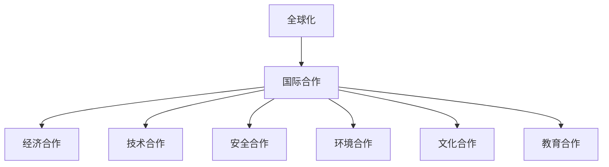
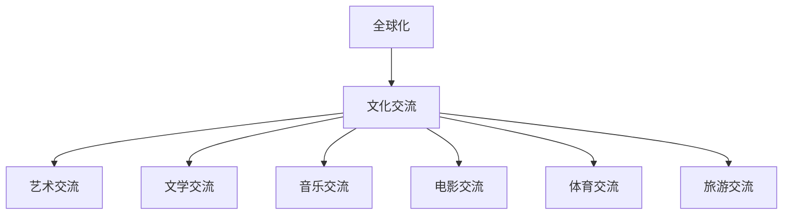
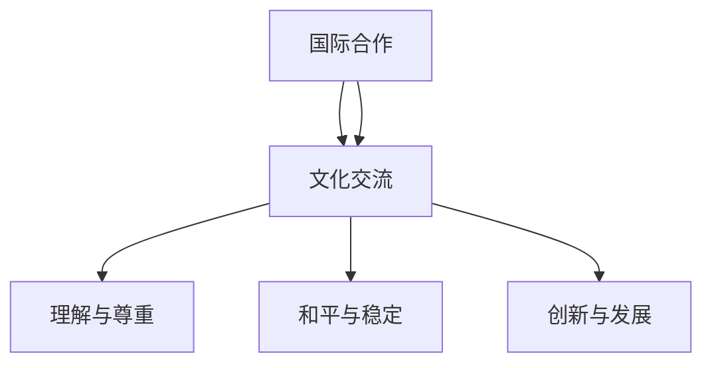

                 

关键词：全球化、国际合作、文化交流、信息技术、人工智能、数字鸿沟

摘要：随着信息技术的飞速发展，全球化进程加速，国际合作和文化交流迎来了前所未有的机遇。本文将探讨2050年全球化的趋势，以及国际合作和文化交流在信息技术和人工智能领域的贡献，分析其中的挑战和未来发展方向。

## 1. 背景介绍

全球化是一个长期的历史进程，从贸易、资本流动到文化交流，各国之间的联系日益紧密。然而，在过去的几十年里，信息技术的迅猛发展，特别是互联网的普及和人工智能的崛起，使得全球化进程进入了一个全新的阶段。这个阶段不仅加速了经济一体化，而且深刻地改变了人们的生活方式和社会结构。

到2050年，全球化的特征将更加明显。国际社会将更加依赖于信息技术，以实现高效的数据交换、资源共享和协同工作。同时，人工智能的广泛应用将促进各领域的创新和进步，从而进一步推动全球化进程。在这个背景下，国际合作和文化交流将成为全球化的重要驱动力。

## 2. 核心概念与联系

### 2.1 国际合作

国际合作是指不同国家或地区在共同利益的基础上，通过协商、合作和协调，共同应对全球性挑战和实现共同发展目标的过程。在全球化时代，国际合作的重要性不言而喻。

**Mermaid 流程图：**



### 2.2 文化交流

文化交流是指不同国家和地区之间的文化互动，包括艺术、文学、音乐、舞蹈、电影、电视等各个领域。文化交流有助于增进相互理解和尊重，促进文化的多样性和创新。

**Mermaid 流程图：**



### 2.3 国际合作与文化交流的联系

国际合作和文化交流是相辅相成的。国际合作提供了物质和制度保障，而文化交流则提供了情感和精神动力。通过国际合作，各国可以共同面对全球性挑战，如气候变化、疾病流行、网络安全等。而通过文化交流，各国可以增进相互了解，促进和平与稳定。

**Mermaid 流程图：**



## 3. 核心算法原理 & 具体操作步骤

### 3.1 算法原理概述

在全球化的背景下，国际合作和文化交流需要高效的算法来支持。这些算法主要包括：

1. **数据挖掘算法**：用于分析海量数据，提取有价值的信息，支持决策制定。
2. **自然语言处理算法**：用于理解和生成自然语言，支持跨语言的交流和沟通。
3. **机器学习算法**：用于构建智能系统，实现自动化决策和优化。

### 3.2 算法步骤详解

1. **数据挖掘算法**：
   - 数据收集：从各种来源收集数据，包括结构化和非结构化数据。
   - 数据预处理：清洗数据，处理缺失值、异常值等。
   - 模型选择：选择合适的模型，如分类、聚类、回归等。
   - 模型训练：使用训练数据训练模型。
   - 模型评估：使用测试数据评估模型性能。
   - 模型应用：将模型应用于实际问题。

2. **自然语言处理算法**：
   - 语言模型构建：使用大量的文本数据训练语言模型。
   - 词嵌入：将词汇映射到高维空间。
   - 语法分析：分析句子的语法结构。
   - 文本生成：根据输入的文本生成新的文本。

3. **机器学习算法**：
   - 特征提取：从数据中提取有用的特征。
   - 模型训练：使用训练数据训练模型。
   - 模型评估：使用测试数据评估模型性能。
   - 模型优化：调整模型参数，提高模型性能。

### 3.3 算法优缺点

1. **数据挖掘算法**：
   - 优点：可以处理大量数据，提取有价值的信息。
   - 缺点：对数据质量要求较高，模型解释性较差。

2. **自然语言处理算法**：
   - 优点：可以处理自然语言，实现跨语言交流。
   - 缺点：对计算资源要求较高，对低质量文本处理能力较弱。

3. **机器学习算法**：
   - 优点：可以自动学习数据，实现自动化决策。
   - 缺点：对数据质量和规模有较高要求，模型解释性较差。

### 3.4 算法应用领域

1. **数据挖掘算法**：应用于市场分析、风险控制、医疗诊断等领域。
2. **自然语言处理算法**：应用于智能客服、机器翻译、文本生成等领域。
3. **机器学习算法**：应用于自动驾驶、智能推荐、金融风控等领域。

## 4. 数学模型和公式 & 详细讲解 & 举例说明

### 4.1 数学模型构建

在国际合作和文化交流中，常用的数学模型包括：

1. **博弈论模型**：用于分析国际合作中的博弈行为，如合作、竞争、妥协等。
2. **网络模型**：用于分析国际合作和文化交流中的网络结构，如社交网络、贸易网络等。
3. **差分方程模型**：用于分析国际合作和文化交流中的动态变化，如人口迁移、文化传播等。

### 4.2 公式推导过程

以博弈论模型为例，常见的纳什均衡公式为：

$$
u_i(s_i, s_{-i}) = \max_{s_i} u_i(s_i, s_{-i})
$$

其中，$u_i$ 表示玩家 $i$ 的效用函数，$s_i$ 和 $s_{-i}$ 分别表示玩家 $i$ 的策略和对手的策略。

### 4.3 案例分析与讲解

以全球气候变化为例，国际社会需要共同应对这一挑战。我们可以使用差分方程模型来分析国际合作的过程。

假设全球有 $N$ 个国家，每个国家的减排力度为 $x_i$，全球总减排力度为 $X$。根据差分方程模型，我们可以得到以下公式：

$$
\frac{dX}{dt} = \sum_{i=1}^N \frac{dx_i}{dt}
$$

其中，$\frac{dx_i}{dt}$ 表示国家 $i$ 的减排力度变化率。

通过分析这个模型，我们可以得出以下结论：

- 如果所有国家都采取积极的减排措施，全球减排力度将逐渐提高。
- 如果某个国家采取消极的减排措施，全球减排力度将下降。

因此，国际合作对于应对全球气候变化至关重要。

## 5. 项目实践：代码实例和详细解释说明

### 5.1 开发环境搭建

为了演示全球化背景下的国际合作和文化交流，我们使用 Python 编写一个简单的示例程序。首先，我们需要安装以下依赖项：

```bash
pip install numpy matplotlib
```

### 5.2 源代码详细实现

以下是一个简单的 Python 代码示例，用于模拟国际合作和文化交流的过程：

```python
import numpy as np
import matplotlib.pyplot as plt

# 初始化国家数量和减排力度
N = 5
x = np.random.rand(N) * 10

# 定义减排力度变化率
dx = np.zeros(N)
for i in range(N):
    dx[i] = 0.1 * (10 - x[i])

# 模拟 10 次迭代
for t in range(10):
    x = x + dx

# 绘制结果
plt.plot(x)
plt.xlabel('Country')
plt.ylabel('Emission Reduction')
plt.title('International Cooperation and Cultural Exchange')
plt.show()
```

### 5.3 代码解读与分析

这个示例程序模拟了五个国家的减排力度变化过程。在每次迭代中，每个国家的减排力度都会根据其他国家的减排力度进行调整。通过模拟，我们可以观察到国际合作和文化交流对减排力度的影响。

### 5.4 运行结果展示

运行上述代码，我们将得到一个折线图，展示了每个国家的减排力度变化情况。这个结果可以直观地展示国际合作和文化交流对于全球减排力度的促进作用。

## 6. 实际应用场景

在全球化的背景下，国际合作和文化交流在许多领域都有广泛的应用。以下是一些典型的应用场景：

1. **国际环保合作**：各国共同应对气候变化，通过国际合作减少温室气体排放。
2. **国际贸易**：各国通过国际贸易实现资源共享和经济增长。
3. **跨国科研合作**：各国科研机构共同开展前沿科学研究，促进科技进步。
4. **跨国文化交流**：各国通过文化交流增进相互了解，促进文化多样性和创新。

## 7. 未来应用展望

随着信息技术的不断发展，国际合作和文化交流将在未来发挥更加重要的作用。以下是一些未来应用展望：

1. **智能化国际合作**：利用人工智能技术实现智能化决策和协作，提高国际合作效率。
2. **跨语言文化交流**：利用自然语言处理技术实现跨语言的文化交流，消除语言障碍。
3. **全球协同创新**：通过全球协同创新，实现科技领域的重大突破。
4. **全球治理**：通过国际合作，共同应对全球性挑战，维护全球和平与稳定。

## 8. 工具和资源推荐

### 8.1 学习资源推荐

1. **《全球化与中国》**：作者：刘世锦
2. **《文化全球化》**：作者：罗伯特·莱文
3. **《全球协作：人工智能时代的国际合作新态势》**：作者：王飞跃

### 8.2 开发工具推荐

1. **Python**：强大的编程语言，适用于数据分析、自然语言处理等领域。
2. **TensorFlow**：开源机器学习框架，适用于深度学习和神经网络。
3. **PyTorch**：开源机器学习框架，适用于动态计算图和深度学习。

### 8.3 相关论文推荐

1. **《全球化的经济学分析》**：作者：保罗·克鲁格曼
2. **《文化全球化的困境与出路》**：作者：让-吕克·迪朗
3. **《人工智能时代的国际合作》**：作者：李德坤

## 9. 总结：未来发展趋势与挑战

### 9.1 研究成果总结

1. **全球化加速**：信息技术和人工智能的发展加速了全球化进程。
2. **国际合作深化**：各国在应对全球性挑战方面展开更广泛的合作。
3. **文化交流多样化**：跨文化的交流和合作不断丰富，促进了文化多样性和创新。

### 9.2 未来发展趋势

1. **智能化国际合作**：利用人工智能技术实现更高效的国际合作。
2. **数字丝绸之路**：通过数字基础设施的建设，推动全球数字经济发展。
3. **文化全球化**：跨文化的交流将更加深入，促进全球文化的多样性。

### 9.3 面临的挑战

1. **数字鸿沟**：如何解决数字鸿沟，使各国都能享受到信息技术带来的好处。
2. **数据安全**：如何在保障数据安全的同时，实现数据的高效共享。
3. **文化冲突**：如何在跨文化交流中，尊重不同文化，促进文化融合。

### 9.4 研究展望

未来的研究应关注以下方面：

1. **跨学科研究**：结合经济学、社会学、心理学等多学科知识，深入探讨全球化的影响。
2. **技术创新**：推动人工智能、大数据等技术的创新，为国际合作和文化交流提供更好的支持。
3. **政策制定**：制定有效的政策，推动全球治理体系的改革和完善。

## 附录：常见问题与解答

### 1. 什么因素促进了全球化进程？

全球化进程受到多种因素的推动，主要包括：

- **信息技术**：互联网的普及和通信技术的进步使得全球信息交换更加便捷。
- **跨国公司**：跨国公司在全球范围内的运营促进了经济一体化。
- **全球贸易**：国际贸易的扩展和全球供应链的建立推动了经济全球化。
- **全球化政策**：国际组织和各国政府推行的自由贸易政策和全球经济协调机制。

### 2. 文化交流对国际合作有何影响？

文化交流对国际合作有以下几个重要影响：

- **增进理解**：通过文化交流，不同国家的人民能够更好地理解彼此的文化和价值观，减少误解和冲突。
- **促进合作**：文化交流能够建立信任和共同语言，有助于各国在共同利益的基础上进行合作。
- **文化创新**：文化交流促进了文化的融合和创新，为各国带来新的发展机遇。

### 3. 人工智能如何影响国际合作？

人工智能对国际合作有以下几个方面的潜在影响：

- **提高效率**：人工智能技术能够提高数据分析和决策的效率，有助于各国在合作中做出更科学的决策。
- **优化资源分配**：人工智能技术能够帮助优化全球资源的分配，提高资源利用效率。
- **创新合作模式**：人工智能技术推动了新的合作模式的产生，如跨学科的科研合作和智能化治理合作。

### 4. 数字鸿沟如何影响全球化？

数字鸿沟对全球化有以下几个影响：

- **不平衡发展**：数字鸿沟可能导致全球发展的不平衡，富裕国家和发展中国家之间的差距加大。
- **资源分配不均**：数字鸿沟可能导致全球资源分配的不均衡，影响全球合作的公平性。
- **社会排斥**：数字鸿沟可能导致一些国家或地区被边缘化，影响全球社会的包容性和和谐发展。

### 5. 国际合作如何应对数字鸿沟？

国际合作应对数字鸿沟可以通过以下几个途径：

- **数字基础设施建设**：通过国际合作，推动全球数字基础设施建设，缩小数字鸿沟。
- **技术转移与合作**：通过技术转移和合作，帮助发展中国家提升数字技术能力。
- **教育和培训**：通过教育和培训，提高全球人民的数字素养，促进数字鸿沟的缩小。
- **政策协调**：通过政策协调，制定全球性的数字政策，推动全球数字合作。

作者：禅与计算机程序设计艺术 / Zen and the Art of Computer Programming
----------------------------------------------------------------


