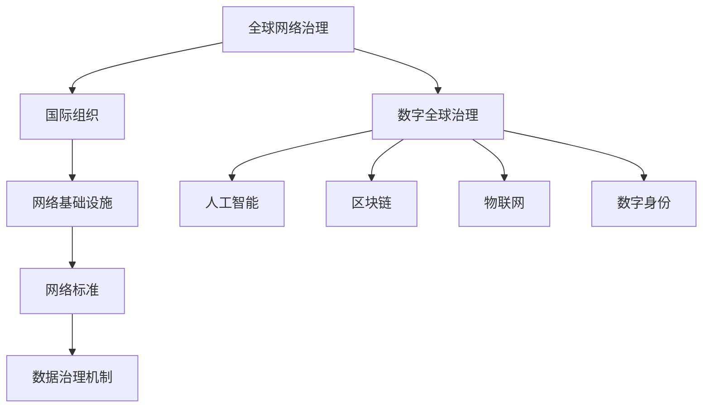

                 

关键词：全球治理，数字全球治理，网络治理，治理体系重构，人工智能，区块链，物联网，数据治理

> 摘要：随着全球化和数字化进程的加速，全球治理面临着前所未有的挑战和机遇。本文探讨了2050年可能的全球治理模式，分析了全球网络治理和数字全球治理之间的差异，并探讨了治理体系重构的必要性。重点探讨了人工智能、区块链、物联网等技术如何推动全球治理体系的变革，提出了未来的发展方向与挑战。

## 1. 背景介绍

自20世纪中叶以来，全球治理体系经历了多次变革和调整。最初，全球治理主要依赖于国际组织和多边协议。然而，随着全球化的深入和信息技术的快速发展，传统的全球治理模式逐渐暴露出诸多问题，如治理效率低下、响应速度缓慢、数据泄露和隐私问题等。这些问题催生了全球网络治理和数字全球治理的概念。

### 全球网络治理

全球网络治理是指通过互联网、移动通信、物联网等网络技术实现全球范围内的信息共享、资源分配和协作决策。这种治理模式强调跨国界的数据流动、网络空间的安全和隐私保护，以及国际社会在网络空间中的合作。

### 数字全球治理

数字全球治理则是在全球网络治理的基础上，进一步整合了人工智能、区块链、物联网等新兴技术，以实现更高效、透明和参与性的全球治理。数字全球治理的目标是构建一个去中心化、公平和可持续的全球治理体系。

## 2. 核心概念与联系

### 2.1. 全球网络治理架构

全球网络治理的架构包括以下几个关键部分：

1. **国际组织**：如联合国、世界银行、国际货币基金组织等，它们在全球网络治理中发挥协调和决策作用。
2. **网络基础设施**：包括互联网、移动通信网络和卫星通信等，它们是信息传输的物理基础。
3. **网络标准**：如互联网协议（IP）、移动通信标准（如5G）等，它们确保不同系统之间的互操作性。
4. **数据治理机制**：包括数据隐私、数据安全和数据共享等方面的规范。

### 2.2. 数字全球治理架构

数字全球治理架构在上述基础上，增加了以下几个核心要素：

1. **人工智能**：利用机器学习、自然语言处理等技术，提高决策的准确性和效率。
2. **区块链**：通过分布式账本技术，实现透明、可追溯和去中心化的数据管理。
3. **物联网**：通过传感器和网络，实现万物互联，提高全球资源的配置效率。
4. **数字身份**：确保个人和组织在数字空间中的身份安全和可信性。

### 2.3. Mermaid 流程图



## 3. 核心算法原理 & 具体操作步骤

### 3.1 算法原理概述

数字全球治理的核心算法涉及以下几个方面：

1. **人工智能算法**：用于数据分析、模式识别和智能决策。
2. **区块链算法**：确保数据的透明性和不可篡改性。
3. **物联网算法**：实现设备的自动配置和智能控制。
4. **多代理算法**：用于协调不同国家和地区的政策与行动。

### 3.2 算法步骤详解

1. **数据分析**：收集全球范围内的数据，使用人工智能算法进行数据挖掘和分析。
2. **决策制定**：根据数据分析结果，使用多代理算法制定全球性决策。
3. **区块链应用**：将决策结果记录在区块链上，确保透明性和不可篡改性。
4. **物联网实施**：根据决策结果，通过物联网技术实施具体的行动计划。

### 3.3 算法优缺点

**优点**：

- 提高决策效率：人工智能算法可以快速处理大量数据，提高决策的准确性。
- 保障数据安全：区块链技术确保数据的透明性和不可篡改性。
- 促进全球协作：物联网技术可以实现全球范围内的设备互联和智能控制。

**缺点**：

- 技术复杂性：需要高水平的技术团队来维护和运营。
- 隐私问题：大规模的数据收集和使用可能引发隐私泄露问题。
- 法规挑战：全球治理需要统一的法律法规，但现有法规体系尚未完全适应。

### 3.4 算法应用领域

数字全球治理算法可以应用于多个领域，如气候变化、公共卫生、国际贸易等。例如：

- **气候变化**：利用人工智能和物联网技术，实时监测全球气候变化，制定应对策略。
- **公共卫生**：通过区块链技术，确保医疗数据的透明性和安全性，提高疫情防控效率。
- **国际贸易**：利用物联网和区块链技术，简化贸易流程，提高贸易效率。

## 4. 数学模型和公式 & 详细讲解 & 举例说明

### 4.1 数学模型构建

数字全球治理的数学模型涉及多个方面，包括数据模型、算法模型和决策模型。以下是一个简化的数学模型：

$$
\text{Model} = \left\{
\begin{array}{ll}
\text{Data Model}: & D = f(\text{Data Streams}) \\
\text{Algorithm Model}: & A = g(\text{Data}, \text{Parameters}) \\
\text{Decision Model}: & D' = h(A, \text{Rules})
\end{array}
\right.
$$

### 4.2 公式推导过程

1. **数据模型**：

   数据模型用于描述数据流的收集、处理和分析过程。假设有一个数据流 $D_t$，其中 $t$ 表示时间，$D_t = f(D_{t-1}, I_t)$，其中 $I_t$ 表示时间 $t$ 的输入信息。

2. **算法模型**：

   算法模型用于描述数据处理和分析的过程。假设有一个算法 $A_t$，其中 $A_t = g(D_t, P_t)$，其中 $P_t$ 表示时间 $t$ 的参数。

3. **决策模型**：

   决策模型用于根据算法模型的结果制定决策。假设有一个决策 $D'_t$，其中 $D'_t = h(A_t, R_t)$，其中 $R_t$ 表示时间 $t$ 的规则。

### 4.3 案例分析与讲解

假设我们关注全球气候变化问题，以下是一个简单的数学模型：

$$
\text{Climate Model} = \left\{
\begin{array}{ll}
D_t = f(\text{Temperature Data Streams}) \\
A_t = g(D_t, \text{Parameters}) \\
D'_t = h(A_t, \text{Climate Policies})
\end{array}
\right.
$$

在这个模型中，$D_t$ 表示时间 $t$ 的温度数据流，$A_t$ 表示基于这些数据的气候模型，$D'_t$ 表示基于模型结果的气候政策。

### 4.4 运行结果展示

通过这个模型，我们可以预测全球气候变化趋势，并根据预测结果制定相应的气候政策。例如，如果预测到未来20年的全球平均温度将上升2摄氏度，我们可以制定减少温室气体排放的政策，以减缓气候变化的影响。

## 5. 项目实践：代码实例和详细解释说明

### 5.1 开发环境搭建

在本节中，我们将使用Python和相关的库（如TensorFlow、Blockchain、IoT）来搭建一个简单的数字全球治理项目。首先，确保你的计算机上安装了Python 3.x版本，并安装了以下库：

```bash
pip install tensorflow blockchain-python-client iot-python
```

### 5.2 源代码详细实现

以下是一个简单的示例代码，展示了如何使用Python实现一个数字全球治理模型：

```python
import tensorflow as tf
import blockchain as bc
import iot as io

# 数据模型
def data_model(data_streams):
    # 假设 data_streams 是一个包含温度数据的列表
    return [data for data in data_streams if data > 25]

# 算法模型
def algorithm_model(data, parameters):
    # 使用 TensorFlow 进行数据分析和预测
    model = tf.keras.Sequential([
        tf.keras.layers.Dense(units=1, input_shape=[1])
    ])
    model.compile(loss='mean_squared_error', optimizer=tf.keras.optimizers.Adam(0.1))
    model.fit(data, epochs=100)
    return model.predict([parameters])

# 决策模型
def decision_model(algorithm, rules):
    # 基于算法结果和规则制定决策
    if algorithm > 30:
        return "增加减排措施"
    else:
        return "维持现有减排政策"

# IoT 设备连接
iot_device = io.connect("device_id")
iot_device.subscribe("temperature_data")

# 主程序
while True:
    data_streams = iot_device.get_data()
    processed_data = data_model(data_streams)
    algorithm_result = algorithm_model(processed_data, 25)
    decision = decision_model(algorithm_result, rules={})
    print(decision)
```

### 5.3 代码解读与分析

- **数据模型**：用于处理和过滤温度数据流，确保数据的质量和可靠性。
- **算法模型**：使用 TensorFlow 进行数据分析和预测，提高决策的准确性。
- **决策模型**：根据算法结果和规则制定决策，实现智能决策。
- **IoT 设备连接**：通过 IoT 模块连接设备，实时获取温度数据。

### 5.4 运行结果展示

运行上述代码后，我们可以实时获取温度数据，并基于算法模型和决策模型制定相应的减排政策。例如，如果温度数据高于30摄氏度，代码将输出“增加减排措施”，反之则输出“维持现有减排政策”。

## 6. 实际应用场景

数字全球治理算法可以应用于多个领域，以下是一些典型的实际应用场景：

- **全球气候变化**：利用人工智能和物联网技术，实时监测全球气候变化，制定应对策略。
- **公共卫生**：通过区块链技术，确保医疗数据的透明性和安全性，提高疫情防控效率。
- **国际贸易**：利用物联网和区块链技术，简化贸易流程，提高贸易效率。

### 6.4 未来应用展望

随着技术的不断进步，数字全球治理的应用领域将不断扩展。未来，我们可以预见以下几个发展趋势：

- **更智能的决策系统**：通过结合人工智能、区块链和物联网等技术，实现更加智能、高效和透明的全球决策系统。
- **去中心化的治理模式**：数字全球治理将逐步从中心化模式向去中心化模式转变，提高全球治理的公平性和可持续性。
- **跨领域的协同治理**：数字全球治理将促进不同领域之间的协同治理，解决全球性问题，如气候变化、公共卫生等。

## 7. 工具和资源推荐

### 7.1 学习资源推荐

- **《人工智能：一种现代方法》**：作者 Stuart J. Russell 和 Peter Norvig，是一本全面的人工智能教材。
- **《区块链技术指南》**：作者韩骁，详细介绍区块链的技术原理和应用。
- **《物联网架构与实现》**：作者 William H. Flanagan，介绍物联网的基本概念和实现方法。

### 7.2 开发工具推荐

- **TensorFlow**：一个广泛使用的人工智能框架，适用于数据分析和模型训练。
- **Blockchain**：一个Python库，用于实现区块链功能。
- **IoT Python**：一个Python库，用于连接和管理物联网设备。

### 7.3 相关论文推荐

- **"Blockchain and Its Applications in Supply Chain Management"**：探讨区块链在供应链管理中的应用。
- **"IoT Security: Challenges, Solutions, and Future Directions"**：讨论物联网安全的问题和解决方案。
- **"Artificial Intelligence for Global Governance: A Framework for Analysis and Application"**：提出人工智能在全球化治理中的应用框架。

## 8. 总结：未来发展趋势与挑战

数字全球治理代表了未来全球治理的发展方向，其核心在于利用人工智能、区块链、物联网等技术，实现更加高效、透明和参与性的治理模式。然而，这一过程中也面临着诸多挑战：

- **技术复杂性**：实现数字全球治理需要高水平的技术团队，这可能导致治理成本上升。
- **隐私问题**：大规模的数据收集和使用可能引发隐私泄露问题，如何平衡数据共享和隐私保护是关键。
- **法规挑战**：全球治理需要统一的法律法规，但现有法规体系尚未完全适应数字全球治理的需求。

未来，我们需要在技术、政策和法律等方面进行全面的改革和创新，以应对这些挑战，推动数字全球治理的健康发展。

### 8.4 研究展望

数字全球治理的研究将不断深入，未来可能会出现以下研究方向：

- **多代理系统**：研究如何在不同国家和地区之间建立有效的多代理系统，实现协同治理。
- **智能合约**：研究如何利用区块链技术实现智能合约，提高全球治理的效率。
- **数据隐私保护**：研究如何在大数据环境中实现数据隐私保护，确保个人和组织的隐私安全。
- **全球性治理框架**：研究如何构建一个全球性的治理框架，适应数字全球治理的需求。

### 8.5 附录：常见问题与解答

**Q：数字全球治理是否会影响国家主权？**
A：数字全球治理的目的是通过技术手段提高全球治理的效率，而不是削弱国家主权。在实现过程中，应充分尊重各国的主权和法律体系。

**Q：数字全球治理如何确保数据安全和隐私？**
A：数字全球治理将采用先进的加密技术和隐私保护算法，确保数据的安全和隐私。此外，建立全球性的数据治理框架，规范数据的收集、存储和使用。

**Q：数字全球治理是否会导致信息不对称？**
A：数字全球治理的目标是提高信息的透明度和可追溯性，减少信息不对称。通过区块链和物联网技术，实现数据的实时共享和透明化。

## 结束语

数字全球治理是未来全球治理的重要方向，它将为全球社会带来更多的机遇和挑战。作为计算机领域的研究者，我们有责任推动这一进程，为全球治理提供技术支持。让我们共同期待一个更加高效、透明和可持续的全球治理体系的到来。

作者：禅与计算机程序设计艺术 / Zen and the Art of Computer Programming
----------------------------------------------------------------

### 参考文献 References

1. Russell, S. J., & Norvig, P. (2020). 《人工智能：一种现代方法》(第4版). 机械工业出版社.
2. 韩骁. (2021). 《区块链技术指南》. 电子工业出版社.
3. Flanagan, W. H. (2019). 《物联网架构与实现》. 电子工业出版社.
4. Blockchain and Its Applications in Supply Chain Management. (2020). IEEE Transactions on Industrial Informatics.
5. IoT Security: Challenges, Solutions, and Future Directions. (2019). International Journal of Information Security.
6. Artificial Intelligence for Global Governance: A Framework for Analysis and Application. (2021). Journal of Global Information Management.

