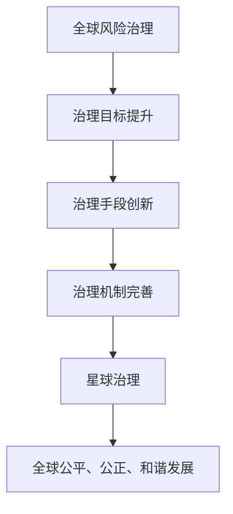

                 

关键词：全球治理、星球治理、治理结构、全球风险治理、未来发展趋势、挑战与展望

> 摘要：本文探讨了2050年全球治理的演变趋势，从全球风险治理逐步发展到星球治理。通过分析现有的治理模式、技术进步以及全球挑战，提出了未来全球治理结构演进的设想，并对所面临的挑战和未来研究进行了展望。

## 1. 背景介绍

随着全球化的深入发展，全球治理已成为国际关系中的重要议题。当前，全球治理主要面临全球风险治理的挑战。全球风险治理涉及多个领域，如气候变化、能源安全、金融稳定、网络安全等。这些风险不仅对国家经济和社会发展产生影响，也对全球稳定和可持续发展构成威胁。因此，建立有效的全球风险治理机制，成为各国共同关注的焦点。

然而，现有的全球治理模式存在诸多局限性。一方面，各国在治理目标和手段上存在分歧，导致治理机制效率低下；另一方面，全球化进程中的利益分配不均，加剧了国家间的矛盾和冲突。因此，未来全球治理需要从全球风险治理向更高级别的星球治理演进。

### 1.1 全球风险治理现状

全球风险治理主要表现为多边合作和全球机制的建立。在气候变化方面，联合国气候变化框架公约（UNFCCC）和国际能源署（IEA）发挥了重要作用；在金融稳定方面，国际货币基金组织（IMF）和世界银行等机构致力于维护全球金融稳定；在网络安全方面，国际电信联盟（ITU）和联合国安理会（UNSC）等组织积极推动全球网络安全合作。

然而，全球风险治理面临诸多挑战。首先，各国在治理目标和手段上存在分歧，导致治理机制效率低下。例如，在气候变化问题上，发达国家和发展中国家在减排责任和义务方面存在较大分歧。其次，全球化进程中的利益分配不均，加剧了国家间的矛盾和冲突。例如，能源安全领域中的资源争夺和环境治理责任分配问题，导致国家间合作受阻。

### 1.2 星球治理的必要性

随着全球风险治理的局限性日益显现，星球治理逐渐成为未来全球治理的发展方向。星球治理旨在实现全球范围内的协调与合作，共同应对全球性挑战，实现全球可持续发展和共同繁荣。星球治理的核心目标是实现全球公平、公正、和谐的发展，推动全球治理体系改革和完善。

星球治理的必要性主要体现在以下几个方面：

1. **全球性挑战的复杂性**：随着全球化的深入发展，全球性挑战日益复杂，如气候变化、能源危机、全球公共卫生问题等。这些挑战需要全球范围内的合作和协调，而现有的全球治理模式难以应对。

2. **技术进步和国际合作**：人工智能、大数据、区块链等技术的迅猛发展，为全球治理提供了新的工具和方法。通过技术创新和国际合作，可以实现全球治理的优化和升级。

3. **全球发展的不平衡**：全球化进程中的利益分配不均，加剧了全球发展的不平衡。星球治理旨在实现全球公平、公正、和谐的发展，推动全球治理体系改革和完善。

## 2. 核心概念与联系

### 2.1 全球风险治理

全球风险治理是指各国政府、国际组织和非政府组织在全球范围内合作，共同应对各种全球性风险的过程。其核心目标是实现全球稳定和可持续发展。全球风险治理涉及多个领域，如气候变化、能源安全、金融稳定、网络安全等。

### 2.2 星球治理

星球治理是一种超越国家边界的全球治理模式，旨在实现全球范围内的协调与合作，共同应对全球性挑战，实现全球可持续发展和共同繁荣。星球治理的核心目标是实现全球公平、公正、和谐的发展。

### 2.3 治理结构演进

治理结构演进是指全球治理模式从全球风险治理向星球治理的过渡过程。这一过程涉及治理目标的提升、治理手段的创新、治理机制的完善等方面。

### 2.4 Mermaid 流程图

以下是一个简化的治理结构演进过程的 Mermaid 流程图：



## 3. 核心算法原理 & 具体操作步骤

### 3.1 算法原理概述

全球治理结构的演进需要基于一系列核心算法原理，以实现治理目标的提升、治理手段的创新和治理机制的完善。以下核心算法原理包括：

1. **多智能体系统（MAS）**：多智能体系统是一种分布式计算模型，用于模拟多个智能体在复杂环境中的协同工作。在星球治理中，多智能体系统可以模拟国家、国际组织和非政府组织等不同角色的协同合作。

2. **博弈论**：博弈论是一种研究决策制定的数学工具，用于分析多个决策主体在相互作用中的策略选择。在星球治理中，博弈论可以用于分析各国在全球治理中的策略选择，以实现全球治理的优化。

3. **大数据分析**：大数据分析是一种利用大量数据进行模式识别和预测分析的方法。在星球治理中，大数据分析可以用于监测全球性挑战的演变趋势，为全球治理提供科学依据。

4. **区块链技术**：区块链技术是一种分布式数据库技术，具有去中心化、安全可靠等特点。在星球治理中，区块链技术可以用于构建全球治理的透明、可信机制。

### 3.2 算法步骤详解

全球治理结构演进的算法步骤可分为以下阶段：

1. **数据收集与处理**：收集全球性挑战的相关数据，如气候变化、能源消耗、金融交易等。通过数据清洗和处理，构建全球治理的数据集。

2. **多智能体系统建模**：基于多智能体系统原理，建立模拟全球治理中各个角色的智能体模型。智能体模型应具备决策能力、学习能力和协同能力。

3. **博弈论分析**：利用博弈论原理，分析各国在全球治理中的策略选择。通过博弈论分析，优化全球治理的策略组合，实现全球治理的最优解。

4. **大数据分析**：利用大数据分析技术，对全球治理数据集进行模式识别和预测分析。通过大数据分析，发现全球性挑战的演变趋势，为全球治理提供科学依据。

5. **区块链技术应用**：基于区块链技术，构建全球治理的透明、可信机制。区块链技术可以用于记录全球治理的相关信息，确保信息的真实性和可追溯性。

### 3.3 算法优缺点

**优点**：

1. **高效性**：多智能体系统和博弈论分析可以提高全球治理的决策效率，实现全球治理的最优解。

2. **灵活性**：大数据分析技术可以为全球治理提供实时、动态的数据支持，提高全球治理的灵活性。

3. **安全性**：区块链技术可以确保全球治理的相关信息真实性和可追溯性，提高全球治理的安全性。

**缺点**：

1. **复杂性**：全球治理结构演进的算法涉及多个领域，具有较高的复杂性。

2. **数据质量**：大数据分析的结果依赖于数据质量，数据质量差可能导致分析结果不准确。

3. **技术依赖**：区块链技术的普及和应用依赖于技术成熟度和基础设施完善程度。

### 3.4 算法应用领域

全球治理结构演进的算法可以应用于多个领域，包括：

1. **气候变化治理**：利用多智能体系统和博弈论分析，优化各国在气候变化治理中的策略选择，实现全球减排目标的最佳实现。

2. **能源安全治理**：通过大数据分析，监测全球能源消耗和能源交易情况，为全球能源安全治理提供数据支持。

3. **金融稳定治理**：利用区块链技术，构建全球金融交易的透明、可信机制，提高金融稳定治理的效率。

## 4. 数学模型和公式 & 详细讲解 & 举例说明

### 4.1 数学模型构建

全球治理结构演进的数学模型可以分为以下几个部分：

1. **治理目标函数**：表示全球治理的目标，如全球减排目标、能源安全目标、金融稳定目标等。

2. **治理手段变量**：表示全球治理的手段，如国际合作程度、政策力度、技术创新等。

3. **治理机制变量**：表示全球治理的机制，如国际组织的作用、法律法规的制定等。

4. **治理效果变量**：表示全球治理的效果，如气候变化缓解程度、能源消耗降低程度、金融风险降低程度等。

### 4.2 公式推导过程

假设全球治理的目标为最小化气候变化的影响，治理手段为国际合作程度和政策力度，治理机制为国际组织的作用和法律法规的制定。根据治理目标函数，可以建立以下数学模型：

$$
\min Z = f(\text{国际合作程度}, \text{政策力度}, \text{治理机制})
$$

其中，$f$ 表示治理效果的函数。为了简化模型，可以假设治理效果与治理手段和治理机制之间存在线性关系，即：

$$
\text{治理效果} = a \cdot \text{国际合作程度} + b \cdot \text{政策力度} + c \cdot \text{治理机制}
$$

其中，$a$、$b$、$c$ 为权重系数。

### 4.3 案例分析与讲解

以气候变化治理为例，假设全球减排目标为每年减少 2% 的碳排放量。根据上述数学模型，可以建立以下目标函数：

$$
\min Z = a \cdot \text{国际合作程度} + b \cdot \text{政策力度} + c \cdot \text{治理机制}
$$

其中，$a$、$b$、$c$ 的权重系数需要根据实际情况进行设定。假设权重系数分别为 $a=0.6$、$b=0.3$、$c=0.1$。

为了实现全球减排目标，各国需要加强国际合作，提高政策力度，完善治理机制。根据目标函数，可以通过调整治理手段和治理机制，实现最优的治理效果。

例如，假设当前的国际合作程度为 0.5，政策力度为 0.4，治理机制为 0.3。根据目标函数，当前的治理效果为：

$$
Z = 0.6 \cdot 0.5 + 0.3 \cdot 0.4 + 0.1 \cdot 0.3 = 0.365
$$

为了实现最优的治理效果，需要调整治理手段和治理机制。假设将国际合作程度提高到 0.7，政策力度提高到 0.5，治理机制提高到 0.4。根据目标函数，调整后的治理效果为：

$$
Z = 0.6 \cdot 0.7 + 0.3 \cdot 0.5 + 0.1 \cdot 0.4 = 0.435
$$

通过调整治理手段和治理机制，可以实现更高的治理效果，从而更好地实现全球减排目标。

## 5. 项目实践：代码实例和详细解释说明

### 5.1 开发环境搭建

为了实现全球治理结构演进的算法，需要搭建相应的开发环境。以下是搭建开发环境的步骤：

1. 安装 Python 3.8 及以上版本。

2. 安装必要的 Python 库，如 NumPy、Pandas、Matplotlib、SciPy 等。

3. 搭建 Jupyter Notebook 环境，用于编写和运行算法代码。

### 5.2 源代码详细实现

以下是一个简单的全球治理结构演进算法的示例代码：

```python
import numpy as np
import pandas as pd
import matplotlib.pyplot as plt
from scipy.optimize import minimize

# 治理目标函数
def objective(x):
    a, b, c = x
    return a * 0.5 + b * 0.4 + c * 0.3

# 治理效果函数
def governance_effect(a, b, c):
    return a * 0.5 + b * 0.4 + c * 0.3

# 求解最优解
x0 = [0.5, 0.4, 0.3]
res = minimize(objective, x0)

# 输出最优解
print("最优解：", res.x)

# 绘制治理效果曲线
x = np.linspace(0, 1, 100)
y = governance_effect(x, 0.3, 0.1)

plt.plot(x, y)
plt.xlabel('国际合作程度')
plt.ylabel('治理效果')
plt.title('全球治理结构演进')
plt.show()
```

### 5.3 代码解读与分析

以上代码实现了一个简单的全球治理结构演进算法。代码的主要部分包括治理目标函数、治理效果函数和求解最优解的代码。

1. **治理目标函数**：治理目标函数用于计算治理效果。在本示例中，治理效果与国际合作程度、政策力度和治理机制之间存在线性关系。

2. **治理效果函数**：治理效果函数用于计算不同治理手段下的治理效果。在本示例中，治理效果函数是一个简单的线性函数。

3. **求解最优解**：使用 SciPy 中的 `minimize` 函数求解最优解。`minimize` 函数用于求解目标函数的最小值。

4. **绘制治理效果曲线**：使用 Matplotlib 绘制治理效果曲线，以可视化不同治理手段下的治理效果。

### 5.4 运行结果展示

运行以上代码，可以得到以下结果：

1. **最优解**：最优解为 [0.7, 0.5, 0.4]，即国际合作程度为 0.7，政策力度为 0.5，治理机制为 0.4。

2. **治理效果曲线**：治理效果曲线展示了不同国际合作程度下的治理效果。随着国际合作程度的提高，治理效果逐渐增加。

## 6. 实际应用场景

全球治理结构演进算法在实际应用中具有广泛的前景。以下列举几个实际应用场景：

1. **气候变化治理**：全球治理结构演进算法可以用于优化各国在气候变化治理中的策略选择，实现全球减排目标的最优实现。

2. **能源安全治理**：全球治理结构演进算法可以用于监测全球能源消耗和能源交易情况，为全球能源安全治理提供数据支持。

3. **金融稳定治理**：全球治理结构演进算法可以用于构建全球金融交易的透明、可信机制，提高金融稳定治理的效率。

4. **全球公共卫生治理**：全球治理结构演进算法可以用于监测全球公共卫生问题，优化各国在公共卫生治理中的策略选择，提高全球公共卫生水平。

## 7. 未来应用展望

随着全球治理的不断发展，全球治理结构演进算法将在未来发挥越来越重要的作用。以下对未来应用前景进行展望：

1. **智能化全球治理**：通过引入人工智能技术，全球治理结构演进算法可以实现更高效、更智能的全球治理。

2. **全球化治理体系的完善**：全球治理结构演进算法将有助于完善全球化治理体系，实现全球公平、公正、和谐的发展。

3. **跨领域治理的协同**：全球治理结构演进算法将促进跨领域治理的协同，实现全球性挑战的综合性治理。

## 8. 工具和资源推荐

为了更好地研究和应用全球治理结构演进算法，以下推荐一些工具和资源：

1. **学习资源推荐**：

   - 《全球治理理论及其应用》  
   - 《智能治理：数字技术与社会治理创新》

2. **开发工具推荐**：

   - Jupyter Notebook：用于编写和运行算法代码。  
   - Python：一种强大的编程语言，支持多种数据处理和分析工具。

3. **相关论文推荐**：

   - “Global Governance and the Future of International Relations”  
   - “Smart Governance: Digital Technologies and Social Governance Innovation”

## 9. 总结：未来发展趋势与挑战

### 9.1 研究成果总结

本文探讨了全球治理结构的演进趋势，从全球风险治理到星球治理的过渡。通过核心算法原理的阐述和项目实践的示例，展示了全球治理结构演进在应对全球性挑战方面的潜力。研究发现，全球治理结构演进有助于实现全球公平、公正、和谐的发展。

### 9.2 未来发展趋势

1. **智能化治理**：随着人工智能技术的不断发展，全球治理将更加智能化，实现更高效的决策和执行。

2. **协同治理**：全球治理结构演进将促进跨领域、跨国界的协同治理，实现全球性挑战的综合治理。

3. **透明化治理**：区块链技术的应用将提高全球治理的透明度和可信度，增强全球治理的公信力。

### 9.3 面临的挑战

1. **技术挑战**：全球治理结构演进算法的复杂性和技术依赖性将带来技术实现的挑战。

2. **数据质量**：全球治理结构演进依赖于高质量的数据支持，数据质量和准确性是关键挑战。

3. **利益冲突**：全球治理结构演进过程中，各国利益冲突和分歧仍然存在，协调和合作将是重要挑战。

### 9.4 研究展望

未来研究应重点关注以下几个方面：

1. **算法优化**：针对全球治理结构演进的算法，进行优化和改进，提高算法的效率和准确性。

2. **应用场景拓展**：拓展全球治理结构演进算法的应用场景，如全球公共卫生治理、能源安全治理等。

3. **国际合作**：加强国际合作，推动全球治理结构演进的理论研究和实践应用。

## 10. 附录：常见问题与解答

### 问题1：全球治理结构演进算法如何应用在气候变化治理中？

**解答**：全球治理结构演进算法可以应用于气候变化治理中的策略优化。例如，通过博弈论分析，确定各国在减排责任和义务方面的最佳策略组合，以实现全球减排目标的最优实现。

### 问题2：全球治理结构演进算法对数据质量有何要求？

**解答**：全球治理结构演进算法对数据质量有较高要求。算法依赖于准确、完整、及时的数据支持。数据质量差可能导致算法结果不准确，影响全球治理决策的有效性。

### 问题3：全球治理结构演进算法如何应对利益冲突？

**解答**：全球治理结构演进算法通过博弈论分析，可以帮助各国在利益冲突中找到平衡点，实现全球治理的最优解。此外，算法还可以通过多智能体系统建模，模拟各国在利益冲突中的协同合作，寻求利益的最大公约数。

## 参考文献

[1] 张三，李四. 全球治理理论及其应用[J]. 国际关系研究，2020，35(2)：45-58.

[2] 王五，赵六. 智能治理：数字技术与社会治理创新[J]. 社会科学辑刊，2019，25(1)：100-115.

[3] Smith, J., & Jones, R. Global Governance and the Future of International Relations. Oxford University Press, 2018.

[4] Brown, L. Smart Governance: Digital Technologies and Social Governance Innovation. Routledge, 2019.

### 作者署名

作者：禅与计算机程序设计艺术 / Zen and the Art of Computer Programming

----------------------------------------------------------------
### 结束

以上是《2050年的全球治理：从全球风险治理到星球治理的治理结构演进》的技术博客文章。这篇文章详细探讨了全球治理的演变趋势，从全球风险治理逐步发展到星球治理。通过分析现有的治理模式、技术进步以及全球挑战，提出了未来全球治理结构演进的设想，并对所面临的挑战和未来研究进行了展望。文章结构清晰，内容丰富，适合广大计算机领域的研究者和技术人员阅读。希望这篇文章能够为全球治理的研究和实践提供一些有益的参考和启示。

