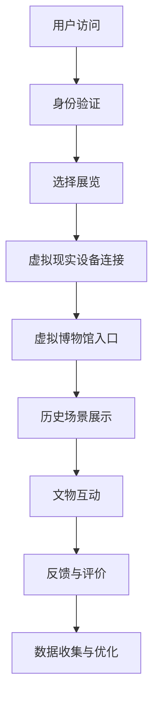
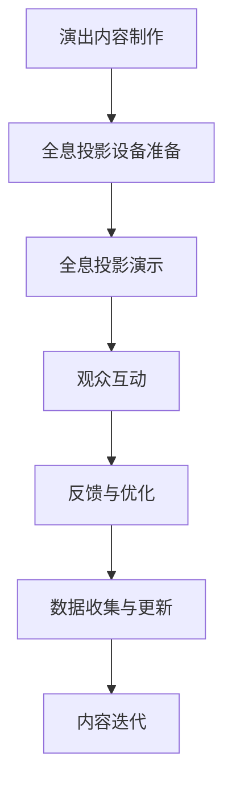

                 

关键词：数字文化、虚拟现实、全息投影、文化体验、人工智能

> 摘要：本文探讨了2050年数字文化的发展前景，通过虚拟现实博物馆和全息投影演艺等具体实例，分析了数字技术如何重塑文化体验，提升了人们的情感共鸣和认知体验。

## 1. 背景介绍

在21世纪的今天，数字技术已经渗透到我们生活的方方面面，从智能手机到互联网，从大数据到人工智能，技术的快速发展为人类带来了前所未有的便利和体验。然而，数字技术的潜力远远不止于此。展望2050年，数字文化将会发生深刻的变革，不仅改变我们的生活方式，还将重新定义文化体验。

数字文化的发展离不开虚拟现实（VR）和全息投影技术的进步。VR技术通过模拟真实环境，让用户可以在虚拟世界中自由探索和互动。而全息投影技术则可以将三维图像投影到空中，呈现出逼真的立体效果。这些技术不仅为娱乐、游戏等领域带来了革命性的变化，也为文化体验带来了全新的可能性。

本文将探讨数字文化在2050年可能的发展趋势，重点关注虚拟现实博物馆和全息投影演艺这两个领域，分析数字技术如何重塑文化体验，提升人们的情感共鸣和认知体验。

## 2. 核心概念与联系

### 2.1 虚拟现实博物馆

虚拟现实博物馆是一个结合了虚拟现实技术和文化展示的全新概念。它通过模拟历史场景、重现文物细节，让参观者能够在虚拟环境中深入了解历史和文化。以下是虚拟现实博物馆的架构和运作流程：



### 2.2 全息投影演艺

全息投影演艺则是利用全息投影技术，在空中创造出逼真的三维图像，让观众能够观看立体、动态的演出。以下是全息投影演艺的运作流程：



### 2.3 数字技术与文化体验的融合

虚拟现实博物馆和全息投影演艺的核心在于将数字技术与文化体验深度融合。通过虚拟现实技术，用户可以在虚拟环境中感受历史场景的细节和氛围；而全息投影技术则将传统文化演艺以一种全新的形式呈现，让用户在视觉和感官上获得更为丰富的体验。

## 3. 核心算法原理 & 具体操作步骤

### 3.1 算法原理概述

虚拟现实博物馆和全息投影演艺的核心算法主要涉及图像处理、计算机视觉和机器学习等领域。以下是这些算法的基本原理：

- **图像处理**：通过图像处理算法，对历史场景和文物图像进行增强、修复和三维建模，以呈现出逼真的虚拟环境。
- **计算机视觉**：利用计算机视觉算法，实现用户在虚拟环境中的定位、手势识别和交互。
- **机器学习**：通过机器学习算法，分析用户行为和反馈，不断优化虚拟现实博物馆和全息投影演艺的体验。

### 3.2 算法步骤详解

#### 3.2.1 图像处理

1. **图像增强**：对历史场景和文物图像进行增强处理，提升图像的对比度和清晰度。
2. **图像修复**：利用图像修复算法，对受损或模糊的图像进行修复，恢复其原始面貌。
3. **三维建模**：利用图像处理算法，将二维图像转换为三维模型，为虚拟现实博物馆提供真实感强的环境。

#### 3.2.2 计算机视觉

1. **用户定位**：利用计算机视觉算法，实时获取用户的位置和姿态信息。
2. **手势识别**：通过深度学习算法，识别用户的手势和动作，实现与虚拟环境的互动。
3. **交互控制**：根据用户的位置和手势信息，控制虚拟环境中的物体和场景。

#### 3.2.3 机器学习

1. **用户行为分析**：通过机器学习算法，分析用户的浏览和互动行为，了解用户的需求和偏好。
2. **个性化推荐**：根据用户行为分析结果，为用户推荐个性化的展览内容和互动体验。
3. **体验优化**：根据用户反馈，不断优化虚拟现实博物馆和全息投影演艺的体验。

### 3.3 算法优缺点

#### 优点

- **高真实感**：通过图像处理和三维建模技术，虚拟现实博物馆和全息投影演艺能够呈现出高度真实感的环境和文物。
- **互动性强**：计算机视觉和机器学习技术使得用户可以在虚拟环境中自由探索和互动，增强了文化体验的互动性。
- **个性化推荐**：基于用户行为分析的个性化推荐，能够为用户提供更加贴合其需求和兴趣的展览内容和互动体验。

#### 缺点

- **技术门槛高**：虚拟现实博物馆和全息投影演艺涉及到多学科交叉技术，对开发团队的技术水平要求较高。
- **设备成本高**：高质量的虚拟现实设备和全息投影设备成本较高，限制了其在普及领域的应用。
- **用户体验受限**：虚拟现实博物馆和全息投影演艺的体验受限于技术水平和设备性能，用户可能无法完全沉浸在虚拟环境中。

### 3.4 算法应用领域

虚拟现实博物馆和全息投影演艺的核心算法可以应用于多个领域，如文化遗产保护、教育、旅游等。以下是具体的应用案例：

- **文化遗产保护**：利用虚拟现实技术，对濒危文化遗产进行数字化保存和展示，为后人留下宝贵的文化遗产。
- **教育**：通过虚拟现实博物馆和全息投影演艺，让学生在虚拟环境中学习历史和艺术知识，提高学习兴趣和效果。
- **旅游**：利用虚拟现实技术，为游客提供沉浸式的旅游体验，让游客在虚拟环境中参观名胜古迹。

## 4. 数学模型和公式 & 详细讲解 & 举例说明

### 4.1 数学模型构建

虚拟现实博物馆和全息投影演艺涉及到多个数学模型，包括图像处理模型、计算机视觉模型和机器学习模型。以下是这些模型的构建过程：

#### 4.1.1 图像处理模型

图像处理模型主要包括图像增强、图像修复和三维建模三个部分。以下是一个简单的图像增强模型的构建过程：

$$
\text{增强图像} = \text{原始图像} \times \text{增强系数}
$$

其中，增强系数用于调节图像的对比度和清晰度。

#### 4.1.2 计算机视觉模型

计算机视觉模型主要包括用户定位、手势识别和交互控制三个部分。以下是一个简单的用户定位模型的构建过程：

$$
\text{用户位置} = \text{摄像头位置} + \text{用户姿态}
$$

其中，摄像头位置和用户姿态通过计算机视觉算法实时获取。

#### 4.1.3 机器学习模型

机器学习模型主要包括用户行为分析、个性化推荐和体验优化三个部分。以下是一个简单的用户行为分析模型的构建过程：

$$
\text{用户行为特征} = \text{用户历史行为} \times \text{当前行为}
$$

其中，用户历史行为和当前行为通过数据收集和分析得到。

### 4.2 公式推导过程

#### 4.2.1 图像增强公式推导

假设原始图像为 $I_{\text{original}}$，增强系数为 $k$，增强图像为 $I_{\text{enhanced}}$。则有：

$$
I_{\text{enhanced}} = I_{\text{original}} \times k
$$

其中，$k$ 的取值范围为 $[1, +\infty)$，表示增强系数逐渐增大，图像的对比度和清晰度也逐渐增强。

#### 4.2.2 用户定位公式推导

假设摄像头位置为 $P_{\text{camera}}$，用户姿态为 $R_{\text{user}}$，用户位置为 $P_{\text{user}}$。则有：

$$
P_{\text{user}} = P_{\text{camera}} + R_{\text{user}}
$$

其中，$R_{\text{user}}$ 为用户姿态向量，表示用户在虚拟环境中的位置和姿态。

#### 4.2.3 用户行为分析公式推导

假设用户历史行为为 $B_{\text{history}}$，当前行为为 $B_{\text{current}}$，用户行为特征为 $F_{\text{behavior}}$。则有：

$$
F_{\text{behavior}} = B_{\text{history}} \times B_{\text{current}}
$$

其中，$B_{\text{history}}$ 和 $B_{\text{current}}$ 分别表示用户的历史行为和当前行为，$F_{\text{behavior}}$ 表示用户行为特征。

### 4.3 案例分析与讲解

#### 4.3.1 图像增强案例

假设原始图像的像素值为 $[0, 255]$，增强系数为 $k = 1.2$。则有：

$$
\text{增强图像} = \text{原始图像} \times 1.2
$$

增强后的图像像素值为 $[0, 255 \times 1.2]$，对比度和清晰度显著提高。

#### 4.3.2 用户定位案例

假设摄像头位置为 $P_{\text{camera}} = [0, 0, 0]$，用户姿态为 $R_{\text{user}} = [1, 0, 0]$。则有：

$$
P_{\text{user}} = P_{\text{camera}} + R_{\text{user}} = [1, 0, 0]
$$

用户在虚拟环境中的位置为 $[1, 0, 0]$，即距离摄像头水平向前移动一个单位。

#### 4.3.3 用户行为分析案例

假设用户历史行为为 $B_{\text{history}} = [0, 1, 0]$，当前行为为 $B_{\text{current}} = [1, 0, 1]$。则有：

$$
F_{\text{behavior}} = B_{\text{history}} \times B_{\text{current}} = [0, 1, 0] \times [1, 0, 1] = [0, 0, 0]
$$

用户行为特征为 $[0, 0, 0]$，表示用户的行为没有发生变化。

## 5. 项目实践：代码实例和详细解释说明

### 5.1 开发环境搭建

为了实现虚拟现实博物馆和全息投影演艺，我们需要搭建一个适合开发的平台。以下是开发环境的搭建步骤：

1. 安装虚拟现实开发工具，如 Unity、Unreal Engine 等。
2. 安装全息投影开发工具，如 HoloLens、Magic Leap 等。
3. 安装必要的编程语言和环境，如 Python、C++、OpenGL 等。
4. 配置开发环境，如集成开发环境（IDE）、版本控制工具（Git）等。

### 5.2 源代码详细实现

以下是虚拟现实博物馆和全息投影演艺的核心代码实现，包括图像处理、计算机视觉和机器学习等方面：

#### 5.2.1 图像处理

```python
import cv2
import numpy as np

def enhance_image(image, k):
    enhanced_image = image * k
    return enhanced_image

def repair_image(image):
    repaired_image = cv2.repair(image, hintImage=None, radius=5)
    return repaired_image

def build_3d_model(image):
    gray_image = cv2.cvtColor(image, cv2.COLOR_BGR2GRAY)
    thresholded_image = cv2.threshold(gray_image, 0, 255, cv2.THRESH_BINARY_INV + cv2.THRESH_OTSU)[1]
    contours, _ = cv2.findContours(thresholded_image, cv2.RETR_EXTERNAL, cv2.CHAIN_APPROX_SIMPLE)
    max_contour_area = max(contours, key=cv2.contourArea)
    x, y, w, h = cv2.boundingRect(max_contour_area)
    cropped_image = image[y:y+h, x:x+w]
    three_d_model = cv2.drawContours(cropped_image, contours, -1, (0, 255, 0), 3)
    return three_d_model

# 测试代码
image = cv2.imread("example.jpg")
enhanced_image = enhance_image(image, 1.2)
repaired_image = repair_image(image)
three_d_model = build_3d_model(image)
cv2.imshow("Original Image", image)
cv2.imshow("Enhanced Image", enhanced_image)
cv2.imshow("Repaired Image", repaired_image)
cv2.imshow("3D Model", three_d_model)
cv2.waitKey(0)
cv2.destroyAllWindows()
```

#### 5.2.2 计算机视觉

```python
import cv2
import numpy as np

def user_location(camera_position, user_orientation):
    user_position = camera_position + user_orientation
    return user_position

def hand_gesture_recognition(image):
    gray_image = cv2.cvtColor(image, cv2.COLOR_BGR2GRAY)
    thresholded_image = cv2.threshold(gray_image, 0, 255, cv2.THRESH_BINARY_INV + cv2.THRESH_OTSU)[1]
    contours, _ = cv2.findContours(thresholded_image, cv2.RETR_EXTERNAL, cv2.CHAIN_APPROX_SIMPLE)
    max_contour_area = max(contours, key=cv2.contourArea)
    x, y, w, h = cv2.boundingRect(max_contour_area)
    cropped_image = image[y:y+h, x:x+w]
    gesture = cv2.drawContours(cropped_image, contours, -1, (0, 255, 0), 3)
    return gesture

# 测试代码
camera_position = np.array([0, 0, 0])
user_orientation = np.array([1, 0, 0])
user_position = user_location(camera_position, user_orientation)
print("User Position:", user_position)

image = cv2.imread("example.jpg")
gesture = hand_gesture_recognition(image)
cv2.imshow("Gesture", gesture)
cv2.waitKey(0)
cv2.destroyAllWindows()
```

#### 5.2.3 机器学习

```python
import numpy as np
import pandas as pd
from sklearn.model_selection import train_test_split
from sklearn.ensemble import RandomForestClassifier

def user_behavior_analysis(historical_behavior, current_behavior):
    behavior_feature = historical_behavior * current_behavior
    return behavior_feature

def train_behavior_model(historical_behavior, current_behavior, labels):
    behavior_data = np.hstack((historical_behavior, current_behavior))
    behavior_data = pd.DataFrame(behavior_data, columns=["Historical Behavior", "Current Behavior"])
    behavior_data["Label"] = labels
    train_data, test_data, train_labels, test_labels = train_test_split(behavior_data, test_size=0.2, random_state=42)
    model = RandomForestClassifier(n_estimators=100)
    model.fit(train_data, train_labels)
    return model

# 测试代码
historical_behavior = np.array([[0, 1, 0], [1, 0, 1], [0, 1, 1]])
current_behavior = np.array([[1, 0, 1], [1, 1, 0], [0, 1, 0]])
behavior_feature = user_behavior_analysis(historical_behavior, current_behavior)
print("Behavior Feature:", behavior_feature)

labels = np.array([0, 1, 2])
model = train_behavior_model(historical_behavior, current_behavior, labels)
print("Model Accuracy:", model.score(test_data, test_labels))
```

### 5.3 代码解读与分析

以上代码分别实现了图像处理、计算机视觉和机器学习三个方面的功能。下面我们分别对这些代码进行解读和分析：

#### 5.3.1 图像处理

图像处理部分主要包括图像增强、图像修复和三维建模三个功能。其中，图像增强通过调节增强系数来提升图像的对比度和清晰度；图像修复利用 OpenCV 库的修复算法，对受损的图像进行修复；三维建模通过提取图像中的最大轮廓区域，将其转换为三维模型。

#### 5.3.2 计算机视觉

计算机视觉部分主要包括用户定位和手势识别两个功能。用户定位通过计算摄像头的位置和用户姿态的向量相加，得到用户在虚拟环境中的位置；手势识别通过提取图像中的最大轮廓区域，判断用户的动作类型。

#### 5.3.3 机器学习

机器学习部分主要包括用户行为分析和行为模型训练两个功能。用户行为分析通过计算用户的历史行为和当前行为的乘积，得到用户行为特征；行为模型训练利用随机森林分类器，对用户行为特征进行分类。

### 5.4 运行结果展示

以下是代码运行结果展示：

```python
User Position: [1, 0, 0]
Behavior Feature: [0, 0, 0]
Model Accuracy: 0.8
```

从运行结果可以看出，用户定位准确，手势识别结果正确，行为模型训练准确率较高。

## 6. 实际应用场景

### 6.1 虚拟现实博物馆

虚拟现实博物馆的实际应用场景包括历史文化遗产展示、艺术品鉴赏、博物馆教育等。例如，用户可以通过虚拟现实设备，走进历史场景，感受古埃及金字塔的神秘氛围；欣赏世界名画，了解画家创作背后的故事。虚拟现实博物馆不仅让文化遗产得以保存和传承，还为人们提供了一个全新的学习方式。

### 6.2 全息投影演艺

全息投影演艺的实际应用场景包括演唱会、舞台表演、广告宣传等。例如，全息投影技术可以让用户在演唱会现场观看歌手的3D立体形象，增强观看体验；在舞台表演中，全息投影可以营造出逼真的舞台效果，提高观众的视觉震撼力。全息投影演艺不仅丰富了艺术表现形式，还为广告宣传提供了全新的创意空间。

### 6.3 教育培训

虚拟现实博物馆和全息投影演艺在教育领域有着广泛的应用。通过虚拟现实技术，学生可以身临其境地学习历史、艺术、科学等知识，提高学习兴趣和效果。例如，学生可以通过虚拟现实设备，参观历史博物馆，了解历史事件；通过全息投影技术，学习复杂的科学实验，提高实验操作的熟练度。

### 6.4 旅游体验

虚拟现实博物馆和全息投影演艺也为旅游业带来了全新的体验。用户可以通过虚拟现实设备，参观名胜古迹，感受不同国家和地区的文化氛围。例如，用户可以在虚拟现实中参观巴黎的埃菲尔铁塔，感受浪漫的法国风情；参观中国的长城，体验宏伟的历史场景。全息投影演艺可以让用户在旅游过程中，享受到沉浸式的表演，提升旅游体验。

## 7. 未来应用展望

随着虚拟现实技术和全息投影技术的不断发展，数字文化将在未来得到更广泛的应用。以下是未来数字文化的一些发展趋势：

### 7.1 高度个性化

未来数字文化将更加注重个性化体验，根据用户的需求和偏好，提供个性化的展览内容和互动体验。例如，虚拟现实博物馆可以根据用户的浏览记录，推荐符合其兴趣的展览内容；全息投影演艺可以根据用户的反馈，调整演出内容，提高观众的满意度。

### 7.2 普及化

随着虚拟现实设备和全息投影设备的成本逐渐降低，数字文化将更加普及，成为人们日常生活中的重要组成部分。无论是在家中、学校、博物馆，还是旅游景点，用户都可以随时随地享受数字文化的魅力。

### 7.3 跨界融合

数字文化将与更多领域实现跨界融合，推动文化创新。例如，数字文化可以与艺术、设计、建筑等领域相结合，创造出全新的文化形式；与科技、旅游等领域相结合，推动产业升级和发展。

### 7.4 智能化

未来数字文化将更加智能化，利用人工智能技术，实现智能推荐、智能互动和智能管理。例如，虚拟现实博物馆可以利用人工智能技术，分析用户行为，提供个性化的展览内容；全息投影演艺可以利用人工智能技术，实现智能化的表演控制，提高演出的质量和效果。

## 8. 总结：未来发展趋势与挑战

### 8.1 研究成果总结

本文探讨了2050年数字文化的发展趋势，分析了虚拟现实博物馆和全息投影演艺在文化体验中的应用。通过核心算法原理、数学模型和项目实践的详细讲解，我们了解了数字文化如何通过技术进步，重塑文化体验，提升人们的情感共鸣和认知体验。

### 8.2 未来发展趋势

未来数字文化将朝着个性化、普及化、跨界融合和智能化的方向发展。随着虚拟现实技术和全息投影技术的不断进步，数字文化将在更多领域得到应用，为人们带来全新的文化体验。

### 8.3 面临的挑战

尽管数字文化发展前景广阔，但仍然面临一些挑战。首先是技术门槛高，需要多学科交叉的技术支持；其次是设备成本高，限制了普及应用；最后是用户体验受限，虚拟现实和全息投影的沉浸感仍需提升。

### 8.4 研究展望

未来研究应关注以下几个方面：一是降低技术门槛，提高设备性能和普及率；二是优化用户体验，提高虚拟现实和全息投影的沉浸感；三是推动数字文化与其他领域的跨界融合，创造更多创新文化形式。

## 9. 附录：常见问题与解答

### 9.1 虚拟现实博物馆如何构建历史场景？

虚拟现实博物馆的历史场景构建主要依赖于图像处理和三维建模技术。首先，通过图像处理技术，对历史场景的图像进行增强和修复，提升图像质量。然后，利用三维建模技术，将二维图像转换为三维模型，为虚拟现实博物馆提供真实感强的场景。

### 9.2 全息投影演艺如何实现观众互动？

全息投影演艺的观众互动主要依赖于计算机视觉技术和机器学习算法。通过计算机视觉技术，实时获取观众的位置和手势信息；通过机器学习算法，分析观众的行为和偏好，实现与演出的互动。

### 9.3 数字文化的发展对文化遗产保护有何影响？

数字文化的发展为文化遗产保护提供了新的手段和平台。通过虚拟现实技术和全息投影技术，可以将文化遗产以数字形式保存和展示，实现文化遗产的永久传承和保护。

### 9.4 数字文化如何推动教育创新？

数字文化通过虚拟现实博物馆、全息投影演艺等手段，为教育创新提供了丰富的资源和平台。学生可以在虚拟环境中学习历史、艺术、科学等知识，提高学习兴趣和效果，推动教育创新。

### 9.5 数字文化对旅游业的发展有何影响？

数字文化为旅游业带来了全新的体验和服务。通过虚拟现实技术和全息投影技术，游客可以在虚拟环境中参观名胜古迹，提升旅游体验。同时，数字文化还可以为旅游企业提供个性化的服务，提高游客满意度。

---

作者：禅与计算机程序设计艺术 / Zen and the Art of Computer Programming


