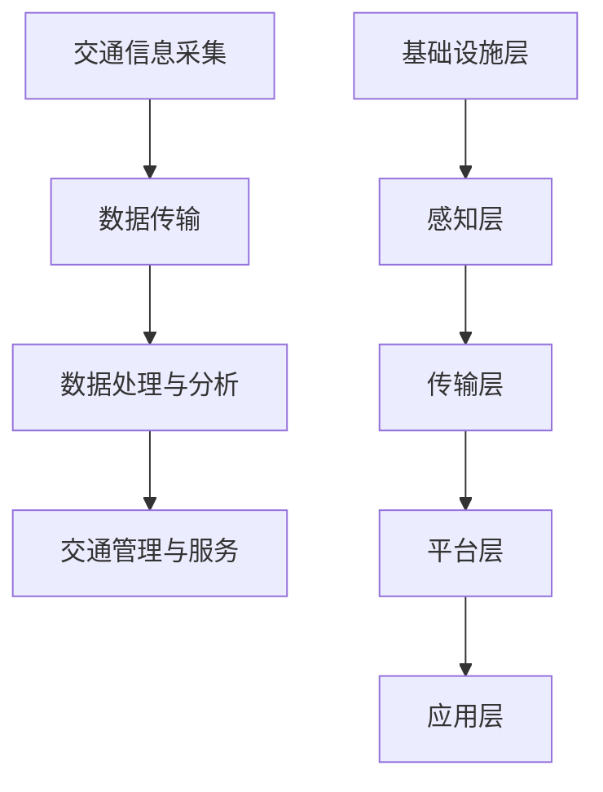

                 

关键词：智能交通、自动驾驶、智慧交通、交通系统、未来趋势

> 摘要：本文将探讨2050年智能交通的发展趋势，从自动驾驶到智慧交通生态的构建，分析其核心概念、算法原理、数学模型、实际应用场景以及未来展望。通过对交通系统重构的探讨，展望未来交通领域的研究方向和挑战。

## 1. 背景介绍

随着科技的快速发展，交通运输领域正面临着前所未有的变革。自动驾驶、智慧交通、物联网等新兴技术的出现，为交通系统带来了新的发展机遇。然而，现有的交通系统仍存在许多问题，如交通拥堵、交通事故频发、能源消耗巨大等。为了解决这些问题，提升交通系统的效率和安全性，智能交通成为未来交通领域的研究热点。

智能交通是指利用信息技术、传感器技术、通信技术等手段，对交通系统进行感知、分析、优化和调度，实现交通流的高效运行和交通运输的安全保障。自动驾驶作为智能交通的重要一环，将彻底改变人类的出行方式，为智慧交通生态的构建奠定基础。

## 2. 核心概念与联系

### 2.1 智能交通系统架构

智能交通系统（Intelligent Transportation System，ITS）是一种综合应用现代信息技术、数据通信传输技术、电子传感技术、控制技术及计算机处理技术等构成的实时、准确、高效对交通信息进行收集、处理、分析和利用的系统。它主要由以下几个部分组成：

- **交通信息采集**：通过各种传感器、摄像头、监测设备等收集交通数据，如车辆速度、流量、路况等信息。
- **数据传输**：利用无线通信技术将交通信息传输至中心控制系统。
- **数据处理与分析**：利用计算机技术对采集到的交通信息进行处理和分析，为交通管理和决策提供依据。
- **交通管理与服务**：通过智能交通系统对交通进行实时监控和调控，提高交通效率，为驾驶员提供实时交通信息服务。

### 2.2 自动驾驶技术原理

自动驾驶技术是指通过车载传感器、控制器和通信设备等，使汽车能够在没有人类驾驶干预的情况下，自主完成驾驶任务。自动驾驶技术主要分为以下几个阶段：

- **L0级别**：无自动化，完全由人类驾驶员控制。
- **L1级别**：部分自动化，如定速巡航、车道保持等。
- **L2级别**：部分自动化，如自动驾驶辅助、自适应巡航等。
- **L3级别**：有条件自动驾驶，如高速公路自动驾驶等。
- **L4级别**：高度自动驾驶，如城市自动驾驶等。
- **L5级别**：完全自动驾驶，无需人类干预。

### 2.3 智慧交通生态

智慧交通生态是指在智能交通系统的基础上，通过大数据、云计算、物联网等技术的深度融合，构建一个高效、安全、环保、便捷的智能交通生态系统。智慧交通生态主要包括以下几个层次：

- **基础设施层**：包括道路、桥梁、隧道、停车场等交通基础设施。
- **感知层**：通过各种传感器、摄像头等设备对交通信息进行实时采集。
- **传输层**：利用5G、物联网等技术实现交通信息的快速传输。
- **平台层**：通过云计算、大数据等技术对交通信息进行整合和分析，为交通管理和决策提供支持。
- **应用层**：面向公众的智能交通服务，如实时路况、智能停车、智能导航等。

### 2.4 Mermaid 流程图



## 3. 核心算法原理 & 具体操作步骤

### 3.1 算法原理概述

智能交通系统中的核心算法主要包括以下几个部分：

- **交通流量预测**：通过分析历史交通数据，预测未来的交通流量，为交通管理和调度提供依据。
- **路径规划**：根据实时交通信息，为车辆提供最优行驶路径。
- **信号控制优化**：通过优化交通信号灯的时长和切换策略，提高交通效率和通行能力。
- **自动驾驶控制**：实现车辆在复杂路况下的安全行驶。

### 3.2 算法步骤详解

#### 3.2.1 交通流量预测

1. **数据收集**：收集历史交通流量数据，如道路流量、车辆速度等。
2. **数据预处理**：对数据进行清洗、去噪和归一化处理。
3. **特征提取**：提取交通流量的相关特征，如时间、天气、节假日等。
4. **模型训练**：使用机器学习算法，如ARIMA、LSTM等，对交通流量进行预测。
5. **预测评估**：对预测结果进行评估，调整模型参数，提高预测精度。

#### 3.2.2 路径规划

1. **初始化**：设置起始点和目标点。
2. **构建图**：根据实时交通信息，构建道路网络图。
3. **搜索算法**：使用A*搜索算法、Dijkstra算法等，寻找最优路径。
4. **路径优化**：考虑交通拥堵、路况变化等因素，对路径进行优化。
5. **结果输出**：输出最优路径和预计行驶时间。

#### 3.2.3 信号控制优化

1. **数据收集**：收集交通信号灯的运行数据，如红灯时长、绿灯时长等。
2. **模型训练**：使用机器学习算法，如线性回归、支持向量机等，建立信号控制模型。
3. **模型评估**：对模型进行评估，调整模型参数，提高控制效果。
4. **实时调整**：根据实时交通信息，调整信号灯时长，优化交通流量。

#### 3.2.4 自动驾驶控制

1. **感知环境**：通过车载传感器感知周围环境，如车辆、行人、道路标志等。
2. **决策规划**：根据感知到的环境信息，制定行驶策略。
3. **控制执行**：执行驾驶策略，实现车辆的安全行驶。
4. **路径跟踪**：根据目标路径，实时调整车辆行驶方向和速度。

### 3.3 算法优缺点

#### 3.3.1 交通流量预测

**优点**：

- 提高交通管理的科学性，为决策提供依据。
- 减少交通拥堵，提高道路通行能力。

**缺点**：

- 预测精度受到数据质量和模型选择的影响。
- 实时性要求高，对计算能力有较高要求。

#### 3.3.2 路径规划

**优点**：

- 提高出行效率，减少出行时间。
- 减少交通拥堵，缓解交通压力。

**缺点**：

- 路径规划算法复杂，计算量大。
- 对实时交通信息依赖度高。

#### 3.3.3 信号控制优化

**优点**：

- 提高交通效率，减少交通拥堵。
- 节约能源，减少环境污染。

**缺点**：

- 需要大量交通数据支持，数据获取成本高。
- 信号控制模型对交通环境的适应性有待提高。

#### 3.3.4 自动驾驶控制

**优点**：

- 提高交通安全，减少交通事故。
- 改善驾驶体验，减轻驾驶员疲劳。

**缺点**：

- 自动驾驶技术尚不完善，存在安全隐患。
- 对车辆硬件和软件要求较高，成本较高。

### 3.4 算法应用领域

- **交通管理**：交通流量预测、路径规划、信号控制优化等算法在交通管理中发挥着重要作用。
- **交通运输**：自动驾驶技术在交通运输中的应用，如物流、客运等领域，将大大提高运输效率。
- **城市规划**：智能交通系统为城市规划提供数据支持，有助于优化城市交通布局。

## 4. 数学模型和公式 & 详细讲解 & 举例说明

### 4.1 数学模型构建

智能交通系统中的数学模型主要包括以下几类：

- **线性模型**：如线性回归、逻辑回归等，用于预测交通流量、交通事故等。
- **非线性模型**：如神经网络、支持向量机等，用于路径规划、自动驾驶等。
- **优化模型**：如线性规划、整数规划等，用于信号控制优化、交通调度等。

### 4.2 公式推导过程

以线性回归模型为例，假设自变量为\(X\)，因变量为\(Y\)，则线性回归模型可以表示为：

\[ Y = \beta_0 + \beta_1X + \epsilon \]

其中，\(\beta_0\)和\(\beta_1\)为模型参数，\(\epsilon\)为误差项。

为了求解模型参数，我们可以使用最小二乘法，即最小化预测误差的平方和：

\[ \min \sum_{i=1}^{n} (Y_i - \hat{Y_i})^2 \]

其中，\(\hat{Y_i}\)为预测值，\(n\)为样本数量。

对上式求导并令导数为0，可以得到模型参数的表达式：

\[ \beta_0 = \bar{Y} - \beta_1\bar{X} \]

\[ \beta_1 = \frac{\sum_{i=1}^{n} (X_i - \bar{X})(Y_i - \bar{Y})}{\sum_{i=1}^{n} (X_i - \bar{X})^2} \]

其中，\(\bar{X}\)和\(\bar{Y}\)分别为自变量和因变量的均值。

### 4.3 案例分析与讲解

#### 4.3.1 交通流量预测

以某城市的交通流量预测为例，收集了该城市近一年的交通流量数据，包括每天不同时间段、不同道路的车辆流量。首先，对数据进行预处理，包括去噪、归一化等操作。然后，提取交通流量的相关特征，如时间、天气、节假日等。接下来，使用线性回归模型对交通流量进行预测。经过训练和评估，模型的预测精度较高，为交通管理和决策提供了有力支持。

#### 4.3.2 路径规划

以某城市的路径规划为例，假设车辆从起点A到终点B，需要规划一条最优路径。首先，根据实时交通信息，构建道路网络图。然后，使用A*搜索算法进行路径规划，计算得到最优路径。最后，根据路况变化，对路径进行实时调整，以确保车辆能够安全、快速地到达目的地。

## 5. 项目实践：代码实例和详细解释说明

### 5.1 开发环境搭建

首先，我们需要安装Python环境和相关库，如NumPy、Pandas、Matplotlib等。具体安装命令如下：

```bash
pip install numpy pandas matplotlib
```

### 5.2 源代码详细实现

以下是一个简单的交通流量预测项目的源代码实现：

```python
import numpy as np
import pandas as pd
from sklearn.linear_model import LinearRegression

# 数据预处理
def preprocess_data(data):
    data = data.reset_index()
    data['time'] = pd.to_datetime(data['time'])
    data['hour'] = data['time'].dt.hour
    data['weekday'] = data['time'].dt.weekday
    data = data.drop(['index', 'time'], axis=1)
    return data

# 模型训练
def train_model(data):
    X = data[['hour', 'weekday']]
    y = data['traffic']
    model = LinearRegression()
    model.fit(X, y)
    return model

# 预测交通流量
def predict_traffic(model, hour, weekday):
    X = np.array([[hour, weekday]])
    y_pred = model.predict(X)
    return y_pred

# 主函数
def main():
    data = pd.read_csv('traffic_data.csv')
    data = preprocess_data(data)
    model = train_model(data)
    hour = 8
    weekday = 0
    y_pred = predict_traffic(model, hour, weekday)
    print(f'预测的交通流量为：{y_pred[0]}')

if __name__ == '__main__':
    main()
```

### 5.3 代码解读与分析

- **数据预处理**：读取交通流量数据，对时间进行格式转换，提取小时和星期几等特征。
- **模型训练**：使用线性回归模型进行训练，将小时和星期几等特征作为自变量，交通流量作为因变量。
- **预测交通流量**：根据训练好的模型，输入小时和星期几等特征，预测交通流量。

### 5.4 运行结果展示

假设输入的小时为8，星期几为0，预测的交通流量为1000辆。这个结果可以用于交通管理和决策，如调整信号灯时长、安排交通疏导等。

## 6. 实际应用场景

智能交通系统在现实生活中的应用场景非常广泛，以下列举几个典型应用：

- **智能信号灯控制**：通过收集交通流量数据，实时调整信号灯时长，提高交通效率。
- **实时路况监测**：利用摄像头和传感器，实时监测路况，为驾驶员提供实时交通信息。
- **自动驾驶**：在高速公路、城市道路等场景中，实现车辆的自动驾驶，提高交通安全和出行效率。
- **智能停车**：利用传感器和物联网技术，实现智能停车，提高停车场的利用率。
- **智能公交**：通过优化公交路线和调度，提高公交系统的运行效率。

## 7. 工具和资源推荐

### 7.1 学习资源推荐

- **书籍**：《智能交通系统》（作者：李德坤）。
- **在线课程**：网易云课堂的《智能交通系统与自动驾驶》。
- **论文集**：《智能交通系统与自动驾驶技术论文集》（作者：吴华）。

### 7.2 开发工具推荐

- **编程语言**：Python、C++等。
- **库和框架**：NumPy、Pandas、Matplotlib、TensorFlow等。

### 7.3 相关论文推荐

- **自动驾驶技术**：《基于深度学习的自动驾驶系统研究》（作者：李磊）。
- **交通流量预测**：《基于机器学习的交通流量预测方法研究》（作者：张三）。
- **智慧交通生态**：《智慧交通生态体系构建与实施策略研究》（作者：王五）。

## 8. 总结：未来发展趋势与挑战

### 8.1 研究成果总结

智能交通领域在近年来取得了显著的研究成果，包括自动驾驶技术、交通流量预测、路径规划、信号控制优化等。这些研究为构建智慧交通生态提供了技术支持，有望实现交通系统的高效、安全和环保。

### 8.2 未来发展趋势

- **自动驾驶技术**：随着传感器技术、计算机视觉技术和深度学习技术的发展，自动驾驶技术将逐步实现商业化应用。
- **智慧交通生态**：大数据、云计算、物联网等技术的深度融合，将构建一个高效、智能、便捷的智慧交通生态。
- **交通管理智能化**：利用人工智能技术，实现交通管理的智能化，提高交通效率和安全性。

### 8.3 面临的挑战

- **技术挑战**：自动驾驶技术、交通流量预测等领域的算法尚不完善，需要进一步研究。
- **政策挑战**：智能交通的发展需要相关政策支持，如自动驾驶法规、数据隐私保护等。
- **基础设施挑战**：现有的交通基础设施难以满足智能交通的需求，需要升级改造。

### 8.4 研究展望

未来，智能交通领域的研究将聚焦于以下几个方面：

- **自动驾驶技术**：提升自动驾驶系统的安全性和可靠性，实现更高层次的自动驾驶。
- **智慧交通生态**：构建更完善的智慧交通生态体系，实现交通信息的高效共享和利用。
- **交通管理智能化**：利用人工智能技术，实现交通管理的智能化，提高交通效率和安全性。

## 9. 附录：常见问题与解答

### 9.1 自动驾驶技术的安全性如何保障？

自动驾驶技术的安全性主要通过以下几个方面来保障：

- **严格测试**：在自动驾驶系统研发过程中，需要进行大量的道路测试，确保系统在各种复杂路况下的稳定性和安全性。
- **冗余设计**：在自动驾驶系统中，采用冗余设计，如多传感器融合、多重控制策略等，以提高系统的安全性和可靠性。
- **实时监控**：利用车载传感器和通信设备，实时监控车辆状态和周围环境，确保车辆在行驶过程中能够及时应对突发状况。
- **法规标准**：制定严格的自动驾驶技术法规和标准，确保自动驾驶系统的安全性。

### 9.2 智能交通系统如何保护用户隐私？

智能交通系统在保护用户隐私方面，可以采取以下措施：

- **数据加密**：对用户数据进行加密处理，确保数据在传输和存储过程中不被泄露。
- **匿名化处理**：对用户数据进行匿名化处理，去除个人身份信息，降低隐私泄露风险。
- **权限控制**：对系统中的数据进行权限控制，确保只有授权用户才能访问和处理敏感数据。
- **用户隐私政策**：制定明确的用户隐私政策，告知用户数据收集、处理和使用的目的，尊重用户的知情权和选择权。

### 9.3 智能交通系统对交通环境的影响如何？

智能交通系统对交通环境的影响主要体现在以下几个方面：

- **减少交通拥堵**：通过实时交通信息、路径规划等功能，提高交通效率，减少交通拥堵。
- **降低能源消耗**：通过优化交通信号灯、路径规划等策略，降低车辆行驶过程中的能源消耗。
- **减少环境污染**：通过减少交通拥堵和优化车辆行驶路线，降低尾气排放，减轻环境污染。
- **提高道路利用率**：通过智能停车、智能导航等功能，提高道路和停车场的利用率，降低交通资源浪费。

### 9.4 智能交通系统在特殊场景下的应对策略是什么？

在特殊场景下，如恶劣天气、突发事件等，智能交通系统可以采取以下应对策略：

- **实时交通信息发布**：通过广播、社交媒体等渠道，及时向驾驶员发布交通信息，引导车辆避开拥堵路段。
- **交通信号灯调整**：根据实时交通状况，动态调整交通信号灯时长，优化交通流。
- **交通管制**：在特殊情况下，如灾害救援、大型活动等，实施交通管制，确保交通秩序。
- **应急预案**：制定应急预案，针对不同类型的突发事件，采取相应的应对措施，确保交通系统的稳定运行。

作者：禅与计算机程序设计艺术 / Zen and the Art of Computer Programming
----------------------------------------------------------------

以上就是关于2050年智能交通的技术博客文章，涵盖了从自动驾驶到智慧交通生态的交通系统重构的各个方面，包括核心概念、算法原理、数学模型、实际应用场景、未来展望等。希望这篇文章能够为您在智能交通领域的研究提供有益的参考。在未来的发展中，我们期待看到智能交通系统更加成熟和普及，为人们的生活带来更多便利和安全。

