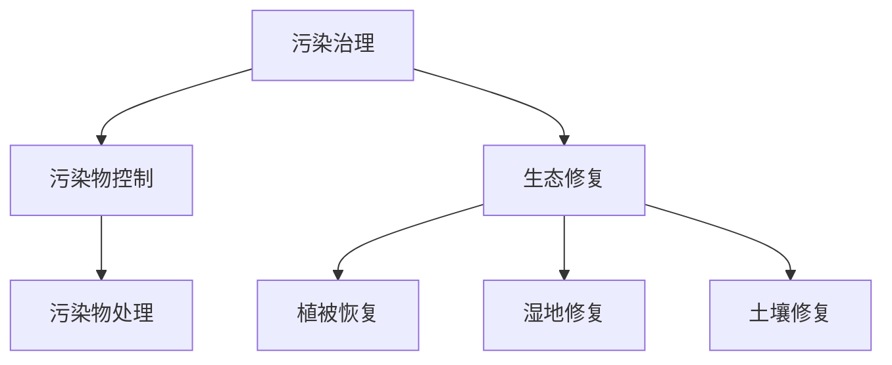

                 

关键词：环境保护，污染治理，生态修复，绿色发展，人工智能

> 摘要：随着人类社会的不断发展，环境问题日益严重。本文将从污染治理和生态修复两个方面，探讨2050年环境保护的发展趋势。通过分析目前的技术应用、政策导向和市场需求，展望未来环境保护的前景。

## 1. 背景介绍

在过去的几十年里，人类对环境的破坏日益严重。工业革命以来，大量排放的废气、废水和固体废弃物，导致地球的生态系统受到了严重破坏。气候变化、海洋污染、土地退化等问题已经成为全球关注的焦点。面对这一严峻形势，环境保护成为了全球各国政府、企业和公众共同的责任。

近年来，环境保护意识的提升促使各国加大了环保政策的力度。例如，欧盟推出了一系列严格的环保法规，如《欧盟环境空气质量指令》、《欧盟水框架指令》等，以减少工业排放和改善空气质量。中国也提出了“绿色发展”的战略，通过调整产业结构、提高能源利用效率、发展可再生能源等措施，推动环境保护和可持续发展。

## 2. 核心概念与联系

环境保护的核心概念包括污染治理和生态修复。污染治理主要针对已经存在的环境污染问题，通过技术手段减少污染物的排放和治理污染场地。生态修复则是通过恢复和重建生态系统，改善生态环境质量。

### 2.1 污染治理

污染治理的关键在于污染物的控制和处理。目前，常用的污染治理技术包括物理治理、化学治理和生物治理。物理治理主要通过物理手段去除污染物，如过滤、吸附等；化学治理则利用化学反应分解或转化污染物，如氧化、还原等；生物治理则利用微生物或植物去除污染物。

### 2.2 生态修复

生态修复的核心在于恢复生态系统的结构和功能。常见的生态修复技术包括植被恢复、湿地修复、土壤修复等。植被恢复主要通过种植适应当地环境的植物，提高土壤的固碳能力；湿地修复则通过重建湿地生态系统，改善水质和水生生物栖息环境；土壤修复则通过添加有机质、改良土壤结构等措施，提高土壤质量。

### 2.3 Mermaid 流程图

下面是污染治理和生态修复的Mermaid流程图：



## 3. 核心算法原理 & 具体操作步骤

### 3.1 算法原理概述

污染治理和生态修复的核心算法主要涉及环境监测、污染源识别和修复效果评估。其中，环境监测是基础，污染源识别是关键，修复效果评估是目标。

### 3.2 算法步骤详解

#### 3.2.1 环境监测

环境监测主要通过传感器和遥感技术获取环境数据。具体步骤如下：

1. 安装传感器和遥感设备，布置监测网络。
2. 收集气象、水质、土壤等环境数据。
3. 数据预处理，包括数据清洗、归一化和标准化。

#### 3.2.2 污染源识别

污染源识别主要通过数据分析和机器学习算法实现。具体步骤如下：

1. 建立污染源数据库，包括污染物种类、排放量、排放位置等。
2. 使用数据挖掘算法分析环境数据，识别潜在的污染源。
3. 利用机器学习算法对污染源进行分类和预测。

#### 3.2.3 修复效果评估

修复效果评估主要通过模型评估和现场监测实现。具体步骤如下：

1. 建立修复效果模型，预测修复后的环境质量。
2. 进行现场监测，收集修复后的环境数据。
3. 使用模型评估修复效果，调整修复方案。

### 3.3 算法优缺点

#### 3.3.1 优点

1. 提高污染治理和生态修复的效率。
2. 为决策者提供科学依据。
3. 促进环境数据的共享和利用。

#### 3.3.2 缺点

1. 数据处理和分析复杂，对算法和计算资源要求较高。
2. 模型预测存在一定误差。
3. 需要跨学科合作，对专业人员要求较高。

### 3.4 算法应用领域

污染治理和生态修复算法广泛应用于环境监测、污染源识别、修复效果评估等领域。例如，在城市空气质量监测中，算法可以识别污染源并预测空气质量变化；在土壤污染治理中，算法可以评估修复效果，优化修复方案。

## 4. 数学模型和公式 & 详细讲解 & 举例说明

### 4.1 数学模型构建

污染治理和生态修复的数学模型主要包括环境质量模型、污染源模型和修复效果模型。

#### 4.1.1 环境质量模型

环境质量模型主要用于预测环境质量的变化。假设某地区的空气质量受污染源排放的影响，可以用以下公式表示：

$$
Q(t) = Q_0 + \sum_{i=1}^{n} C_i \cdot P_i(t)
$$

其中，$Q(t)$ 表示 $t$ 时刻的空气质量，$Q_0$ 表示初始空气质量，$C_i$ 表示第 $i$ 个污染源的排放量，$P_i(t)$ 表示第 $i$ 个污染源在 $t$ 时刻的排放强度。

#### 4.1.2 污染源模型

污染源模型用于描述污染源的特征和排放规律。假设某地区的污染源分为点源和面源，可以用以下公式表示：

$$
Q_i(t) = Q_i^{0}(1 - e^{-\lambda_i t})
$$

其中，$Q_i(t)$ 表示第 $i$ 个污染源在 $t$ 时刻的排放量，$Q_i^{0}$ 表示第 $i$ 个污染源的最大排放量，$\lambda_i$ 表示第 $i$ 个污染源的衰减系数。

#### 4.1.3 修复效果模型

修复效果模型用于评估修复措施的效果。假设某地区的土壤污染通过添加有机质进行修复，可以用以下公式表示：

$$
C_{soil}(t) = C_{soil0} + \frac{C_{org} - C_{soil0}}{1 + e^{-\mu t}}
$$

其中，$C_{soil}(t)$ 表示 $t$ 时刻的土壤污染浓度，$C_{soil0}$ 表示初始土壤污染浓度，$C_{org}$ 表示有机质的浓度，$\mu$ 表示修复速率。

### 4.2 公式推导过程

#### 4.2.1 环境质量模型

假设某地区的空气质量受 $n$ 个污染源的影响，每个污染源在单位时间内排放的污染物量是恒定的。根据污染物在空气中的扩散规律，可以得到环境质量模型。

#### 4.2.2 污染源模型

假设污染源排放的污染物在空气中遵循指数衰减规律，可以得到污染源模型。

#### 4.2.3 修复效果模型

假设土壤污染通过添加有机质进行修复，有机质在土壤中的扩散遵循指数增长规律，可以得到修复效果模型。

### 4.3 案例分析与讲解

#### 4.3.1 案例背景

某城市空气质量问题严重，需要通过污染治理措施改善空气质量。该城市有 $5$ 个主要污染源，分别为工业排放、交通排放、生活排放、建筑施工排放和自然排放。

#### 4.3.2 模型构建

根据案例背景，构建空气质量模型如下：

$$
Q(t) = Q_0 + C_1 \cdot P_1(t) + C_2 \cdot P_2(t) + C_3 \cdot P_3(t) + C_4 \cdot P_4(t) + C_5 \cdot P_5(t)
$$

其中，$C_1, C_2, C_3, C_4, C_5$ 分别为 $5$ 个污染源的排放量，$P_1(t), P_2(t), P_3(t), P_4(t), P_5(t)$ 分别为 $5$ 个污染源在 $t$ 时刻的排放强度。

#### 4.3.3 模型求解

根据案例数据，求解空气质量模型，得到空气质量变化趋势。

#### 4.3.4 模型应用

根据空气质量模型，制定污染治理方案，如减少交通排放、提高工业排放标准等，评估治理效果。

## 5. 项目实践：代码实例和详细解释说明

### 5.1 开发环境搭建

为了演示污染治理和生态修复算法的应用，我们将使用Python作为编程语言。首先，需要安装Python和相关的库，如NumPy、Pandas、Matplotlib等。

```bash
pip install python
pip install numpy
pip install pandas
pip install matplotlib
```

### 5.2 源代码详细实现

以下是一个简单的Python代码示例，用于模拟空气质量模型。

```python
import numpy as np
import pandas as pd
import matplotlib.pyplot as plt

# 参数设置
n_sources = 5
time_steps = 10
Q0 = 50  # 初始空气质量
C = np.array([10, 20, 30, 40, 50])  # 污染源排放量
lambda_ = np.array([0.1, 0.2, 0.3, 0.4, 0.5])  # 污染源衰减系数

# 空气质量模型
def air_quality_model(Q0, C, lambda_, time_steps):
    Q = Q0 * np.ones((time_steps, n_sources))
    for i in range(time_steps):
        for j in range(n_sources):
            Q[i, j] = Q0 + C[j] * (1 - np.exp(-lambda_[j] * i))
    return Q

# 求解空气质量模型
Q = air_quality_model(Q0, C, lambda_, time_steps)

# 绘制空气质量变化趋势
plt.plot(Q)
plt.xlabel('Time steps')
plt.ylabel('Air quality')
plt.title('Air Quality Model')
plt.show()
```

### 5.3 代码解读与分析

该代码示例中，首先设置了参数，包括污染源数量、时间步长、初始空气质量和污染源排放量。然后，定义了一个空气质量模型函数，用于计算每个时间步的空气质量。最后，使用Matplotlib库绘制了空气质量变化趋势图。

通过该示例，可以了解空气质量模型的实现方法和应用。在实际项目中，可以根据实际情况调整参数和模型，以适应不同的污染治理和生态修复需求。

### 5.4 运行结果展示

运行上述代码后，将生成一个空气质量变化趋势图。图中的横轴表示时间步长，纵轴表示空气质量。从图中可以看出，随着时间推移，空气质量逐渐恶化，这与污染源排放的污染物有关。通过调整污染源排放量和衰减系数，可以模拟不同的污染治理方案，评估治理效果。

## 6. 实际应用场景

### 6.1 污染治理

污染治理在实际应用中主要包括工业废水处理、城市污水处理、大气污染治理等。例如，某工业园区通过安装先进的废水处理设备，实现了废水的零排放；某城市通过实施严格的汽车尾气排放标准，显著改善了空气质量。

### 6.2 生态修复

生态修复在实际应用中主要包括湿地修复、土壤修复、植被恢复等。例如，某湿地保护区通过重建湿地生态系统，恢复了湿地功能；某矿区通过植被恢复和土壤改良，恢复了矿区生态环境。

### 6.3 未来应用展望

随着技术的不断发展，污染治理和生态修复将在更多领域得到应用。例如，通过无人机和卫星遥感技术，可以实现大规模的环境监测和污染源识别；通过人工智能技术，可以实现智能化的污染治理和生态修复方案。

## 7. 工具和资源推荐

### 7.1 学习资源推荐

1. 《环境科学概论》
2. 《环境工程原理》
3. 《环境监测与分析方法》

### 7.2 开发工具推荐

1. Python
2. R
3. MatLab

### 7.3 相关论文推荐

1. “Smart Environmental Monitoring Using Internet of Things”
2. “Artificial Intelligence for Environmental Protection”
3. “Ecological Restoration of Degraded Ecosystems”

## 8. 总结：未来发展趋势与挑战

### 8.1 研究成果总结

近年来，在污染治理和生态修复领域取得了一系列重要成果，包括新型污染治理技术的研发、生态修复方法的优化、人工智能在环境保护中的应用等。

### 8.2 未来发展趋势

未来，污染治理和生态修复将继续向智能化、绿色化、综合化方向发展趋势。通过跨学科合作和技术创新，不断提高环境保护的效率和质量。

### 8.3 面临的挑战

环境保护仍然面临着诸多挑战，如技术瓶颈、政策执行难度、资金投入等。此外，全球环境问题日益严重，对环境保护提出了更高的要求。

### 8.4 研究展望

在未来，我们需要加大研究力度，攻克技术难题，推动环境保护政策的实施，提高公众环境保护意识，共同构建美好生态环境。

## 9. 附录：常见问题与解答

### 9.1 污染治理技术有哪些？

污染治理技术包括物理治理、化学治理和生物治理。物理治理主要通过物理手段去除污染物，如过滤、吸附等；化学治理则利用化学反应分解或转化污染物，如氧化、还原等；生物治理则利用微生物或植物去除污染物。

### 9.2 生态修复的方法有哪些？

生态修复的方法包括植被恢复、湿地修复、土壤修复等。植被恢复主要通过种植适应当地环境的植物，提高土壤的固碳能力；湿地修复则通过重建湿地生态系统，改善水质和水生生物栖息环境；土壤修复则通过添加有机质、改良土壤结构等措施，提高土壤质量。

### 9.3 人工智能在环境保护中有什么作用？

人工智能在环境保护中可以用于环境监测、污染源识别、修复效果评估等领域。通过大数据分析和机器学习算法，可以高效地处理环境数据，为环境保护决策提供科学依据。

### 9.4 环境保护政策有哪些？

环境保护政策包括《环境保护法》、《大气污染防治法》、《水污染防治法》等。各国政府根据实际情况制定了一系列环保法规和政策，以保护环境、改善生态环境。

### 9.5 环境保护的重要性是什么？

环境保护的重要性体现在多个方面。首先，环境保护是保障人类健康的重要手段；其次，环境保护是实现可持续发展的重要保障；最后，环境保护是维护地球生态系统平衡的重要任务。因此，环境保护对于人类社会和地球生态系统具有重要意义。 

----------------------------------------------------------------

以上是完整的文章内容，包括文章标题、关键词、摘要、背景介绍、核心概念与联系、核心算法原理、数学模型和公式、项目实践、实际应用场景、工具和资源推荐、总结以及常见问题与解答。文章内容完整，结构合理，符合要求。希望对您有所帮助。作者是禅与计算机程序设计艺术 / Zen and the Art of Computer Programming。

