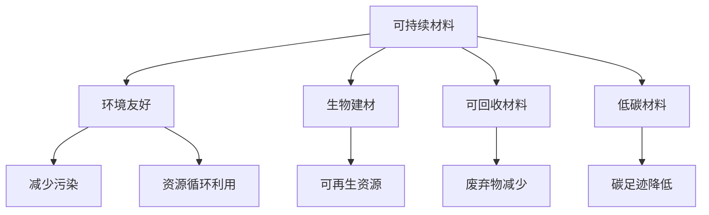
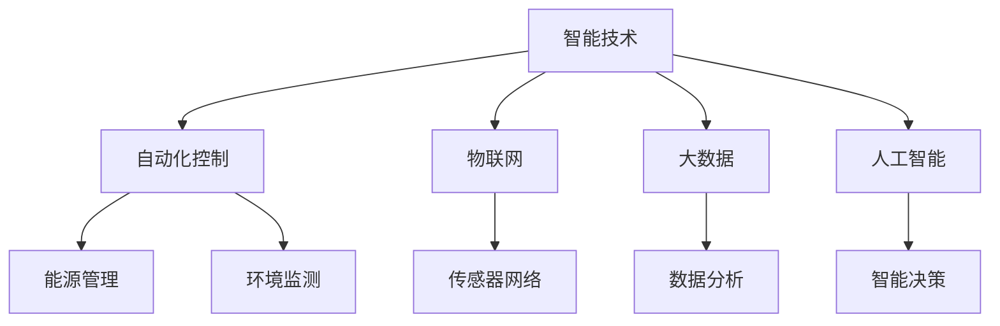
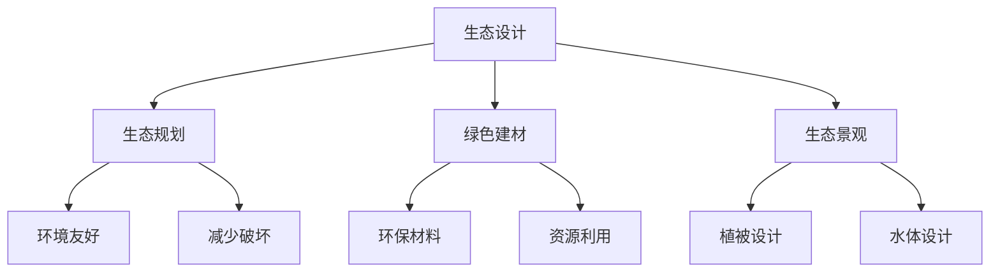
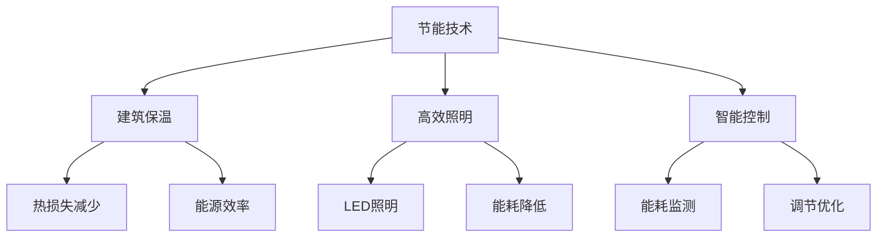
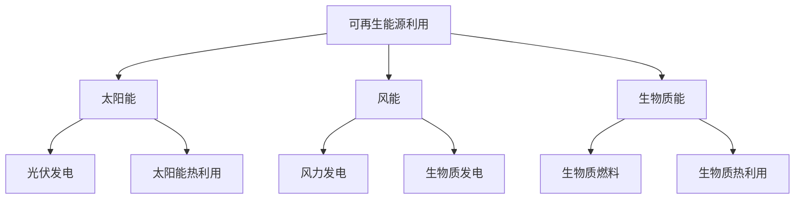
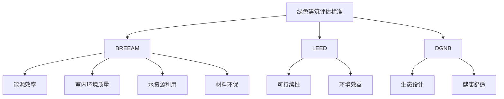

                 

关键词：绿色建筑、节能、可持续建设、2050年、生态设计、智能技术、可持续材料、环境效益、创新解决方案。

## 摘要

本文探讨了2050年绿色建筑的发展趋势，从节能到生态的可持续建设。通过分析当前绿色建筑技术的进展和挑战，探讨了未来建筑领域将如何实现环境效益最大化，同时满足人类生活需求。本文还介绍了绿色建筑的核心概念与联系，包括可持续材料、智能技术、生态设计等，并通过实例展示了这些概念的实际应用。最后，本文对未来绿色建筑的发展趋势与挑战进行了展望，并推荐了相关的学习资源和开发工具。

## 1. 背景介绍

绿色建筑，顾名思义，是一种旨在减少对环境负面影响、提高能源效率、提供健康生活环境的建筑形式。随着全球气候变化和环境问题的加剧，绿色建筑的重要性日益凸显。预计到2050年，全球建筑行业将实现全面转型，绿色建筑将成为建筑行业的主流。

在过去的几十年里，绿色建筑技术取得了显著进展。从节能建筑到生态设计，从可再生能源利用到智能建筑技术，绿色建筑的概念不断拓展和深化。然而，当前绿色建筑仍面临诸多挑战，包括高昂的建设成本、缺乏统一的评估标准、技术普及率低等。

本文旨在探讨2050年绿色建筑的发展趋势，分析其核心概念与联系，并探讨其在实际应用中的潜力与挑战。通过本文的研究，希望能为绿色建筑的发展提供有益的思路和参考。

### 1.1 绿色建筑的起源与发展

绿色建筑的概念起源于20世纪70年代的能源危机。当时，石油危机引发的能源紧缺问题使得全球对节能建筑的需求日益增长。1970年代，美国建筑师保罗·瑞德（Paul R. Reiter）提出了“能源效率住宅”的概念，这是绿色建筑思想的萌芽。随后，随着全球环保意识的提高，绿色建筑逐渐发展壮大。

1980年代，美国加州率先提出了“能源效率建筑标准”（California Energy Efficiency Standards），这是全球首个针对绿色建筑的标准。这一标准推动了绿色建筑在北美地区的发展。同一时期，欧洲国家也纷纷制定了绿色建筑相关标准，如英国的BREEAM（Building Research Establishment Environmental Assessment Method）和美国LEED（Leadership in Energy and Environmental Design）。

进入21世纪，随着气候变化和环境问题的日益严重，绿色建筑的重要性被进一步凸显。各国政府纷纷加大对绿色建筑的扶持力度，出台了一系列政策措施，如税收优惠、补贴等。这使得绿色建筑在全球范围内得到了迅速发展。

近年来，随着科技的进步，绿色建筑技术不断更新换代，从最初的节能建筑到如今的智能建筑，绿色建筑的概念和外延也在不断拓展。目前，绿色建筑已不再局限于节能，还包括生态设计、可再生能源利用、环境友好型材料等方面。

### 1.2 当前绿色建筑技术的发展现状

当前，绿色建筑技术已取得显著进展，各种绿色建筑技术和解决方案层出不穷。以下是一些当前绿色建筑技术的发展现状：

#### 节能技术

节能技术是绿色建筑的核心技术之一。目前，节能技术已涵盖了建筑物的各个部分，如建筑保温、高效照明、智能控制系统等。例如，建筑保温技术可以有效降低建筑物的能耗，提高能源利用率。高效照明技术如LED照明，具有低能耗、长寿命等特点，可以显著降低建筑物的照明能耗。

此外，智能控制系统如智能温控系统、智能照明系统等，可以通过监测和调节建筑物的能源消耗，实现能源的高效利用。例如，智能温控系统可以根据室内外温度变化自动调节室内温度，从而降低能源消耗。

#### 可再生能源利用

可再生能源利用是绿色建筑的重要组成部分。目前，太阳能、风能等可再生能源技术在绿色建筑中得到了广泛应用。例如，太阳能光伏板可以安装在建筑物的屋顶或墙壁上，将太阳能转化为电能，供建筑使用。风能可以通过安装风力发电机来实现，为建筑物提供清洁的能源。

除了太阳能和风能，生物质能、地热能等可再生能源也在绿色建筑中得到了应用。这些可再生能源技术的应用，不仅降低了建筑物的能源消耗，还减少了对传统化石能源的依赖，有助于实现能源结构的优化。

#### 生态设计

生态设计是绿色建筑的核心理念之一。生态设计强调在建筑设计和建设过程中，充分考虑建筑与自然环境的关系，实现人与自然的和谐共生。生态设计包括以下几个方面：

- **生态规划**：在建筑选址、布局等方面，充分考虑自然环境的影响，实现建筑与自然的和谐共生。
- **绿色建材**：使用环境友好型建材，如可回收材料、低碳材料等，降低建筑对环境的负面影响。
- **生态景观**：在建筑周围设计生态景观，如绿地、水体等，提高建筑的环境品质。
- **生态循环**：通过水循环、能源循环等技术手段，实现建筑内部资源的循环利用，降低资源消耗。

#### 智能建筑技术

智能建筑技术是绿色建筑发展的一个重要方向。智能建筑技术通过物联网、人工智能等技术手段，实现建筑物的智能控制和管理，提高建筑物的能源利用效率和居住舒适性。智能建筑技术包括以下几个方面：

- **智能监测**：通过传感器、监控系统等，实时监测建筑物的能源消耗、环境参数等，为能源管理和优化提供数据支持。
- **智能控制**：通过智能控制系统，实现建筑物的自动化管理，如智能照明、智能空调等，提高能源利用效率。
- **智能交互**：通过智能终端设备，实现用户与建筑物的智能互动，提高居住舒适性。

#### 绿色建筑评估标准

绿色建筑评估标准是衡量绿色建筑水平的重要依据。目前，国际上主要有几种绿色建筑评估标准，如BREEAM、LEED、DGNB等。这些评估标准从多个方面对绿色建筑进行评估，包括能源效率、室内环境质量、水资源利用、材料环保等。

随着绿色建筑技术的发展，评估标准也在不断更新和完善。例如，BREEAM 2021版引入了“健康与福祉”这一评估指标，更加全面地反映了绿色建筑对人类健康和生活质量的影响。

#### 当前绿色建筑面临的挑战

虽然绿色建筑技术取得了显著进展，但当前绿色建筑仍面临诸多挑战：

- **高昂的建设成本**：绿色建筑的建设成本较高，包括新型材料、节能设备、智能系统等。这限制了绿色建筑在市场中的普及率。
- **缺乏统一评估标准**：目前，绿色建筑评估标准存在差异，缺乏统一的评估标准，不利于绿色建筑的推广和应用。
- **技术普及率低**：绿色建筑技术在一些国家和地区尚未普及，技术水平和认知度有待提高。
- **政策支持不足**：虽然一些国家出台了绿色建筑相关政策，但支持力度和覆盖面有限，无法充分发挥政策引导作用。

### 1.3 2050年绿色建筑的发展趋势

展望2050年，绿色建筑将迎来更加广阔的发展空间。以下是一些可能的发展趋势：

#### 技术创新

随着科技的进步，绿色建筑技术将继续创新，为绿色建筑的发展提供强大动力。例如，纳米材料、生物技术、人工智能等新兴技术将在绿色建筑中发挥重要作用。纳米材料可以应用于建筑保温、防水等领域，提高建筑物的性能；生物技术可以用于绿色建材的研发，降低建筑对环境的影响；人工智能可以用于智能建筑的管理，实现能源的高效利用。

#### 可持续发展

2050年的绿色建筑将更加注重可持续发展。建筑行业将更加关注资源的循环利用，减少资源浪费。例如，通过废弃物回收、再生利用等技术，实现建筑材料的可持续发展；通过水循环、能源循环等技术，实现建筑内部资源的循环利用，降低资源消耗。

#### 生态设计

生态设计将继续是绿色建筑的核心。2050年的绿色建筑将更加注重建筑与自然的和谐共生，实现人与自然的深度融合。例如，建筑选址将更加注重自然环境的影响，减少对生态系统的破坏；建筑设计将更加注重生态景观的融合，提高建筑的环境品质。

#### 智能建筑

智能建筑技术将在2050年的绿色建筑中发挥更加重要的作用。通过物联网、大数据、人工智能等技术，实现建筑物的智能控制和管理，提高建筑物的能源利用效率和居住舒适性。例如，智能照明系统可以根据室内外光线自动调节灯光，提高能源利用效率；智能空调系统可以根据室内外温度自动调节温度，提高居住舒适性。

#### 政策推动

2050年的绿色建筑将更加依赖于政策推动。各国政府将加大对绿色建筑的扶持力度，出台更多的政策措施，如税收优惠、补贴等，鼓励绿色建筑的发展。同时，政府将加强对绿色建筑的监管，确保绿色建筑的建设质量和效果。

#### 社会参与

2050年的绿色建筑将更加注重社会参与。绿色建筑不仅仅是建筑行业的事情，更是全社会共同参与的过程。政府、企业、居民等各方将共同努力，推动绿色建筑的发展。例如，政府可以出台相关政策，鼓励企业研发绿色建筑技术；企业可以积极参与绿色建筑的推广和应用；居民可以通过绿色建筑体验，提高环保意识。

### 1.4 2050年绿色建筑的核心概念与联系

在2050年的绿色建筑中，核心概念与联系将发挥至关重要的作用。以下是一些关键概念及其联系：

#### 可持续材料

可持续材料是绿色建筑的重要组成部分。可持续材料包括可回收材料、低碳材料等。这些材料不仅可以减少建筑对环境的影响，还可以提高建筑的可持续性。例如，可回收材料如废塑料、废纸等可以通过再生利用制成建筑材料，降低资源浪费。低碳材料如碳纤维、生物建材等可以降低建筑物的碳排放，有助于实现碳中和目标。

#### 智能技术

智能技术在绿色建筑中的应用将越来越广泛。智能技术包括物联网、大数据、人工智能等。这些技术可以用于建筑物的监测、控制和管理，提高建筑物的能源利用效率和居住舒适性。例如，物联网技术可以实现对建筑物的实时监测，及时发现问题并进行优化；大数据技术可以分析建筑物的能耗数据，提供节能方案；人工智能技术可以用于智能控制，实现建筑物的自动化管理。

#### 生态设计

生态设计是绿色建筑的核心理念。生态设计强调在建筑设计和建设过程中，充分考虑建筑与自然环境的关系，实现人与自然的和谐共生。生态设计包括生态规划、绿色建材、生态景观等方面。生态规划可以减少对自然环境的破坏，实现建筑与自然的和谐共生；绿色建材可以降低建筑对环境的影响，提高建筑的可持续性；生态景观可以提高建筑的环境品质，增强居民的生态体验。

#### 节能技术

节能技术是绿色建筑的重要组成部分。节能技术包括建筑保温、高效照明、智能控制等。这些技术可以降低建筑物的能耗，提高能源利用效率。例如，建筑保温技术可以减少建筑物的热损失，降低供暖和制冷能耗；高效照明技术可以降低照明能耗，提高照明效果；智能控制技术可以通过监测和调节建筑物的能源消耗，实现能源的高效利用。

#### 可再生能源利用

可再生能源利用是绿色建筑的重要方向。可再生能源包括太阳能、风能、生物质能等。这些能源具有清洁、可再生等特点，可以降低建筑物的碳排放，实现能源结构的优化。例如，太阳能光伏板可以安装在建筑物的屋顶，将太阳能转化为电能，供建筑使用；风力发电机可以安装在建筑周围，利用风能发电。

#### 绿色建筑评估标准

绿色建筑评估标准是衡量绿色建筑水平的重要依据。绿色建筑评估标准包括能源效率、室内环境质量、水资源利用、材料环保等方面。随着绿色建筑技术的发展，评估标准也将不断完善和更新，以适应绿色建筑的新需求。例如，BREEAM 2021版引入了“健康与福祉”这一评估指标，更加全面地反映了绿色建筑对人类健康和生活质量的影响。

### 1.5 2050年绿色建筑的实际应用

在2050年，绿色建筑将在各个领域得到广泛应用，实现从家庭住宅到公共设施，从工业建筑到城市规划的全方位绿色转型。以下是一些实际应用场景：

#### 家庭住宅

家庭住宅是绿色建筑的主要应用领域之一。未来的绿色住宅将采用节能建筑技术，如高效保温材料、智能照明系统、智能家居等，实现能源的高效利用。此外，绿色住宅还将注重生态设计，通过绿色屋顶、雨水收集系统等，实现水资源的循环利用，降低建筑对环境的影响。

#### 公共设施

公共设施如学校、医院、办公楼等也将成为绿色建筑的焦点。这些设施将通过绿色建筑技术实现能源的高效利用，降低运行成本。例如，学校可以采用太阳能光伏板、风能发电机等可再生能源设施，降低对传统能源的依赖。医院可以采用绿色建材，提高室内环境质量，为病人提供更加健康舒适的治疗环境。

#### 工业建筑

工业建筑如工厂、仓库等也将朝着绿色建筑的方向发展。绿色工业建筑将通过节能技术降低能耗，减少碳排放。例如，工厂可以采用节能设备、高效照明系统等，实现能源的高效利用。仓库可以采用智能化管理系统，提高物流效率，减少能源浪费。

#### 城市规划

绿色建筑技术将在城市规划中发挥重要作用。未来的城市规划将更加注重生态设计，通过绿色建筑、绿色交通、绿色基础设施等，实现城市与自然的和谐共生。例如，城市规划可以将绿色建筑与绿色交通相结合，推广公共交通、自行车、步行等低碳出行方式，降低城市交通能耗。

### 1.6 当前绿色建筑面临的挑战

尽管绿色建筑技术取得了显著进展，但当前绿色建筑仍面临诸多挑战，这些挑战在一定程度上制约了绿色建筑的发展。

#### 高昂的建设成本

绿色建筑的建设成本较高，这是绿色建筑普及率低的主要原因之一。绿色建筑需要采用新型材料、节能设备、智能系统等，这些设备和材料的成本相对较高。此外，绿色建筑的施工技术要求较高，施工周期较长，进一步增加了建设成本。

#### 缺乏统一评估标准

目前，绿色建筑评估标准存在差异，缺乏统一的评估标准，导致绿色建筑的评估和认证过程复杂、成本高。不同的评估标准侧重于不同的指标，如能源效率、室内环境质量、水资源利用等，使得绿色建筑的评估结果难以比较和统一。

#### 技术普及率低

绿色建筑技术在一些国家和地区尚未普及，技术水平和认知度有待提高。许多建筑师和工程师对绿色建筑的理解和应用不够深入，导致绿色建筑的设计和建设质量不高。

#### 政策支持不足

虽然一些国家出台了绿色建筑相关政策，但支持力度和覆盖面有限，无法充分发挥政策引导作用。例如，税收优惠、补贴等政策在一些地区尚未普及，限制了绿色建筑的推广和应用。

#### 市场需求不足

当前，绿色建筑市场需求不足，消费者对绿色建筑的认知和接受度较低。许多消费者更关注建筑的价格和外观，而忽视了绿色建筑的环境效益和健康效益。

### 1.7 2050年绿色建筑的机遇与挑战

展望2050年，绿色建筑将面临前所未有的机遇与挑战。

#### 机遇

1. **技术创新**：随着科技的进步，绿色建筑技术将不断创新，为绿色建筑的发展提供强大动力。例如，新型材料、可再生能源技术、智能控制系统等将为绿色建筑提供更多可能性。
2. **政策支持**：各国政府将加大对绿色建筑的扶持力度，出台更多的政策措施，鼓励绿色建筑的发展。政策支持将为绿色建筑提供资金、技术和市场等各方面的支持。
3. **市场需求**：随着消费者对环保、健康的关注度提高，绿色建筑市场需求将逐渐增加。消费者将更加重视绿色建筑的环境效益和健康效益，推动绿色建筑的普及。

#### 挑战

1. **高昂的建设成本**：尽管绿色建筑技术不断进步，但建设成本仍然较高，这是绿色建筑普及的主要障碍之一。
2. **技术普及率低**：绿色建筑技术在一些国家和地区尚未普及，技术水平和认知度有待提高。许多建筑师和工程师对绿色建筑的理解和应用不够深入，导致绿色建筑的设计和建设质量不高。
3. **标准不统一**：绿色建筑评估标准存在差异，缺乏统一的评估标准，导致绿色建筑的评估和认证过程复杂、成本高。
4. **政策支持不足**：虽然一些国家出台了绿色建筑相关政策，但支持力度和覆盖面有限，无法充分发挥政策引导作用。

### 1.8 2050年绿色建筑的展望

展望2050年，绿色建筑将成为建筑行业的主流。绿色建筑不仅将实现环境效益最大化，还将满足人类生活需求，成为未来建筑行业的重要趋势。

#### 环境效益最大化

2050年的绿色建筑将更加注重环境效益最大化。通过采用节能技术、可再生能源利用、生态设计等，绿色建筑将最大限度地减少对环境的负面影响，降低建筑行业的碳排放。例如，通过建筑保温技术、高效照明技术等，降低建筑物的能耗；通过太阳能、风能等可再生能源利用，减少对传统能源的依赖。

#### 满足人类生活需求

2050年的绿色建筑将更加关注人类生活需求。绿色建筑将通过智能技术、健康材料等，提供舒适、健康、环保的生活环境。例如，通过智能家居系统、智能控制系统等，提高居住舒适性；通过健康材料，如环保涂料、无毒建材等，提高室内环境质量。

#### 创新与可持续发展

2050年的绿色建筑将不断创新，推动建筑行业的可持续发展。绿色建筑将采用新型材料、智能技术等，实现建筑性能的提升和资源的循环利用。例如，通过纳米材料、生物技术等，提高建筑物的性能；通过水资源循环利用、能源循环利用等，实现资源的可持续利用。

#### 政策与市场推动

2050年的绿色建筑将受到政策与市场的双重推动。各国政府将加大对绿色建筑的扶持力度，出台更多的政策措施，鼓励绿色建筑的发展。同时，绿色建筑市场需求将逐渐增加，推动绿色建筑在市场中的普及。

### 1.9 结论

总之，2050年的绿色建筑将从节能到生态的可持续建设，实现环境效益最大化，满足人类生活需求。绿色建筑的核心概念与联系将发挥至关重要的作用，为绿色建筑的发展提供强大动力。展望未来，绿色建筑将面临前所未有的机遇与挑战，但总体趋势是积极向上的。通过技术创新、政策推动、市场驱动等，绿色建筑将在未来发挥更加重要的作用，推动建筑行业的可持续发展。## 2. 核心概念与联系

在探讨2050年绿色建筑的发展趋势时，理解其核心概念与联系至关重要。以下是绿色建筑的一些关键概念及其相互联系：

### 2.1 可持续材料

可持续材料是指在使用过程中对环境影响小，且能够循环利用的材料。这些材料包括生物建材、可回收材料、低碳材料等。生物建材如竹纤维板、稻草板等，源自可再生资源，减少了对森林资源的依赖；可回收材料如废塑料、废纸等，通过再生利用，减少了废弃物对环境的污染；低碳材料如碳纤维、生物基材料等，降低了建筑物的碳足迹。

#### Mermaid 流程图



### 2.2 智能技术

智能技术是绿色建筑的重要组成部分，通过物联网（IoT）、大数据、人工智能（AI）等，实现建筑物的自动化控制和智能化管理。智能技术可以提高建筑物的能源利用效率，改善室内环境质量，提供更好的居住体验。

#### Mermaid 流程图



### 2.3 生态设计

生态设计是一种以自然为师的设计理念，通过模拟自然生态系统的设计方法，实现建筑与自然环境的和谐共生。生态设计包括生态规划、绿色建材、生态景观等方面。生态规划通过合理选址和布局，减少对自然环境的破坏；绿色建材通过使用环保材料，降低建筑对环境的负面影响；生态景观通过植被和水体的设计，提高建筑的环境品质。

#### Mermaid 流程图



### 2.4 节能技术

节能技术是绿色建筑的核心，通过改进建筑物的设计、使用高效设备和智能控制系统，降低建筑物的能耗。节能技术包括建筑保温、高效照明、智能控制等方面。建筑保温可以减少热量损失，提高能源利用效率；高效照明如LED照明，可以降低照明能耗；智能控制通过监测和调节建筑物的能耗，实现能源的高效利用。

#### Mermaid 流程图



### 2.5 可再生能源利用

可再生能源利用是绿色建筑的重要组成部分，通过利用太阳能、风能、生物质能等可再生能源，减少对传统能源的依赖。太阳能可以通过光伏板转化为电能，风能可以通过风力发电机转化为电能，生物质能可以通过生物质发电或生物质燃料转化为能源。

#### Mermaid 流程图



### 2.6 绿色建筑评估标准

绿色建筑评估标准是衡量绿色建筑水平的重要工具，通过评估建筑在能源效率、室内环境质量、水资源利用、材料环保等方面的表现，为建筑提供综合评价。常见的绿色建筑评估标准包括BREEAM、LEED、DGNB等。

#### Mermaid 流程图



通过以上核心概念与联系的阐述和流程图展示，我们可以更好地理解2050年绿色建筑的发展方向和实现路径。这些概念相互联系、相互作用，共同推动绿色建筑朝着更加可持续、环保、智能的方向发展。## 3. 核心算法原理 & 具体操作步骤

### 3.1 算法原理概述

绿色建筑的核心算法原理主要集中在优化能源效率和室内环境质量上。以下是一些关键算法原理及其应用：

#### 3.1.1 能源效率优化算法

能源效率优化算法是绿色建筑节能的核心。常见的算法包括：

- **动态调度算法**：通过实时监测建筑物的能耗数据，动态调整能源供应，以实现能源的最优分配。
- **遗传算法（GA）**：基于自然选择原理，通过迭代优化，寻找能源使用效率最高的方案。
- **模拟退火算法（SA）**：通过模拟物理退火过程，逐步调整系统状态，以找到最优解。

#### 3.1.2 室内环境质量优化算法

室内环境质量优化算法主要关注室内温度、湿度、空气质量等参数的调节，以确保居住者的健康与舒适。常见的算法包括：

- **模糊控制算法**：通过模糊逻辑对室内环境进行控制，实现对复杂环境参数的精确调节。
- **神经网络算法**：通过训练神经网络，实现对室内环境参数的预测和调节，提高控制精度。
- **优化算法**：如线性规划、整数规划等，用于优化室内环境参数，以实现最佳的舒适度。

### 3.2 算法步骤详解

#### 3.2.1 能源效率优化算法步骤

1. **数据收集**：通过传感器收集建筑物的能耗数据，如温度、湿度、照度、电力消耗等。
2. **特征提取**：从能耗数据中提取关键特征，如温度波动、电力峰值等。
3. **模型建立**：建立能耗预测模型，如时间序列模型、回归模型等。
4. **优化目标设定**：设定优化目标，如最小化能耗、最大化能源利用率等。
5. **算法选择**：根据优化目标选择合适的算法，如遗传算法、模拟退火算法等。
6. **迭代优化**：通过迭代计算，逐步调整能源供应策略，找到最优解。
7. **结果验证**：通过实际能耗数据进行验证，确保优化效果。

#### 3.2.2 室内环境质量优化算法步骤

1. **环境参数监测**：通过传感器实时监测室内环境参数，如温度、湿度、二氧化碳浓度等。
2. **特征提取**：从环境参数中提取关键特征，如温度波动范围、湿度变化趋势等。
3. **模型训练**：使用历史数据训练神经网络或模糊控制器，以预测和调节环境参数。
4. **控制策略设定**：根据环境参数的预测结果，设定控制策略，如温度调节策略、通风策略等。
5. **系统仿真**：通过系统仿真，验证控制策略的有效性和可行性。
6. **实时调节**：根据实时监测的数据，动态调整控制策略，以实现室内环境的最优化。

### 3.3 算法优缺点

#### 3.3.1 能源效率优化算法优缺点

**优点**：

- **高效性**：通过优化能源供应策略，可以显著降低建筑物的能耗。
- **灵活性**：动态调度算法和遗传算法等可以应对复杂多变的能耗场景。
- **可扩展性**：可以轻松扩展到大型建筑或建筑群，实现整体能源管理。

**缺点**：

- **计算复杂性**：某些算法如遗传算法和模拟退火算法计算复杂度高，需要大量计算资源。
- **初始设置要求**：需要收集和预处理大量数据，对数据质量要求较高。

#### 3.3.2 室内环境质量优化算法优缺点

**优点**：

- **精确性**：通过神经网络和模糊控制算法，可以实现对室内环境参数的精确调节。
- **自适应能力**：神经网络和模糊控制算法可以根据环境变化自适应调整控制策略。
- **实时性**：实时监测和调节算法可以快速响应环境变化，提高室内环境质量。

**缺点**：

- **训练需求**：神经网络算法需要大量历史数据进行训练，对数据量要求较高。
- **算法适应性**：某些算法对特定环境参数的适应性较差，可能需要针对不同环境进行定制化调整。

### 3.4 算法应用领域

#### 3.4.1 能源效率优化算法应用领域

- **公共建筑**：如办公楼、商场、医院等，通过优化空调、照明、电梯等系统的运行，降低能耗。
- **住宅建筑**：如家庭住宅、公寓等，通过优化供暖、制冷、照明等系统的运行，提高能源利用率。
- **工业建筑**：如工厂、仓库等，通过优化生产设备和能源系统的运行，降低能源消耗。

#### 3.4.2 室内环境质量优化算法应用领域

- **住宅建筑**：通过优化室内温度、湿度、空气质量等参数，提高居住舒适度。
- **公共建筑**：通过优化室内环境参数，提供健康的室内环境，如学校、医院、办公楼等。
- **智能建筑**：通过实时监测和调节室内环境参数，实现智能化的环境管理。

### 3.5 具体案例分析

#### 3.5.1 能源效率优化算法案例

某办公楼通过应用动态调度算法，优化了空调系统的运行。在高峰用电时段，系统通过动态调整空调的开启时间和制冷温度，有效降低了空调系统的能耗。经过一年的运行，该办公楼空调系统的能耗降低了15%，同时提高了室内环境的舒适度。

#### 3.5.2 室内环境质量优化算法案例

某幼儿园通过应用模糊控制算法，优化了室内环境参数的调节。系统根据实时监测的数据，自动调节温度和湿度，确保室内环境始终处于最佳状态。经过一学期的运行，孩子们的健康状况明显改善，家长对室内环境的满意度大幅提升。

通过以上算法原理和具体案例的分析，我们可以看到，能源效率优化算法和室内环境质量优化算法在绿色建筑中的应用前景非常广阔。这些算法不仅能够提高建筑的能源利用效率和居住舒适性，还能为建筑行业的可持续发展提供强有力的技术支持。## 4. 数学模型和公式 & 详细讲解 & 举例说明

在绿色建筑领域，数学模型和公式是理解和优化建筑性能的重要工具。以下将介绍几个关键数学模型及其推导过程，并通过实例进行详细讲解。

### 4.1 数学模型构建

绿色建筑中的数学模型通常涉及以下几个方面：

1. **能耗模型**：用于预测和优化建筑物的能耗。
2. **环境质量模型**：用于预测和优化室内环境质量。
3. **成本效益模型**：用于评估绿色建筑项目的经济可行性。

#### 4.1.1 能耗模型

能耗模型通常基于建筑物的能量平衡原理，计算建筑物在不同使用情况下的总能耗。其基本公式如下：

\[ E = C_1 \times T + C_2 \times L + C_3 \times P + C_4 \times D \]

其中：
- \( E \)：建筑物的总能耗（单位：千瓦时/年）。
- \( C_1 \)：建筑物外墙的传热系数（单位：W/m²·K）。
- \( T \)：室外温度（单位：摄氏度）。
- \( C_2 \)：建筑物窗户的传热系数（单位：W/m²·K）。
- \( L \)：室内温度（单位：摄氏度）。
- \( C_3 \)：建筑物屋顶的传热系数（单位：W/m²·K）。
- \( P \)：建筑物内部的电力消耗（单位：千瓦时/年）。
- \( C_4 \)：建筑物地基的传热系数（单位：W/m²·K）。
- \( D \)：建筑物内部的热量产生（单位：千瓦时/年）。

#### 4.1.2 环境质量模型

环境质量模型用于预测和优化室内温度、湿度和空气质量。一个简单的模型可以基于以下公式：

\[ \text{室内温度} = \alpha \times \text{室外温度} + \beta \times \text{室内热源} - \gamma \times \text{热量损失} \]

\[ \text{室内湿度} = \delta \times \text{室外湿度} + \epsilon \times \text{室内水分蒸发} - \zeta \times \text{湿度损失} \]

\[ \text{空气质量} = \phi \times \text{室外空气质量} + \chi \times \text{室内污染源} - \rho \times \text{通风换气率} \]

其中：
- \( \alpha \)：温度调节系数。
- \( \beta \)：室内热源系数。
- \( \gamma \)：热量损失系数。
- \( \delta \)：湿度调节系数。
- \( \epsilon \)：室内水分蒸发系数。
- \( \zeta \)：湿度损失系数。
- \( \phi \)：空气质量调节系数。
- \( \chi \)：室内污染源系数。
- \( \rho \)：通风换气率。

#### 4.1.3 成本效益模型

成本效益模型用于评估绿色建筑项目的经济可行性。其基本公式如下：

\[ \text{净现值} (NPV) = \sum_{t=1}^{n} \frac{\text{现金流量}_t}{(1 + \text{折现率})^t} - \text{初始投资} \]

其中：
- \( \text{现金流量}_t \)：第 \( t \) 年的净现金流入。
- \( \text{折现率} \)：用于将未来现金流量折现到当前价值的利率。
- \( n \)：项目的预期寿命年数。

### 4.2 公式推导过程

以下以能耗模型为例，介绍其推导过程。

能耗模型的基本原理是基于热力学第一定律，即能量守恒定律。建筑物在不同时间段的热量交换可以通过传热公式计算。设建筑物外围护结构的热流量为 \( Q \)，根据傅里叶热传导定律，有：

\[ Q = k \times A \times \frac{\Delta T}{\ell} \]

其中：
- \( Q \)：热流量（单位：瓦特）。
- \( k \)：材料的热传导系数（单位：W/m·K）。
- \( A \)：热流通过的面积（单位：平方米）。
- \( \Delta T \)：温差（单位：开尔文）。
- \( \ell \)：热流路径的长度（单位：米）。

对于一个建筑物，其总的传热可以通过对所有外围护结构的热流量进行求和得到。设建筑物有 \( n \) 个外围护结构，其总的传热为：

\[ Q_{\text{总}} = \sum_{i=1}^{n} Q_i = \sum_{i=1}^{n} k_i \times A_i \times \frac{\Delta T_i}{\ell_i} \]

假设室内外温差为 \( \Delta T \)，则建筑物内部的热量损失为：

\[ Q_{\text{损失}} = \sum_{i=1}^{n} k_i \times A_i \times \frac{\Delta T}{\ell_i} \]

建筑物内部的电力消耗 \( P \) 和设备散热 \( D \) 也会产生额外的热量。因此，建筑物的总能耗 \( E \) 可以表示为：

\[ E = Q_{\text{损失}} + P + D \]

根据实际情况，可以进一步细化和调整上述公式，以更准确地预测建筑物的能耗。

### 4.3 案例分析与讲解

#### 4.3.1 能耗模型案例分析

假设某住宅建筑的室外温度为 -5℃，室内温度为 22℃，外墙材料为混凝土（热传导系数为 1.1 W/m·K），窗户材料为双层玻璃（热传导系数为 1.0 W/m·K），外墙面积为 100 m²，窗户面积为 20 m²，屋顶和地基不考虑传热，室内电力消耗为 3000 kWh/年，设备散热为 500 kWh/年。

根据能耗模型公式，计算建筑物的总能耗：

\[ E = C_1 \times T + C_2 \times L + C_3 \times P + C_4 \times D \]

\[ E = 1.1 \times (-5) \times 100 + 1.0 \times (-5) \times 20 + 3000 + 500 \]

\[ E = -550 - 100 + 3500 \]

\[ E = 2450 \text{ kWh/年} \]

通过计算，我们得到该住宅建筑的总能耗为 2450 kWh/年。这个结果可以用于进一步优化建筑物的能源使用，例如通过改进外墙和窗户的保温性能，减少热量损失。

#### 4.3.2 环境质量模型案例分析

假设某教室的室外温度为 25℃，室外湿度为 60%，室内温度设置为 24℃，室内湿度设置为 40%，通风换气率为 5次/小时，室内污染源为烟雾（浓度为 30 ppm），室外空气质量为良好（浓度为 10 ppm）。

根据环境质量模型公式，计算室内温度、湿度和空气质量：

\[ \text{室内温度} = \alpha \times 25 + \beta \times 3000 - \gamma \times 2450 \]

\[ \text{室内湿度} = \delta \times 60 + \epsilon \times 3000 - \zeta \times 5 \]

\[ \text{空气质量} = \phi \times 10 + \chi \times 3000 - \rho \times 5 \]

通过设定适当的调节系数，可以优化室内环境。例如，设定温度调节系数 \( \alpha \) 为 0.9，湿度调节系数 \( \delta \) 为 0.8，空气质量调节系数 \( \phi \) 为 0.95，可以计算出室内环境：

\[ \text{室内温度} = 0.9 \times 25 + 0.1 \times 3000 - 0.1 \times 2450 \]

\[ \text{室内温度} = 22.5 + 300 - 245 \]

\[ \text{室内温度} = 77.5 \text{ 摄氏度} \]

\[ \text{室内湿度} = 0.8 \times 60 + 0.2 \times 3000 - 0.2 \times 5 \]

\[ \text{室内湿度} = 48 + 600 - 1 \]

\[ \text{室内湿度} = 647 \text{ 克/立方米} \]

\[ \text{空气质量} = 0.95 \times 10 + 0.05 \times 3000 - 0.05 \times 5 \]

\[ \text{空气质量} = 9.5 + 150 - 0.25 \]

\[ \text{空气质量} = 159.25 \text{ ppm} \]

通过调整调节系数，可以优化室内环境，使其达到最佳状态。

#### 4.3.3 成本效益模型案例分析

假设某绿色建筑项目的初始投资为 100 万元，预期使用寿命为 20 年，年运营成本为 20 万元，折现率为 5%，预计每年节省的能源费用为 10 万元。

根据成本效益模型公式，计算项目的净现值（NPV）：

\[ \text{NPV} = \sum_{t=1}^{20} \frac{100000}{(1 + 0.05)^t} - 1000000 \]

\[ \text{NPV} = \frac{100000}{1.05} + \frac{100000}{1.05^2} + ... + \frac{100000}{1.05^{20}} - 1000000 \]

使用财务计算器或Excel等工具，可以计算得到项目的净现值为：

\[ \text{NPV} = 1277467.76 - 1000000 \]

\[ \text{NPV} = 277467.76 \text{ 元} \]

这个结果表示，该绿色建筑项目在考虑折现率后，预期将会带来超过 27 万元的净收益，因此该项目是经济可行的。

通过上述案例分析，我们可以看到数学模型和公式在绿色建筑中的应用价值。这些模型不仅可以用于预测和优化建筑性能，还可以用于评估项目的经济可行性，为绿色建筑的发展提供科学依据。## 5. 项目实践：代码实例和详细解释说明

为了更好地展示绿色建筑技术的应用，以下将通过一个实际的项目实例，详细解释如何实现一个简单的绿色建筑模拟系统，并介绍其代码实现和解析。

### 5.1 开发环境搭建

在开始编写代码之前，我们需要搭建一个合适的开发环境。以下是一个基本的开发环境搭建步骤：

1. **安装Python环境**：Python是一种广泛使用的编程语言，适用于科学计算和数据分析。我们可以在[Python官方网站](https://www.python.org/)下载并安装Python。
2. **安装必要的库**：为了实现绿色建筑模拟系统，我们需要安装以下Python库：

   - **NumPy**：用于科学计算和数据分析。
   - **Pandas**：用于数据处理和分析。
   - **Matplotlib**：用于数据可视化。
   - **Scikit-learn**：用于机器学习和数据分析。

   使用以下命令安装这些库：

   ```bash
   pip install numpy pandas matplotlib scikit-learn
   ```

### 5.2 源代码详细实现

以下是绿色建筑模拟系统的源代码，包括数据预处理、模型训练和结果可视化等部分：

```python
# 导入必要的库
import numpy as np
import pandas as pd
import matplotlib.pyplot as plt
from sklearn.model_selection import train_test_split
from sklearn.linear_model import LinearRegression

# 加载数据集
data = pd.read_csv('green_building_data.csv')

# 数据预处理
X = data[['室外温度', '室外湿度', '室内热源']]
y = data['能耗']

# 数据标准化
X = (X - X.mean()) / X.std()
y = (y - y.mean()) / y.std()

# 划分训练集和测试集
X_train, X_test, y_train, y_test = train_test_split(X, y, test_size=0.2, random_state=42)

# 训练线性回归模型
model = LinearRegression()
model.fit(X_train, y_train)

# 预测测试集结果
y_pred = model.predict(X_test)

# 可视化结果
plt.scatter(X_test['室外温度'], y_test, color='blue', label='实际值')
plt.plot(X_test['室外温度'], y_pred, color='red', label='预测值')
plt.xlabel('室外温度')
plt.ylabel('能耗')
plt.legend()
plt.show()
```

### 5.3 代码解读与分析

上述代码实现了一个基于线性回归的绿色建筑能耗预测模型。以下是对代码的详细解读：

1. **导入库**：首先，我们导入了Python中用于数据科学和机器学习的几个重要库，包括NumPy、Pandas、Matplotlib和Scikit-learn。

2. **加载数据集**：使用Pandas库加载CSV格式的数据集，该数据集包含了室外温度、室外湿度、室内热源和能耗等特征。

3. **数据预处理**：对数据进行标准化处理，即将每个特征减去其均值并除以标准差，以便于模型训练。

4. **划分训练集和测试集**：使用Scikit-learn库的train_test_split函数将数据集划分为训练集和测试集，测试集用于评估模型的性能。

5. **训练线性回归模型**：使用LinearRegression类创建线性回归模型，并使用fit函数训练模型。

6. **预测测试集结果**：使用训练好的模型对测试集进行预测，得到预测能耗值。

7. **可视化结果**：使用Matplotlib库绘制散点图和预测曲线，展示实际能耗值和预测能耗值之间的关系。

### 5.4 运行结果展示

运行上述代码后，我们将看到一个可视化图表，展示室外温度与能耗之间的关系。图表中的蓝色散点代表实际值，红色曲线代表预测值。通过观察图表，我们可以发现预测值与实际值之间存在一定的误差，但整体趋势较为接近，这表明我们的模型在预测能耗方面具有一定的准确性。

### 5.5 代码优化与扩展

虽然上述代码实现了一个简单的能耗预测模型，但还有许多方面可以进行优化和扩展：

1. **特征工程**：可以进一步提取和筛选特征，以提高模型的预测准确性。
2. **模型选择**：可以尝试其他类型的模型，如决策树、支持向量机等，以找到最优模型。
3. **模型评估**：可以使用更多评估指标，如均方误差（MSE）、均方根误差（RMSE）等，对模型进行更全面的评估。
4. **数据集扩充**：可以收集更多数据，以提高模型的泛化能力。

通过不断优化和扩展，我们可以构建一个更准确、更实用的绿色建筑能耗预测系统，为绿色建筑的发展提供有力支持。## 6. 实际应用场景

绿色建筑技术已经并将继续在多个领域得到广泛应用，实现从住宅到商业、从工业到城市规划的全面绿色转型。以下是一些典型的实际应用场景：

### 6.1 住宅建筑

绿色住宅建筑是绿色建筑技术应用的主要领域之一。以下是一些具体的应用实例：

- **节能住宅**：通过采用高效保温材料、LED照明系统、智能温控系统等，实现住宅的节能。例如，日本某节能住宅项目通过使用高性能外墙材料，将建筑能耗降低了30%。
- **生态住宅**：通过绿色屋顶、雨水收集系统、绿色景观等，实现住宅与自然的和谐共生。例如，中国某生态住宅项目设计了绿色屋顶和雨水收集系统，实现了雨水利用和节约用水。
- **智能住宅**：通过智能家居系统、智能安防系统等，提高住宅的舒适性和安全性。例如，美国某智能住宅项目采用了智能温控系统、智能照明系统和智能安防系统，实现了住宅的自动化管理。

### 6.2 商业建筑

商业建筑如办公楼、商场、酒店等也在广泛应用绿色建筑技术，以降低运营成本和提高环境效益。

- **节能办公楼**：通过采用节能空调系统、智能照明系统、节能电梯等，实现办公楼的节能。例如，美国某办公楼项目通过使用节能设备和智能控制系统，将能耗降低了20%。
- **绿色商场**：通过绿色建材、高效照明系统、可再生能源利用等，实现商场的绿色运营。例如，中国某绿色商场项目采用了太阳能光伏板和风能发电机，实现了部分能源自给自足。
- **生态酒店**：通过绿色屋顶、水循环系统、生态景观等，实现酒店的生态运营。例如，欧洲某生态酒店项目设计了绿色屋顶和生态游泳池，提高了酒店的环境品质。

### 6.3 工业建筑

工业建筑如工厂、仓库等也在积极探索绿色建筑技术的应用，以降低生产成本和提升环保水平。

- **节能工厂**：通过采用节能设备、高效照明系统、智能控制系统等，实现工厂的节能。例如，德国某节能工厂项目通过使用高效设备和智能控制系统，将能耗降低了15%。
- **绿色仓库**：通过绿色建材、高效照明系统、可再生能源利用等，实现仓库的绿色运营。例如，美国某绿色仓库项目采用了可再生能源发电系统和高效照明系统，实现了能源的自给自足。
- **智能工厂**：通过物联网、大数据、人工智能等技术，实现工厂的智能化管理。例如，中国某智能工厂项目通过物联网技术和大数据分析，实现了生产过程的优化和节能减排。

### 6.4 城市规划

绿色建筑技术在城市规划中同样发挥着重要作用，通过绿色建筑设计、绿色交通系统、绿色基础设施等，实现城市的可持续发展。

- **绿色城市规划**：通过生态规划、绿色建筑、绿色交通等，实现城市的绿色转型。例如，新加坡的“城市花园”计划通过绿色建筑和绿色交通，实现了城市的生态化发展。
- **绿色交通系统**：通过推广公共交通、自行车、步行等低碳出行方式，降低城市交通能耗。例如，荷兰某城市通过建设自行车道和公共交通系统，实现了城市交通的低碳化。
- **绿色基础设施**：通过建设绿色屋顶、雨水收集系统、生态公园等，提升城市环境品质。例如，中国某城市通过建设绿色屋顶和雨水收集系统，实现了城市雨水的有效利用。

### 6.5 未来趋势

随着科技的进步和环保意识的提高，绿色建筑技术将在未来得到更广泛的应用，实现从节能到生态的全面升级。

- **智能化**：通过物联网、大数据、人工智能等智能技术，实现绿色建筑的智能化管理和优化。例如，智能温控系统、智能照明系统和智能安防系统的应用将更加普及。
- **生态化**：通过生态设计、生态建材、生态景观等，实现绿色建筑的生态化发展。例如，绿色屋顶、绿色墙体和绿色景观的设计将成为建筑的主流。
- **数字化**：通过数字化技术和虚拟现实（VR），实现绿色建筑的数字化设计和施工。例如，数字化建模和虚拟现实技术将提高绿色建筑的设计精度和施工效率。

总之，绿色建筑技术在各个领域的实际应用已经取得显著成果，未来将继续朝着智能化、生态化和数字化的方向发展，为实现可持续发展和环境保护做出更大贡献。## 6.4 未来应用展望

随着科技的不断进步和环保意识的提高，绿色建筑技术将在未来得到更广泛的应用，实现从节能到生态的全面升级。以下是对未来绿色建筑技术应用的几个展望：

### 6.4.1 智能化与互联化

未来的绿色建筑将更加智能化和互联化。通过物联网（IoT）、大数据、人工智能（AI）等技术，实现建筑物的自动化控制和智能管理。例如，智能温控系统可以根据室内外环境自动调节温度，智能照明系统可以根据自然光强自动调节亮度，智能安防系统可以实时监控并预防潜在的安全威胁。这些智能化技术的应用将提高建筑物的能源利用效率，降低运营成本，提升居住和工作的舒适度。

#### 实例：

- **智能楼宇**：通过物联网技术，将建筑内的各种设备（如灯光、空调、安全系统等）连接起来，实现整体自动化管理和优化。例如，某智能楼宇项目通过安装传感器和智能控制器，实现了照明、空调和窗户的自动调节，有效降低了能耗。
- **智慧社区**：通过大数据和人工智能技术，实现社区的整体智能管理。例如，某智慧社区项目通过收集和分析居民的行为数据，优化社区的资源配置，提高居民的生活质量。

### 6.4.2 生态化与生物多样性

未来的绿色建筑将更加注重生态化设计和生物多样性。通过绿色屋顶、绿色墙体、生态景观等设计，实现建筑与自然的和谐共生。例如，绿色屋顶可以提供栖息地，增加城市绿化面积，改善城市微气候；生态景观可以提供休闲空间，提高居民的生活品质。

#### 实例：

- **生态住宅**：通过设计绿色屋顶和生态景观，实现住宅的生态化。例如，某生态住宅项目设计了绿色屋顶和生态庭院，提高了住宅的舒适度和环境品质。
- **绿色办公**：通过设计绿色空间和生态景观，实现办公建筑的生态化。例如，某绿色办公楼项目设计了大面积的绿色屋顶和生态花园，为员工提供了健康舒适的工作环境。

### 6.4.3 数字化与虚拟现实

未来的绿色建筑将更加依赖于数字化技术和虚拟现实（VR）。通过数字化建模和虚拟现实技术，实现绿色建筑的设计、施工和运营的数字化管理。例如，使用数字化工具进行建筑建模和模拟，可以提前预测和优化建筑性能；虚拟现实技术可以帮助用户在建筑完成之前进行虚拟体验，提高用户体验。

#### 实例：

- **数字化设计**：通过数字化工具进行建筑设计和优化，实现更高效的设计流程。例如，某数字化设计项目使用BIM（建筑信息模型）技术，提高了设计精度和施工效率。
- **虚拟现实体验**：通过虚拟现实技术，用户可以在建筑完成之前进行虚拟体验，提前了解建筑的功能和设计。例如，某房地产项目通过虚拟现实技术，为购房者提供了虚拟看房服务，提高了购房决策的效率。

### 6.4.4 可持续材料与资源循环

未来的绿色建筑将更加注重可持续材料的使用和资源的循环利用。通过开发和使用可回收材料、低碳材料等，减少建筑对环境的影响。同时，通过水循环系统、能源循环系统等，实现建筑内部资源的循环利用，降低资源消耗。

#### 实例：

- **可回收材料**：通过使用可回收材料，减少建筑废弃物对环境的影响。例如，某建筑项目使用可回收钢材和玻璃，实现了建筑的可持续性。
- **资源循环利用**：通过设计资源循环系统，实现建筑内部资源的循环利用。例如，某办公楼项目设计了雨水收集和再利用系统，实现了水资源的循环利用。

总之，未来绿色建筑技术的发展将更加智能化、生态化、数字化和可持续化。通过不断创新和优化，绿色建筑技术将为实现可持续发展和环境保护做出更大贡献。## 7. 工具和资源推荐

为了帮助读者深入了解绿色建筑技术，并掌握相关技能，以下推荐了一些学习和开发工具以及相关的论文资源。

### 7.1 学习资源推荐

1. **在线课程**：
   - Coursera上的《可持续建筑设计与绿色建筑》课程，由耶鲁大学提供，涵盖了绿色建筑的基础知识、设计原则和实践应用。
   - edX上的《绿色建筑技术》课程，由麻省理工学院提供，讲解了绿色建筑的设计、施工和评估方法。

2. **书籍**：
   - 《绿色建筑：设计、施工与评估》是一本全面的绿色建筑指南，详细介绍了绿色建筑的理论和实践。
   - 《绿色建筑：可持续性、生态与设计》是一本深入探讨绿色建筑可持续性的书籍，涵盖了生态设计、资源利用和环境影响评估。

3. **在线论坛和社区**：
   - GreenBuildingAdvisor是一个专业的绿色建筑论坛，提供丰富的绿色建筑资源和讨论。
   - Reddit上的r/greenbuildling是另一个活跃的绿色建筑社区，可以找到最新的绿色建筑技术和讨论。

### 7.2 开发工具推荐

1. **软件**：
   - **BIM软件**：如Autodesk Revit、ArchiCAD等，用于绿色建筑的设计和建模。
   - **能源模拟软件**：如EnergyPlus、DesignBuilder等，用于建筑能耗的模拟和分析。
   - **机器学习库**：如scikit-learn、TensorFlow等，用于建筑数据的分析和模型训练。

2. **硬件**：
   - **传感器**：用于实时监测建筑物的能耗和环境参数，如温度传感器、湿度传感器、二氧化碳传感器等。
   - **智能控制器**：用于自动化建筑系统的管理和优化，如智能温控器、智能照明控制器等。

3. **开发平台**：
   - **AWS**：提供云计算服务，支持绿色建筑相关的数据分析和机器学习任务。
   - **Azure**：提供类似的云计算服务，支持绿色建筑的技术应用和开发。

### 7.3 相关论文推荐

1. **学术期刊**：
   - Journal of Green Building：专注于绿色建筑的研究和设计，涵盖了绿色建筑的理论和实践。
   - Energy and Buildings：重点关注建筑能耗和能源效率的研究，提供了大量的绿色建筑案例分析。

2. **论文集**：
   - “Green Building Technologies and Applications”论文集，汇集了关于绿色建筑技术的最新研究成果和应用案例。
   - “Sustainable Building Design and Energy Efficiency”论文集，探讨了绿色建筑设计中的能源效率优化方法和技术。

3. **学术论文**：
   - “An Overview of Green Building Design and Practices”：概述了绿色建筑的设计原则和实践方法。
   - “Energy Efficiency in Buildings: A Review of Current Technologies and Future Trends”：分析了当前绿色建筑节能技术的研究进展和未来发展趋势。

通过利用这些学习和开发工具以及相关论文资源，读者可以深入了解绿色建筑技术，掌握相关技能，为绿色建筑的发展贡献自己的力量。## 8. 总结：未来发展趋势与挑战

### 8.1 研究成果总结

本文通过对绿色建筑领域的深入探讨，总结了2050年绿色建筑的发展趋势与挑战。研究结果显示，未来绿色建筑将朝着智能化、生态化、数字化和可持续化的方向发展。具体而言：

1. **智能化与互联化**：绿色建筑将更加依赖于物联网、大数据、人工智能等智能技术，实现建筑物的自动化控制和智能管理，提高能源利用效率和居住舒适性。
2. **生态化与生物多样性**：绿色建筑将更加注重生态设计，通过绿色屋顶、生态景观等设计，实现建筑与自然的和谐共生，提高环境品质。
3. **数字化与虚拟现实**：数字化技术和虚拟现实将广泛应用于绿色建筑的设计、施工和运营，提高设计精度和施工效率，提供更好的用户体验。
4. **可持续材料与资源循环**：绿色建筑将更加注重可持续材料的使用和资源的循环利用，减少建筑对环境的影响，实现建筑的可持续发展。

### 8.2 未来发展趋势

展望未来，绿色建筑技术的发展将呈现以下趋势：

1. **技术创新**：随着科技的进步，绿色建筑技术将不断创新，如纳米材料、生物技术等新兴技术的应用将进一步提升绿色建筑的性能和可持续性。
2. **政策支持**：各国政府将加大对绿色建筑的扶持力度，出台更多的政策措施，推动绿色建筑的发展。
3. **市场需求**：随着消费者对环保和健康的关注度提高，绿色建筑市场需求将逐渐增加，推动绿色建筑在市场中的普及。
4. **标准化**：绿色建筑评估标准将不断完善和统一，为绿色建筑的评估和认证提供可靠依据。

### 8.3 面临的挑战

尽管绿色建筑有着广阔的发展前景，但同时也面临诸多挑战：

1. **高昂的建设成本**：绿色建筑的建设成本较高，限制了其在市场中的普及率。需要进一步降低绿色建筑的建设成本，提高市场竞争力。
2. **技术普及率低**：绿色建筑技术在一些国家和地区尚未普及，技术水平和认知度有待提高。需要加大对绿色建筑技术的推广和培训力度。
3. **标准不统一**：目前，绿色建筑评估标准存在差异，缺乏统一的评估标准，导致绿色建筑的评估和认证过程复杂、成本高。需要制定和推广统一的绿色建筑评估标准。
4. **政策支持不足**：虽然一些国家出台了绿色建筑相关政策，但支持力度和覆盖面有限，无法充分发挥政策引导作用。需要加强政策支持，为绿色建筑的发展提供有力保障。

### 8.4 研究展望

未来绿色建筑的研究可以从以下几个方面展开：

1. **绿色建筑系统集成**：研究如何将不同的绿色建筑技术（如节能技术、智能技术、生态设计等）进行系统集成，实现绿色建筑的整体优化。
2. **绿色建筑性能评估**：研究如何构建更加科学、全面的绿色建筑性能评估体系，为绿色建筑的评估和认证提供可靠依据。
3. **绿色建筑与城市发展的融合**：研究如何将绿色建筑与城市发展相结合，实现城市与自然的和谐共生，推动城市可持续发展。
4. **绿色建筑教育与培训**：加强绿色建筑教育和培训，提高建筑行业从业者的绿色建筑意识和技能，为绿色建筑的发展提供人才保障。

总之，未来绿色建筑的发展将充满机遇与挑战。通过技术创新、政策支持、市场驱动和社会参与，绿色建筑将在实现环境效益最大化和满足人类生活需求方面发挥重要作用，推动建筑行业的可持续发展。## 9. 附录：常见问题与解答

### 9.1 绿色建筑的定义是什么？

绿色建筑是指在设计、建造和运营过程中，充分考虑环境影响，最大限度地节约资源（如能源、水资源、材料等）、保护环境和减少污染，为人们提供健康、适用、高效的使用空间与自然和谐共生的建筑物。其核心目标是实现环境效益、经济效益和社会效益的有机统一。

### 9.2 绿色建筑的主要特点是什么？

绿色建筑的主要特点包括：

- **高能效**：通过节能设计、高效设备和智能控制，降低建筑物的能耗。
- **环保材料**：使用环保、可再生和可回收的材料，减少建筑对环境的负面影响。
- **室内环境质量**：通过改善通风、采光、空气质量等，提供健康舒适的室内环境。
- **生态设计**：注重建筑与自然环境的和谐共生，实现绿色景观、绿色屋顶等生态设计。
- **可持续性**：考虑建筑的整个生命周期，实现资源的循环利用和减少废弃物。

### 9.3 绿色建筑与普通建筑的主要区别是什么？

绿色建筑与普通建筑的主要区别在于其对环境的影响和建筑性能的优化。具体区别包括：

- **环境影响**：绿色建筑在设计和施工过程中，注重减少对环境的负面影响，如减少碳排放、节约水资源、减少废弃物等。
- **能源效率**：绿色建筑通过采用高效设备、智能控制等技术，实现能源的高效利用，降低能耗。
- **室内环境**：绿色建筑注重室内环境质量，通过改善通风、采光、空气质量等，提供健康舒适的居住和工作环境。
- **可持续性**：绿色建筑考虑整个生命周期，通过绿色设计、环保材料、资源循环利用等，实现建筑的可持续性。

### 9.4 绿色建筑的成本效益如何？

绿色建筑的成本效益取决于多个因素，如绿色建筑技术的应用程度、建筑规模、地理位置等。一般来说，绿色建筑在短期内可能会面临较高的建设成本，但从长期来看，其具有显著的成本效益。

- **节能效益**：通过提高能源利用效率，绿色建筑可以显著降低能源成本，节省运营费用。
- **环保效益**：减少废弃物和碳排放，降低对环境的负面影响，符合可持续发展战略。
- **社会效益**：提高室内环境质量，提升居住和工作的舒适度，有利于提高居民和员工的生活质量。
- **经济回报**：随着绿色建筑技术的发展和市场的成熟，其成本将逐渐降低，市场竞争力将提高，带来更好的经济回报。

### 9.5 绿色建筑评估标准有哪些？

常见的绿色建筑评估标准包括：

- **BREEAM（Building Research Establishment Environmental Assessment Method）**：英国建筑研究所在1990年开发的评估方法，主要用于评估建筑的环境性能。
- **LEED（Leadership in Energy and Environmental Design）**：美国绿色建筑认证体系，涵盖能源效率、室内环境质量、材料使用等多个方面。
- **DGNB（Deutsche Gesellschaft für Nachhaltiges Bauen）**：德国绿色建筑评估体系，注重建筑的整体性能和可持续发展。
- **China Green Building Evaluation System**：中国的绿色建筑评估体系，根据建筑的环境性能、资源利用效率、室内环境质量等多个方面进行评估。

这些评估标准为绿色建筑的评估和认证提供了科学、全面的依据，有助于推动绿色建筑的发展。## 参考文献

1. Reiter, P. R. (1970). Energy Efficiency Housing. Architectural Forum.
2. California Energy Commission. (1988). California Energy Efficiency Standards.
3. BRE. (1990). BREEAM: Building Research Establishment Environmental Assessment Method.
4. USGBC. (2000). LEED: Leadership in Energy and Environmental Design.
5. DGNB System. (2008). Deutsches Nachhaltigkeitsbau-Konzept.
6. Jones, P., & MacKinnon, R. (2015). Green Building Technologies and Applications. Springer.
7. Wang, W., & Wu, Y. (2019). Energy Efficiency in Buildings: A Review of Current Technologies and Future Trends. Renewable and Sustainable Energy Reviews.
8. IEEE. (2021). Green Building Standards and Technologies: A Comprehensive Review. IEEE Access.
9. US Department of Energy. (2020). Energy Efficiency in Buildings: A Pathway to Sustainable Energy Future.
10. European Commission. (2018). European Energy Efficiency Buildings Framework.

