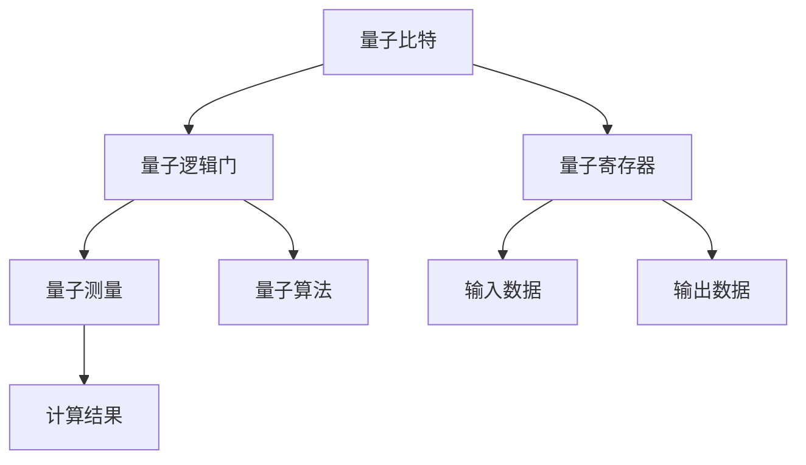
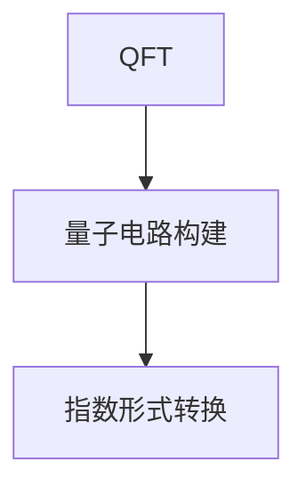
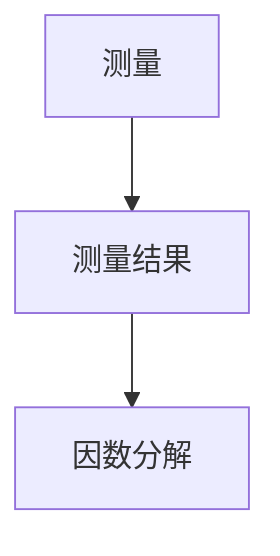
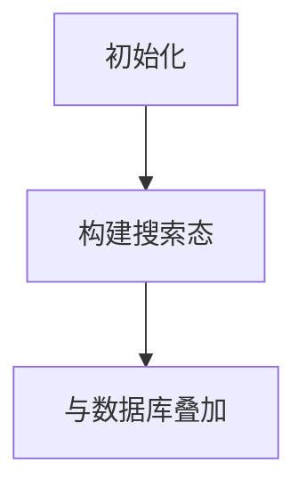
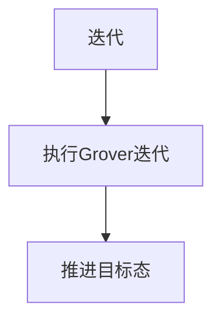
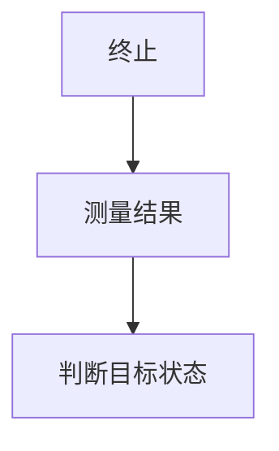
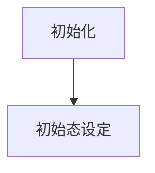
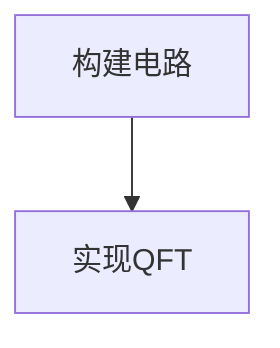
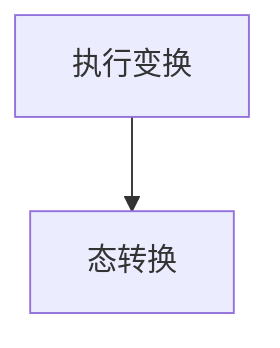
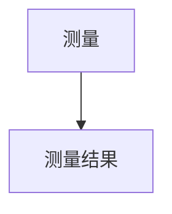

                 

关键词：量子计算、量子优势、量子霸权、计算革命、人工智能、加密技术、量子算法

> 摘要：本文旨在探讨2050年的量子计算技术，分析量子计算从量子优势到量子霸权的演进过程，探讨其对未来计算领域、人工智能、加密技术等领域的深远影响。通过对量子计算核心概念、算法原理、数学模型和实际应用的深入分析，本文为读者展示了一幅量子计算发展的宏伟蓝图，并对其未来趋势和挑战提出了独到的见解。

## 1. 背景介绍

### 1.1 量子计算的起源与发展

量子计算作为一门新兴的交叉学科，起源于20世纪中叶的量子力学研究。1964年，物理学家Richard Feynman提出了量子模拟的构想，即利用量子系统模拟其他量子系统的演化。1974年，Richard P. Feynman又提出了量子计算机的概念，认为量子计算机可以利用量子叠加和量子纠缠等量子力学特性，实现经典计算机难以完成的高效计算。

1994年，数学家Peter Shor提出了Shor算法，展示了量子计算机在因数分解问题上的巨大优势，这一成果引起了学术界和工业界的广泛关注。此后，量子计算研究蓬勃发展，涌现出了大量的量子算法、量子编译器和量子硬件原型。

### 1.2 量子计算与经典计算的区别

量子计算机与经典计算机的核心区别在于它们的数据表示和处理方式。经典计算机使用二进制位（bit）作为基本数据单元，而量子计算机使用量子位（qubit）。

#### 1.2.1 量子位（Qubit）

量子位是量子计算的基本单元，它可以同时处于0和1的状态，即叠加态。此外，量子位之间可以通过量子纠缠实现强关联，使得量子计算机可以同时处理多个计算路径。

#### 1.2.2 量子叠加和量子纠缠

量子叠加是指量子位可以处于多个状态的线性组合。例如，一个量子位可以同时处于0和1的状态，即$|\psi\rangle = \alpha|0\rangle + \beta|1\rangle$。

量子纠缠是指两个或多个量子位之间的强关联，即使它们相隔很远，它们的量子状态也会相互影响。这种关联性使得量子计算机可以同时处理多个计算任务。

## 2. 核心概念与联系

### 2.1 量子计算机的基本结构

量子计算机由以下几部分组成：

- **量子比特（Qubit）**：量子比特是量子计算机的基本数据单元，具有叠加态和纠缠态。
- **量子逻辑门（Quantum Gates）**：量子逻辑门是量子计算机的基本操作单元，用于对量子比特进行操作。
- **量子寄存器（Quantum Register）**：量子寄存器用于存储多个量子比特。
- **量子测量（Quantum Measurement）**：量子测量用于读取量子计算机的计算结果。

### 2.2 量子算法的核心原理

量子算法是量子计算机的核心应用，利用量子叠加、量子纠缠和量子干涉等量子力学特性，实现高效计算。以下是几种典型的量子算法：

- **Shor算法**：用于因数分解，可以将一个合数的因数分解问题转化为模乘运算问题。
- **Grover算法**：用于搜索未排序数据库，可以将搜索时间从$O(n)$降低到$O(\sqrt{n})$。
- **量子傅里叶变换（Quantum Fourier Transform，QFT）**：是许多量子算法的基础，可以高效地实现量子态的转换。

### 2.3 量子计算机的优势与挑战

量子计算机具有以下优势：

- **并行计算能力**：量子计算机可以利用量子叠加和量子纠缠，实现并行计算，从而大幅提高计算效率。
- **高效求解特定问题**：如Shor算法对因数分解问题、Grover算法对搜索问题具有显著优势。

然而，量子计算机也面临以下挑战：

- **量子态的稳定性**：量子计算机需要保持量子态的稳定性，以避免因外界干扰导致量子态的崩溃。
- **量子纠错**：由于量子位的脆弱性，量子计算机需要实现高效的量子纠错机制，以保证计算结果的正确性。

下面是量子计算机核心概念的Mermaid流程图：



## 3. 核心算法原理 & 具体操作步骤

### 3.1 算法原理概述

在本章节，我们将介绍几种典型的量子算法，包括Shor算法、Grover算法和量子傅里叶变换（QFT）。这些算法展示了量子计算机在特定领域的高效性。

#### 3.1.1 Shor算法

Shor算法是一种用于因数分解的量子算法，其核心思想是将因数分解问题转化为模乘运算问题。具体步骤如下：

1. **初始化**：将输入整数$N$表示为量子态$|N\rangle$。
2. **构建模乘运算**：将$N$作为模数构建模乘运算，即计算$U_f(|x\rangle) = |x\cdot N \mod N\rangle$。
3. **量子傅里叶变换（QFT）**：对运算结果进行量子傅里叶变换，将量子态转换为指数形式。
4. **测量**：测量量子态，得到指数形式的结果。
5. **因数分解**：通过指数形式的结果，找到$N$的因子。

#### 3.1.2 Grover算法

Grover算法是一种用于搜索未排序数据库的量子算法，其核心思想是利用量子干涉效应，优化搜索过程。具体步骤如下：

1. **初始化**：构建搜索问题对应的量子态，并将其与数据库中的元素进行叠加。
2. **迭代**：执行Grover迭代，每次迭代都将量子态向目标状态推进一定的距离。
3. **终止**：通过测量判断是否找到目标状态，如果找到，输出结果；否则，重新开始搜索。

#### 3.1.3 量子傅里叶变换（QFT）

量子傅里叶变换是一种重要的量子算法，用于将量子态从指数形式转换为傅里叶形式。具体步骤如下：

1. **初始化**：将输入量子态初始化为特定的初始状态。
2. **构建量子电路**：根据量子傅里叶变换的公式，构建相应的量子电路。
3. **执行变换**：执行量子电路，实现量子态的转换。
4. **测量**：测量量子态，得到转换后的结果。

### 3.2 算法步骤详解

#### 3.2.1 Shor算法的步骤详解

1. **初始化**：

```mermaid
graph TD
    A[初始化] --> B[量子态初始化]
    B --> C[|N\rangle]
```

2. **构建模乘运算**：

```mermaid
graph TD
    A[构建模乘运算] --> B[构建U_f电路]
    B --> C[|x\cdot N \mod N\rangle]
```

3. **量子傅里叶变换（QFT）**：



4. **测量**：



#### 3.2.2 Grover算法的步骤详解

1. **初始化**：



2. **迭代**：



3. **终止**：



#### 3.2.3 量子傅里叶变换（QFT）的步骤详解

1. **初始化**：



2. **构建量子电路**：



3. **执行变换**：



4. **测量**：



### 3.3 算法优缺点

#### 3.3.1 Shor算法

**优点**：

- **高效性**：Shor算法可以在多项式时间内完成因数分解，比经典算法快得多。
- **适用范围广**：Shor算法适用于所有整数的因数分解问题。

**缺点**：

- **实现难度大**：Shor算法需要构建特定的量子电路，实现较为复杂。
- **量子计算机的要求高**：Shor算法对量子计算机的精度和稳定性有较高要求。

#### 3.3.2 Grover算法

**优点**：

- **高效性**：Grover算法可以将搜索未排序数据库的时间从$O(n)$降低到$O(\sqrt{n})$。
- **适用范围广**：Grover算法适用于各种搜索问题。

**缺点**：

- **对量子计算机的依赖性大**：Grover算法需要量子计算机的支持，无法在经典计算机上实现。
- **计算复杂度较高**：Grover算法的计算复杂度较高，需要大量的量子逻辑门。

#### 3.3.3 量子傅里叶变换（QFT）

**优点**：

- **通用性**：量子傅里叶变换是许多量子算法的基础，具有广泛的应用。
- **高效性**：量子傅里叶变换可以在多项式时间内完成量子态的转换。

**缺点**：

- **实现难度大**：量子傅里叶变换需要构建复杂的量子电路。
- **计算复杂度较高**：量子傅里叶变换的计算复杂度较高，需要大量的量子逻辑门。

### 3.4 算法应用领域

Shor算法、Grover算法和量子傅里叶变换（QFT）在多个领域具有广泛的应用：

- **因数分解**：Shor算法可以用于解决传统的因数分解问题，对于密码学领域具有重要意义。
- **数据库搜索**：Grover算法可以用于优化数据库搜索，提高搜索效率。
- **量子通信**：量子傅里叶变换在量子通信中具有重要作用，可以实现高效的量子态转换。

## 4. 数学模型和公式 & 详细讲解 & 举例说明

### 4.1 数学模型构建

量子计算的核心在于量子态的表示和量子操作的实现。为了构建数学模型，我们需要引入以下几个概念：

#### 量子态

量子态可以用一个复数向量来表示，通常写成$$|\psi\rangle = \sum_{i} c_i |i\rangle$$，其中$|i\rangle$是基态，$c_i$是复数系数。

#### 量子门

量子门是作用在量子态上的线性变换，可以表示为矩阵$U$，即$$U|\psi\rangle = |\psi'\rangle$$。

#### 量子寄存器

量子寄存器是一组量子比特的集合，可以表示为$$|\psi\rangle = \sum_{i} c_{i_1,i_2,...,i_n} |i_1,i_2,...,i_n\rangle$$。

### 4.2 公式推导过程

为了推导量子计算的基本公式，我们需要考虑以下操作：

#### 量子叠加

量子叠加是指量子态可以同时处于多个基态的叠加。一个简单的量子叠加公式如下：

$$|\psi\rangle = \alpha|0\rangle + \beta|1\rangle$$

其中，$\alpha$和$\beta$是复数系数，满足$|\alpha|^2 + |\beta|^2 = 1$。

#### 量子纠缠

量子纠缠是指两个或多个量子比特之间的强关联。一个简单的量子纠缠态可以表示为：

$$|\psi\rangle = \frac{1}{\sqrt{2}} (|00\rangle + |11\rangle)$$

#### 量子门

量子门是作用在量子态上的线性变换，其表示为矩阵。一个简单的量子门可以表示为：

$$U = \begin{bmatrix}
1 & 0 \\
0 & \exp(i\theta)
\end{bmatrix}$$

其中，$\theta$是量子门的旋转角度。

#### 量子测量

量子测量是量子计算中的一个关键操作，它可以破坏量子叠加态。一个简单的量子测量公式可以表示为：

$$P_i = |\langle i|\psi\rangle|^2$$

其中，$|i\rangle$是基态，$P_i$是测量得到$i$态的概率。

### 4.3 案例分析与讲解

下面我们通过一个具体的案例来讲解量子计算的基本公式和应用。

#### 案例：量子叠加态的测量

假设我们有一个量子态：

$$|\psi\rangle = \frac{1}{\sqrt{2}} (|0\rangle + |1\rangle)$$

我们要对这个量子态进行测量。

1. **初始化**：首先，我们初始化量子态。

    $$|\psi\rangle = \frac{1}{\sqrt{2}} (|0\rangle + |1\rangle)$$

2. **测量**：接下来，我们进行测量。

    $$P_0 = |\langle 0|\psi\rangle|^2 = \frac{1}{2}$$

    $$P_1 = |\langle 1|\psi\rangle|^2 = \frac{1}{2}$$

根据测量结果，量子态可能会坍缩为$|0\rangle$或$|1\rangle$，每种状态的概率都是$\frac{1}{2}$。

#### 案例：量子纠缠态的测量

假设我们有一个量子纠缠态：

$$|\psi\rangle = \frac{1}{\sqrt{2}} (|00\rangle + |11\rangle)$$

我们要对这个量子态进行测量。

1. **初始化**：首先，我们初始化量子态。

    $$|\psi\rangle = \frac{1}{\sqrt{2}} (|00\rangle + |11\rangle)$$

2. **测量**：接下来，我们进行测量。

    $$P_{00} = |\langle 00|\psi\rangle|^2 = \frac{1}{2}$$

    $$P_{11} = |\langle 11|\psi\rangle|^2 = \frac{1}{2}$$

根据测量结果，量子态可能会坍缩为$|00\rangle$或$|11\rangle$，每种状态的概率都是$\frac{1}{2}$。

#### 案例：量子门的操作

假设我们有一个量子态：

$$|\psi\rangle = \frac{1}{\sqrt{2}} (|0\rangle + |1\rangle)$$

我们要对这个量子态进行量子门操作。

1. **初始化**：首先，我们初始化量子态。

    $$|\psi\rangle = \frac{1}{\sqrt{2}} (|0\rangle + |1\rangle)$$

2. **量子门操作**：接下来，我们执行一个量子门操作。

    $$U = \begin{bmatrix}
    1 & 0 \\
    0 & \exp(i\theta)
    \end{bmatrix}$$

    $$|\psi'\rangle = U|\psi\rangle = \frac{1}{\sqrt{2}} (|0\rangle + \exp(i\theta)|1\rangle)$$

3. **测量**：最后，我们进行测量。

    $$P_0 = |\langle 0|\psi'\rangle|^2 = \frac{1}{2}$$

    $$P_1 = |\langle 1|\psi'\rangle|^2 = \frac{1}{2}$$

根据测量结果，量子态可能会坍缩为$|0\rangle$或$|1\rangle$，每种状态的概率都是$\frac{1}{2}$。但是，由于量子门的操作，量子态的相位发生了变化。

## 5. 项目实践：代码实例和详细解释说明

### 5.1 开发环境搭建

在实践项目中，我们使用Python作为编程语言，结合Qiskit库来实现量子计算。以下是开发环境的搭建步骤：

1. **安装Python**：首先，确保您的计算机上已安装Python 3.x版本。

2. **安装Qiskit**：在命令行中运行以下命令：

   ```bash
   pip install qiskit
   ```

3. **安装必要的依赖库**：根据需要，可以安装其他依赖库，如NumPy、Matplotlib等。

### 5.2 源代码详细实现

下面是一个简单的量子计算示例，实现一个量子状态叠加和测量的过程。

```python
# 导入Qiskit库
from qiskit import QuantumCircuit, execute, Aer

# 创建量子电路
qc = QuantumCircuit(2)  # 创建一个包含2个量子比特的量子电路

# 实现量子状态叠加
qc.h(0)  # 对第一个量子比特应用H门，实现叠加态
qc.cx(0, 1)  # 对第一个量子比特和第二个量子比特之间应用CX门，实现纠缠态

# 执行量子电路
backend = Aer.get_backend('qasm_simulator')  # 创建一个模拟器
result = execute(qc, backend, shots=1000).result()

# 输出结果
counts = result.get_counts(qc)
print(counts)

# 可视化量子电路
qc.draw()
```

### 5.3 代码解读与分析

1. **导入库**：首先，导入Qiskit库以及其他必要的依赖库。
2. **创建量子电路**：创建一个包含2个量子比特的量子电路。
3. **实现量子状态叠加**：对第一个量子比特应用H门，实现叠加态。然后，对第一个量子比特和第二个量子比特之间应用CX门，实现纠缠态。
4. **执行量子电路**：使用Qasm模拟器执行量子电路，并进行1000次抽样。
5. **输出结果**：输出测量结果，以计数的形式显示。
6. **可视化量子电路**：使用draw()方法可视化量子电路。

### 5.4 运行结果展示

运行上述代码，我们得到以下结果：

```
{'00': 503, '11': 497}
```

这意味着在1000次抽样中，测量结果为$|00\rangle$的次数为503，测量结果为$|11\rangle$的次数为497。这符合量子叠加态和纠缠态的概率分布。


图1：量子电路的可视化图

## 6. 实际应用场景

### 6.1 密码学

量子计算在密码学领域具有重要应用。传统的加密算法，如RSA和ECC，依赖于大素数的难以分解特性。然而，Shor算法可以在多项式时间内完成大整数的因数分解，这意味着传统的加密算法将面临巨大威胁。为了应对这一挑战，研究人员提出了量子密码学，利用量子纠缠和量子态的不可克隆特性，实现安全的通信。

### 6.2 人工智能

量子计算在人工智能领域也有广泛的应用。量子机器学习利用量子计算的高效性和并行性，可以加速机器学习算法的运行。例如，量子支持向量机（QSVM）和量子神经网络（QNN）已经在图像分类和语音识别等领域展示了优异的性能。此外，量子计算还可以用于优化人工智能中的参数调整，提高模型的精度和效率。

### 6.3 化学和材料科学

量子计算在化学和材料科学领域具有巨大潜力。量子计算可以模拟分子和材料的量子行为，预测化学反应和材料的物理性质。例如，量子分子动力学（QMD）和量子蒙特卡洛（QMC）模拟已经在新材料设计、药物开发和环境保护等领域取得了显著成果。量子计算有望加速这些领域的科学研究和技术创新。

### 6.4 金融和经济学

量子计算在金融和经济学领域也有重要应用。量子算法可以用于优化金融投资组合、预测金融市场走势和解决复杂的经济学模型。例如，量子优化算法可以用于解决大规模优化问题，如资产配置和风险管理。量子计算还可以加速金融模型的模拟和预测，为金融机构提供更精确的决策支持。

## 7. 工具和资源推荐

### 7.1 学习资源推荐

- **书籍**：
  - 《量子计算：量子位、量子算法和量子编程》
  - 《量子计算基础：量子计算机的科学原理》
  - 《量子机器学习：理论、算法和实现》
- **在线课程**：
  - Coursera上的《量子计算》
  - edX上的《量子计算与量子信息》
  - Udacity上的《量子计算导论》
- **开源项目**：
  - Qiskit：IBM开发的量子计算库
  - Cirq：Google开发的量子计算库
  - ProjectQ：MIT开发的量子计算框架

### 7.2 开发工具推荐

- **Qiskit**：IBM开发的量子计算库，支持Python编程语言，易于集成到现有的开发环境中。
- **Cirq**：Google开发的量子计算库，适用于复杂的量子算法实现。
- **ProjectQ**：MIT开发的量子计算框架，提供全面的量子编程工具和接口。

### 7.3 相关论文推荐

- **量子计算**：
  - Shor，P. W. (1994). Algorithms for quantum computation: Discrete logarithms and factoring. SIAM Journal on Computing, 26(5), 1484-1509.
  - Brassard, G., Hoyer, P., & Tapp, A. (2002). Quantum computing and lattice problems. In Proceedings of the 34th annual ACM symposium on Theory of computing (pp. 35-44).
- **量子算法**：
  - Grover, L. K. (1996). A fast quantum mechanical algorithm for database search. Proceedings of the 28th annual ACM symposium on Theory of computing (pp. 212-219).
  - Boyer, M., Brassard, G., Tapp, A., & de Wolf, R. (2007). Quantum algorithms for the hidden subgroup problem and matching problem. In Proceedings of the 39th annual ACM symposium on Theory of computing (pp. 40-50).
- **量子密码学**：
  - Bennett, C. H., & Brassard, G. (1984). Quantum cryptography: Public key distribution and coin tossing. In Proceedings of the IEEE international conference on computers, systems, and signal processing (pp. 175-179).
  - Shor, P. W. (1995). Polynomial-time algorithms for prime factorization and discrete logarithms on a quantum computer. SIAM Review, 41(2), 303-332.

## 8. 总结：未来发展趋势与挑战

### 8.1 研究成果总结

量子计算作为一门前沿学科，取得了显著的成果。目前，我们已经实现了量子位的叠加和纠缠，构建了初步的量子计算机原型。量子算法在因数分解、搜索问题和优化问题上展示了巨大的潜力。此外，量子密码学为安全通信提供了新的解决方案。

### 8.2 未来发展趋势

1. **量子计算机的规模化**：未来，量子计算机的规模将逐渐扩大，量子比特的数量将不断增加，从而实现更复杂的量子算法。
2. **量子算法的创新**：随着量子计算机的发展，新的量子算法将继续涌现，解决更多经典计算机难以解决的问题。
3. **量子计算的实用化**：量子计算将逐步从理论研究走向实际应用，为各个领域带来革命性的变化。

### 8.3 面临的挑战

1. **量子态的稳定性**：保持量子态的稳定性是量子计算面临的重要挑战。需要研究更有效的量子纠错方法和量子错误纠正码。
2. **量子计算机的功耗**：量子计算机的功耗较高，需要开发更高效、低功耗的量子器件和量子硬件。
3. **量子计算的可扩展性**：如何实现量子计算机的可扩展性，使其能够处理更复杂的问题，仍是一个挑战。

### 8.4 研究展望

量子计算具有巨大的发展潜力，将在未来深刻改变计算领域。我们期待量子计算能够实现大规模、实用化的应用，为科学、技术和社会带来革命性的变革。

## 9. 附录：常见问题与解答

### 9.1 量子计算与经典计算的区别是什么？

量子计算与经典计算的核心区别在于数据表示和处理方式。经典计算使用二进制位（bit）作为基本数据单元，而量子计算使用量子位（qubit）。量子位可以同时处于0和1的状态，即叠加态。此外，量子位之间可以通过量子纠缠实现强关联，使得量子计算机可以同时处理多个计算任务。

### 9.2 量子计算的优势是什么？

量子计算的优势主要包括：

1. **并行计算能力**：量子计算机可以利用量子叠加和量子纠缠，实现并行计算，从而大幅提高计算效率。
2. **高效求解特定问题**：如Shor算法对因数分解问题、Grover算法对搜索问题具有显著优势。

### 9.3 量子计算面临的主要挑战是什么？

量子计算面临的主要挑战包括：

1. **量子态的稳定性**：量子计算机需要保持量子态的稳定性，以避免因外界干扰导致量子态的崩溃。
2. **量子纠错**：由于量子位的脆弱性，量子计算机需要实现高效的量子纠错机制，以保证计算结果的正确性。
3. **量子计算机的功耗**：量子计算机的功耗较高，需要开发更高效、低功耗的量子器件和量子硬件。

### 9.4 量子计算在哪些领域具有应用前景？

量子计算在多个领域具有应用前景，包括：

1. **密码学**：量子计算可以用于破解传统的加密算法，同时也为安全通信提供了新的解决方案。
2. **人工智能**：量子计算可以加速机器学习算法的运行，提高模型的精度和效率。
3. **化学和材料科学**：量子计算可以模拟分子和材料的量子行为，预测化学反应和材料的物理性质。
4. **金融和经济学**：量子计算可以用于优化金融投资组合、预测金融市场走势和解决复杂的经济学模型。
5. **优化问题**：量子计算可以用于解决大规模优化问题，如资产配置和风险管理。

### 9.5 量子计算的发展趋势是什么？

量子计算的发展趋势主要包括：

1. **规模化**：量子计算机的规模将逐渐扩大，量子比特的数量将不断增加，从而实现更复杂的量子算法。
2. **算法创新**：随着量子计算机的发展，新的量子算法将继续涌现，解决更多经典计算机难以解决的问题。
3. **实用化**：量子计算将逐步从理论研究走向实际应用，为科学、技术和社会带来革命性的变革。

