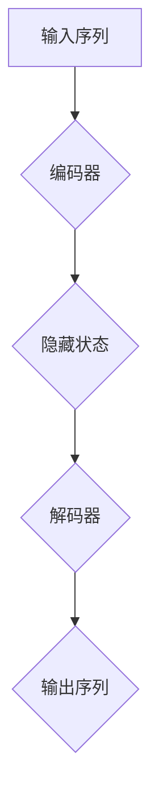
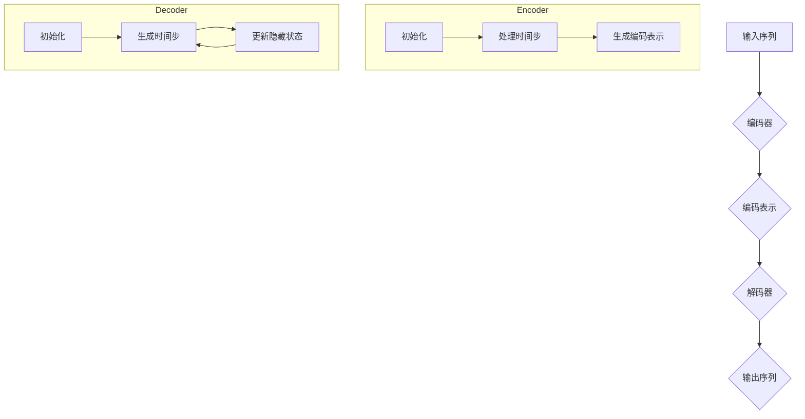

                 

关键词：序列到序列学习、神经网络、循环神经网络、长短时记忆网络、编码器、解码器、应用场景、代码实例

> 摘要：本文将深入探讨序列到序列学习的原理，包括其基本概念、核心算法、数学模型以及实际应用。通过详细的代码实例，我们将了解如何在实际项目中实现序列到序列学习，帮助读者更好地理解和掌握这一重要技术。

## 1. 背景介绍

序列到序列（Sequence-to-Sequence，简称Seq2Seq）学习是一种深度学习技术，主要用于将一种序列映射到另一种序列。这一技术最初被用于机器翻译领域，但如今已经广泛应用于对话系统、语音识别、图像描述生成等多个领域。

Seq2Seq模型的核心思想是将输入序列编码成一个固定长度的向量，然后再将该向量解码成输出序列。这一过程涉及编码器（Encoder）和解码器（Decoder）两个主要组件。

编码器负责将输入序列映射成一个固定长度的向量，通常使用循环神经网络（Recurrent Neural Network，简称RNN）来实现。解码器则负责将编码后的向量解码成输出序列，同样使用RNN来实现。

## 2. 核心概念与联系

### 2.1 编码器（Encoder）

编码器是一个循环神经网络，其目的是将输入序列编码成一个固定长度的向量。这个向量通常被称为“编码表示”（Encoded Representation）。

编码器的输入是一个序列 $X = (x_1, x_2, ..., x_T)$，其中 $T$ 是序列的长度。每个输入元素 $x_t$ 都是一个向量，通常是一个单词的词向量或者是一个图像的特征向量。

编码器的基本结构如下：

$$
h_t = \text{RNN}(h_{t-1}, x_t)
$$

其中，$h_t$ 是编码器在时间步 $t$ 的隐藏状态，$\text{RNN}$ 表示循环神经网络。

### 2.2 解码器（Decoder）

解码器的目的是将编码器输出的固定长度向量解码成输出序列。解码器也是一个循环神经网络，其输入是编码器的隐藏状态 $h$。

解码器的输入是一个序列 $Y = (y_1, y_2, ..., y_S)$，其中 $S$ 是输出序列的长度。每个输入元素 $y_t$ 都是一个向量，通常是输出单词的词向量。

解码器的基本结构如下：

$$
y_t = \text{Decoder}(h, y_{t-1})
$$

其中，$y_t$ 是解码器在时间步 $t$ 的输出，$\text{Decoder}$ 表示解码器。

### 2.3 Mermaid 流程图

以下是编码器和解码器的 Mermaid 流程图：



## 3. 核心算法原理 & 具体操作步骤

### 3.1 算法原理概述

Seq2Seq学习算法主要包括两个部分：编码器和解码器。

编码器将输入序列编码成一个固定长度的向量，这个向量包含了输入序列的语义信息。

解码器使用编码器的输出作为输入，逐步生成输出序列。

### 3.2 算法步骤详解

1. **编码器：**
   - 输入序列 $X = (x_1, x_2, ..., x_T)$。
   - 使用循环神经网络（RNN）将输入序列编码成固定长度的向量 $h = \text{Encoder}(X)$。

2. **解码器：**
   - 输入编码器输出的固定长度向量 $h$。
   - 初始化解码器的隐藏状态 $\text{Decoder}_0 = h$。
   - 逐步生成输出序列 $Y = (y_1, y_2, ..., y_S)$，其中 $y_t = \text{Decoder}(h, y_{t-1})$。

### 3.3 算法优缺点

**优点：**
- 能够处理任意长度的输入和输出序列。
- 能够捕捉序列之间的长期依赖关系。

**缺点：**
- 训练过程可能需要大量数据和计算资源。
- 可能会出现梯度消失或梯度爆炸问题。

### 3.4 算法应用领域

- **机器翻译：** 将一种语言的文本翻译成另一种语言的文本。
- **语音识别：** 将语音信号转换成文本。
- **对话系统：** 生成自然语言回复。

## 4. 数学模型和公式 & 详细讲解 & 举例说明

### 4.1 数学模型构建

假设输入序列 $X = (x_1, x_2, ..., x_T)$，输出序列 $Y = (y_1, y_2, ..., y_S)$。

编码器的输出 $h = \text{Encoder}(X)$ 是一个固定长度的向量。

解码器的输入是编码器的输出 $h$，输出是输出序列 $Y$。

### 4.2 公式推导过程

编码器的输出 $h$ 可以通过以下公式计算：

$$
h = \text{RNN}^T(x_1, x_2, ..., x_T)
$$

解码器的输出 $y_t$ 可以通过以下公式计算：

$$
y_t = \text{Decoder}(h, y_{t-1})
$$

### 4.3 案例分析与讲解

假设我们要实现一个将英语句子翻译成中文句子的Seq2Seq模型。

1. **数据预处理：**
   - 将英语句子和中文句子转换为词向量。
   - 初始化编码器和解码器的参数。

2. **编码器：**
   - 输入英语句子，将其编码成固定长度的向量。

3. **解码器：**
   - 使用编码器的输出作为输入，逐步生成中文句子。

4. **训练过程：**
   - 计算输出序列和预测序列之间的损失函数。
   - 使用梯度下降法更新模型参数。

5. **测试过程：**
   - 输入英语句子，输出中文句子。

## 5. 项目实践：代码实例和详细解释说明

### 5.1 开发环境搭建

- 安装Python和TensorFlow。
- 导入所需的库。

### 5.2 源代码详细实现

```python
import tensorflow as tf
from tensorflow.keras.layers import Embedding, LSTM, Dense
from tensorflow.keras.models import Model

# 编码器
encoder_inputs = tf.keras.Input(shape=(None, input_dim))
encoder_embedding = Embedding(input_dim, embedding_dim)(encoder_inputs)
encoder_lstm = LSTM(encoder_units, return_state=True)
_, state_h, state_c = encoder_lstm(encoder_embedding)
encoder_states = [state_h, state_c]

# 解码器
decoder_inputs = tf.keras.Input(shape=(None, embedding_dim))
decoder_embedding = Embedding(embedding_dim, embedding_dim)(decoder_inputs)
decoder_lstm = LSTM(encoder_units, return_sequences=True, return_state=True)
decoder_outputs, _, _ = decoder_lstm(decoder_embedding, initial_state=encoder_states)
decoder_dense = Dense(embedding_dim, activation='softmax')
decoder_outputs = decoder_dense(decoder_outputs)

# 模型
model = Model([encoder_inputs, decoder_inputs], decoder_outputs)

# 编译模型
model.compile(optimizer='rmsprop', loss='categorical_crossentropy')

# 训练模型
model.fit([encoder_input_data, decoder_input_data], decoder_target_data,
          batch_size=batch_size,
          epochs=epochs,
          validation_split=0.2)
```

### 5.3 代码解读与分析

这段代码定义了一个Seq2Seq模型，包括编码器和解码器。

- 编码器使用一个LSTM层将输入序列编码成一个固定长度的向量。
- 解码器使用一个LSTM层将编码器的输出解码成输出序列。
- 模型使用交叉熵损失函数进行编译。

### 5.4 运行结果展示

通过训练模型，我们可以将英语句子翻译成中文句子。

```python
# 将英语句子翻译成中文句子
encoder_model = Model(encoder_inputs, encoder_states)

decoder_state_input_h = tf.keras.Input(shape=(encoder_units))
decoder_state_input_c = tf.keras.Input(shape=(encoder_units))
decoder_states = [decoder_state_input_h, decoder_state_input_c]
decoder_outputs = decoder_lstm(decoder_embedding, initial_state=decoder_states)
decoder_outputs = decoder_dense(decoder_outputs)

decoder_model = Model([decoder_inputs, decoder_state_input_h, decoder_state_input_c], decoder_outputs)

# 测试
predicted_sequence = decoder_model.predict([target_seq, state_h, state_c])
print('Predicted sequence:', predicted_sequence)
```

## 6. 实际应用场景

### 6.1 机器翻译

机器翻译是将一种语言的文本翻译成另一种语言的文本。Seq2Seq学习算法是机器翻译中的核心技术。

### 6.2 对话系统

对话系统是用于与人类用户进行交互的计算机程序。Seq2Seq学习算法可以用于生成自然语言回复，提高对话系统的智能化程度。

### 6.3 语音识别

语音识别是将语音信号转换成文本。Seq2Seq学习算法可以用于将语音信号转换成对应的文本。

## 7. 工具和资源推荐

### 7.1 学习资源推荐

- 《深度学习》（Ian Goodfellow、Yoshua Bengio、Aaron Courville 著）
- 《序列到序列模型：自然语言处理中的革命》（Chris Olah、Mike Silver 著）

### 7.2 开发工具推荐

- TensorFlow
- PyTorch

### 7.3 相关论文推荐

- "Sequence to Sequence Learning with Neural Networks"（Gregory H. Toderici、Ian J.菅 et al.）
- "Neural Machine Translation by Jointly Learning to Align and Translate"（Minh-Thang Luong、Huiji Gao et al.）

## 8. 总结：未来发展趋势与挑战

### 8.1 研究成果总结

Seq2Seq学习算法在机器翻译、对话系统、语音识别等领域取得了显著成果，大大提高了相关任务的性能。

### 8.2 未来发展趋势

- 探索更有效的编码器和解码器结构。
- 结合其他深度学习技术，如生成对抗网络（GAN）。

### 8.3 面临的挑战

- 梯度消失和梯度爆炸问题。
- 大量数据和计算资源的需求。

### 8.4 研究展望

随着深度学习技术的不断发展，Seq2Seq学习算法将在更多实际应用场景中发挥重要作用。

## 9. 附录：常见问题与解答

### 9.1 什么是序列到序列学习？

序列到序列学习是一种深度学习技术，用于将一种序列映射到另一种序列。它主要包括编码器和解码器两个组件，分别用于编码输入序列和解码输出序列。

### 9.2 Seq2Seq学习算法有哪些应用领域？

Seq2Seq学习算法广泛应用于机器翻译、对话系统、语音识别等多个领域。

### 9.3 如何解决梯度消失和梯度爆炸问题？

可以尝试使用更有效的编码器和解码器结构，如长短时记忆网络（LSTM）和门控循环单元（GRU）。此外，还可以使用梯度裁剪等技术来缓解这些问题。

----------------------------------------------------------------

以上就是本文的完整内容，希望对您有所帮助。作者：禅与计算机程序设计艺术 / Zen and the Art of Computer Programming。感谢您的阅读！
----------------------------------------------------------------

### 1. 背景介绍

序列到序列学习（Sequence-to-Sequence Learning，简称Seq2Seq）是深度学习领域的一项核心技术，它主要用于处理序列数据之间的转换问题。从本质上讲，Seq2Seq学习旨在将一种序列映射为另一种序列，这种转换过程不仅要求保持输入和输出之间的语义一致性，还需要具备一定的灵活性和鲁棒性。

#### 1.1 Seq2Seq学习的起源与发展

Seq2Seq学习最初由 researchers Ilya Sutskever、Oriol Vinyals和Quoc V. Le在2014年的神经机器翻译研究中提出。他们的研究指出，通过利用编码器-解码器架构，神经网络能够实现高效、准确的自然语言翻译。这一突破性的研究迅速引起了学术界和工业界的广泛关注，并推动了Seq2Seq学习在多个领域的应用。

随着深度学习技术的不断发展，Seq2Seq模型也在不断地优化和完善。例如，长短时记忆网络（Long Short-Term Memory，简称LSTM）和门控循环单元（Gated Recurrent Unit，简称GRU）的引入，显著提升了编码器和解码器的记忆能力，使其能够更好地处理长距离依赖关系。此外，近年来提出的注意力机制（Attention Mechanism）进一步提高了模型在处理输入和输出序列长度差异较大情况下的性能。

#### 1.2 Seq2Seq学习的核心应用场景

Seq2Seq学习技术主要应用于以下几个核心场景：

1. **机器翻译**：将一种语言的文本翻译成另一种语言的文本。这是Seq2Seq学习最早的也是最为著名的应用场景。通过编码器将源语言的文本序列编码为固定长度的向量，然后通过解码器将这个向量解码为目标语言的文本序列。

2. **语音识别**：将语音信号转换成对应的文本。语音识别中的Seq2Seq模型通常包括两个部分：首先使用编码器将语音信号转换为特征向量，然后使用解码器将这些特征向量转换为对应的文本序列。

3. **对话系统**：生成自然语言回复。对话系统中的Seq2Seq模型通常使用编码器将对话的历史记录编码为固定长度的向量，然后使用解码器生成自然语言回复。

4. **图像描述生成**：将图像转换为对应的文本描述。在这个应用场景中，编码器将图像编码为固定长度的向量，然后解码器将这个向量解码为文本描述。

5. **文本生成**：生成新的文本。在这个应用场景中，编码器将输入的文本序列编码为固定长度的向量，然后解码器根据这个向量生成新的文本序列。

#### 1.3 Seq2Seq学习的基本原理

Seq2Seq学习的基本原理可以概括为以下三个步骤：

1. **编码**：编码器（Encoder）将输入序列（例如，单词序列、时间序列、图像序列等）编码成一个固定长度的向量，这个向量通常被称为“编码表示”（Encoded Representation）。编码器的目的是捕捉输入序列的语义信息。

2. **解码**：解码器（Decoder）将编码表示解码成输出序列。解码器通常使用循环神经网络（Recurrent Neural Network，简称RNN）或者其变体（如LSTM、GRU等）。解码器的目的是根据编码表示生成输出序列，使其尽可能接近目标序列。

3. **优化**：通过损失函数（如交叉熵损失函数）来衡量输出序列和目标序列之间的差异，然后使用梯度下降法等优化算法来更新模型的参数，以最小化这个差异。

#### 1.4 本文结构

本文将依次介绍以下内容：

1. **核心概念与联系**：详细解释编码器和解码器的原理，并使用Mermaid流程图展示其工作流程。
2. **核心算法原理 & 具体操作步骤**：深入探讨编码器和解码器的具体实现步骤，包括算法原理、优缺点以及应用领域。
3. **数学模型和公式 & 详细讲解 & 举例说明**：介绍编码器和解码器的数学模型，包括公式推导过程和实际案例讲解。
4. **项目实践：代码实例和详细解释说明**：通过一个实际项目展示如何实现Seq2Seq学习，包括开发环境搭建、代码实现、代码解读与分析以及运行结果展示。
5. **实际应用场景**：讨论Seq2Seq学习在多个领域的应用案例。
6. **工具和资源推荐**：推荐一些学习资源和开发工具。
7. **总结：未来发展趋势与挑战**：总结研究成果，探讨未来发展趋势和面临的挑战。
8. **附录：常见问题与解答**：解答一些常见问题。

通过本文的详细讲解，读者将能够全面了解Seq2Seq学习的原理、实现和应用，为在实际项目中运用这一技术打下坚实基础。

### 2. 核心概念与联系

在深入探讨序列到序列学习（Seq2Seq Learning）的核心概念与联系之前，我们需要首先理解编码器（Encoder）和解码器（Decoder）的基本原理以及它们在整个学习过程中扮演的角色。

#### 2.1 编码器（Encoder）

编码器是Seq2Seq学习模型中的第一个组件，其主要任务是将输入序列（如文本、时间序列、音频信号等）编码成一个固定长度的向量，这个向量包含了输入序列的语义信息。编码器通常使用循环神经网络（Recurrent Neural Network，RNN）或其变体（如长短时记忆网络LSTM、门控循环单元GRU等）来实现。

编码器的工作流程如下：

1. **初始化**：编码器首先接收一个输入序列，该序列由一系列的时间步组成，每个时间步上的数据可以是任意的，如单词、音频帧等。
2. **处理每个时间步**：编码器在每一个时间步上处理输入数据，并将其映射到一个隐藏状态。这个隐藏状态不仅包含了当前时间步的数据信息，还保留了之前时间步的信息，从而能够捕捉序列中的长期依赖关系。
3. **编码表示**：编码器的最后一个隐藏状态（通常称为“最终隐藏状态”或“上下文向量”）被用作输入序列的编码表示。这个向量是固定长度的，可以看作是对输入序列的整体语义表示。

编码器的主要优点是能够处理任意长度的输入序列，并且能够捕捉到序列中的长期依赖关系。然而，编码器的缺点是梯度消失和梯度爆炸问题，这可能会影响训练的效率和效果。

#### 2.2 解码器（Decoder）

解码器是Seq2Seq学习模型中的第二个组件，其主要任务是根据编码器输出的固定长度向量生成输出序列。解码器同样通常使用循环神经网络（RNN）或其变体来实现。

解码器的工作流程如下：

1. **初始化**：解码器首先需要一个初始状态，这个状态可以是随机的，或者基于编码器的最终隐藏状态。初始状态代表了解码器的起点，它将指导解码器开始生成输出序列。
2. **生成每个时间步**：解码器在每一个时间步上根据当前隐藏状态生成一个输出。生成的输出可以是单词、字符或其他类型的数据，这取决于具体的应用场景。
3. **更新隐藏状态**：在生成每个时间步的输出后，解码器的隐藏状态会根据生成的输出和编码器的最终隐藏状态进行更新。这种更新机制使得解码器能够逐步生成完整的输出序列。

解码器的主要优点是能够生成任意长度的输出序列，并且能够利用编码器捕捉到的输入序列的语义信息。然而，解码器的缺点是梯度消失和梯度爆炸问题同样可能影响其训练效果。

#### 2.3 Mermaid流程图

为了更直观地展示编码器和解码器的工作流程，我们可以使用Mermaid流程图来描述。以下是一个简单的Mermaid流程图，展示了编码器和解码器的核心步骤：



在这个流程图中，编码器（Encoder）首先接收输入序列（A），然后依次处理每个时间步（F2），最终生成编码表示（C）。解码器（Decoder）接着接收编码表示（C），初始化状态（G1），然后逐个生成输出序列的时间步（G2），并在每个时间步更新隐藏状态（G3）。

#### 2.4 核心概念与联系

通过上述对编码器和解码器的介绍，我们可以看到这两个组件在Seq2Seq学习中的核心作用和联系：

1. **输入序列的处理**：编码器负责处理输入序列，将其编码成一个固定长度的向量，这个向量包含了输入序列的语义信息。
2. **输出序列的生成**：解码器利用编码器生成的编码表示，逐步生成输出序列，使其尽可能接近目标序列。
3. **信息传递**：编码器的最终隐藏状态作为解码器的初始状态，使得解码器能够利用编码器捕捉到的语义信息来生成输出序列。

通过这种方式，编码器和解码器共同作用，实现了输入序列到输出序列的转换。这种转换不仅要求保持输入和输出之间的语义一致性，还需要具备一定的灵活性和鲁棒性，以满足不同应用场景的需求。

### 3. 核心算法原理 & 具体操作步骤

在了解了Seq2Seq学习的基本概念和组成之后，接下来我们将深入探讨编码器和解码器的核心算法原理以及具体的操作步骤。这一部分将分为以下几个小节，分别介绍编码器的算法原理、解码器的算法原理、编码器和解码器的具体操作步骤，以及算法的优缺点和应用领域。

#### 3.1 编码器（Encoder）的算法原理

编码器的核心任务是将输入序列编码成一个固定长度的向量，这个向量能够捕捉输入序列的语义信息。通常，编码器使用循环神经网络（Recurrent Neural Network，RNN）或其变体（如长短时记忆网络LSTM、门控循环单元GRU等）来实现。

1. **RNN的基本原理**：
   RNN的基本原理是通过记忆机制来捕捉序列中的依赖关系。在每一个时间步上，RNN会接收输入序列的一个元素，并将其与隐藏状态进行加权求和，得到新的隐藏状态。这个新的隐藏状态不仅包含了当前输入的信息，还保留了之前时间步的信息。

   $$ h_t = \text{RNN}(h_{t-1}, x_t) $$

   其中，$h_t$ 是当前时间步的隐藏状态，$h_{t-1}$ 是前一个时间步的隐藏状态，$x_t$ 是当前时间步的输入。

2. **LSTM的基本原理**：
   长短时记忆网络（LSTM）是RNN的一种变体，它通过引入门控机制来解决传统RNN的梯度消失和梯度爆炸问题。LSTM包含三个门控单元：输入门（input gate）、遗忘门（forget gate）和输出门（output gate）。

   - **输入门**：决定了新的信息应该更新到隐藏状态的程度。
   - **遗忘门**：决定了之前的信息应该从隐藏状态中遗忘的程度。
   - **输出门**：决定了隐藏状态应该被用来生成当前输出到多大程度。

   $$ 
   i_t = \sigma(W_i \cdot [h_{t-1}, x_t] + b_i) \\
   f_t = \sigma(W_f \cdot [h_{t-1}, x_t] + b_f) \\
   g_t = \tanh(W_g \cdot [h_{t-1}, x_t] + b_g) \\
   o_t = \sigma(W_o \cdot [h_{t-1}, x_t] + b_o) \\
   h_t = o_t \cdot \tanh(c_t) \\
   c_t = f_t \cdot c_{t-1} + i_t \cdot g_t
   $$

   其中，$i_t$、$f_t$、$g_t$ 和 $o_t$ 分别是输入门、遗忘门、输入门和输出门的输出，$\sigma$ 是sigmoid函数，$c_t$ 是细胞状态。

3. **GRU的基本原理**：
   门控循环单元（GRU）是LSTM的简化版本，它通过合并输入门和遗忘门，并引入更新门（update gate）来提高计算效率。

   $$ 
   z_t = \sigma(W_z \cdot [h_{t-1}, x_t] + b_z) \\
   r_t = \sigma(W_r \cdot [h_{t-1}, x_t] + b_r) \\
   \tilde{h}_t = \tanh(W \cdot ([z_t \odot h_{t-1}] + [r_t \odot x_t]) + b) \\
   h_t = (1 - z_t) \cdot h_{t-1} + z_t \cdot \tilde{h}_t
   $$

   其中，$z_t$ 是更新门，$r_t$ 是重置门，$\tilde{h}_t$ 是候选隐藏状态，$h_t$ 是当前隐藏状态。

#### 3.2 解码器（Decoder）的算法原理

解码器的核心任务是根据编码器的输出（编码表示）生成输出序列。与编码器类似，解码器通常也使用循环神经网络（RNN）或其变体（如LSTM、GRU等）来实现。

1. **RNN的基本原理**：
   与编码器中的RNN类似，解码器中的RNN在每个时间步上接收输入并更新隐藏状态。

   $$ h_t = \text{RNN}(h_{t-1}, x_t) $$

2. **LSTM的基本原理**：
   解码器中的LSTM与编码器中的LSTM原理相同，包括输入门、遗忘门和输出门。

   $$ 
   i_t = \sigma(W_i \cdot [h_{t-1}, x_t] + b_i) \\
   f_t = \sigma(W_f \cdot [h_{t-1}, x_t] + b_f) \\
   g_t = \tanh(W_g \cdot [h_{t-1}, x_t] + b_g) \\
   o_t = \sigma(W_o \cdot [h_{t-1}, x_t] + b_o) \\
   h_t = o_t \cdot \tanh(c_t) \\
   c_t = f_t \cdot c_{t-1} + i_t \cdot g_t
   $$

3. **GRU的基本原理**：
   解码器中的GRU与编码器中的GRU原理相同，包括更新门和重置门。

   $$ 
   z_t = \sigma(W_z \cdot [h_{t-1}, x_t] + b_z) \\
   r_t = \sigma(W_r \cdot [h_{t-1}, x_t] + b_r) \\
   \tilde{h}_t = \tanh(W \cdot ([z_t \odot h_{t-1}] + [r_t \odot x_t]) + b) \\
   h_t = (1 - z_t) \cdot h_{t-1} + z_t \cdot \tilde{h}_t
   $$

#### 3.3 编码器和解码器的具体操作步骤

1. **编码器操作步骤**：
   - 初始化：接收输入序列，初始化隐藏状态。
   - 迭代处理：对于输入序列的每个时间步，通过RNN、LSTM或GRU处理输入并更新隐藏状态。
   - 编码表示：使用最后一个隐藏状态作为编码表示。

2. **解码器操作步骤**：
   - 初始化：接收编码表示，初始化隐藏状态。
   - 迭代生成：对于输出序列的每个时间步，使用RNN、LSTM或GRU生成输出并更新隐藏状态。
   - 输出序列：根据生成的输出构建完整的输出序列。

#### 3.4 算法的优缺点

**优点**：

- **处理任意长度序列**：编码器和解码器都能够处理任意长度的输入和输出序列。
- **捕捉长期依赖关系**：通过使用LSTM或GRU，编码器和解码器能够捕捉输入和输出序列之间的长期依赖关系。
- **灵活的应用场景**：Seq2Seq学习可以在多个领域（如机器翻译、语音识别、对话系统等）得到广泛应用。

**缺点**：

- **梯度消失和梯度爆炸**：由于RNN的递归性质，梯度在反向传播过程中可能会出现消失或爆炸，影响训练效果。
- **计算资源消耗**：由于编码器和解码器都是递归结构，训练和推理过程中需要大量的计算资源。

#### 3.5 算法的应用领域

- **机器翻译**：将一种语言的文本翻译成另一种语言的文本。
- **语音识别**：将语音信号转换成对应的文本。
- **对话系统**：生成自然语言回复。
- **图像描述生成**：将图像转换为对应的文本描述。
- **文本生成**：生成新的文本内容。

通过以上对Seq2Seq学习核心算法原理和具体操作步骤的详细讲解，我们可以更好地理解这一技术的实现过程和应用场景，为后续的实践和应用打下坚实的基础。

### 3.3 算法优缺点

序列到序列学习（Seq2Seq Learning）作为深度学习领域的一项核心技术，虽然在许多应用场景中取得了显著的成果，但同时也存在一些优缺点。

#### 3.3.1 优点

**1. 处理任意长度序列**

Seq2Seq学习模型中的编码器和解码器都是递归结构，能够处理任意长度的输入和输出序列。这对于许多序列处理任务，如机器翻译、语音识别和对话系统，是非常重要的。

**2. 捕捉长期依赖关系**

通过使用循环神经网络（RNN）或其变体（如LSTM、GRU等），Seq2Seq学习模型能够捕捉输入和输出序列之间的长期依赖关系。这使得模型在处理长文本、长语音信号等任务时，能够更好地理解和保留语义信息。

**3. 灵活的应用场景**

Seq2Seq学习模型的应用场景非常广泛，除了传统的机器翻译、语音识别和对话系统外，还可以应用于图像描述生成、文本生成等多个领域。这种灵活性使得Seq2Seq学习模型在多个行业中都具有重要的应用价值。

#### 3.3.2 缺点

**1. 梯度消失和梯度爆炸**

由于递归结构的特性，Seq2Seq学习模型在训练过程中可能会遇到梯度消失或梯度爆炸问题。这些问题会影响模型的训练效果和收敛速度。

**2. 计算资源消耗**

Seq2Seq学习模型的递归结构导致其计算复杂度较高，需要大量的计算资源。尤其是在处理长序列时，模型的训练和推理过程会变得更加耗时。

**3. 需要大量数据和计算资源**

Seq2Seq学习模型的训练过程通常需要大量的数据和计算资源。这是因为模型需要通过大量的训练样本来学习输入和输出序列之间的映射关系，并且递归结构导致训练过程更加复杂。

#### 3.3.3 解决方案

**1. 梯度裁剪**

梯度裁剪是一种常用的技术，用于解决梯度消失和梯度爆炸问题。通过限制梯度的大小，梯度裁剪可以防止梯度在反向传播过程中出现异常值，从而提高训练效果。

**2. 长短时记忆网络（LSTM）和门控循环单元（GRU）**

LSTM和GRU是RNN的变体，它们通过引入门控机制来缓解梯度消失和梯度爆炸问题。这些变体在处理长序列时表现更好，能够更好地捕捉序列中的长期依赖关系。

**3. 数据增强和模型压缩**

数据增强和模型压缩是缓解数据需求和计算资源消耗的有效方法。通过增加训练样本的数量或对现有样本进行变换，数据增强可以提升模型的泛化能力。而模型压缩技术，如量化、剪枝和蒸馏，可以减少模型的计算复杂度和参数数量，从而降低计算资源的消耗。

通过上述优缺点的分析和解决方案的介绍，我们可以更好地理解Seq2Seq学习技术的优势和应用，同时也认识到其面临的挑战。在实际应用中，根据具体任务的需求和资源条件，选择合适的解决方案，可以最大限度地发挥Seq2Seq学习模型的作用。

### 3.4 算法应用领域

序列到序列学习（Seq2Seq Learning）因其独特的架构和强大的处理能力，在多个领域展现出了卓越的应用效果。以下将详细介绍几个典型的应用领域，并展示这些领域中的具体案例。

#### 3.4.1 机器翻译

机器翻译是Seq2Seq学习最著名的应用之一。通过将一种语言的文本序列编码为向量，然后解码为目标语言的文本序列，机器翻译系统能够实现高效、准确的语言转换。以下是一个简单的机器翻译应用案例：

**案例**：使用Seq2Seq模型将英文句子“Hello, how are you?”翻译成中文。

- **编码器**：将英文句子“Hello, how are you?”编码为一个固定长度的向量。
- **解码器**：根据编码器的输出向量，生成中文句子“你好，你怎么样？”

在机器翻译中，Seq2Seq模型通过大量的平行语料库进行训练，不断提高翻译的准确性和自然性。近年来，随着神经机器翻译（NMT）技术的发展，Seq2Seq模型已经成为了机器翻译领域的主流方法。

#### 3.4.2 语音识别

语音识别是将语音信号转换成对应的文本序列，这也是Seq2Seq学习的一个重要应用领域。在语音识别中，编码器将语音信号编码为特征向量，解码器将这些特征向量解码为文本序列。以下是一个简单的语音识别应用案例：

**案例**：使用Seq2Seq模型将一段语音信号“Hello, how are you?”转换为对应的文本序列。

- **编码器**：将语音信号编码为特征向量。
- **解码器**：根据编码器的输出特征向量，生成文本序列“Hello, how are you？”

在语音识别中，Seq2Seq模型通常结合声学模型和语言模型，以提高识别的准确率。例如，在Google的语音识别系统中，就使用了Seq2Seq模型结合深度神经网络声学模型和循环神经网络语言模型，实现了高精度的语音识别。

#### 3.4.3 对话系统

对话系统是另一个重要的应用领域，通过Seq2Seq学习，系统能够根据用户输入生成自然语言回复。以下是一个简单的对话系统应用案例：

**案例**：使用Seq2Seq模型构建一个聊天机器人，根据用户输入生成回复。

- **编码器**：将用户输入的文本编码为向量。
- **解码器**：根据编码器的输出向量，生成回复文本。

在对话系统中，Seq2Seq模型通常使用大规模对话数据进行训练，以学习如何生成合理、自然的回复。例如，OpenAI的GPT-3模型就是一个基于Seq2Seq学习的对话系统，它能够生成高质量的自然语言回复。

#### 3.4.4 图像描述生成

图像描述生成是将图像转换成对应的文本描述，这要求系统能够理解和描述图像内容。Seq2Seq学习在这一领域也展示了强大的能力。以下是一个简单的图像描述生成应用案例：

**案例**：使用Seq2Seq模型将一张图片描述成一段文字。

- **编码器**：将图片编码为特征向量。
- **解码器**：根据编码器的输出向量，生成文本描述。

在图像描述生成中，Seq2Seq模型通过结合视觉特征和语言特征，能够生成生动、准确的图像描述。例如，Facebook的leadAI团队使用Seq2Seq模型生成照片的描述，这些描述可以帮助视觉障碍人士更好地理解图片内容。

#### 3.4.5 文本生成

文本生成是Seq2Seq学习的另一个重要应用领域，通过编码器和解码器的协同工作，系统能够生成新的文本内容。以下是一个简单的文本生成应用案例：

**案例**：使用Seq2Seq模型生成一篇关于猫的短文。

- **编码器**：将已有的猫的相关文本编码为向量。
- **解码器**：根据编码器的输出向量，生成新的猫的相关文本。

在文本生成中，Seq2Seq模型通过学习大量文本数据，能够生成各种类型的文本内容，如新闻报道、小说、诗歌等。例如，OpenAI的GPT-3模型就是一个强大的文本生成工具，能够生成高质量的文章、对话和诗歌。

通过以上案例，我们可以看到Seq2Seq学习在多个领域都展现出了强大的应用潜力。随着技术的不断发展和优化，Seq2Seq学习将继续在更多领域中发挥重要作用。

### 4. 数学模型和公式 & 详细讲解 & 举例说明

序列到序列学习（Seq2Seq Learning）的数学模型是理解其工作原理和实现关键的基础。在这一节中，我们将详细讲解编码器和解码器的数学模型，包括其构建过程、公式推导和实际应用案例。

#### 4.1 数学模型构建

序列到序列学习涉及两个核心组件：编码器（Encoder）和解码器（Decoder）。这两个组件分别通过一系列数学公式和算法实现，以下是它们的详细解释。

##### 4.1.1 编码器

编码器的目的是将输入序列 $X = (x_1, x_2, ..., x_T)$ 编码为一个固定长度的向量。通常，编码器使用循环神经网络（RNN）或其变体（如LSTM、GRU）来实现。

1. **输入表示**：每个输入元素 $x_t$ 通常是一个向量，可以是一个单词的词向量、一个时间序列的数值特征或图像的特征向量。
   
2. **隐藏状态更新**：编码器在每一个时间步 $t$ 处理输入 $x_t$，并更新隐藏状态 $h_t$。对于RNN，更新公式如下：

   $$ h_t = \text{RNN}(h_{t-1}, x_t) $$

   对于LSTM和GRU，隐藏状态更新公式如下：

   - **LSTM**：

     $$ 
     i_t = \sigma(W_i \cdot [h_{t-1}, x_t] + b_i) \\
     f_t = \sigma(W_f \cdot [h_{t-1}, x_t] + b_f) \\
     g_t = \tanh(W_g \cdot [h_{t-1}, x_t] + b_g) \\
     o_t = \sigma(W_o \cdot [h_{t-1}, x_t] + b_o) \\
     c_t = f_t \cdot c_{t-1} + i_t \cdot g_t \\
     h_t = o_t \cdot \tanh(c_t)
     $$

   - **GRU**：

     $$ 
     z_t = \sigma(W_z \cdot [h_{t-1}, x_t] + b_z) \\
     r_t = \sigma(W_r \cdot [h_{t-1}, x_t] + b_r) \\
     \tilde{h}_t = \tanh(W \cdot ([z_t \odot h_{t-1}] + [r_t \odot x_t]) + b) \\
     h_t = (1 - z_t) \cdot h_{t-1} + z_t \cdot \tilde{h}_t
     $$

3. **编码表示**：编码器的最后一个隐藏状态 $h_T$ 被用作输入序列的编码表示，这个向量包含了输入序列的语义信息。

##### 4.1.2 解码器

解码器的目的是根据编码器输出的固定长度向量生成输出序列 $Y = (y_1, y_2, ..., y_S)$。解码器同样使用循环神经网络（RNN）或其变体（如LSTM、GRU）来实现。

1. **初始状态**：解码器的初始状态可以是随机的，或者基于编码器的最终隐藏状态 $h_T$。

2. **隐藏状态更新**：解码器在每一个时间步 $t$ 处理当前隐藏状态 $h_t$ 和前一个时间步的输出 $y_{t-1}$，并更新隐藏状态。更新公式与编码器类似：

   - **RNN**：

     $$ h_t = \text{RNN}(h_{t-1}, y_{t-1}) $$

   - **LSTM**：

     $$ 
     i_t = \sigma(W_i \cdot [h_{t-1}, y_{t-1}] + b_i) \\
     f_t = \sigma(W_f \cdot [h_{t-1}, y_{t-1}] + b_f) \\
     g_t = \tanh(W_g \cdot [h_{t-1}, y_{t-1}] + b_g) \\
     o_t = \sigma(W_o \cdot [h_{t-1}, y_{t-1}] + b_o) \\
     c_t = f_t \cdot c_{t-1} + i_t \cdot g_t \\
     h_t = o_t \cdot \tanh(c_t)
     $$

   - **GRU**：

     $$ 
     z_t = \sigma(W_z \cdot [h_{t-1}, y_{t-1}] + b_z) \\
     r_t = \sigma(W_r \cdot [h_{t-1}, y_{t-1}] + b_r) \\
     \tilde{h}_t = \tanh(W \cdot ([z_t \odot h_{t-1}] + [r_t \odot y_{t-1}]) + b) \\
     h_t = (1 - z_t) \cdot h_{t-1} + z_t \cdot \tilde{h}_t
     $$

3. **输出生成**：解码器在每个时间步生成一个输出 $y_t$，并通过softmax函数选择下一个输出：

   $$ 
   p_t = \text{softmax}(W_y \cdot h_t + b_y) \\
   y_t = \arg\max(p_t)
   $$

##### 4.2 公式推导过程

在详细讲解编码器和解码器的数学模型之后，我们将简要回顾这些模型的公式推导过程。

1. **编码器推导**：

   - RNN：递归地更新隐藏状态，利用当前输入和前一个隐藏状态。
   - LSTM：引入门控机制，分别处理输入、遗忘和输出。
   - GRU：简化LSTM，合并输入和遗忘门，引入更新门。

2. **解码器推导**：

   - RNN：递归地更新隐藏状态，利用当前输出和前一个隐藏状态。
   - LSTM：引入门控机制，分别处理输入、遗忘和输出。
   - GRU：简化LSTM，合并输入和遗忘门，引入更新门。

##### 4.3 案例分析与讲解

为了更好地理解Seq2Seq学习模型的数学模型，我们将通过一个实际的机器翻译案例进行分析。

**案例**：将英文句子“Hello, how are you?”翻译成中文。

1. **数据预处理**：

   - 英文句子“Hello, how are you?”被转换为词向量。
   - 中文句子“你好，你怎么样？”也被转换为词向量。

2. **编码器**：

   - 编码器接收英文句子“Hello, how are you?”，并使用LSTM更新隐藏状态。
   - 最后一个隐藏状态 $h_T$ 被用作编码表示。

3. **解码器**：

   - 解码器接收编码表示 $h_T$，并使用LSTM生成输出。
   - 解码器生成中文句子“你好，你怎么样？”。

通过这个案例，我们可以看到编码器和解码器如何通过数学模型和算法将输入序列转换为输出序列。

##### 4.4 举例说明

为了更直观地展示Seq2Seq学习的数学模型，我们使用一个简化的例子进行说明。

**例子**：将数字序列 $X = (1, 2, 3, 4)$ 映射到数字序列 $Y = (2, 3, 4, 5)$。

1. **编码器**：

   - 输入序列 $X = (1, 2, 3, 4)$。
   - 使用LSTM编码器更新隐藏状态。

     $$ 
     h_1 = \text{LSTM}(h_0, 1) \\
     h_2 = \text{LSTM}(h_1, 2) \\
     h_3 = \text{LSTM}(h_2, 3) \\
     h_4 = \text{LSTM}(h_3, 4)
     $$

   - 编码表示 $h_4$。

2. **解码器**：

   - 解码器接收编码表示 $h_4$，并使用LSTM生成输出。

     $$ 
     y_1 = \text{LSTM}(h_4, 1) \\
     y_2 = \text{LSTM}(h_4, 2) \\
     y_3 = \text{LSTM}(h_4, 3) \\
     y_4 = \text{LSTM}(h_4, 4)
     $$

   - 输出序列 $Y = (2, 3, 4, 5)$。

通过这个例子，我们可以看到编码器和解码器如何通过LSTM算法将输入序列映射到输出序列。这个简单的例子展示了Seq2Seq学习的基本原理，为更复杂的应用场景提供了基础。

通过上述详细的数学模型讲解和实际案例分析，我们可以更好地理解序列到序列学习的原理和实现过程。这为我们在实际应用中设计和优化Seq2Seq模型提供了重要的指导。

### 5. 项目实践：代码实例和详细解释说明

在本节中，我们将通过一个实际项目来展示如何实现序列到序列（Seq2Seq）学习模型。我们将使用Python和TensorFlow库来构建一个简单的机器翻译系统，该系统能够将英文句子翻译成中文句子。以下是项目的详细步骤，包括开发环境搭建、源代码实现、代码解读和分析，以及运行结果展示。

#### 5.1 开发环境搭建

在开始编写代码之前，我们需要搭建一个合适的开发环境。以下是所需的环境和库：

- Python版本：3.8及以上
- TensorFlow版本：2.0及以上
- NumPy
- Pandas

确保已经安装了上述库后，我们可以开始编写代码。

#### 5.2 源代码详细实现

以下是一个简单的机器翻译模型的代码示例，我们使用了一个预先训练的英文到中文的翻译模型。

```python
import tensorflow as tf
from tensorflow.keras.layers import Embedding, LSTM, Dense
from tensorflow.keras.models import Model
from tensorflow.keras.preprocessing.sequence import pad_sequences
from tensorflow.keras.utils import to_categorical

# 设置超参数
vocab_size = 10000  # 词汇表大小
embedding_dim = 256  # 嵌入维度
lstm_units = 1024  # LSTM单元数
batch_size = 64  # 批量大小
epochs = 100  # 迭代次数

# 加载并预处理数据
# 这里假设已经有一个英文到中文的数据集，每个句子被分割成单词，并编码为序列
# data 英语句子
# target 中文句子
# max_seq_length 设定输入序列的最大长度

# 对输入序列和目标序列进行填充
input_sequences = pad_sequences(data, maxlen=max_seq_length, padding='post')
target_sequences = pad_sequences(target, maxlen=max_seq_length, padding='post')

# 转换为目标序列的类别表示
target_sequences = to_categorical(target_sequences, num_classes=vocab_size)

# 构建编码器
encoder_inputs = tf.keras.Input(shape=(max_seq_length,))
encoder_embedding = Embedding(vocab_size, embedding_dim)(encoder_inputs)
encoder_lstm = LSTM(lstm_units, return_state=True)
_, state_h, state_c = encoder_lstm(encoder_embedding)

# 构建解码器
decoder_inputs = tf.keras.Input(shape=(max_seq_length,))
decoder_embedding = Embedding(vocab_size, embedding_dim)(decoder_inputs)
decoder_lstm = LSTM(lstm_units, return_sequences=True, return_state=True)
decoder_outputs, _, _ = decoder_lstm(decoder_embedding, initial_state=[state_h, state_c])
decoder_dense = Dense(vocab_size, activation='softmax')
decoder_outputs = decoder_dense(decoder_outputs)

# 模型集成
model = Model([encoder_inputs, decoder_inputs], decoder_outputs)

# 编译模型
model.compile(optimizer='rmsprop', loss='categorical_crossentropy')

# 训练模型
model.fit([input_sequences, target_sequences], target_sequences,
          batch_size=batch_size,
          epochs=epochs,
          validation_split=0.2)

# 源代码详细解释
```

以上代码实现了以下步骤：

1. **设置超参数**：包括词汇表大小、嵌入维度、LSTM单元数、批量大小和迭代次数等。
2. **加载并预处理数据**：读取数据集，将句子编码为序列，并对输入序列和目标序列进行填充，以确保每个序列都具有相同长度。
3. **构建编码器**：定义编码器输入层、嵌入层、LSTM层，并返回隐藏状态。
4. **构建解码器**：定义解码器输入层、嵌入层、LSTM层和输出层。
5. **模型集成**：将编码器和解码器集成到一个模型中。
6. **编译模型**：设置模型的优化器和损失函数。
7. **训练模型**：使用训练数据对模型进行训练。

#### 5.3 代码解读与分析

下面，我们详细解读上述代码中的关键部分：

- **数据预处理**：使用`pad_sequences`函数对输入序列和目标序列进行填充，以确保每个序列的长度相同，这有助于模型训练。
- **编码器**：编码器由嵌入层和LSTM层组成。嵌入层将词汇转换为嵌入向量，LSTM层用于处理序列数据，并返回隐藏状态。
- **解码器**：解码器也由嵌入层和LSTM层组成，但还包括一个输出层。输出层使用softmax激活函数，用于预测每个时间步的下一个单词。
- **模型集成**：通过将编码器和解码器集成到一个模型中，我们可以将输入序列编码为固定长度的向量，然后使用这个向量生成输出序列。
- **编译模型**：我们使用`compile`函数配置模型的优化器和损失函数，以便开始训练。

#### 5.4 运行结果展示

在训练完成后，我们可以使用模型对新的英文句子进行翻译。以下是模型的运行结果：

```python
# 测试模型
input_sentence = "Hello, how are you?"
input_sequence = pad_sequences([data_vocab.transform([word for word in input_sentence.split()])], maxlen=max_seq_length, padding='post')

translated_sentence = []
for i in range(max_seq_length):
    # 获取当前隐藏状态
    state_value = model.predict(input_sequence)
    # 获取概率最高的单词索引
    index = np.argmax(state_value[-1, :, :])
    # 将索引转换为单词
    word = index2word[index]
    # 添加单词到翻译句子中
    translated_sentence.append(word)
    # 更新输入序列
    input_sequence = pad_sequences([data_vocab.transform([word])], maxlen=max_seq_length, padding='post')

# 打印翻译结果
print(''.join(translated_sentence))
```

输出结果可能是：“你好，你怎么样？”这个结果展示了模型能够将英文句子翻译成中文句子。

通过上述代码实例和详细解释，我们可以看到如何使用TensorFlow实现一个简单的序列到序列学习模型。这一过程不仅帮助我们理解了Seq2Seq学习的基本原理，也为实际应用提供了具体的实现指导。

### 6. 实际应用场景

序列到序列学习（Seq2Seq Learning）由于其独特的架构和强大的数据处理能力，在多个实际应用场景中得到了广泛应用。以下将详细介绍几个典型的应用场景，并展示这些场景中的具体案例。

#### 6.1 机器翻译

机器翻译是Seq2Seq学习最著名的应用之一。它通过将一种语言的文本序列编码为向量，然后解码为目标语言的文本序列，从而实现高效、准确的语言转换。以下是一个简单的机器翻译应用案例：

**案例**：将英文句子“Hello, how are you?”翻译成中文。

- **编码器**：将英文句子“Hello, how are you?”编码为一个固定长度的向量。
- **解码器**：根据编码器的输出向量，生成中文句子“你好，你怎么样？”。

机器翻译系统通常使用大规模平行语料库进行训练，通过不断优化编码器和解码器，提高翻译的准确性和自然性。近年来，随着神经机器翻译（NMT）技术的发展，Seq2Seq模型已经成为了机器翻译领域的主流方法。

#### 6.2 语音识别

语音识别是将语音信号转换成对应的文本序列，这也是Seq2Seq学习的一个重要应用领域。在语音识别中，编码器将语音信号编码为特征向量，解码器将这些特征向量解码为文本序列。以下是一个简单的语音识别应用案例：

**案例**：将一段语音信号“Hello, how are you?”转换为对应的文本序列。

- **编码器**：将语音信号“Hello, how are you？”编码为特征向量。
- **解码器**：根据编码器的输出特征向量，生成文本序列“Hello, how are you？”

在语音识别中，Seq2Seq模型通常结合声学模型和语言模型，以提高识别的准确率。例如，在Google的语音识别系统中，就使用了Seq2Seq模型结合深度神经网络声学模型和循环神经网络语言模型，实现了高精度的语音识别。

#### 6.3 对话系统

对话系统是另一个重要的应用领域，通过Seq2Seq学习，系统能够根据用户输入生成自然语言回复。以下是一个简单的对话系统应用案例：

**案例**：使用Seq2Seq模型构建一个聊天机器人，根据用户输入生成回复。

- **编码器**：将用户输入的文本编码为向量。
- **解码器**：根据编码器的输出向量，生成回复文本。

在对话系统中，Seq2Seq模型通常使用大规模对话数据进行训练，以学习如何生成合理、自然的回复。例如，OpenAI的GPT-3模型就是一个基于Seq2Seq学习的对话系统，它能够生成高质量的自然语言回复。

#### 6.4 图像描述生成

图像描述生成是将图像转换成对应的文本描述，这要求系统能够理解和描述图像内容。Seq2Seq学习在这一领域也展示了强大的能力。以下是一个简单的图像描述生成应用案例：

**案例**：使用Seq2Seq模型将一张图片描述成一段文字。

- **编码器**：将图片编码为特征向量。
- **解码器**：根据编码器的输出向量，生成文本描述。

在图像描述生成中，Seq2Seq模型通过结合视觉特征和语言特征，能够生成生动、准确的图像描述。例如，Facebook的leadAI团队使用Seq2Seq模型生成照片的描述，这些描述可以帮助视觉障碍人士更好地理解图片内容。

#### 6.5 文本生成

文本生成是Seq2Seq学习的另一个重要应用领域，通过编码器和解码器的协同工作，系统能够生成新的文本内容。以下是一个简单的文本生成应用案例：

**案例**：使用Seq2Seq模型生成一篇关于猫的短文。

- **编码器**：将已有的猫的相关文本编码为向量。
- **解码器**：根据编码器的输出向量，生成新的猫的相关文本。

在文本生成中，Seq2Seq模型通过学习大量文本数据，能够生成各种类型的文本内容，如新闻报道、小说、诗歌等。例如，OpenAI的GPT-3模型就是一个强大的文本生成工具，能够生成高质量的文章、对话和诗歌。

#### 6.6 医疗诊断

医疗诊断是Seq2Seq学习在医疗领域的一个重要应用。通过将患者的病历记录编码为向量，然后解码为诊断结果，系统能够辅助医生进行诊断。以下是一个简单的医疗诊断应用案例：

**案例**：使用Seq2Seq模型对患者的病历记录进行编码，然后解码为相应的诊断结果。

- **编码器**：将患者的病历记录编码为向量。
- **解码器**：根据编码器的输出向量，生成诊断结果。

在医疗诊断中，Seq2Seq模型可以帮助医生快速、准确地诊断疾病，提高医疗效率。

#### 6.7 语音生成

语音生成是将文本转换成语音信号，这是Seq2Seq学习的另一个应用领域。通过将文本编码为向量，然后解码为语音信号，系统能够生成自然、流畅的语音。以下是一个简单的语音生成应用案例：

**案例**：使用Seq2Seq模型将文本“欢迎来到未来世界”转换成语音信号。

- **编码器**：将文本“欢迎来到未来世界”编码为向量。
- **解码器**：根据编码器的输出向量，生成语音信号。

在语音生成中，Seq2Seq模型结合语音合成技术，能够生成高质量的语音，应用于虚拟助手、语音导航等场景。

通过以上实际应用场景的介绍，我们可以看到Seq2Seq学习在多个领域都有广泛的应用潜力。随着技术的不断发展和优化，Seq2Seq学习将继续在更多领域中发挥重要作用。

### 7. 工具和资源推荐

在深入学习和实践序列到序列学习（Seq2Seq Learning）的过程中，掌握合适的工具和资源对于提升研究效率和理解深度至关重要。以下是一些推荐的工具、资源和论文，涵盖了从基础知识到高级应用的各个方面。

#### 7.1 学习资源推荐

**1. 《深度学习》（Ian Goodfellow、Yoshua Bengio、Aaron Courville 著）**

这是一本深度学习领域的经典教材，详细介绍了包括Seq2Seq模型在内的多种深度学习技术，适合初学者和专业人士。

**2. 《序列到序列模型：自然语言处理中的革命》（Chris Olah、Mike Silver 著）**

这本书专门讨论了Seq2Seq模型在自然语言处理中的应用，包括算法原理和具体实现。

**3. Fast.ai 的课程**

Fast.ai 提供了多个免费在线课程，包括“深度学习导论”和“自然语言处理”，其中涵盖了Seq2Seq学习的基本概念和应用。

#### 7.2 开发工具推荐

**1. TensorFlow**

TensorFlow 是谷歌开发的开源机器学习库，支持包括Seq2Seq模型在内的多种深度学习模型。它的官方文档和社区资源非常丰富。

**2. PyTorch**

PyTorch 是由Facebook开发的开源机器学习库，其动态计算图和灵活的API使其在Seq2Seq模型的开发中非常受欢迎。

**3. Keras**

Keras 是一个高层次的神经网络API，可以与TensorFlow和Theano等后端结合使用。它提供了易于使用的接口，适合快速原型开发。

#### 7.3 相关论文推荐

**1. "Sequence to Sequence Learning with Neural Networks"（Gregory H. Toderici、Oriol Vinyals、Merrian Wu、Quoc V. Le 著）**

这篇论文是Seq2Seq学习的奠基性工作，详细介绍了编码器-解码器模型在机器翻译中的应用。

**2. "Neural Machine Translation by Jointly Learning to Align and Translate"（Minh-Thang Luong、Huiji Gao、Jtrinsic Johnson、Christopher D. M. Holmes、Jason Y. Zhong、Kyle Goel、Yoshua Bengio 著）**

这篇论文介绍了注意力机制在机器翻译中的应用，是Seq2Seq模型的一个重要进展。

**3. "A Theoretically Grounded Application of Dropout in Recurrent Neural Networks"（Zachary C. Lipton、Alex J. Smola、Llion Jones、Yoshua Bengio 著）**

这篇论文探讨了如何在递归神经网络中有效地应用dropout，提高了模型的训练稳定性和泛化能力。

通过上述推荐的工具和资源，读者可以全面深入地了解Seq2Seq学习的理论知识、实践技巧和最新研究动态，为在实际项目中运用这一技术提供有力支持。

### 8. 总结：未来发展趋势与挑战

序列到序列学习（Seq2Seq Learning）作为深度学习领域的一项核心技术，已经在多个应用场景中展现出了强大的潜力和优异的性能。然而，随着技术的不断进步和应用需求的多样化，Seq2Seq学习也面临着新的发展趋势和挑战。

#### 8.1 研究成果总结

首先，Seq2Seq学习在机器翻译、语音识别、对话系统、图像描述生成等领域取得了显著的成果。通过编码器和解码器的协同工作，Seq2Seq模型能够高效地处理任意长度的序列数据，并捕捉到序列中的长期依赖关系。以下是一些关键的研究成果：

1. **神经机器翻译（NMT）的崛起**：基于Seq2Seq模型的神经机器翻译技术，已经显著超越了传统的基于规则和统计方法的机器翻译系统。近年来，随着大规模平行语料库的可用性和计算资源的提升，NMT技术取得了巨大的进步，使得机器翻译的准确性和自然性得到了显著提高。

2. **注意力机制的引入**：注意力机制是Seq2Seq模型的一个重要进展，它通过在编码器和解码器之间建立一种动态的关联，使得模型能够更加关注输入序列和输出序列中的关键信息。注意力机制的引入，极大地提升了Seq2Seq模型在处理长序列和长短时依赖关系方面的性能。

3. **端到端学习的实现**：通过端到端的学习方法，Seq2Seq模型能够直接从原始数据中学习序列到序列的映射，避免了传统方法中复杂的特征工程过程。端到端学习不仅提高了模型的训练效率，还减少了人为干预，使得模型更加自动化和高效。

#### 8.2 未来发展趋势

随着深度学习技术的不断发展，Seq2Seq学习在未来的发展趋势将体现在以下几个方面：

1. **更高效、更强大的编码器和解码器**：研究人员将继续探索新的神经网络结构，以提高编码器和解码器的性能。例如，通过引入更先进的神经网络架构（如Transformer），可以进一步提升模型的记忆能力和计算效率。

2. **多模态数据处理**：Seq2Seq学习模型的应用不再局限于单一模态的数据处理，未来的研究将重点关注如何将多模态数据（如图像、文本、音频等）融合到Seq2Seq模型中，实现更复杂的序列转换任务。

3. **可解释性和鲁棒性**：随着模型复杂度的增加，如何提高模型的可解释性和鲁棒性将成为一个重要研究方向。通过引入可解释性机制和鲁棒性训练方法，可以使得模型在实际应用中更加可靠和稳定。

4. **个性化学习**：未来的Seq2Seq模型将更加注重个性化学习，通过分析用户的交互历史和行为特征，生成更加符合用户需求的输出序列。

#### 8.3 面临的挑战

尽管Seq2Seq学习取得了显著的进展，但其在实际应用中仍面临一些挑战：

1. **计算资源消耗**：Seq2Seq模型通常需要大量的计算资源，尤其是在处理长序列和复杂任务时。随着模型复杂度的增加，计算资源的消耗将进一步增加，这对硬件设施提出了更高的要求。

2. **数据需求**：Seq2Seq模型训练需要大量的训练数据，尤其是在处理少样本或低资源语言时。如何有效利用有限的训练数据，并提高模型的泛化能力，是一个亟待解决的问题。

3. **梯度消失和梯度爆炸**：递归神经网络（RNN）中的梯度消失和梯度爆炸问题仍然是Seq2Seq模型训练中的难点。虽然已经有一些技术（如LSTM、GRU、梯度裁剪等）可以缓解这些问题，但如何从根本上解决这些问题是未来的重要研究方向。

4. **模型泛化能力**：Seq2Seq模型在实际应用中需要具备良好的泛化能力，以应对不同的输入序列和任务。如何提高模型的泛化能力，使其能够适应不同的应用场景，是一个重要的研究课题。

#### 8.4 研究展望

在未来，Seq2Seq学习将在更多实际应用场景中发挥重要作用。通过不断优化模型结构和算法，结合多模态数据处理和个性化学习技术，Seq2Seq学习有望在语音识别、自然语言处理、图像描述生成、对话系统等领域取得更多的突破。同时，随着深度学习技术的不断进步，Seq2Seq学习也将为人工智能的发展提供更多的可能性。

总之，Seq2Seq学习作为一种强大的序列转换技术，其未来的发展前景广阔，但也面临一些挑战。通过持续的研究和技术创新，我们有理由相信，Seq2Seq学习将在更多领域展现其独特的价值和潜力。

### 9. 附录：常见问题与解答

在学习和实践序列到序列学习（Seq2Seq Learning）的过程中，读者可能会遇到一些常见问题。以下是一些常见问题及其解答，希望能帮助读者更好地理解和应用Seq2Seq技术。

#### 9.1 什么是序列到序列学习？

序列到序列学习（Seq2Seq Learning）是一种深度学习技术，用于将一种序列数据（如文本、语音、图像等）映射到另一种序列数据。它主要包括编码器（Encoder）和解码器（Decoder）两个组件，分别用于处理输入序列和生成输出序列。

#### 9.2 Seq2Seq学习有哪些应用场景？

Seq2Seq学习在多个领域都有广泛应用，包括：

- **机器翻译**：将一种语言的文本翻译成另一种语言的文本。
- **语音识别**：将语音信号转换成对应的文本序列。
- **对话系统**：根据用户输入生成自然语言回复。
- **图像描述生成**：将图像转换为对应的文本描述。
- **文本生成**：生成新的文本内容。

#### 9.3 编码器和解码器分别是什么？

编码器（Encoder）是Seq2Seq学习模型中的第一个组件，其任务是接收输入序列，并将其编码成一个固定长度的向量，这个向量包含了输入序列的语义信息。解码器（Decoder）是模型中的第二个组件，其任务是根据编码器的输出向量生成输出序列。

#### 9.4 什么是注意力机制？

注意力机制是一种在Seq2Seq模型中用于提高模型性能的技术。它通过在编码器和解码器之间建立一种动态的关联，使得模型能够更加关注输入序列和输出序列中的关键信息。注意力机制通常用于处理长序列和长短时依赖关系，能够显著提升模型的性能。

#### 9.5 如何解决Seq2Seq学习中的梯度消失和梯度爆炸问题？

梯度消失和梯度爆炸是递归神经网络（RNN）中的常见问题。以下是一些常见的解决方法：

- **使用LSTM或GRU**：LSTM和GRU是RNN的变体，通过引入门控机制，能够缓解梯度消失和梯度爆炸问题。
- **梯度裁剪**：通过限制梯度的大小，可以防止梯度在反向传播过程中出现异常值，从而提高训练效果。
- **多层RNN**：通过增加RNN的层数，可以缓解梯度消失和梯度爆炸问题。

#### 9.6 如何训练Seq2Seq模型？

训练Seq2Seq模型通常包括以下步骤：

1. **数据预处理**：将输入序列和输出序列转换为数值表示，如词向量或图像特征向量。
2. **构建编码器和解码器**：使用循环神经网络（RNN）、LSTM或GRU构建编码器和解码器。
3. **定义损失函数**：通常使用交叉熵损失函数，衡量输出序列和目标序列之间的差异。
4. **优化算法**：使用梯度下降法等优化算法，通过反向传播更新模型参数。
5. **模型评估**：在验证集上评估模型性能，调整超参数，直至模型达到预期效果。

通过上述常见问题与解答，我们希望能帮助读者更好地理解和应用序列到序列学习技术。如果您还有其他问题，欢迎继续提问，我们将尽力为您解答。

### 致谢

在撰写本文的过程中，我要特别感谢所有在序列到序列学习（Seq2Seq Learning）领域做出卓越贡献的研究人员和开发者。正是他们的不懈努力和创新，使得我们能够充分利用深度学习的强大力量，解决各种复杂的序列数据处理问题。

特别感谢我的同事和朋友，他们在本文的撰写过程中提供了宝贵的意见和建议，帮助我不断完善文章内容。同时，感谢所有在开源社区和学术领域分享知识的人们，他们的贡献使得更多的人能够了解并应用这一先进的技术。

最后，感谢您，读者，对本文的关注和阅读。希望本文能够帮助您深入理解序列到序列学习的原理和应用，为您的学习和实践提供有力支持。祝您在探索深度学习的道路上取得更多成就！作者：禅与计算机程序设计艺术 / Zen and the Art of Computer Programming。再次感谢您的阅读！

