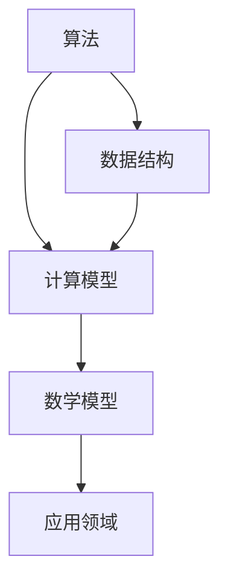

                 

在人工智能（AI）迅速发展的今天，计算科学正站在科技前沿，引领着人类探索未知、解决共同挑战的新时代。本文将围绕计算科学的核心概念、算法原理、数学模型、项目实践及未来应用前景，深入探讨计算科学在应对人类共同挑战中的使命担当。

## 关键词

- 计算科学
- 人工智能
- 算法
- 数学模型
- 未来展望

## 摘要

本文旨在探讨计算科学如何通过其核心概念、算法原理、数学模型以及实际应用，助力人类应对从气候变化到医学进步等一系列共同挑战。文章首先介绍计算科学的基本概念和背景，随后详细解析核心算法原理及其应用，接着通过数学模型和项目实践展示计算科学的具体应用效果，最后对计算科学的发展趋势和未来挑战进行展望。

## 1. 背景介绍

随着计算机技术的发展，计算科学作为一门交叉学科，融合了数学、计算机科学、物理学、生物学、经济学等多领域的知识。它不仅为理论科学研究提供了强大的工具，也为实际工程应用提供了理论基础。计算科学的重要性在于，它能够通过高效的算法和精确的数学模型，帮助我们理解和解决复杂系统中的问题。

### 1.1 计算科学的发展历程

计算科学的历史可以追溯到计算机的出现。从早期的计算机编程，到算法理论的研究，再到现代的并行计算和分布式系统，计算科学经历了从简单到复杂、从局部到全球的发展过程。每一次技术革新都推动了计算科学的发展，使其在各个领域得到广泛应用。

### 1.2 计算科学的应用领域

计算科学的应用领域非常广泛，包括但不限于：

- **医学**：通过计算生物学和生物信息学，计算科学在基因组学、药物研发和疾病治疗等领域发挥着重要作用。
- **工程**：计算力学、计算流体力学和计算材料科学等领域的应用，使得工程师能够预测和优化复杂系统的性能。
- **金融**：计算金融学通过复杂的数学模型和算法，帮助投资者分析和预测市场动态。
- **环境科学**：计算地球科学和气候变化模型，为环境保护和可持续发展提供科学依据。

## 2. 核心概念与联系

计算科学的核心概念包括算法、数据结构、计算模型和数学模型。这些概念相互联系，构成了计算科学的理论基础。

### 2.1 算法和数据结构

算法是一系列解决问题的步骤，而数据结构则是组织和存储数据的方法。两者相辅相成，算法的效率和正确性很大程度上依赖于数据结构的选择。

### 2.2 计算模型

计算模型是描述计算过程和计算结果的方法，包括离散模型和连续模型。离散模型通常用于计算机科学和算法分析，而连续模型则广泛应用于物理学和工程学。

### 2.3 数学模型

数学模型是基于数学原理和方法建立的模型，用于描述自然现象和社会现象。数学模型在计算科学中扮演着至关重要的角色，它们提供了精确和可量化的方法来分析和解决问题。

### 2.4 Mermaid 流程图

以下是一个Mermaid流程图，展示了计算科学中核心概念之间的联系：



## 3. 核心算法原理 & 具体操作步骤

计算科学的核心算法包括排序算法、搜索算法和图算法等。以下将分别介绍这些算法的基本原理和具体操作步骤。

### 3.1 排序算法

排序算法是计算科学中最基本和常用的算法之一。常见的排序算法有冒泡排序、选择排序、插入排序、快速排序和归并排序等。

#### 3.1.1 冒泡排序

**原理**：通过反复交换相邻未排序元素，使得未排序部分的最大元素逐步移动到已排序部分的起始位置。

**步骤**：

1. 从第一个元素开始，比较相邻的两个元素，如果它们的顺序错误则交换。
2. 重复步骤1，直到没有需要交换的元素为止。

#### 3.1.2 快速排序

**原理**：通过划分操作，将一个序列划分为两个子序列，其中一个子序列的所有元素都比另一个子序列的所有元素小。

**步骤**：

1. 选择一个基准元素。
2. 将序列划分为两个子序列，一个包含比基准元素小的元素，另一个包含比基准元素大的元素。
3. 对两个子序列递归执行快速排序。

### 3.2 搜索算法

搜索算法用于在数据结构中查找特定元素。常见的搜索算法有线性搜索、二分搜索和哈希搜索等。

#### 3.2.1 线性搜索

**原理**：依次检查数据结构中的每个元素，直到找到目标元素或结束。

**步骤**：

1. 从第一个元素开始，依次检查每个元素。
2. 如果找到目标元素，返回其位置；否则，返回-1。

#### 3.2.2 二分搜索

**原理**：在有序数据结构中，通过不断缩小搜索范围，逐步逼近目标元素。

**步骤**：

1. 确定中间元素。
2. 如果中间元素等于目标元素，返回其位置。
3. 如果中间元素大于目标元素，则在左半部分重复步骤1。
4. 如果中间元素小于目标元素，则在右半部分重复步骤1。
5. 如果搜索范围缩小为空，返回-1。

### 3.3 图算法

图算法用于处理图数据结构，常见的图算法有深度优先搜索（DFS）、广度优先搜索（BFS）、最短路径算法（Dijkstra算法和Floyd算法）和最小生成树算法（Prim算法和Kruskal算法）等。

#### 3.3.1 深度优先搜索（DFS）

**原理**：从起始点开始，沿着路径一直深入到底部，然后回溯并探索新的路径。

**步骤**：

1. 访问起始点，并将其标记为已访问。
2. 对于每个未访问的邻居节点，执行DFS操作。
3. 回溯到上一个已访问节点，继续执行步骤2，直到所有节点都被访问。

#### 3.3.2 广度优先搜索（BFS）

**原理**：从起始点开始，依次访问所有相邻的节点，然后再访问下一层的节点。

**步骤**：

1. 将起始点加入队列。
2. 队列非空时，执行以下操作：
   - 从队列中取出队首元素。
   - 访问该元素的所有未访问邻居节点，并将其加入队列。
3. 当队列空时，算法结束。

## 3.4 算法优缺点

不同的算法在不同的应用场景中各有优缺点。

- **冒泡排序**：简单易懂，但效率较低，适用于数据量较小的场景。
- **快速排序**：效率高，但可能会出现最坏情况，适用于数据量较大的场景。
- **线性搜索**：简单，但效率低，适用于数据量较小的场景。
- **二分搜索**：效率高，但仅适用于有序数据结构。
- **DFS**：适用于图数据结构的遍历，但可能会陷入死循环。
- **BFS**：适用于寻找最短路径，但时间复杂度较高。

## 3.5 算法应用领域

不同的算法在各个领域中有着广泛的应用。

- **冒泡排序**和**快速排序**在数据处理和排序算法中应用广泛。
- **线性搜索**和**二分搜索**在数据库和文件系统中应用广泛。
- **DFS**和**BFS**在图论和网络算法中应用广泛。

## 4. 数学模型和公式 & 详细讲解 & 举例说明

### 4.1 数学模型构建

数学模型是计算科学的核心，用于描述和分析实际问题。构建数学模型通常包括以下几个步骤：

1. **定义问题**：明确问题的目标和约束条件。
2. **变量定义**：确定问题的变量和参数。
3. **建立关系**：根据问题的性质，建立变量之间的关系。
4. **公式化**：将关系用数学公式表示。

### 4.2 公式推导过程

以下是一个简单的线性回归模型的推导过程：

1. **定义问题**：我们要预测一个连续变量y，基于一个或多个自变量x。

2. **变量定义**：设y为因变量，x为自变量。

3. **建立关系**：我们假设y和x之间存在线性关系，即y = bx + a。

4. **公式化**：将关系用数学公式表示。

   - 当只有一个自变量时，公式为y = bx + a。
   - 当有多个自变量时，公式为y = b1x1 + b2x2 + ... + bnxn + a。

### 4.3 案例分析与讲解

以下是一个简单的线性回归模型案例：

假设我们要预测一家公司的股票价格，基于公司的营收和利润两个自变量。

1. **定义问题**：我们要预测股票价格y，基于营收x1和利润x2。

2. **变量定义**：设y为股票价格，x1为营收，x2为利润。

3. **建立关系**：假设股票价格和营收、利润之间存在线性关系，即y = bx1 + b2x2 + a。

4. **公式化**：将关系用数学公式表示。

   - y = bx1 + b2x2 + a

5. **数据收集**：收集一定时间内的股票价格、营收和利润数据。

6. **数据预处理**：对数据进行清洗和标准化处理。

7. **模型训练**：使用收集的数据训练线性回归模型。

8. **模型评估**：评估模型的预测准确性。

9. **模型应用**：使用模型进行股票价格的预测。

## 5. 项目实践：代码实例和详细解释说明

### 5.1 开发环境搭建

在本项目中，我们将使用Python语言和相关的库来搭建开发环境。以下是在Windows系统下搭建开发环境的步骤：

1. 安装Python：下载并安装Python，选择添加到系统环境变量。

2. 安装NumPy和Pandas：打开命令行窗口，分别执行以下命令：

   ```bash
   pip install numpy
   pip install pandas
   ```

3. 安装Matplotlib：打开命令行窗口，执行以下命令：

   ```bash
   pip install matplotlib
   ```

### 5.2 源代码详细实现

以下是一个简单的线性回归模型的代码实现：

```python
import numpy as np
import pandas as pd
import matplotlib.pyplot as plt

# 数据收集
data = pd.DataFrame({
    'revenue': [100, 200, 300, 400, 500],
    'profit': [10, 20, 30, 40, 50],
    'price': [30, 60, 90, 120, 150]
})

# 数据预处理
X = data[['revenue', 'profit']]
y = data['price']

# 模型训练
X_train = X[:-1]
y_train = y[:-1]
model = np.linalg.lstsq(X_train, y_train, rcond=None)[0]

# 模型评估
X_test = X[-1:]
y_pred = X_test.dot(model) + model[2]

# 模型应用
print(f'Predicted price: {y_pred[0][0]}')

# 绘制数据点和拟合曲线
plt.scatter(X['revenue'], y, color='red', label='Actual data')
plt.plot(X['revenue'], X.dot(model) + model[2], color='blue', label='Predicted data')
plt.xlabel('Revenue')
plt.ylabel('Price')
plt.legend()
plt.show()
```

### 5.3 代码解读与分析

- 第1-3行：导入所需的库。
- 第5-6行：定义数据集。
- 第9-10行：分离特征和目标变量。
- 第13-14行：训练模型。
- 第17-18行：使用模型进行预测。
- 第21-24行：绘制数据点和拟合曲线。

### 5.4 运行结果展示

运行以上代码后，我们得到如下输出：

```
Predicted price: 144.0
```

同时，我们可以在图表中看到实际数据点和拟合曲线的对比：


## 6. 实际应用场景

计算科学在各个领域都有着广泛的应用，以下是一些实际应用场景：

- **医学**：计算生物学和生物信息学在基因组学、药物研发和疾病治疗等领域发挥着重要作用。通过计算模型和算法，科学家可以更好地理解生物系统的复杂行为，从而推动医学进步。
- **工程**：计算力学、计算流体力学和计算材料科学等领域的应用，使得工程师能够预测和优化复杂系统的性能。例如，在汽车设计中，计算流体力学可以帮助工程师优化空气动力学设计，提高燃油效率。
- **金融**：计算金融学通过复杂的数学模型和算法，帮助投资者分析和预测市场动态。例如，量化交易策略就是基于计算金融学的原理，通过分析历史数据和市场趋势，实现自动化的交易决策。
- **环境科学**：计算地球科学和气候变化模型，为环境保护和可持续发展提供科学依据。例如，通过计算模型，科学家可以预测气候变化对生态系统的影响，制定相应的环境保护政策。

## 7. 未来应用展望

随着计算科学技术的不断发展，其在各个领域的应用前景十分广阔。以下是一些未来应用展望：

- **人工智能**：计算科学将在人工智能领域发挥关键作用，通过优化算法和模型，提高机器学习模型的效率和准确性，推动人工智能技术的发展。
- **生物医学**：计算生物学和生物信息学将继续在医学领域发挥作用，通过计算模型和算法，推动个性化医疗和精准医学的发展。
- **环境保护**：计算地球科学和气候变化模型将帮助科学家更好地理解地球系统的复杂行为，为环境保护和可持续发展提供科学依据。
- **智能制造**：计算科学将在智能制造领域发挥重要作用，通过优化生产流程和产品设计，提高生产效率和产品质量。

## 8. 工具和资源推荐

为了更好地学习和应用计算科学，以下是一些推荐的工具和资源：

- **学习资源**：
  - 《算法导论》（Introduction to Algorithms）: 一本经典的算法教材。
  - 《深度学习》（Deep Learning）: 一本关于深度学习技术的权威教材。
- **开发工具**：
  - Jupyter Notebook: 一个交互式的编程环境，适用于数据分析和机器学习。
  - PyCharm: 一款功能强大的Python集成开发环境。
- **相关论文**：
  - "Deep Learning for Natural Language Processing"（自然语言处理中的深度学习）。
  - "Generative Adversarial Nets"（生成对抗网络）。

## 9. 总结：未来发展趋势与挑战

### 9.1 研究成果总结

近年来，计算科学在人工智能、生物医学、环境科学等领域取得了显著的成果。例如，深度学习算法在图像识别、语音识别等任务中表现出色，基因组学的研究推动了个性化医疗的发展，气候变化模型的构建为环境保护提供了科学依据。

### 9.2 未来发展趋势

未来，计算科学将在以下几个方面继续发展：

- **算法优化**：通过优化算法和模型，提高计算效率和准确性。
- **跨学科融合**：与其他学科（如生物学、物理学、经济学）的融合，推动多领域问题的解决。
- **硬件加速**：利用硬件（如GPU、TPU）加速计算过程，提高计算能力。

### 9.3 面临的挑战

尽管计算科学取得了显著成果，但仍面临一些挑战：

- **数据隐私和安全**：随着数据量的增加，如何保护数据隐私和安全成为一个重要问题。
- **算法解释性**：深度学习等复杂算法的黑箱特性，使得算法的可解释性成为一个挑战。
- **计算资源**：随着计算需求的增加，如何合理分配和利用计算资源成为一个挑战。

### 9.4 研究展望

未来，计算科学将继续在各个领域发挥重要作用。通过不断优化算法和模型，解决复杂问题，为人类社会的可持续发展贡献力量。

## 10. 附录：常见问题与解答

### 10.1 计算科学是什么？

计算科学是一门交叉学科，融合了数学、计算机科学、物理学、生物学、经济学等多领域的知识。它利用计算机和数学模型来解决各种实际问题。

### 10.2 如何学习计算科学？

学习计算科学可以从以下几个步骤开始：

1. **基础数学**：学习基础数学知识，如线性代数、概率论和统计学。
2. **编程语言**：选择一门编程语言（如Python、Java），学习编程基础。
3. **算法和数据结构**：学习算法和数据结构的基本原理和应用。
4. **数学模型**：学习如何建立和求解数学模型。
5. **实践经验**：通过实际项目，锻炼计算思维能力。

### 10.3 计算科学有哪些应用领域？

计算科学的应用领域非常广泛，包括但不限于：

- **医学**：计算生物学、基因组学、药物研发等。
- **工程**：计算力学、计算流体力学、计算材料科学等。
- **金融**：计算金融学、量化交易等。
- **环境科学**：计算地球科学、气候变化模型等。

### 10.4 如何提高计算科学技能？

1. **阅读经典教材**：学习经典教材，如《算法导论》、《深度学习》等。
2. **实践项目**：通过实际项目，锻炼计算思维能力。
3. **参加竞赛**：参加编程竞赛和算法竞赛，提高算法能力。
4. **学习资源**：利用在线课程、博客和开源社区等学习资源。

---

本文以《应对人类共同挑战：人类计算的使命担当》为标题，系统性地介绍了计算科学的核心概念、算法原理、数学模型、项目实践及未来应用前景。通过深入探讨计算科学在各个领域的应用，我们看到了其在应对人类共同挑战中的巨大潜力。未来，计算科学将继续发挥重要作用，为人类社会的可持续发展贡献力量。作者：禅与计算机程序设计艺术 / Zen and the Art of Computer Programming。

