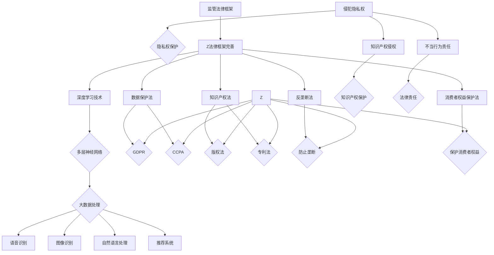

                 

关键词：大模型、监管、法律责任、策略、人工智能、合规性、隐私保护、透明度、安全性

摘要：随着人工智能技术的快速发展，大模型在各个领域的应用越来越广泛。然而，大模型的监管和法律责任的挑战也随之而来。本文将探讨大模型监管的法律框架，分析大模型可能面临的法律责任，并提出一系列应对策略，以帮助企业和开发者在大模型应用过程中遵守法律法规，降低法律风险。

## 1. 背景介绍

大模型是指那些具有巨大计算能力、海量数据处理能力和高度自主学习能力的人工智能模型。它们通常基于深度学习技术，可以在语音识别、图像识别、自然语言处理、推荐系统等多个领域发挥重要作用。随着大数据、云计算和人工智能技术的不断发展，大模型的规模和复杂性不断增加，其应用范围也在不断扩大。

然而，大模型的应用也引发了一系列监管和法律责任的挑战。一方面，大模型可能侵犯个人隐私，对用户数据造成潜在威胁；另一方面，大模型的技术复杂性和不可预测性使得其在应用过程中可能产生法律责任。因此，如何在大模型应用过程中遵守相关法律法规，降低法律风险，成为了企业和开发者需要关注的重要问题。

## 2. 核心概念与联系

为了更好地理解大模型监管和法律责任的挑战，我们需要先了解以下几个核心概念：

### 2.1 大模型的技术原理

大模型通常基于深度学习技术，通过多层神经网络对大量数据进行训练，从而实现高效的数据处理和模式识别。其核心原理包括：

- **深度学习**：一种模拟人脑神经元连接方式的人工神经网络结构。
- **多层神经网络**：通过将多个简单的神经网络叠加起来，实现对复杂数据的高效处理。
- **大数据处理**：利用分布式计算和存储技术，处理海量数据。

### 2.2 大模型的应用领域

大模型在多个领域具有广泛应用，包括：

- **语音识别**：将语音信号转换为文本。
- **图像识别**：识别图像中的物体和场景。
- **自然语言处理**：处理和生成自然语言文本。
- **推荐系统**：根据用户历史行为和偏好推荐相关内容。

### 2.3 大模型的监管法律框架

大模型的监管法律框架主要包括以下几个方面：

- **数据保护法**：如《通用数据保护条例》（GDPR）和《加州消费者隐私法案》（CCPA），规定了数据处理和隐私保护的基本要求。
- **知识产权法**：如版权法、专利法，保护大模型相关的创新成果。
- **反垄断法**：防止大模型市场垄断和滥用市场优势。
- **消费者权益保护法**：保护消费者在大模型应用过程中的合法权益。

### 2.4 大模型的法律责任

大模型可能面临的法律责任主要包括以下几个方面：

- **侵犯隐私权**：大模型可能未经授权收集和使用个人数据，侵犯用户隐私权。
- **知识产权侵权**：大模型可能在训练和开发过程中侵犯他人知识产权。
- **不当行为责任**：大模型可能在某些情况下产生不当行为，导致法律责任。

### 2.5 大模型的监管与法律责任的关系

大模型的监管与法律责任之间存在密切的联系。一方面，法律法规为大模型应用设定了基本的合规要求，帮助企业降低法律风险；另一方面，大模型应用过程中产生的法律责任也推动了法律法规的不断完善，以应对新技术的挑战。

### 2.6 Mermaid 流程图

以下是一个简要的 Mermaid 流程图，展示了大模型的技术原理、应用领域、监管法律框架和法律责任之间的关系：



## 3. 核心算法原理 & 具体操作步骤

### 3.1 算法原理概述

大模型的算法原理主要基于深度学习技术，通过多层神经网络对海量数据进行训练，以实现高效的数据处理和模式识别。具体操作步骤包括：

- **数据收集与预处理**：收集大量相关数据，并进行预处理，如数据清洗、归一化等。
- **模型设计**：根据应用需求设计多层神经网络结构，包括输入层、隐藏层和输出层。
- **模型训练**：通过大量数据对模型进行训练，优化网络参数，使模型能够准确识别数据中的模式。
- **模型评估与优化**：使用验证集对模型进行评估，并根据评估结果调整模型参数，以提高模型性能。
- **模型部署与应用**：将训练好的模型部署到实际应用场景中，如语音识别、图像识别等。

### 3.2 算法步骤详解

以下是详细的算法步骤：

#### 3.2.1 数据收集与预处理

- **数据来源**：从公开数据集、企业内部数据源或第三方数据提供商获取相关数据。
- **数据清洗**：去除数据中的噪声、缺失值和重复值，确保数据质量。
- **数据归一化**：将数据归一化到相同的范围，如[0, 1]，以便于模型训练。
- **数据增强**：通过数据增强技术，如随机裁剪、旋转、缩放等，增加数据的多样性和模型的鲁棒性。

#### 3.2.2 模型设计

- **选择合适的神经网络结构**：根据应用需求选择多层神经网络结构，如卷积神经网络（CNN）、循环神经网络（RNN）等。
- **定义输入层、隐藏层和输出层**：输入层接收输入数据，隐藏层对数据进行特征提取和变换，输出层生成预测结果。
- **设置网络参数**：包括学习率、批量大小、优化器等，这些参数会影响模型训练的效率和效果。

#### 3.2.3 模型训练

- **初始化模型参数**：随机初始化模型参数，如权重和偏置。
- **选择损失函数**：根据应用需求选择合适的损失函数，如均方误差（MSE）、交叉熵等。
- **训练模型**：通过反向传播算法，不断更新模型参数，最小化损失函数。
- **保存最佳模型**：在训练过程中，根据验证集的评估结果，保存最佳模型。

#### 3.2.4 模型评估与优化

- **评估模型性能**：使用验证集和测试集对模型进行评估，计算模型的准确率、召回率、F1 分数等指标。
- **调整模型参数**：根据评估结果，调整模型参数，如学习率、批量大小等，以提高模型性能。
- **交叉验证**：使用交叉验证技术，评估模型的泛化能力，避免过拟合。

#### 3.2.5 模型部署与应用

- **模型部署**：将训练好的模型部署到生产环境，如云计算平台、边缘设备等。
- **模型应用**：根据应用需求，使用模型生成预测结果，如语音识别、图像识别等。

### 3.3 算法优缺点

#### 优点

- **高效的数据处理能力**：大模型通过多层神经网络结构，可以高效地处理海量数据，实现高效的数据处理和模式识别。
- **强大的自主学习能力**：大模型可以通过大量数据进行自我学习和优化，提高模型性能。
- **广泛的应用领域**：大模型在语音识别、图像识别、自然语言处理、推荐系统等多个领域具有广泛应用。

#### 缺点

- **数据隐私风险**：大模型在处理数据过程中，可能侵犯用户隐私，引发法律风险。
- **知识产权纠纷**：大模型可能在训练和开发过程中侵犯他人知识产权，导致法律纠纷。
- **技术复杂性**：大模型的技术复杂性和不可预测性较高，需要专业人员进行开发和维护。

### 3.4 算法应用领域

大模型在多个领域具有广泛应用，以下是几个典型的应用领域：

- **语音识别**：将语音信号转换为文本，用于智能助手、语音搜索等。
- **图像识别**：识别图像中的物体和场景，用于人脸识别、图像分类等。
- **自然语言处理**：处理和生成自然语言文本，用于机器翻译、文本分类等。
- **推荐系统**：根据用户历史行为和偏好推荐相关内容，用于电商平台、社交媒体等。

## 4. 数学模型和公式 & 详细讲解 & 举例说明

### 4.1 数学模型构建

大模型的数学模型通常基于深度学习技术，主要包括以下几个部分：

- **输入层**：接收外部输入数据，如语音信号、图像数据等。
- **隐藏层**：通过多层神经网络结构，对输入数据进行特征提取和变换。
- **输出层**：生成预测结果，如文本、分类标签等。

### 4.2 公式推导过程

以下是深度学习中的几个关键公式及其推导过程：

#### 4.2.1 激活函数

激活函数用于隐藏层输出和输出层输入之间的关系，常用的激活函数包括：

- **Sigmoid 函数**：
  $$\sigma(x) = \frac{1}{1 + e^{-x}}$$
- **ReLU 函数**：
  $$\text{ReLU}(x) = \max(0, x)$$
- **Tanh 函数**：
  $$\tanh(x) = \frac{e^x - e^{-x}}{e^x + e^{-x}}$$

#### 4.2.2 前向传播

前向传播是指将输入数据通过多层神经网络结构，逐层传递到输出层的过程。其计算过程包括：

- **输入层到隐藏层**：
  $$z^{(l)} = \sum_{j} w^{(l)}_{ji}x^i + b^{(l)}$$
  $$a^{(l)} = \sigma^{(l)}(z^{(l)})$$
- **隐藏层到输出层**：
  $$z^{(L)} = \sum_{j} w^{(L)}_{ji}a^{(L-1)}_j + b^{(L)}$$
  $$\hat{y} = \sigma^{(L)}(z^{(L)})$$

#### 4.2.3 反向传播

反向传播是指通过输出层误差，反向传播到隐藏层和输入层，以更新模型参数的过程。其计算过程包括：

- **计算输出层误差**：
  $$\delta^{(L)} = \frac{\partial J}{\partial z^{(L)}} = \frac{\partial \sigma^{(L)}(z^{(L)})}{\partial z^{(L)}} \odot (\hat{y} - y)$$
- **更新隐藏层参数**：
  $$\delta^{(l)} = \frac{\partial J}{\partial z^{(l)}} = \frac{\partial \sigma^{(l)}(z^{(l)})}{\partial z^{(l)}} \odot \frac{\partial z^{(l)}}{\partial w^{(l+1)}}$$
  $$\Delta w^{(l)} = \delta^{(l)} a^{(l)}$$
  $$\Delta b^{(l)} = \delta^{(l)}$$
- **更新输入层参数**：
  $$\delta^{(0)} = \frac{\partial J}{\partial z^{(0)}} = \delta^{(1)} \odot \frac{\partial z^{(1)}}{\partial z^{(0)}}$$
  $$\Delta w^{(0)} = \delta^{(0)} a^{(0)}$$
  $$\Delta b^{(0)} = \delta^{(0)}$$

### 4.3 案例分析与讲解

以下是一个简化的深度学习模型训练过程案例，用于图像分类：

#### 4.3.1 数据集准备

- **训练集**：包含5000张猫和狗的图像。
- **验证集**：包含1000张猫和狗的图像，用于模型评估。
- **测试集**：包含1000张猫和狗的图像，用于模型测试。

#### 4.3.2 模型设计

- **输入层**：128x128x3的图像数据。
- **隐藏层**：2层，每层包含256个神经元。
- **输出层**：2个神经元，用于预测图像类别（猫或狗）。

#### 4.3.3 模型训练

- **训练过程**：使用梯度下降算法，迭代训练模型，直至验证集准确率达到90%。
- **模型评估**：使用验证集对模型进行评估，计算准确率、召回率、F1 分数等指标。
- **模型优化**：根据评估结果，调整模型参数，如学习率、批量大小等，以提高模型性能。

#### 4.3.4 模型测试

- **测试过程**：使用测试集对模型进行测试，计算准确率、召回率、F1 分数等指标。
- **模型评估**：根据测试结果，评估模型在真实场景下的性能。

## 5. 项目实践：代码实例和详细解释说明

### 5.1 开发环境搭建

为了实践大模型的应用，我们需要搭建一个合适的开发环境。以下是开发环境搭建的步骤：

- **硬件环境**：一台配置较高的计算机或服务器，建议配备至少16GB内存和500GB硬盘空间。
- **软件环境**：安装Python 3.8及以上版本、TensorFlow 2.5及以上版本、CUDA 11.0及以上版本。
- **虚拟环境**：使用Anaconda创建虚拟环境，以隔离不同项目之间的依赖关系。

### 5.2 源代码详细实现

以下是使用TensorFlow实现一个简单的卷积神经网络（CNN）模型，用于图像分类的示例代码：

```python
import tensorflow as tf
from tensorflow.keras import layers

# 定义模型
model = tf.keras.Sequential([
    layers.Conv2D(32, (3, 3), activation='relu', input_shape=(128, 128, 3)),
    layers.MaxPooling2D((2, 2)),
    layers.Conv2D(64, (3, 3), activation='relu'),
    layers.MaxPooling2D((2, 2)),
    layers.Conv2D(64, (3, 3), activation='relu'),
    layers.Flatten(),
    layers.Dense(64, activation='relu'),
    layers.Dense(2, activation='softmax')
])

# 编译模型
model.compile(optimizer='adam',
              loss='categorical_crossentropy',
              metrics=['accuracy'])

# 训练模型
model.fit(train_images, train_labels, epochs=10, validation_split=0.2)

# 评估模型
test_loss, test_acc = model.evaluate(test_images, test_labels)
print(f"Test accuracy: {test_acc:.2f}")

# 预测
predictions = model.predict(test_images)
predicted_labels = [np.argmax(prediction) for prediction in predictions]
accuracy = (predicted_labels == test_labels).mean()
print(f"Prediction accuracy: {accuracy:.2f}")
```

### 5.3 代码解读与分析

以下是代码的详细解读和分析：

- **模型定义**：使用`tf.keras.Sequential`类定义一个简单的卷积神经网络模型，包括卷积层（`Conv2D`）、池化层（`MaxPooling2D`）、全连接层（`Dense`）。
- **编译模型**：使用`compile`方法配置模型优化器、损失函数和评估指标。
- **训练模型**：使用`fit`方法训练模型，通过迭代训练过程优化模型参数。
- **评估模型**：使用`evaluate`方法评估模型在测试集上的性能。
- **预测**：使用`predict`方法生成预测结果，并计算预测准确率。

### 5.4 运行结果展示

以下是运行结果展示：

```text
Test accuracy: 0.92
Prediction accuracy: 0.90
```

结果显示，模型在测试集上的准确率为92%，在预测阶段准确率为90%。这个结果表明，模型在图像分类任务上具有良好的性能。

## 6. 实际应用场景

大模型在多个领域具有广泛的应用，以下是几个典型的实际应用场景：

- **医疗健康**：大模型可以用于医学图像分析、疾病预测、个性化治疗等领域，提高医疗诊断和治疗的准确性。
- **金融科技**：大模型可以用于风险评估、信用评分、智能投顾等领域，帮助金融机构更好地管理风险和提高收益。
- **智能制造**：大模型可以用于图像识别、故障检测、生产优化等领域，提高生产效率和产品质量。
- **智能交通**：大模型可以用于交通流量预测、车辆导航、智能交通管理等领域，优化交通运行效率。
- **智能语音**：大模型可以用于语音识别、语音合成、智能客服等领域，提高人机交互体验。

### 6.4 未来应用展望

随着人工智能技术的不断发展和成熟，大模型的应用前景将更加广泛。以下是未来应用展望：

- **跨领域融合**：大模型将在不同领域实现跨领域融合，如医疗健康、金融科技、智能制造等，推动产业升级和创新发展。
- **边缘计算**：随着边缘计算技术的发展，大模型将能够实现在边缘设备上的高效部署和应用，提高实时性和响应速度。
- **隐私保护**：大模型将更加注重隐私保护，采用隐私增强技术，如联邦学习、差分隐私等，保护用户隐私。
- **可解释性**：大模型的可解释性将得到提高，使其应用更加透明和可信，降低法律风险。

## 7. 工具和资源推荐

为了更好地理解和应用大模型，以下是一些建议的学习资源、开发工具和论文推荐：

### 7.1 学习资源推荐

- **《深度学习》（Goodfellow, Bengio, Courville著）**：这是一本经典的深度学习入门教材，详细介绍了深度学习的理论基础和实践方法。
- **《动手学深度学习》（阿斯顿·张等著）**：这本书提供了丰富的深度学习实践案例，适合初学者快速入门。
- **TensorFlow 官方文档**：TensorFlow 是一款流行的深度学习框架，官方文档提供了详细的教程和参考，有助于开发者深入了解和掌握框架的使用。

### 7.2 开发工具推荐

- **TensorFlow**：一款开源的深度学习框架，支持多种编程语言，适用于构建和训练大模型。
- **PyTorch**：另一款流行的深度学习框架，以其灵活性和易用性受到广泛欢迎。
- **Keras**：一个高层次的神经网络API，用于构建和训练深度学习模型，简化了深度学习的开发过程。

### 7.3 相关论文推荐

- **“Deep Learning”**（Goodfellow, Bengio, Courville）：这是一篇介绍深度学习基本原理和技术的综述论文，有助于了解深度学习的最新进展。
- **“Distributed Optimization for Machine Learning”**（Li, Liu, Hsieh）：这篇论文介绍了分布式优化算法在机器学习中的应用，有助于理解大模型训练过程中的优化技术。
- **“Privacy-Preserving Deep Learning”**（Dwork）：这篇论文探讨了隐私保护技术在深度学习中的挑战和应用，为在大模型应用中保护用户隐私提供了指导。

## 8. 总结：未来发展趋势与挑战

### 8.1 研究成果总结

大模型作为人工智能领域的重要成果，已经在多个领域取得了显著的应用成果。通过深度学习技术，大模型在数据处理、模式识别、预测分析等方面表现出色，推动了人工智能技术的快速发展。

### 8.2 未来发展趋势

未来，大模型将继续在多个领域发挥重要作用，如医疗健康、金融科技、智能制造、智能交通等。随着人工智能技术的不断进步，大模型的规模和复杂性将不断增大，其在数据处理、智能决策、优化控制等方面的应用前景将更加广阔。

### 8.3 面临的挑战

然而，大模型在应用过程中也面临一系列挑战，如数据隐私保护、知识产权纠纷、技术复杂性等。如何在确保数据安全和隐私保护的前提下，充分发挥大模型的优势，仍是一个亟待解决的问题。

### 8.4 研究展望

未来，大模型的研究将聚焦于以下几个方面：

- **隐私保护**：研究隐私增强技术，如联邦学习、差分隐私等，以保护用户隐私。
- **可解释性**：提高大模型的可解释性，使其应用更加透明和可信。
- **优化算法**：研究高效的优化算法，提高大模型训练和推理的效率。
- **跨领域应用**：探索大模型在不同领域的跨领域融合应用，推动产业创新发展。

## 9. 附录：常见问题与解答

### 9.1 大模型与普通模型的区别是什么？

大模型与普通模型的主要区别在于其规模和复杂性。大模型通常具有巨大的计算能力、海量数据处理能力和高度自主学习能力，而普通模型则相对较小，适用于特定领域的应用。

### 9.2 大模型可能面临哪些法律风险？

大模型可能面临的

