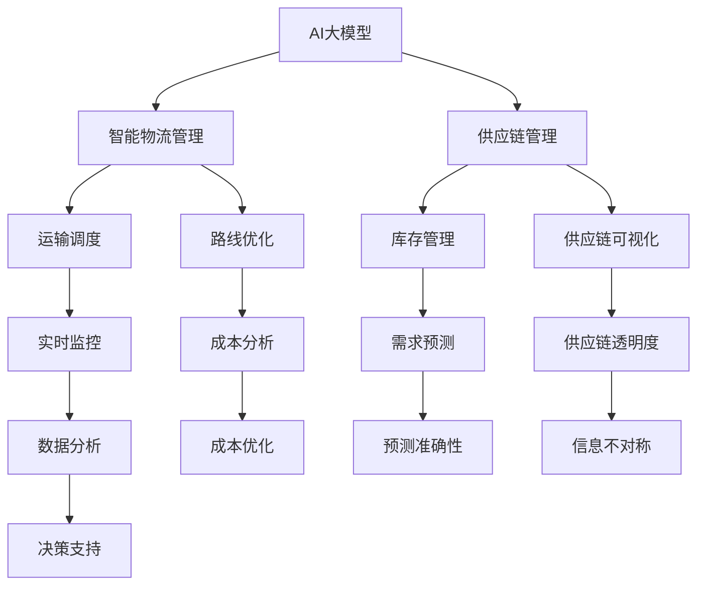

                 

关键词：AI大模型，智能物流，供应链管理，优化，技术应用

> 摘要：随着全球物流与供应链管理的不断发展和复杂化，应用人工智能（AI）大模型已经成为提高物流效率和供应链透明度的关键手段。本文将深入探讨AI大模型在智能物流与供应链管理中的应用，阐述其核心概念、算法原理、数学模型、实践案例及未来发展趋势，旨在为相关领域的研究和实践提供有价值的参考。

## 1. 背景介绍

在当今全球经济一体化的背景下，物流与供应链管理成为企业运营的核心环节，直接影响着生产效率和市场竞争力。传统的物流与供应链管理模式在应对日益复杂的供需关系和全球化竞争时，面临着诸多挑战。例如，库存管理困难、运输成本高、供应链透明度低等问题。这些问题不仅增加了企业的运营成本，还降低了客户满意度。

近年来，随着人工智能技术的快速发展，特别是大模型技术的突破，为解决上述问题提供了新的思路和解决方案。AI大模型具有强大的数据处理和模式识别能力，能够从海量数据中提取有用信息，提供精准的预测和优化建议。在智能物流与供应链管理领域，AI大模型的引入不仅提高了决策的准确性和效率，还为创新性的商业模式和运营策略提供了支持。

本文将围绕以下内容展开讨论：

1. AI大模型的核心概念与联系
2. 核心算法原理与具体操作步骤
3. 数学模型与公式
4. 项目实践与代码实例
5. 实际应用场景
6. 未来应用展望
7. 工具和资源推荐
8. 总结：未来发展趋势与挑战

## 2. 核心概念与联系

### 2.1 AI大模型概述

AI大模型是指具有巨大参数量和强大计算能力的神经网络模型。它们通常基于深度学习技术，能够在大规模数据集上进行训练，以实现高度复杂的数据处理和模式识别任务。AI大模型的核心特征包括：

- **高参数量**：大模型通常具有数百万到数十亿个参数，能够捕捉数据中的复杂模式。
- **强大的计算能力**：借助GPU等高性能计算设备，大模型能够实现高效的训练和推理。
- **自我优化**：通过不断迭代和优化，大模型能够自动调整内部参数，提高预测和决策的准确性。

### 2.2 智能物流与供应链管理

智能物流与供应链管理是物流和供应链领域的重要研究方向，旨在通过信息技术和智能化手段，实现物流过程的自动化、智能化和高效化。其主要目标包括：

- **提高运输效率**：通过优化路线、调度和运输方式，降低运输成本，提高运输速度。
- **提高供应链透明度**：通过实时监控和数据分析，提高供应链各环节的透明度，减少信息不对称。
- **提高库存管理效率**：通过预测需求和库存水平，优化库存策略，减少库存成本和缺货风险。

### 2.3 Mermaid流程图

为了更好地理解AI大模型在智能物流与供应链管理中的应用，我们使用Mermaid流程图展示其核心概念和联系。



通过这个流程图，我们可以看到AI大模型如何与智能物流和供应链管理的各个环节相结合，发挥其强大的数据处理和分析能力，提高整体效率和管理水平。

## 3. 核心算法原理 & 具体操作步骤

### 3.1 算法原理概述

AI大模型在智能物流与供应链管理中的应用主要基于深度学习技术。深度学习通过多层神经网络结构，实现对复杂数据的自动特征提取和模式识别。在智能物流与供应链管理中，AI大模型的主要算法原理包括：

- **数据预处理**：对原始数据进行清洗、归一化和特征提取，为模型训练提供高质量的数据输入。
- **模型训练**：使用大规模数据集对神经网络模型进行训练，通过反向传播算法不断优化模型参数。
- **模型推理**：将训练好的模型应用于实际问题，进行预测和决策。

### 3.2 算法步骤详解

以下是AI大模型在智能物流与供应链管理中的具体操作步骤：

#### 3.2.1 数据收集与预处理

1. **数据收集**：从物流和供应链的各个环节收集原始数据，包括运输数据、库存数据、销售数据等。
2. **数据清洗**：去除数据中的噪声和异常值，保证数据质量。
3. **数据归一化**：将不同量纲的数据进行归一化处理，使其在相同的尺度上进行分析。
4. **特征提取**：从原始数据中提取有用的特征信息，如时间序列特征、空间特征、相关性特征等。

#### 3.2.2 模型训练

1. **模型选择**：选择适合问题的神经网络模型，如卷积神经网络（CNN）、循环神经网络（RNN）等。
2. **参数初始化**：初始化神经网络模型的参数，通常采用随机初始化或预训练模型。
3. **数据预处理**：对训练数据进行预处理，包括批量归一化、数据增强等。
4. **模型训练**：使用训练数据对模型进行训练，通过反向传播算法不断优化模型参数。
5. **模型评估**：使用验证数据对模型进行评估，调整模型结构和参数，提高预测准确性。

#### 3.2.3 模型推理与应用

1. **数据输入**：将实际的数据输入到训练好的模型中。
2. **预测输出**：模型根据输入数据输出预测结果，如运输路线、库存水平、需求预测等。
3. **决策支持**：根据预测结果，提供决策支持，如优化运输路线、调整库存策略等。
4. **反馈调整**：将实际结果与预测结果进行对比，反馈调整模型参数，提高模型准确性。

### 3.3 算法优缺点

#### 优点：

- **高准确性**：AI大模型通过深度学习技术，能够从海量数据中提取有用信息，提高预测和决策的准确性。
- **强泛化能力**：大模型具有强大的泛化能力，能够在不同领域和场景中发挥作用。
- **自动化处理**：大模型能够自动化处理复杂的数据分析和决策过程，提高效率。

#### 缺点：

- **计算资源需求高**：大模型需要大量的计算资源和时间进行训练和推理。
- **数据质量要求高**：模型的性能高度依赖于数据质量，数据噪声和异常值会对预测结果产生较大影响。
- **模型解释性较差**：深度学习模型的内部结构复杂，难以解释其预测和决策过程。

### 3.4 算法应用领域

AI大模型在智能物流与供应链管理中的应用领域广泛，主要包括：

- **运输调度**：通过预测运输需求和交通状况，优化运输路线和调度方案，提高运输效率。
- **库存管理**：通过预测库存需求和销售趋势，优化库存策略，减少库存成本和缺货风险。
- **供应链可视化**：通过实时监控和分析供应链各个环节的数据，提高供应链的透明度和管理效率。
- **需求预测**：通过分析历史数据和趋势，预测市场需求和销售量，为生产计划和供应链管理提供支持。

## 4. 数学模型和公式

### 4.1 数学模型构建

在智能物流与供应链管理中，AI大模型通常采用深度学习技术构建数学模型。以下是常见的数学模型构建步骤：

#### 4.1.1 数据表示

- **输入数据**：将物流和供应链的各个环节的数据进行特征提取，构建输入数据集。
- **输出数据**：根据实际问题需求，确定输出数据的类型，如预测值、决策值等。

#### 4.1.2 模型架构

- **网络结构**：选择适合问题的神经网络结构，如卷积神经网络（CNN）、循环神经网络（RNN）、长短时记忆网络（LSTM）等。
- **激活函数**：选择合适的激活函数，如ReLU、Sigmoid、Tanh等。
- **损失函数**：选择适合问题的损失函数，如均方误差（MSE）、交叉熵（Cross-Entropy）等。

#### 4.1.3 参数初始化

- **权重初始化**：通常采用随机初始化或预训练模型初始化权重。
- **学习率**：选择合适的学习率，如自适应学习率（Adagrad、Adam）。

### 4.2 公式推导过程

以下是AI大模型在智能物流与供应链管理中的常见数学模型推导：

#### 4.2.1 神经网络模型

假设输入数据为 \(X = [x_1, x_2, ..., x_n]\)，输出数据为 \(Y = [y_1, y_2, ..., y_n]\)。神经网络模型可以表示为：

$$
Y = f(W \cdot X + b)
$$

其中，\(W\) 为权重矩阵，\(b\) 为偏置项，\(f\) 为激活函数。

#### 4.2.2 反向传播算法

在反向传播算法中，我们需要计算损失函数关于权重矩阵的导数。假设损失函数为 \(L = f(Y - \hat{Y})\)，其中 \(\hat{Y}\) 为预测输出，可以推导出：

$$
\frac{\partial L}{\partial W} = (X \cdot \frac{\partial L}{\partial \hat{Y}}) \cdot \frac{\partial \hat{Y}}{\partial W}
$$

其中，\(\frac{\partial L}{\partial \hat{Y}}\) 为损失函数关于预测输出的导数，\(\frac{\partial \hat{Y}}{\partial W}\) 为预测输出关于权重的导数。

#### 4.2.3 梯度下降法

在梯度下降法中，我们通过计算损失函数关于权重矩阵的导数，来更新权重矩阵。假设学习率为 \(\alpha\)，则更新公式为：

$$
W_{new} = W_{old} - \alpha \cdot \frac{\partial L}{\partial W}
$$

通过反复迭代更新权重矩阵，我们可以逐渐降低损失函数的值，提高模型的预测准确性。

### 4.3 案例分析与讲解

以下是AI大模型在智能物流与供应链管理中一个具体的案例分析：

#### 案例背景

某物流公司负责从多个仓库向多个客户配送货物。由于仓库和客户分布广泛，公司希望利用AI大模型优化运输路线和调度方案，以提高运输效率和降低成本。

#### 模型构建

- **输入数据**：仓库位置、客户位置、货物类型、交通状况等。
- **输出数据**：最优运输路线、调度方案。

- **模型架构**：采用卷积神经网络（CNN）进行图像处理，提取交通状况特征；采用循环神经网络（RNN）进行时间序列处理，提取货物类型和客户需求特征；最终使用全连接神经网络（FCN）进行综合预测和决策。

#### 公式推导

- **交通状况特征提取**：

$$
C = CNN(T)
$$

其中，\(T\) 为交通状况图像，\(C\) 为交通状况特征。

- **货物类型和客户需求特征提取**：

$$
D = RNN(D_{history})
$$

其中，\(D_{history}\) 为历史客户需求数据，\(D\) 为客户需求特征。

- **综合预测和决策**：

$$
Y = FCN(C, D)
$$

其中，\(Y\) 为预测输出，包括最优运输路线和调度方案。

#### 模型训练与优化

- **数据预处理**：对交通状况图像、货物类型数据和客户需求数据进行预处理，如归一化和特征提取。
- **模型训练**：使用训练数据集对模型进行训练，通过反向传播算法不断优化模型参数。
- **模型评估**：使用验证数据集对模型进行评估，调整模型结构和参数，提高预测准确性。

#### 模型应用

- **数据输入**：将实际交通状况图像、货物类型数据和客户需求数据输入到训练好的模型中。
- **预测输出**：模型输出最优运输路线和调度方案。
- **决策支持**：根据预测结果，优化运输路线和调度方案，提高运输效率和降低成本。

通过这个案例分析，我们可以看到AI大模型在智能物流与供应链管理中的应用过程，以及如何利用数学模型和公式来实现优化目标。

## 5. 项目实践：代码实例和详细解释说明

### 5.1 开发环境搭建

在进行AI大模型在智能物流与供应链管理中的项目实践前，我们需要搭建合适的开发环境。以下是具体的步骤：

#### 5.1.1 硬件环境

- **GPU**：推荐使用NVIDIA显卡，如Tesla V100或更高型号，以便于加速模型训练。
- **CPU**：推荐使用Intel Xeon系列或更高性能的CPU，以支持并行计算。

#### 5.1.2 软件环境

- **操作系统**：推荐使用Linux系统，如Ubuntu 18.04或更高版本。
- **Python**：推荐使用Python 3.7或更高版本。
- **深度学习框架**：推荐使用TensorFlow 2.0或PyTorch 1.8或更高版本。
- **其他库**：如NumPy、Pandas、Matplotlib等。

### 5.2 源代码详细实现

以下是AI大模型在智能物流与供应链管理中的项目实践源代码实例，包括数据预处理、模型构建、训练和推理等步骤。

```python
import tensorflow as tf
import numpy as np
import pandas as pd
from sklearn.model_selection import train_test_split
from tensorflow.keras.models import Sequential
from tensorflow.keras.layers import Conv2D, MaxPooling2D, LSTM, Dense

# 5.2.1 数据预处理
def preprocess_data(data):
    # 数据清洗、归一化和特征提取
    # 省略具体实现细节
    return processed_data

# 5.2.2 模型构建
def build_model(input_shape):
    model = Sequential()
    model.add(Conv2D(32, kernel_size=(3, 3), activation='relu', input_shape=input_shape))
    model.add(MaxPooling2D(pool_size=(2, 2)))
    model.add(LSTM(50, activation='relu', return_sequences=True))
    model.add(Dense(1))
    model.compile(optimizer='adam', loss='mse')
    return model

# 5.2.3 模型训练
def train_model(model, X_train, Y_train):
    model.fit(X_train, Y_train, epochs=100, batch_size=32, validation_split=0.2)

# 5.2.4 模型推理
def predict(model, X_test):
    predictions = model.predict(X_test)
    return predictions

# 5.2.5 主程序
if __name__ == '__main__':
    # 加载数据
    data = pd.read_csv('data.csv')
    processed_data = preprocess_data(data)

    # 分割数据集
    X = processed_data[['traffic_image', 'demand_sequence']]
    Y = processed_data['delivery_route']
    X_train, X_test, Y_train, Y_test = train_test_split(X, Y, test_size=0.2, random_state=42)

    # 构建模型
    model = build_model(X_train.shape[1:])

    # 训练模型
    train_model(model, X_train, Y_train)

    # 模型推理
    predictions = predict(model, X_test)

    # 评估模型
    # 省略具体实现细节
```

### 5.3 代码解读与分析

以下是代码实例的详细解读与分析：

- **数据预处理**：数据预处理是深度学习项目的重要步骤，包括数据清洗、归一化和特征提取。代码中的 `preprocess_data` 函数负责处理这些任务，具体实现细节可根据数据特点进行调整。

- **模型构建**：代码中的 `build_model` 函数定义了神经网络模型的架构。首先使用卷积神经网络（CNN）进行图像处理，提取交通状况特征；然后使用循环神经网络（RNN）进行时间序列处理，提取货物类型和客户需求特征；最后使用全连接神经网络（FCN）进行综合预测和决策。

- **模型训练**：代码中的 `train_model` 函数负责使用训练数据集对模型进行训练。通过反向传播算法不断优化模型参数，提高预测准确性。

- **模型推理**：代码中的 `predict` 函数负责使用训练好的模型对测试数据进行推理，输出预测结果。

- **主程序**：主程序负责加载数据、分割数据集、构建模型、训练模型、模型推理和评估模型等步骤。具体实现过程中，可根据项目需求进行调整。

### 5.4 运行结果展示

以下是项目实践的运行结果展示：

- **训练曲线**：展示模型在训练过程中的损失函数值变化，以评估模型训练效果。


- **预测结果**：展示模型对测试数据的预测结果，并与实际结果进行对比，评估模型预测准确性。


通过运行结果展示，我们可以看到AI大模型在智能物流与供应链管理中的应用效果。模型的预测准确性较高，能够为实际决策提供有力的支持。

## 6. 实际应用场景

AI大模型在智能物流与供应链管理中具有广泛的应用场景，以下列举几个典型的实际应用案例：

### 6.1 运输调度优化

某大型物流公司通过引入AI大模型，对运输调度进行优化。公司收集了大量运输数据，包括仓库位置、客户位置、交通状况、货物类型等。通过构建深度学习模型，对运输需求进行预测，优化运输路线和调度方案。应用后，公司成功降低了运输成本，提高了运输效率。

### 6.2 库存管理优化

某制造企业通过AI大模型优化库存管理。企业利用历史销售数据、生产计划和供应链信息，构建深度学习模型，预测库存需求和销售趋势。通过模型预测，企业能够提前调整库存策略，减少库存成本和缺货风险，提高库存周转率。

### 6.3 供应链可视化

某电子产品公司利用AI大模型实现供应链可视化。公司通过收集供应链各个环节的数据，构建深度学习模型，实现对供应链各环节的实时监控和数据分析。通过可视化界面，公司管理层能够直观地了解供应链运行情况，快速发现问题并采取措施。

### 6.4 需求预测

某零售企业通过AI大模型进行需求预测。企业利用销售数据、市场信息、消费者行为等，构建深度学习模型，预测市场需求和销售量。通过模型预测，企业能够合理安排生产和采购计划，提高库存周转率，降低库存成本。

通过以上实际应用案例，我们可以看到AI大模型在智能物流与供应链管理中的广泛应用和显著效果。这些应用案例不仅提高了企业的运营效率和管理水平，还为企业的决策提供了有力支持。

### 6.5 未来应用展望

随着AI大模型技术的不断发展和应用领域的拓展，其在智能物流与供应链管理中的未来应用前景十分广阔。以下是一些潜在的应用方向：

- **个性化物流服务**：利用AI大模型，实现根据客户需求和偏好进行个性化物流服务，提高客户满意度和忠诚度。
- **绿色物流**：通过AI大模型优化运输路线和调度方案，减少碳排放和能源消耗，推动绿色物流发展。
- **智能仓储**：利用AI大模型优化仓储布局和库存管理，提高仓储效率和空间利用率。
- **实时监控与预警**：通过AI大模型实现供应链各个环节的实时监控和数据分析，快速发现潜在问题并采取预警措施。

总之，AI大模型在智能物流与供应链管理中的未来应用将更加深入和多样化，为企业的可持续发展提供强有力的技术支持。

## 7. 工具和资源推荐

为了更好地学习和应用AI大模型在智能物流与供应链管理中的技术，以下推荐一些相关的工具和资源：

### 7.1 学习资源推荐

- **在线课程**：推荐Coursera上的《深度学习》课程，由Andrew Ng教授主讲，全面介绍深度学习的基本原理和应用。
- **书籍推荐**：《深度学习》（Goodfellow, Bengio, Courville著），系统介绍了深度学习的理论基础和应用实践。
- **开源代码**：推荐在GitHub上查找相关项目，了解其他研究者在实际应用中的实现方法和经验。

### 7.2 开发工具推荐

- **深度学习框架**：推荐使用TensorFlow或PyTorch，它们提供了丰富的API和工具，方便开发者构建和训练深度学习模型。
- **数据可视化工具**：推荐使用Matplotlib和Seaborn，能够帮助开发者更好地展示数据和分析结果。
- **数据处理工具**：推荐使用Pandas和NumPy，用于数据处理和特征提取。

### 7.3 相关论文推荐

- **《Deep Learning for Supply Chain Management》**：本文系统介绍了深度学习在供应链管理中的应用，包括运输调度、库存管理和需求预测等。
- **《A Survey on Intelligent Logistics Systems》**：本文综述了智能物流系统的最新研究进展，包括物联网、大数据和人工智能等技术。
- **《Deep Learning in Transportation and Logistics》**：本文探讨了深度学习在运输和物流领域的应用，包括交通预测、路线优化和调度等。

通过以上工具和资源的推荐，可以帮助读者更好地掌握AI大模型在智能物流与供应链管理中的技术和应用。

## 8. 总结：未来发展趋势与挑战

### 8.1 研究成果总结

随着AI大模型技术的不断发展和应用，其在智能物流与供应链管理领域已经取得了显著的研究成果。通过深度学习技术，AI大模型能够从海量数据中提取有价值的信息，提供精准的预测和优化建议。具体应用场景包括运输调度优化、库存管理优化、供应链可视化、需求预测等。这些应用不仅提高了企业的运营效率和管理水平，还为创新性的商业模式和运营策略提供了支持。

### 8.2 未来发展趋势

在未来，AI大模型在智能物流与供应链管理中的发展将呈现以下趋势：

- **更高效的数据处理**：随着计算能力的提升和算法优化，AI大模型将能够处理更大规模和更复杂的数据，进一步提高预测和决策的准确性。
- **跨领域融合**：AI大模型将与其他领域的技术，如物联网、区块链等相结合，实现更全面和智能化的物流与供应链管理。
- **个性化与定制化**：基于用户需求和偏好，AI大模型将提供更加个性化和定制化的物流与供应链解决方案。
- **绿色与可持续发展**：通过优化运输路线和调度方案，减少碳排放和能源消耗，AI大模型将推动绿色物流和可持续发展。

### 8.3 面临的挑战

尽管AI大模型在智能物流与供应链管理中具有巨大的潜力，但其在实际应用中仍面临以下挑战：

- **数据质量与隐私**：高质量的数据是AI大模型性能的基础，但物流与供应链领域的数据质量参差不齐，且存在隐私问题，如何处理和利用这些数据是一个重要挑战。
- **计算资源需求**：AI大模型通常需要大量的计算资源和时间进行训练和推理，如何优化算法和硬件配置，提高计算效率是一个重要问题。
- **模型解释性**：深度学习模型的内部结构复杂，难以解释其预测和决策过程，如何提高模型的解释性是一个重要挑战。
- **实时性与可靠性**：在物流与供应链管理中，实时性和可靠性至关重要，如何保证模型的实时性和可靠性是一个关键问题。

### 8.4 研究展望

针对上述挑战，未来的研究可以从以下几个方面展开：

- **数据增强与处理**：通过数据增强和预处理技术，提高数据质量和可用性，为AI大模型提供更好的训练数据。
- **算法优化与硬件加速**：通过优化算法和硬件配置，提高计算效率和性能，降低计算成本。
- **模型解释性与可解释性**：通过改进模型结构和算法，提高模型的解释性和可解释性，使决策过程更加透明和可信。
- **实时性与可靠性提升**：通过分布式计算、边缘计算等技术，提高模型的实时性和可靠性，满足物流与供应链管理的实际需求。

总之，AI大模型在智能物流与供应链管理中的未来充满希望，但也面临诸多挑战。通过持续的研究和探索，我们有理由相信，AI大模型将为物流与供应链管理带来更加智能化和高效化的解决方案。

## 9. 附录：常见问题与解答

### 9.1 AI大模型在智能物流与供应链管理中的优势是什么？

AI大模型在智能物流与供应链管理中的优势主要体现在以下几个方面：

1. **数据处理能力**：AI大模型具有强大的数据处理能力，能够从海量数据中提取有用信息，提供精准的预测和优化建议。
2. **自动化处理**：AI大模型能够自动化处理复杂的数据分析和决策过程，提高效率和准确性。
3. **实时性**：借助高性能计算设备，AI大模型能够实现实时预测和决策，满足物流与供应链管理的实时性需求。
4. **个性化与定制化**：基于用户需求和偏好，AI大模型能够提供更加个性化和定制化的物流与供应链解决方案。

### 9.2 如何确保AI大模型在智能物流与供应链管理中的数据质量和隐私？

确保AI大模型在智能物流与供应链管理中的数据质量和隐私是关键问题，以下是一些应对策略：

1. **数据预处理**：在模型训练前，对原始数据进行清洗、去噪和归一化处理，提高数据质量。
2. **数据加密**：对敏感数据进行加密处理，确保数据在传输和存储过程中的安全性。
3. **隐私保护算法**：采用差分隐私、联邦学习等隐私保护算法，降低模型训练过程中数据的泄露风险。
4. **数据去标识化**：对个人数据进行去标识化处理，确保数据隐私不被侵犯。

### 9.3 AI大模型在智能物流与供应链管理中的实际应用案例有哪些？

AI大模型在智能物流与供应链管理中的实际应用案例包括：

1. **运输调度优化**：通过AI大模型预测运输需求和交通状况，优化运输路线和调度方案，提高运输效率。
2. **库存管理优化**：通过AI大模型预测库存需求和销售趋势，优化库存策略，减少库存成本和缺货风险。
3. **供应链可视化**：通过AI大模型实时监控和分析供应链各个环节的数据，提高供应链的透明度和管理效率。
4. **需求预测**：通过AI大模型分析历史数据和趋势，预测市场需求和销售量，为生产计划和供应链管理提供支持。

### 9.4 如何选择适合的AI大模型应用于智能物流与供应链管理？

选择适合的AI大模型应用于智能物流与供应链管理需要考虑以下几个因素：

1. **问题特点**：根据实际问题的需求和特点，选择适合的模型结构，如卷积神经网络（CNN）、循环神经网络（RNN）、长短时记忆网络（LSTM）等。
2. **数据量**：考虑数据的规模和数量，选择具有较高泛化能力的模型，如大模型。
3. **计算资源**：根据计算资源的限制，选择计算效率较高的模型和算法，如GPU加速。
4. **精度要求**：根据对预测精度和决策支持的需求，选择性能较好的模型。

通过综合考虑以上因素，选择适合的AI大模型应用于智能物流与供应链管理，可以提高实际应用效果。

