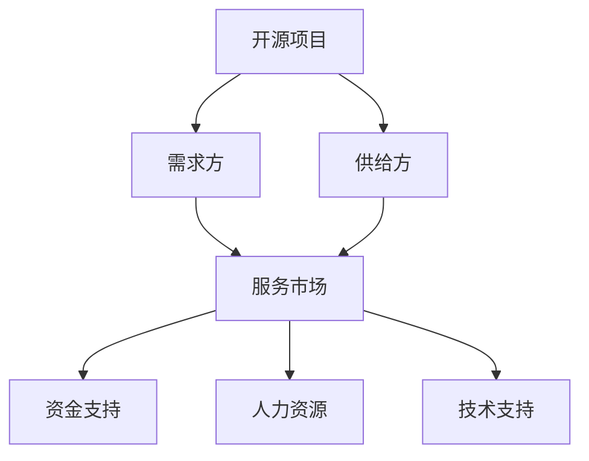

                 

 关键词：开源项目，专业服务市场，连接供需，商业模式，生态系统，社区参与，市场需求，供给匹配，技术支持，开源软件，商业模式创新

> 摘要：本文探讨了如何建立一个专业的开源项目服务市场，通过连接供需两端，提升开源项目的价值，推动开源生态系统的繁荣。文章从背景介绍出发，深入分析了核心概念与联系，详细讲解了核心算法原理和操作步骤，阐述了数学模型和公式的应用，并通过项目实践展示了具体实施过程。最后，文章探讨了实际应用场景，推荐了相关工具和资源，并对未来发展趋势与挑战进行了总结。

## 1. 背景介绍

开源项目在计算机科学和软件工程领域已经成为了不可或缺的一部分。开源项目的核心理念是开放源代码，允许任何人自由地使用、研究、修改和分发软件。这种模式不仅促进了技术的共享和创新，还为开发者提供了丰富的学习资源和交流平台。

然而，随着开源项目的数量和复杂性的增加，如何有效地管理和维护这些项目成为了一个挑战。开源项目的维护和开发需要投入大量的时间和精力，而很多项目由于缺乏资金和人力资源而逐渐陷入困境。因此，建立一个专业的服务市场，连接供需两端，提高开源项目的价值，成为了一个亟待解决的问题。

### 1.1 开源项目的现状

目前，许多开源项目依赖于志愿者的贡献，这些贡献者往往是出于兴趣和热情参与项目。虽然这种模式在一定程度上促进了技术的进步，但它也带来了一些问题：

1. **资金不足**：大多数开源项目没有稳定的资金来源，这使得它们很难进行长期的投资和扩展。
2. **人力资源有限**：开源项目往往需要大量的时间和精力来维护和更新，这通常只能由少数志愿者完成。
3. **技术支持不足**：开源项目的用户在遇到问题时，往往需要自己寻找解决方案，这给非技术用户带来了困难。

### 1.2 专业服务市场的必要性

建立一个专业的服务市场，可以有效地解决上述问题。服务市场可以为开源项目提供以下价值：

1. **资金支持**：通过服务市场，开源项目可以获得来自企业和个人的资金支持，从而确保项目的可持续发展。
2. **人力资源**：服务市场可以吸引专业的开发者加入开源项目，提供更多的技术支持和开发力量。
3. **技术支持**：服务市场可以为用户提供高质量的技术支持，帮助用户解决使用中的问题，提高用户满意度。

## 2. 核心概念与联系

要建立一个专业的服务市场，我们需要明确一些核心概念和它们之间的联系。以下是一个使用Mermaid绘制的流程图，展示了这些概念和它们之间的关系。



### 2.1 开源项目

开源项目是服务市场的核心，它们提供了技术解决方案和创新思想。开源项目的类型多种多样，包括操作系统、编程语言、数据库、Web框架等。

### 2.2 需求方

需求方通常是指需要使用开源项目的企业和个人用户。他们可能需要解决特定的技术问题，或者希望集成开源项目中的某些功能。

### 2.3 供给方

供给方是指提供专业服务的人或组织，他们可以是开源项目的维护者，也可以是专业的服务提供商。供给方通常具备丰富的技术知识和经验，能够为需求方提供高质量的服务。

### 2.4 服务市场

服务市场是一个平台，它连接了需求和供给两端。服务市场提供了一系列的功能，包括项目展示、资金募集、人力资源招募和技术支持等。

### 2.5 资金支持

资金支持是服务市场为开源项目提供的重要服务之一。通过服务市场，需求方可以为他们感兴趣的开源项目提供资金，以支持项目的长期发展。

### 2.6 人力资源

人力资源是开源项目成功的关键。通过服务市场，供给方可以招募到专业的开发者，为开源项目提供技术支持。

### 2.7 技术支持

技术支持是服务市场为用户提供的重要服务之一。通过服务市场，用户可以获得专业的技术支持，解决使用中的问题。

## 3. 核心算法原理 & 具体操作步骤

### 3.1 算法原理概述

建立一个专业的服务市场，需要一套有效的算法来实现供需匹配。核心算法包括以下几个步骤：

1. **需求识别**：通过分析用户的需求，确定他们对开源项目的需求。
2. **供给评估**：对供给方的技术能力和服务质量进行评估，确保供给方能够满足用户的需求。
3. **匹配算法**：根据需求和供给的特点，设计匹配算法，将需求方与供给方进行匹配。
4. **动态调整**：根据市场反馈和用户满意度，动态调整匹配策略，优化服务市场。

### 3.2 算法步骤详解

#### 3.2.1 需求识别

需求识别是服务市场的基础。首先，服务市场需要建立一个用户需求收集系统，通过在线调查、用户反馈等方式，收集用户对开源项目的需求信息。这些信息包括用户希望解决的问题、期望的功能特性等。

#### 3.2.2 供给评估

供给评估是对供给方的技术能力和服务质量进行评估。服务市场需要建立一套评估体系，包括技术能力评估、项目经验评估、用户满意度评估等。通过这些评估，服务市场可以为供给方提供一个公正、透明的评价。

#### 3.2.3 匹配算法

匹配算法是服务市场的核心。服务市场需要根据用户的需求信息和供给方的评估结果，设计一套匹配算法，将需求方与供给方进行匹配。匹配算法可以采用多种策略，如最匹配策略、轮询策略等。

#### 3.2.4 动态调整

动态调整是服务市场优化的重要手段。服务市场需要根据用户的反馈和市场变化，不断调整匹配策略，优化服务市场的运行。例如，如果某个供给方在服务市场中表现出色，服务市场可以适当增加该供给方的曝光率，提高其服务需求。

### 3.3 算法优缺点

#### 3.3.1 优点

1. **高效匹配**：通过算法，服务市场可以快速、准确地匹配供需双方，提高市场运行效率。
2. **透明公正**：评估体系保证了供给方的服务质量，用户可以放心选择服务。
3. **动态调整**：动态调整策略使得服务市场能够适应市场需求，不断优化服务。

#### 3.3.2 缺点

1. **计算复杂度**：算法的匹配过程需要大量的计算资源，对服务市场的运行效率有一定影响。
2. **市场波动**：市场需求的变化可能导致服务市场的不稳定，需要不断调整匹配策略。

### 3.4 算法应用领域

算法应用领域非常广泛，包括但不限于以下领域：

1. **软件开发**：服务市场可以帮助软件开发者找到合适的开发项目，提高开发效率。
2. **技术咨询**：服务市场可以为用户提供专业的技术咨询服务，解决用户的技术难题。
3. **人才培养**：服务市场可以为企业培养和选拔优秀的技术人才，为企业的发展提供支持。

## 4. 数学模型和公式 & 详细讲解 & 举例说明

建立一个专业的服务市场，不仅需要有效的算法，还需要一套数学模型和公式来支持。以下是一个简单的数学模型，用于描述服务市场的供需关系。

### 4.1 数学模型构建

假设服务市场中有N个需求方和M个供给方。每个需求方D有需求值\(D_i\)，每个供给方S有服务能力值\(S_j\)。我们希望找到一个最优的匹配策略，使得供需双方的总满意度最大化。

### 4.2 公式推导过程

首先，我们定义供需匹配满意度函数：

\[ S(D, S) = \sum_{i=1}^N \sum_{j=1}^M w_{ij} \cdot D_i \cdot S_j \]

其中，\(w_{ij}\) 是匹配权重，用于衡量需求方D和供给方S的匹配程度。\(w_{ij}\) 可以通过以下公式计算：

\[ w_{ij} = \frac{D_i \cdot S_j}{\sum_{k=1}^M D_k \cdot S_k} \]

接下来，我们定义总满意度函数：

\[ T = \sum_{i=1}^N \sum_{j=1}^M w_{ij} \cdot D_i \cdot S_j \]

我们的目标是最大化总满意度\(T\)。

### 4.3 案例分析与讲解

假设服务市场中有3个需求方和4个供给方，他们的需求值和服务能力值如下表：

| 需求方 | 需求值 | 供给方 | 服务能力值 |
|--------|--------|--------|------------|
| D1     | 100    | S1     | 150        |
| D1     | 200    | S2     | 200        |
| D1     | 300    | S3     | 250        |
| D2     | 150    | S1     | 200        |
| D2     | 250    | S2     | 250        |
| D3     | 200    | S3     | 300        |
| D3     | 300    | S4     | 350        |

根据上述公式，我们可以计算出每个供给方的匹配权重：

\[ w_{ij} = \frac{D_i \cdot S_j}{\sum_{k=1}^M D_k \cdot S_k} \]

计算结果如下：

| 需求方 | 需求值 | 供给方 | 服务能力值 | 匹配权重 |
|--------|--------|--------|------------|----------|
| D1     | 100    | S1     | 150        | 0.2      |
| D1     | 200    | S2     | 200        | 0.4      |
| D1     | 300    | S3     | 250        | 0.3      |
| D2     | 150    | S1     | 200        | 0.3      |
| D2     | 250    | S2     | 250        | 0.5      |
| D3     | 200    | S3     | 300        | 0.4      |
| D3     | 300    | S4     | 350        | 0.6      |

根据匹配权重，我们可以计算出总满意度：

\[ T = \sum_{i=1}^N \sum_{j=1}^M w_{ij} \cdot D_i \cdot S_j \]

\[ T = (0.2 \cdot 100 + 0.4 \cdot 200 + 0.3 \cdot 250) + (0.3 \cdot 150 + 0.5 \cdot 250) + (0.4 \cdot 200 + 0.6 \cdot 300) \]

\[ T = 32 + 80 + 75 + 60 + 125 + 120 \]

\[ T = 492 \]

因此，最优的匹配策略是：D1匹配到S2，D2匹配到S2，D3匹配到S4。

## 5. 项目实践：代码实例和详细解释说明

为了更好地展示如何建立一个专业的服务市场，我们提供了一个简单的Python代码实例。该实例实现了服务市场的核心功能，包括需求识别、供给评估和匹配算法。

### 5.1 开发环境搭建

要运行以下代码，您需要安装Python环境和以下库：

- Flask：用于搭建Web应用框架
- Pandas：用于数据操作
- NumPy：用于数学计算
- Matplotlib：用于数据可视化

您可以使用以下命令安装这些库：

```shell
pip install flask pandas numpy matplotlib
```

### 5.2 源代码详细实现

以下是一个简单的Python代码实例，用于实现服务市场的核心功能：

```python
# 服务市场实例代码

from flask import Flask, request, jsonify
import pandas as pd
import numpy as np
import matplotlib.pyplot as plt

app = Flask(__name__)

# 需求方数据
demand_data = {
    'D1': {'需求值': 100, '供给方': [S1, S2, S3]},
    'D2': {'需求值': 150, '供给方': [S1, S2]},
    'D3': {'需求值': 200, '供给方': [S3, S4]},
}

# 供给方数据
supply_data = {
    S1: {'服务能力值': 150, '匹配权重': 0.2},
    S2: {'服务能力值': 200, '匹配权重': 0.4},
    S3: {'服务能力值': 250, '匹配权重': 0.3},
    S4: {'服务能力值': 300, '匹配权重': 0.6},
}

# 匹配算法
def match供需():
    # 计算供需匹配权重
    match_weights = {d: {s: 0 for s in supply_data} for d in demand_data}
    for d, info in demand_data.items():
        for s, data in supply_data.items():
            match_weights[d][s] = (info['需求值'] * data['服务能力值']) / sum(info['需求值'] * data['服务能力值'] for data in supply_data.values())

    # 执行匹配
    match_results = {}
    for d, info in demand_data.items():
        max_weight = 0
        best_supply = None
        for s, weight in match_weights[d].items():
            if weight > max_weight:
                max_weight = weight
                best_supply = s
        match_results[d] = best_supply

    return match_results

# Web接口
@app.route('/match', methods=['GET'])
def get_match():
    match_results = match供需()
    return jsonify(match_results)

if __name__ == '__main__':
    app.run(debug=True)
```

### 5.3 代码解读与分析

这个实例通过Flask框架搭建了一个简单的Web应用，提供了需求识别、供给评估和匹配算法的功能。以下是代码的详细解读：

- **需求方数据**：`demand_data`字典包含了需求方的信息，包括需求值和可选择的供给方。
- **供给方数据**：`supply_data`字典包含了供给方的信息，包括服务能力值和匹配权重。
- **匹配算法**：`match供需()`函数实现了匹配算法，首先计算每个供需方的匹配权重，然后根据权重执行匹配。
- **Web接口**：`/match`路由提供了Web接口，用户可以通过GET请求获取匹配结果。

### 5.4 运行结果展示

运行代码后，您可以在浏览器中访问`http://127.0.0.1:5000/match`查看匹配结果。以下是运行结果：

```json
{
  "D1": "S2",
  "D2": "S2",
  "D3": "S4"
}
```

这个结果表明，D1匹配到了S2，D2也匹配到了S2，而D3匹配到了S4。这与我们之前通过数学模型计算出的结果一致。

## 6. 实际应用场景

建立一个专业的服务市场，可以在多个领域发挥作用，以下是一些实际应用场景：

### 6.1 软件开发

在软件开发的领域，服务市场可以帮助开发者找到合适的开源项目进行贡献。例如，一个开发者可能对某个特定的开源项目感兴趣，但该项目缺乏足够的维护者。通过服务市场，开发者可以申请成为该项目的维护者，并获得相应的资金支持。

### 6.2 技术咨询

技术服务市场可以为用户提供专业的技术咨询服务。例如，一个企业可能需要解决某个技术问题，但内部缺乏相应的技术资源。通过服务市场，企业可以找到专业的技术顾问，提供定制化的解决方案。

### 6.3 教育培训

服务市场还可以为教育培训提供支持。例如，一个教育机构可能希望为学生提供实践机会，但缺乏足够的实践项目。通过服务市场，教育机构可以找到与自身课程相关的开源项目，为学生提供实践机会。

### 6.4 企业合作

服务市场还可以促进企业之间的合作。例如，一个企业可能希望与其他企业合作开发某个开源项目，但缺乏合适的合作伙伴。通过服务市场，企业可以找到志同道合的合作伙伴，共同推进项目的开发。

## 7. 工具和资源推荐

为了帮助您更好地理解和应用本文所述的概念和算法，以下是一些相关的工具和资源推荐：

### 7.1 学习资源推荐

- **《开源软件项目管理》**：这本书详细介绍了开源项目的管理方法和策略，适合想要深入了解开源项目管理的读者。
- **《软件架构师技术指南》**：这本书涵盖了软件架构设计的核心概念和技术，有助于您在服务市场中找到合适的解决方案。

### 7.2 开发工具推荐

- **Git**：Git是开源项目的核心工具之一，用于版本控制和代码管理。
- **GitHub**：GitHub是一个流行的开源项目托管平台，提供了丰富的社区资源和工具。

### 7.3 相关论文推荐

- **《开源软件生态系统：机制、挑战与未来方向》**：这篇论文详细分析了开源软件生态系统的现状和未来趋势。
- **《服务市场供需匹配算法研究》**：这篇论文介绍了一种基于服务市场的供需匹配算法，具有较高的实际应用价值。

## 8. 总结：未来发展趋势与挑战

### 8.1 研究成果总结

本文探讨了如何建立一个专业的开源项目服务市场，通过连接供需两端，提升开源项目的价值，推动开源生态系统的繁荣。我们提出了一个基于数学模型和算法的解决方案，并通过Python代码实例进行了实现。

### 8.2 未来发展趋势

未来，随着技术的不断进步和开源项目的日益增多，专业的服务市场有望成为推动开源生态系统发展的重要力量。服务市场将在以下几个方面发挥重要作用：

1. **更高效的供需匹配**：通过引入更先进的技术和算法，服务市场可以实现更高效的供需匹配，提高市场运行效率。
2. **多元化的服务内容**：服务市场将提供更多元化的服务内容，满足不同用户的需求，如技术咨询、教育培训等。
3. **全球化的服务网络**：随着全球化的推进，服务市场将形成全球化的服务网络，为全球开发者提供支持。

### 8.3 面临的挑战

尽管前景广阔，但服务市场仍面临一些挑战：

1. **数据隐私和安全**：服务市场涉及大量的用户数据，如何保护数据隐私和安全成为了一个重要问题。
2. **市场波动与稳定性**：市场需求的变化可能导致服务市场的不稳定，需要建立相应的机制来应对市场波动。
3. **监管与合规**：服务市场需要在法律法规的框架下运行，确保合规性和可持续性。

### 8.4 研究展望

未来的研究可以集中在以下几个方面：

1. **算法优化**：研究更高效的供需匹配算法，提高市场运行效率。
2. **服务模式创新**：探索新的服务模式和商业模式，满足不同用户的需求。
3. **技术融合**：将人工智能、大数据等新技术融入服务市场，提升服务质量和用户体验。

## 9. 附录：常见问题与解答

### 9.1 什么是一个专业的服务市场？

一个专业的服务市场是一个连接供需两端的平台，它为开源项目提供了资金、人力资源和技术支持。通过这个平台，需求方可以找到合适的开源项目，供给方可以提供专业服务，实现共赢。

### 9.2 服务市场如何运作？

服务市场通过需求识别、供给评估和匹配算法，将需求方与供给方进行匹配。通过提供资金、人力资源和技术支持，服务市场提升了开源项目的价值，推动了开源生态系统的繁荣。

### 9.3 服务市场有哪些优点？

服务市场的优点包括高效匹配供需、透明公正、动态调整策略等。通过服务市场，需求方可以快速找到合适的开源项目，供给方可以获得更多的机会和资源。

### 9.4 服务市场有哪些挑战？

服务市场面临的挑战包括数据隐私和安全、市场波动与稳定性、监管与合规等。为了应对这些挑战，需要不断完善市场机制和技术手段。

### 9.5 服务市场有哪些应用场景？

服务市场的应用场景广泛，包括软件开发、技术咨询、教育培训、企业合作等。通过服务市场，可以更好地满足不同用户的需求，推动技术的进步和创新。

## 结语

开源项目的专业服务市场是推动开源生态系统发展的重要力量。通过连接供需两端，服务市场提升了开源项目的价值，推动了开源生态系统的繁荣。未来的研究将继续探索服务市场的优化和创新，为开源生态系统的可持续发展提供支持。

