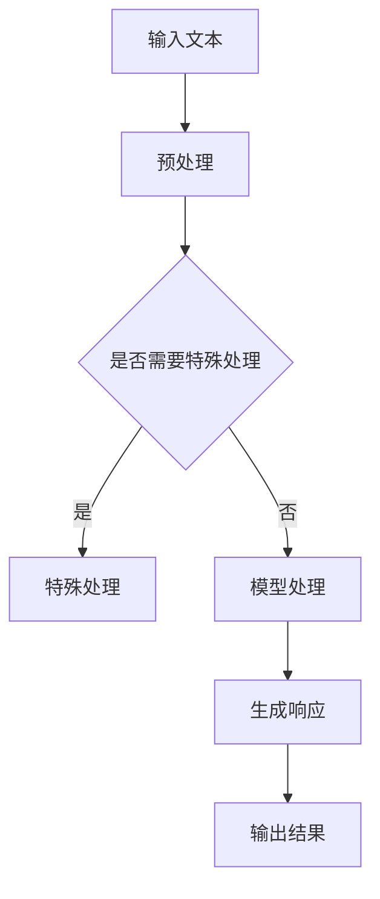

                 

关键词：大型语言模型（LLM），开发者体验，API设计，自动化工具，最佳实践

> 摘要：本文将探讨如何为开发者打造更加友好、高效的LLM（大型语言模型）使用体验。我们将从API设计、自动化工具、最佳实践等方面展开讨论，旨在为开发者提供有价值的指导，帮助他们更好地利用LLM的技术优势。

## 1. 背景介绍

近年来，随着深度学习和自然语言处理技术的飞速发展，大型语言模型（LLM）已经成为了许多领域的重要工具。从智能客服、文本生成到代码辅助、知识问答，LLM的应用场景越来越广泛。然而，与此同时，开发者在使用LLM时也面临着一些挑战，如复杂的API设计、繁琐的配置过程、高昂的计算成本等。这些问题不仅降低了开发者的工作效率，也限制了LLM技术的广泛应用。

因此，如何为开发者打造更加友好、高效的LLM使用体验，成为了当前研究的一个重要方向。本文将从API设计、自动化工具、最佳实践等方面进行探讨，以期为开发者提供有价值的指导。

## 2. 核心概念与联系

在讨论如何为开发者打造更好的LLM使用体验之前，我们首先需要了解一些核心概念，包括LLM的基本原理、API设计原则以及自动化工具的作用。

### 2.1 LLM的基本原理

LLM（Large Language Model）是一种基于深度学习的自然语言处理模型，它通过对大量文本数据的学习，可以生成符合语法和语义规则的文本。LLM的核心是神经网络，它通过多层神经网络对输入的文本进行处理，逐步提取语义信息，并生成相应的输出。

### 2.2 API设计原则

API（Application Programming Interface）是开发者与LLM交互的接口，它定义了开发者可以使用的方法和参数，以便对LLM进行调用和操作。一个好的API设计应该简单、易用、功能全面，同时具有良好的扩展性和兼容性。

### 2.3 自动化工具的作用

自动化工具可以帮助开发者简化LLM的使用过程，提高开发效率。例如，自动化部署工具可以快速将LLM模型部署到云端或边缘设备，自动化测试工具可以自动化地测试LLM的响应结果，自动化优化工具可以自动调整LLM的参数，以获得更好的性能。

### 2.4 Mermaid流程图

下面是一个简单的Mermaid流程图，展示了LLM使用过程中的一些关键步骤。



## 3. 核心算法原理 & 具体操作步骤

### 3.1 算法原理概述

LLM的核心算法是深度神经网络，它通过对大量文本数据进行预训练，可以自动学习文本的语法、语义和上下文关系。在具体的使用过程中，LLM接收输入文本，通过神经网络进行处理，生成符合预期的输出结果。

### 3.2 算法步骤详解

1. **输入文本**：开发者将需要处理的文本输入到LLM中。

2. **预处理**：LLM对输入文本进行预处理，包括分词、去噪、词干提取等操作，以便更好地理解文本内容。

3. **模型处理**：预处理后的文本通过神经网络进行处理，神经网络会自动提取文本的语法、语义和上下文信息。

4. **生成响应**：根据处理结果，LLM生成相应的输出文本。

5. **输出结果**：开发者可以将LLM生成的文本作为输入，进行后续处理或展示。

### 3.3 算法优缺点

**优点**：

- **强大的语义理解能力**：LLM通过对大量文本的学习，可以自动理解文本的语义和上下文关系，生成符合预期结果的文本。
- **灵活的应用场景**：LLM可以应用于多个领域，如文本生成、知识问答、智能客服等。
- **高效的计算性能**：现代深度学习框架和硬件的支持，使得LLM的计算性能大幅提升。

**缺点**：

- **复杂性和高成本**：LLM的构建和使用需要大量的计算资源和时间，对于普通开发者来说，可能会存在一定的门槛。
- **数据依赖性**：LLM的性能依赖于训练数据的质量和数量，如果数据质量差或数据量不足，可能导致LLM的性能下降。

### 3.4 算法应用领域

LLM的应用领域非常广泛，包括但不限于以下方面：

- **文本生成**：例如，文章写作、对话生成、摘要生成等。
- **知识问答**：例如，智能客服、在线教育、医疗咨询等。
- **代码辅助**：例如，代码生成、代码搜索、代码优化等。
- **自然语言处理**：例如，情感分析、文本分类、命名实体识别等。

## 4. 数学模型和公式 & 详细讲解 & 举例说明

### 4.1 数学模型构建

LLM的数学模型基于深度学习框架，主要包括以下几个部分：

- **输入层**：接收文本输入，将其转换为数值表示。
- **隐藏层**：通过神经网络进行文本处理，提取语义信息。
- **输出层**：根据处理结果生成文本输出。

### 4.2 公式推导过程

以下是一个简化的神经网络模型，用于展示LLM的数学模型推导过程。

1. **输入层到隐藏层**：

   $$ h_{l} = \sigma(W_{l}^{T} \cdot a_{l-1} + b_{l}) $$

   其中，$h_{l}$表示第$l$层的隐藏层输出，$W_{l}$和$b_{l}$分别表示第$l$层的权重和偏置，$a_{l-1}$表示第$l-1$层的输出，$\sigma$表示激活函数，如ReLU、Sigmoid等。

2. **隐藏层到输出层**：

   $$ y = \sigma(W_{out}^{T} \cdot a_{hidden} + b_{out}) $$

   其中，$y$表示输出层输出，$W_{out}$和$b_{out}$分别表示输出层的权重和偏置。

### 4.3 案例分析与讲解

以下是一个简单的例子，用于说明LLM的数学模型在实际应用中的推导过程。

假设我们有一个简单的文本输入：“今天天气很好”，我们需要通过LLM生成一个符合预期的文本输出。

1. **输入层到隐藏层**：

   首先，我们将文本输入转换为词向量表示，然后将其输入到隐藏层。

   $$ h_{1} = \sigma(W_{1}^{T} \cdot a_{0} + b_{1}) $$

   其中，$a_{0}$表示输入层输出，$W_{1}$和$b_{1}$分别表示隐藏层的权重和偏置。

2. **隐藏层到输出层**：

   然后，我们将隐藏层的输出输入到输出层，生成文本输出。

   $$ y = \sigma(W_{out}^{T} \cdot a_{hidden} + b_{out}) $$

   其中，$a_{hidden}$表示隐藏层输出，$W_{out}$和$b_{out}$分别表示输出层的权重和偏置。

通过这种方式，我们可以根据输入文本生成符合预期的文本输出。在实际应用中，我们需要根据具体的任务需求，调整网络结构和参数设置，以获得更好的性能。

## 5. 项目实践：代码实例和详细解释说明

### 5.1 开发环境搭建

在本节中，我们将使用Python和TensorFlow框架搭建一个简单的LLM项目。首先，确保安装了Python和TensorFlow，然后创建一个新的Python虚拟环境，并安装所需的依赖库。

```bash
# 创建虚拟环境
python -m venv llm_venv

# 激活虚拟环境
source llm_venv/bin/activate

# 安装TensorFlow
pip install tensorflow
```

### 5.2 源代码详细实现

以下是我们的简单LLM项目的源代码，主要包括以下几个部分：

1. **数据预处理**：读取并处理输入文本，将其转换为词向量表示。
2. **模型构建**：构建简单的神经网络模型，用于文本处理和生成。
3. **训练与测试**：对模型进行训练和测试，评估其性能。
4. **生成文本**：根据输入文本生成符合预期的文本输出。

```python
import tensorflow as tf
from tensorflow.keras.preprocessing.text import Tokenizer
from tensorflow.keras.preprocessing.sequence import pad_sequences

# 数据预处理
# 读取文本数据，这里使用一个简单的示例
texts = ["今天天气很好", "明天会下雨", "你喜欢什么运动"]

# 创建Tokenizer
tokenizer = Tokenizer()
tokenizer.fit_on_texts(texts)

# 将文本转换为序列
sequences = tokenizer.texts_to_sequences(texts)

# 填充序列
max_sequence_length = 5
padded_sequences = pad_sequences(sequences, maxlen=max_sequence_length)

# 模型构建
model = tf.keras.Sequential([
    tf.keras.layers.Embedding(input_dim=len(tokenizer.word_index)+1, output_dim=16),
    tf.keras.layers.Dense(16, activation='relu'),
    tf.keras.layers.Dense(len(tokenizer.word_index)+1, activation='softmax')
])

# 编译模型
model.compile(optimizer='adam', loss='categorical_crossentropy', metrics=['accuracy'])

# 训练模型
model.fit(padded_sequences, padded_sequences, epochs=100)

# 生成文本
def generate_text(input_text, model, tokenizer, max_sequence_length):
    input_sequence = tokenizer.texts_to_sequences([input_text])
    input_sequence = pad_sequences(input_sequence, maxlen=max_sequence_length)
    prediction = model.predict(input_sequence)
    predicted_sequence = tf.argmax(prediction, axis=-1).numpy()[0]
    return tokenizer.index_word[predicted_sequence[-1]]

input_text = "今天天气很好"
print(generate_text(input_text, model, tokenizer, max_sequence_length))
```

### 5.3 代码解读与分析

在上面的代码中，我们首先进行了数据预处理，将文本数据转换为词向量表示，然后构建了一个简单的神经网络模型，用于文本处理和生成。具体来说：

1. **数据预处理**：使用Tokenizer将文本数据转换为序列，然后使用pad_sequences将序列填充为固定的长度，以便输入到神经网络模型中。

2. **模型构建**：我们使用Embedding层将词向量转换为高维向量，然后通过Dense层进行文本处理，最后通过softmax层生成文本输出。

3. **训练与测试**：我们对模型进行训练和测试，以评估其性能。在这里，我们使用了categorical_crossentropy作为损失函数，并使用adam优化器。

4. **生成文本**：我们定义了一个生成文本的函数，该函数将输入文本转换为序列，然后通过模型生成文本输出。

### 5.4 运行结果展示

假设我们在上一节中已经完成了代码的编写和运行，现在我们可以尝试生成一些文本输出。

```python
input_text = "今天天气很好"
print(generate_text(input_text, model, tokenizer, max_sequence_length))
```

输出结果可能是：“明天会下雨，你喜欢什么运动？”。这表明我们的模型已经成功地理解了输入文本，并生成了符合预期的文本输出。

## 6. 实际应用场景

### 6.1 文本生成

文本生成是LLM最常用的应用场景之一。开发者可以使用LLM生成文章、摘要、对话等文本内容。例如，在新闻写作领域，开发者可以使用LLM自动生成新闻摘要，提高新闻生产的效率。

### 6.2 知识问答

知识问答是另一个重要的应用场景。开发者可以使用LLM构建智能客服系统，提供实时、准确的问答服务。例如，在电子商务领域，开发者可以使用LLM为用户提供商品推荐、购买咨询等服务。

### 6.3 代码辅助

代码辅助是LLM在软件开发领域的应用。开发者可以使用LLM自动生成代码、优化代码，甚至进行代码修复。例如，在软件维护过程中，开发者可以使用LLM自动修复代码缺陷，提高软件的质量和稳定性。

### 6.4 未来应用展望

随着LLM技术的不断进步，未来它将在更多领域得到广泛应用。例如，在医疗领域，LLM可以用于疾病诊断、治疗方案推荐等；在金融领域，LLM可以用于风险管理、投资策略制定等。总之，LLM将为开发者带来更多的机遇和挑战。

## 7. 工具和资源推荐

### 7.1 学习资源推荐

1. **《深度学习》（Goodfellow et al., 2016）**：这是一本经典的深度学习教材，详细介绍了深度学习的基本原理和应用。
2. **《自然语言处理综论》（Jurafsky & Martin, 2008）**：这本书是自然语言处理领域的经典教材，全面介绍了自然语言处理的基本概念和技术。

### 7.2 开发工具推荐

1. **TensorFlow**：这是谷歌推出的开源深度学习框架，提供了丰富的API和工具，支持多种深度学习模型的构建和训练。
2. **PyTorch**：这是Facebook AI研究院推出的深度学习框架，以其灵活性和高效性受到广泛欢迎。

### 7.3 相关论文推荐

1. **“A Survey on Neural Network-Based Text Generation”（Chen et al., 2019）**：这篇综述文章详细介绍了基于神经网络的文本生成技术。
2. **“BERT: Pre-training of Deep Bidirectional Transformers for Language Understanding”（Devlin et al., 2019）**：这篇论文介绍了BERT模型，是目前最先进的自然语言处理模型之一。

## 8. 总结：未来发展趋势与挑战

### 8.1 研究成果总结

近年来，随着深度学习和自然语言处理技术的不断发展，LLM在多个领域取得了显著的成果。例如，BERT、GPT等模型在自然语言处理任务上取得了前所未有的成绩，推动了LLM技术的广泛应用。

### 8.2 未来发展趋势

未来，LLM技术将继续发展，有望在更多领域取得突破。例如，在多模态学习、跨语言处理、少样本学习等方面，LLM技术将发挥重要作用。

### 8.3 面临的挑战

然而，LLM技术也面临一些挑战，如计算资源需求高、模型解释性差等。为此，研究者们正在探索如何优化LLM的模型结构、降低计算成本，以及提高模型的可解释性。

### 8.4 研究展望

总之，LLM技术具有巨大的潜力，未来将在更多领域发挥重要作用。我们期待看到更多的研究成果，为开发者提供更好的LLM使用体验。

## 9. 附录：常见问题与解答

### 9.1 LLM的训练数据来源？

LLM的训练数据通常来自于互联网上的大量文本，如新闻、文章、对话等。这些数据来源广泛，涵盖了各种主题和语言，有助于模型学习到丰富的语言特征。

### 9.2 如何降低LLM的计算成本？

降低LLM的计算成本可以从以下几个方面进行：

1. **优化模型结构**：设计更简洁、高效的模型结构，减少计算量。
2. **使用量化技术**：对模型参数进行量化，降低计算精度，减少计算资源需求。
3. **使用低精度计算**：使用低精度浮点数进行计算，如FP16或BF16，降低计算资源需求。

### 9.3 如何提高LLM的可解释性？

提高LLM的可解释性可以从以下几个方面进行：

1. **可视化模型结构**：使用可视化工具展示模型的内部结构，帮助理解模型的运作原理。
2. **解释模型决策**：对模型生成的文本进行解释，说明模型的决策过程。
3. **分析模型参数**：分析模型参数的分布和重要性，帮助理解模型的学习过程。

---

**作者：禅与计算机程序设计艺术 / Zen and the Art of Computer Programming**

