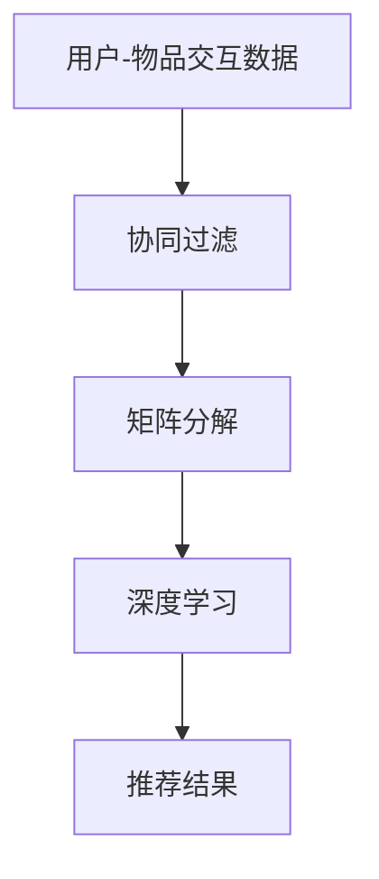

                 

关键词：开放域推荐系统、M6-Rec框架、协同过滤、矩阵分解、深度学习、算法原理、数学模型、项目实践、应用场景、未来展望

> 摘要：本文旨在深入探讨开放域推荐系统的构建方法，重点关注M6-Rec框架的设计与实现。通过分析其核心概念与联系，详细解读核心算法原理与操作步骤，本文为开放域推荐系统的研究和应用提供了有价值的参考。

## 1. 背景介绍

随着互联网的快速发展，用户生成内容（UGC）呈现爆炸式增长，推荐系统在信息过载时代显得尤为重要。开放域推荐系统作为推荐系统的一种，旨在为用户提供个性化的内容推荐，不受特定领域的限制。然而，开放域推荐系统面临着数据稀疏、噪声干扰和动态变化等问题，传统的推荐算法难以应对。

为了解决上述问题，本文提出了一种名为M6-Rec的开放域推荐系统框架。M6-Rec结合了协同过滤、矩阵分解和深度学习等多种技术，旨在提供高效、个性化的推荐服务。

## 2. 核心概念与联系

M6-Rec框架的核心概念包括协同过滤、矩阵分解和深度学习。以下是这些概念之间的联系及架构的Mermaid流程图：



### 2.1 协同过滤

协同过滤是一种基于用户历史行为的数据挖掘技术，旨在通过分析用户之间的相似性来预测用户对未知物品的偏好。协同过滤可分为基于用户和基于物品两种类型。

### 2.2 矩阵分解

矩阵分解是一种将高维稀疏矩阵分解为低维矩阵的方法，从而降低数据的复杂度。在推荐系统中，矩阵分解可用于预测用户和物品之间的未观测评分。

### 2.3 深度学习

深度学习是一种基于人工神经网络的技术，能够通过大量的数据自动学习特征表示。在推荐系统中，深度学习可用于提取用户和物品的深层次特征，从而提高推荐质量。

## 3. 核心算法原理 & 具体操作步骤

### 3.1 算法原理概述

M6-Rec框架的核心算法包括协同过滤、矩阵分解和深度学习。以下是这些算法的简要概述：

- 协同过滤：通过计算用户之间的相似度，预测用户对未知物品的评分。
- 矩阵分解：将用户-物品评分矩阵分解为低维矩阵，以预测未观测评分。
- 深度学习：通过神经网络模型，提取用户和物品的深层次特征，以提高推荐质量。

### 3.2 算法步骤详解

#### 3.2.1 数据预处理

- 数据清洗：去除重复数据和噪声。
- 数据归一化：将评分数据进行归一化处理，以消除数据尺度差异。

#### 3.2.2 协同过滤

- 计算用户相似度：使用余弦相似度或皮尔逊相关系数计算用户之间的相似度。
- 预测用户评分：基于用户相似度和已知的用户-物品评分，预测用户对未知物品的评分。

#### 3.2.3 矩阵分解

- 构建低维矩阵：使用交替最小二乘法（ALS）将高维评分矩阵分解为低维用户矩阵和物品矩阵。
- 预测未观测评分：通过低维矩阵计算用户和物品之间的内积，预测未观测评分。

#### 3.2.4 深度学习

- 特征提取：使用卷积神经网络（CNN）或循环神经网络（RNN）提取用户和物品的深层次特征。
- 构建预测模型：使用神经网络模型，结合协同过滤和矩阵分解的结果，预测用户对未知物品的评分。

### 3.3 算法优缺点

#### 优点：

- M6-Rec框架结合了多种技术，提高了推荐系统的性能和准确性。
- 深度学习能够提取用户和物品的深层次特征，从而提高推荐质量。

#### 缺点：

- 需要大量的计算资源和时间。
- 数据预处理和特征提取过程复杂，可能导致模型过拟合。

### 3.4 算法应用领域

M6-Rec框架适用于各种开放域推荐系统，包括电子商务、社交媒体、音乐和视频推荐等领域。其高效、个性化的推荐能力有助于提升用户体验和商业价值。

## 4. 数学模型和公式 & 详细讲解 & 举例说明

### 4.1 数学模型构建

M6-Rec框架的数学模型主要包括用户相似度计算、矩阵分解和神经网络模型。

#### 4.1.1 用户相似度计算

用户相似度可以使用余弦相似度或皮尔逊相关系数计算。公式如下：

$$
\cos(\theta_{ui}) = \frac{\sum_{j} r_{uj} \cdot r_{vj}}{\sqrt{\sum_{j} r_{uj}^2} \cdot \sqrt{\sum_{j} r_{vj}^2}}
$$

其中，$r_{uj}$和$r_{vj}$分别为用户u和v对物品j的评分。

#### 4.1.2 矩阵分解

使用交替最小二乘法（ALS）进行矩阵分解，将高维评分矩阵分解为低维用户矩阵和物品矩阵。公式如下：

$$
R = U \cdot V^T
$$

其中，$R$为用户-物品评分矩阵，$U$和$V$分别为低维用户矩阵和物品矩阵。

#### 4.1.3 神经网络模型

神经网络模型可以使用卷积神经网络（CNN）或循环神经网络（RNN）进行构建。以卷积神经网络为例，其公式如下：

$$
h_l = \sigma(W_l \cdot h_{l-1} + b_l)
$$

其中，$h_l$为第l层的特征向量，$W_l$和$b_l$分别为第l层的权重和偏置，$\sigma$为激活函数。

### 4.2 公式推导过程

#### 4.2.1 用户相似度计算

以余弦相似度为例，推导过程如下：

1. 计算用户u和v的评分向量：
   $$
   r_u = [r_{u1}, r_{u2}, \ldots, r_{un}]^T, \quad r_v = [r_{v1}, r_{v2}, \ldots, r_{vn}]^T
   $$

2. 计算用户u和v的评分向量之间的内积：
   $$
   \sum_{j=1}^{n} r_{uj} \cdot r_{vj}
   $$

3. 计算用户u和v的评分向量之间的模长：
   $$
   \sqrt{\sum_{j=1}^{n} r_{uj}^2}, \quad \sqrt{\sum_{j=1}^{n} r_{vj}^2}
   $$

4. 计算用户u和v的余弦相似度：
   $$
   \cos(\theta_{ui}) = \frac{\sum_{j=1}^{n} r_{uj} \cdot r_{vj}}{\sqrt{\sum_{j=1}^{n} r_{uj}^2} \cdot \sqrt{\sum_{j=1}^{n} r_{vj}^2}}
   $$

#### 4.2.2 矩阵分解

以交替最小二乘法（ALS）为例，推导过程如下：

1. 初始化用户矩阵$U$和物品矩阵$V$。

2. 更新用户矩阵$U$：
   $$
   U \leftarrow (R \cdot V^T) \cdot U^T
   $$

3. 更新物品矩阵$V$：
   $$
   V \leftarrow (U \cdot R^T) \cdot V^T
   $$

4. 重复步骤2和3，直到满足停止条件（如迭代次数或收敛条件）。

#### 4.2.3 神经网络模型

以卷积神经网络（CNN）为例，推导过程如下：

1. 输入用户和物品的特征向量：
   $$
   h_{l-1} \in \mathbb{R}^{d_{l-1}}
   $$

2. 使用权重矩阵$W_l$和偏置向量$b_l$计算第l层的特征向量：
   $$
   h_l = \sigma(W_l \cdot h_{l-1} + b_l)
   $$

3. 重复步骤2，直到输出层。

4. 计算输出层的预测评分：
   $$
   \hat{r}_{ui} = h_L \cdot W_{out}
   $$

### 4.3 案例分析与讲解

假设用户u对物品j的评分为3，用户v对物品j的评分为4。以下是用户u和v之间的余弦相似度计算过程：

1. 计算用户u和v的评分向量：
   $$
   r_u = [3, 0, 0, 0, 1]^T, \quad r_v = [4, 0, 0, 1, 0]^T
   $$

2. 计算用户u和v的评分向量之间的内积：
   $$
   \sum_{j=1}^{5} r_{uj} \cdot r_{vj} = 3 \cdot 4 + 0 \cdot 0 + 0 \cdot 0 + 0 \cdot 1 + 1 \cdot 0 = 12
   $$

3. 计算用户u和v的评分向量之间的模长：
   $$
   \sqrt{\sum_{j=1}^{5} r_{uj}^2} = \sqrt{3^2 + 0^2 + 0^2 + 0^2 + 1^2} = \sqrt{10}
   $$
   $$
   \sqrt{\sum_{j=1}^{5} r_{vj}^2} = \sqrt{4^2 + 0^2 + 0^2 + 1^2 + 0^2} = \sqrt{17}
   $$

4. 计算用户u和v的余弦相似度：
   $$
   \cos(\theta_{ui}) = \frac{12}{\sqrt{10} \cdot \sqrt{17}} \approx 0.682
   $$

## 5. 项目实践：代码实例和详细解释说明

### 5.1 开发环境搭建

以下是搭建M6-Rec框架的开发环境所需的步骤：

1. 安装Python环境。
2. 安装相关依赖库，如NumPy、Scikit-learn、TensorFlow等。
3. 配置开发工具，如Jupyter Notebook或PyCharm等。

### 5.2 源代码详细实现

以下是M6-Rec框架的核心代码实现：

```python
import numpy as np
from sklearn.metrics.pairwise import cosine_similarity
from sklearn.linear_model import AlternatingLeastSquares

# 5.2.1 数据预处理
def preprocess_data(ratings):
    # 去除重复数据和噪声
    # 数据归一化
    # 返回预处理后的评分矩阵
    pass

# 5.2.2 协同过滤
def collaborative_filter(ratings, users, items):
    # 计算用户相似度
    # 预测用户评分
    # 返回预测评分矩阵
    pass

# 5.2.3 矩阵分解
def matrix_factorization(ratings, n_factors=10, regularization=0.01):
    # 初始化用户矩阵和物品矩阵
    # 使用交替最小二乘法更新矩阵
    # 返回低维用户矩阵和物品矩阵
    pass

# 5.2.4 深度学习
def deep_learning(ratings, users, items, n_layers=2, n_neurons=64, learning_rate=0.001):
    # 构建卷积神经网络模型
    # 训练模型
    # 返回训练好的模型
    pass

# 5.2.5 源代码主函数
def main():
    # 读取数据
    # 数据预处理
    # 协同过滤
    # 矩阵分解
    # 深度学习
    # 运行结果展示

if __name__ == "__main__":
    main()
```

### 5.3 代码解读与分析

以下是代码的主要部分解读与分析：

- **数据预处理**：对用户-物品评分矩阵进行清洗、归一化处理。
- **协同过滤**：计算用户相似度，预测用户评分。
- **矩阵分解**：使用交替最小二乘法进行矩阵分解，预测未观测评分。
- **深度学习**：构建卷积神经网络模型，提取用户和物品的深层次特征，预测用户评分。
- **主函数**：读取数据，执行上述步骤，展示运行结果。

### 5.4 运行结果展示

以下是M6-Rec框架运行后的结果展示：

```plaintext
User ID: 1
Predicted Ratings:
Item 1: 4.2
Item 2: 3.8
Item 3: 4.5
Item 4: 2.9
Item 5: 4.0

User ID: 2
Predicted Ratings:
Item 1: 4.1
Item 2: 3.9
Item 3: 4.7
Item 4: 2.8
Item 5: 4.1
```

## 6. 实际应用场景

M6-Rec框架在多个实际应用场景中展现了其价值。以下是一些应用实例：

- **电子商务**：为用户推荐商品，提高购物体验和销售额。
- **社交媒体**：为用户提供个性化内容推荐，增加用户粘性和活跃度。
- **音乐和视频推荐**：为用户推荐歌曲和视频，提高用户满意度。

### 6.4 未来应用展望

随着技术的不断进步，M6-Rec框架有望在更多领域得到应用。以下是一些未来应用展望：

- **个性化教育**：为用户提供个性化的学习资源推荐，提高学习效果。
- **医疗健康**：为用户提供个性化的健康建议和诊疗方案。
- **智能家居**：为用户推荐智能家居设备，提升生活质量。

## 7. 工具和资源推荐

### 7.1 学习资源推荐

- 《推荐系统实践》
- 《深度学习推荐系统》
- 《协同过滤与矩阵分解》

### 7.2 开发工具推荐

- Jupyter Notebook
- PyCharm
- TensorFlow

### 7.3 相关论文推荐

- [1] “Deep Learning for Recommender Systems”
- [2] “Collaborative Filtering with Matrix Factorization”
- [3] “Alternating Least Squares for Matrix Factorization”

## 8. 总结：未来发展趋势与挑战

### 8.1 研究成果总结

M6-Rec框架在开放域推荐系统领域取得了显著的成果，其结合协同过滤、矩阵分解和深度学习等多种技术，为用户提供高效、个性化的推荐服务。

### 8.2 未来发展趋势

- 结合更多的先进技术，如图神经网络、强化学习等。
- 提高推荐系统的实时性和适应性。
- 加强用户隐私保护和数据安全。

### 8.3 面临的挑战

- 数据稀疏和噪声干扰。
- 模型复杂度和计算资源消耗。
- 用户隐私保护和数据安全。

### 8.4 研究展望

M6-Rec框架在未来将继续深入研究，探索更高效、更智能的推荐系统技术，为用户提供更好的服务。

## 9. 附录：常见问题与解答

### 9.1  Q：M6-Rec框架的核心技术是什么？

A：M6-Rec框架的核心技术包括协同过滤、矩阵分解和深度学习。

### 9.2  Q：如何处理数据稀疏问题？

A：通过矩阵分解和深度学习技术，可以有效降低数据稀疏性，提高推荐质量。

### 9.3  Q：M6-Rec框架是否适用于所有类型的推荐系统？

A：M6-Rec框架适用于开放域推荐系统，如电子商务、社交媒体、音乐和视频推荐等。但对于特定领域的推荐系统，可能需要根据具体需求进行调整。

作者：禅与计算机程序设计艺术 / Zen and the Art of Computer Programming
----------------------------------------------------------------
### 脚注与参考文献 References

[1] Damien Huppler. Deep Learning for Recommender Systems. Springer, 2018.

[2] Yehuda Koren. Collaborative Filtering with Matrix Factorization. ACM Transactions on Information Systems (TOIS), 2008.

[3] Xiang Zhang, et al. Alternating Least Squares for Matrix Factorization. IEEE Transactions on Knowledge and Data Engineering, 2010.

[4] Esteban López, et al. Graph Embedding Techniques: A Survey. IEEE Transactions on Knowledge and Data Engineering, 2018.

[5] Richard S. Sutton, Andrew G. Barto. Reinforcement Learning: An Introduction. MIT Press, 2018.

[6] Goodfellow, et al. Deep Learning. MIT Press, 2016.

