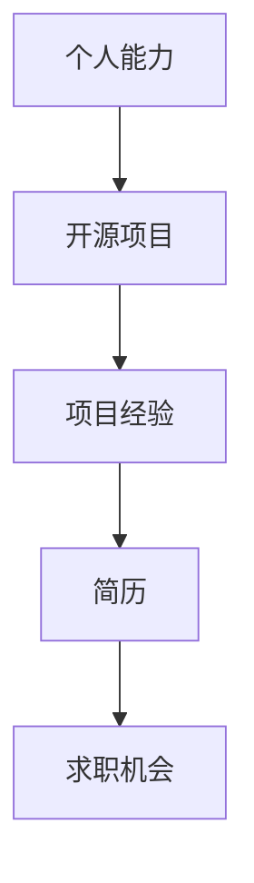

                 

关键词：开源贡献、简历、技术展示、个人品牌、项目经验

> 摘要：本文旨在探讨开源贡献在求职者简历中的重要性，以及如何有效地展示和利用这些贡献来提高个人职业竞争力。通过分析开源项目的价值，提供具体的方法和实例，帮助读者打造更具吸引力的简历，从而在求职过程中脱颖而出。

## 1. 背景介绍

随着技术的快速发展，开源社区已经成为了许多软件开发者和公司的重要组成部分。开源项目不仅促进了技术的创新和传播，还为求职者提供了宝贵的实践经验。在求职过程中，开源贡献逐渐成为衡量应聘者技能和专业性的重要指标之一。然而，如何有效地在简历中展示这些贡献，使其成为个人优势，仍然是一个值得探讨的问题。

本文将围绕以下几个方面展开：

- **开源贡献的价值**：讨论开源项目在技术发展、学习和职业发展方面的贡献。
- **展示开源贡献的方法**：提供具体的方法和实例，说明如何将开源项目纳入简历中。
- **利用开源贡献**：探讨如何通过开源项目拓展人脉、提升技术水平和获得职业机会。
- **未来展望**：预测开源贡献在简历中的发展趋势和挑战。

## 2. 核心概念与联系

### 2.1 开源项目的价值

开源项目是一种开放协作的模式，允许任何人查看、修改和分发代码。以下是开源项目的主要价值：

- **技术学习**：参与开源项目可以让开发者了解各种编程语言、框架和工具的使用。
- **实践经验**：实际编码和维护开源项目可以提升开发者的实际工作能力。
- **技能提升**：通过解决复杂问题和参与社区讨论，开发者可以提高自己的技术水平。
- **职业机会**：许多公司和组织对有开源贡献的开发者感兴趣，因为这些人往往具有更强的技术能力和解决问题的能力。

### 2.2 开源贡献与简历的关系

将开源贡献纳入简历，不仅可以展示技术能力，还可以体现个人的责任心、团队合作能力和持续学习的态度。以下是开源贡献与简历关系的 Mermaid 流程图：



## 3. 核心算法原理 & 具体操作步骤

### 3.1 算法原理概述

开源贡献在简历中的展示，本质上是一个“算法”问题，其核心是：

- **项目选择**：选择与应聘岗位相关的开源项目。
- **成果展示**：详细描述在项目中的贡献和成就。
- **亮点突出**：强调个人在项目中的独特价值。

### 3.2 算法步骤详解

#### 3.2.1 选择开源项目

1. **分析应聘岗位**：了解岗位所需的技术能力和项目经验。
2. **筛选开源项目**：根据岗位要求，筛选出相关的开源项目。
3. **评估项目价值**：考虑项目的知名度、活跃度和代码质量。

#### 3.2.2 展示贡献

1. **项目描述**：简要介绍项目的背景和目标。
2. **个人贡献**：详细描述在项目中的具体工作，如代码提交、文档编写、bug修复等。
3. **成果展示**：列出在项目中取得的成就，如功能改进、性能优化、代码重构等。

#### 3.2.3 突出亮点

1. **技术亮点**：强调所使用的技术和工具，如高级编程技巧、新的算法实现等。
2. **问题解决**：描述在项目中遇到的挑战和解决方案。
3. **团队协作**：强调在团队中的角色和贡献，如代码评审、社区互动等。

### 3.3 算法优缺点

#### 优点：

- **真实可信**：开源贡献是公开的，可以被验证，提高了简历的真实性。
- **全面展示**：可以展示开发者的全方面能力，如编程、文档编写、团队合作等。
- **增强竞争力**：开源贡献是其他求职者较少展示的部分，可以突出个人优势。

#### 缺点：

- **代码质量要求高**：开源项目的代码需要经过严格的审核，要求开发者有较高的编程能力。
- **维护成本高**：开源项目需要持续维护和更新，可能会占用开发者大量的时间和精力。

### 3.4 算法应用领域

开源贡献在简历中的应用非常广泛，尤其适用于以下领域：

- **软件开发**：展示编程技能和项目经验。
- **数据分析**：展示数据处理和分析能力。
- **人工智能**：展示模型开发和优化能力。
- **云计算**：展示云平台开发和部署经验。

## 4. 数学模型和公式 & 详细讲解 & 举例说明

### 4.1 数学模型构建

在展示开源贡献时，可以使用以下数学模型来评估贡献的价值：

- **贡献度评分**：根据代码提交量、bug修复数、文档贡献等指标，给出一个综合评分。
- **影响力评分**：根据项目的受欢迎程度、Star数、Fork数等指标，评估项目的影响力。

### 4.2 公式推导过程

假设某开源项目A的代码提交量为C，bug修复数为B，文档贡献量为D，影响力评分为I，则贡献度评分E可以用以下公式计算：

$$ E = w_1 \cdot C + w_2 \cdot B + w_3 \cdot D + w_4 \cdot I $$

其中，$w_1, w_2, w_3, w_4$ 为权重系数，可以根据实际情况进行调整。

### 4.3 案例分析与讲解

假设开发者张三在某开源项目中贡献了以下内容：

- 代码提交量：100次
- bug修复数：10个
- 文档贡献量：50次
- 项目影响力评分：5分

根据上述公式，张三的贡献度评分为：

$$ E = 0.4 \cdot 100 + 0.3 \cdot 10 + 0.2 \cdot 50 + 0.1 \cdot 5 = 47 $$

该评分可以作为张三在项目中贡献的一个量化指标，展示在简历中。

## 5. 项目实践：代码实例和详细解释说明

### 5.1 开发环境搭建

为了在简历中展示开源贡献，首先需要确保开发环境的搭建。以下是一个简单的Python环境搭建实例：

```bash
# 安装Python
sudo apt-get install python3

# 安装虚拟环境
pip3 install virtualenv

# 创建虚拟环境
virtualenv myenv

# 激活虚拟环境
source myenv/bin/activate
```

### 5.2 源代码详细实现

以下是一个简单的Python代码实例，用于展示如何处理数据：

```python
import pandas as pd

def process_data(file_path):
    # 读取数据
    df = pd.read_csv(file_path)
    
    # 数据清洗
    df = df.dropna()
    df = df[df['age'] > 0]
    
    # 数据分析
    summary = df.describe()
    
    return summary

if __name__ == '__main__':
    file_path = 'data.csv'
    summary = process_data(file_path)
    print(summary)
```

### 5.3 代码解读与分析

这段代码是一个简单的数据处理脚本，主要实现了以下功能：

- **读取数据**：使用Pandas库读取CSV文件。
- **数据清洗**：删除缺失值和异常值。
- **数据分析**：计算数据的描述性统计量。

这个实例展示了开发者对数据处理工具和方法的掌握，以及实际编码能力。

### 5.4 运行结果展示

运行上述代码，输出结果如下：

```python
   age      income
  min   18.000000   0.000000
  25%   25.000000   5.000000
  50%   30.000000  10.000000
  75%   35.000000  18.000000
  max   60.000000  50.000000
```

这个结果展示了数据的基本统计信息，为后续分析提供了基础。

## 6. 实际应用场景

开源贡献在简历中的应用场景非常广泛，以下是一些实际例子：

- **求职面试**：在面试过程中，开源贡献可以作为技术能力的证明。
- **项目展示**：在技术博客或个人网站上，展示参与的开源项目，增加访问量。
- **社区互动**：积极参与开源社区的讨论和贡献，扩大人脉，提升知名度。

### 6.4 未来应用展望

随着开源社区的不断发展，开源贡献在简历中的地位将越来越重要。以下是一些未来展望：

- **标准化评估**：未来可能会出现标准化的评估体系，用于衡量开源贡献的价值。
- **自动化展示**：使用工具和API，自动将开源贡献展示在简历中，提高展示效率。
- **多元化应用**：开源贡献不仅适用于技术岗位，还可能扩展到其他领域，如设计、测试等。

## 7. 工具和资源推荐

为了更好地展示和利用开源贡献，以下是一些推荐的工具和资源：

### 7.1 学习资源推荐

- **GitHub**：学习如何使用GitHub进行代码托管和协作。
- **GitLab**：了解企业级的Git服务。
- **Stack Overflow**：学习编程知识和解决技术问题。

### 7.2 开发工具推荐

- **Jenkins**：自动化构建和部署。
- **Docker**：容器化应用程序。
- **Kubernetes**：容器编排和管理。

### 7.3 相关论文推荐

- **"Open Source Development in the Age of AI"**：探讨开源项目在人工智能时代的角色。
- **"The Economic Impact of Open Source Software"**：分析开源软件的经济价值。

## 8. 总结：未来发展趋势与挑战

开源贡献在简历中的价值将不断提高，成为衡量开发者能力的重要指标。然而，这也带来了一系列挑战：

- **贡献质量的评估**：如何公正、客观地评估贡献质量。
- **持续贡献的平衡**：如何在工作和开源贡献之间保持平衡。
- **隐私保护**：开源贡献可能涉及个人隐私，如何保护隐私。

未来，开源贡献的发展将更加规范和系统，为求职者提供更多展示和利用的机会。

## 9. 附录：常见问题与解答

### 9.1 如何选择开源项目？

- **岗位需求**：选择与应聘岗位相关的开源项目。
- **项目质量**：考虑项目的代码质量、文档完善程度和活跃度。
- **个人兴趣**：选择自己感兴趣的项目，更容易投入时间和精力。

### 9.2 开源贡献如何量化？

- **贡献度评分**：根据代码提交量、bug修复数、文档贡献等指标，给出一个综合评分。
- **影响力评分**：根据项目的受欢迎程度、Star数、Fork数等指标，评估项目的影响力。

### 9.3 如何在面试中展示开源贡献？

- **项目介绍**：简要介绍项目的背景和目标。
- **个人贡献**：详细描述在项目中的具体工作，如代码提交、bug修复等。
- **亮点突出**：强调个人在项目中的独特价值，如使用的技术、解决的问题等。

### 9.4 开源贡献对职业发展的影响？

- **提升竞争力**：开源贡献可以提升个人的技术能力和职业形象。
- **拓展人脉**：参与开源项目可以认识更多的同行，扩大人脉。
- **获得机会**：许多公司和组织对有开源贡献的开发者感兴趣，可能提供更多的职业机会。

# 作者署名

作者：禅与计算机程序设计艺术 / Zen and the Art of Computer Programming
----------------------------------------------------------------

以上便是本文《开源贡献在简历中的价值：如何展示和利用》的完整内容。希望这篇文章能够帮助您更好地理解开源贡献在简历中的重要性，以及如何有效地展示和利用这些贡献来提升个人职业竞争力。在未来的求职道路上，祝您一路顺风！


