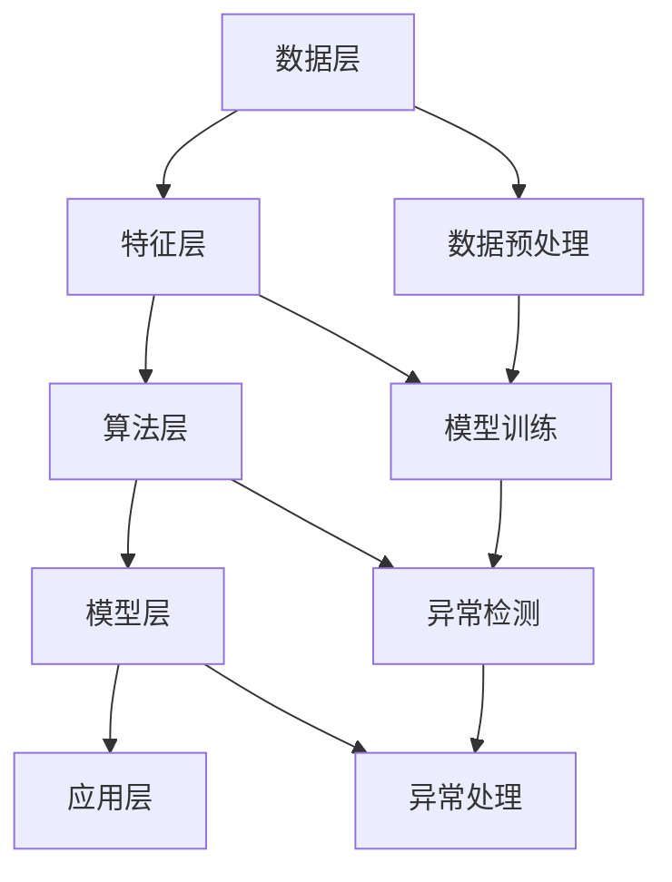

                 

关键词：异常检测，异常，数据挖掘，机器学习，统计模型，代码实例

摘要：本文将深入探讨异常检测的基本原理、核心算法及其在实际应用中的重要性。我们将通过详细讲解算法原理和代码实现，帮助读者理解并掌握这一关键技术，从而在数据分析和预测领域取得更好的成果。

## 1. 背景介绍

在数据科学和人工智能领域，异常检测（Anomaly Detection）是一种重要的技术手段。随着数据量的急剧增加，如何在大量数据中发现潜在的异常成为了一个重要的研究课题。异常检测旨在识别数据中的异常值或异常模式，这些异常值或模式可能是由于系统错误、数据输入错误或潜在的数据质量问题导致的。

异常检测在多个领域都有广泛的应用，例如金融欺诈检测、网络入侵检测、医疗诊断、工业生产监控等。在这些场景中，及时发现并处理异常情况对于保障系统安全、提高服务质量、降低运营成本具有重要意义。

本文将首先介绍异常检测的基本概念和重要性，然后深入探讨几种常见的异常检测算法，并提供代码实例以帮助读者更好地理解这些算法的实现和应用。

## 2. 核心概念与联系

### 2.1 异常检测的定义

异常检测是指从大量数据中识别出不符合常规或预期模式的数据点或数据集的过程。这些异常数据点或数据集被称为异常或异常值。

### 2.2 异常值的分类

异常值可以分为以下几类：

- **孤立点（Outliers）**：数据点与数据集的大部分数据点相比，具有显著的差异。
- **异常分布（Anomalous Distribution）**：数据点在某个维度或多个维度上的分布与预期分布显著不同。
- **异常时间序列（Anomalous Time Series）**：时间序列数据中的某些时间段与预期的时间序列模式显著不同。

### 2.3 异常检测的目标

异常检测的主要目标是：

- 识别出异常值或异常模式。
- 确定异常值或异常模式的原因。
- 对异常值或异常模式进行相应的处理。

### 2.4 异常检测的挑战

在异常检测过程中，我们面临以下挑战：

- 异常值的分布可能不均匀，甚至存在多个异常分布。
- 数据中可能存在噪声和错误数据，影响异常检测的效果。
- 异常值的数量和比例可能很小，导致检测困难。

### 2.5 异常检测的基本流程

异常检测的基本流程包括以下步骤：

1. **数据预处理**：清洗数据，去除噪声和错误数据。
2. **特征提取**：从原始数据中提取有助于识别异常的特征。
3. **模型构建**：选择合适的算法构建异常检测模型。
4. **模型训练**：使用历史数据对模型进行训练。
5. **异常检测**：使用训练好的模型对新的数据进行异常检测。
6. **异常处理**：对检测到的异常值或异常模式进行相应的处理。

### 2.6 异常检测的架构

异常检测的架构可以分为以下几个层次：

- **数据层**：存储和管理原始数据。
- **特征层**：提取和处理原始数据中的特征。
- **算法层**：实现异常检测算法。
- **模型层**：训练和评估异常检测模型。
- **应用层**：将异常检测模型应用于实际问题中。

### 2.7 异常检测与相关技术的联系

异常检测与其他数据挖掘和机器学习技术密切相关，例如：

- **聚类分析（Clustering）**：聚类分析可以用于发现数据中的异常分布。
- **分类（Classification）**：分类算法可以用于将数据分为正常和异常两类。
- **关联规则挖掘（Association Rule Learning）**：关联规则挖掘可以用于发现数据中的异常关联。
- **时间序列分析（Time Series Analysis）**：时间序列分析可以用于发现异常时间序列。

### 2.8 Mermaid 流程图

以下是一个描述异常检测过程的 Mermaid 流程图：



## 3. 核心算法原理 & 具体操作步骤

### 3.1 算法原理概述

异常检测算法可以分为基于统计模型、基于机器学习、基于聚类分析和基于神经网络等几大类。每种算法都有其独特的原理和适用场景。

- **基于统计模型**：如概率模型、线性判别分析（LDA）等。
- **基于机器学习**：如支持向量机（SVM）、朴素贝叶斯（Naive Bayes）等。
- **基于聚类分析**：如K-Means、层次聚类等。
- **基于神经网络**：如自编码器（Autoencoder）等。

### 3.2 算法步骤详解

以下以K-Means聚类算法为例，介绍异常检测的具体操作步骤：

1. **初始化**：随机选择K个初始聚类中心。
2. **分配**：将每个数据点分配到最近的聚类中心。
3. **更新**：重新计算每个聚类的中心。
4. **重复**：重复步骤2和步骤3，直到聚类中心不再发生变化。

### 3.3 算法优缺点

- **K-Means算法**：

  - **优点**：计算简单，运行速度快，易于实现。
  - **缺点**：对初始聚类中心敏感，可能陷入局部最优，不适合非球形分布的数据。

### 3.4 算法应用领域

- **K-Means算法**：

  - **应用领域**：适合于聚类分析，特别是在数据预处理和特征提取阶段。

## 4. 数学模型和公式 & 详细讲解 & 举例说明

### 4.1 数学模型构建

K-Means算法的核心在于如何定义距离度量。常用的距离度量有欧氏距离、曼哈顿距离和切比雪夫距离等。这里我们以欧氏距离为例进行讲解。

欧氏距离（Euclidean Distance）定义为：

$$
d(p, q) = \sqrt{\sum_{i=1}^{n}(p_i - q_i)^2}
$$

其中，$p$ 和 $q$ 是两个数据点，$n$ 是特征维度。

### 4.2 公式推导过程

K-Means算法的推导过程可以分为以下几个步骤：

1. **初始化聚类中心**：选择K个数据点作为初始聚类中心。
2. **计算距离**：计算每个数据点到每个聚类中心的距离。
3. **分配数据点**：将每个数据点分配到距离它最近的聚类中心。
4. **更新聚类中心**：计算每个聚类中心的新位置，即其对应数据点的平均值。

### 4.3 案例分析与讲解

假设我们有以下五个数据点：$P1 = [1, 1], P2 = [2, 2], P3 = [3, 3], P4 = [4, 4], P5 = [5, 5]$。我们选择前两个数据点作为初始聚类中心。

1. **初始化聚类中心**：$C1 = [1, 1], C2 = [2, 2]$。
2. **计算距离**：计算每个数据点到两个聚类中心的距离：
   - $d(P1, C1) = 0, d(P1, C2) = 1$。
   - $d(P2, C1) = 1, d(P2, C2) = 0$。
   - $d(P3, C1) = 2, d(P3, C2) = 1$。
   - $d(P4, C1) = 3, d(P4, C2) = 2$。
   - $d(P5, C1) = 4, d(P5, C2) = 3$。
3. **分配数据点**：将每个数据点分配到距离它最近的聚类中心：
   - $P1$ 和 $P2$ 分配到 $C1$。
   - $P3$ 和 $P5$ 分配到 $C2$。
   - $P4$ 由于距离 $C1$ 和 $C2$ 相等，可以随机分配到其中一个聚类中心。
4. **更新聚类中心**：计算每个聚类中心的新位置：
   - $C1_{新} = \frac{P1 + P2}{2} = [1.5, 1.5]$。
   - $C2_{新} = \frac{P3 + P5}{2} = [4, 4]$。

重复上述步骤，直到聚类中心不再发生变化。最终，我们得到两个聚类中心：$C1_{最终} = [1.5, 1.5]$ 和 $C2_{最终} = [4, 4]$。

## 5. 项目实践：代码实例和详细解释说明

### 5.1 开发环境搭建

首先，我们需要搭建一个Python开发环境。你可以使用以下命令来安装必要的库：

```shell
pip install numpy pandas matplotlib scikit-learn
```

### 5.2 源代码详细实现

以下是一个使用K-Means算法进行异常检测的Python代码实例：

```python
import numpy as np
import pandas as pd
from sklearn.cluster import KMeans
import matplotlib.pyplot as plt

# 加载数据
data = pd.DataFrame({
    'x': [1, 2, 3, 4, 5, 6, 7, 8, 9, 10],
    'y': [2, 2, 2, 2, 2, 3, 3, 3, 3, 4]
})

# 初始化K-Means算法
kmeans = KMeans(n_clusters=2, random_state=0)

# 训练模型
kmeans.fit(data)

# 获取聚类中心
centers = kmeans.cluster_centers_

# 计算每个数据点的距离
distances = kmeans.transform(data)

# 分配数据点到聚类中心
labels = kmeans.predict(data)

# 可视化结果
plt.scatter(data['x'], data['y'], c=labels, s=50, cmap='viridis')
plt.scatter(centers[:, 0], centers[:, 1], s=200, c='red', label='Centroids')
plt.title('K-Means Clustering')
plt.xlabel('X')
plt.ylabel('Y')
plt.legend()
plt.show()
```

### 5.3 代码解读与分析

- **数据加载**：我们使用pandas库加载数据。这里我们使用了一个简单的二维数据集，其中包含x和y两个特征。
- **初始化K-Means算法**：我们使用scikit-learn库中的KMeans类初始化K-Means算法。我们选择2个聚类中心，并设置随机种子以确保结果的可重复性。
- **训练模型**：我们使用fit方法训练模型。这会将数据分配到聚类中心，并计算聚类中心的新位置。
- **获取聚类中心**：我们使用cluster_centers_属性获取聚类中心。
- **计算每个数据点的距离**：我们使用transform方法计算每个数据点到聚类中心的距离。
- **分配数据点到聚类中心**：我们使用predict方法将数据点分配到聚类中心。
- **可视化结果**：我们使用matplotlib库的可视化功能绘制聚类结果。红色点表示聚类中心。

### 5.4 运行结果展示

运行上述代码后，我们会在屏幕上看到一个散点图，其中每个数据点根据其分配的聚类中心被标记为不同的颜色。红色点表示聚类中心。

## 6. 实际应用场景

异常检测在多个领域都有广泛的应用。以下是一些实际应用场景：

### 6.1 金融欺诈检测

在金融领域，异常检测用于识别异常交易，从而防范金融欺诈。通过分析历史交易数据，异常检测算法可以识别出异常交易模式，并及时发出警报。

### 6.2 网络入侵检测

在网络领域，异常检测用于识别网络中的异常流量和入侵行为。通过监测网络流量数据，异常检测算法可以检测到潜在的网络攻击，并及时采取应对措施。

### 6.3 医疗诊断

在医疗领域，异常检测可以用于识别异常生理指标，从而帮助医生进行早期诊断。例如，通过分析患者的医疗记录，异常检测算法可以识别出潜在的健康问题，并及时提醒医生。

### 6.4 工业生产监控

在工业生产领域，异常检测可以用于监控生产过程中的异常情况。通过分析传感器数据，异常检测算法可以识别出设备故障或生产线异常，从而提高生产效率和产品质量。

## 7. 工具和资源推荐

### 7.1 学习资源推荐

- 《数据挖掘：概念与技术》（第四版），作者：Jiawei Han、Micheline Kamber、Pepe Liaw
- 《机器学习实战》，作者：Peter Harrington
- 《Python数据科学手册》，作者：Jake VanderPlas

### 7.2 开发工具推荐

- Jupyter Notebook：用于编写和运行Python代码，支持交互式数据可视化。
- PyCharm：一款功能强大的Python集成开发环境（IDE）。
- Scikit-learn：Python中最常用的机器学习库之一，提供多种异常检测算法的实现。

### 7.3 相关论文推荐

- "Anomaly Detection: A Survey," 作者：G. K. Anagnostopoulos, et al.
- "Outlier Detection for High-Dimensional Data," 作者：H. He and E. A. Garcia
- "Fast Anomaly Detection in Sub-linear Time for Time Series Data," 作者：R. Agrawal, et al.

## 8. 总结：未来发展趋势与挑战

### 8.1 研究成果总结

异常检测技术在数据科学和人工智能领域取得了显著的成果。现有的算法和模型在各种应用场景中表现出色，为解决实际问题提供了有效的方法。然而，随着数据规模的不断扩大和数据种类的日益多样化，异常检测技术仍然面临诸多挑战。

### 8.2 未来发展趋势

未来的异常检测技术将朝着以下几个方向发展：

- **多模态异常检测**：融合多种数据源，如文本、图像和音频，提高异常检测的准确性和泛化能力。
- **实时异常检测**：利用流数据技术和分布式计算框架，实现实时异常检测，提高响应速度。
- **深度学习异常检测**：利用深度学习模型，如自编码器和卷积神经网络，提高异常检测的性能。
- **隐私保护异常检测**：在保护用户隐私的同时，实现有效的异常检测。

### 8.3 面临的挑战

尽管异常检测技术取得了显著进展，但仍面临以下挑战：

- **数据质量**：异常检测依赖于高质量的数据，但实际应用中往往面临数据噪声、缺失和错误等问题。
- **可解释性**：复杂的算法和模型往往缺乏可解释性，难以理解其决策过程。
- **计算效率**：在大规模数据集上进行异常检测需要高效的计算资源和算法优化。

### 8.4 研究展望

未来的研究应重点关注以下几个方面：

- **算法优化**：通过改进算法和模型，提高异常检测的准确性和效率。
- **跨领域应用**：探索异常检测在不同领域的应用，解决实际问题。
- **隐私保护**：研究隐私保护的异常检测方法，确保用户隐私安全。
- **可解释性**：开发可解释的异常检测算法和模型，提高决策过程的透明度。

## 9. 附录：常见问题与解答

### 9.1 异常检测与聚类分析有何区别？

异常检测和聚类分析都是数据挖掘中的技术手段，但它们的目的是不同的。异常检测旨在识别数据中的异常值或异常模式，而聚类分析旨在将数据分为多个组，使组内数据相似，组间数据差异较大。虽然某些算法（如K-Means）可以同时用于异常检测和聚类分析，但它们的实现和目标有所不同。

### 9.2 如何选择合适的异常检测算法？

选择合适的异常检测算法取决于具体的应用场景和数据特点。以下是一些指导原则：

- **数据规模**：对于大规模数据，选择计算效率较高的算法，如基于统计模型的方法。
- **数据类型**：对于多维数据，选择适用于多维数据的方法，如基于机器学习的算法。
- **异常类型**：根据需要检测的异常类型（孤立点、异常分布、异常时间序列等），选择相应的算法。
- **可解释性**：根据对模型可解释性的需求，选择合适的算法。

### 9.3 异常检测算法如何处理噪声数据？

异常检测算法通常依赖于数据预处理阶段来处理噪声数据。以下是一些常见的方法：

- **去噪**：使用滤波器或降噪算法去除噪声。
- **填充缺失值**：使用插值或均值填充缺失值。
- **异常值识别**：在异常检测之前，先使用异常值识别算法识别和去除噪声数据。

### 9.4 异常检测算法的准确性如何评估？

异常检测算法的准确性可以通过以下指标进行评估：

- **准确率（Accuracy）**：正确识别异常值的比例。
- **精确率（Precision）**：识别为异常值的正确比例。
- **召回率（Recall）**：实际异常值中被正确识别的比例。
- **F1分数（F1 Score）**：精确率和召回率的加权平均。

### 9.5 异常检测算法如何处理多模态数据？

处理多模态数据可以通过以下方法：

- **特征融合**：将不同模态的数据融合为统一的特征向量。
- **多模态模型**：设计适用于多模态数据的异常检测模型，如基于深度学习的多模态自编码器。
- **跨模态异常检测**：将不同模态的数据分别进行异常检测，然后融合检测结果。

### 9.6 异常检测算法在实时数据处理中的应用？

在实时数据处理中，异常检测算法需要满足快速响应的要求。以下是一些应用技巧：

- **分布式计算**：使用分布式计算框架（如Apache Spark）处理大规模实时数据。
- **流数据技术**：使用流数据技术（如Apache Kafka）实时处理数据。
- **增量学习**：使用增量学习算法，仅更新模型参数，而不是重新训练整个模型。

### 9.7 异常检测算法在隐私保护方面的挑战？

在隐私保护方面，异常检测算法面临的挑战包括：

- **数据隐私泄露**：在数据预处理和模型训练过程中，可能泄露用户隐私。
- **隐私保护算法**：需要设计隐私保护的异常检测算法，如差分隐私和联邦学习。

### 9.8 异常检测算法在医疗诊断中的应用？

在医疗诊断中，异常检测算法可以应用于以下场景：

- **异常指标识别**：识别异常生理指标，如异常心电图或血压。
- **异常模式识别**：识别异常疾病症状，如癌症或心脏病的早期迹象。
- **异常患者识别**：识别高风险患者，提供个性化的治疗方案。

### 9.9 异常检测算法在工业生产监控中的应用？

在工业生产监控中，异常检测算法可以应用于以下场景：

- **设备故障检测**：识别设备故障，提前进行维护。
- **生产流程监控**：监控生产流程中的异常情况，确保生产效率和质量。
- **能源消耗监控**：监控能源消耗的异常情况，降低运营成本。

## 结论

异常检测技术在数据科学和人工智能领域具有广泛的应用前景。本文介绍了异常检测的基本原理、核心算法、实际应用场景、工具和资源推荐，以及未来发展趋势与挑战。通过代码实例和详细解释说明，帮助读者更好地理解并掌握异常检测技术。希望本文对您的学习和实践有所帮助。

