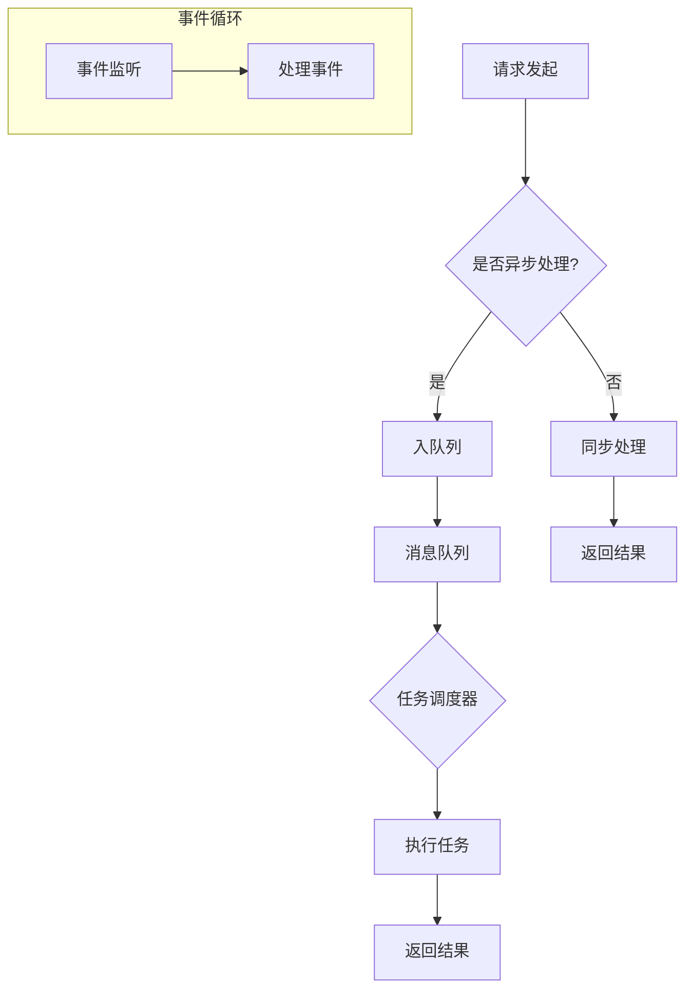
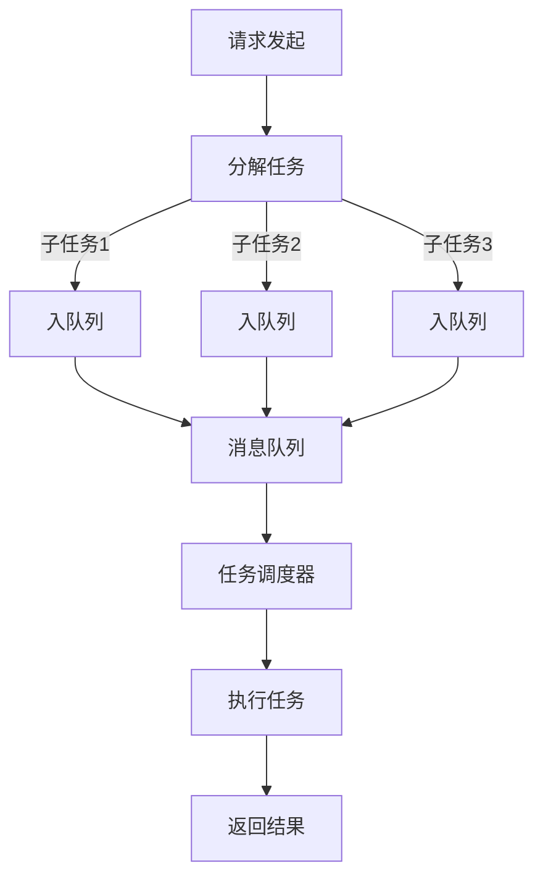

                 

关键词：异步处理，高吞吐量，并发，性能优化，任务调度，分布式系统，消息队列，微服务

> 摘要：随着现代互联网应用的复杂度和规模不断增加，如何在高吞吐量环境下保证系统的稳定性和效率成为关键问题。本文旨在探讨异步处理技术在提升系统吞吐量方面的应用，通过对异步处理的核心概念、算法原理、数学模型及实践案例的深入分析，帮助读者理解并掌握如何在实际项目中应用异步处理技术。

## 1. 背景介绍

在高性能计算领域，吞吐量（Throughput）是指单位时间内系统能够处理的事务数量，它是衡量系统性能的重要指标。随着互联网应用的普及和大数据技术的崛起，传统的同步处理模式已经难以满足日益增长的数据处理需求。在许多场景下，例如电商系统、社交媒体平台和在线游戏，用户生成的内容和交互数据量巨大，请求处理速度和系统响应时间成为用户满意度的决定性因素。

异步处理技术作为一种提高系统吞吐量的有效手段，通过将任务从请求发起者与执行者之间解耦，实现了高并发处理，降低了系统的响应时间，提高了整体吞吐量。本文将围绕异步处理技术展开讨论，解析其在高吞吐量环境下的应用和实践。

## 2. 核心概念与联系

### 2.1. 同步与异步处理

在讨论异步处理之前，我们需要理解同步（Synchronous）和异步（Asynchronous）处理的基本概念。

**同步处理：** 同步处理是指任务的执行者在处理任务时，必须等待任务完成才能进行下一个任务。这种方式下，任务之间是相互阻塞的，当一个任务正在执行时，其他任务必须等待，直到当前任务完成。

**异步处理：** 异步处理则允许任务的执行者在处理任务时，不必等待任务完成即可继续执行下一个任务。这种方式下，任务之间是相互独立的，多个任务可以同时执行，从而提高系统的并行度和吞吐量。

### 2.2. 异步处理架构

异步处理技术通常涉及到以下几个核心组件：

**1. 事件循环（Event Loop）：** 事件循环是一个处理事件和任务的机制，它能够监听事件，并在事件发生时调度相应的处理函数。在异步编程中，事件循环通常是一个核心组件，它负责管理任务的执行顺序。

**2. 消息队列（Message Queue）：** 消息队列是一个用于存储待处理消息的数据结构。在异步处理中，消息队列用于存储任务请求，当任务执行者空闲时，会从消息队列中取出任务并执行。

**3. 任务调度（Task Scheduler）：** 任务调度器负责根据任务的优先级和执行时间等因素，将任务分配给执行者。任务调度器通常与消息队列相结合，确保任务能够高效地被处理。

### 2.3. Mermaid 流程图

以下是一个异步处理技术的 Mermaid 流程图，展示核心组件之间的交互关系：



## 3. 核心算法原理 & 具体操作步骤

### 3.1. 算法原理概述

异步处理的核心在于任务的解耦和并行执行。通过将任务分解为较小的子任务，并利用事件循环、消息队列和任务调度器等组件，系统可以在不需要等待单个任务完成的情况下，并行处理多个任务。以下是一个异步处理的简单原理图：



### 3.2. 算法步骤详解

**1. 请求发起：** 用户发起一个请求，请求可能是一个复杂任务，需要被分解为多个子任务。

**2. 任务分解：** 系统将复杂任务分解为多个较小的子任务，每个子任务可以独立执行。

**3. 入队列：** 子任务被插入到消息队列中，等待任务调度器分配执行。

**4. 消息队列：** 消息队列存储待处理的子任务，确保任务有序地被处理。

**5. 任务调度器：** 任务调度器根据任务的优先级和执行时间等因素，将子任务分配给空闲的执行者。

**6. 执行任务：** 执行者从消息队列中取出子任务并执行。

**7. 返回结果：** 子任务执行完成后，将结果返回给请求发起者。

### 3.3. 算法优缺点

**优点：**

1. 提高系统吞吐量：通过并行处理任务，提高了系统的吞吐量。
2. 降低响应时间：不需要等待单个任务的完成，减少了系统的响应时间。
3. 增强系统稳定性：任务解耦降低了系统之间的依赖，提高了系统的稳定性。

**缺点：**

1. 复杂性增加：异步处理技术增加了系统的复杂性，需要更多的组件和机制来保证任务的正确执行。
2. 难以调试：由于任务的执行是并发的，调试变得更加困难。

### 3.4. 算法应用领域

异步处理技术在高吞吐量环境下有着广泛的应用，以下是一些典型的应用领域：

1. **电商平台：** 处理用户订单、库存更新等任务。
2. **社交媒体平台：** 处理用户发布内容、评论等任务。
3. **在线游戏：** 处理玩家动作、数据处理等任务。
4. **大数据处理：** 处理数据采集、存储、分析等任务。

## 4. 数学模型和公式 & 详细讲解 & 举例说明

### 4.1. 数学模型构建

异步处理技术涉及到的数学模型主要包括任务处理时间、吞吐量和响应时间等。

**任务处理时间：** 任务处理时间是指执行一个任务所需的时间。对于单个任务，处理时间可以表示为：

\[ T = \frac{C}{R} \]

其中，\( T \) 是任务处理时间，\( C \) 是任务的执行时间，\( R \) 是任务的响应时间。

**吞吐量：** 吞吐量是指单位时间内系统可以处理的任务数量。对于单个处理器，吞吐量可以表示为：

\[ Q = \frac{1}{T} \]

**响应时间：** 响应时间是指从请求发起到结果返回所需的时间。对于单个任务，响应时间可以表示为：

\[ R = T + W \]

其中，\( W \) 是任务等待时间。

### 4.2. 公式推导过程

**吞吐量公式推导：**

根据任务处理时间 \( T \)，我们可以推导出吞吐量 \( Q \)：

\[ Q = \frac{1}{T} = \frac{1}{\frac{C}{R}} = \frac{R}{C} \]

**响应时间公式推导：**

根据任务处理时间 \( T \) 和任务等待时间 \( W \)，我们可以推导出响应时间 \( R \)：

\[ R = T + W = \frac{C}{R} + W \]

### 4.3. 案例分析与讲解

假设我们有一个电商平台的订单处理系统，每个订单处理时间 \( C \) 为 10 秒，任务等待时间 \( W \) 为 5 秒。我们希望计算系统的吞吐量和响应时间。

**吞吐量计算：**

\[ Q = \frac{R}{C} = \frac{15}{10} = 1.5 \]

**响应时间计算：**

\[ R = \frac{C}{R} + W = \frac{10}{15} + 5 = 7.5 \]

这意味着该电商平台订单处理系统的吞吐量为每秒 1.5 个订单，平均响应时间为 7.5 秒。

## 5. 项目实践：代码实例和详细解释说明

### 5.1. 开发环境搭建

为了更好地展示异步处理技术在项目中的应用，我们使用 Python 语言和异步框架 `asyncio` 来搭建一个简单的电商订单处理系统。

**安装依赖：**

```bash
pip install asyncio
```

### 5.2. 源代码详细实现

以下是一个简单的异步处理电商订单处理系统的示例代码：

```python
import asyncio

async def process_order(order_id):
    print(f"Processing order {order_id}")
    await asyncio.sleep(1)  # 模拟订单处理时间
    print(f"Order {order_id} processed")

async def main():
    orders = [1, 2, 3, 4, 5]  # 假设有 5 个订单
    tasks = [process_order(order) for order in orders]
    await asyncio.wait(tasks)

asyncio.run(main())
```

### 5.3. 代码解读与分析

**1. 导入异步库：**

```python
import asyncio
```

**2. 定义订单处理函数：**

```python
async def process_order(order_id):
    print(f"Processing order {order_id}")
    await asyncio.sleep(1)  # 模拟订单处理时间
    print(f"Order {order_id} processed")
```

该函数使用异步关键字 `async` 定义，用于处理订单。函数接收订单编号 `order_id` 作为参数，打印处理状态，并使用 `await asyncio.sleep(1)` 模拟订单处理时间。

**3. 定义主函数：**

```python
async def main():
    orders = [1, 2, 3, 4, 5]  # 假设有 5 个订单
    tasks = [process_order(order) for order in orders]
    await asyncio.wait(tasks)
```

主函数 `main` 使用异步关键字 `async` 定义，用于启动订单处理。首先定义一个订单列表 `orders`，然后创建一个任务列表 `tasks`，将每个订单处理函数添加到任务列表中。最后，使用 `await asyncio.wait(tasks)` 等待所有订单处理任务的完成。

### 5.4. 运行结果展示

运行上述代码，输出结果如下：

```
Processing order 1
Processing order 2
Processing order 3
Processing order 4
Processing order 5
Order 1 processed
Order 2 processed
Order 3 processed
Order 4 processed
Order 5 processed
```

结果显示，系统成功处理了 5 个订单，每个订单的处理时间约为 1 秒。通过异步处理技术，系统可以并行处理多个订单，提高了订单处理的吞吐量。

## 6. 实际应用场景

### 6.1. 电商订单处理

电商平台通常面临大量订单处理的挑战，异步处理技术可以有效提高订单处理速度，缩短用户等待时间。通过将订单处理任务分解为多个子任务，并使用异步处理框架，系统可以实现并发处理，提高订单处理效率。

### 6.2. 社交媒体内容发布

社交媒体平台需要处理用户发布的各种内容，如图片、视频和文本等。异步处理技术可以帮助平台在处理用户请求时，避免因单个请求的处理时间过长而导致系统阻塞。通过异步处理，平台可以同时处理多个用户请求，提高内容发布的速度和响应时间。

### 6.3. 在线游戏数据处理

在线游戏通常需要处理大量的玩家数据和游戏逻辑。异步处理技术可以帮助游戏服务器在处理玩家请求时，避免因单个请求的处理时间过长而影响游戏体验。通过异步处理，游戏服务器可以同时处理多个玩家的请求，提高游戏运行的流畅度。

### 6.4. 大数据处理

大数据处理场景下，数据量庞大且处理任务复杂。异步处理技术可以帮助系统在处理数据时，避免因单个任务的处理时间过长而导致系统资源浪费。通过异步处理，系统可以实现并发处理，提高数据处理效率。

## 7. 工具和资源推荐

### 7.1. 学习资源推荐

- 《异步编程：原理与实践》
- 《Python异步编程实战》
- 《JavaScript 异步编程指南》

### 7.2. 开发工具推荐

- Visual Studio Code
- PyCharm
- Node.js

### 7.3. 相关论文推荐

- "Asynchronous Programming in Node.js"
- "Python's Asynchronous I/O: The 'async' and 'await' Mechanics"
- "Asynchronous Programming in C# 7.0"

## 8. 总结：未来发展趋势与挑战

### 8.1. 研究成果总结

异步处理技术在高吞吐量环境中的应用已经取得显著成果。通过异步处理，系统可以实现并发处理，提高吞吐量和响应时间。同时，异步处理技术在电商、社交媒体、在线游戏和大数据处理等领域具有广泛的应用前景。

### 8.2. 未来发展趋势

未来，异步处理技术将继续向更高效、更稳定、更易于使用方向发展。随着云计算和容器技术的发展，异步处理技术将在分布式系统中发挥更大作用。此外，人工智能与异步处理技术的结合，也将为高性能计算带来新的突破。

### 8.3. 面临的挑战

异步处理技术在实际应用中仍面临一些挑战，如复杂性增加、调试难度大等。此外，异步处理技术在不同操作系统和编程语言之间的兼容性也需要进一步优化。未来研究应重点关注如何提高异步处理技术的可维护性和可扩展性。

### 8.4. 研究展望

随着互联网应用的不断演进，异步处理技术在高吞吐量环境中的应用将越来越重要。未来研究应致力于解决异步处理技术的兼容性、可维护性和可扩展性问题，探索更加高效、可靠的异步处理方案，为高性能计算领域的发展提供有力支持。

## 9. 附录：常见问题与解答

**Q1：异步处理与多线程有什么区别？**

异步处理与多线程的区别在于任务之间的执行方式。异步处理允许任务在执行过程中不等待其他任务完成，从而实现并发处理。而多线程则是通过创建多个线程来并发执行任务，但线程之间的切换和同步会带来额外的开销。

**Q2：异步处理适用于哪些场景？**

异步处理适用于需要高并发处理、响应时间要求严格的场景，如电商平台订单处理、社交媒体内容发布、在线游戏数据处理和大数据处理等。

**Q3：异步处理是否会降低系统稳定性？**

合理设计异步处理架构可以提高系统稳定性。通过任务解耦和并发处理，异步处理技术可以降低系统之间的依赖，从而提高系统的稳定性。然而，不当的异步处理设计可能会导致系统复杂性增加，降低稳定性。因此，在设计异步处理系统时，需要充分考虑系统稳定性和可靠性。

