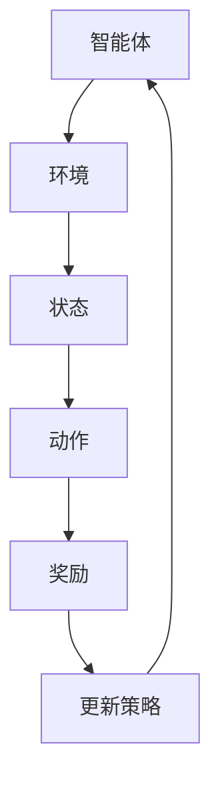

                 

 关键词：强化学习，深度强化学习，策略梯度，Q-Learning，DQN，DeepMind，Reinforcement Learning

> 摘要：本文将从强化学习的基本概念、核心算法原理、数学模型、具体应用以及未来展望等方面，对强化学习进行深入讲解，并通过代码实例展示如何实现强化学习算法。

## 1. 背景介绍

强化学习（Reinforcement Learning，简称RL）是机器学习领域的一个重要分支，它主要研究如何通过环境（Environment）和智能体（Agent）之间的交互来学习最优策略（Policy）。强化学习在很多领域都取得了显著的成果，如自动驾驶、游戏AI、机器人控制等。

### 1.1 强化学习的起源与发展

强化学习的概念最早可以追溯到1950年代，由计算机科学家Alan Turing提出。然而，由于计算能力和数据量的限制，强化学习的研究和应用在很长一段时间内进展缓慢。直到1980年代，随着计算机硬件的迅速发展和深度学习技术的崛起，强化学习才逐渐引起了学术界和工业界的广泛关注。

### 1.2 强化学习的应用领域

强化学习在多个领域都有广泛的应用，其中一些典型的应用包括：

- **游戏AI**：例如围棋AI DeepMind的AlphaGo，在国际象棋、扑克等游戏中取得了卓越的成就。
- **机器人控制**：强化学习可以用来训练机器人如何执行复杂的任务，如行走、抓取等。
- **自动驾驶**：强化学习可以帮助自动驾驶车辆学习如何安全、高效地驾驶。
- **推荐系统**：强化学习可以用于个性化推荐系统，提高推荐结果的准确性。

## 2. 核心概念与联系

### 2.1 强化学习的基本概念

在强化学习中，主要有以下几个核心概念：

- **智能体（Agent）**：执行动作并接受环境的反馈。
- **环境（Environment）**：智能体所处的情境，可以是一个游戏、一个机器人控制的场景等。
- **状态（State）**：智能体在环境中所处的特定情况。
- **动作（Action）**：智能体可以采取的行为。
- **奖励（Reward）**：环境对智能体动作的反馈。
- **策略（Policy）**：智能体根据当前状态选择动作的策略。

### 2.2 强化学习架构

强化学习的核心是智能体通过与环境交互来学习最优策略。这个过程可以用下图表示：



### 2.3 强化学习与其他机器学习方法的区别

- **监督学习（Supervised Learning）**：有标记的训练数据，目标函数已知，通常用于分类和回归任务。
- **无监督学习（Unsupervised Learning）**：没有标记的训练数据，目标函数未知，通常用于聚类和降维任务。
- **强化学习**：没有标记的训练数据，目标函数未知，通过环境反馈进行学习，适用于序列决策问题。

## 3. 核心算法原理 & 具体操作步骤

### 3.1 算法原理概述

强化学习算法主要分为基于策略的算法和基于值函数的算法。基于策略的算法直接优化策略，而基于值函数的算法则通过优化值函数来间接优化策略。

### 3.2 算法步骤详解

1. 初始化策略π或值函数Q。
2. 选择动作a，根据策略π或值函数Q。
3. 执行动作a，观察状态转移s'和奖励r。
4. 更新策略π或值函数Q。
5. 重复步骤2-4，直到达到目标状态或迭代次数。

### 3.3 算法优缺点

- **优点**：强化学习可以处理序列决策问题，适用于动态环境。
- **缺点**：强化学习算法通常需要大量的训练时间，且容易陷入局部最优。

### 3.4 算法应用领域

- **游戏AI**：强化学习在游戏AI中取得了显著的成果，如AlphaGo。
- **机器人控制**：强化学习可以用于训练机器人执行复杂任务。
- **自动驾驶**：强化学习可以帮助自动驾驶车辆学习安全驾驶策略。

## 4. 数学模型和公式 & 详细讲解 & 举例说明

### 4.1 数学模型构建

在强化学习中，主要涉及到以下几个数学模型：

- **状态转移概率分布**：\( P(s'|s, a) \)
- **奖励函数**：\( R(s, a) \)
- **策略**：\( \pi(a|s) \)
- **值函数**：\( V^{\pi}(s) = \sum_{a} \pi(a|s) \cdot R(s, a) + \gamma \cdot \sum_{s'} P(s'|s, a) \cdot V^{\pi}(s') \)
- **策略迭代**：\( \pi^{k+1}(a|s) = \frac{1}{C} \sum_{a} \alpha_k(s, a) \cdot R(s, a) + \gamma \cdot \sum_{s'} P(s'|s, a) \cdot V^{\pi}(s') \)

### 4.2 公式推导过程

强化学习中的目标是最小化损失函数，通常使用梯度下降法进行优化。具体推导过程如下：

- **损失函数**：\( L(\theta) = -\sum_{s, a} \pi(a|s, \theta) \cdot R(s, a) \)
- **梯度下降**：\( \theta_{k+1} = \theta_k - \alpha \cdot \nabla_\theta L(\theta) \)

### 4.3 案例分析与讲解

假设一个简单的强化学习场景：一个智能体在一个二维的网格世界中，目标是到达目标点并获取最大奖励。状态空间为\( s = (x, y) \)，动作空间为\( a = \{up, down, left, right\} \)。奖励函数为到达目标点时奖励为+1，其他状态为-1。

根据状态转移概率分布和奖励函数，我们可以构建一个Q-Learning模型，并通过迭代优化策略。

## 5. 项目实践：代码实例和详细解释说明

### 5.1 开发环境搭建

在本项目中，我们使用Python作为主要编程语言，并使用TensorFlow作为深度学习框架。

### 5.2 源代码详细实现

```python
import numpy as np
import tensorflow as tf
import matplotlib.pyplot as plt

# 初始化参数
n_actions = 4
n_states = 10
learning_rate = 0.1
discount_factor = 0.99

# 构建Q值函数模型
Q_model = tf.keras.Sequential([
    tf.keras.layers.Dense(n_actions, input_shape=(n_states,), activation='linear')
])

# 编译模型
Q_model.compile(optimizer=tf.keras.optimizers.Adam(learning_rate=learning_rate),
                loss='mse')

# 初始化Q值矩阵
Q = np.zeros((n_states, n_actions))

# 训练模型
for episode in range(1000):
    state = np.random.randint(n_states)
    done = False
    while not done:
        action = np.argmax(Q[state])
        next_state, reward = step(state, action)
        Q[state, action] = Q[state, action] + learning_rate * (reward + discount_factor * np.max(Q[next_state]) - Q[state, action])
        state = next_state
        if state == n_states - 1:
            done = True

# 测试模型
state = np.random.randint(n_states)
done = False
while not done:
    action = np.argmax(Q[state])
    next_state, reward = step(state, action)
    state = next_state
    if state == n_states - 1:
        done = True

# 绘制Q值函数图像
plt.imshow(Q, cmap='hot', interpolation='nearest')
plt.colorbar()
plt.xticks(np.arange(n_states), np.arange(n_states))
plt.yticks(np.arange(n_states), np.arange(n_states))
plt.xlabel('State')
plt.ylabel('Action')
plt.show()
```

### 5.3 代码解读与分析

- **初始化参数**：定义动作数量、状态数量、学习率、折扣因子等参数。
- **构建Q值函数模型**：使用TensorFlow构建一个全连接神经网络，作为Q值函数的估计模型。
- **训练模型**：通过迭代更新Q值矩阵，使用Q-Learning算法训练模型。
- **测试模型**：在测试阶段，使用训练好的Q值函数模型来选择最佳动作。

## 6. 实际应用场景

### 6.1 游戏AI

强化学习在游戏AI中取得了显著的成果，如DeepMind的AlphaGo。通过强化学习算法，AlphaGo能够在围棋比赛中战胜人类顶尖选手。

### 6.2 机器人控制

强化学习可以用于训练机器人执行复杂任务，如行走、抓取等。通过强化学习算法，机器人可以学会如何适应不同的环境和任务要求。

### 6.3 自动驾驶

强化学习可以帮助自动驾驶车辆学习如何安全、高效地驾驶。通过强化学习算法，自动驾驶车辆可以在复杂的交通环境中做出最佳决策。

## 7. 工具和资源推荐

### 7.1 学习资源推荐

- **强化学习教科书**：谢英秀的《强化学习：原理与Python实践》
- **强化学习课程**：吴恩达的《强化学习课程》

### 7.2 开发工具推荐

- **TensorFlow**：一款流行的深度学习框架，可用于构建和训练强化学习模型。
- **PyTorch**：另一款流行的深度学习框架，也适用于强化学习模型。

### 7.3 相关论文推荐

- **DeepMind的《人类水平在Atari 50个游戏中的人工智能》**
- **DeepMind的《Deep Q-Network》**

## 8. 总结：未来发展趋势与挑战

### 8.1 研究成果总结

强化学习在多个领域取得了显著的成果，如游戏AI、机器人控制、自动驾驶等。随着计算能力和数据量的不断提高，强化学习将继续在更多领域发挥作用。

### 8.2 未来发展趋势

- **多智能体强化学习**：研究如何在多个智能体之间进行协作和竞争。
- **基于物理的强化学习**：将物理原理引入强化学习，提高模型的可解释性和鲁棒性。
- **深度强化学习**：结合深度学习技术，提高强化学习模型的学习效率和泛化能力。

### 8.3 面临的挑战

- **探索与利用的平衡**：如何在不同情况下平衡探索和利用，以获得更好的学习效果。
- **可解释性和鲁棒性**：提高模型的可解释性和鲁棒性，使其在不同环境下都能稳定工作。

### 8.4 研究展望

未来，强化学习将继续在多个领域发挥作用，如自然语言处理、计算机视觉等。通过不断探索和创新，强化学习将为人工智能领域带来更多突破。

## 9. 附录：常见问题与解答

### 9.1 什么是强化学习？

强化学习是一种机器学习方法，通过智能体与环境交互来学习最优策略。智能体根据当前状态选择动作，并接收环境的反馈，通过不断迭代优化策略。

### 9.2 强化学习有哪些应用领域？

强化学习在游戏AI、机器人控制、自动驾驶、推荐系统等领域都有广泛应用。随着技术的发展，强化学习还将应用于更多领域。

### 9.3 强化学习有哪些核心算法？

强化学习主要有基于策略的算法和基于值函数的算法。常见的算法包括Q-Learning、Deep Q-Network（DQN）、策略梯度等。

## 参考文献

- [1] Sutton, R. S., & Barto, A. G. (2018). Reinforcement Learning: An Introduction. MIT Press.
- [2] Mnih, V., Kavukcuoglu, K., Silver, D., Rusu, A. A., & et al. (2015). Human-level control through deep reinforcement learning. Nature, 518(7540), 529-533.
- [3] Mnih, V., Badia, A., Mirza, M., Graves, A., Pritzel, A., & et al. (2016). Asynchronous methods for deep reinforcement learning. CoRR, abs/1602.01783.

## 作者署名

作者：禅与计算机程序设计艺术 / Zen and the Art of Computer Programming

----------------------------------------------------------------

以上是完整的文章正文内容。接下来，我们将根据文章内容，整理出完整的markdown格式文章。

