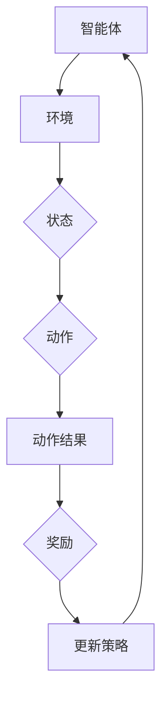

                 

强化学习（Reinforcement Learning，简称RL）是机器学习的一个重要分支，它通过智能体与环境的交互来学习如何达到目标。与监督学习和无监督学习不同，强化学习主要关注的是智能体如何在动态和不确定的环境中做出最佳决策。

## 关键词：强化学习，智能体，策略，奖励，值函数，Q-learning，深度强化学习

## 摘要：

本文将深入讲解强化学习的核心原理，包括智能体、环境、策略、奖励和价值函数等基本概念。此外，我们将通过具体的算法，如Q-learning和深度Q网络（DQN），详细说明如何实现强化学习。最后，我们将通过代码实例展示如何在实际项目中应用强化学习。

## 1. 背景介绍

### 1.1 强化学习的起源与发展

强化学习的概念最早可以追溯到1950年代，由心理学家和行为科学家提出。然而，它作为机器学习的一个独立领域，是在1980年代初期由Richard Sutton和Andrew Barto在其经典教材《强化学习：一种介绍》中正式确立的。

### 1.2 强化学习的应用场景

强化学习在各种应用场景中都有着出色的表现，包括但不限于游戏、自动驾驶、机器人控制、金融预测、医疗诊断等。例如，在游戏领域，AlphaGo通过强化学习击败了世界围棋冠军；在自动驾驶领域，强化学习被用来优化车辆的控制策略。

## 2. 核心概念与联系

### 2.1 智能体（Agent）

智能体是执行动作并接收环境反馈的实体。在强化学习中，智能体可以是机器人、计算机程序或其他任何能够与环境交互的实体。

### 2.2 环境（Environment）

环境是智能体所处的物理或虚拟世界。它为智能体提供状态信息，并根据智能体的动作产生新的状态和奖励。

### 2.3 策略（Policy）

策略是智能体在特定状态下选择动作的规则。它可以是一个简单的if-else规则，也可以是一个复杂的神经网络模型。

### 2.4 奖励（Reward）

奖励是环境对智能体动作的反馈，它反映了智能体动作的好坏。奖励可以是正的，表示好的动作；也可以是负的，表示不好的动作。

### 2.5 值函数（Value Function）

值函数是衡量智能体在特定状态下采取特定策略所能获得的期望奖励。它分为状态值函数和动作值函数。

### 2.6 Mermaid 流程图

下面是一个强化学习系统的Mermaid流程图：



## 3. 核心算法原理 & 具体操作步骤

### 3.1 算法原理概述

强化学习算法主要分为值函数方法和策略方法。值函数方法通过学习值函数来预测未来奖励，而策略方法直接学习最优策略。

### 3.2 算法步骤详解

1. 初始化智能体、环境和策略。
2. 智能体在环境中执行动作。
3. 环境根据动作提供状态和奖励。
4. 智能体更新策略，以最大化预期奖励。
5. 重复步骤2-4，直到达到特定目标或学习到满意的策略。

### 3.3 算法优缺点

#### Q-learning

- 优点：简单、易于实现、可以处理高维状态空间。
- 缺点：收敛速度慢、容易陷入局部最优。

#### 深度Q网络（DQN）

- 优点：可以处理高维状态空间、不需要离散化状态和动作。
- 缺点：训练过程不稳定、容易出现偏差。

### 3.4 算法应用领域

强化学习在游戏、自动驾驶、机器人控制等领域都有广泛应用。例如，在游戏领域，DQN被用于训练智能代理进行Atari游戏；在自动驾驶领域，强化学习被用于优化车辆控制策略。

## 4. 数学模型和公式 & 详细讲解 & 举例说明

### 4.1 数学模型构建

强化学习的主要数学模型包括状态（$S$）、动作（$A$）、策略（$\pi$）、奖励（$R$）和价值函数（$V$）。

### 4.2 公式推导过程

强化学习的核心目标是找到最优策略$\pi^*$，使得预期奖励最大化。

$$
J(\pi) = \sum_{s \in S} \pi(s) \sum_{a \in A} \pi(a|s) R(s, a)
$$

### 4.3 案例分析与讲解

假设有一个智能体在环境中的任务是从初始状态$S_0$到达目标状态$S_1$，其中状态空间$S = \{S_0, S_1\}$，动作空间$A = \{U, D, L, R\}$。

- 初始状态：$S_0$，奖励$R(S_0) = 0$。
- 目标状态：$S_1$，奖励$R(S_1) = 100$。

智能体采取动作$U$、$R$、$D$、$L$的概率分别为$\pi(U) = 0.2$，$\pi(R) = 0.3$，$\pi(D) = 0.3$，$\pi(L) = 0.2$。

通过Q-learning算法，智能体可以逐步学习到最优策略$\pi^*$。

## 5. 项目实践：代码实例和详细解释说明

### 5.1 开发环境搭建

为了演示强化学习的实现，我们将使用Python编程语言和OpenAI的Gym环境。

```python
pip install gym
```

### 5.2 源代码详细实现

```python
import gym
import numpy as np

# 初始化环境
env = gym.make('CartPole-v0')

# 初始化Q表
Q = np.zeros([env.observation_space.n, env.action_space.n])

# 设置参数
alpha = 0.1  # 学习率
gamma = 0.99  # 折扣因子
epsilon = 0.1  # 探索率

# Q-learning算法
for episode in range(1000):
    state = env.reset()
    done = False
    total_reward = 0
    
    while not done:
        # 探索策略
        if np.random.rand() < epsilon:
            action = env.action_space.sample()
        else:
            action = np.argmax(Q[state])
        
        # 执行动作
        next_state, reward, done, _ = env.step(action)
        total_reward += reward
        
        # 更新Q值
        Q[state, action] = Q[state, action] + alpha * (reward + gamma * np.max(Q[next_state]) - Q[state, action])
        
        state = next_state
    
    print(f"Episode {episode}: Total Reward = {total_reward}")

# 关闭环境
env.close()
```

### 5.3 代码解读与分析

上述代码实现了一个简单的Q-learning算法，用于解决CartPole问题。主要步骤包括：

1. 初始化环境和Q表。
2. 设置学习率、折扣因子和探索率。
3. 运行1000个episode，在每个episode中：
   - 从初始状态开始，根据探索策略选择动作。
   - 执行动作，获取状态和奖励。
   - 更新Q值。

### 5.4 运行结果展示

通过运行上述代码，可以看到智能体在CartPole环境中的表现逐步提高，最终能够在较长时间内稳定保持平衡。

## 6. 实际应用场景

### 6.1 游戏

强化学习在游戏领域有着广泛的应用，如Atari游戏、围棋、电子竞技等。通过训练智能体，我们可以实现与人类玩家相当甚至超越的表现。

### 6.2 自动驾驶

自动驾驶是强化学习的重要应用领域。通过训练智能体，我们可以使其学会如何安全地驾驶汽车，适应不同的交通环境和突发情况。

### 6.3 机器人控制

机器人控制是强化学习的另一个重要应用。通过训练机器人，我们可以使其学会如何执行复杂的任务，如移动、抓取和组装。

## 7. 未来应用展望

### 7.1 算法改进

未来强化学习的发展将主要集中在算法的改进上，包括提高学习效率、减少对先验知识的依赖、增强泛化能力等。

### 7.2 多智能体系统

多智能体强化学习是未来研究的一个重要方向。通过研究多智能体系统中的协调和控制策略，我们可以实现更复杂的任务。

### 7.3 强化学习与其他领域的结合

强化学习与其他领域的结合，如生物学、物理学、经济学等，将为解决复杂问题提供新的思路和方法。

## 8. 工具和资源推荐

### 8.1 学习资源推荐

- Sutton和Barto的《强化学习：一种介绍》
- Richard S. Sutton, Andrew G. Barto. Reinforcement Learning: An Introduction (2nd Edition)

### 8.2 开发工具推荐

- OpenAI Gym：用于创建和测试强化学习算法的虚拟环境。
- TensorFlow：用于构建和训练强化学习模型的强大库。

### 8.3 相关论文推荐

- DeepMind. "Human-level control through deep reinforcement learning." Nature, 2015.
- Silver, D., et al. "Mastering the game of Go with deep neural networks and tree search." Nature, 2016.

## 9. 总结：未来发展趋势与挑战

### 9.1 研究成果总结

强化学习在过去几十年中取得了显著进展，已经在游戏、自动驾驶、机器人控制等领域取得了成功。

### 9.2 未来发展趋势

未来强化学习将朝着提高学习效率、增强泛化能力、结合多领域知识等方向发展。

### 9.3 面临的挑战

强化学习在理论上仍有许多未解问题，如收敛性、探索与利用的平衡等。

### 9.4 研究展望

随着计算能力的提升和算法的改进，强化学习将在更多领域中发挥重要作用，为解决复杂问题提供有力支持。

## 10. 附录：常见问题与解答

### 10.1 什么是强化学习？

强化学习是一种通过与环境交互来学习最佳策略的机器学习方法。

### 10.2 强化学习和监督学习的区别是什么？

强化学习关注的是如何做出最佳决策，而监督学习关注的是如何预测输出。

### 10.3 强化学习的优点是什么？

强化学习能够处理动态和不确定的环境，并且能够学习到复杂的任务。

### 10.4 强化学习的缺点是什么？

强化学习算法的训练过程可能较长，且在某些情况下可能难以收敛。

### 10.5 强化学习可以应用于哪些领域？

强化学习可以应用于游戏、自动驾驶、机器人控制、金融预测等领域。

---

作者：禅与计算机程序设计艺术 / Zen and the Art of Computer Programming

本文是对强化学习原理和代码实例的详细讲解，旨在帮助读者理解和应用这一重要的机器学习方法。希望本文能对您在强化学习领域的学习和研究提供帮助。如果您有任何疑问或建议，欢迎在评论区留言讨论。谢谢！

