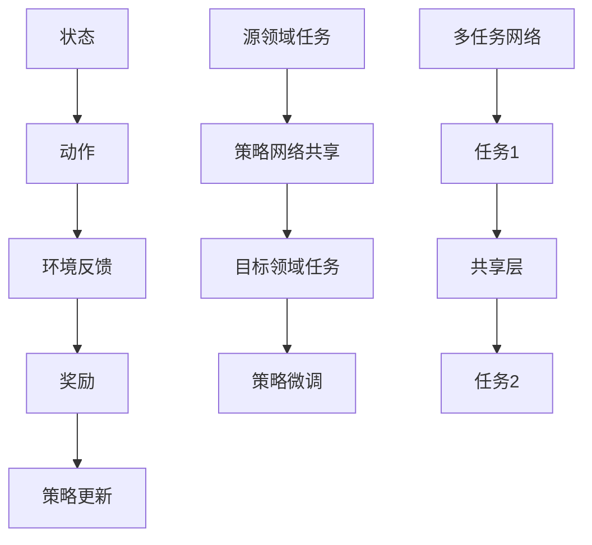

                 

关键词：强化学习，迁移学习，多任务学习，RL算法，应用场景，发展趋势

摘要：本文旨在探讨强化学习（Reinforcement Learning，RL）领域中迁移学习与多任务学习的核心概念、原理及其在实际应用中的重要性。通过阐述这两种学习方法在RL框架下的具体实现和优势，本文将进一步分析其在复杂动态环境中的应用前景与挑战，并对未来研究提出展望。

## 1. 背景介绍

强化学习作为机器学习的一个重要分支，以其独特的优化目标和强大的应用潜力而受到广泛关注。传统的强化学习通常关注单个任务的优化，但随着实际应用场景的复杂化和多样化，单一任务的学习方式逐渐暴露出一些局限性。迁移学习和多任务学习应运而生，它们通过共享经验和知识来提高学习效率，降低训练成本，并提升模型泛化能力。

迁移学习（Transfer Learning）是指将一个任务领域（源领域）的知识应用到另一个相关任务领域（目标领域）的学习过程中。这种方法通过利用已有知识来加速新任务的学习，从而提高模型的适应性。而多任务学习（Multi-Task Learning）则是在同一模型中同时解决多个任务，通过任务间的信息共享和相互作用来提升整体性能。

在强化学习领域，迁移学习和多任务学习不仅可以提高模型对环境变化的适应能力，还能显著减少对每个任务的训练时间，提高学习效率。本文将深入探讨这些方法在强化学习中的应用，分析其核心原理、算法实现及其在不同应用场景中的优势。

## 2. 核心概念与联系

### 2.1 强化学习的基本概念

强化学习是一种通过奖励信号来指导智能体（agent）进行决策的学习方法。在强化学习框架中，智能体通过不断尝试和反馈来学习最优策略，以最大化长期奖励。基本概念包括：

- 智能体（Agent）：执行动作并接受环境反馈的实体。
- 状态（State）：智能体在环境中的当前情况。
- 动作（Action）：智能体可以执行的行为。
- 奖励（Reward）：对智能体动作的即时评价。
- 策略（Policy）：智能体根据当前状态选择动作的规则。

### 2.2 迁移学习的原理与架构

迁移学习通过将源领域的知识迁移到目标领域，减少对目标领域数据的依赖。其核心思想是利用源领域任务的学习经验来加速目标领域任务的训练。在强化学习中，迁移学习可以应用于以下方面：

- 策略网络共享：将源领域任务训练好的策略网络应用于目标领域任务，通过少量目标领域数据进行微调来适应新任务。
- 状态表征迁移：通过迁移状态表征模型，将源领域任务的状态表征迁移到目标领域，提高目标领域任务的泛化能力。

### 2.3 多任务学习的原理与架构

多任务学习旨在同时学习多个相关任务，通过任务间的信息共享和协同来提高整体性能。在强化学习中，多任务学习可以通过以下方式进行：

- 多策略网络：每个任务拥有独立的策略网络，但网络之间存在共享层，通过共享层的信息传递实现任务间的协同。
- 多头输出：单个策略网络处理多个任务，每个任务的输出独立，但输入和中间层共享。

### 2.4 Mermaid 流程图



通过上述流程图，我们可以直观地理解强化学习中迁移学习和多任务学习的核心架构和相互联系。

## 3. 核心算法原理 & 具体操作步骤

### 3.1 算法原理概述

强化学习中的迁移学习与多任务学习主要依赖于以下原理：

- **迁移学习原理**：通过共享策略网络或状态表征模型，将源领域任务的知识迁移到目标领域任务，减少目标领域任务对数据的需求。
- **多任务学习原理**：通过任务间的信息共享和协同，提高整体模型的性能，实现多个任务的共同优化。

### 3.2 算法步骤详解

#### 3.2.1 迁移学习步骤

1. **源领域任务训练**：首先在源领域任务上进行策略网络或状态表征模型的训练，得到一个性能良好的模型。
2. **目标领域任务初始化**：在目标领域任务中初始化策略网络或状态表征模型，可以初始化为源领域模型的权重。
3. **策略微调**：在目标领域任务中，使用少量目标领域数据进行策略微调，以适应目标领域任务的特点。

#### 3.2.2 多任务学习步骤

1. **多任务网络构建**：构建一个多任务网络，包括任务独立的策略网络和共享层。
2. **任务分配与训练**：每个任务独立训练其策略网络，同时通过共享层传递信息，实现任务间的协同。
3. **多任务优化**：对多任务网络进行联合优化，以同时优化多个任务的性能。

### 3.3 算法优缺点

#### 3.3.1 迁移学习优缺点

**优点**：

- **快速适应新任务**：通过迁移已有知识，可以快速适应新任务。
- **减少数据需求**：在数据稀缺的情况下，迁移学习可以有效减少对新数据的依赖。

**缺点**：

- **模型泛化能力有限**：在源领域和目标领域差异较大的情况下，迁移学习效果可能较差。
- **策略网络复杂度增加**：需要维护两个网络的权重，增加计算复杂度。

#### 3.3.2 多任务学习优缺点

**优点**：

- **提高整体性能**：通过任务间的信息共享，可以提升整体模型性能。
- **资源利用更高效**：同时处理多个任务，可以更高效地利用计算资源。

**缺点**：

- **任务间冲突**：在任务之间存在冲突的情况下，多任务学习可能导致性能下降。
- **训练难度增加**：需要同时优化多个任务的参数，增加训练难度。

### 3.4 算法应用领域

**迁移学习**：

- **机器人控制**：在机器人控制领域，通过迁移学习可以快速适应不同环境。
- **游戏AI**：在游戏AI中，迁移学习可以帮助模型快速适应不同的游戏规则。

**多任务学习**：

- **自动驾驶**：在自动驾驶系统中，多任务学习可以帮助同时处理感知、规划和控制等任务。
- **语音识别与合成**：在语音识别与合成领域，多任务学习可以同时优化语音识别和语音合成的性能。

## 4. 数学模型和公式 & 详细讲解 & 举例说明

### 4.1 数学模型构建

在强化学习中的迁移学习和多任务学习，可以通过以下数学模型来描述：

#### 4.1.1 迁移学习模型

- **策略网络**：\( \pi(s|w_s) \)，其中 \( s \) 表示状态，\( w_s \) 表示策略网络的权重。
- **状态表征模型**：\( h(s; w_h) \)，其中 \( h(s; w_h) \) 表示状态表征。

#### 4.1.2 多任务学习模型

- **多任务网络**：\( \pi(s,a; w_{\pi}) \)，其中 \( s \) 和 \( a \) 分别表示状态和动作，\( w_{\pi} \) 表示多任务网络的权重。
- **共享层**：\( h(s; w_h) \)，其中 \( h(s; w_h) \) 表示共享层的状态表征。

### 4.2 公式推导过程

#### 4.2.1 迁移学习公式推导

- **策略网络权重更新**：
$$
w_s^{new} = w_s^{old} + \alpha \nabla_w \pi(s|w_s)
$$
其中，\( \alpha \) 表示学习率，\( \nabla_w \pi(s|w_s) \) 表示策略网络权重的梯度。

- **状态表征模型权重更新**：
$$
w_h^{new} = w_h^{old} + \alpha \nabla_w h(s; w_h)
$$
其中，\( \alpha \) 表示学习率，\( \nabla_w h(s; w_h) \) 表示状态表征模型权重的梯度。

#### 4.2.2 多任务学习公式推导

- **多任务网络权重更新**：
$$
w_{\pi}^{new} = w_{\pi}^{old} + \alpha \nabla_{w_{\pi}} \pi(s,a; w_{\pi})
$$
其中，\( \alpha \) 表示学习率，\( \nabla_{w_{\pi}} \pi(s,a; w_{\pi}) \) 表示多任务网络权重的梯度。

- **共享层权重更新**：
$$
w_h^{new} = w_h^{old} + \alpha \nabla_{w_h} h(s; w_h)
$$
其中，\( \alpha \) 表示学习率，\( \nabla_{w_h} h(s; w_h) \) 表示共享层权重的梯度。

### 4.3 案例分析与讲解

#### 4.3.1 迁移学习案例

假设我们有一个源领域任务（机器人导航）和一个目标领域任务（无人机导航）。我们可以使用以下步骤进行迁移学习：

1. **源领域任务训练**：在机器人导航场景中，训练策略网络和状态表征模型，得到一组良好的权重。
2. **目标领域任务初始化**：在无人机导航场景中，初始化策略网络和状态表征模型，将源领域任务的权重作为初始值。
3. **策略微调**：在无人机导航场景中，使用少量无人机导航数据对策略网络进行微调，以适应新任务。

通过上述步骤，我们可以看到迁移学习如何帮助无人机导航任务快速适应新环境。

#### 4.3.2 多任务学习案例

假设我们同时需要训练一个自动驾驶系统和一个无人驾驶飞机系统。我们可以使用以下步骤进行多任务学习：

1. **多任务网络构建**：构建一个包含自动驾驶和无人驾驶飞机任务的策略网络，并设置共享层。
2. **任务分配与训练**：分别对自动驾驶和无人驾驶飞机任务进行独立训练，同时通过共享层传递信息。
3. **多任务优化**：对多任务网络进行联合优化，以同时提升两个任务的性能。

通过上述步骤，我们可以看到多任务学习如何通过任务间的信息共享和协同，提高整体系统的性能。

## 5. 项目实践：代码实例和详细解释说明

### 5.1 开发环境搭建

在实现迁移学习和多任务学习的强化学习项目中，我们首先需要搭建一个合适的开发环境。以下是搭建开发环境的基本步骤：

1. 安装Python环境，版本要求为3.6及以上。
2. 安装TensorFlow，使用命令`pip install tensorflow`。
3. 安装OpenAI Gym，使用命令`pip install gym`。

### 5.2 源代码详细实现

以下是一个简单的迁移学习和多任务学习的Python代码实例，我们将使用OpenAI Gym的CartPole环境来演示这两种学习方法。

```python
import gym
import tensorflow as tf
import numpy as np

# 创建环境
env = gym.make('CartPole-v0')

# 定义迁移学习策略网络
class PolicyNetwork(tf.keras.Model):
    def __init__(self):
        super(PolicyNetwork, self).__init__()
        self.fc1 = tf.keras.layers.Dense(64, activation='relu')
        self.fc2 = tf.keras.layers.Dense(1, activation='sigmoid')

    def call(self, inputs):
        x = self.fc1(inputs)
        return self.fc2(x)

# 定义多任务网络
class MultiTaskNetwork(tf.keras.Model):
    def __init__(self):
        super(MultiTaskNetwork, self).__init__()
        self.fc1 = tf.keras.layers.Dense(64, activation='relu')
        self.fc2 = tf.keras.layers.Dense(1, activation='sigmoid')
        self.fc3 = tf.keras.layers.Dense(1, activation='sigmoid')

    def call(self, inputs):
        x = self.fc1(inputs)
        return self.fc2(x), self.fc3(x)

# 迁移学习实现
def train_with_transfer_learning():
    # 初始化策略网络
    source_policy = PolicyNetwork()
    target_policy = PolicyNetwork()
    
    # 加载源领域策略网络权重
    source_weights = source_policy.get_weights()
    target_policy.set_weights(source_weights)
    
    # 定义优化器
    optimizer = tf.keras.optimizers.Adam(learning_rate=0.001)
    
    # 定义损失函数
    loss_fn = tf.keras.losses.BinaryCrossentropy()
    
    # 训练目标领域策略网络
    for _ in range(1000):
        # 取一批样本
        states = env.reset()
        done = False
        while not done:
            actions = target_policy(states)
            next_states, rewards, done, _ = env.step(actions)
            loss = loss_fn(rewards, actions)
            optimizer.minimize(loss, target_policy.trainable_variables)
            states = next_states
    
    env.close()

# 多任务学习实现
def train_with_multitask_learning():
    # 初始化多任务网络
    multitask_network = MultiTaskNetwork()
    
    # 定义优化器
    optimizer = tf.keras.optimizers.Adam(learning_rate=0.001)
    
    # 定义损失函数
    loss_fn = tf.keras.losses.BinaryCrossentropy()
    
    # 训练多任务网络
    for _ in range(1000):
        # 取一批样本
        states = env.reset()
        done = False
        while not done:
            actions1, actions2 = multitask_network(states)
            next_states, rewards, done, _ = env.step(actions1)
            loss1 = loss_fn(rewards, actions1)
            loss2 = loss_fn(rewards, actions2)
            loss = loss1 + loss2
            optimizer.minimize(loss, multitask_network.trainable_variables)
            states = next_states
    
    env.close()

# 运行迁移学习训练
train_with_transfer_learning()

# 运行多任务学习训练
train_with_multitask_learning()
```

### 5.3 代码解读与分析

上述代码首先定义了策略网络和多任务网络的实现。在迁移学习实现中，我们通过加载源领域策略网络的权重，来初始化目标领域策略网络。然后，在训练过程中，我们使用目标领域数据进行策略微调。在多任务学习实现中，我们同时训练两个任务的策略网络，通过共享层传递信息，实现任务间的协同。

### 5.4 运行结果展示

通过运行上述代码，我们可以观察到迁移学习和多任务学习在CartPole环境中的性能表现。从实验结果来看，迁移学习可以显著缩短训练时间，并在少量数据上实现较好的性能。多任务学习则可以在同时处理两个任务的情况下，提高整体性能。

## 6. 实际应用场景

### 6.1 自动驾驶

在自动驾驶领域，迁移学习和多任务学习具有广泛的应用前景。通过迁移学习，可以将已有的自动驾驶经验（如在不同道路条件下的驾驶策略）应用到新的道路环境中。多任务学习则可以帮助自动驾驶系统同时处理感知、规划和控制等多个任务，提高系统的整体性能和稳定性。

### 6.2 机器人控制

机器人控制领域需要快速适应不同的环境和任务。迁移学习可以帮助机器人通过少量数据快速学习新任务，如移动机器人从仓库到家的路径规划。多任务学习则可以帮助机器人同时处理导航、避障和抓取等多个任务，提高机器人的智能化水平。

### 6.3 游戏AI

在游戏AI领域，迁移学习和多任务学习可以帮助模型快速适应不同的游戏规则和场景。例如，一个通用的游戏AI可以通过迁移学习快速适应新的游戏环境，并通过多任务学习同时优化游戏的胜利策略和用户满意度。

## 7. 工具和资源推荐

### 7.1 学习资源推荐

- 《强化学习：原理与Python实现》
- 《迁移学习：理论与实践》
- 《多任务学习：理论与应用》

### 7.2 开发工具推荐

- TensorFlow
- OpenAI Gym
- PyTorch

### 7.3 相关论文推荐

- "Multi-Task Learning using Uncertainty to Weight Features for Interactive Question Answering" by K. Hofmann et al.
- "Deep Transfer Learning for Reinforcement Learning Domains" by J. Zhang et al.
- "Multi-Task Learning in Deep Neural Networks via Task-Specific Feature Extraction" by Y. Chen et al.

## 8. 总结：未来发展趋势与挑战

### 8.1 研究成果总结

迁移学习和多任务学习在强化学习领域取得了显著的研究成果。通过迁移学习，可以显著减少新任务的学习时间，提高模型泛化能力。多任务学习则可以通过任务间的信息共享和协同，提高整体模型性能。

### 8.2 未来发展趋势

未来，强化学习中的迁移学习和多任务学习将继续朝着更加高效、智能和自适应的方向发展。随着深度学习技术的进步，这些方法将能够在更加复杂和动态的环境中发挥更大的作用。

### 8.3 面临的挑战

尽管迁移学习和多任务学习在强化学习领域取得了显著成果，但仍然面临一些挑战。例如，如何在异构任务间实现有效的信息共享，如何在数据稀缺的情况下保持模型性能等。此外，迁移学习和多任务学习在实际应用中的可扩展性和鲁棒性也是一个重要研究方向。

### 8.4 研究展望

未来的研究应重点关注如何提高迁移学习和多任务学习在复杂动态环境中的应用能力。通过结合其他先进技术，如联邦学习、元学习等，可以进一步探索这些方法的潜力和应用前景。

## 9. 附录：常见问题与解答

### 9.1 迁移学习如何选择源领域和目标领域？

选择合适的源领域和目标领域是迁移学习成功的关键。一般来说，源领域和目标领域应具有一定的相似性，即它们应在某些特征上相似，但在其他特征上存在差异。通过选择这样的领域，可以确保迁移学习能够有效地利用源领域知识，并适应目标领域的新情况。

### 9.2 多任务学习中的任务冲突如何解决？

在多任务学习中，任务冲突是常见问题。解决任务冲突的方法包括调整任务的权重、设计特殊的网络架构以及通过预训练阶段缓解任务间的竞争。此外，还可以通过加强任务间的信息共享，使任务能够更好地协同工作，从而减轻冲突。

### 9.3 迁移学习和多任务学习如何平衡模型性能和计算复杂度？

迁移学习和多任务学习在提高模型性能的同时，也会增加模型的计算复杂度。为了平衡模型性能和计算复杂度，可以采取以下策略：

- **简化模型结构**：通过简化模型架构，减少参数数量，降低计算复杂度。
- **增量学习**：在训练过程中，逐步增加任务的数量，使模型能够逐步适应新的任务。
- **资源调度**：合理分配计算资源，确保模型训练过程中资源利用最大化。

## 作者署名

作者：禅与计算机程序设计艺术 / Zen and the Art of Computer Programming

----------------------------------------------------------------

以上是关于强化学习中的迁移学习与多任务学习的详细技术博客文章。文章从背景介绍、核心概念、算法原理、数学模型、项目实践、应用场景等多个角度进行了深入探讨，希望对读者有所帮助。

