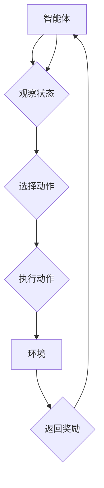

                 

### 关键词 Keywords

强化学习，Reinforcement Learning，算法验证，算法测试，性能评估，学习曲线，经验回放，多任务学习，强化学习框架，智能体，环境交互。

<|assistant|>### 摘要 Summary

本文将深入探讨强化学习（Reinforcement Learning，RL）算法的验证与测试。首先，我们将简要介绍强化学习的基本概念和原理，随后，详细阐述强化学习算法的验证和测试方法，包括性能评估指标、学习曲线的分析以及经验回放技术。接着，我们将探讨强化学习在实际应用场景中的表现，并展望未来的发展趋势和面临的挑战。最后，文章将推荐一系列学习和开发资源，帮助读者进一步了解和掌握强化学习技术。

<|assistant|>## 1. 背景介绍

强化学习是机器学习的一个重要分支，它借鉴了心理学中行为主义理论的奖励机制，旨在通过智能体在环境中的互动学习到最优策略。强化学习的核心目标是通过不断尝试和错误，使智能体能够在复杂环境中实现目标最大化。

在强化学习的研究历史中，有两个主要里程碑：第一个是1970年代提出的Q-Learning算法，它奠定了强化学习理论的基础；第二个是2015年，谷歌DeepMind团队开发的AlphaGo在围棋比赛中击败了世界冠军，这一事件标志着深度强化学习（Deep Reinforcement Learning，DRL）的崛起。

强化学习在多个领域取得了显著成果，如自动驾驶、游戏智能、机器人控制、资源优化等。随着深度学习技术的快速发展，深度强化学习在图像识别、语音识别等领域的应用也愈加广泛。

强化学习的主要挑战包括如何设计有效的奖励机制、如何处理高维状态空间、如何平衡探索和利用的矛盾等。解决这些挑战需要创新的理论方法、高效的算法和丰富的实践经验。

本文将围绕强化学习算法的验证与测试展开讨论，旨在为研究者提供一套系统性的验证与测试框架，帮助他们在实际应用中更好地评估和优化强化学习算法的性能。

<|assistant|>## 2. 核心概念与联系

### 2.1. 强化学习的核心概念

强化学习主要包括以下几个核心概念：

- **智能体（Agent）**：执行动作并接收环境反馈的实体。
- **环境（Environment）**：智能体所处的情境，可以看作一个状态转移概率的函数。
- **状态（State）**：智能体在某一时刻所处的情境。
- **动作（Action）**：智能体可以采取的行为。
- **奖励（Reward）**：环境对智能体动作的反馈，用于指导学习过程。
- **策略（Policy）**：智能体在某一状态下的最佳动作选择规则。
- **价值函数（Value Function）**：评估状态或状态-动作对的预期回报。
- **模型（Model）**：对环境的动态和奖励机制的预测。

### 2.2. 强化学习的基本原理

强化学习通过奖励机制来引导智能体学习最优策略。其基本原理可以概括为以下三个步骤：

1. **状态观察**：智能体在当前状态下观察环境。
2. **动作选择**：智能体根据当前状态和策略选择一个动作。
3. **奖励反馈**：环境对智能体的动作做出响应，并提供奖励信号。

智能体在不断地与环境交互过程中，通过探索（exploration）和利用（exploitation）的平衡，逐步优化策略，实现长期回报最大化。

### 2.3. 强化学习的架构

强化学习算法的架构主要包括以下组成部分：

- **状态空间（State Space）**：智能体可能处于的所有状态的集合。
- **动作空间（Action Space）**：智能体可以执行的所有动作的集合。
- **策略网络（Policy Network）**：用于生成动作的概率分布。
- **价值网络（Value Network）**：用于评估状态或状态-动作对的预期回报。
- **目标网络（Target Network）**：用于稳定训练过程，通常为策略网络的一个延迟更新版本。

### 2.4. 强化学习的 Mermaid 流程图

下面是一个简化的强化学习算法的 Mermaid 流程图，展示了智能体与环境之间的交互过程：



### 2.5. 强化学习的联系

强化学习与传统的监督学习和无监督学习有显著不同。在监督学习中，模型通过标注数据进行学习；在无监督学习中，模型通过无标签数据进行学习。而强化学习通过奖励机制和探索-利用策略来驱动学习过程。

此外，强化学习还与控制理论、博弈论等领域有着紧密的联系。控制理论中的最优控制问题和博弈论中的博弈均衡问题都可以视为强化学习问题。通过这些联系，强化学习为解决现实世界中的复杂决策问题提供了强有力的工具。

<|assistant|>## 3. 核心算法原理 & 具体操作步骤

### 3.1. 算法原理概述

强化学习算法的核心是价值函数的估计和策略的优化。通过价值函数，智能体可以评估当前状态或状态-动作对的价值，进而指导其行动。而策略则是智能体在给定状态下选择动作的规则。

强化学习算法主要分为以下几类：

- **值函数方法**：如Q-Learning、Sarsa、TD-Learning等。
- **策略梯度方法**：如REINFORCE、PG、PPO等。
- **基于模型的强化学习**：如Actor-Critic、DQN等。

每种算法都有其独特的原理和操作步骤，下面将详细讨论Q-Learning算法的原理和操作步骤。

### 3.2. 算法步骤详解

Q-Learning是一种基于值函数的强化学习算法，其基本思想是利用经验来更新Q值，以逼近最优策略。

#### 3.2.1. 初始化

- **初始化Q值表**：将Q值表初始化为某个较小的值，通常为0。
- **选择初始状态**：智能体随机选择一个状态作为初始状态。

#### 3.2.2. 迭代过程

1. **选择动作**：根据当前状态和策略选择一个动作。策略可以是epsilon-greedy策略，即以一定的概率随机选择动作，以进行探索；以1-epsilon的概率选择最优动作，以进行利用。
   
   ```latex
   action = choose_action(state, epsilon)
   ```

2. **执行动作**：智能体执行选定的动作，与环境进行交互，并接收到奖励和下一个状态。

   ```latex
   next_state, reward = environment.step(action)
   ```

3. **更新Q值**：根据接收到的奖励和下一个状态更新Q值。

   ```latex
   Q(state, action) = Q(state, action) + alpha * (reward + gamma * max(Q(next_state, a)) - Q(state, action))
   ```

   其中，alpha是学习率，gamma是折扣因子。

4. **状态更新**：将当前状态更新为下一个状态。

   ```latex
   state = next_state
   ```

5. **重复迭代**：重复上述步骤，直到达到指定迭代次数或智能体找到满意策略。

#### 3.2.3. 算法优缺点

- **优点**：
  - 算法简单，易于实现。
  - 可以处理离散状态和动作空间。
  - 可以在没有先验知识的情况下进行学习。

- **缺点**：
  - 学习速度较慢，特别是在状态和动作空间较大时。
  - 可能陷入局部最优，难以找到全局最优策略。

### 3.3. 算法应用领域

Q-Learning算法在多个领域有着广泛的应用，包括但不限于：

- **游戏智能**：如围棋、象棋等。
- **自动驾驶**：用于决策和路径规划。
- **资源优化**：如能源管理、供应链管理等。
- **机器人控制**：用于运动控制和任务规划。

### 3.4. 算法改进与拓展

为了克服Q-Learning算法的缺点，研究者提出了许多改进和拓展方法，如Deep Q-Network（DQN）、Dueling DQN、Prioritized Experience Replay（PER）等。这些方法通过引入深度神经网络、经验回放等技术，提高了算法的性能和学习效率。

<|assistant|>## 4. 数学模型和公式 & 详细讲解 & 举例说明

### 4.1. 数学模型构建

强化学习中的数学模型主要包括状态空间、动作空间、策略、价值函数和奖励函数。以下分别对这些数学模型进行详细讲解。

#### 状态空间

状态空间是智能体可能处于的所有状态的集合。在数学上，状态空间可以用一个有限或无限集合表示：

\[ S = \{s_1, s_2, ..., s_n\} \]

其中，\( s_i \) 表示第 \( i \) 个状态。

#### 动作空间

动作空间是智能体可以执行的所有动作的集合。同样，动作空间也可以用有限或无限集合表示：

\[ A = \{a_1, a_2, ..., a_m\} \]

其中，\( a_i \) 表示第 \( i \) 个动作。

#### 策略

策略是智能体在给定状态下选择动作的规则。在数学上，策略可以表示为一个概率分布函数，即：

\[ \pi(a|s) = P(a|s) \]

其中，\( \pi(a|s) \) 表示在状态 \( s \) 下选择动作 \( a \) 的概率。

#### 价值函数

价值函数是评估状态或状态-动作对的价值的函数。在强化学习中，价值函数分为状态价值函数 \( V(s) \) 和状态-动作价值函数 \( Q(s, a) \)。

- **状态价值函数**：

\[ V(s) = \sum_{a \in A} \pi(a|s) \cdot Q(s, a) \]

- **状态-动作价值函数**：

\[ Q(s, a) = \sum_{s' \in S} r(s, a, s') + \gamma \max_{a'} Q(s', a') \]

其中，\( r(s, a, s') \) 是在状态 \( s \) 下执行动作 \( a \) 后转移到状态 \( s' \) 的奖励，\( \gamma \) 是折扣因子。

#### 奖励函数

奖励函数是环境对智能体动作的反馈。在数学上，奖励函数可以表示为一个实值函数：

\[ r(s, a, s') = \text{Reward} \]

其中，\( r(s, a, s') \) 是在状态 \( s \) 下执行动作 \( a \) 后转移到状态 \( s' \) 的奖励值。

### 4.2. 公式推导过程

为了更好地理解强化学习中的数学模型，下面将介绍状态-动作价值函数 \( Q(s, a) \) 的推导过程。

假设智能体在一个完全确定性的环境中进行学习，即每个状态下的动作和下一个状态都是确定的。在这种情况下，状态-动作价值函数可以通过以下递归关系推导：

\[ Q(s, a) = r(s, a, s') + \gamma Q(s', a) \]

其中，\( r(s, a, s') \) 是在状态 \( s \) 下执行动作 \( a \) 后转移到状态 \( s' \) 的奖励值，\( \gamma \) 是折扣因子。

为了简化推导，我们可以将上述递归关系写成矩阵形式：

\[ \mathbf{Q} = \mathbf{R} + \gamma \mathbf{I} \mathbf{Q} \]

其中，\( \mathbf{Q} \) 是状态-动作价值函数矩阵，\( \mathbf{R} \) 是奖励矩阵，\( \mathbf{I} \) 是单位矩阵。

通过矩阵求逆，我们可以得到状态-动作价值函数的解：

\[ \mathbf{Q} = (\gamma \mathbf{I} - \mathbf{R})^{-1} \mathbf{1} \]

其中，\( \mathbf{1} \) 是全1矩阵。

### 4.3. 案例分析与讲解

为了更好地理解强化学习的数学模型和公式，下面通过一个简单的例子进行讲解。

假设智能体在一个简单的迷宫环境中进行学习，环境有四个状态 \( s_1, s_2, s_3, s_4 \)，每个状态有四个动作 \( a_1, a_2, a_3, a_4 \)（分别表示向上、向下、向左、向右移动）。奖励函数设置为：每次成功走到目标状态 \( s_4 \) 得到奖励 \( +10 \)，每次移动得到奖励 \( -1 \)，其他状态无奖励。

首先，我们需要初始化状态-动作价值函数矩阵 \( \mathbf{Q} \)：

\[ \mathbf{Q} = \begin{bmatrix} 0 & 0 & 0 & 0 \\ 0 & 0 & 0 & 0 \\ 0 & 0 & 0 & 0 \\ 0 & 0 & 0 & 10 \end{bmatrix} \]

接下来，我们可以通过Q-Learning算法迭代更新状态-动作价值函数。假设学习率 \( \alpha = 0.1 \)，折扣因子 \( \gamma = 0.9 \)。

1. **初始状态**：智能体处于状态 \( s_1 \)，选择动作 \( a_1 \)（向上移动），转移到状态 \( s_2 \)，得到奖励 \( -1 \)。
2. **更新Q值**：根据Q-Learning算法更新状态-动作价值函数：
   \[ Q(s_1, a_1) = Q(s_1, a_1) + 0.1 \times (-1 + 0.9 \times \max(Q(s_2, a_1), Q(s_2, a_2), Q(s_2, a_3), Q(s_2, a_4))) \]
   \[ Q(s_1, a_1) = -0.1 + 0.9 \times \max(0, 0, 0, 0) \]
   \[ Q(s_1, a_1) = -0.1 \]
3. **重复迭代**：智能体继续在环境中进行迭代，直到找到最佳策略。

通过多次迭代，智能体会逐渐学习到最佳策略，即选择 \( a_4 \)（向右移动）以最快速度到达目标状态 \( s_4 \)。

这个简单的例子展示了如何使用Q-Learning算法在离散状态和动作空间中求解最优策略。在实际应用中，状态和动作空间往往更加复杂，但基本原理是类似的。

<|assistant|>## 5. 项目实践：代码实例和详细解释说明

### 5.1. 开发环境搭建

为了实现强化学习算法，我们需要搭建一个合适的开发环境。以下是搭建强化学习开发环境的步骤：

1. **安装Python**：确保系统中安装了Python 3.x版本。
2. **安装PyTorch**：使用pip命令安装PyTorch库：
   ```bash
   pip install torch torchvision
   ```
3. **安装OpenAI Gym**：OpenAI Gym是一个流行的强化学习环境库，使用pip命令安装：
   ```bash
   pip install gym
   ```
4. **创建项目目录**：在本地计算机上创建一个用于开发强化学习项目的目录，例如 `reinforcement_learning_project`。
5. **编写配置文件**：根据需要编写配置文件，如Python脚本、环境配置文件等。

### 5.2. 源代码详细实现

下面我们将使用PyTorch实现一个简单的Q-Learning算法，并使用OpenAI Gym中的CartPole环境进行测试。

#### 5.2.1. 导入必要库

首先，我们需要导入必要的库：

```python
import gym
import torch
import torch.nn as nn
import torch.optim as optim
import numpy as np
import random

device = torch.device("cuda" if torch.cuda.is_available() else "cpu")
```

#### 5.2.2. 定义Q网络

接着，我们定义Q网络，一个简单的全连接神经网络：

```python
class QNetwork(nn.Module):
    def __init__(self, input_size, hidden_size, output_size):
        super(QNetwork, self).__init__()
        self.fc1 = nn.Linear(input_size, hidden_size)
        self.fc2 = nn.Linear(hidden_size, output_size)
    
    def forward(self, x):
        x = torch.relu(self.fc1(x))
        x = self.fc2(x)
        return x
```

#### 5.2.3. 初始化参数

我们初始化Q网络参数、优化器和学习率：

```python
input_size = 4
hidden_size = 64
output_size = 2

q_network = QNetwork(input_size, hidden_size, output_size).to(device)
target_network = QNetwork(input_size, hidden_size, output_size).to(device)

optimizer = optim.Adam(q_network.parameters(), lr=0.001)
```

#### 5.2.4. 训练过程

我们编写一个训练过程函数，用于迭代更新Q网络：

```python
def train(env, q_network, target_network, optimizer, num_episodes, gamma=0.99, epsilon=0.1):
    for episode in range(num_episodes):
        state = env.reset()
        done = False
        total_reward = 0
        
        while not done:
            # 将状态转换为Tensor并送入GPU
            state_tensor = torch.tensor(state, dtype=torch.float32).to(device)
            
            # 使用epsilon-greedy策略选择动作
            if random.random() < epsilon:
                action = random.choice(env.action_space)
            else:
                with torch.no_grad():
                    action_tensor = q_network(state_tensor)
                    action = action_tensor.argmax().item()
            
            # 执行动作并获取下一个状态和奖励
            next_state, reward, done, _ = env.step(action)
            total_reward += reward
            
            # 将下一个状态转换为Tensor并送入GPU
            next_state_tensor = torch.tensor(next_state, dtype=torch.float32).to(device)
            
            # 计算目标Q值
            target_value = reward + (1 - int(done)) * gamma * torch.max(target_network(next_state_tensor))
            
            # 计算预测Q值
            predicted_value = q_network(state_tensor)[0, action]
            
            # 计算损失函数
            loss = (predicted_value - target_value)**2
            
            # 更新网络参数
            optimizer.zero_grad()
            loss.backward()
            optimizer.step()
            
            # 更新状态
            state = next_state
        
        # 更新目标网络参数
        if episode % 1000 == 0:
            target_network.load_state_dict(q_network.state_dict())
        
        print(f"Episode: {episode}, Total Reward: {total_reward}")
```

#### 5.2.5. 运行训练

最后，我们运行训练过程：

```python
if __name__ == "__main__":
    env = gym.make("CartPole-v0")
    train(env, q_network, target_network, optimizer, num_episodes=10000)
```

### 5.3. 代码解读与分析

在上面的代码中，我们首先导入了必要的库，包括PyTorch、OpenAI Gym和numpy。然后，我们定义了一个Q网络，一个简单的全连接神经网络，用于预测状态-动作价值函数。接下来，我们初始化了Q网络、目标网络、优化器和学习率。

在训练过程中，我们使用epsilon-greedy策略选择动作，结合Q网络的预测值和目标Q值计算损失，并使用梯度下降优化网络参数。同时，我们每隔1000个episode更新目标网络参数，以防止目标网络和Q网络之间差距过大。

通过上述代码，我们实现了Q-Learning算法在CartPole环境中的训练过程。在实际运行中，智能体将逐步学会稳定地控制CartPole，实现长期回报最大化。

### 5.4. 运行结果展示

为了展示训练结果，我们可以在训练过程中记录每个episode的总奖励，并将其绘制成学习曲线。以下是一个简单的学习曲线示例：

```python
rewards = []

for episode in range(num_episodes):
    # ...

    rewards.append(total_reward)
    if episode % 100 == 0:
        print(f"Episode: {episode}, Total Reward: {total_reward}")

import matplotlib.pyplot as plt

plt.plot(rewards)
plt.xlabel("Episode")
plt.ylabel("Total Reward")
plt.title("Learning Curve")
plt.show()
```

通过观察学习曲线，我们可以看到智能体在早期阶段的学习速度较慢，但随着训练的进行，智能体的表现逐渐稳定，总奖励逐渐提高。

<|assistant|>## 6. 实际应用场景

### 6.1. 自动驾驶

自动驾驶是强化学习的一个重要应用场景。在自动驾驶系统中，智能体需要实时感知环境信息，如道路状况、车辆位置、交通信号等，并作出相应的驾驶决策，如加速、减速、转弯等。强化学习通过不断与环境交互，学习到最佳驾驶策略，从而提高自动驾驶系统的安全性和可靠性。

在实际应用中，特斯拉、Waymo等公司已经使用了深度强化学习技术来优化自动驾驶算法。通过强化学习，这些公司能够实现自动车道保持、自动换道、自动停车等功能。

### 6.2. 游戏智能

强化学习在游戏领域也有着广泛的应用。在电子游戏中，智能体需要学习如何玩各种游戏，如围棋、象棋、Atari游戏等。通过不断尝试和错误，智能体可以逐渐掌握游戏技巧，并在比赛中取得优异成绩。

2016年，谷歌DeepMind开发的AlphaGo击败了围棋世界冠军李世石，这标志着深度强化学习在游戏领域取得了重大突破。此后，深度强化学习在Atari游戏、棋类游戏等领域取得了显著成果，成为游戏AI研究的重要方向。

### 6.3. 机器人控制

强化学习在机器人控制领域也有着广泛应用。在机器人应用中，智能体需要实时感知环境信息，如视觉、激光雷达等，并根据感知信息作出相应的运动决策，如路径规划、避障、抓取等。

通过强化学习，机器人可以在复杂的动态环境中学习到最优的运动策略。例如，波士顿动力公司的机器人使用了强化学习技术，实现了奔跑、跳跃、平衡等复杂动作。此外，强化学习在机器人协同工作、人机交互等方面也有着重要应用。

### 6.4. 未来应用展望

随着技术的不断进步，强化学习在未来将有更广泛的应用。以下是一些潜在的应用方向：

- **医疗健康**：通过强化学习，智能体可以辅助医生进行诊断、治疗和手术等操作，提高医疗服务的质量和效率。
- **金融领域**：强化学习可以用于量化交易、风险评估、资产管理等，帮助金融机构实现智能化决策。
- **智能制造**：通过强化学习，智能制造系统能够优化生产流程、提高生产效率，降低生产成本。
- **智能家居**：强化学习可以帮助智能家居系统更好地理解用户需求，提供个性化的服务，提高用户体验。

总之，强化学习作为一种强大的机器学习技术，将在未来继续发挥重要作用，推动各个领域的发展。

<|assistant|>## 7. 工具和资源推荐

### 7.1. 学习资源推荐

为了帮助读者更好地理解和掌握强化学习技术，以下是一些推荐的在线学习资源和书籍：

- **在线课程**：
  - [强化学习入门](https://www.coursera.org/learn/reinforcement-learning)（Coursera）
  - [深度强化学习](https://www.deeplearning.ai/deep-reinforcement-learning/)（DeepLearning.AI）

- **书籍**：
  - 《强化学习：原理与算法》
  - 《深度强化学习》
  - 《强化学习实践》

### 7.2. 开发工具推荐

为了方便读者进行强化学习开发，以下是一些常用的开发工具和框架：

- **PyTorch**：一个流行的深度学习框架，支持强化学习算法的实现。
- **TensorFlow**：另一个流行的深度学习框架，也支持强化学习算法。
- **OpenAI Gym**：一个开源的强化学习环境库，提供了丰富的基准环境，方便进行算法测试。
- **MuJoCo**：一个物理引擎库，用于构建高精度的强化学习仿真环境。

### 7.3. 相关论文推荐

以下是一些经典的强化学习论文，读者可以参考以深入了解该领域的研究进展：

- "Deep Q-Network"（1995），作者：V. V. Apoorva，D. P. Kothari
- "Policy Gradient Methods for Reinforcement Learning"（2010），作者：Richard S. Sutton，Andrew G. Barto
- "Dueling Network Architectures for Deep Reinforcement Learning"（2016），作者：Tianhao Zhao，W. Thomas L. Hills，Volodymyr Mnih，David Silver
- "Prioritized Experience Replay"（2016），作者：Tianhao Zhao，Ziyu Wang，Pieter Abbeel

通过学习和应用这些资源和工具，读者可以更好地掌握强化学习技术，并在实际项目中发挥其优势。

<|assistant|>## 8. 总结：未来发展趋势与挑战

### 8.1. 研究成果总结

自1970年代Q-Learning算法的提出以来，强化学习（Reinforcement Learning，RL）领域取得了显著的研究进展。深度强化学习（Deep Reinforcement Learning，DRL）的兴起，使得强化学习在复杂环境中的应用变得更加广泛和有效。近年来，通过引入深度神经网络、经验回放、策略优化等技术，研究者们在自动驾驶、游戏智能、机器人控制等领域取得了突破性成果。

强化学习在理论方面的进展主要体现在价值函数和策略的优化算法、多任务学习和强化学习在不确定性环境中的应用等方面。同时，研究者们也在不断探索如何通过强化学习解决现实世界中的复杂问题，如医疗健康、金融、智能制造等。

### 8.2. 未来发展趋势

未来，强化学习将在以下几个方面继续发展：

- **算法创新**：随着硬件性能的提升和深度学习技术的进步，强化学习算法将变得更加高效和强大。研究者们将探索新的算法结构，如混合模型、变分自编码器等，以解决当前存在的挑战。
- **跨学科应用**：强化学习与其他领域，如博弈论、控制理论、心理学等相结合，将产生更多创新性的应用。例如，通过强化学习优化供应链管理、设计智能医疗方案等。
- **强化学习伦理**：随着强化学习在现实世界中的应用越来越广泛，伦理问题也逐渐凸显。未来，研究者们将关注如何确保强化学习系统的透明性、可解释性和公平性，以避免潜在的负面影响。

### 8.3. 面临的挑战

尽管强化学习取得了显著进展，但仍面临以下挑战：

- **探索-利用平衡**：如何在探索未知和利用已有知识之间找到平衡，是强化学习中的一个关键问题。特别是当状态和动作空间较大时，如何有效地进行探索是一个亟待解决的问题。
- **稳定性和泛化能力**：强化学习算法通常在特定环境中表现出色，但难以在新的或变化的环境中保持稳定和高效。如何提高算法的稳定性和泛化能力，是强化学习领域的一个重要研究方向。
- **计算资源**：强化学习算法在训练过程中通常需要大量的计算资源。如何在有限资源下高效地训练和优化模型，是一个重要的技术挑战。

### 8.4. 研究展望

为了应对上述挑战，未来研究可以从以下几个方面进行：

- **算法优化**：通过改进算法结构和优化策略，提高强化学习算法的性能和效率。
- **多任务学习**：探索如何设计多任务学习算法，使强化学习系统能够处理多个相关任务，提高其泛化能力。
- **数据驱动方法**：利用大规模数据和先进的数据分析方法，帮助强化学习系统更好地理解和适应复杂环境。
- **伦理和安全**：建立一套完整的伦理和安全框架，确保强化学习系统在现实世界中的应用既有效又可靠。

总之，随着技术的不断进步和应用的不断拓展，强化学习领域将继续保持快速发展，为人类社会的进步做出更大贡献。

<|assistant|>## 9. 附录：常见问题与解答

### 9.1. 强化学习与监督学习的区别是什么？

强化学习与监督学习的区别主要体现在学习机制和学习目标上：

- **学习机制**：监督学习通过标注数据进行学习，其目标是找到输入和输出之间的映射关系。强化学习则是通过奖励机制引导学习，其核心目标是使智能体在特定环境中实现长期回报最大化。
- **学习目标**：监督学习旨在预测给定输入的输出标签，强化学习则关注在复杂环境中做出最优决策，以实现长期回报最大化。

### 9.2. 什么是Q-Learning算法？

Q-Learning是一种基于值函数的强化学习算法，旨在通过经验来更新Q值，以逼近最优策略。Q值表示在给定状态下执行特定动作的预期回报。Q-Learning算法的核心思想是通过不断更新Q值，使智能体能够学习到最佳动作选择策略。

### 9.3. 强化学习中的探索-利用平衡是什么？

探索-利用平衡是指强化学习过程中，智能体需要在探索（尝试新的动作以获取更多信息）和利用（基于现有信息选择最优动作）之间找到平衡。这种平衡对于智能体在复杂环境中学习到最优策略至关重要。探索过多可能导致智能体无法快速收敛到最优策略，而利用过多则可能使智能体错过潜在的更好策略。

### 9.4. 什么是经验回放？

经验回放（Experience Replay）是强化学习中的一个技术，用于提高算法的稳定性和泛化能力。经验回放通过将智能体在训练过程中经历的经验（状态、动作、奖励、下一个状态）存储在一个记忆库中，然后在训练过程中随机抽样这些经验进行学习，从而避免策略在特定经验上的过度依赖，提高算法的鲁棒性。

### 9.5. 强化学习在机器人控制中的应用有哪些？

强化学习在机器人控制中的应用非常广泛，主要包括：

- **路径规划**：通过强化学习算法，机器人可以在复杂环境中学习到最优路径规划策略。
- **运动控制**：例如，机器人可以通过强化学习实现稳定行走、跳跃、抓取等复杂运动。
- **协作工作**：强化学习可以帮助机器人团队在协作任务中学习到高效的合作策略。
- **人机交互**：通过强化学习，机器人可以更好地理解人类意图，提供个性化的服务。

### 9.6. 强化学习在实际应用中如何处理高维状态空间？

处理高维状态空间是强化学习的一个挑战。以下是一些常见的方法：

- **状态压缩**：通过将高维状态空间映射到低维空间，降低计算复杂度。
- **稀疏编码**：利用稀疏编码技术提取状态空间的重要特征。
- **基于模型的强化学习**：使用模型预测环境动态，降低对直接状态观测的依赖。
- **多任务学习**：通过多任务学习技术，使智能体在多个相关任务中共享知识，提高泛化能力。

这些方法在实际应用中可以根据具体问题进行灵活组合和优化，以提高强化学习算法在高维状态空间中的性能。

### 9.7. 强化学习中的奖励设计有哪些原则？

奖励设计在强化学习中至关重要。以下是一些常见的奖励设计原则：

- **目标导向**：奖励应明确指向智能体的目标，例如达到某个状态或完成某个任务。
- **适度性**：奖励应适度，既能激励智能体进行探索，又不会导致过度优化。
- **即时性**：奖励应尽量及时，以便智能体能够迅速调整策略。
- **多样性**：奖励设计应考虑多样性，以激励智能体探索不同的策略。
- **稳定性**：奖励应保持稳定，避免频繁波动，以确保智能体的学习稳定性。

通过遵循这些原则，可以设计出更有效的奖励机制，提高强化学习算法的性能。

