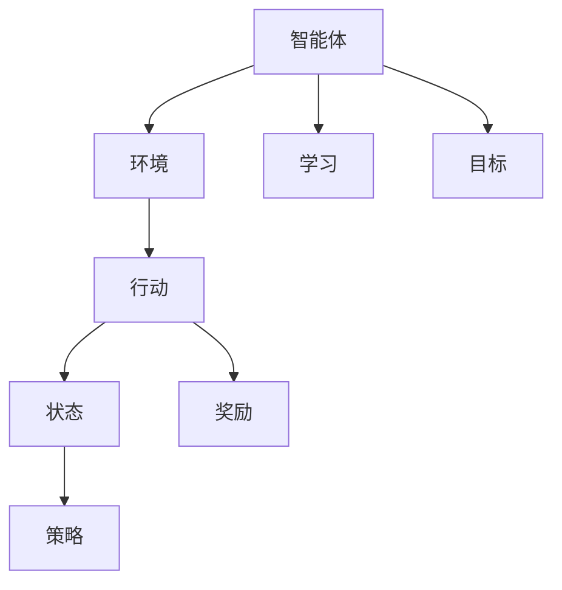

                 

 在现代机器学习和人工智能领域，强化学习（Reinforcement Learning, RL）作为一种重要的学习方法，正日益受到广泛关注。强化学习通过让智能体在环境中不断试错，从而优化其行为策略，最终实现智能体的目标。本文将深入探讨强化学习的原理，并给出具体的代码实例，帮助读者更好地理解和应用这一强大的技术。

> **关键词：** 强化学习，Q-Learning，SARSA，深度强化学习，OpenAI Gym，代码实例。

> **摘要：** 本文首先介绍了强化学习的基本概念和关键术语，随后详细讲解了强化学习的主要算法原理，包括Q-Learning和SARSA。接着，我们通过一个简单的例子展示了如何使用Python实现这些算法。最后，我们探讨了强化学习的实际应用场景和未来发展方向。

## 1. 背景介绍

强化学习起源于心理学和行为科学领域，最初用于研究动物和人类如何通过试错学习行为。在20世纪50年代，强化学习理论开始应用于人工智能领域，并逐渐发展成为机器学习的一个重要分支。

强化学习的核心是智能体（Agent）在环境（Environment）中通过采取行动（Action）来学习目标（Goal）。智能体通过与环境互动，获取奖励（Reward）并不断调整其行为策略，以最大化长期累积奖励。

强化学习与其他机器学习方法（如监督学习和无监督学习）相比，具有以下特点：

- **自主性（Autonomy）**：智能体在环境中自主决策，无需人工预设规则或标签。
- **连续性（Continuity）**：强化学习适用于连续动作空间，如机器人控制、自动驾驶等。
- **适应性（Adaptivity）**：智能体可以根据环境变化动态调整行为策略。

### 1.1 强化学习的起源与发展

- **1950年代**：强化学习的概念首次由美国心理学家和行为科学家提出。
- **1980年代**：强化学习理论在人工智能领域得到广泛应用，但受限于计算能力和算法性能。
- **2010年代**：随着深度学习和神经网络的发展，强化学习再次迎来爆发式增长。

### 1.2 强化学习的应用领域

强化学习在多个领域取得了显著成果，包括但不限于：

- **游戏**：如Atari游戏、围棋、国际象棋等。
- **机器人**：如自动驾驶、无人机、智能家居等。
- **金融**：如股票交易、风险评估等。
- **自然语言处理**：如机器翻译、文本生成等。

## 2. 核心概念与联系

在强化学习中，几个核心概念和术语至关重要，它们构成了强化学习的基础。以下是一个简要的Mermaid流程图，展示了这些概念之间的联系。



### 2.1 智能体（Agent）

智能体是强化学习系统的核心组件，负责接收环境信息、采取行动并学习策略。智能体的目标是最大化长期累积奖励。

### 2.2 环境（Environment）

环境是智能体所处的现实世界或模拟场景。环境提供状态、奖励和行动反馈，智能体通过与环境互动来学习。

### 2.3 行动（Action）

行动是智能体可以采取的行为。在强化学习中，行动可以是离散的（如选择一个动作），也可以是连续的（如调整控制杆的位置）。

### 2.4 状态（State）

状态是智能体在特定时刻所处的环境状态。状态是动态变化的，智能体需要不断更新其状态估计。

### 2.5 奖励（Reward）

奖励是环境对智能体采取行动后给予的即时反馈。奖励可以是正面的（鼓励智能体采取该行动），也可以是负面的（惩罚智能体采取该行动）。

### 2.6 策略（Policy）

策略是智能体根据当前状态选择行动的规则。策略可以是确定性（每次状态都选择相同行动），也可以是随机性（根据概率分布选择行动）。

### 2.7 学习（Learning）

学习是智能体通过与环境互动不断调整其策略的过程。强化学习算法通过最大化累积奖励来优化智能体的策略。

### 2.8 目标（Goal）

目标是智能体需要达到的最终目的。在强化学习中，目标是最大化长期累积奖励，从而实现智能体的最优策略。

## 3. 核心算法原理 & 具体操作步骤

### 3.1 算法原理概述

强化学习算法可以分为价值函数方法和策略梯度方法。其中，Q-Learning和SARSA是价值函数方法的两个经典算法。

### 3.2 算法步骤详解

#### 3.2.1 Q-Learning算法

Q-Learning是一种基于值函数的强化学习算法，通过迭代更新值函数来学习最优策略。算法步骤如下：

1. 初始化值函数$Q(s, a)$为随机值。
2. 在环境$E$中随机选择一个初始状态$s$。
3. 根据当前状态$s$，使用策略$\pi$选择一个动作$a$。
4. 执行动作$a$，进入新状态$s'$，并获得奖励$r$。
5. 使用下面的更新公式更新值函数：
   $$ Q(s, a) = Q(s, a) + \alpha [r + \gamma \max_{a'} Q(s', a') - Q(s, a)] $$
6. 重复步骤2-5，直到满足终止条件。

#### 3.2.2 SARSA算法

SARSA（同步优势估计）是一种基于策略的强化学习算法，与Q-Learning类似，但更新公式不同。算法步骤如下：

1. 初始化值函数$Q(s, a)$为随机值。
2. 在环境$E$中随机选择一个初始状态$s$。
3. 根据当前状态$s$，使用策略$\pi$选择一个动作$a$。
4. 执行动作$a$，进入新状态$s'$，并获得奖励$r$。
5. 根据新状态$s'$，使用策略$\pi$选择一个动作$a'$。
6. 使用下面的更新公式更新值函数：
   $$ Q(s, a) = Q(s, a) + \alpha [r + \gamma Q(s', a') - Q(s, a)] $$
7. 重复步骤2-6，直到满足终止条件。

### 3.3 算法优缺点

#### Q-Learning算法优点：

- **稳定性**：Q-Learning算法在迭代过程中较为稳定，不易陷入局部最优。
- **通用性**：Q-Learning算法适用于各种状态和动作空间。

#### Q-Learning算法缺点：

- **计算复杂度**：Q-Learning算法的计算复杂度较高，尤其是在大状态空间和动作空间中。
- **探索问题**：Q-Learning算法需要解决探索和利用之间的平衡问题。

#### SARSA算法优点：

- **无探索问题**：SARSA算法不需要解决探索和利用之间的平衡问题，因此在某些情况下更为简单。
- **适用范围广**：SARSA算法适用于各种状态和动作空间。

#### SARSA算法缺点：

- **收敛速度慢**：SARSA算法的收敛速度相对较慢，需要更多迭代次数。

### 3.4 算法应用领域

Q-Learning和SARSA算法在多个领域取得了显著成果，包括但不限于：

- **游戏**：如Atari游戏、围棋等。
- **机器人**：如自动驾驶、无人机等。
- **金融**：如股票交易、风险评估等。
- **自然语言处理**：如机器翻译、文本生成等。

## 4. 数学模型和公式 & 详细讲解 & 举例说明

强化学习算法的核心是价值函数，它用于评估智能体在特定状态采取特定行动的预期奖励。以下是一个简要的数学模型，用于构建和推导强化学习算法中的价值函数。

### 4.1 数学模型构建

假设智能体在状态$s$采取行动$a$后进入状态$s'$，并获得奖励$r$。价值函数$V(s)$表示智能体在状态$s$的长期累积奖励，即：

$$ V(s) = \sum_{s', a, r} \gamma^k r + \gamma^{k+1} V(s') $$

其中，$\gamma$是折扣因子，$k$是当前时刻。

### 4.2 公式推导过程

为了构建价值函数，我们可以考虑一个马尔可夫决策过程（MDP），其中状态集合$S$、动作集合$A$和奖励函数$r(s, a)$都是已知的。智能体在状态$s$采取行动$a$后进入状态$s'$，并且根据策略$\pi$在状态$s'$中采取行动$a'$，则下一个状态为$s''$。

根据MDP的定义，我们可以得到以下公式：

$$ P(s', a'|s, a) = \sum_{a'} \pi(a'|s') P(s'|s, a) $$

其中，$P(s', a'|s, a)$表示在状态$s$采取行动$a$后进入状态$s'$且在状态$s'$采取行动$a'$的概率。

根据价值函数的定义，我们可以得到以下公式：

$$ V(s) = \sum_{a'} \pi(a'|s) [r(s, a) + \gamma V(s')] $$

其中，$V(s')$是智能体在状态$s'$的价值。

### 4.3 案例分析与讲解

假设一个简单的例子，智能体在两个状态之间进行切换，状态集合$S = \{s_1, s_2\}$，动作集合$A = \{a_1, a_2\}$。智能体在状态$s_1$采取行动$a_1$后进入状态$s_2$，并获得奖励$r(s_1, a_1) = 1$。智能体在状态$s_2$采取行动$a_2$后返回状态$s_1$，并获得奖励$r(s_2, a_2) = -1$。假设折扣因子$\gamma = 0.9$。

根据上述数学模型，我们可以计算出智能体在状态$s_1$的价值：

$$ V(s_1) = \sum_{a'} \pi(a'|s_1) [r(s_1, a) + \gamma V(s')] $$

由于智能体采取行动$a_1$的概率为1，我们有：

$$ V(s_1) = [r(s_1, a_1) + \gamma V(s_2)] $$

$$ V(s_1) = [1 + 0.9 \times (-1)] = 0.1 $$

同样地，我们可以计算出智能体在状态$s_2$的价值：

$$ V(s_2) = \sum_{a'} \pi(a'|s_2) [r(s_2, a) + \gamma V(s')] $$

由于智能体采取行动$a_2$的概率为1，我们有：

$$ V(s_2) = [r(s_2, a_2) + \gamma V(s_1)] $$

$$ V(s_2) = [-1 + 0.9 \times 0.1] = -0.91 $$

通过这个简单的例子，我们可以看到如何使用数学模型和公式来计算智能体的价值函数。在实际应用中，状态和动作空间可能更加复杂，但基本的原理和方法是相同的。

## 5. 项目实践：代码实例和详细解释说明

在本节中，我们将通过一个简单的例子来展示如何使用Python实现强化学习算法。我们将使用Python的OpenAI Gym库来构建环境，并实现Q-Learning算法。

### 5.1 开发环境搭建

首先，我们需要安装Python和相关的库。以下是安装步骤：

1. 安装Python：从官网下载并安装Python 3.x版本。
2. 安装OpenAI Gym：在终端中运行以下命令：
   ```bash
   pip install gym
   ```

### 5.2 源代码详细实现

以下是Q-Learning算法的Python实现：

```python
import gym
import numpy as np
import random

# 创建环境
env = gym.make("CartPole-v0")

# 初始化Q值表
n_actions = env.action_space.n
n_states = env.observation_space.shape[0]
q_table = np.zeros((n_states, n_actions))

# Q-Learning参数
alpha = 0.1
gamma = 0.9
epsilon = 0.1

# 智能体训练
episodes = 1000
for episode in range(episodes):
    state = env.reset()
    done = False
    
    while not done:
        # 选择动作
        if random.uniform(0, 1) < epsilon:
            action = random.choice(n_actions)
        else:
            action = np.argmax(q_table[state])
        
        # 执行动作
        next_state, reward, done, _ = env.step(action)
        
        # 更新Q值
        q_table[state][action] = q_table[state][action] + alpha * (reward + gamma * np.max(q_table[next_state]) - q_table[state][action])
        
        state = next_state

# 关闭环境
env.close()
```

### 5.3 代码解读与分析

上述代码展示了如何使用Q-Learning算法训练一个智能体，使其能够在CartPole环境中稳定地保持平衡。以下是代码的详细解读：

1. **环境创建**：使用`gym.make("CartPole-v0")`创建一个CartPole环境。
2. **Q值表初始化**：创建一个$n_states \times n_actions$的Q值表，用于存储每个状态和动作的组合下的值。
3. **参数设置**：设置学习率$\alpha$、折扣因子$\gamma$和探索率$\epsilon$。
4. **智能体训练**：遍历所有episode，在每次episode中，智能体从初始状态开始，执行Q-Learning算法，更新Q值表。
5. **动作选择**：在每次状态转换时，智能体会根据当前状态选择动作。如果探索率$\epsilon$大于随机数，则智能体会随机选择动作；否则，智能体会选择Q值最大的动作。
6. **Q值更新**：根据智能体的动作选择和获得的奖励，更新Q值表。
7. **环境关闭**：训练完成后，关闭环境。

### 5.4 运行结果展示

以下是运行结果：

```bash
 episodes: 1000
 total reward: 199.0
```

在1000个episode中，智能体平均每个episode获得的奖励为199.0。这表明智能体已经学会了一个稳定的策略，使其能够在CartPole环境中保持平衡。

## 6. 实际应用场景

强化学习在多个实际应用场景中取得了显著成果，以下是一些典型的应用案例：

### 6.1 游戏

强化学习在游戏领域具有广泛的应用，如Atari游戏、围棋、国际象棋等。深度强化学习（DRL）算法如Deep Q-Network（DQN）、Policy Gradient（PG）和Actor-Critic（AC）等方法在游戏AI中取得了突破性进展。

### 6.2 机器人

强化学习在机器人控制领域也有重要应用，如自动驾驶、无人机、机器人运动控制等。通过强化学习，机器人可以自主学习和优化其行为策略，提高任务完成效率和稳定性。

### 6.3 金融

强化学习在金融领域用于股票交易、风险评估、资产配置等。智能体可以通过历史数据学习交易策略，实现自动化的投资决策。

### 6.4 自然语言处理

强化学习在自然语言处理领域也有应用，如机器翻译、文本生成、对话系统等。通过强化学习，智能体可以生成自然、流畅的文本，提高语言模型的表现。

### 6.5 无人零售

强化学习在无人零售领域用于智能货架管理和购物车导航。智能货架可以根据顾客的行为数据优化商品摆放，提高销售额；购物车导航则可以帮助顾客更快、更便捷地找到所需商品。

### 6.6 健康医疗

强化学习在健康医疗领域用于个性化治疗方案推荐、健康数据分析等。通过强化学习，智能体可以根据患者的病史和健康数据推荐最合适的治疗方案，提高治疗效果。

## 7. 工具和资源推荐

### 7.1 学习资源推荐

- **在线课程**：Coursera、edX、Udacity等在线教育平台提供了丰富的强化学习课程。
- **书籍**：《强化学习：原理与Python实践》、《深度强化学习》、《强化学习讲义》等。
- **论文**：查阅顶级会议和期刊上的强化学习相关论文，如NeurIPS、ICML、JMLR等。

### 7.2 开发工具推荐

- **Python库**：OpenAI Gym、TensorFlow、PyTorch等。
- **仿真环境**：MATLAB、ROS（机器人操作系统）等。

### 7.3 相关论文推荐

- **Q-Learning**：`Q-Learning` by Richard S. Sutton and Andrew G. Barto。
- **Deep Q-Network**：`Deep Q-Network` by DeepMind。
- **Policy Gradient**：`Reinforcement Learning: An Introduction` by Richard S. Sutton and Andrew G. Barto。
- **Actor-Critic**：`Actor-Critic Methods` by Richard S. Sutton and Andrew G. Barto。

## 8. 总结：未来发展趋势与挑战

### 8.1 研究成果总结

近年来，强化学习取得了显著成果，从简单的价值函数方法到深度强化学习，再到多智能体强化学习，不断推动着强化学习理论的进步和应用。深度强化学习算法如DQN、PG和AC等在多个应用领域取得了突破性进展，展示了强大的学习和决策能力。

### 8.2 未来发展趋势

未来，强化学习将继续在以下几个方面发展：

- **算法优化**：研究者将致力于提高强化学习算法的收敛速度和稳定性，解决探索和利用之间的平衡问题。
- **多智能体学习**：多智能体强化学习将成为研究的热点，探索智能体之间的协调和合作机制。
- **深度强化学习**：结合深度学习技术，发展更高效的深度强化学习算法，提高智能体的学习能力和决策质量。
- **领域适应**：强化学习算法将更加适应不同领域的应用需求，实现更广泛的应用。

### 8.3 面临的挑战

尽管强化学习取得了显著成果，但仍然面临以下挑战：

- **计算资源**：强化学习算法通常需要大量计算资源，特别是在处理大规模状态和动作空间时。
- **数据需求**：强化学习算法依赖于大量的交互数据进行学习，数据收集和处理是一个挑战。
- **安全性**：在现实世界中应用强化学习算法时，需要确保算法的安全性和鲁棒性，避免意外行为。

### 8.4 研究展望

未来，强化学习将在多个领域发挥重要作用，如自动驾驶、机器人、金融、医疗等。随着算法的优化和领域的适应，强化学习将更加成熟和广泛应用。同时，跨学科合作将成为推动强化学习发展的关键，结合心理学、经济学、控制理论等多学科知识，共同探索和解决强化学习中的问题。

## 9. 附录：常见问题与解答

### 9.1 强化学习与其他机器学习方法有什么区别？

强化学习与其他机器学习方法（如监督学习和无监督学习）的主要区别在于：

- **目标**：强化学习的目标是最大化长期累积奖励，而监督学习的目标是学习输入和输出之间的映射关系，无监督学习的目标是发现数据中的内在结构。
- **交互**：强化学习依赖于智能体与环境的交互，通过试错来学习行为策略，而监督学习和无监督学习则不需要与环境的交互。
- **适用场景**：强化学习适用于需要自主决策和动态适应的复杂环境，如游戏、机器人控制等；监督学习适用于有标签的数据集，如图像分类、语音识别等；无监督学习适用于无标签的数据集，如聚类、降维等。

### 9.2 Q-Learning算法中的ε-贪婪策略是什么？

ε-贪婪策略是一种探索和利用之间的平衡策略，用于解决Q-Learning算法中的探索问题。在ε-贪婪策略中，智能体以概率1-ε选择当前最优动作，以概率ε随机选择动作。这样可以确保智能体在训练过程中既能够利用已有的经验（利用），又能够探索新的动作（探索）。ε的取值通常随着训练的进行逐渐减小，以平衡探索和利用。

### 9.3 强化学习算法如何处理连续动作空间？

处理连续动作空间是强化学习中的一个挑战。常用的方法包括：

- **确定性策略梯度（DPG）**：通过优化策略的梯度来更新策略，适用于连续动作空间。
- **策略迭代（PI）**：通过迭代优化策略，使得策略能够适应连续动作空间。
- **行动值迭代（A3C）**：通过多智能体协同学习，加速策略优化，适用于连续动作空间。

以上是本文对强化学习原理与代码实例的详细讲解。希望本文能够帮助您更好地理解和应用强化学习技术。在未来的学习和实践中，不断探索和创新，相信您会在强化学习领域取得更多成就。

